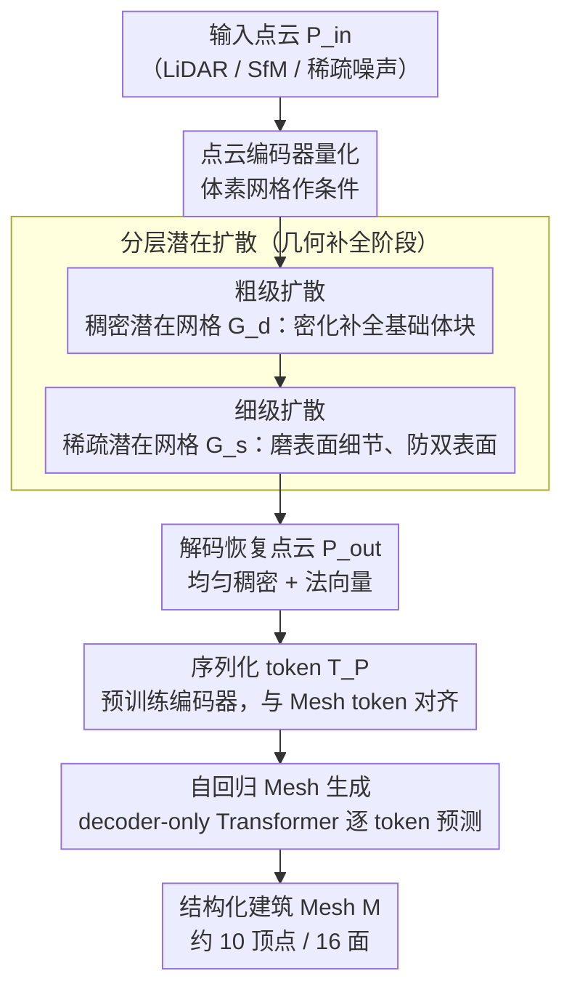

# BuildAnyPoint: 3D Building Structured Abstraction from Diverse Point Clouds

**会议**: CVPR 2026  
**arXiv**: [2602.23645](https://arxiv.org/abs/2602.23645)  
**代码**: [项目页](https://ai4city-hkust.github.io/BuildAnyPoint/)  
**领域**: Autonomous Driving / 3D Vision / 城市重建  
**关键词**: 建筑抽象重建, 点云补全, 潜在扩散, 自回归Mesh生成, 级联生成框架  

## 一句话总结

提出BuildAnyPoint，通过**松耦合级联扩散Transformer(Loca-DiT)**实现从多样分布的点云（机载LiDAR、SfM、稀疏噪声点云）到结构化3D建筑Mesh的统一重建——先用分层潜在扩散恢复底层点云分布，再用自回归Transformer生成紧凑多边形Mesh。

## 研究背景与动机

**领域现状**：从城市点云恢复轻量3D建筑模型是数字孪生、导航、灾害仿真等应用的关键需求。现有方法包括基于优化的（平面检测+组装）和基于学习的方案，但通常**只能处理特定分布的点云**。

**现有痛点**：
   - Point2Building：首创直接从点云自回归生成Mesh，但单步自回归经常产生**几何歧义**和mesh-点云错位
   - ArcPro：引入建筑语法中间表示降低歧义，但受限于**预定义几何体**（如柱体拉伸），无法处理倾斜屋顶等复杂结构，且假设每个模块有相对完整的局部点云

**核心矛盾**：如何既保持对任意点云分布的**泛化性**，又确保生成Mesh的**结构一致性和几何精度**？直接将异构点云输入自回归Mesh生成器效果差，因为这些生成器需要高质量、干净、完整的点云。

**本文目标**：构建首个**通用框架**，从任意分布的点云（LiDAR、SfM、极稀疏噪声）恢复结构化建筑抽象Mesh。

**切入角度**：利用**显式3D生成先验**约束解空间——与其直接从异构点云生成Mesh，不如先恢复背后的均匀密集点云分布，再交给已有的高质量Mesh生成器。

**核心idea**：松耦合级联 = 分层潜在扩散（恢复分布）+ 自回归Transformer（生成Mesh），通过一系列潜在空间转换渐进弥合非结构化点云→结构化Mesh的模态鸿沟。

## 方法详解

### 整体框架

Loca-DiT（图3）学习条件分布 $p_\text{BAP}(\mathcal{M} | \mathcal{P}_{in})$，分解为两个阶段：

1. **几何补全阶段**（潜在扩散）：$p(\mathcal{P}_{out} | \mathcal{P}_{in})$ — 从稀疏/噪声点云恢复均匀密集的完整点云
2. **结构化Mesh生成阶段**（自回归Transformer）：$p(\mathcal{M} | \mathcal{P}_{out})$ — 从恢复的点云自回归生成Mesh token序列

整条流水线沿着「三级潜在空间」逐段填平点云→Mesh 的模态鸿沟：异构输入先被分层潜在扩散恢复成均匀稠密点云，再序列化成 token 交给自回归 Transformer 吐出结构化 Mesh。

（图中三个潜在表示 G_d / G_s / T_P 即「三级潜在空间转换」，分层扩散与自回归生成分别对应两个阶段。）

### 关键设计

**1. 三级潜在空间转换：让点云阶段和 Mesh 阶段各用最顺手的表示**

直接把异构点云喂给自回归 Mesh 生成器之所以失败，根子在表示错配——点云的几何细节天然适合在连续、稠密的潜在空间里刻画，而 Mesh 的拓扑结构需要离散、序列化的 token 才好逐步生成。本文不强求一套表示通吃，而是按阶段铺了三层潜在空间，让模态鸿沟一段一段被填平。第一层是**稠密潜在网格 $\mathcal{G}_d$**：把 GT 点云低分辨率体素化后过稀疏 VAE，关键动作发生在瓶颈层——把稀疏网格**密化**成稠密网格，于是解码器不仅看到"有点的地方"，也看到"没点的地方"，能像雕刻一样把未占用区域也推断出来，给出完整的空间上下文。第二层是**稀疏潜在网格 $\mathcal{G}_s$**：换高分辨率体素化再过稀疏 VAE，专门补几何细节。第三层是**序列化 token $\mathcal{T}_P$**：用预训练点云编码器把恢复出来的点云压成固定长度 token，刻意与目标 Mesh 的 token 序列 $\mathcal{T}_M$ 对齐，这样自回归阶段就能把"点云条件"和"待生成 Mesh"放进同一个序列里处理。三层各管一段，每个阶段都能在最合适的空间里专精，而不是逼一个表示同时擅长几何细节和拓扑生成。

**2. 分层潜在扩散：先恢复粗形状，再补表面精度**

输入点云稀疏、带噪、分布各异，想一步直接去噪出干净完整的几何很容易跑飞。本文把恢复过程拆成粗、细两级扩散，串在前面的两层潜在网格上。粗级扩散 $p_{\theta_d}(\mathcal{G}_d \mid \mathcal{P}_{in})$ 在稠密网格上去噪，先把建筑的基础形状立起来；细级扩散 $p_{\theta_s}(\mathcal{G}_s \mid \mathcal{G}_d)$ 以粗级结果为条件，在高分辨率的稀疏网格上去噪，把表面细节磨出来。两级都用标准去噪目标

$$\min_\theta \ \mathbb{E}\big[\|\epsilon - \epsilon_\theta(\mathbf{z}_t, t)\|_2^2\big]$$

条件化的做法是把输入点云 $\mathcal{P}_{in}$ 经点云编码器量化成体素网格，再拼到潜在特征上一起去噪。先粗后细之所以比单级扩散稳，是因为基础结构一旦定下来，细级只需在局部精修，搜索空间被大幅约束——消融里也印证了这点：去掉粗级 $\mathcal{G}_d$ 恢复出的点云会一团乱，去掉细级 $\mathcal{G}_s$ 则会出现误导后续 Mesh 生成的"双表面"效应。

**3. 自回归 Mesh 生成：用恢复好的点云模拟"艺术级"干净输入**

已有的自回归 Mesh 生成器（如 MeshAnything 这一脉）能产出低面数、拓扑紧凑的 Mesh，但它们有个硬前提：输入点云得干净、密集、完整，接近人工建模的质量。异构城市点云远达不到这个标准，这正是前两个设计存在的意义——前面分层扩散恢复出的均匀稠密点云加上法向量，刚好把这种"艺术级"输入伪造了出来。这一阶段沿用基于 MeshAnything V2 的 decoder-only Transformer，把点云 token 和已生成的 Mesh token 拼成序列 $\mathcal{T} = [\mathcal{T}_P; \mathcal{T}_M^{<t}]$，自回归地预测下一个 Mesh token，训练时最大化条件对数似然

$$\max_\phi \ \sum_{t=1}^N \log P\big(t_m^t \mid \mathcal{T}_P, \mathcal{T}_M^{<t}; \phi\big)$$

> ⚠️ 上式 token 下标以原文为准。

正因为把"恢复分布"和"生成 Mesh"解耦，Mesh 生成器无需自己面对脏点云，只管在干净条件上发挥，结构一致性和几何精度都更有保障。

### 一个完整示例

以一段机载 LiDAR 扫到的单栋建筑稀疏点云 $\mathcal{P}_{in}$ 为例，走一遍 Loca-DiT 的两阶段流水线：

1. **粗级扩散**：$\mathcal{P}_{in}$ 先被点云编码器量化成体素网格作为条件，粗级扩散在稠密潜在网格 $\mathcal{G}_d$ 上去噪——瓶颈层的密化让模型连没采到点的墙面、屋顶区域也补上，输出建筑的基础体块。
2. **细级扩散**：以 $\mathcal{G}_d$ 为条件，细级扩散在高分辨率稀疏潜在网格 $\mathcal{G}_s$ 上去噪，磨出倾斜屋顶、墙角这类表面细节，避免"双表面"。
3. **序列化**：解码得到均匀稠密的恢复点云 $\mathcal{P}_{out}$（带法向量），过预训练点云编码器压成固定长度 token 序列 $\mathcal{T}_P$。
4. **自回归生成**：Transformer 以 $\mathcal{T}_P$ 为条件逐 token 吐出 Mesh，最终拼成结构化建筑 Mesh $\mathcal{M}$——主实验里这样一栋楼平均只需约 10 个顶点、16 个面就能表达，失败率为 0。

关键在于：第 4 步的生成器从头到尾没见过原始的脏稀疏点云 $\mathcal{P}_{in}$，它面对的只是前三步伪造出的"艺术级"干净点云，这正是级联解耦能稳定生成低面数 Mesh 的原因。

### 损失函数

- 稀疏 VAE：BCE（生成 vs 目标占用）+ KL 散度 + 法向量学习
- 扩散模型：去噪 MSE 损失
- Transformer：交叉熵 next-token prediction 损失

## 实验关键数据

### 主实验：建筑结构化抽象

| 方法 | #V↓ | #F↓ | #P↓ | FR↓ | CD↓ |
|------|-----|-----|-----|-----|-----|
| City3D（优化方法） | 173 | 72 | 14 | 6% | 0.167 |
| Point2Building（学习方法） | 20 | 34 | 18 | 1% | 0.043 |
| **BuildAnyPoint** | **10** | **16** | **8** | **0%** | **0.036** |

- **顶点数仅10个**（vs P2B的20），面数仅16（vs 34），更紧凑的低多边形Mesh
- 失败率0%，CD最低

### 点云补全基准

| 方法 | F-score↑ | CD↓ | Uniformity↓ | EMD↓ |
|------|----------|-----|-------------|------|
| PoinTr | 0.85 | 0.41 | 0.25 | 0.12 |
| AnchorFormer | 0.82 | 0.39 | 1.27 | 0.13 |
| **BuildAnyPoint** | **0.91** | **0.35** | **0.04** | **0.10** |

- 均匀性分数0.04，比所有竞争方法**低近一个数量级**

### 消融实验

| 设置 | #V↓ | #F↓ | CD↓ |
|------|-----|-----|-----|
| 无3D生成先验（直接从 $\mathcal{P}_{in}$ 生成） | 78 | 127 | 0.107 |
| **完整模型**（从 $\mathcal{P}_{out}$ 生成） | **38** | **70** | **0.034** |

- 去掉粗级 $\mathcal{G}_d$：恢复的点云混乱
- 去掉细级 $\mathcal{G}_s$：出现"双表面"效应误导后续Mesh生成
- 用传统solver替代Transformer：即使有恢复的好点云也无法生成有效表面

### 关键发现

1. **3D生成先验是关键**：无先验时CD从0.034恶化到0.107，面数从70爆增到127
2. **分层扩散二者缺一不可**：粗级提供基础形状、细级提供表面精度
3. **跨三种点云分布均有效**：LiDAR、SfM、稀疏噪声——真正实现了"BuildAnyPoint"的目标

## 亮点与洞察

1. **解耦思想出色**：不试图一步到位从异构点云生成Mesh，而是拆分为"恢复分布"+"生成Mesh"两个子问题，各用最适合的生成范式（扩散 vs 自回归）——这种级联设计哲学在其他跨模态生成中同样适用
2. **密化瓶颈的巧妙设计**：在稀疏VAE瓶颈处将稀疏网格密化，让解码器能同时看到"有"和"无"的区域进行形状推理
3. **中间产物即为SOTA**：仅作为框架中间表示的恢复点云，在建筑点云补全基准上就已达到SOTA

## 局限与展望

1. **数据集几何多样性受限**：公开建筑数据集偏向简单几何，复杂结构（如哥特式建筑、不规则形态）的建模能力受限
2. **无高度/地理坐标等先验**：未利用建筑的物理约束（如重力、对称性）和地理信息
3. **推理速度未报告**：扩散采样+自回归解码的级联可能较慢
4. 仅在The Hague/Rotterdam数据集测试，地理泛化性未知

## 相关工作与启发

- **MeshAnything系列**：从点云自回归生成Mesh的范式在快速演进，本文证明了**输入点云质量**对Mesh质量的决定性影响
- **XCube**：分层稀疏VAE+扩散的3D生成框架，本文在此基础上增加条件化和密化操作
- **松耦合级联**：将生成过程分解为概率独立的子阶段，每个阶段用最适合的生成模型——这种"分而治之"策略值得在更广泛的3D生成任务中推广

## 评分

⭐⭐⭐⭐ — 框架设计优雅，三种点云分布的通用性令人印象深刻，中间产物本身就是SOTA，但应用场景相对垂直

<!-- RELATED:START -->

## 相关论文

- [\[CVPR 2025\] WeatherGen: A Unified Diverse Weather Generator for LiDAR Point Clouds via Spider Mamba Diffusion](../../CVPR2025/autonomous_driving/weathergen_a_unified_diverse_weather_generator_for_lidar_point_clouds_via_spider.md)
- [\[CVPR 2026\] Points-to-3D: Structure-Aware 3D Generation with Point Cloud Priors](points-to-3d_structure-aware_3d_generation_with_point_cloud_priors.md)
- [\[AAAI 2026\] Understanding Dynamic Scenes in Egocentric 4D Point Clouds](../../AAAI2026/autonomous_driving/understanding_dynamic_scenes_in_ego_centric_4d_point_clouds.md)
- [\[CVPR 2025\] RENO: Real-Time Neural Compression for 3D LiDAR Point Clouds](../../CVPR2025/autonomous_driving/reno_real-time_neural_compression_for_3d_lidar_point_clouds.md)
- [\[ICCV 2025\] Robust 3D Object Detection using Probabilistic Point Clouds from Single-Photon LiDARs](../../ICCV2025/autonomous_driving/robust_3d_object_detection_using_probabilistic_point_clouds_from_single-photon_l.md)

<!-- RELATED:END -->
