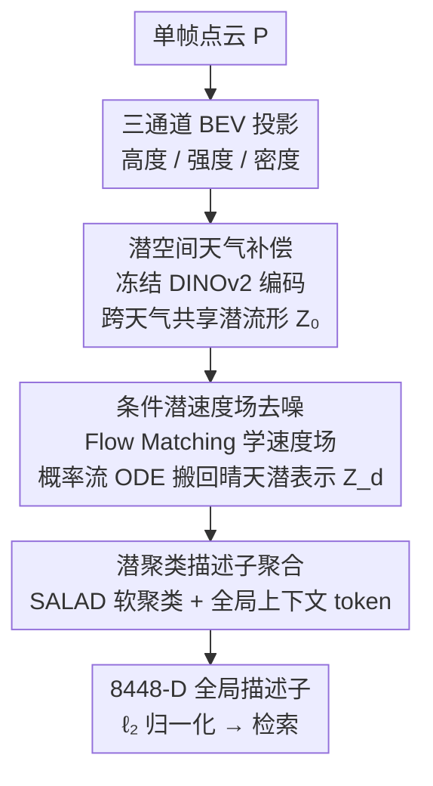

# C-LaV: Conditional Latent Velocity Field Denoising for Weather-Robust LiDAR Place Recognition

**会议**: CVPR 2026  
**论文**: [CVF Open Access](https://openaccess.thecvf.com/content/CVPR2026/html/Cao_C-LaV_Conditional_Latent_Velocity_Field_Denoising_for_Weather-Robust_LiDAR_Place_CVPR_2026_paper.html)  
**代码**: 未公开（论文未提供链接）  
**领域**: 自动驾驶 / LiDAR 地点识别  
**关键词**: LiDAR 地点识别, 天气鲁棒, Flow Matching, 潜空间去噪, BEV 检索  

## 一句话总结
C-LaV 把雨雪雾导致的 LiDAR 退化放到冻结 DINOv2 的 BEV 潜空间里去补偿——用条件 Flow Matching 学一个速度场、再解概率流 ODE 把"含天气噪声的潜表示"确定性地搬回"晴天潜表示"，最后用 SALAD 聚类头出全局描述子做检索，在 NCLT 雪天和真实 Boreas 上 Recall@1 分别提升 17.5% 和 21.5%。

## 研究背景与动机

**领域现状**：基于 LiDAR 的地点识别（place recognition）是自动驾驶城市级定位的核心环节——把当前单帧扫描编码成一个紧凑全局描述子，再去地理标注的大地图里检索最近位置。主流做法从手工几何描述子（PointNetVLAD 之后）演进到端到端学习的全局表示，骨干上有稀疏卷积体素（MinkLoc3Dv2）、BEV 投影（BEVPlace++）、2D 条件描述子（ImLPR）等多条路线。

**现有痛点**：现实里雨雪雾不是偶发而是常态，它们通过随距离衰减、体散射、虚假回波同时破坏 LiDAR 的几何与反射强度，地点识别赖以匹配的结构线索因此变得不可靠，跨天气泛化成了一个长期未解的难题。

**核心矛盾**：作者指出已有方法几乎都"在已经被天气污染的特征空间里直接学描述子"——一旦天气改变了测量分布，嵌入空间就跟着漂移。而绝大多数补救手段都停留在**信号层**（滤波、增强、点云/体素重建），并没有去干预真正形成检索表示的**潜空间**。原始点云和 BEV 图里几何、反射、稀疏度、天气伪影是缠在一起的，信号层修复也许让外观变好，却仍会扰动对检索至关重要的结构。

**本文目标**：在天气补偿这件事上换一个作用层——直接在语义编码之后、更紧凑也更面向检索的 BEV 潜空间里做去噪，并在同一编码器、同一描述子头、同一协议下公平对比"不去噪 / BEV 信号空间去噪 / 潜空间去噪"三种选择。

**核心 idea**：用一个**条件潜速度场**把含天气噪声的潜表示确定性地"运输"回晴天潜表示——以冻结 DINOv2 给出的跨天气共享流形为锚点，用 Flow Matching 学速度场、用概率流 ODE 求解去噪，整个过程不重建任何 BEV 图或点云，只把检索相关的结构搬回干净流形。

## 方法详解

### 整体框架
C-LaV 要解决的是"如何在不重建几何的前提下，让恶劣天气下的 LiDAR 单帧也能产出和晴天一致的检索描述子"。它把"点云 → 描述子"分解成四个模块的复合 $D = \Omega(P),\ \Omega = h \circ \psi \circ E \circ \phi$，对应三个串行阶段：先把单帧点云投影成三通道 BEV 图（高度/强度/密度），用**冻结**的 DINOv2 编码成一个跨天气共享的语义潜网格（Stage 1）；然后在这个潜流形上用 Flow-Matching 训练的条件 DiT 做去噪、把含噪潜表示搬回晴天潜表示（Stage 2）；最后由 SALAD 聚类头把去噪后的潜 token 聚合成 8448 维全局描述子（Stage 3），$\ell_2$ 归一化后做基于检索的地点识别。

关键在于：去噪只发生在潜空间、不改变空间分辨率（潜网格固定为 $768\times32\times32$，即 1024 个 token），训练和推理都在"经 ODE 去噪后的潜表示"上进行，保证学描述子和做检索用的是同一种表示。

### 关键设计

**1. 潜空间天气补偿：把去噪从信号层挪到冻结语义流形上**

这一条直接针对"在被污染的特征空间里学描述子"这个根因。C-LaV 先用 BEV 投影算子 $\phi$ 把单帧点集离散成 $448\times448\times3$ 的栅格图 $I=\phi(P)$，三个通道分别是每格的归一化最大高度、平均反射强度、归一化点数；再用一个 **DINOv2-Base（ViT/14）冻结**编码器 $E$ 把 BEV 切成 $14\times14$ 的 patch、投到 768 维、过 12 层 ViT，去掉 class token 后 reshape 得到潜网格 $Z_0 = E(I) \in \mathbb{R}^{768\times32\times32}$。

为什么是"冻结"且放在编码之后？因为参数冻结意味着 $Z_0$ 是一个**固定的、语义上有意义、且跨所有天气共享**的特征流形——晴天和雨雪雾被映到同一坐标系里，天气退化就表现为这个流形上的一个可建模偏移，而不是一个会随天气漂移的嵌入空间。相比在原始 BEV/点云这种几何、反射、稀疏度、天气伪影缠绕的信号层修复，潜空间更紧凑、更面向检索，去噪也更聚焦于"检索相关的结构"。这是全篇的出发点：天气补偿不必只在信号级做。

**2. 条件潜速度场去噪：用 Flow Matching + 概率流 ODE 把含噪潜表示搬回晴天**

这是方法的核心，针对"如何在潜空间确定性地消除天气退化"。给定含噪 BEV 和它的晴天配对，冻结编码器分别产出 $Z_{noisy}=E(X_{noisy})$ 与 $Z_{clean}=E(X_{clean})$，目标是在 $Z_{noisy}$ 条件下得到 $Z_d \approx Z_{clean}$。作者按条件 Flow Matching 引入辅助对 $z_0 \sim \mathcal{N}(0,I)$、$z_1=Z_{clean}$，定义线性插值路径

$$z_t = (1-(1-\sigma_{min})t)\,z_0 + t\,z_1,\quad t\in[0,1]$$

其对时间的导数就是真值速度 $v_t(z_t|z_1) = z_1 - (1-\sigma_{min})z_0$（对固定的 $(z_0,z_1)$ 在 $t$ 上是常数）。用一个 DiT 骨干参数化条件速度场 $\hat{v}_t = F_\theta(z_t, t, Z_{noisy})$，以含噪潜表示作为条件，训练目标是预测速度与真值速度的均方误差：

$$\mathcal{L}_{CFM} = \mathbb{E}_{z_0,z_1,t}\big[\,\|F_\theta(z_t,t,Z_{noisy}) - v_t(z_t|z_1)\|_2^2\,\big]$$

学好速度场后，去噪被表述成求解一个确定性 ODE $\frac{dz_t}{dt} = F_\theta(z_t,t,Z_{noisy})$，从 $z_0\sim\mathcal{N}(0,I)$ 出发、在固定条件 $Z_{noisy}$ 下从 $t{=}0$ 积分到 $t{=}1$，把高斯样本搬到去噪潜表示 $Z_d = z_1 \approx Z_{clean}$。实际用 Euler/Heun 等显式求解器、少量步数迭代 $z_{t_{k+1}} = z_{t_k} + \Delta t\, F_\theta(z_{t_k}, t_k, Z_{noisy})$，论文取 $T\approx 50$ 步在精度和效率间折中。

它的妙处在于：整个去噪是**确定性、条件引导**的（概率流 ODE 而非随机采样），且**不重建任何 BEV 图或点云**，直接作用于检索相关的结构，把鲁棒性和显式几何重建解耦开。消融里它对比的正是把同一去噪器换成 DDPM——结果显示"学条件速度场 + ODE 采样"比"面向重建的 DDPM 去噪"更适合天气鲁棒检索。

**3. 潜聚类描述子聚合：SALAD 软聚类把去噪潜网格压成可检索描述子**

去噪给出干净潜网格 $Z_d$ 后，需要聚成一个定长全局描述子，这一条用的是 SALAD（Sinkhorn Aggregation of Local Descriptors）软聚类头。先把 $Z_d$ 摊平成 $N_\ell=32\times32$ 个空间 token $\{f_i\}$、各自线性投到 $d_c=128$ 维，再对 $K=64$ 个可学习簇原型 $\{w_k\}$ 做带温度的软分配 $a_{ik} = \frac{\exp(f_i^\top w_k/\tau_a)}{\sum_{k'}\exp(f_i^\top w_{k'}/\tau_a)}$，簇描述子是 token 特征的加权平均 $u_k = \sum_i a_{ik} f_i$；同时一个全局上下文 token $g$ 注意力汇聚所有空间 token 得到 $g_{att}=\text{Attn}(g,\{f_i\})$。最终描述子是全局上下文与所有簇描述子的拼接

$$D = [g_{att};\, u_1;\, \dots;\, u_K] \in \mathbb{R}^{256 + K\cdot 128} = \mathbb{R}^{8448}$$

$\ell_2$ 归一化后用于检索。这样做的好处是描述子同时编码了**场景级上下文**（全局 token）和**局部结构**（簇描述子）的全局-局部融合，配合后面 truncated Smooth-AP 损失，在强外观漂移下仍保持判别力——消融显示把 NetVLAD 换成这个潜聚类头，NCLT 这类域漂移更强的数据上 R@1 涨幅尤其明显。

### 损失函数 / 训练策略
训练联合优化"潜空间去噪损失"和"面向检索的排序损失"。去噪用稀疏感知版的 Flow Matching 损失 $\mathcal{L}_{denoise} = \mathbb{E}_{x,t,p(z_0),q(z_1)}\, w(x)\,\|\hat{v}_t - v_t\|_2^2$，其中权重 $w(x)$ 上调前景格（被占据/高回波区域）、下调背景，以缓解 LiDAR 稀疏性。检索用 truncated Smooth-AP $\mathcal{L}_{TSAP} = 1 - \frac{1}{B}\sum_i AP_i$，用 logistic 函数对余弦相似度 $S_{ij}=d_i^\top d_j$ 做软排名计数、只保留每个 query 的 top-$K_{pos}$ 正样本以稳定梯度（GPS 监督下 10 m 内为正、50 m 外为负）。总损失为

$$\mathcal{L} = \mathcal{L}_{denoise} + \lambda_{desc}\mathcal{L}_{TSAP} + \lambda_{lat}\,\|Z_{noisy} - Z_{clean}\|_2^2$$

最后一项潜一致性约束是可选的（默认 $\lambda_{lat}=0$，只在需要更紧对齐时开启）。⚠️ 关于 $\sigma_{min}$、$\lambda_{desc}$、$\tau_a$、$\tau_1$ 等具体取值原文正文未给全，以原文及补充材料为准。

## 实验关键数据

统一基准基于 KITTI、NCLT、Boreas 构建：所有数据集都按 3 m 间距重采样以减少近重复视角，10 m 内为正样本、50 m 外为负样本、中间忽略，每帧统一转成 $448\times448$ 三通道 BEV。KITTI、NCLT 用基于物理的模型合成雨雪雾扫描；Boreas 是真实恶劣天气、无原生干净/含噪对，作者用同一 GPS 路点对齐跨趟帧构造代理配对。

### 主实验
跨三个数据集的 Recall@1 / Recall@5（%），Boreas 无雾天数据：

| 方法 | KITTI 雨 | KITTI 雾 | KITTI 雪 | NCLT 雪 | Boreas 雨 | Boreas 雪 | 平均 R@1/R@5 |
|------|----------|----------|----------|---------|-----------|-----------|--------------|
| MinkLoc3D v2 | 46.16/65.15 | **67.07**/87.78 | 69.28/88.37 | 30.81/51.62 | 65.52/86.32 | 32.47/57.68 | 48.99/71.95 |
| BEVPlace++ | 41.31/61.72 | 56.46/78.18 | 68.81/83.60 | 42.60/63.00 | 56.38/84.21 | 52.37/81.21 | 54.37/82.71 |
| ImLPR | 43.36/65.65 | 59.62/89.13 | 72.28/90.31 | 44.14/66.28 | 58.26/86.29 | 47.63/81.98 | 52.94/84.14 |
| ResLPR | 23.52/32.50 | 27.22/39.68 | 56.32/75.63 | 31.26/53.68 | 39.65/74.26 | 35.13/60.02 | 37.39/67.14 |
| **C-LaV（本文）** | **46.97/67.88** | 62.73/85.45 | **77.60/95.23** | **46.41/69.11** | **79.66/98.31** | **71.98/94.83** | **75.82/96.57** |

雪天提升最显著（KITTI 雪 R@1 77.60% 比 ImLPR 高 +5.3 点）；真实 Boreas 上把最优基线 mid-50% 的平均 R@1 拉到 75.82%、R@5 拉到 96.57%，雨雪上 R@1 普遍领先 15–20 点。雾天相对平淡（KITTI/NCLT 雾不及 MinkLoc3D v2），作者解释雾主要扭曲深度、让远距结构在 BEV 里坍塌，而体素法能更好保留高度感知线索。

### 消融实验
沿 BEV 编码器 / 潜去噪器 / 描述子头三条轴逐步替换（KITTI / NCLT 各天气平均）：

| 配置 | BEV 编码器 | 潜去噪 | 描述子头 | KITTI R@1/R@5 | NCLT R@1/R@5 |
|------|-----------|--------|----------|---------------|--------------|
| C-LaV-1 | DINOv2-S | DDPM | NetVLAD | 11.17/25.75 | 5.40/17.61 |
| C-LaV-2 | DINOv2-B | DDPM | NetVLAD | 30.45/51.20 | 16.80/38.55 |
| C-LaV-3 | DINOv2-B | 速度场+ODE | NetVLAD | 50.15/71.90 | 27.35/53.80 |
| **C-LaV（Full）** | DINOv2-B | 速度场+ODE | 潜聚类 | **62.83/82.75** | **34.52/60.16** |

### 关键发现
- **三个组件依次叠加都显著涨点，且都不可省**：S→B 编码器使 KITTI R@1 从 11.17% 翻到 30.45%（近 3 倍），说明强 BEV 语义是跨天气检索的前提；DDPM→速度场+ODE 把 KITTI R@1 再从 30.45% 拉到 50.15%，证明"学条件速度场"优于"面向重建的 DDPM 去噪"；NetVLAD→潜聚类把 KITTI R@1 从 50.15% 拉到 62.83%、NCLT 从 27.35% 拉到 34.52%。
- **去噪作用层的对照**最有说服力：同一冻结 DINOv2 + 同一 SALAD 头下，不去噪 KITTI 平均 R@1 仅 29.32%，BEV 信号空间 U-Net 去噪只到 37.00%，而潜空间 Flow Matching 达到 62.84%——直接量化了"潜空间去噪 ≫ 信号空间去噪"。
- **场景差异**：Boreas 真实数据反而 recall 更高（雪 R@1 71.98%），因为真实雨雪强度温和、扫描更密，残余干净信号足以引导 ODE 去噪；雾天则是该方法相对软肋。

## 亮点与洞察
- **去噪作用层的转移**是真正的"啊哈"点：把天气补偿从信号层搬到冻结语义潜流形上，用一组同编码器/同描述子/同协议的对照（29.32% → 37.00% → 62.84%）干净地证明了这个选择的价值，论证逻辑比单纯刷 SOTA 更有说服力。
- **用 Flow Matching 的速度场 + 概率流 ODE 做"确定性去噪"**而非随机采样，且全程不重建几何，把鲁棒性和显式重建解耦——这套"denoise-then-retrieve in latent space"范式作者明确指出是模态无关的，可迁移到相机、雷达输入。
- **训练-推理一致性**：始终在 ODE 去噪后的潜表示上学描述子、做检索，避免了"训练用干净、推理用含噪"的表示错配，是个容易被忽视但很关键的工程取舍。

## 局限与展望
- 作者承认：基准只覆盖雨雾雪三种常见天气，更极端现象、长期环境变化、异构传感器配置都没探索。
- 潜 Flow-Matching DiT 因 ODE 去噪（$T\approx50$ 步）比前馈基线计算量大、推理成本高。
- 依赖代理的含噪/干净 BEV 配对（尤其 Boreas 用 GPS 路点对齐跨趟帧），配对若在结构/视角上未精确对齐会限制监督保真度，学到的去噪未必覆盖所有真实退化。
- 自己的观察：雾天明显弱于体素法，说明该方法对"深度坍塌型"退化（点数保留但远距结构模糊）补偿有限；且整套依赖晴天配对，纯无配对真实场景的可扩展性存疑。

## 相关工作与启发
- **vs MinkLoc3D v2 / BEVPlace++ / ImLPR**：它们都在被天气污染的特征空间里直接学描述子（体素、BEV、2D 条件描述子），天气一变嵌入空间就漂移；C-LaV 在冻结语义潜空间先把含噪表示搬回晴天再检索，雨雪天大幅领先，仅雾天不及体素法。
- **vs 信号层去噪（点/体素/图像滤波、增强、重建）**：这些只在信号层抑噪、对检索语义保留有限（同设定下 BEV U-Net 仅 37.00% R@1）；本文把去噪移到潜空间（62.84%），证明"潜空间补偿 > 信号空间补偿"。
- **vs DDPM 式潜去噪**：消融显示在同等前端容量下，条件速度场 + ODE 比面向重建的 DDPM 更适合天气鲁棒检索（KITTI R@1 50.15% vs 30.45%），启示"检索任务的潜去噪"应优先确定性的 Flow Matching 而非随机扩散。

## 评分
- 新颖性: ⭐⭐⭐⭐⭐ 首次把条件 Flow Matching 速度场 + ODE 去噪用到 LiDAR 潜空间天气补偿，作用层转移有清晰立论
- 实验充分度: ⭐⭐⭐⭐ 三数据集 × 三天气 + 三轴消融 + 去噪作用层对照齐全，但缺代码与更多超参敏感性
- 写作质量: ⭐⭐⭐⭐⭐ 动机推导和方法公式交代清晰，图文对照到位
- 价值: ⭐⭐⭐⭐ 显著提升真实恶劣天气检索且范式模态无关，但 ODE 推理成本与配对依赖限制落地

<!-- RELATED:START -->

## 相关论文

- [\[CVPR 2026\] Hybrid Robust Collaborative Perception with LiDAR-4D Radar Fusion under Adverse Weather Conditions](hybrid_robust_collaborative_perception_with_lidar-4d_radar_fusion_under_adverse_.md)
- [\[CVPR 2026\] Structure-to-Intensity Diffusion for Adverse-Weather LiDAR Generation](structure-to-intensity_diffusion_for_adverse-weather_lidar_generation.md)
- [\[CVPR 2026\] Learning Geometric and Photometric Features from Panoramic LiDAR Scans for Outdoor Place Categorization](learning_geometric_and_photometric_features_from_p.md)
- [\[CVPR 2026\] RaUF: Learning the Spatial Uncertainty Field of Radar](rauf_learning_the_spatial_uncertainty_field_of_radar.md)
- [\[CVPR 2025\] ForestLPR: LiDAR Place Recognition in Forests Attentioning Multiple BEV Density Images](../../CVPR2025/autonomous_driving/forestlpr_lidar_place_recognition_in_forests_attentioning_multiple_bev_density_i.md)

<!-- RELATED:END -->
