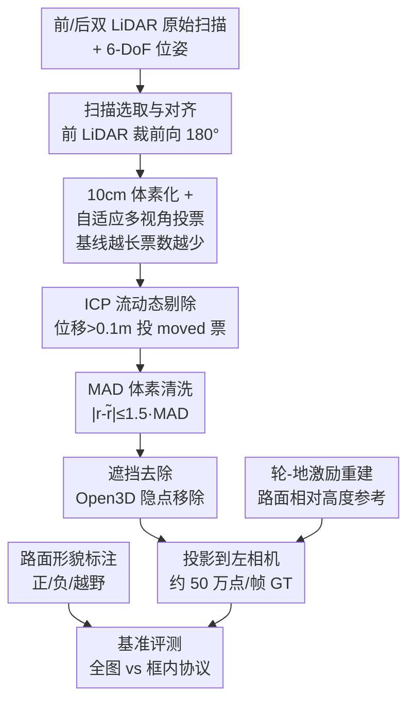

# CARD: A Multi-Modal Automotive Dataset for Dense 3D Reconstruction in Challenging Road Topography

**会议**: CVPR 2026  
**arXiv**: [2605.05014](https://arxiv.org/abs/2605.05014)  
**代码**: 数据集主页 https://card.content.cariad.digital ，数据托管于 https://huggingface.co/CARD-Data  
**领域**: 自动驾驶 / 3D 重建 / 深度估计数据集  
**关键词**: 自动驾驶数据集, 准稠密深度真值, 多 LiDAR 融合, 路面不规则形貌, 深度补全基准

## 一句话总结
CARD 是一个面向"非平整路面"（减速带、坑洼、不规则与越野路段）的多模态自动驾驶数据集，通过一套新颖的多 LiDAR 融合真值生成管线，给每帧图像提供约 50 万个 LiDAR 实测深度点（约为 KITTI Depth Completion 的 6.5 倍），并配套路面形貌 2D 标注框、轮-地接触点激励轨迹和标准化评测协议，专门用来评估细粒度路面几何的深度估计/补全能力。

## 研究背景与动机
**领域现状**：过去十年自动驾驶的进步很大程度上由大规模多传感器数据集（KITTI、Waymo、nuScenes、Argoverse、ONCE、PandaSet、A2D2、ZOD 等）推动，但这些数据集几乎都采集自铺装良好的平整城市/高速路面，关注的是交通参与者、语义和长距离感知。

**现有痛点**：作者指出两个具体缺口。其一，绝大多数驾驶数据集只提供**单帧稀疏 LiDAR** 作为深度真值——这种稀疏点云不足以评估"细粒度几何"，比如一个坑有多深、减速带的剖面形状如何。其二，专门针对路面形貌的数据集要么视角异常（RSRD 用朝下相机，只拍路面、缺少前向场景，且只有约 1.6 万对立体图），要么场景单一（TartanDrive 只在一个越野场地用全地形车采集）。

**核心矛盾**：自动驾驶要在多样路面上安全行驶，而路面坑洼/减速带恰恰是事故诱因和驾驶员从自动驾驶接管的主要触发点；但现有数据要么"路面几何不密、测不准"，要么"密了却不是真实前向驾驶视角"。两者无法兼得，导致非平整路面这一安全关键场景长期缺乏可严肃训练/评测的监督信号。

**本文目标**：构建一个**前向相机视角 + 准稠密 3D 几何真值 + 显式路面形貌标注**三者兼具的数据集，填补"密集真实路面几何"这一缺失的 regime。

**切入角度**：与其用立体一致性（stereo consensus）来加密——它在低视差、远距离时会把细小路面几何过滤掉——不如用**多 LiDAR 多视角投票**聚合，保证真值"全部由 LiDAR 实测"且能保留厘米级细节。

**核心 idea**：用一辆量产级带前后双 LiDAR 的车，在德国/意大利 12+9 座城市跨 ~110 km 录制连续序列；通过一套多 LiDAR 融合 + 动态剔除 + 遮挡去除的真值管线，把稀疏扫描聚合成每帧约 50 万点的准稠密深度真值，并据此搭建专评路面不规则形貌的基准。

## 方法详解

### 整体框架
这是一篇数据集论文，"方法"主要体现在**如何把多次稀疏 LiDAR 扫描，可靠地聚合成每帧约 50 万点、且严格 LiDAR 实测的准稠密深度真值**，以及围绕它的传感器标定、轮-地激励重建与形貌标注/评测协议。

采集平台为一辆 2024 款 Porsche E-Macan（带自适应空气悬挂以稳定底盘高度，避免载荷变化破坏"传感器-路面"外参）。传感器套件：2× Hesai XT32 旋转 LiDAR（前/后各一）、2× IDS 全局快门立体相机、由 LiDAR-惯性里程计得到的 6-DoF 位姿、每轮运动轨迹、完整标定。数据规模：118 段序列、约 17.5 万对立体图、跨 ~110 km 与 4.7 小时；按路面形貌和地理位置分层抽样划分为 ~3.3 万训练 / ~1.1 万验证 / 1.6 万测试对，另留 5 段完整序列做零样本时序评测。

真值生成是整条管线的核心，自上而下依次为：扫描选取对齐 → 体素化与自适应多视角投票 → ICP 流动态剔除 → MAD 体素清洗 → 遮挡去除，最后投影到左相机得到逐图像稠密 GT。下图给出真值构建流程：

### 关键设计

**1. 多 LiDAR 融合准稠密真值管线：用多视角投票而非立体一致性保留厘米级路面几何**

痛点是：单帧稀疏 LiDAR 测不出细粒度几何，而立体一致性加密又会因低视差/远距离把细小路面起伏过滤掉。作者的做法是把整段序列的所有扫描经运动补偿后聚合进体素网格，再逐步过滤出静态环境。关键在于**自适应多视角投票**：空间离散为 10 cm 立方体素，对每个体素累计来自前/后 LiDAR 的独立观测；一个视角只有当其传感器原点与已接受原点至少相距 3 cm 时才投一票，从而每票对应一个不同的运动基线 $b$（前向已接受原点间距离）。短基线下需要更多确认票、长基线下少量票即可接受——实践中前 LiDAR 所需票数随 $b$ 从 0.20 m 增到 0.90 m 时由 4 降到 1，后 LiDAR 由 2 降到 1；体素须同时满足前后两路基线条件阈值才被保留为静态。这样既聚合出稠密点云（约 50 万点/帧，约覆盖图像中场景相关结构的 18%），又因为"全部由 LiDAR 实测 + 几何投票确认"而保住了立体方法会抹掉的细节

**2. 动态剔除 + 鲁棒体素清洗：把行人/过车从静态路面几何中彻底抠掉**

聚合多帧扫描的副作用是移动物体会被错误地"固化"进静态路面体素。作者用两道串联过滤来抠除：先做 **ICP 流（ICP flow）**——对原点相距 ≥0.5 m 的扫描对用 voxelized GICP 配准，逐体素算三维残差位移，残差 >0.10 m 记一次 moved 票，累计 ≥2 票的体素判为动态并移除（对行人这类慢速移动者尤其有效）；再做 **MAD 体素清洗**——对每个存活体素，以点到体素中心的半径 $r_i$ 取中位数 $\tilde r$，定义 $\mathrm{MAD}=\mathrm{median}(|r_i-\tilde r|)$，只保留满足 $|r_i-\tilde r|\le 1.5\,\mathrm{MAD}$ 的点、且体素剩余点 <2 时整体丢弃。这一步专门清掉残留移动者的离群返回（如过车轮胎点被混进静态路面）。对人工复查仍有残余动态的序列，再追加 MDE 一致性过滤：用 DepthAnything 预测深度并拟合稀疏前向 LiDAR，剔除绝对相对误差 >15%（略高于 DepthAnything 典型误差）的点

**3. 轮-地激励重建：给出随时间变化的"传感器-路面"外参与路面相对高度参考**

路面形貌（坑/包）相对全局环境只引起极小的几何偏差，要评估它就需要一个精确的"当前路面"参考系。作者定义**轮激励（wheel excitation）**为每个轮胎接地点的轨迹：基于标定阶段静止时 IMU 与各轮接地点的刚性外参，把它作用到自车位姿得到无悬挂假设下的近似地面路径；再收集该路径附近窄走廊内（受轮胎印迹与悬挂行程限制）的 LiDAR 返回，把每点沿路径距离与沿悬挂轴的相对高度降为 1D 样本；用 Ceres + Tukey 鲁棒损失对"距离-高度"样本拟合平滑三次样条，读出每个时刻的竖直偏移加回近似路径，得到轮激励轨迹。它提供任意时刻的传感器-路面外参，让深度/点云可被表达为"相对当前路面的高度"——这正是 height 类指标（Abs. Diff、$\delta_{10}$ cm）能够计算的基础

**4. 路面形貌标注 + 双协议基准：把评测聚焦到真正考验细粒度几何的区域**

如果只在全图上算深度指标，路面坑包这种局部小起伏会被海量背景像素淹没。为此作者提供面向形貌的 2D 框标注：定义**正形貌**（凸起，如减速带）和**负形貌**（凹陷，如坑洼），用半自动管线生产——先人工标注 40% 子集训练一个 YOLOv8，再辅助标注剩余 60%；越野段因整面可行驶面都不规则，改用逐序列标签而非局部框。这些框的目的明确是"评测这些关键区域的 3D 重建精度"，而非标准 2D 检测。基准随之提供两种评测协议：**全图（F）** 与**仅框内（B）**，后者把指标限定在不规则区域，从而能直接暴露模型在路面细节上的真实表现

### 损失函数 / 训练策略
基准侧的微调实验给出一个有价值的训练经验：直接用标准 $L_1$ 损失微调收益微乎其微——模型会优先拟合全局尺度与结构、忽略局部路面形貌；而把 MoGe2L 的仿射不变损失与一个**高度空间的 $L_1$ 损失**结合后，性能大幅提升（即表 3 中的 MoGe2L†）。深度补全侧也提出一个改造：保留 DMD3C 的蒸馏管线，但把单目教师换成立体的 FoundationStereo，并把尺度不变损失换成度量深度上的直接 $L_1$（因为立体教师天然提供度量深度）。

## 实验关键数据

### 数据集规模对比（表 1，相对现有驾驶数据集）

| 数据集 | 城市/站点 | 平均 GT 点/相机 | 越野 | 减速带/坑 | 不规则路 |
|--------|-----------|------|------|------|------|
| KITTI-DC | 1 城 (DE) | 75K | × | 低 | 低 |
| Waymo | 3+ 城 (US) | 24K | × | 低 | 低 |
| DrivingStereo | (CH) | 75K | × | 低 | 低 |
| nuScenes | 2 城 | 7.6K | × | 低 | 低 |
| RSRD-Dense | 1 城 (CH) | 90K | × | ✓ | ✓ |
| TartanDrive 2.0 | 1 站 (US) | 34K | ✓ | 低 | ✓ |
| **CARD (ours)** | **12 城 (DE)/9 城 (IT)** | **500K** | ✓ | ✓ | ✓ |

关键数字：CARD 每帧约 50 万有效深度像素，约为 KITTI-DC 的 6.5×、为其他公开驾驶数据集平均的 10×；覆盖 ~110 km、4.7 小时，是唯一同时具备"越野 + 减速带/坑 + 不规则路 + 城市场景 + 前向相机 + 超高真值密度"的数据集。

### 深度估计基准（表 3，median scaling；F=全图，B=框内）

| 方法 | 类型 | AbsRel(F) | AbsRel(B) | Height Abs.Diff(F) | Height $\delta_{10}$(F) |
|------|------|------|------|------|------|
| DAV2 | 单目零样本 | 0.096 | 0.055 | 0.181 | 0.578 |
| Metric3D2 | 单目零样本 | 0.060 | 0.039 | 0.117 | 0.675 |
| UniDepth2L | 单目零样本 | 0.046 | 0.029 | 0.117 | 0.802 |
| MoGe2L | 单目零样本 | 0.045 | 0.027 | 0.119 | 0.801 |
| **MoGe2L†** | 单目微调 | **0.029** | **0.018** | **0.051** | 0.893 |
| FS (FoundationStereo) | 立体零样本 | 0.040 | **0.014** | 0.177 | **0.892** |

### 深度补全基准（表 4，F=全图，B=框内）

| 方法 | RMSE(F)↓ | RMSE(B)↓ | AbsRel(F)↓ | $\delta_1$(F)↑ |
|------|------|------|------|------|
| BP-NET | 0.7975 | 0.1939 | 0.0211 | 0.9853 |
| DMD3C | 0.7742 | 0.1950 | 0.0225 | 0.9804 |
| **DMD3C (+FS)** | **0.7510** | **0.1918** | 0.0219 | 0.9805 |

### 关键发现
- **零样本单目深度"全局好、局部差"**：单目模型在全图深度指标上表现很强，但在路面不规则区域（框内 B 协议、尤其 height 指标）明显欠佳——这正是 CARD 框内协议设计要暴露的问题。
- **立体几何在厘米级细节上更稳**：FoundationStereo 凭借视差-深度的几何转换，在框内 AbsRel(B)=0.014、Height $\delta_{10}$(F)=0.892 上领先单目零样本模型，说明显式几何对细粒度路面更友好。
- **微调要打在"高度空间"上**：纯 $L_1$ 微调几乎无增益（模型只学全局尺度），加入高度空间 $L_1$ 后 MoGe2L† 全面跃升（AbsRel F 0.045→0.029，Height Abs.Diff 0.119→0.051），印证了路面形貌需要专门的监督信号。
- **深度补全可能"过平滑"路面**：DMD3C(+FS) 用立体教师 + 度量 $L_1$ 在全图 RMSE 上稳定改善（0.7742→0.7510），但框内指标仍不及纯立体 FoundationStereo——提示 LiDAR-图像补全有抹平有效路面形貌的风险。

## 亮点与洞察
- **"加密但不失真"的真值哲学**：坚持真值全部由 LiDAR 实测、用多视角几何投票而非立体一致性聚合，既拿到约 50 万点/帧的密度，又保住了立体方法会抹掉的厘米级路面细节——这是数据集质量的核心卖点。
- **自适应基线投票很巧**：把"需要多少票才相信一个体素"与运动基线 $b$ 挂钩（基线越长、几何越可靠、需要的票越少），是个可迁移到任意多视角点云聚合的鲁棒性 trick。
- **轮激励轨迹是隐藏宝藏**：把每个轮胎接地点重建成随时间变化的"传感器-路面"外参，既支撑了 height 类评测，又额外提供了路面激励剖面（可用于悬挂/底盘控制、舒适性建模），价值超出深度任务本身。
- **框内/全图双协议直击痛点**：用一个简单的"仅在不规则框内评测"协议，就把单目模型"全局好局部差"的问题量化暴露出来，方法论上干净有力。

## 局限与展望
- **匿名化误伤**：基于 YOLOv8 的隐私匿名化会把良性内容误模糊（假阳性），作者提供专门的上报与快速下架通道。
- **残余动态伪影**：尽管经人工复查，慢速移动物体在极少数情况下仍可能残留进静态真值；这对训练/评测细粒度几何是潜在噪声源。
- **标注面向重建而非检测**：路面不规则框是为评估 3D 重建精度设计的，不适合直接当作标准目标检测基准；且局部凹陷边界本身视觉模糊，部分形貌可能漏标。
- **可改进方向**：当前真值依赖"静态环境假设 + 后处理动态剔除"，对动态目标深度仍需借助立体蒸馏补全；后续可探索把轮激励轨迹与深度估计联合，或为动态物体提供独立的稠密真值通道。

## 相关工作与启发
- **vs KITTI / DrivingStereo（密集化数据集）**: 三者都做 LiDAR 多帧聚合密集化，但 KITTI/DrivingStereo 用立体一致性且集中在单城/平整路面；CARD 改用多 LiDAR 几何投票、刻意覆盖非平整与越野路面，真值密度约为 KITTI-DC 的 6.5×。
- **vs RSRD（路面专用数据集）**: RSRD 首次专门做路面重建，但用朝下相机只拍路面、缺乏前向场景，仅约 1.6 万对；CARD 用量产车前向相机 + 完整城市场景 + 大得多的尺度，更利于训练/评测真实前向感知。
- **vs TartanDrive（越野数据集）**: TartanDrive 用全地形车在单一越野场地重复采集，场景多样性有限；CARD 跨德/意 21 座城市、城市/郊区/乡村/越野混合，泛化性更强。
- **vs nuScenes / Waymo / Argoverse（大规模城市数据集）**: 这些数据集优先关注交通参与者与语义，深度真值稀疏（7.6K–24K 点/帧）；CARD 主攻被忽视的"稠密真实路面几何"regime，是对它们的互补而非替代。

## 评分
- 新颖性: ⭐⭐⭐⭐ 首个面向真实前向驾驶的路面形貌专用基准，多 LiDAR 投票真值管线扎实有特色，但单项技术多为已有思路的巧妙组合。
- 实验充分度: ⭐⭐⭐⭐ 覆盖单目/立体深度估计与深度补全，含全图/框内双协议与 height 指标，基准 baseline 较强；管线的定量消融放在补充材料。
- 写作质量: ⭐⭐⭐⭐ 动机与缺口论证清晰，真值管线分步讲解明确，表 1 对比一目了然。
- 价值: ⭐⭐⭐⭐⭐ 直接填补安全关键的非平整路面几何数据空白，双许可发布（德国 CC BY 4.0 / 意大利 CC BY-NC 4.0）+ 高密度真值，对深度估计/补全社区是高复用资产。

<!-- RELATED:START -->

## 相关论文

- [\[CVPR 2026\] WOD-E2E: Waymo Open Dataset for End-to-End Driving in Challenging Long-tail Scenarios](wod-e2e_waymo_open_dataset_for_end-to-end_driving_in_challenging_long-tail_scena.md)
- [\[CVPR 2026\] MeanFuser: Fast One-Step Multi-Modal Trajectory Generation and Adaptive Reconstruction via MeanFlow for End-to-End Autonomous Driving](meanfuser_fast_one-step_multi-modal_trajectory_generation_and_adaptive_reconstru.md)
- [\[CVPR 2026\] RPGFusion: 4D Radar Prior-Guided Multi-Modal Fusion for 3D Detection](rpgfusion_4d_radar_prior-guided_multi-modal_fusion_for_3d_detection.md)
- [\[CVPR 2026\] CCF: Complementary Collaborative Fusion for Domain Generalized Multi-Modal 3D Object Detection](ccf_complementary_collaborative_fusion_for_domain_generalized_multi-modal_3d_obj.md)
- [\[ICCV 2025\] UAVScenes: A Multi-Modal Dataset for UAVs](../../ICCV2025/autonomous_driving/uavscenes_a_multi-modal_dataset_for_uavs.md)

<!-- RELATED:END -->
