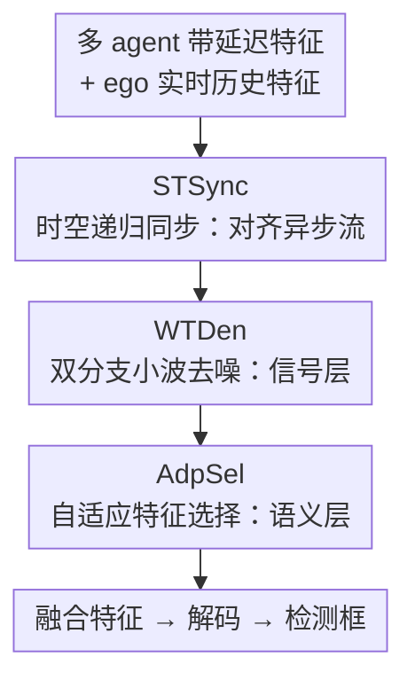

# CATNet: Collaborative Alignment and Transformation Network for Cooperative Perception

**会议**: CVPR 2026  
**论文**: [CVF Open Access](https://openaccess.thecvf.com/content/CVPR2026/html/Chen_CATNet_Collaborative_Alignment_and_Transformation_Network_for_Cooperative_Perception_CVPR_2026_paper.html)  
**代码**: 无  
**领域**: 自动驾驶  
**关键词**: 协同感知, V2X, 通信时延对齐, 多源噪声抑制, 中间特征融合  

## 一句话总结
CATNet 针对车路协同感知里"通信时延 + 多源噪声"两大现实顽疾，串联时空递归同步（STSync）、双分支小波去噪（WTDen）、自适应特征选择（AdpSel）三个模块，在 OPV2V/V2XSet/DAIR-V2X 三个数据集的带噪带延迟场景下把 AP 推到 SOTA，且参数量仅 9.95M。

## 研究背景与动机
**领域现状**：单车感知受视野和遮挡限制，多智能体协同感知通过 V2X 通信把多辆车/路侧的观测融合起来已成为主流。融合粒度分三档——早融合（共享原始点云，带宽吃不消）、晚融合（共享检测框，遮挡和远距目标信息损失大）、中间融合（共享中间特征图），其中**中间融合是公认最优范式**，近年多数工作都在这条线上刷精度。

**现有痛点**：这些方法几乎都建立在"理想通信"假设上，可一旦放到真实路况就崩。具体有两个独立又会相互放大的问题：一是**时变通信时延**——协作车特征到达 ego 车时已经过时，不同时间戳的特征空间错位，产生"鬼影"和特征碎裂，论文实测时延能让性能掉 46%；二是**多源噪声**——信道干扰、传输失真、模型偏差污染特征，点云几何结构被破坏、目标形状畸变，噪声单独能让性能掉 17%。更糟的是两者耦合：异步条件下递归处理会把高频噪声进一步放大。

**核心矛盾**：已有的时延方案（如 SyncNet 的 P-LSTM、MRCNet 的特征预测）只在单个 agent 上做**局部时间对齐**，缺乏跨 agent 的全局时空一致性建模，误差会迭代累积；已有去噪方案（知识蒸馏类如 DiscoNet 依赖干净教师、图优化类如 CoAlign 解决不了动态时延）只在**信号层**净化，忽略了残留的**语义层**不一致和上下文伪影。也就是说，对齐和去噪两条线各做各的、都做不彻底。

**本文目标**：用一个统一框架同时补偿时延错位、抑制信号噪声、清理语义伪影，且要轻量。

**核心 idea**：先做全局时空对齐（而非局部），再做"信号层去噪 + 语义层提纯"的**双级净化**——把净化拆成"先修信号、再修语义"两道工序，分别对付小波域的高/低频失真和高阶语义噪声。

## 方法详解

### 整体框架
CATNet 嵌在标准"编码器 → 传输 → CATNet → 解码器"流水线中。每个 agent $i$ 先用编码器把传感数据 $X_i^t$ 编成特征 $F_i^t$；特征经传输延迟 $\tau$ 后到达 ego 车，并通过坐标变换 $\xi_{i\to ego}^{t-\tau}$ 对齐到 ego 坐标系，得到 $\hat{F}_{i\to ego}^{t-\tau}$。CATNet 接收这一批**带延迟的协作特征**和 ego 车自身的**实时历史特征**，依次过三个模块产出融合特征 $\tilde{F}_{fused}^t$，最后解码出检测结果：

$$\tilde{F}_{fused}^t = \text{CATNet}\left(\{\hat{F}_{i\to ego}^{t'}\}_{t'\le t-\tau},\ \{F_{ego}^{t'}\}_{t'\le t}\right)$$

三个模块呈"先对齐、后净化"的串行流水：STSync 解决异步错位、把过时特征预测到当前时刻；WTDen 在信号层抑制全局/局部失真；AdpSel 在语义层筛选关键区域、剔除伪影。ego 车维护一个融合特征库（feature bank）缓存历史融合特征供 STSync 做时序预测。

### 关键设计

**1. STSync：用递归预测把过时的协作特征"补"到当前时刻**

时延的本质是 ego 车手里的协作特征都是 $t-\tau$ 时刻的旧货，直接融合就是把过去的物体位置当现在用。STSync 不做简单的逐 agent 局部对齐，而是建一个全局时序上下文递归地把特征预测到当前帧。先用 Integration 模块做多尺度多 agent 预融合：对 $N$ 个 agent 的延迟特征 $F_{agents}^{t-\tau}$ 同时做全局最大池化 $\text{Mp}$ 和平均池化 $\text{Ap}$，拼接后过 3D 卷积 $C_3$ 得到统一表示 $F_{fused}^{t-\tau} = C_3(\text{Concat}(\text{Mp}(F_{agents}^{t-\tau}),\ \text{Ap}(F_{agents}^{t-\tau})))$。

核心是 **TARU（Time-Augmented Recurrent Unit，时间增强递归单元）**：ego 车缓存最近 $K$ 帧融合历史特征 $B=(B_1,\dots,B_K)$，隐状态从最早帧初始化 $H_1=B_1$，再从 $i=2$ 到 $K$ 逐帧递归。每步做三件事：① **运动预测**——观察前两帧算运动偏移 $\Delta B_i = \text{Conv}(\text{Concat}(B_{i-2}, B_{i-1}))$；② **特征 warp**——用可变形卷积按偏移把上一帧 warp 成运动对齐特征 $\hat{B}_i = \text{DeformConv}(B_{i-1}, \Delta B_i)$；③ **状态融合**——用并行空间/通道注意力构成的 ST-Gate 算自适应门控系数 $\alpha_i$，加权混合历史上下文与当前运动信息 $S_i = (1-\alpha_i)\cdot H_{i-1} + \alpha_i \cdot \hat{B}_i$。递归到 $H_K$ 即预测特征。最后用 ego 车实时特征 $F_{ego}^t$ 作空间先验做可变形交叉注意力（DCA），把"时序预测出来的特征"锚回 ego 车"空间上准确的现实"，这一步是保证时空双对齐的关键。

**2. WTDen：在小波域做"全局 Mamba + 局部卷积"双分支信号去噪**

STSync 对齐后仍有残留伪影，且其迭代处理会放大高频噪声、agent 间固有不一致会破坏局部结构——这些都是信号层失真。WTDen 把它当作净化第一道工序，先用 2D Haar 小波变换（WT）把融合特征分解成四个子带 $F_{LL},F_{LH},F_{HL},F_{HH}$（$F_{LL}$ 是低频结构信息，其余三个是高频细节），在小波域分离并抑制噪声。

双分支各司其职：**Wavelet Mamba** 分支抓长程空间关系、纠正 agent 间全局错位，用双路渐进融合——一路从高频到低频顺序处理子带（$F_{HH}\to F_{LL}$）优先补细节损失，一路交错扫描在每个空间位置处理全部四个子带抓跨频带关联，再加反向过程保证全方向聚合，四条扫描路径经 SSM 聚合后逆小波变换还原全局对齐特征 $F_{mam}=\text{IWT}(\cdot)$。**Wavelet Convolution** 分支补局部：把四个子带拼成 $4C$ 通道张量后做层级滤波 $F_{conv}=\text{IWT}(\text{IWT}(\text{Conv}(\text{WT}(F_{wt})))\oplus \text{Conv}(F_{wt}))$，专治细粒度局部退化和单车内部噪声。两路相加 $F_{denoise}=F_{mam}+F_{conv}$。把去噪放进小波域是因为高低频天然分离，比固定阈值去噪更不容易误伤判别性特征。

**3. AdpSel：把"显著性"当语义连贯度代理，做选择性增强的语义提纯**

信号层滤波器去不掉高阶语义伪影，AdpSel 作为第二道工序专攻这个。它把显著性重定义为语义连贯度的代理，对连贯区域做上下文感知合成、把语义噪声滤掉，并在一组预设窗口尺度 $\{S_1,\dots,S_n\}$ 上迭代。每个尺度做三步：① **连贯性感知分块选择**——特征图切成不重叠块，轻量线性选择器 $\phi(\cdot)$ 给每块打分得分图 $\Phi_{S_i}$，取 top-$k\%$ 块为选中特征，二值掩码 $M_{S_i}^{topk}=\text{TopK}(\Phi_{S_i})$，选中 $F^{selected}=M^{topk}\odot F$、未选中 $F^{unselected}=(1-M^{topk})\odot F$；② **层级掩码精化**（本模块关键创新）——细尺度 $S_i$ 丢弃的低显著区域上采样后并入下一更粗尺度 $S_{i+1}$ 的初始掩码 $\text{mask}_{S_{i+1}}=\text{mask}_{initial}-\text{UpSample}(1-M_{S_i}^{topk})$，让模型逐步聚焦全局显著区、避免在已判为不重要的区域重复计算；③ **双路特征增强**——高连贯选中块走 MLLA 模块抓复杂上下文 $F^{enhanced}=\text{MLLA}(F^{selected})$，未选中块走轻量倒置瓶颈层低成本补信息 $F^{recovered}=\text{IB}(F^{unselected})$，每尺度用 Aggregator 融合两路，跨尺度结果最后由 SplitAttention 汇成输出 $F_{out}$。

### 损失函数 / 训练策略
三个数据集统一用 PointPillar 作 backbone，按官方协议在 IoU=0.5/0.7 下报 AP。AdpSel 的 token 保留比例 $k\%$ 是关键超参，实验取 0.3 最优。

## 实验关键数据

### 主实验
三数据集带噪带延迟场景下与 SOTA 对比（AP@0.5 / AP@0.7），CATNet 参数量仅 9.95M：

| 方法 | 类型 | Params | OPV2V AP@0.5/0.7 | V2XSet AP@0.5/0.7 | DAIR-V2X AP@0.5/0.7 |
|------|------|--------|------|------|------|
| No Fusion | – | – | 0.738 / 0.509 | 0.698 / 0.516 | 0.625 / 0.446 |
| V2X-ViT | 噪声鲁棒 | 13.50M | 0.817 / 0.633 | 0.797 / 0.593 | 0.696 / 0.517 |
| DSRC | 噪声鲁棒 | 40.64M | 0.789 / 0.653 | 0.801 / 0.596 | 0.702 / 0.559 |
| MRCNet | 时延感知 | 19.71M | 0.814 / 0.617 | 0.817 / 0.618 | 0.665 / 0.539 |
| ERMVP | 时延感知 | 12.42M | 0.820 / 0.679 | 0.744 / 0.499 | 0.674 / 0.554 |
| **CATNet** | – | **9.95M** | **0.843 / 0.686** | **0.858 / 0.643** | **0.723 / 0.565** |

相比次优方法，V2XSet 上提升最明显（AP@0.5/0.7 +4.1% / +1.9%），DAIR-V2X 上 +2.1% / +0.6%，OPV2V 上 +1.2% / +0.7%。论文还称在带噪带延迟场景下相比单车 baseline 提升达 16.0% / 12.7%。

延迟鲁棒性（OPV2V，pose 噪声 σ=0.2，最大延迟从 200ms 增到 500ms）：

| 方法 | 0ms | 0-200ms | 0-300ms | 0-400ms | 0-500ms |
|------|------|------|------|------|------|
| ERMVP | 0.831/0.686 | 0.824/0.643 | 0.783/0.630 | 0.767/0.613 | 0.745/0.600 |
| MRCNet | 0.848/0.715 | 0.836/0.647 | 0.774/0.638 | 0.759/0.625 | 0.738/0.615 |
| **CATNet** | **0.896/0.763** | **0.856/0.673** | **0.806/0.657** | **0.774/0.638** | **0.756/0.624** |

各延迟档全面领先，验证时序同步机制对不可预测延迟的鲁棒性。

### 消融实验
三模块逐步叠加（AP@0.5 / AP@0.7）：

| 配置 | OPV2V | DAIR-V2X | 说明 |
|------|------|------|------|
| Baseline | 0.595 / 0.384 | 0.659 / 0.461 | 标准中间融合 |
| + STSync | 0.818 / 0.678 | 0.683 / 0.496 | 单模块贡献最大 |
| + WTDen | 0.645 / 0.461 | 0.671 / 0.482 | 信号去噪 |
| + AdpSel | 0.624 / 0.425 | 0.666 / 0.477 | 语义提纯 |
| + STSync + WTDen | 0.834 / 0.680 | 0.717 / 0.549 | 对齐+信号 |
| + STSync + AdpSel | 0.822 / 0.682 | 0.708 / 0.553 | 对齐+语义 |
| **CATNet（全）** | **0.843 / 0.686** | **0.723 / 0.565** | 三模块协同 |

### 关键发现
- **STSync 贡献压倒性**：单独加 STSync 在 OPV2V 上 AP@0.5 从 0.595 飙到 0.818（+22.3%），整机相比 baseline 涨 +24.8%（OPV2V）/ +6.4%（DAIR-V2X）。说明在带延迟场景里，时延对齐是第一性问题，没对齐好，去噪和选择都是空中楼阁。
- **噪声鲁棒性突出**：注入航向扰动和定位偏移后，baseline 方法 AP@0.7 最大掉 7.98% / 10.02%，CATNet 仅掉 0.6%。
- **AdpSel 保留比 0.3 最优**：token 保留比从 0.1 扫到 0.6，0.3 时三数据集普遍最好（如 OPV2V 0.855/0.691），保留太多反而引入噪声。
- **掩码高显著区致命**：给高注意力区加噪声掩码，AP@0.5 从 0.897 暴跌到 0.364，证实选中区确实承载关键语义；融合 Primary+Secondary 双路特征强化效果最佳。
- **历史数据缺失下稳健**：模拟通信中断随机丢包，OPV2V 上性能仍保持 78% 以上，V2XSet 在 600ms 延迟下仍有 65% AP@0.5。

## 亮点与洞察
- **把"净化"拆成信号层 + 语义层两道工序**是最核心的洞察：信号滤波器去不掉高阶语义伪影，所以先用小波域 WTDen 修信号失真、再用 AdpSel 修语义不连贯，分工明确，比单层去噪彻底。这个"先信号后语义"的分级思路可迁移到任何需要多级特征提纯的融合任务。
- **TARU 把时延对齐做成递归预测**而非局部对齐：用运动偏移 + 可变形卷积 warp + ST-Gate 门控，再用 ego 实时特征做 DCA 锚定，巧在"先时序外推、再空间锚回现实"，避免了纯预测的漂移。
- **AdpSel 的层级掩码跨尺度传播**很巧：细尺度丢弃的区域反过来指导粗尺度的初始掩码，既聚焦全局显著区又省掉冗余计算，是一种"负反馈式"的注意力剪枝。
- **轻量**：9.95M 参数打败 40.64M 的 DSRC、35.80M 的 How2comm，性价比高。

## 局限与展望
- 三个模块串行，**STSync 的递归 + WTDen 的双分支小波 + AdpSel 的多尺度迭代**叠起来推理延迟可能不低，论文没报实时性/FPS，对车载实时部署是个问号 ⚠️。
- 消融显示**性能几乎全靠 STSync**（单模块就能从 0.595 拉到 0.818），WTDen/AdpSel 单独加只涨一点，二者的边际贡献是否对得起其结构复杂度值得推敲。
- ST-Gate 内部的并行空间/通道注意力、WTDen 的扫描策略细节都放在附录，正文交代偏简，复现需查附录。
- 实验全在仿真为主的数据集（OPV2V/V2XSet 仿真 + DAIR-V2X 真实），真实 V2X 信道的复杂噪声分布是否被仿真噪声覆盖存疑。

## 相关工作与启发
- **vs V2X-ViT / V2VNet**：它们把异步特征拼接后用深网络隐式学时空相关，抓不住动态场景演化；CATNet 用 TARU 显式建运动偏移做递归预测，时序建模更可控。
- **vs SyncNet / MRCNet**：这两者用 P-LSTM 或特征预测网络做**局部**时间补偿，缺跨 agent 全局时空一致性，误差迭代累积；CATNet 建全局时序上下文 + ego 锚定。
- **vs DiscoNet / DI-V2X（知识蒸馏去噪）**：依赖干净教师模型、复合干扰下乏力；CATNet 无需教师，端到端去噪。
- **vs CoAlign（图优化去噪）**：只在信号层做空间对齐校正、动态环境下有时序不一致；CATNet 补了语义层提纯 + 时序对齐。

## 评分
- 新颖性: ⭐⭐⭐⭐ "信号+语义"双级净化 + 递归时延预测的组合有新意，但各组件多为已有技术（Mamba/小波/可变形卷积/TopK 剪枝）的拼装
- 实验充分度: ⭐⭐⭐⭐⭐ 三数据集 + 延迟/噪声/丢包多维度鲁棒性 + 完整模块消融，覆盖到位
- 写作质量: ⭐⭐⭐⭐ 问题动机清晰、公式齐整，但关键细节大量外推附录，正文略简
- 价值: ⭐⭐⭐⭐ 直击 V2X 协同感知落地的时延+噪声痛点，轻量且 SOTA，实用价值高

<!-- RELATED:START -->

## 相关论文

- [\[CVPR 2026\] CoLC: Communication-Efficient Collaborative Perception with LiDAR Completion](colc_communication-efficient_collaborative_perception_with_lidar_completion.md)
- [\[CVPR 2026\] Hybrid Robust Collaborative Perception with LiDAR-4D Radar Fusion under Adverse Weather Conditions](hybrid_robust_collaborative_perception_with_lidar-4d_radar_fusion_under_adverse_.md)
- [\[CVPR 2026\] MTA: Multimodal Task Alignment for BEV Perception and Captioning](mta_multimodal_task_alignment_for_bev_perception_and_captioning.md)
- [\[CVPR 2026\] Unsupervised Multi-agent and Single-agent Perception from Cooperative Views](unsupervised_multi-agent_and_single-agent_perception_from_cooperative_views.md)
- [\[CVPR 2026\] Learning Mutual View Information Graph for Adaptive Adversarial Collaborative Perception](learning_mutual_view_information_graph_for_adaptive_adversarial_collaborative_pe.md)

<!-- RELATED:END -->
