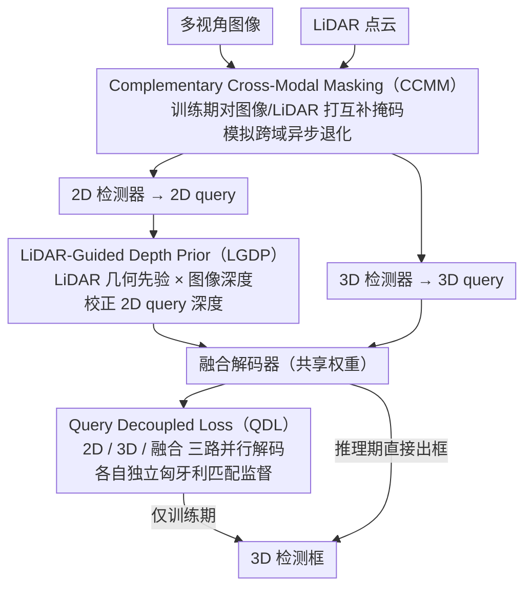

# CCF: Complementary Collaborative Fusion for Domain Generalized Multi-Modal 3D Object Detection

**会议**: CVPR 2026  
**arXiv**: [2603.23276](https://arxiv.org/abs/2603.23276)  
**代码**: [GitHub](https://github.com/IMPL-Lab/CCF.git)  
**领域**: Autonomous Driving  
**关键词**: 多模态3D检测, 域泛化, 模态不平衡, LiDAR-Camera融合, 跨域鲁棒性

## 一句话总结

针对双分支多模态3D检测器在域迁移场景下的模态不平衡问题，提出 CCF 框架，通过解耦损失、LiDAR引导深度先验和互补跨模态掩码三个组件系统提升相机查询的利用率和跨域鲁棒性。

## 研究背景与动机

**领域现状**：多模态3D检测（LiDAR + Camera）已在标准基准上取得优秀性能，但面对恶劣天气、光照变化等域迁移场景时性能严重下降。

**现有痛点**：(a) 在雨天/夜间等条件下，不同模态退化程度不同——雨天 LiDAR 点云稀疏，夜间相机图像质量恶化；(b) 在双分支检测器中，LiDAR 分支主导检测过程，相机分支的语义信息被系统性低估。

**核心矛盾**：试验分析发现，训练中 3D query 与 2D query 的匹配比例达到 37.5:1，2D query 几乎得不到监督信号。即使 2D 检测器提案质量在跨域场景下保持较高（2D AP 优于 3D 投影），2D query 的 3D mAP 仅为 18.44%（vs 3D query 的 67.75%）。

**本文目标**：重新平衡双分支检测器中的模态利用，使相机分支在 LiDAR 退化时能发挥更大作用。

**切入角度**：从监督不平衡、深度初始化不准确、融合阶段过度依赖 LiDAR 三个维度入手。

**核心 idea**：通过解耦监督、几何先验增强和互补掩码策略，系统提升 2D query 的竞争力。

## 方法详解

### 整体框架

CCF 想解决的是一个很具体的失衡：双分支多模态检测器在跨域时，相机分支本该顶上来（LiDAR 退化时），实际却被 LiDAR 分支系统性压制，几乎不出力。作者没有重新设计网络，而是在已有的 MV2DFusion 双分支框架上挂三个互补组件，从训练监督、深度初始化、融合阶段三处分别松绑对 LiDAR 的依赖。一张图、一帧点云进来后，2D 和 3D 两路各自生成 query；Query Decoupled Loss 保证两路都拿到独立监督，LiDAR-Guided Depth Prior 给 2D query 补上靠谱的深度，Complementary Cross-Modal Masking 则在训练时刻意破坏单一模态、逼解码器学会按可靠性挑 query。三者都只在训练期生效，推理仍走原来的融合分支，零额外开销。下图按数据流串起三个组件挂载的位置（三个组件名即三个关键设计）：

### 关键设计

**1. Query Decoupled Loss（QDL）：让 2D query 拿到自己的梯度，而不是被 3D query 垄断监督**

痛点很直接：标准训练里 3D query 定位更准，匈牙利匹配几乎被它包圆，作者实测 3D 与 2D 的匹配比例高达 37.5:1，2D query 基本收不到梯度，自然练不强。QDL 的做法是让同一个解码器（共享权重）并行跑三遍——只喂 2D query、只喂 3D query、喂融合 query——每一路各自独立做匈牙利匹配和损失计算，再相加：

$$\mathcal{L}_{total} = \mathcal{L}_{2d} + \mathcal{L}_{3d} + \mathcal{L}_{fused}$$

关键在于「三次并行」而不是「解码一次再事后拆开算损失」：如果让三类 query 在同一次自注意力里同台，2D query 会通过和 3D query 的交互「搭便车」拿到定位信息（shortcut learning），看起来达标但本身没学会。隔离开跑，2D query 只能靠自己，才真正被训练起来。因为只是训练期多算两路损失，推理时仍只用融合分支，不增加任何计算。

**2. LiDAR-Guided Depth Prior（LGDP）：用 LiDAR 几何把 2D query 那个不靠谱的深度先验扶正**

2D query 的老毛病是深度估不准——纯图像预测的深度 MAE 在源域就有 1.78m，到雨天更恶化到 3.01m，深度一偏，3D 定位就跟着塌。LGDP 给每个 2D 提案准备两份深度分布：图像分支学出来的 $\mathbf{d}_i^{2d} \in \mathbb{R}^D$，以及从视锥内 LiDAR 点的深度直方图统计出的几何先验 $\mathbf{d}_i^{3d} \in \mathbb{R}^D$。再用一个置信度网络预测融合权重 $\lambda_i \in [0,1]$，在对数空间把两者加权：

$$\mathbf{d}_i^{fused} = \sigma\big(\lambda_i \cdot \log(\mathbf{d}_i^{2d}) + (1-\lambda_i) \cdot \log(\mathbf{d}_i^{3d})\big)$$

对数空间相加等价于 Product-of-Experts，相当于让两个"专家"分布相乘取交集，比直接线性平均更尊重各自的高置信区间。权重 $\lambda_i$ 自适应是必要的：远处 LiDAR 点稀疏、雨天 LiDAR 噪声大，这些情况下应当回退到更信图像，固定权重做不到这种切换。

**3. Complementary Cross-Modal Masking（CCMM）：在训练里制造"模态异步退化"，逼解码器学会按可靠性选 query**

前两个组件解决了监督和深度，但融合阶段解码器仍可能形成"无脑信 LiDAR"的习惯，一旦真到 LiDAR 退化的域就抓瞎。CCMM 在训练时对图像打 GridMask，同时对 LiDAR 打一张**互补**的掩码——图像被遮的位置恰好保留 LiDAR 点，反之亦然，使两个模态始终都在、但可见区域互补。这正好模拟真实跨域中的异步退化：雨天 LiDAR 糟而相机可用、夜间反过来。解码器被反复置于"某一路这块不可信"的处境，只能学会根据模态可靠性临场挑 query，而不是固定押注 LiDAR。和 CMT 那种直接整模态丢弃不同，互补掩码保证两路同时可用、信息不浪费。掩码强度还走课程学习，概率从 0 线性升到 $p=0.7$，避免训练早期一上来就破坏太狠导致不收敛。

### 损失函数 / 训练策略

- 分类损失：Focal Loss；回归损失：L1 Loss
- 两阶段训练：Stage 1 独立预训练 2D/3D 检测器，Stage 2 冻结 3D 检测器训练融合解码器
- AdamW 优化器，初始 LR 4e-4，余弦退火，24 epochs

## 实验关键数据

### 主实验

| 方法 | Source mAP | Rain mAP | Night mAP | Boston mAP | Avg mAP |
|------|-----------|----------|-----------|------------|---------|
| FSDv2 (LiDAR-only) | 59.6 | 23.4 | 36.6 | 28.2 | 29.4 |
| ISFusion | 66.3 | 39.8 | 41.8 | 45.4 | 42.3 |
| Baseline | 68.4 | 41.9 | 42.9 | 47.4 | 44.1 |
| **CCF (Ours)** | **68.2** | **44.7** | **44.2** | **50.6** | **46.5** |
| CCF (Oracle) | 73.6 | 72.9 | 46.9 | 73.6 | 64.5 |

### 消融实验

| DL | DP | CM | Rain mAP | Night mAP | Boston mAP |
|----|----|----|----------|-----------|------------|
| ✗ | ✗ | ✗ | 41.9 | 42.9 | 47.4 |
| ✓ | ✗ | ✗ | 42.8 | 42.1 | 48.1 |
| ✗ | ✗ | ✓ | 44.5 | 43.4 | 49.6 |
| ✓ | ✓ | ✗ | 44.7 | 42.2 | 50.0 |
| ✓ | ✓ | ✓ | 44.7 | 44.2 | 50.6 |

### 关键发现

1. CCF 在三个目标域上一致提升：Rain +2.8, Night +1.3, Boston +3.2 mAP，同时保持源域性能（68.2 vs 68.4）。
2. 互补掩码（CM）是最有效的单个组件，仅 CM 即可在 Rain/Night/Boston 上分别提升 2.6/0.5/2.2。
3. 互补 GridMask 显著优于一致 GridMask（Rain 44.3 vs 42.8），验证了互补设计的关键性。
4. 课程学习提升稳定性：有课程 vs 无课程在 Boston 上 NDS 差距 56.9 vs 55.1。

## 亮点与洞察

- 试验分析（Pilot Study）非常充分，通过 2D AP、匹配比例、深度误差三个角度系统论证了模态不平衡的存在。
- QDL 的"三次并行解码"设计巧妙避免了 shortcut learning，推理无额外开销。
- 互补掩码的设计灵感来自真实世界的异步模态退化模式，具有很强的物理直觉。

## 局限与展望

- 仅在 nuScenes 上实验，未验证 Waymo 等更大规模数据集。
- 互补掩码的 GridMask 模式是固定的，可考虑学习自适应掩码模式。
- 2D 提案生成器（Faster R-CNN）较老，换用更强的 2D 检测器可能进一步释放潜力。
- 未考虑时序信息，多帧融合可能进一步提升跨域鲁棒性。

## 相关工作与启发

- 与 MetaBEV、UniBEV 等缺失模态方法不同，CCF 关注的是"模态可用但可靠性不同"的场景。
- 互补掩码思路可推广到其他多模态任务（如 VLM 中的文本-图像互补增强）。
- Product-of-Experts 式的深度融合是跨模态信息融合的优雅范式。

## 评分

- 新颖性: ⭐⭐⭐⭐ 问题定义清晰、解决方案系统性强
- 实验充分度: ⭐⭐⭐⭐⭐ Pilot study + 主实验 + 多维度消融 + Oracle 上界
- 写作质量: ⭐⭐⭐⭐⭐ 逻辑非常清晰，从问题发现到解决方案一气呵成
- 价值: ⭐⭐⭐⭐ 对自动驾驶多模态检测的域泛化有重要实践意义

<!-- RELATED:START -->

## 相关论文

- [\[CVPR 2026\] RPGFusion: 4D Radar Prior-Guided Multi-Modal Fusion for 3D Detection](rpgfusion_4d_radar_prior-guided_multi-modal_fusion_for_3d_detection.md)
- [\[ICCV 2025\] EVT: Efficient View Transformation for Multi-Modal 3D Object Detection](../../ICCV2025/autonomous_driving/evt_efficient_view_transformation_for_multi-modal_3d_object_detection.md)
- [\[CVPR 2026\] R4Det: 4D Radar-Camera Fusion for High-Performance 3D Object Detection](r4det_4d_radar-camera_fusion_for_high-performance_3d_object_detection.md)
- [\[CVPR 2026\] Look Before You Fuse: 2D-Guided Cross-Modal Alignment for Robust 3D Detection](look_before_you_fuse_2d-guided_cross-modal_alignment_for_robust_3d_detection.md)
- [\[CVPR 2026\] OccAny: Generalized Unconstrained Urban 3D Occupancy](occany_generalized_unconstrained_urban_3d_occupancy.md)

<!-- RELATED:END -->
