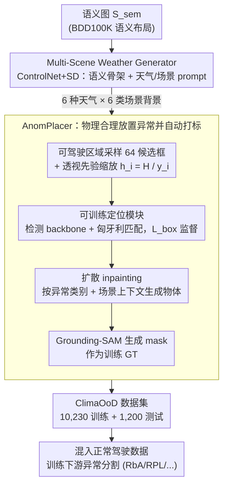

# ClimaOoD: Improving Anomaly Segmentation via Physically Realistic Synthetic Data

**会议**: CVPR 2026  
**arXiv**: [2512.02686](https://arxiv.org/abs/2512.02686)  
**代码**: 暂无  
**领域**: 自动驾驶  
**关键词**: 异常分割, OoD检测, 合成数据, 天气增强, 扩散模型, ControlNet

## 一句话总结

提出ClimaDrive数据生成框架和ClimaOoD基准数据集，通过语义引导的多天气场景生成+透视感知的异常物体放置，构建10K+训练集覆盖6种天气×93类异常，训练后四个SOTA方法平均AP提升3.25%。

## 研究背景与动机

自动驾驶中的异常(OoD)分割旨在检测训练分布外的未知物体（如掉落货物、动物、路障等），是安全关键能力。当前面临的核心瓶颈是**数据稀缺**：

- **现有数据集规模小、多样性差**：
    - LostAndFound：仅1种地形(城市)、9类异常物体
    - Fishyscapes：1种地形、7类异常
    - SMIYC (SegmentMeIfYouCan)：4种地形、26类异常
- **天气覆盖几乎为零**：现有数据集基本只有晴天场景，而恶劣天气下的OoD检测才是真正的安全盲区
- **真实采集代价高**：异常事件本身罕见，遍历天气×场景×异常类型的组合在真实世界中不现实

合成数据是突破数据瓶颈的关键路径。但简单的copy-paste合成缺乏物理真实性，且无法生成逼真的天气效果。ClimaDrive利用扩散模型的生成能力，系统性地解决多样性和真实性的双重挑战。

## 方法详解

### 整体框架

ClimaOoD 要解决的是异常分割「没数据」的困境：真实世界里恶劣天气 × 罕见异常物体的组合几乎采集不到。ClimaDrive 的思路是把数据生成拆成两步走——先用 Multi-Scene Weather Generator 从一张干净语义图「刷」出 6 种天气下的驾驶场景，再用 AnomPlacer 在这些场景里物理合理地塞进异常物体并自动打标。两个模块串起来，最终产出覆盖 6 种天气 × 93 类异常的 ClimaOoD 数据集（训练集 + 人工筛选的测试集）。

### 关键设计

**1. Multi-Scene Weather Generator：用语义图当骨架，让一张场景长出六种天气**

现有数据集几乎全是晴天，而恶劣天气恰恰是 OoD 检测的安全盲区。这个模块基于 ControlNet 做语义引导的 image-to-image 生成：以语义分割图作为空间结构约束（保证道路、建筑的布局不乱），用文本 prompt 指定天气和场景类型，输出对应天气下的驾驶场景图像。支持晴天、雨、雾、雪、阴天、夜间 6 种天气，prompt 里同时融合天气描述与场景类型（城市/郊区/高速），从而在同一张语义骨架上批量「长」出多样化背景。这样天气多样性不再依赖真实采集，而是可控、可枚举地生成。

**2. AnomPlacer：把异常物体放得「像真的」而不是糊上去**

简单的 copy-paste 会留下边界伪影，被分割模型当成捷径学走；这个模块要解决的就是「怎么把异常物体放得物理合理」。它走四步：① 在语义图的可驾驶区域（Drivable Region）均匀采样 64 个候选框，并按透视先验调整 bbox 大小——根据物体在图像中的垂直位置 $y_i$ 缩放高度 $h_i = \frac{H}{y_i}$（宽度 $w_i \propto h_i$），越靠图像上方（越远）物体越小，避免远处放巨物、近处放微物的违和感；② 这一步不是简单规则筛选，而是一个**可训练定位模块**——检测 backbone $F_\theta$ 预测精修后的 bbox $\hat{B}$，以透视调整后的伪框 $B$ 经匈牙利匹配（Hungarian Matching）作监督，定位损失 $\mathcal{L}_{box}$ 同时约束中心点 L1 距离与 IoU，从而学出布局自然、互不重叠的放置位置；③ 在预测框内用扩散模型做 inpainting，以异常类别 $t_j$ 和场景全局上下文 $S_{scene}$（如「隧道、雨天、白天」）为条件生成物体，让光照、风格与场景一致；④ 用 Grounding-SAM 对 inpaint 区域生成分割 mask（再经轻量 noise-denoise 平滑边界），直接作为训练 GT。整条链路把「采样—透视—定位—生成—打标」自动化，既保证物理真实性，又省掉了人工标注。

### 损失函数 / 训练策略

ClimaDrive 的 AnomPlacer 是**可训练**模块，目标函数为 $\mathcal{L}_{total} = \mathcal{L}_{box} + \mathcal{L}_{inpaint}$，采用两阶段优化：第一阶段先预训练定位模块（$\mathcal{L}_{box}$，匈牙利匹配下的 L1 + IoU），第二阶段再与 inpainting 模型联合优化精修结果。Weather Generator 端则微调 ControlNet 使其以语义图为结构约束。

下游分割模型与 ClimaDrive 解耦，沿用各自原有的训练损失：

- **RbA (Residual-based Anomaly)**：基于残差的异常评分
- **RPL (Robust Pixel-Level)**：像素级鲁棒训练
- **Mask2Former**：基于掩码的分割+异常分支
- **DenseHybrid**：密度估计+分类混合方法

训练策略：将ClimaOoD训练集与原有正常驾驶数据混合训练，异常区域标签来自Grounding-SAM生成的mask。

## 实验关键数据

### 主实验

四个SOTA方法在ClimaOoD训练后的提升：

| 方法 | AP (原始→+ClimaOoD) | AUROC (原始→+ClimaOoD) | 提升幅度 |
|------|---------------------|------------------------|---------|
| RbA | 基线 → +ClimaOoD | 基线 → +ClimaOoD | AP↑, AUROC↑ |
| RPL | 基线 → +ClimaOoD | 基线 → +ClimaOoD | AP↑, AUROC↑ |
| Mask2Former | 基线 → +ClimaOoD | 基线 → +ClimaOoD | AP↑, AUROC↑ |
| DenseHybrid | 基线 → +ClimaOoD | 基线 → +ClimaOoD | AP↑, AUROC↑ |
| **平均提升** | — | — | **AP +3.25%, AUROC +0.66%** |

### 消融实验

| 消融条件 | AP变化 | 说明 |
|---------|--------|------|
| 仅清天数据(无天气增强) | 下降 | 天气多样性对泛化至关重要 |
| 无透视先验(固定bbox大小) | 下降 | 物体尺寸不合理导致模型学到错误模式 |
| 无匈牙利匹配(随机放置) | 轻微下降 | 物体重叠降低数据质量 |
| 仅copy-paste(无inpainting) | 明显下降 | 边界伪影被模型利用为捷径 |
| 减少异常类别(93→20) | 下降 | 异常多样性是关键 |

### 关键发现

1. **ClimaOoD数据集规模**：10K+训练图像，覆盖6种天气 × 6种场景类型 × 93种异常物体类别，远超现有数据集
2. **测试集质量**：1200张经人工筛选的高质量测试图像
3. **恶劣天气的挑战仍在**：FPR95从晴天的7.8%升至恶劣天气的11.0%，说明天气条件下的OoD检测仍有巨大改善空间
4. **通用性**：ClimaOoD对四个不同架构的方法均有效，说明数据多样性的提升是方法无关的

## 亮点与洞察

- **系统性解决数据瓶颈**：不是提出新模型，而是构建高质量数据集——这在当前"数据为王"的范式下更有持久价值
- **透视先验的简洁有效**：$h_i = H / y_i$ 这个简单公式就能显著提升放置物理合理性，体现了"简单但有效"的工程智慧
- **93类异常物体**：覆盖范围从常见(锥桶、轮胎)到罕见(沙发、购物车)，大幅提升OoD检测的泛化能力
- **方法无关的增益**：四个不同范式的方法均获得提升，验证了"数据>模型"的洞察

## 局限与展望

1. **Inpainting质量依赖扩散模型**：某些异常物体(如高反射物体)的生成质量可能不稳定，引入噪声标签
2. **Grounding-SAM的mask精度**：自动生成的mask不如人工标注精确，边界区域可能存在错误
3. **恶劣天气下FPR95仍高(11.0%)**：数据增强只是缓解而非解决天气鲁棒性问题，需要结合模型层面的改进
4. **缺少3D信息**：纯2D图像合成无法建模遮挡、阴影等3D一致性，生成的异常物体可能缺乏深度线索
5. **测试集偏差**：1200张人工筛选可能引入选择偏差，难以代表真实长尾分布
6. **ControlNet的语义图来源**：依赖已有的语义分割GT，限制了数据生成的自动化程度

## 相关工作与启发

- **LostAndFound / Fishyscapes / SMIYC**：现有OoD分割基准 → ClimaOoD在规模和多样性上全面超越
- **ControlNet**：条件扩散生成 → 语义图控制场景结构是优雅的设计选择
- **Grounding-SAM**：开放词汇分割 → 巧妙用于自动生成异常物体mask标签
- **启发**：这种"生成引擎+自动标注"的数据工厂范式可推广到其他数据稀缺的安全关键任务(如医学异常检测)

## 评分

| 维度 | 分数 (1-5) | 说明 |
|------|-----------|------|
| 创新性 | 3.5 | 各技术模块非全新，但系统性组合和benchmark构建有价值 |
| 实用性 | 4.5 | 数据集可直接使用，四个SOTA均获益 |
| 实验充分度 | 4.0 | 四个方法+消融实验充分，但缺乏真实恶劣天气数据的验证 |
| 写作质量 | 3.5 | 结构清晰，但生成细节描述可更加详尽 |
| **综合** | **3.9** | 实用导向的强工作，数据集本身比方法更有持久贡献 |

<!-- RELATED:START -->

## 相关论文

- [\[ECCV 2024\] Reliability in Semantic Segmentation: Can We Use Synthetic Data?](../../ECCV2024/autonomous_driving/reliability_in_semantic_segmentation_can_we_use_synthetic_data.md)
- [\[CVPR 2026\] Learning to Identify Out-of-Distribution Objects for 3D LiDAR Anomaly Segmentation](learning_to_identify_out-of-distribution_objects_for_3d_lidar_anomaly_segmentati.md)
- [\[CVPR 2026\] A Self-Conditioned Representation Guided Diffusion Model for Realistic Text-to-LiDAR Scene Generation](a_self-conditioned_representation_guided_diffusion_model_for_realistic_text-to-l.md)
- [\[ICCV 2025\] Unraveling the Effects of Synthetic Data on End-to-End Autonomous Driving](../../ICCV2025/autonomous_driving/unraveling_the_effects_of_synthetic_data_on_end-to-end_autonomous_driving.md)
- [\[ECCV 2024\] Random Walk on Pixel Manifolds for Anomaly Segmentation of Complex Driving Scenes](../../ECCV2024/autonomous_driving/random_walk_on_pixel_manifolds_for_anomaly_segmentation_of_complex_driving_scene.md)

<!-- RELATED:END -->
