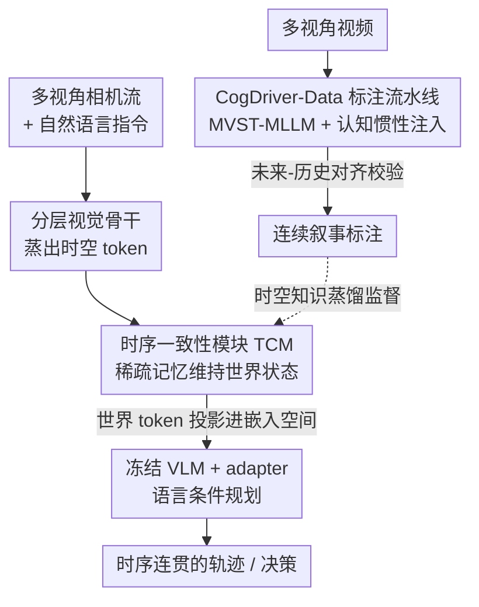

# CogDriver: Integrating Cognitive Inertia for Temporally Coherent Planning in Autonomous Driving

**会议**: CVPR 2026  
**论文**: [CVF Open Access](https://openaccess.thecvf.com/content/CVPR2026/html/Liu_CogDriver_Integrating_Cognitive_Inertia_for_Temporally_Coherent_Planning_in_Autonomous_CVPR_2026_paper.html)  
**代码**: 无（论文给出 Project link "CogDriver"，未公开具体仓库 URL，⚠️ 以原文为准）  
**领域**: 自动驾驶 / 多模态VLM  
**关键词**: 端到端规划, 认知惯性, 时序一致性, 视觉-语言-动作, 知识蒸馏

## 一句话总结
CogDriver 把"认知惯性"（人类对意图的自然持续性）显式注入端到端驾驶系统：一边用多视角时空 MLLM 自动标注带连续叙事的 VLA 数据集，一边在 agent 里塞进一个稀疏时序记忆模块（TCM）维持稳定内部状态，使决策不再逐帧抖动；在 Bench2Drive 闭环 Driving Score 提升 22%、nuScenes L2 误差降低 21%，刷新 SOTA。

## 研究背景与动机
**领域现状**：当前端到端自动驾驶大量借用视觉-语言模型（VLM）来获得"会推理、可解释"的规划能力，主流是把当前帧画面 + 指令喂进 VLM，输出轨迹或动作。

**现有痛点**：这些 VLM 本质上是"无状态"的——每一帧都被当成孤立问题从头评估，像一个每隔几分之一秒就失忆、重新认识世界的司机。后果是**决策抖动（decision jitter）**：面对一辆慢车，agent 可能先决定从左超车，瞬间看到左后方来车就取消、打回原车道，又改成从右超车，在"左超—放弃—右超"之间反复横跳，行为危险且不可预测。它也无法执行需要多步坚持的复杂机动。

**核心矛盾**：根因是模型缺乏**认知惯性（cognitive inertia）**——即意图的自然持续性，而这又源于更底层的失败：**无法维持时序一致性（temporal coherence）**。没有这个"认知锚点"，agent 的内部表征就是碎片化、瞬时的。值得注意的是，现有"带语言"的驾驶数据集（BDD-X、DriveLM、CoVLA 等）也复刻了同样的缺陷：要么只给逐帧、快照式的理由，要么给了连续轨迹却没有"连续的 why"——缺少把决策跨时间串起来的演化因果叙事。

**本文目标**：让 VLA agent 形成连贯的内部表征，从而像人一样带着稳定性和前瞻性去行动。拆成两个子问题——(1) 数据侧：哪里来带"持续意图 + 演化因果"的监督信号；(2) 模型侧：用什么机制把这种时序连贯性固化进 agent。

**切入角度**：作者认为，世界模型式地"预测未来像素/latent"固然重要，但更基础的前提是**先能跨时间维持一个一致的内部表征**。与其造反应式预测器，不如直接"工程化"一个认知上连贯的 agent。

**核心 idea**：用"叙事式标注 + 稀疏时序记忆"显式注入认知惯性——前者提供学习时序动态与持续意图的监督，后者在推理时维持稳定内部状态，把"反应式逐帧映射"换成"持续演化的策略"。

## 方法详解
CogDriver 由两块构成：**CogDriver-Data**（解决"监督信号哪来"）和 **CogDriver-Agent**（解决"机制怎么固化"）。前者用一个新颖的多视角时空 MLLM 自动生成带连续叙事的 VLA 标注；后者把多视角输入压成时空 token，经时序一致性模块维持记忆，再投影进冻结 VLM 做语言条件规划。

### 整体框架
推理时的数据流：多视角相机流 → 分层视觉骨干蒸出紧凑时空 token → 时序一致性模块（TCM）用稀疏记忆维持随时间演化的世界状态 → 这些"世界 token"被投影进冻结 VLM 的嵌入空间，与历史状态、自然语言指令融合 → 轻量可训练 adapter 引导 VLM 输出时序连贯的轨迹。训练数据则来自离线的标注流水线：多视角视频 → MVST-MLLM 标注器 + 认知惯性注入 → 未来-历史对齐校验 → 连续叙事标注（CogDriver-Data）。

### 关键设计

**1. CogDriver-Data 与认知惯性标注流水线：让监督信号自带"连续的 why"**

针对"现有数据集只有逐帧理由、缺演化因果叙事"这个痛点，作者构建了两个大规模 VLA 数据集（CogDriver-nuScenes、CogDriver-Bench2Drive），关键不在规模而在标注方式：用一条流水线生成"讲故事式"的连续标注，捕捉持续意图、因果推理与对应动作。流水线有两个技术核心。其一是 **Multi-View Spatiotemporal MLLM（MVST-MLLM）** 作标注器——它的视觉编码器号称首个能**并发处理多视角视频流**的设计，用 Conv3D 与窗口注意力的层级结构在空间（所有相机视角）和时间两个维度上提取并融合特征，从而能推理"右侧并入一辆车、同时左侧出现行人"这类只有把多视角信息关联起来才看得懂的动态事件。其二是 **认知惯性注入（cognitive inertia injection）**：把模型 condition 在一段含高层 Rules 与 Tasks 的结构化 prompt 上，强制它用这些静态原则去生成**一段贯穿整个时间序列的连续叙事**，而非互相脱节的逐帧描述——这样产出的解释是因果相连的。最后用 **未来-历史对齐（Future History Alignment）** 把生成叙事与真实车辆轨迹对照校验，保证物理合理性。三者合起来，使标注同时具备 360° 时序感知与"静态规则绑定动态事件"的因果一致性。

**2. 时序一致性模块 TCM：稀疏时序记忆维持稳定内部状态**

这是 agent 维持认知惯性的"基石"，要解决的核心难题是：在自车运动与遮挡下仍能跟踪物体状态。TCM 用三阶段完成（对应论文 Alg.1）。**几何传播**：先显式补偿自车运动，把历史 3D 物体 query $Q^{hist}_p$ 用自车运动变换几何 warp 到当前帧坐标系，$Q^{aligned}_p = E_{ego}\cdot Q^{hist}_p$，给每个物体一个落地在物理现实上的初始状态先验。**运动条件状态精修**：纯几何对齐不足以刻画复杂动态与视角变化，作者不用静态归一化，而是把仿射系数 $\alpha,\beta$ 参数化为完整运动上下文的函数 $\alpha,\beta = \text{MotionEncoder}(E_{ego}, v, \Delta t)$，再对位置编码与上下文特征做运动条件调制：

$$Q_{pe} = \alpha\cdot\text{LN}(\psi(Q^{aligned}_p)) + \beta, \qquad Q_m = \alpha\cdot\text{LN}(Q^{hist}_c) + \beta$$

这让网络学到特征级补偿——例如放大快速运动物体的特征、压低可能被遮挡物体的权重。**状态调和与融合**：把携带强时序先验的记忆 query $Q_m$ 与当前帧的新感知 query $Q^{init}_c$ 拼接 $Q_{hybrid} = \text{Concat}(Q_m, Q^{init}_c)$，先用自注意力做"状态调和"（在历史信念与新观测之间权衡、更新已有轨迹、抑制冗余/虚假检测），再把调和后的 query 通过交叉注意力 grounding 回当前视觉证据——把调制后的位置编码 $Q_{pe}$ 注入图像特征的 key，提供显式空间引导以精确定位与更新每个物体状态。整套设计带来稳健的物体恒存性（object permanence）与时序一致感知，正是认知惯性的底座。消融显示去掉 TCM 后 L2 从 0.34 退化到 0.38、碰撞率与违规率同步上升。

**3. 冻结 VLM + 时空知识蒸馏的语言条件规划：把推理能力对齐到连贯轨迹**

为了既保留预训练 VLM 的推理能力又不破坏它，作者把 VLM core 冻结，只训练轻量 adapter：TCM 输出的世界 token 投影进 VLM 嵌入空间，与历史状态、语言指令融合后，由 adapter 引导冻结 VLM 生成可执行轨迹。整套通过**时空知识蒸馏**学习——显式地用 CogDriver-Data 的叙事结构"教"模型维持决策一致性。训练用复合损失：QFormer 端联合 3D 检测与结构化场景理解，分类用 Focal Loss、回归用 L1（编码中心坐标/尺寸/朝向），车道与道路结构用同构监督，

$$L_{pc} = \lambda_c L_{cls} + \lambda_r L_{reg} + \lambda_{mc} L_{mcls} + \lambda_{mr} L_{mreg}$$

LLM 端用自回归交叉熵 $L_{ce}$，总目标 $L_{total} = L_{pc} + L_{ce}$。这种"冻结主干 + 蒸馏叙事"的组合，使强推理能力被引导到时序连贯的轨迹生成上，而非传统的刺激-反应映射。

### 损失函数 / 训练策略
视觉编码器用 EVA-02-L（CLIP 知识蒸馏的 MIM 预训练，保证视觉-语言对齐），base 模型为 LLaVA v1.5。微调用 AdamW、batch size 16，差异化学习率：projector 用 $4\times10^{-4}$，视觉编码器与 LLM 保持较低的 $2\times10^{-5}$ 以保住预训练知识；cosine annealing 调度稳定收敛。

## 实验关键数据

### 主实验：Bench2Drive 闭环规划
开环 L2 与闭环 Driving Score / 成功率对比（节选；↑越高越好，↓越低越好）：

| 方法 | Avg. L2 ↓ | Driving Score ↑ | Success Rate(%) ↑ | Efficiency ↑ |
|------|-----------|-----------------|-------------------|--------------|
| UniAD-Base | 0.73 | 45.81 | 16.36 | 129.21 |
| VAD | 0.91 | 42.35 | 15.00 | 157.94 |
| DriveAdapter | 1.01 | 64.22 | 33.08 | 70.22 |
| DriveTransformer | **0.62** | 63.46 | 35.01 | 100.64 |
| **CogDriver-Agent** | 0.63 | **78.21 (22%↑)** | **56.93 (63%↑)** | 169.52 |

闭环 Driving Score 相对前最优提升 22%、成功率相对提升 63%，是长程规划质量的大幅跃升；开环 L2（0.63）与效率（169.52）仍处第一梯队，说明提升不靠牺牲模仿精度或效率换来。

### VQA 任务（节选 CogDriver-nuScenes）
| 模型 | CIDEr ↑ | BLEU-1 ↑ | BLEU-4 ↑ | ROUGE-L ↑ |
|------|---------|----------|----------|-----------|
| Qwen2.5VL 72B | 67.14 | 18.78 | 3.25 | 21.91 |
| InternVL3 14B | 70.01 | 8.82 | 1.09 | 19.18 |
| **CogDriver-Agent** | **92.39** | **51.54** | **14.45** | **32.75** |

相对最强开源 MLLM，CIDEr +37.6%、BLEU-1 +100.1%、BLEU-4 +224.0%，叙事生成质量优势显著。

### 消融实验

| 配置 | BLEU-1 ↑ | L2 ↓ | CR ↓ | IR ↓ | 说明 |
|------|----------|------|------|------|------|
| 全语言组件（完整模型） | 51.54 | 0.34 | 0.40 | 3.18 | 完整 CogDriver-Agent |
| w/o TCM | 52.24 | 0.38 | 0.44 | 3.65 | 去掉稀疏时序记忆 |
| w/ TCM | 51.54 | 0.34 | 0.40 | 3.18 | L2/CR/IR 全面改善 |

### 关键发现
- **TCM 是规划安全性的主力**：加入后 L2 0.38→0.34、碰撞率 0.44→0.40、违规率 3.65→3.18；VQA BL-1/precision 略降但 recall 升，说明模型对相关时序信息更敏感——是"更稳"而非"更会背答案"。
- **语言组件各司其职**：环境上下文主要提升语言生成（BLEU-1 +7.6%），动态/静态物体描述主要提升安全（最低碰撞率 0.37、最低违规率 3.08）；而轨迹预测 L2 在所有配置下稳定为 0.34——增强推理不损害规划精度。
- **满足实时约束**：单张 A800 上输入 3410.81 tokens/s、输出 391.43 tokens/s，远高于 Qwen2.5VL 32B baseline，证明架构能满足驾驶的严格延迟要求。
- **定性上展现"演化的因果叙事"**：在左转/恶劣天气变道场景中，高层计划（如"Left Turn"）跨帧保持一致（决策连贯），而底层理由从"前车"成熟到"前方路口"（因果认知连贯），与无状态模型只盯最直接视觉线索形成对比。

## 亮点与洞察
- **把"认知惯性"这个心理学直觉工程化**：不停留在概念，而是落到"叙事标注 + 稀疏时序记忆"两个可操作机制上，并用决策抖动是否减少来量化验证——这种"用稳定性而非单点精度衡量进步"的视角可迁移到任何序列决策任务。
- **运动条件仿射调制很巧**：把归一化系数 $\alpha,\beta$ 做成运动上下文的函数，等于让网络按"物体动得快不快、是否被遮挡"自适应地放大/压低特征，比静态归一化更贴合驾驶动态，这个 trick 可借到任意需要 ego-motion 补偿的时序感知模块。
- **冻结 VLM + adapter + 叙事蒸馏**：用极小可训练量把预训练推理能力"对齐"到时序连贯轨迹，既省算力又防遗忘，是 VLA 落地的实用范式。

## 局限与展望
- 论文核心证据偏"叙事/VQA 质量"与闭环分数，但"认知惯性"本身缺一个直接、独立的量化指标（如抖动幅度的统计量），⚠️ 决策抖动的减少多以定性可视化呈现，量化证据主要靠成功率提升间接支撑。
- 开环 nuScenes 上碰撞率（0.40%）并非最低（Senna 0.12%、DriveVLM 0.27%），安全性在某些指标上仍有差距；闭环 Comfortness（20.50）也明显低于 UniAD 等，舒适度可能被牺牲。
- 标注流水线重度依赖 MVST-MLLM 标注器与未来-历史对齐的质量，标注噪声/偏差如何传导到下游 agent 未充分分析；MVST-MLLM 细节多在 Appendix，正文难以完全复现。
- 改进方向：引入显式的抖动/意图持续性度量、把记忆机制扩展到更长程（分钟级）规划、并评估在长尾交互场景下叙事是否仍因果自洽。

## 相关工作与启发
- **vs 语言增强驾驶数据集（BDD-X / DriveLM / CoVLA）**：它们提供逐帧理由或连续轨迹，但缺"连续的 why"；CogDriver-Data 同时建模连续动作、整体多视角感知与持续演化的思维过程，是首个面向认知连贯 agent 训练/评测的数据。
- **vs 世界模型式方法**：后者显式预测未来像素/latent；本文主张更基础的前提是先维持一致的内部表征，TCM 走的是"记忆-调和"而非"预测重建"路线。
- **vs MLLM-grounded 驾驶规划（prompt-based / 端到端 / 混合）**：先前工作大多是刺激-反应映射、不建模动态场景中的因果关系；本文显式在时空因果依赖上推理，解锁零样本 E2E 规划。

## 评分
- 新颖性: ⭐⭐⭐⭐ "认知惯性"作为统一视角串起数据与架构两条线，TCM 的运动条件调制有新意，但单个组件多为已知模块的组合。
- 实验充分度: ⭐⭐⭐⭐ 闭环/开环/VQA/消融/效率全覆盖且提升显著，但"抖动减少"缺直接量化、部分安全指标非最优。
- 写作质量: ⭐⭐⭐⭐ 动机故事（超车横跳）讲得生动，方法层次清晰；MVST-MLLM 等细节下放 Appendix 略影响自洽。
- 价值: ⭐⭐⭐⭐ 提供了数据集 + 架构 + 可观增益的完整方案，对端到端 VLA 驾驶有较强参考价值。

<!-- RELATED:START -->

## 相关论文

- [\[CVPR 2026\] ColaVLA: Leveraging Cognitive Latent Reasoning for Hierarchical Parallel Trajectory Planning in Autonomous Driving](colavla_leveraging_cognitive_latent_reasoning_for_hierarchical_parallel_trajecto.md)
- [\[CVPR 2026\] Diffusion Forcing Planner: History-Annealed Planning with Time-Dependent Guidance for Autonomous Driving](diffusion_forcing_planner_history-annealed_planning_with_time-dependent_guidance.md)
- [\[CVPR 2026\] Perceiving the Near, Reasoning the Distant: Coherent Long-Horizon Trajectory Prediction for Autonomous Driving](perceiving_the_near_reasoning_the_distant_coherent_long-horizon_trajectory_predi.md)
- [\[CVPR 2026\] ReScene4D: Temporally Consistent Semantic Instance Segmentation of Evolving Indoor 3D Scenes](rescene4d_temporally_consistent_semantic_instance_segmentation_of_evolving_indoo.md)
- [\[CVPR 2026\] ActiveAD: Planning-Oriented Active Learning for End-to-End Autonomous Driving](activead_planning-oriented_active_learning_for_end-to-end_autonomous_driving.md)

<!-- RELATED:END -->
