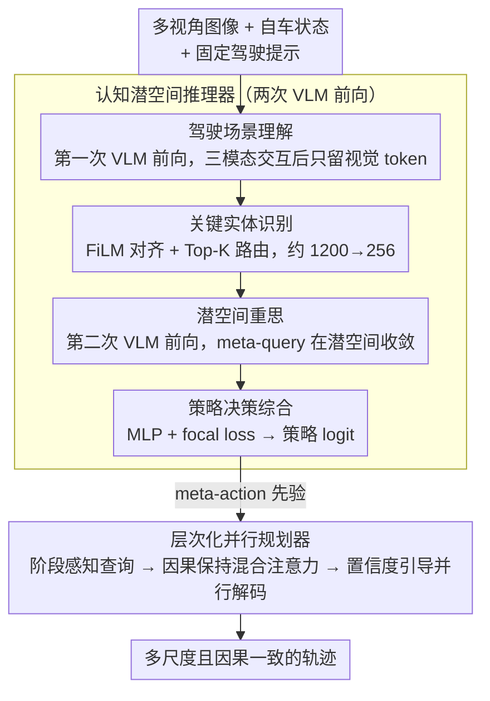

# ColaVLA: Leveraging Cognitive Latent Reasoning for Hierarchical Parallel Trajectory Planning in Autonomous Driving

**会议**: CVPR 2026  
**arXiv**: [2512.22939](https://arxiv.org/abs/2512.22939)  
**代码**: [有](https://github.com/pqh22/ColaVLA)  
**领域**: 自动驾驶  
**关键词**: 端到端自动驾驶, VLM推理, 潜空间推理, 多尺度轨迹规划, 视觉-语言-动作

## 一句话总结

ColaVLA 提出统一的视觉-语言-动作(VLA)框架，将 VLM 的推理从文本链式思考迁移到潜空间，通过认知潜空间推理器(Cognitive Latent Reasoner)和层次化并行规划器(Hierarchical Parallel Planner)，仅需两次 VLM 前向传播即可高效完成场景理解与轨迹解码，在 nuScenes 开环和闭环评测上均达到 SOTA。

## 研究背景与动机

端到端自动驾驶方法正从模块化管线向统一学习演进。VLM 的引入带来了跨模态先验和常识推理能力，但当前 VLM-based 规划器面临三个核心问题：

**模态不匹配**：离散的文本 token 与连续的轨迹坐标之间存在天然鸿沟，可能产生格式违规或物理不一致的路径点

**链式思考延迟高**：自回归逐 token 解码导致序列不断增长，推理延迟高达 3700+ ms（如 OmniDrive、SOLVE-VLM）

**非因果规划器限制部署**：现有规划器无法在保持因果结构的同时实现并行解码

ColaVLA 的核心思想是将推理完全转移到统一的潜空间中执行，避免冗长的文本生成，同时保留 VLM 的知识先验和泛化能力。

## 方法详解

### 整体框架

ColaVLA 要解决的是：让 VLM 既能给规划提供常识推理，又不被文本生成的延迟和模态鸿沟拖累。它的思路是把整条推理链搬进潜空间，再交给一个能并行出轨迹的规划器收尾。整套流程分两段：前半段是**认知潜空间推理器**，模仿人开车时"先看懂场景→锁定关键目标→再想一遍→定下策略"四个认知阶段，但全部在潜空间里跑，只用两次 VLM 前向就把驾驶元动作（meta-action）先验定下来；后半段是**层次化并行规划器**，拿着这个先验，在一次前向里从粗到细地把多个时间尺度的轨迹同时解出来，且保持因果结构。两次 VLM 前向加一次规划器解码，就是整个推理的全部开销，这也是它把延迟从 3700ms 级压到 700ms 级的根本原因。

### 关键设计

**1. 驾驶场景理解：用第一次 VLM 前向把多视角画面"读"成全局交互后的视觉 token**

VLM-based 规划器面对的第一个坎是输入太杂——多视角图像、自车状态、提示文本各说各话。这一步把固定驾驶提示嵌入 $\mathbf{T}$、多视角视觉嵌入 $\mathbf{V}$、自车状态 token $\mathbf{E}$ 拼成一条序列，过共享的 VLM Transformer 让三者充分交互：

$$\mathbf{Q}_V = \mathcal{D}_{\text{vlm}}([\mathbf{T}; \mathbf{V}; \mathbf{E}]) \in \mathbb{R}^{L_v \times D}$$

交互完成后只保留视觉切片 $\mathbf{Q}_V$，把文本和 ego 嵌入丢掉。这样做有两层用意：提示文本始终固定、不参与生成，保证 prompt 不可变也不引入冗余；而视觉 token 已经吸收了自车状态和任务语义，成为后续推理唯一需要携带的载体。

**2. 关键实体识别：用 ego 自适应路由把上千个视觉 token 压成几百个"安全关键"瓶颈**

一帧多视角画面动辄上千个视觉 token，但真正决定怎么开的往往只是少数几个目标（前车、横穿行人、红灯）。直接把全部 token 喂给第二次推理既慢又稀释信号。这里先用 FiLM 条件化让视觉 token 对齐自车状态：

$$\tilde{\mathbf{Q}}_V = (1 + \gamma(\mathbf{E})) \odot \mathbf{Q}_V + \beta(\mathbf{E})$$

其中 $\gamma(\mathbf{E})$、$\beta(\mathbf{E})$ 是由自车状态算出的缩放和平移，相当于"站在本车视角"重新加权每个 token。然后一个路由器给对齐后的 token 打分，选出 Top-K 个安全关键 token $\mathbf{Q}^*$，把约 1200 个压到 $K{=}256$ 个。训练时用 Gumbel-Softmax 松弛保持可微，推理时直接硬选 Top-K。这一步本质是个信息瓶颈：既丢掉了背景噪声、又把第二次 VLM 前向的序列长度砍下来，效率和精度同时受益。

**3. 潜空间重思：把"再想一遍"做成第二次 VLM 前向，让可学习 meta-query 在潜空间收敛到驾驶策略**

人在做关键决策前会"再确认一遍"，这一步就是潜空间里的那次复盘。把固定提示 $\mathbf{T}$、筛出的 K 个关键视觉 token $\mathbf{Q}^*$、ego token $\mathbf{E}$，再加上 C 个可学习的 meta-query $\mathbf{M}$ 拼起来，做第二次 VLM 前向：

$$\mathbf{Q}_M = \mathcal{D}_{\text{vlm}}([\mathbf{T}; \mathbf{Q}^*; \mathbf{E}; \mathbf{M}]) \in \mathbb{R}^{C \times D}$$

关键在于 meta-query 不是随机初始化的占位符——每个 query 对应一种典型驾驶元动作（直行巡航、无保护左转、紧急制动等），由对训练轨迹聚类得到。于是这次前向不是泛泛地"再算一遍特征"，而是让每个候选元动作在关键目标的注视下各自更新、互相竞争，输出已经带有明确语义的 $\mathbf{Q}_M$。这正是用潜空间的一次并行前向，替代了文本 CoT 那种逐 token 自回归的"想"。

**4. 策略决策综合：把重思后的 meta-query 映射成策略 logit，用 focal loss 盯住困难与安全关键样本**

重思之后要落到"选哪个动作"。meta-query 嵌入再经一轮 FiLM 调制和交叉注意力，由 MLP 映射成驾驶策略的 logit。训练用 focal loss 而非普通交叉熵，是因为安全关键场景（急刹、避让）在数据里占比小但代价高，focal loss 会自动给这些困难、低频样本更大权重，避免模型被大量"正常直行"样本带偏。到这里推理器的四阶段走完，输出的是给规划器用的 meta-action 先验。

**5. 层次化并行规划器：拿 meta-action 先验在一次前向里从粗到细并行解出多尺度且因果一致的轨迹**

最后一步要把抽象的元动作先验变成具体路点，难点是既要并行（快）又要保持因果（不能让未来信息泄漏到当前）。规划器把预测时域 T 步划成 S 个嵌套尺度 $\mathcal{I}_1 \subset \cdots \subset \mathcal{I}_S = \mathcal{T}$，从最粗的几个端点逐级填充到最细的逐步路点，这套从粗到细的层次化插值也是消融里被证明优于顺序/逆序/单尺度解码的写法。它靠三个机件协同：**阶段感知轨迹查询**把推理器选出的 meta-action embedding 通过时间嵌入扩展成各尺度的目标查询；**因果保持混合注意力**用一个 hybrid attention mask $\mathcal{M}$ 约束尺度 $s$ 的 token 只能看尺度 $s{-}1$ 和上下文 token，从而在单次前向并行解码的同时杜绝未来泄漏；**置信度引导并行解码**让多条候选策略同时跑，两个 MLP head 分别回归轨迹和估计置信度，但只让离 GT 最近的那条假设接受监督，避免所有候选坍缩到同一条轨迹。

### 一个完整示例

以一帧路口待左转的场景走一遍（数字为示意，⚠️ 以原文为准）：

1. **场景理解**：六路相机加自车状态、固定提示拼成序列过第一次 VLM 前向，得到 $L_v$≈1200 个全局交互后的视觉 token，丢掉文本/ego 切片只留视觉。
2. **关键实体识别**：FiLM 用自车"低速、左转意图"重新加权这些 token，路由器打分后选出 Top-256，把对向直行车、路口行人这些安全关键目标留下，背景建筑被滤掉。
3. **潜空间重思**：256 个关键 token + ego + C 个 meta-query 做第二次 VLM 前向，"无保护左转"对应的 meta-query 在对向车的注视下被压低权重、"等待让行"被抬高。
4. **策略决策**：MLP + focal loss 把 meta-query 映射成策略 logit，输出倾向"减速让行后左转"的 meta-action 先验。
5. **层次化并行解码**：规划器先定下 6s 末端点（粗尺度），再逐级填到 0.5s 步长的细尺度，混合注意力保证细尺度路点只看更粗一级，一次前向并行出完整轨迹。

整条链只用两次 VLM 前向加一次规划器解码，对应约 727ms 延迟，而文本 CoT 方案要 3700ms 以上。

### 损失函数 / 训练策略

- **多阶段训练**：第一阶段在 OmniDrive-nuScenes QA 对上预训练 VLM（仅更新 LoRA 参数）；第二阶段集成动作规划器联合微调
- 基于 LLaVA v1.5（LLaMA-7B），图像编码器用 EVA-02-L，视觉推理用 SQ-Former
- AdamW 优化器 + Cosine Annealing，学习率 $1 \times 10^{-4}$

## 实验关键数据

### 主实验

**表1：nuScenes 开环规划结果**

| 方法 | 类型 | Avg L2 (m) ↓ | Avg Col. (%) ↓ |
|------|------|:---:|:---:|
| UniAD | Action+Ego | 0.46 | 0.37 |
| VAD-Base | Action+Ego | 0.37 | 0.33 |
| SOLVE-E2E | Action+Ego | 0.31 | 0.30 |
| SOLVE-VLM | Text | 0.28 | 0.20 |
| **ColaVLA** | **Action+Ego** | **0.30** | **0.23** |

**表2：NeuroNCAP 闭环仿真结果**

| 方法 | NeuroNCAP Score ↑ | Avg Col. (%) ↓ |
|------|:---:|:---:|
| UniAD | 0.73 | 88.6 |
| VAD | 0.66 | 92.5 |
| ImpromptuVLA† | 2.06 | 65.1 |
| BridgeAD-B‡ | 3.06 | 44.3 |
| **ColaVLA** | **3.48** | **36.8** |

### 消融实验

| 推理模块 | 重思阶段 | Avg L2 (cm) ↓ |
|:---:|:---:|:---:|
| ✗ | ✗ | 32.2 |
| ✓ | ✗ | 31.3 |
| ✓ | ✓ | **30.4** |

| 规划器类型 | NeuroNCAP Score ↑ |
|------|:---:|
| MLP-based | 1.05 |
| Diffusion-based | 1.02 |
| **Ours** | **1.50** |

推理延迟比较：ColaVLA 727ms vs OmniDrive 3727ms vs SOLVE-VLM 3719ms（单 H20 GPU），实现 **5× 加速**。

### 关键发现

1. 潜空间推理相比文本链式思考延迟降低 5 倍以上，但保持甚至提升规划质量
2. 闭环评测中碰撞率从 65.1%（ImpromptuVLA）降至 36.8%，静态碰撞减少 73%
3. 层次化插值策略（先预测端点再填充中间点）优于顺序/逆序/单尺度策略
4. Top-K=256 安全关键 token 达到最佳精度-效率平衡

## 亮点与洞察

1. **范式创新**：首次系统提出将 VLM 推理从文本空间迁移到统一潜空间的完整框架，避免了模态不匹配和自回归延迟
2. **认知启发式设计**：四阶段推理过程（理解→识别→重思→决策）模拟人类驾驶认知，每阶段都有清晰的信息处理目标
3. **因果一致的并行解码**：通过精心设计的 hybrid attention mask 在单次前向传播中同时解码多尺度轨迹，兼顾效率和因果性
4. **闭环 SOTA**：在安全关键的 NeuroNCAP 评测上大幅超越先前方法，验证了潜空间推理在实际部署场景的有效性

## 局限与展望

1. 仅在 nuScenes 单一数据集验证，未在更大规模或跨域数据上测试泛化性
2. Meta-action 类别通过聚类硬编码，可能无法覆盖所有长尾驾驶场景
3. 仍需依赖 LiDAR 和预训练感知模块，纯视觉设置下的效果未验证
4. 闭环评测仅用 NeuroNCAP 单一模拟器，缺乏真实道路验证

## 相关工作与启发

- **UniAD/VAD**：端到端驾驶管线先驱，但依赖稀疏轨迹监督，缺乏高层语义推理
- **DriveVLM/OmniDrive/EMMA**：VLM-based 文本推理规划，推理延迟高
- **ImpromptuVLA/SOLVE-VLM**：结合 VLM 与规划器的双系统设计，但仍受限于文本级推理
- 潜空间推理思想可推广到机器人操作、视觉导航等需要快速决策的任务

## 评分

| 维度 | 分数 (1-5) |
|------|:---:|
| 创新性 | 5 |
| 技术深度 | 5 |
| 实验充分度 | 4 |
| 写作质量 | 4 |
| 实用价值 | 4 |
| 总评 | 4.5 |

<!-- RELATED:START -->

## 相关论文

- [\[CVPR 2026\] MindDriver: Introducing Progressive Multimodal Reasoning for Autonomous Driving](minddriver_introducing_progressive_multimodal_reasoning_for_autonomous_driving.md)
- [\[AAAI 2026\] WorldRFT: Latent World Model Planning with Reinforcement Fine-Tuning for Autonomous Driving](../../AAAI2026/autonomous_driving/worldrft_latent_world_model_planning_with_reinforcement_fine-tuning_for_autonomo.md)
- [\[ICLR 2026\] BridgeDrive: Diffusion Bridge Policy for Closed-Loop Trajectory Planning in Autonomous Driving](../../ICLR2026/autonomous_driving/bridgedrive_diffusion_bridge_policy_for_closed-loop_trajectory_planning_in_auton.md)
- [\[CVPR 2026\] DLWM: Dual Latent World Models enable Holistic Gaussian-centric Pre-training in Autonomous Driving](dlwm_dual_latent_world_models_enable_holistic_gaussian-centric_pre-training_in_a.md)
- [\[CVPR 2025\] A Neuro-Symbolic Framework Combining Inductive and Deductive Reasoning for Autonomous Driving Planning](../../CVPR2025/autonomous_driving/a_neuro-symbolic_framework_combining_inductive_and_deductive_reasoning_for_auton.md)

<!-- RELATED:END -->
