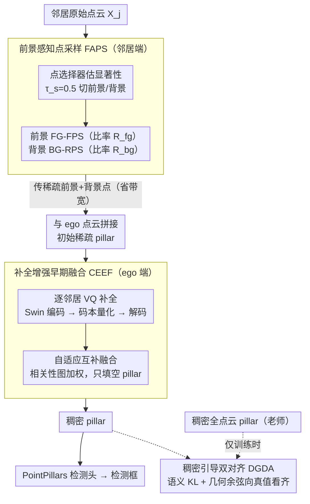

# CoLC: Communication-Efficient Collaborative Perception with LiDAR Completion

**会议**: CVPR 2026  
**arXiv**: [2603.00682](https://arxiv.org/abs/2603.00682)  
**代码**: 无  
**领域**: 自动驾驶  
**关键词**: 协同感知, 通信效率, 点云补全, 早期融合, 向量量化

## 一句话总结

CoLC 提出一种通信高效的早期协同感知框架，通过前景感知点采样(FAPS)减少传输量，结合 VQ-based LiDAR 补全(CEEF)在 ego 端恢复稠密 pillar 表示，并用稠密引导双对齐(DGDA)保证语义和几何一致性，在大幅降低通信带宽的同时保持甚至超越早期融合的检测性能。

## 研究背景与动机

协同感知允许多智能体共享互补信息，克服单智能体的感知盲区和遮挡问题。现有融合策略分为三类：

- **早期融合(Early Fusion)**：直接传输原始点云，信息保真度最高且天然鲁棒于异构模型，但通信开销极大
- **中间融合(Intermediate Fusion)**：传输 BEV 特征，通信开销适中但依赖模型一致性
- **晚期融合(Late Fusion)**：传输检测结果，通信最少但信息损失最大

作者发现了一个关键现象：在早期融合中，仅传输前景点会导致性能大幅下降，甚至不如仅传输背景点。这是因为前景点负责补全物体形状，而背景点提供用于空间对齐的上下文锚点。两者缺一不可，这启发了 CoLC 的设计——同时采样前景和背景点，然后在 ego 端通过补全恢复缺失信息。

## 方法详解

### 整体框架

CoLC 想同时拿到早期融合的信息保真度和中间融合的低带宽，关键做法是把"传完整点云"拆成"传少量关键点 + 在接收端补回来"。整条管线分布在两端：邻居智能体先用 FAPS 把原始点云筛成一小撮前景加背景点发出去；ego 端收到这些稀疏点后，用 CEEF 里的 LiDAR 补全模块把稀疏的 pillar 重建成稠密 pillar 再做检测；而 DGDA 只在训练时介入，用稠密全点云当老师，逼着补全出来的 pillar 在语义和几何上向真值靠拢。推理时不需要传输完整点云，带宽省下来，检测精度却靠补全和对齐补了回来。

### 关键设计

**1. 前景感知点采样（FAPS）：传得少，但别把对齐的锚点也丢了**

作者先观察到一个反直觉现象——在早期融合里只传前景点，性能反而不如只传背景点。原因是前景点负责补全物体形状，背景点却提供了空间对齐用的上下文锚点，两者缺一不可。FAPS 因此对邻居点云 $\mathcal{X}_j \in \mathbb{R}^{M \times 4}$ 做差异化采样：先用一个预训练的轻量 MLP 点选择器估计显著性图 $\mathcal{S}_j \in [0,1]^M$，以 $\tau_s = 0.5$ 切成前景集 $\mathcal{X}_j^{fg}$ 和背景集 $\mathcal{X}_j^{bg}$。前景点数量少、但结构重要，用最远点采样（FG-FPS）以比率 $R^{fg}$ 抽取以保住物体轮廓，开销可忽略；背景点海量但只需稀疏锚点，用随机采样（BG-RPS）以比率 $R^{bg}$ 高效抽取。最终发出去的就是这一小撮前景加背景点——经验上约 20% 前景配适量背景就够支撑检测，再堆前景反而不如多给点背景上下文。

**2. 补全增强早期融合（CEEF）：在 ego 端把稀疏点云"脑补"成稠密的**

光传稀疏点不够，ego 端要把丢掉的信息补回来，CEEF 的核心就是一个 VQ-based 的 pillar 级 LiDAR 补全模块。它走编码—量化—解码三步：稀疏编码器用 Swin Transformer（深度 $L=6$，嵌入维度 $D=128$）把稀疏 pillar $\mathcal{P}^s$ 编码成带全局上下文的 BEV 表示并投影到量化空间 $\mathbf{z}^s \in \mathbb{R}^{P \times D_c}$；接着向量量化维护一个可学习码本 $E = \{\mathbf{e}_k\}_{k=0}^{K-1}$（$K=128$，$D_c=128$），把每个连续潜向量替换成最近的码本条目

$$\mathbf{z}_i^q = \mathbf{e}_k, \quad k = \arg\min_j \|\mathbf{z}_i^s - \mathbf{e}_j\|_2$$

最后稠密解码器把量化嵌入映射回 pillar 空间，输出重建的稠密 pillar $\hat{\mathcal{P}}^d$ 和占用掩码 $\hat{\mathcal{O}}^d$。之所以用离散码本而非连续重建，是因为它给检测下游提供了更具判别性的先验（后面消融里 VQ 的重建 MSE 和检测精度都优于 MAE-based）。

补完单个邻居还不够，CEEF 用三阶段渐进式融合把多个邻居和 ego 自己拼到一起：第一阶段把 ego 点云和收到的稀疏邻居点云直接拼接、pillar 化成初始稀疏融合 $\mathcal{P}_i^{se}$；第二阶段对每个邻居的稀疏 pillar 独立并行补全，只保留占用概率 $> \tau_o$ 的 pillar，并用原始稀疏 pillar 的值覆盖对应位置以保住保真度；第三阶段做自适应互补融合，先算空间相关性图 $\mathcal{W}_{j \to i}$（拼接 + 1×1 卷积 + softmax）加权融合各邻居的补全 pillar，再只往初始融合的空 pillar 里填补全结果：

$$\hat{\mathcal{P}}_i^{de} = \mathcal{M}_i^{se} \odot \mathcal{P}_i^{se} + (1 - \mathcal{M}_i^{se}) \odot \hat{\mathcal{P}}_i^f$$

这里掩码 $\mathcal{M}_i^{se}$ 保证已有真实点的 pillar 不被补全结果污染，补全只负责填空，从而稠密度上来了、保真度也没丢。

**3. 稠密引导双对齐（DGDA）：训练时让补全的 pillar 向真值看齐**

补全难免有偏差，DGDA 在训练阶段引入稠密全点云 pillar $\mathcal{P}_i^{de}$ 当监督信号，从语义和几何两个角度把增强后的早期融合 pillar $\hat{\mathcal{P}}_i^{de}$ 往它身上拉。语义分布对齐用通道维度的 KL 散度逼近两者的分布

$$\mathcal{L}_{sda} = D_{KL}(\sigma(\hat{\mathcal{P}}_i^{de}) \| \sigma(\mathcal{P}_i^{de}))$$

几何方向对齐则用余弦相似度损失约束特征方向一致

$$\mathcal{L}_{gda} = \mathbb{E}_i\left[1 - \frac{\hat{\mathcal{P}}_i^{de} \cdot \mathcal{P}_i^{de}}{\|\hat{\mathcal{P}}_i^{de}\| \|\mathcal{P}_i^{de}\|}\right]$$

两者一个管"值的分布像不像"、一个管"方向偏不偏"，合起来把补全引入的误差压住。这套对齐只在训练时生效，推理时不增加任何开销，却额外起到了正则作用——也是为什么 CoLC 传全点云时反而能略超早期融合基线（补全和对齐减少了过拟合）。

### 一个完整示例：一帧两车协同检测

设 ego 车 $i$ 和邻居车 $j$ 协同检测一个被 ego 视角遮挡的目标。邻居 $j$ 的原始点云有 $M$ 个点，点选择器先把它切成前景（目标车身上的点）和背景（路面、建筑等锚点）；FAPS 对前景以 $R^{fg}=0.2$ 做 FG-FPS、对背景做 BG-RPS，最终只发出约 20% 前景加一小撮背景点——传输量大幅缩水。ego 端收到后，先把这些稀疏点和自己的点云拼成初始稀疏 pillar $\mathcal{P}_i^{se}$，此时遮挡目标处的 pillar 还很稀疏甚至是空的；补全模块对邻居的稀疏 pillar 走一遍"Swin 编码 → 码本量化 → 解码"，把目标处补成稠密 pillar，但保留占用概率 $> \tau_o$ 的并用原始点值覆盖；最后自适应融合按相关性图 $\mathcal{W}_{j \to i}$ 加权，只把补全结果填进 $\mathcal{P}_i^{se}$ 里的空 pillar。送进 PointPillars 检测头时，原本被遮挡、靠 ego 单车看不全的目标，现在有了补回来的稠密形状，检测框就稳了。训练时 DGDA 还会拿这一帧的稠密全点云当真值，把补出来的 pillar 在语义和几何上校准一遍。

### 损失函数 / 训练策略

**两阶段训练**：
1. 先预训练 LiDAR 补全模块至收敛（AdamW，lr=8e-4），损失：

$$\mathcal{L}_\Psi = \lambda \cdot \mathcal{L}_{rec} + \mathcal{L}_{vq}$$

其中 $\mathcal{L}_{rec}$ 包含占用 BCE 和占用区域 MSE，$\mathcal{L}_{vq}$ 包含码本损失和承诺损失

2. 冻结补全模块，端到端训练完整管线（Adam，lr=2e-3），总损失：

$$\mathcal{L}_\Phi = \mathcal{L}_{det} + \gamma_1 \cdot \mathcal{L}_{sda} + \gamma_2 \cdot \mathcal{L}_{gda}$$

超参数：$\beta=0.25$，$\lambda=10$，$\gamma_1=1000$，$\gamma_2=10$

## 实验关键数据

### 主实验

**表1：协同 3D 目标检测性能 (AP@0.5/0.7)**

| 方法 | V2XSim | OPV2V | V2XSet | DAIR-V2X |
|------|:---:|:---:|:---:|:---:|
| No Fusion | 73.72/61.65 | 74.42/54.52 | 74.18/57.43 | 64.32/53.27 |
| Early Fusion | 94.68/83.61 | 96.13/90.69 | 94.59/88.00 | 76.51/63.83 |
| Where2comm | 88.45/80.54 | 95.10/88.48 | 90.68/80.48 | 76.70/61.96 |
| ERMVP | 94.35/84.76 | 95.99/89.14 | 93.08/81.91 | 74.73/60.75 |
| **CoLC (100%)** | **95.14/87.89** | **96.88/92.93** | **95.97/89.81** | 76.71/62.17 |
| **CoLC* (50%)** | 93.47/85.28 | 96.46/91.95 | 95.05/87.72 | 76.03/62.09 |

CoLC 在传输全点云时 AP@0.7 全面最优，**甚至略超早期融合基线**（因训练时的补全和对齐正则化减少了过拟合）。CoLC* 仅传输 50% 通信量，仍接近或超过早期融合性能。

**推理延迟**：CoLC 75.86ms，与 Where2comm (69.7ms)、CoBEVT (84.5ms) 可比，显著快于 ERMVP (100.5ms) 和 V2X-ViT (197.7ms)。

### 消融实验

**组件消融（V2XSim，$R^{fg}$=0.2）**

| FAPS | CEEF | DGDA | AP@0.7 变化 |
|:---:|:---:|:---:|------|
| ✓ | ✗ | ✗ | 性能下降（信息丢失） |
| ✓ | ✓ | ✗ | 显著恢复（补全弥补） |
| ✓ | ✓ | ✓ | 进一步提升（对齐引导） |

**VQ vs MAE 补全**

| 方法 | IoU ↑ | MSE ↓ | AP@0.5/0.7 ↑ |
|------|:---:|:---:|:---:|
| MAE-based | 0.633 | 0.057 | 88.17/77.55 |
| VQ-based | 0.626 | **0.043** | **88.89/79.28** |

VQ-based 虽然占用 IoU 略低，但 MSE 更小、重建保真度更高，导致检测精度更优。

### 关键发现

1. 仅传输前景点效果不如仅传输背景点——背景上下文对早期融合至关重要
2. CoLC 对异构模型场景天然鲁棒：中间融合在异构场景可能退化到不如无融合，而 CoLC 始终有效
3. 检测性能在补全质量达到阈值（IoU≥0.585, MSE≤0.052）后趋于饱和，提示"够用"即可
4. 低带宽下 PC+ACF 组合优于 SEF+ACF，因补全可有效弥补严重稀疏；高带宽下三阶段组合最优

## 亮点与洞察

1. **问题定义精准**：明确指出早期融合的信息优势和通信瓶颈，通过采样+补全优雅解耦两者
2. **前景/背景角色分析透彻**：图1的实验直觉清晰——前景不够、背景不能少——直接指导了 FAPS 的设计
3. **VQ-based 补全选择合理**：相比 MAE-based 更适合检测下游任务，离散先验提供更具判别性的 pillar 特征
4. **异构鲁棒性是实际部署的关键优势**：不同厂商车辆使用不同感知模型时，只有早期融合方案天然兼容

## 局限与展望

1. FAPS 中的前景选择器需额外预训练，增加部署复杂度；可探索无监督或自监督替代方案
2. 补全模块在训练时冻结，未能端到端联合优化，可能限制性能上限
3. 仅评估 LiDAR 3D 检测，未验证在语义分割、跟踪等下游任务的效果
4. ICP 对齐引入额外计算成本，在大规模多智能体场景可能成为瓶颈
5. 未考虑对抗性攻击或恶意智能体场景下的安全性

## 相关工作与启发

- **Where2comm/CoBEVT**：中间融合的代表方法，关注"传什么特征"和"怎么压缩"，但受限于模型异构性
- **STAR**：在中间融合中用 MAE 重建被掩码的特征，但不适用于早期融合
- **PointPillars**：作为 CoLC 的检测骨架，pillar 表示天然适配 VQ 补全
- 思路可延伸到视觉协同感知（传输图像 patch 并补全）和多模态融合

## 评分

| 维度 | 分数 (1-5) |
|------|:---:|
| 创新性 | 4 |
| 技术深度 | 4 |
| 实验充分度 | 5 |
| 写作质量 | 4 |
| 实用价值 | 5 |
| 总评 | 4.3 |

<!-- RELATED:START -->

## 相关论文

- [\[AAAI 2026\] LiNeXt: Revisiting LiDAR Completion with Efficient Non-Diffusion Architectures](../../AAAI2026/autonomous_driving/linext_revisiting_lidar_completion_with_efficient_non-diffusion_architectures.md)
- [\[CVPR 2026\] Learning Mutual View Information Graph for Adaptive Adversarial Collaborative Perception](learning_mutual_view_information_graph_for_adaptive_adversarial_collaborative_pe.md)
- [\[ICCV 2025\] Distilling Diffusion Models to Efficient 3D LiDAR Scene Completion](../../ICCV2025/autonomous_driving/distilling_diffusion_models_to_efficient_3d_lidar_scene_completion.md)
- [\[ICLR 2026\] SiMO: Single-Modality-Operable Multimodal Collaborative Perception](../../ICLR2026/autonomous_driving/simo_single-modality-operable_multimodal_collaborative_perceptio.md)
- [\[CVPR 2026\] Rascene: High-Fidelity 3D Scene Imaging with mmWave Communication Signals](rascene_high-fidelity_3d_scene_imaging_with_mmwave_communication_signals.md)

<!-- RELATED:END -->
