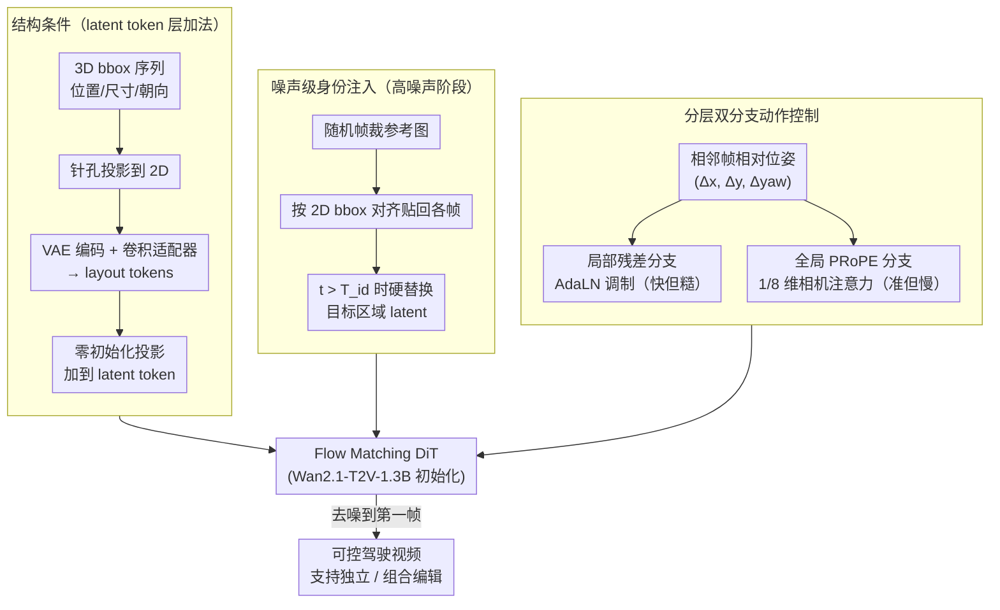

# Composing Driving Worlds through Disentangled Control for Adversarial Scenario Generation

**会议**: CVPR 2026  
**arXiv**: [2603.12864](https://arxiv.org/abs/2603.12864)  
**代码**: [GitHub](https://github.com/Yifever20002/CompoSIA)  
**领域**: 自动驾驶  
**关键词**: 驾驶世界模型, 解耦控制, 对抗场景生成, 噪声级身份注入, Flow Matching

## 一句话总结

提出 CompoSIA，一个组合式驾驶视频模拟器，将场景结构、物体身份和自车动作三个控制因素通过独立路径解耦注入 Flow Matching DiT，支持独立与组合编辑，实现系统性对抗场景合成，身份编辑 FVD 提升 17%，动作控制旋转/平移误差降低 30%/47%，下游规划器碰撞率平均提升 173%。

## 研究背景与动机

自动驾驶系统面临"长尾"安全关键场景的核心挑战：危险边缘案例通常来自常见交通元素的不常见组合（如卡车突然变道迫使急刹车），在 nuScenes、Waymo 等数据集中严重不足。为了有意构造此类对抗场景，生成模型需要对场景布局（哪些元素在哪里）、物体身份（元素长什么样）和自车行为（自车怎么运动）实现细粒度独立控制。

然而现有方法存在根本性缺陷：
- **DriveEditor** 支持结构和身份编辑，但无法生成新视角或控制动作
- **ReCamMaster** 仅控制相机动作，无元素级结构/身份控制
- **MagicDrive-V2** 通过共享路径注入多条件，导致信号耦合和生成质量下降
- **Vista** 动作跟随精度不足，旋转和平移误差显著偏高

作者论证：解耦控制的关键在于将不同因素的信号注入到 diffusion 过程的不同层级，而非共享单一路径。

## 方法详解

### 整体框架

CompoSIA 要解决的是"用同一个模型同时、独立地控制驾驶视频里的场景结构、物体身份和自车动作"，从而能像搭积木一样组合出对抗场景。它的底座是一个用 Wan2.1-T2V-1.3B 初始化的 Flow Matching DiT，关键在于：三类控制信号不挤在同一条路径上，而是被注入到 diffusion 过程的**不同层级**——结构信号在 latent token 层做加法、身份信号在噪声层做硬替换、动作信号在注意力/调制层做双分支注入。这样三者互不串扰，既能各管各的，也能叠在一起做组合编辑。

整条 pipeline 是这样转的：每个场景元素的 3D bbox 序列投影到图像平面、经 VAE 编码后加进 latent token，把"什么元素在哪里、怎么动"钉死；一张参考图在高噪声阶段按 bbox 贴进目标区域的 latent，把"它长什么样"绑住；帧级相机轨迹则通过局部 AdaLN 残差 + 全局 PRoPE 注意力两条分支，把"自车怎么走"注入。三路信号一起喂给 DiT，去噪到第一帧得到可控视频。训练时中间状态构造为 $z_{(t)} = \sigma_t z_{(0)} + (1-\sigma_t) \epsilon$，监督用 v-prediction 损失 $\mathcal{L}_{CFM} = \mathbb{E}_{\epsilon} \| v_\Theta(z_{(t)}, t) - (z_{(0)} - \epsilon) \|_2^2$，三种条件模态按 0.6:0.3:0.1（仅动作 / 结构+身份+动作 / 无条件）混采以兼顾各任务。

### 关键设计

**1. 结构条件：把"元素级空间布局"显式钉进 latent，而不是靠文本描述**

危险场景的本质是常见元素的不常见摆位，所以模型必须能精确指定"哪个元素、在哪、怎么动"。CompoSIA 给每个场景元素一条 3D bbox 序列 $\bm{b} \in \mathbb{R}^{F \times 7}$（位置、尺寸、朝向），先用针孔投影把它转成图像平面上的 $\bm{b}_f$，再经 VAE 编码和一个轻量卷积适配器变成 layout tokens $\bm{h}_{\bm{b}_f}$，最后用零初始化投影加到 latent token 上：

$$\bm{h}_{(t)} \leftarrow \bm{h}_{(t)} + f_{\text{zero}}(\bm{h}_{\bm{b}_f})$$

先投影到 2D 是为了让布局信号天然对齐 latent 空间；零初始化则让这条新路径在训练初期输出为零、不破坏预训练的视频先验，随训练逐步"长出"布局控制能力。

**2. 噪声级身份注入：把身份控制从"注意力约束"挪到"扩散恢复"里去做**

身份控制有个老矛盾——如果在注意力里强行约束外观，身份越像、运动越僵。CompoSIA 索性绕开注意力：训练时随机挑一帧裁出参考图，按 2D bbox 对齐贴回所有帧，得到 identity cue $\bm{r}_f$；在去噪的**高噪声阶段**直接把目标区域的 latent 硬替换成参考图的 latent，

$$z_{(t)} \leftarrow \bm{m} \odot z_{\bm{r}_f(t)} + (1-\bm{m}) \odot z_{(t)}, \quad \bm{m} = \bm{m}_{\bm{r}_f} \cdot \mathbb{I}(t > T_{id})$$

掩码 $\bm{m}$ 只在 $t > T_{id}$ 时生效。直觉是：高噪声阶段决定"画什么"，此时注入身份信息会在后续去噪中被自然融合进运动里；一旦进入低噪声阶段就松手（停掉替换），让模型自由细化、不至于把参考图原样复制出来破坏运动。采样时这个停止步 $T_{id}$ 就成了身份保真和生成自由的旋钮——$T_{id}=0.4$ 是论文取的最佳折中（消融见后），且不用逐案例调。

**3. 分层双分支动作控制：用"快但糙"的局部残差 + "准但慢"的全局 PRoPE 互补**

自车动作既要训得快、又要长程准，单一机制很难两头兼顾。CompoSIA 把它拆成两条分支。局部分支提取相邻帧的相对位姿 $\bm{a} = (\Delta x, \Delta y, \Delta \text{yaw}) \in \mathbb{R}^{F \times 3}$，正弦频率编码后经零初始化投影成 6 通道 AdaLN 参数（self-attention 和 FFN 各一组 shift/scale/gate），逐帧做残差调制——信号直接、收敛快，但丢了精确的相机内参。全局分支则基于 PRoPE（Projective Positional Encoding）在 1/8 维子空间里算相机注意力，投影矩阵 $D^{proj}$ 从相机内外参推导，再用零卷积安全注入主注意力分支——它给出精确的长程轨迹引导，代价是收敛慢、算量大（所以压到 1/8 维省开销）。两条分支正好互补：局部管早期收敛和帧间连续，全局管长程平移精度。消融里去掉局部分支 RotErr 从 0.55 飙到 2.84，去掉全局分支 TransErr 从 7.37 升到 11.24，印证了这种分工。

### 损失函数 / 训练策略

- **损失**：v-prediction CFM loss
- **训练配置**：16× A100 (80GB)，学习率动作投影器 $2 \times 10^{-4}$，其他组件 $1 \times 10^{-5}$，权重衰减 $5 \times 10^{-2}$，约 20,000 步
- **VAE 微调**：去除时间下采样（stride 1 替代原始 4×），在 100h 自采数据上微调 7 天
- **训练数据**：nuScenes 700 个多视角 20s 视频 + 100h 内部多视角自驾数据，10 Hz
- **混合分辨率**：$33 \times 256 \times 512$ 和 $33 \times 480 \times 960$
- **第一帧处理**：背景区域替换为干净 latent 锚定场景身份；前景区域用参考图填充；中间区域作为 inpainting 区域
- **条件解耦**：结构条件可泄漏动作信息（如周围车后移暗示自车前进），因此结构条件始终与动作配对训练

## 实验关键数据

### 主实验

**视频生成质量与条件对齐（Tab. 2）**：

| 任务 | 方法 | FVD ↓ | VBench Score ↑ |
|---|---|---|---|
| 场景跟随 | MagicDrive-V2 | 152.80 | 77.23% |
| 场景跟随 | **CompoSIA** | **133.66** | **81.05%** |
| 身份控制 | TTM | 231.17 | 75.16% |
| 身份控制 | LoRA-Edit | 161.32 | 79.83% |
| 身份控制 | DriveEditor | 179.57 | 79.13% |
| 身份控制 | **CompoSIA** | **149.15** | 80.30% |
| 动作控制 | ReCamMaster | 190.52 | 74.29% |
| 动作控制 | Vista | 171.49 | 75.35% |
| 动作控制 | MagicDrive-V2 | 279.61 | 73.44% |
| 动作控制 | **CompoSIA** | **137.21** | **80.79%** |

**动作控制精度（Tab. 3，TransErr ×1000）**：

| 方法 | RotErr ↓ (Following) | TransErr ↓ (Following) | RotErr ↓ (Editing) | TransErr ↓ (Editing) |
|---|---|---|---|---|
| ReCamMaster | 1.12 | 20.35 | 2.17 | 25.45 |
| Vista | 0.81 | 14.25 | 2.33 | 28.12 |
| MagicDrive-V2 | 0.76 | 13.66 | 2.21 | 22.86 |
| **CompoSIA** | **0.55** | **7.37** | **1.54** | **12.15** |

**规划鲁棒性评估（Tab. 5，Epona 开环）**：

| 编辑类型 | L2 Avg ↓ | 碰撞率 1s | 碰撞率 2s | 碰撞率 3s | 碰撞率 Avg | 变化 |
|---|---|---|---|---|---|---|
| Following GT | 1.42 | 0.04% | 0.24% | 0.76% | 0.35% | — |
| Following Generation | 1.65 | 0.08% | 0.36% | 1.32% | 0.59% | — |
| Editing Structure | — | 0.72% | 2.68% | 5.28% | 2.89% | +390% |
| Editing Identity | 2.19 | 0.12% | 0.48% | 1.64% | 0.75% | +27% |
| Editing Action | 2.32 | 0.16% | 0.76% | 2.64% | 1.19% | +102% |

### 消融实验

**动作条件分支消融（Tab. 4）**：

| 配置 | RotErr ↓ | TransErr ↓ |
|---|---|---|
| w/o 局部残差调制 (r.m.) | 2.84 | 15.80 |
| w/o 全局 PRoPE 注意力 (p.a.) | 0.62 | 11.24 |
| **Full** | **0.55** | **7.37** |

去掉局部残差调制后 RotErr 从 0.55 飙升至 2.84（+416%），说明局部分支对旋转控制至关重要；去掉全局 PRoPE 后 TransErr 从 7.37 升至 11.24（+53%），验证全局分支对平移精度的贡献。

### 关键发现

- **结构消融**：去掉结构条件后周围车辆运动和空间对齐完全失效
- **动作消融**：仅保留结构条件无法推断出自车运动，证明动作信号不会从结构中泄漏
- **身份停止步 $T_{id}$**：$T_{id}=0.6$ 生成自由度高但身份偏离；$T_{id}=0.2$ 身份保持强但过度锚定参考图；$T_{id}=0.4$ 取最佳折中，且无需逐案例调整
- **身份注入附加收益**：在复杂光照变化场景（如隧道穿行）中，噪声级身份注入显著减轻跨帧身份漂移

## 亮点与洞察

- 将驾驶场景生成建模为结构-身份-动作三因素组合问题，三类信号在 diffusion 过程的不同层级独立注入，是真正意义上的解耦而非共享路径
- 噪声级身份注入巧妙地将身份控制转化为扩散恢复问题，规避了注意力机制中身份与运动的天然冲突
- 下游规划器压力测试将世界模型从"数据合成器"提升为"可控模拟器"，结构编辑使碰撞率飙升 390%，揭示了标准基准无法暴露的隐藏失败模式
- 分层双分支设计体现了局部快速收敛 vs 全局精确控制的优雅互补

## 局限与展望

- 身份编辑泛化受限于训练数据（主要为驾驶场景），对完全 OOD 类别（如动物）效果差，需要更多样化视频数据扩展
- 身份编辑管线需手动指定参考目标的近似 3D bbox 尺寸（目前通过 Gemini 辅助估计），仍为半自动流程
- 仅在 nuScenes 上评估规划鲁棒性，缺少 Waymo 等更大规模数据集的验证
- 未探索多智能体交互的联合编辑（如同时控制多辆车的协调行为）

## 相关工作与启发

- vs **DriveEditor**：仅支持结构+身份编辑，无法生成新视角或控制动作，身份转移偏离原始参考
- vs **MagicDrive-V2**：结构和动作通过共享路径注入导致耦合，场景跟随 FVD 152.80 vs 133.66，动作跟随 TransErr 13.66 vs 7.37
- vs **ReCamMaster**：仅控制相机动作，FVD 190.52，无元素级结构/身份控制
- vs **Vista**：动作跟随精度差（RotErr 0.81 vs 0.55，TransErr 14.25 vs 7.37）
- vs **TTM**：训练无关的采样策略难以在精确运动下保持身份控制，FVD 231.17
- 解耦控制的设计范式可推广到其他多条件可控生成任务（如室内场景、机器人操作视频）
- 噪声级注入 vs 注意力级注入的权衡是可控生成领域的关键设计选择

## 评分

- 新颖性: ⭐⭐⭐⭐ 三因素解耦注入 + 噪声级身份控制 + 分层动作调制，系统性强
- 实验充分度: ⭐⭐⭐⭐ 三任务定量比较 + 多维消融 + 下游规划器压力测试
- 写作质量: ⭐⭐⭐⭐ 动机清晰，技术陈述精确，图表丰富
- 价值: ⭐⭐⭐⭐ 对自动驾驶安全评估和场景多样性有实际意义

<!-- RELATED:START -->

## 相关论文

- [\[CVPR 2025\] CompoSIA: Composing Driving Worlds through Disentangled Control for Adversarial Scenario Generation](../../CVPR2025/autonomous_driving/composing_driving_worlds_through_disentangled_control_for_adversarial_scenario_g.md)
- [\[ICLR 2026\] Steerable Adversarial Scenario Generation through Test-Time Preference Alignment (SAGE)](../../ICLR2026/autonomous_driving/steerable_adversarial_scenario_generation_through_test-time_preference_alignment.md)
- [\[CVPR 2026\] Learning Mutual View Information Graph for Adaptive Adversarial Collaborative Perception](learning_mutual_view_information_graph_for_adaptive_adversarial_collaborative_pe.md)
- [\[CVPR 2026\] MeanFuser: Fast One-Step Multi-Modal Trajectory Generation and Adaptive Reconstruction via MeanFlow for End-to-End Autonomous Driving](meanfuser_fast_one-step_multi-modal_trajectory_generation_and_adaptive_reconstru.md)
- [\[CVPR 2026\] Points-to-3D: Structure-Aware 3D Generation with Point Cloud Priors](points-to-3d_structure-aware_3d_generation_with_point_cloud_priors.md)

<!-- RELATED:END -->
