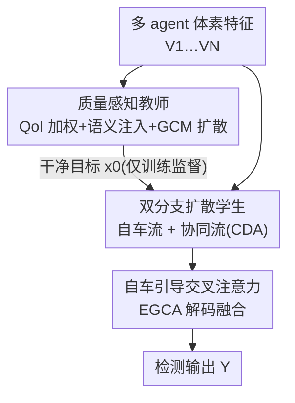

# CoopDiff: A Diffusion-Guided Approach for Cooperation under Corruptions

**会议**: CVPR 2026  
**论文**: [CVF Open Access](https://openaccess.thecvf.com/content/CVPR2026/html/Chen_CoopDiff_A_Diffusion-Guided_Approach_for_Cooperation_under_Corruptions_CVPR_2026_paper.html)  
**代码**: 待确认  
**领域**: 自动驾驶 / 协同感知  
**关键词**: 协同感知, V2X, 扩散去噪, 鲁棒融合, 师生蒸馏  

## 一句话总结
CoopDiff 把多智能体协同感知里的"抗腐蚀"问题重写成一个**特征空间扩散去噪**任务：用一个质量感知教师生成干净的监督特征，再让一个双分支扩散学生在带噪输入下把它重建出来，从而在雾、运动模糊、EMI 等六类腐蚀下都稳定超过现有 SOTA。

## 研究背景与动机
**领域现状**：协同感知（cooperative perception）让多辆车/路侧单元互相共享 LiDAR 特征，扩大感知范围、补盲区，是自动驾驶提升安全性的关键技术。主流做法是**中间融合**——各 agent 各自编码特征后再交换融合（V2X-ViT、Where2comm、CoAlign 等），因为它在精度和通信带宽之间取得较好平衡。

**现有痛点**：这些方法几乎都默认"输入特征是干净的"，把融合当成纯结构问题。但真实部署里到处是腐蚀：① 环境层面的数据质量退化（雾、回波反射降低每个 agent 的信噪比）；② 通信层面的失效（传感器故障、电磁干扰 EMI 导致某 agent 的数据流直接丢失）。一旦把这种"脏"特征共享进网络，噪声会在多智能体融合中**累积甚至被放大**，污染最终结果。

**核心矛盾**：以往的鲁棒方法（ERMVP、MDD、V2X-DGW 等）都是**针对某一种腐蚀**专门设计的——MDD 靠 4D 毫米波雷达扛雨雪、V2X-DGW 靠训练时模拟天气退化。它们对自己针对的扰动很强，但**换一种没见过的腐蚀就崩**（论文 Fig.1：MDD 在积水下很好，遇到 EMI 却急剧下滑）。现实里干扰来源多样且不可预测，"一种腐蚀一个模型"的范式不可扩展。

**本文目标**：要一个**腐蚀无关（corruption-agnostic）**的统一框架，能同时应对环境噪声和传感器丢失，而不是给每种腐蚀打补丁。

**切入角度**：作者注意到扩散模型本身就有很强的去噪先验——它训练时学的就是"从噪声里恢复干净分布"。如果把"去噪"这个目标直接搬到协同感知的**特征空间**，那么各种各样的腐蚀（无论环境还是传感器层面）都被统一建模成"特征上的噪声"，由一个生成式去噪过程一并处理。

**核心 idea**：用"师生扩散去噪"代替"结构化融合"——教师在干净监督下产出去噪目标特征，学生把带噪的协同特征**重建**成这个干净目标，从而对未见腐蚀也鲁棒。

## 方法详解

### 整体框架
CoopDiff 是一个**师生（teacher-student）扩散框架**，只在训练阶段两者深度耦合、推理时只用学生。给定 $N$ 个 agent 的原始输入 $X=\{X_j\}_{j=1}^N$，目标是输出统一感知结果 $Y$。整条管线分三步走：

1. **质量感知教师** $D^{tea}_\Psi$ 先做体素级早融合，用 QoI 权重压住带噪区域、注入语义先验，再经一个扩散网络产出一张**干净目标特征图** $x_0$——这是学生要重建的监督信号；
2. **双分支扩散学生** $D^{stu}_\theta$ 把"自车流"和"协同流"解耦成两条编码分支，各自以扩散方式从带噪潜变量 $x_t$ 出发重建 $x_0$，其中协同分支用 CDA 自适应采样其他 agent 的有用特征；
3. **自车引导交叉注意力（EGCA）** 解码器把两条分支的输出融合，在退化条件下平衡"自车特征完整性"与"协同互补信息"，最终送检测头出 $Y$。

教师产出的 $x_0$ 通过扩散损失 + 蒸馏损失反向监督学生；推理时教师被丢弃，只剩学生跑。

### 关键设计

**1. 质量感知早融合教师：先把"脏数据"过滤掉，再生成干净的监督目标**

朴素的早融合（直接堆叠所有 agent 的点云）会把每个 agent 的噪声一并累加，得到一张低信噪比的特征图，作为监督信号反而误导学生。教师为此做两件事。第一是 **QoI（Quality of Interest）加权聚合**：用一个共享卷积模块 $W_{qoi}$ 对每个 agent 的体素特征 $V_j\in\mathbb{R}^{H\times W\times C_{in}}$ 估计逐体素质量分数 $S_j=W_{qoi}(V_j)$，再做加权求和 $V_{w\text{-}agg}=\sum_{j=1}^N S_j\odot V_j$（$\odot$ 为逐元素乘），让腐蚀严重的区域被压低、稳定的几何结构被保留。第二是**语义先验注入**：把分类标签 $L_{cls}$ 经嵌入函数编码成语义图 $V_{sem}$，与几何特征通道拼接后卷积融合 $V_{fused}=\text{Conv}(F_{w\text{-}agg}\,\|\,V_{sem})$，把表征从纯几何提升到语义层。

得到 $V_{fused}$ 后教师再走一遍 **DDPM 扩散去噪**：骨干网 $B$ 抽出条件特征 $F^c=B(V_{fused})$，采样时间步 $t\sim U(1,T)$，对目标加噪得 $x_t=\sqrt{\bar\alpha_t}\,F^c+\sqrt{1-\bar\alpha_t}\,\epsilon,\ \epsilon\sim\mathcal{N}(0,I)$。去噪由 **GCM（Gated Conditional Modulation）** 块驱动——这是一个 FiLM 式操作，把条件特征过一个小卷积网络动态预测 shift / scale / gate 三组参数去调制主干特征，让条件在每一层都精确控制去噪轨迹：

$$x^{(l+1)},\,F^c_{(l+1)}=\text{GCM}\big(F^c_{(l)},\,x^{(l)}\big)+x^{(l)}$$

逐层迭代后输出的 $x_0$ 就是这张"干净特征图"，作为学生的重建目标。为什么有效：教师在训练时能见到干净数据，QoI + 语义 + 扩散三件套保证它产出的监督信号比朴素早融合干净得多，学生才有靠谱的"答案"去对齐。

**2. 双分支扩散学生 + 协同可变形注意力：把自车流和协同流解耦，避免噪声互相污染**

退化条件下融合有两个互相打架的诉求——既要**保住可靠的自车特征**，又要从协作者那里**抽取互补信息**。但朴素编码器把带噪输入直接合并再细化，会让自车信息被协同噪声污染。学生因此把中间融合重写成**生成式去噪**，用两条分支分别建模这两类信息。**Local（自车）分支**以带噪潜变量 $x_t$ 为初始输入，把自车特征 $F_i$ 和时间嵌入 $\gamma(t)$ 融成时间感知条件 $c^{loc}_{(0)}=\phi_{local}(F_i)\oplus\gamma(t)$，再用堆叠 GCM 块逐层注入局部条件 $x^{loc}_{(l+1)},c^{loc}_{(l+1)}=\text{GCM}_{(l)}(x^{loc}_{(l)},c^{loc}_{(l)})$，专心精炼自车自己的感知。

**Cooperative（协同）分支**则靠 **CDA（Cooperative Deformable Attention）** 构造多 agent 条件。它先把自车特征 $F_i$ 经 MLP 解耦成高置信 $F_{conf}$ 与低置信 $F_{unc}$，把 $F_{unc}$（也就是自车没把握的区域）与协作者特征拼成协同上下文 $F_{ctx}=\text{Agg}\big(\{\phi_{coop}(F_j)\}_{j\ne i}\big)\odot F_{unc}$——直白说就是"自己看不清的地方，才去借别人的视角"。接着从 $F_{conf}$ 和 $F_{ctx}$ 各自预测偏移、再融成最终偏移 $\Delta p$，喂给可变形注意力做精确采样 $F_{coop}=\text{DeformAttn}(Q,V,\Delta p)$，其中 $Q=C_Q(F_{conf}\|F_{ctx})$、$V=L_V(F_{ctx})$。最后用一个 selection head 只保留信息量最大的 token（默认选 30%），得到稀疏协同特征 $\tilde F_{coop}$，与局部先验拼成协同条件再逐层 GCM 调制。为什么有效：解耦保证自车的高置信特征不被协同噪声拖累，CDA 又让协同只在"自车不确定"的地方按需补位，做到既稳又互补。

**3. 自车引导交叉注意力（EGCA）解码：让自车特征当"锚"，平衡地融合两条分支**

两条分支各自重建出 $x^{loc}$ 和 $x^{coop}$ 后，需要在解码阶段合二为一。如果对称地融合，退化分支的噪声还是会反过来干扰自车。EGCA 的做法是让自车特征**主导查询**：Query $Q$ 只从 $x^{loc}$ 投影，而 key-value 同时来自两条分支——$(K_{loc},V_{loc})$ 取自 $x^{loc}$、$(K_{coop},V_{coop})$ 取自 $x^{coop}$，三者加同一套位置编码 $P$ 保持空间对应。拼成统一的 $K=[K_{loc}\|K_{coop}]$、$V=[V_{loc}\|V_{coop}]$ 后做标准交叉注意力 $F_{att}=\text{CrossAttn}(Q,K,V)$，再送检测头出 $Y$。因为 Query 始终绑定自车，融合天然偏向保留自车特征完整性，又能按注意力权重自适应吸收协同信息——这正好对应"自车引导"这个名字，也是退化条件下保持稳定的关键。

### 损失函数 / 训练策略
学生同时学两件事：重建干净目标 $x_0$ 和完成下游检测。总损失由四项加权：

$$L_{total}=\alpha L_{task}+\beta L_{diff}+\gamma L_{distill}+\delta L_{coop}$$

- **$L_{task}$**：标准检测复合损失（分类 + 回归）。
- **$L_{diff}$ 扩散损失**：学生预测噪声 $\hat y_t$ 去逼近真实噪声 $y_t=\epsilon$，并用**异方差 NLL** 让模型同时预测对数方差 $s_t=\log\sigma_t^2$ 来量化不确定性：$L_{diff}=\mathbb{E}_{t,\epsilon}\big[\tfrac12 e^{-s_t}|y_t-\hat y_t|_2^2+\tfrac12 s_t\big]$，从而给本就模糊的像素降权、提升数值稳定性。
- **$L_{distill}$ 知识蒸馏**：在 logits 层用 KL 散度对齐学生与教师输出 $L_{distill}=D_{KL}(\sigma(z^{tea}/\tau)\|\sigma(z^{stu}/\tau))$（温度 $\tau=1$），把教师的决策边界传给学生。
- **$L_{coop}$ 协同监督**：对协同分支 selection head 产出的空间选择图 $M_{coop}$ 用 BCE 监督，逼它在"真正需要协作的前景区域"上激活。

训练细节：基于 OpenCOOD 框架、PointPillars 作 LiDAR 编码器，所有方法在干净点云上训 30 epoch（batch=2）以考察泛化，Adam 学习率 1e-3，协作车数为 2，扩散编/解码器各 3 层、选择比 30%、中间特征压缩 16×，训练用 DDPM、推理用确定性 DDIM。

## 实验关键数据

### 主实验
在 OPV2V / DAIR-V2X 基础上构造的两个多腐蚀 benchmark **OPV2Vn / DAIR-V2Xn**（各含 6 类腐蚀：beam missing、motion blur、fog、EMI、water、echo）上评测。下表摘取 OPV2Vn 上几个代表条件（AP@0.5 / AP@0.7）：

| 条件 (OPV2Vn) | CoAlign | DSRC | **CoopDiff (本文)** |
|---|---|---|---|
| Clean | 0.8878 / 0.7931 | 0.8941 / 0.8035 | **0.9053 / 0.8357** |
| Motion Blur | 0.7785 / 0.5025 | 0.8062 / 0.5633 | **0.8142 / 0.6184** |
| Fog | 0.6778 / 0.6016 | 0.6763 / 0.6119 | **0.6871 / 0.6297** |
| EMI | 0.7741 / 0.6374 | 0.7714 / 0.6394 | **0.7891 / 0.6897** |

论文报告：干净条件下相对次优分别 +1.12% / +3.22%（OPV2Vn）与 +2.96% / +3.60%（DAIR-V2Xn）；六类腐蚀**平均**比 baseline 均值高 **8.40% / 13.16%（OPV2Vn）**、**10.24% / 10.13%（DAIR-V2Xn）**。

鲁棒性用 **mRCE（mean Relative Corruption Error，越低越好）**衡量，即腐蚀下相对干净的平均掉点：

| 方法 | OPV2V mRCE (% ↓) | DAIR-V2X mRCE (% ↓) |
|---|---|---|
| CoAlign | 17.66 | 28.90 |
| DSRC | 15.77 | 30.54 |
| **CoopDiff** | **12.94** | **26.79** |

CoopDiff 在两个数据集上 mRCE 都最低，说明它面对腐蚀的相对掉点最小、最稳。跨域泛化（OPV2V→未见的 Culver City）上 AP@0.5 仅掉 4.55%，也是所有方法里最小。

### 消融实验
逐组件累加（OPV2V / DAIR-V2X，AP@0.5 / AP@0.7）：

| 配置 | OPV2V | DAIR-V2X | 说明 |
|---|---|---|---|
| Baseline | 0.8548 / 0.7431 | 0.7330 / 0.5530 | 普通中间融合 |
| + GCM 扩散 | 0.8681 / 0.7765 | 0.7565 / 0.6092 | 加入扩散去噪机制 |
| + Coop 分支 | 0.8862 / 0.8192 | 0.8027 / 0.6591 | DAIR AP@0.5 +5.3% |
| + Teacher | 0.8984 / 0.8294 | 0.8042 / 0.6610 | 抑制噪声累积 |
| Full (+ EGCA) | **0.9053 / 0.8357** | **0.8069 / 0.6644** | 完整模型 |

教师内部消融（Tab.6）：Naive Early → +QoI → +SGM（语义引导）→ +GCM 逐步提升（OPV2V 0.8775→0.9053 AP@0.5），验证 QoI 加权与语义注入各有贡献。

### 关键发现
- **扩散步数是精度/效率的可调旋钮**：仅 2 步就已超过此前 SOTA 且达 9.45 FPS，10 步精度最高但更慢，>10 步增益 <0.1%（论文用 10 步报点）——这给部署留了灵活档位。
- **协同选择比很稳**：Top-K 选择比从 50% 降到 5% 性能几乎不变，30% 是最优平衡点，说明模型确实能聚焦到关键协同线索而非依赖大量冗余 token。
- **腐蚀敏感度**：所有 baseline 在 motion blur / fog 下急剧崩塌（CoAlign 在最强 blur 下 OPV2V 从 0.8878 掉到 0.1529），而 CoopDiff 在所有腐蚀类型与强度上敏感度最低。

## 亮点与洞察
- **把"抗各种腐蚀"统一成"特征空间去噪"**：这是最核心的范式转换——不再为每种腐蚀打补丁，而是借扩散的天然去噪先验把所有噪声源一并建模，可扩展性来自此。
- **QoI 加权 + selection head 是"按需协作"的两个闸门**：前者在聚合时压低脏区域，后者只在自车不确定处借用协同特征，思路可迁移到任何"多源融合且源质量不齐"的任务。
- **教师只在训练用、推理零成本**：师生蒸馏让干净监督的好处被学生内化，推理时不增加任何开销，工程上很友好。
- **异方差 NLL 扩散损失**：用预测的对数方差给模糊像素降权，是一个值得复用的鲁棒回归 trick。

## 局限与展望
- 作者自己点出：扩散模型有**生成出与真实不完全对齐的几何/物体**的风险（幻觉），这在安全攸关的自动驾驶里是隐患，是未来工作重点。
- ⚠️ 实验只用 LiDAR（PointPillars），未验证多模态（相机/雷达）下的表现；MDD 在仅 LiDAR 时明显退化，反过来也提示本文优势部分来自单模态设定。
- 协作车数固定为 2，规模更大、拓扑更复杂的车队下 QoI 聚合与 CDA 采样是否仍稳定，没有评估。
- 教师依赖分类标签注入语义先验，对标注质量有要求；标注噪声下教师监督是否会退化未讨论。

## 相关工作与启发
- **vs 中间融合派（V2X-ViT / Where2comm / CoAlign）**：它们把融合当**干净特征上的结构问题**，在理想条件下最优，但噪声会随融合累积放大；本文显式建模去噪目标，腐蚀下稳得多。
- **vs 针对性鲁棒方法（ERMVP / MDD / V2X-DGW）**：它们各自只扛一种腐蚀（共识采样 / 雷达抗雨雪 / 训练模拟天气），换腐蚀就崩；CoopDiff 是腐蚀无关的统一框架。
- **vs 扩散用于融合（DifFUSER / MDD / CoGMP）**：前人多在 BEV 或多模态生成里用扩散，本文把扩散去噪目标**直接注入协同感知的特征空间**，统一建模多源复合噪声做多 agent 特征重建。

## 评分
- 新颖性: ⭐⭐⭐⭐⭐ 把协同感知抗腐蚀重写成特征空间师生扩散去噪，范式新且统一
- 实验充分度: ⭐⭐⭐⭐⭐ 两个自建多腐蚀 benchmark × 六类腐蚀 + mRCE + 跨域 + 多组消融，扎实
- 写作质量: ⭐⭐⭐⭐ 结构清晰、公式完整；图注密集、部分符号（如 SGM 与 GCM 关系）需对照原文
- 价值: ⭐⭐⭐⭐ 腐蚀无关 + 推理零额外开销 + 可调步数，对 V2X 落地有实用意义

<!-- RELATED:START -->

## 相关论文

- [\[CVPR 2026\] A Self-Conditioned Representation Guided Diffusion Model for Realistic Text-to-LiDAR Scene Generation](a_self-conditioned_representation_guided_diffusion_model_for_realistic_text-to-l.md)
- [\[CVPR 2026\] Hybrid Robust Collaborative Perception with LiDAR-4D Radar Fusion under Adverse Weather Conditions](hybrid_robust_collaborative_perception_with_lidar-4d_radar_fusion_under_adverse_.md)
- [\[CVPR 2026\] ProOOD: Prototype-Guided Out-of-Distribution 3D Occupancy Prediction](proood_prototype-guided_out-of-distribution_3d_occupancy_prediction.md)
- [\[CVPR 2026\] Query2Uncertainty: Robust Uncertainty Quantification and Calibration for 3D Object Detection under Distribution Shift](query2uncertainty_robust_uncertainty_quantification_and_calibration_for_3d_objec.md)
- [\[CVPR 2026\] Test-Time Training for LiDAR Semantic Segmentation under Corruption via Geometric Inlier Discrimination](test-time_training_for_lidar_semantic_segmentation_under_corruption_via_geometri.md)

<!-- RELATED:END -->
