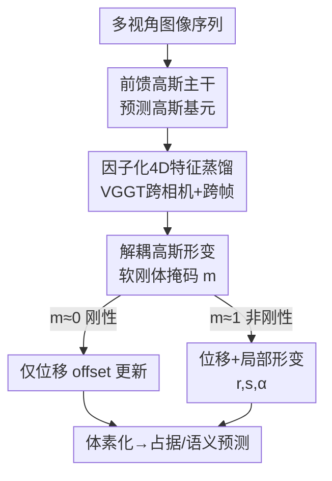

# Deformable Gaussian Occupancy: Decoupling Rigid and Nonrigid Motion with Factorized Distillation

**会议**: CVPR 2026  
**arXiv**: [2605.28587](https://arxiv.org/abs/2605.28587)  
**代码**: https://github.com/vita-epfl/DeGO (有)  
**领域**: 自动驾驶 / 3D占据预测 / 高斯泼溅  
**关键词**: 弱监督占据预测、可形变高斯、刚性/非刚性解耦、4D基础模型蒸馏、VGGT

## 一句话总结
DeGO 给弱监督相机占据预测的每个 3D 高斯加一个"软刚体掩码"，让它自适应地走"刚性位移"还是"非刚性形变"，再从 VGGT 这个 4D 基础模型蒸馏跨相机+跨帧特征，在 Occ3D-NuScenes 上把整体 mIoU 提了 10.9%、人体类指标提了 13.5%。

## 研究背景与动机
**领域现状**：相机-only 的 3D 占据预测把场景统一表达为体素网格里的几何+语义，但体素标注极贵。为摆脱密集 3D 标签，弱监督路线兴起——用可微渲染把 3D 高斯/NeRF 渲成 2D，再用伪深度、伪分割（Grounded-SAM、Metric3D）和跨帧一致性做监督。其中前馈高斯泼溅（GaussianOcc、GaussTR、GaussianFlowOcc 等）因高效且性能强，已成为主流。

**现有痛点**：这些方法对动态场景有两个硬伤。其一，高斯基元被**均匀**撒在 3D 体积里，大量容量被道路、墙面这种又大又静的背景吃掉，留给行人这种小却安全攸关的目标的分辨率严重不足。其二，运动模型被限制成**刚性平移**或简单的帧间 offset（如 GaussianFlowOcc 的 per-Gaussian 时间偏移），根本表达不了人体那种逐帧变形的非刚性运动。两者叠加导致人体几何被严重欠表达、人相关 mIoU 掉、时序一致性不可靠。

**核心矛盾**：直接把动态渲染里的"可形变高斯"搬过来也不行——驾驶场景是刚性结构与高度非刚性人体的混合体，用**单一统一形变场**会把不兼容的动态纠缠在一起，产生不稳定的几何更新；而且可形变高斯本就只在弱监督下优化，缺乏稳定的 4D 指引。

**本文目标**：让每个高斯**自己决定**该不该形变，同时给弱监督训练注入稳定的 4D 时空先验。

**核心 idea**：用一个可学习的软刚体掩码把刚性运动和非刚性形变**解耦**到每个高斯上，再用因子化的 4D 蒸馏从 VGGT 把跨相机、跨帧知识灌进高斯特征——形变感知 + 基础模型对齐，二者互相强化。

## 方法详解

### 整体框架
DeGO 要解决的是"弱监督下、相机-only 地预测动态 3D 占据，且要把非刚性的人体表达好"。整体是一个前馈高斯主干：多视角图像先经主干预测出一组 3D 高斯基元（位置、旋转、尺度、不透明度、隐特征）；训练时采样过去+未来帧，把高斯特征送进两个协同模块——**因子化特征蒸馏（FFD）**先把 VGGT 教师的跨相机/跨帧特征对齐进高斯特征，**解耦高斯形变（DGD）**再据此为每个高斯分别预测刚性 offset 和非刚性形变，由软刚体掩码加权融合。最后把参考帧高斯体素化得到占据+语义。关键是**时序形变只在训练期当增广用**：推理时只喂单帧多视角图像，预测一组当前帧高斯再体素化，不带额外推理开销。

### 关键设计

**1. 解耦高斯形变（DGD）：用软刚体掩码让每个高斯自选运动模式**

针对"单一形变场把刚性与非刚性纠缠在一起"的痛点，DGD 给每个高斯 $G_i$ 额外学一个软刚体掩码 $m_i\in[0,1]$，$m_i\approx1$ 表示非刚性、$m_i\approx0$ 表示刚性。形变头（一组轻量 MLP）对每个高斯、每个时间戳预测两路更新：刚性 offset $\Delta G_i^{\text{rig}}(t)$ 和非刚性形变 $\Delta G_i^{\text{def}}(t)$，后者只在 $m_i$ 高时才起作用，最终更新按掩码加权：

$$\Delta G_i(t)=(1-m_i)\,\Delta G_i^{\text{rig}}(t)+m_i\,\Delta G_i^{\text{def}}(t)$$

输入端先对位置和时间做位置编码 $\gamma_p(\boldsymbol{\mu})$、$\gamma_t(t)$，时间编码经投影得到时间嵌入 $\mathbf{e}_t$，与高斯特征拼接后过 FeatureNet 得隐特征 $\mathbf{h}_i(t)$ 再喂形变头。刚性高斯只更新位置 $\boldsymbol{\mu}_i(t)$，非刚性高斯额外更新旋转、尺度、不透明度 $(\mathbf{r}_i,\mathbf{s}_i,\alpha_i)$。为了让掩码逼近 0/1 而不是模糊中间值，加了二值正则 $\mathcal{L}_{\text{mask}}=[\mathbf{m}_i(1-\mathbf{m}_i)]$，把每个高斯逼向"要么纯刚性、要么纯非刚性"。这样刚性结构保持几何稳定、非刚性区域才花容量去形变，自适应地把形变能力分配给真正需要的人体区域

**2. 因子化 4D 特征蒸馏（FFD）：从 VGGT 蒸馏跨相机+跨帧时空知识**

弱监督下的 2D 伪标签信号太弱、缺时序一致性。以往蒸馏用 DINO/CLIP 这类 2D 教师，只给逐帧、图像空间的特征，没有 4D 时空推理能力。FFD 改用 VGGT 当教师——它在多视角+时序数据上预训练，每个 Transformer block 交替做**跨相机（空间）注意力** $\text{Attn}_{\text{sp}}$ 和**跨帧（时间）注意力** $\text{Attn}_{\text{tmp}}$。FFD 在选定 block $\ell$ 同时取该 block 的空间输出 token 和时间输出 token，去掉相机/register token 后 reshape 回特征图，沿通道**拼接**成时空教师特征 $\mathbf{T}_0^{(\ell)}(v)=[\mathbf{T}_0^{(\ell,\text{sp})};\mathbf{T}_0^{(\ell,\text{tmp})}]$，再经投影压到紧凑维度 $C_a$ 并上采样到渲染图尺寸。学生侧把参考帧高斯渲染成 per-pixel 特征图 $\mathbf{S}'_0(v)$，用余弦相似度损失对齐：

$$\mathcal{L}_{\text{distill}}=\frac{1}{|\mathcal{V}||\Omega|}\sum_{v\in\mathcal{V}}\sum_{u\in\Omega}\Big(1-\cos\big(\mathbf{T}'^{(\ell)}_0(v)[u],\,\mathbf{S}'_0(v)[u]\big)\Big)$$

"因子化"正体现在它把空间和时间两路注意力的输出分别取出再拼接，而不是混成一团——消融显示跨相机、跨帧各自只贡献 +2.0%、+1.4%，合起来 +4.4%，说明两路信息互补。蒸馏对象选在高斯 Transformer 而非图像编码器，因为 3D 高斯特征与 VGGT 教师更兼容（蒸到图像编码器反而掉 5.2%）

**3. 训练期多帧形变、推理期单帧前馈：把时序当增广而非负担**

可形变高斯通常意味着推理也要喂多帧、慢且贵。DeGO 把时序形变定位成**纯训练期增广**：训练时采样 $t\in[-T,+T]$ 的过去/未来帧，让形变模块预测高斯在这些时刻的位置/旋转/尺度/不透明度，配合伪深度、伪分割监督，逼模型在运动下保持几何与语义连贯；推理时只给单帧，网络直接前馈出一组当前帧高斯 $\{G_i(0)\}$ 再体素化。于是模型学到了运动感知的先验，却保留了前馈高斯主干的推理效率——形变与蒸馏都不进入部署路径。消融还发现形变帧数取 8 帧最优（mIoU 18.05），12 帧要预测未来约 6 秒、太难反而崩到 12.48

### 损失函数 / 训练策略
沿用 GaussianFlowOcc 的 2D 弱监督：Grounded-SAM 给伪分割、Metric3D 给伪深度，分别算逐像素分割交叉熵 $\mathcal{L}_{\text{seg}}$ 和深度 L1 回归 $\mathcal{L}_{\text{dep}}$。加上蒸馏 $\mathcal{L}_{\text{distill}}$ 和形变正则 $\mathcal{L}_{\text{def}}=\lambda_{\text{reg}}\mathcal{L}_{\text{reg}}+\lambda_{\text{mask}}\mathcal{L}_{\text{mask}}$（$\mathcal{L}_{\text{reg}}$ 约束各形变量 L2 范数保证时序平滑，$\mathcal{L}_{\text{mask}}$ 逼掩码二值化），总损失为四项加权和：

$$\mathcal{L}_{\text{total}}=\lambda_{\text{seg}}\mathcal{L}_{\text{seg}}+\lambda_{\text{dep}}\mathcal{L}_{\text{dep}}+\lambda_{\text{distill}}\mathcal{L}_{\text{distill}}+\lambda_{\text{def}}\mathcal{L}_{\text{def}}$$

## 实验关键数据

### 主实验
在 Occ3D-NuScenes（40k 帧、每帧 6 视角、体素网格 [200,200,16]、体素 0.4m，700 训练 / 150 验证）上对比弱监督方法。除标准 IoU/mIoU 外，还报告 Instance mIoU（InsM）、Scene mIoU（ScnM）和作者新提的 Human-centric mIoU（HCM，聚焦行人/自行车/摩托车这类安全攸关的非刚性类）。

| 指标 | 之前最佳 GaussianFlow* | DeGO（本文） | 相对提升 |
|------|------|------|------|
| mIoU | 16.27 | 18.05 | +10.9% |
| IoU | 40.39 | 45.38 | +12.4% |
| HCM（人体类） | 9.73 | 11.04 | +13.5% |
| InsM（实例级） | 9.59 | 10.34 | +7.8% |
| ScnM（场景级） | 29.62 | 33.46 | +13.0% |

DeGO 在 mIoU 与 IoU 上全面领先；HCM/InsM 的提升印证它对非刚性人体和刚性物体的理解都更强，ScnM 的提升说明对动态 agent 与静态结构都更鲁棒。

### 消融实验
| 配置（形变 / DINOv2 / VGGT） | mIoU | IoU | 说明 |
|------|------|------|------|
| ✗ / ✗ / ✗ | 12.06 | 36.41 | 基线 |
| ✗ / ✗ / ✓ | 12.26 | 36.54 | 无形变时蒸馏几乎无用 |
| ✓ / ✗ / ✗ | 17.29 | 43.67 | 加形变模块，+43.4% |
| ✓ / ✓ / ✗ | 17.35 | 43.15 | DINOv2 蒸馏仅小幅增益 |
| ✓ / ✗ / ✓ | **18.05** | **45.38** | VGGT 蒸馏再 +4.4% |

形变模块内部参数消融（Table 4）：仅旋转 12.77 → 加尺度 17.06（尺度直接改几何，贡献最大）→ 加不透明度 17.43 → 再加刚体掩码 18.05。蒸馏两路注意力（Table 5）：跨相机 +2.0%、跨帧 +1.4%、合并 +4.4%。教师层（Table 6）：第 22 层最佳 18.05，最后一层（23）因过于任务特化、缺几何知识反而掉到 17.88。

### 关键发现
- **形变与蒸馏互相强化**：没有形变模块时 VGGT 蒸馏几乎不涨（12.06→12.26），有形变后才再 +4.4%——4D 蒸馏要落到能形变的高斯上才有意义。
- **尺度是形变里最关键的参数**：它直接改变占据几何，单加尺度就从 12.77 跳到 17.06。
- **时序窗口要适中**：形变帧 8 帧最优，过长（12 帧 ≈ 预测未来 6 秒）反而崩；投影维度 32 最优（16→32 涨、48 略降）。
- **蒸馏要灌到高斯特征而非图像特征**：蒸到图像编码器掉 5.2%，说明 3D 高斯特征与 VGGT 教师更兼容。

## 亮点与洞察
- **软刚体掩码 + 二值正则**是个轻巧又通用的解耦器：不需要类别先验或显式分割，仅靠一个 $[0,1]$ 标量和 $m(1-m)$ 正则就让每个高斯自动归到刚性或非刚性，可迁移到任何需要"混合动态"建模的高斯/点云任务。
- **把 4D 基础模型的"空间×时间"注意力因子化后再蒸馏**很巧：不是蒸一个混合特征，而是分别取空间/时间输出 token 拼接，让学生同时获得跨相机和跨帧两种互补能力——这给"如何用 VGGT 这类几何基础模型当教师"提供了可复用范式。
- **"训练期形变、推理期单帧"的设计**让动态建模零推理成本，对落地友好；这种"把时序当训练增广"的思路可迁移到其他前馈感知任务。

## 局限与展望
- **HCM 绝对值仍低**（11.04），人体类占据本身极难，弱监督下的伪标签质量（Grounded-SAM/Metric3D）是上限瓶颈，论文未深究伪标签噪声的影响。
- **依赖 VGGT 这一特定教师**：蒸馏增益与 VGGT 的预训练分布强绑定，换到无多视角时序预训练的基础模型能否复现 +4.4% 未验证。
- **时序外推能力有限**：形变帧超过 8 即明显退化，说明 4D 高斯对中长时未来的可靠预测仍是难题；掩码二值化是否会在刚柔边界（如人体接触地面处）产生伪影也未分析。
- 改进方向：把伪标签置信度引入蒸馏/形变损失的加权；探索掩码的连续过渡区域以更好处理半刚性物体。

## 相关工作与启发
- **vs GaussianFlowOcc [2]**：它用 per-Gaussian 帧间 offset 建模动态，只能刚性平移；DeGO 用软刚体掩码解耦出非刚性形变，并补上 4D 蒸馏，在 mIoU/HCM 上分别 +10.9%/+13.5%，本质是把"统一刚性运动"升级成"逐高斯自适应刚柔运动"。
- **vs GaussTR [19]**：GaussTR 把高斯特征与 2D 基础模型（如 DINO）对齐做开放词汇推理，是逐帧、图像空间的蒸馏；DeGO 改用 VGGT 的 4D 时空特征并因子化蒸馏，强调跨相机+跨帧一致性而非开放词汇。
- **vs 动态渲染里的可形变高斯 [43,44]**：那些工作用单一形变场处理非刚性，直接搬到驾驶场景会让刚柔动态纠缠、几何不稳；DeGO 的解耦正是为驾驶场景"刚性结构 + 非刚性人体混合"量身定制。

## 评分
- 新颖性: ⭐⭐⭐⭐ 软刚体掩码解耦 + 因子化 4D 蒸馏组合新颖，但两个组件分别源自可形变高斯和基础模型蒸馏已有思路。
- 实验充分度: ⭐⭐⭐⭐ 主实验 + 7 张消融（模块/参数/帧数/注意力/教师层/蒸馏位置/投影维度）覆盖很全，但仅在 Occ3D-NuScenes 单 benchmark 验证。
- 写作质量: ⭐⭐⭐⭐ 动机清晰、公式完整、新指标 HCM 定义明确。
- 价值: ⭐⭐⭐⭐ 把人体类占据提了 13.5% 且零推理开销，对自动驾驶安全感知有实用价值。

<!-- RELATED:START -->

## 相关论文

- [\[CVPR 2026\] MAD: Motion Appearance Decoupling for Efficient Driving World Models](mad_motion_appearance_decoupling_for_efficient_driving_world_models.md)
- [\[CVPR 2026\] GEM: Generating LiDAR World Model via Deformable Mamba](gem_generating_lidar_world_model_via_deformable_mamba.md)
- [\[CVPR 2026\] Generalizing Visual Geometry Priors to Sparse Gaussian Occupancy Prediction](generalizing_visual_geometry_priors_to_sparse_gaussian_occupancy_prediction.md)
- [\[CVPR 2025\] Spatiotemporal Decoupling for Efficient Vision-Based Occupancy Forecasting](../../CVPR2025/autonomous_driving/spatiotemporal_decoupling_for_efficient_vision-based_occupancy_forecasting.md)
- [\[CVPR 2026\] ReMoT: Reinforcement Learning with Motion Contrast Triplets](remot_reinforcement_learning_with_motion_contrast_triplets.md)

<!-- RELATED:END -->
