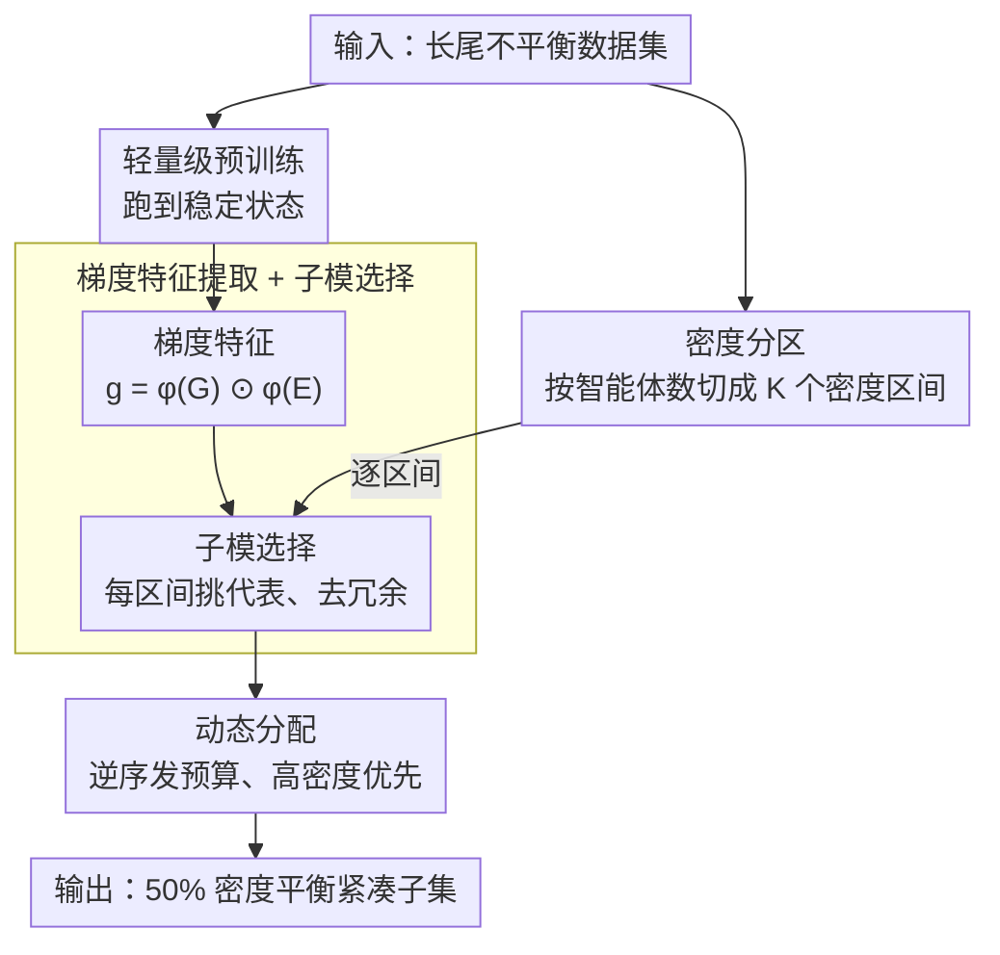

# Den-TP: A Density-Balanced Data Curation and Evaluation Framework for Trajectory Prediction

**会议**: CVPR 2026  
**arXiv**: [2409.17385](https://arxiv.org/abs/2409.17385)  
**代码**: 无  
**领域**: 自动驾驶 / 轨迹预测  
**关键词**: 轨迹预测, 数据中心, 密度平衡, 子模优化, 长尾分布

## 一句话总结

从数据中心视角出发，提出 Den-TP 框架通过密度感知的数据集筛选和评估协议来解决轨迹预测数据集中场景密度的长尾不平衡问题，仅用 50% 数据就能保持整体性能并显著改善高密度场景的鲁棒性。

## 研究背景与动机

轨迹预测是自动驾驶中的关键任务，近年来基于 Transformer 和 GNN 的方法在标准基准上取得了很好的性能。然而，从数据角度审视会发现一个被忽视的严重问题：现有轨迹预测数据集存在显著的长尾密度不平衡。

在 Argoverse 1 和 2 等主流数据集中，低密度场景（少量交互者）占据绝大多数样本，而安全关键的高密度场景（60+ 个智能体的复杂多体交互）仅占不到 2.5%。这导致两个核心痛点：(1) 训练信号被低密度样本主导，模型在高密度场景中严重欠训练；(2) 标准评估协议使用全数据集平均误差，掩盖了高密度场景中的性能退化——模型在整体指标上看起来不错，但在最危险的密集交互场景中可能严重失效。

这个问题的根本矛盾在于：高密度场景最为安全关键（涉及复杂多体交互，预测误差可能直接危及驾驶安全），但在训练和评估中的影响力最小。现有的应对策略（重采样、重加权、数据增强）虽然改变了采样频率，但并未以原则性方式重塑数据分布。

核心 idea：将场景密度作为条件变量，通过密度感知的分区-选择策略构建紧凑但平衡的子集，利用基于梯度的子模优化在每个密度区间内选择代表性样本，同时跨区间实施偏向高密度的动态分配。

## 方法详解

### 整体框架

Den-TP 要解决的是「数据集里高密度场景太稀少、模型学不好评估又看不出来」这件事，整条流水线分提取和选择两个阶段。提取阶段先用一次轻量级预训练把模型跑到稳定状态，从而拿到每个样本可靠的梯度特征，同时按场景里的智能体数量把整个数据集切成若干密度区间。选择阶段则在每个区间内部用子模优化挑出最有代表性、彼此最不冗余的样本，再跨区间按「越稀有越优先」的规则分配选择预算，把原本被淹没的高密度场景显式地上加权。两阶段走完，输出的是一个只占原数据集一半左右、但密度分布被重新平衡过的紧凑训练子集。

### 关键设计

**1. 密度分区：先把长尾摊开，才谈得上平衡采样**

问题的根子在于低密度样本数量压倒性多，梯度更新被它们主导，高密度场景系统性欠训练。要纠偏，第一步得把数据按复杂度显式分层。Den-TP 给每个样本算一个密度级别 $\rho(S_j)$（直接用场景里的智能体数量），再用固定间隔 $\tau$ 把数据集切成 $K$ 个互不相交的子集 $\mathcal{D}_k$：样本 $S$ 落入 $\mathcal{D}_k$ 当且仅当 $\rho(S) \in [\rho_{\min}+(k-1)\tau,\ \rho_{\min}+k\tau)$。智能体计数显然不能完整刻画场景复杂度（20 个各走各路和 20 个密集交汇并不一样），但它胜在与数据集无关、可跨数据集一致比较，作为密度代理足够支撑后续的分区-选择逻辑。这一步本身不挑样本，它是后面平衡采样能落地的前提。

**2. 梯度特征提取 + 子模选择：在每个区间里挑出"最该留"的样本**

分好层之后，每个区间内部还要决定留哪些。Den-TP 不在原始特征空间做聚类，而是看样本对训练的实际贡献：对每个样本反向传播，取预测输出处的梯度 $\mathbf{G} = \nabla_{\hat{\mathbf{Y}}} \mathcal{L}$，再与解码器嵌入 $\mathbf{E}$ 逐元素相乘融合成 $\mathbf{g} = \phi(\mathbf{G}) \odot \phi(\mathbf{E})$——这样得到的特征同时编码了损失敏感度和解码器表示，比纯特征聚类更能反映"这个样本对模型到底有多重要"。在此基础上定义一个子模评分函数，对候选样本 $S_j$ 同时衡量它与已选集合 $\mathcal{C}_k$ 的相似度（要小，避免冗余）和它与未选部分 $\mathcal{D}_k \setminus \mathcal{C}_k$ 的相似度（要大，保证代表性）：

$$P(S_j) = \sum_{S_i \in \mathcal{C}_k} \frac{\mathbf{g}_i \cdot \mathbf{g}_j}{\|\mathbf{g}_i\|\|\mathbf{g}_j\|} - \sum_{S_i \in \mathcal{D}_k \setminus \mathcal{C}_k} \frac{\mathbf{g}_i \cdot \mathbf{g}_j}{\|\mathbf{g}_i\|\|\mathbf{g}_j\|}$$

贪心地每次选入使 $P$ 最小的样本，挑出来的子集既与已留样本冗余最少、又最能代表整个区间，从而用更少样本覆盖更广的训练信号。

**3. 动态分配：逆序发预算，先保住稀有的高密度场景**

区间内会选了，跨区间怎么分配总预算又是一个问题——按比例分会让本就稀少的高密度区间继续吃亏。Den-TP 的做法是逆着来：给定总预算 $B = \lfloor \alpha |\mathcal{D}| \rfloor$，从密度最高的区间开始往低密度方向依次处理，第 $k$ 个区间分到 $n_k = \min(|\mathcal{D}_k|,\ \lfloor B/k \rfloor)$ 的名额。如果某个高密度区间本身样本数还不到分给它的预算，就整段全保留、连梯度选择都省了；用不完的预算再顺势流给下一个低密度区间。逆序处理确保高密度场景不会在预算分配早期就被挤掉。支撑这套偏向策略的是一个关键观察：高密度场景学到的交互模式能向低密度场景迁移，反过来却很弱——所以把有限预算压在高密度一侧，整体收益最大。

### 损失函数 / 训练策略

梯度提取使用的训练损失为 $\mathcal{L} = \mathcal{L}_{\text{reg}} + \mathcal{L}_{\text{cls}}$，其中 $\mathcal{L}_{\text{reg}}$ 是最佳匹配预测模式上的负对数似然回归损失，$\mathcal{L}_{\text{cls}}$ 是优化预测模式概率的交叉熵损失。梯度提取需要轻量级预训练步骤获得稳定的梯度估计。

## 实验关键数据

### 主实验

| 数据集 | 方法 | 保留比例 | minADE↓ | minFDE↓ | MR↓ |
|--------|------|------|----------|------|------|
| Argoverse 1 | Full (HiVT-64) | 100% | 0.695 | 1.037 | 0.109 |
| Argoverse 1 | Random | 50% | 0.750 | 1.175 | 0.137 |
| Argoverse 1 | Herding | 50% | 0.728 | 1.107 | 0.126 |
| Argoverse 1 | **Den-TP** | **50%** | **0.706** | **1.074** | **0.110** |
| Argoverse 1 | Full (HPNet) | 100% | 0.647 | 0.871 | 0.070 |
| Argoverse 1 | **Den-TP** (HPNet) | **50%** | **0.661** | **0.913** | **0.074** |

### 消融实验

| 策略 | 数据量 | minADE↓ | minFDE↓ | MR↓ | 说明 |
|------|---------|------|------|------|------|
| Augmenting | 220k | 0.718 | 1.106 | 0.115 | 复制高密度样本 |
| Weighting | 190k | 0.715 | 1.108 | 0.114 | 重加权高密度 |
| Epoch-wise | 95k | 0.752 | 1.189 | 0.130 | 每轮重采样 |
| High-density+Random | 95k | 0.724 | 1.111 | 0.117 | 保留高密度+随机填充 |
| **Den-TP** | **95k** | **0.706** | **1.074** | **0.110** | 密度平衡选择 |

### 关键发现

- **50% 数据即可达到甚至超越全量性能**：Den-TP 在 HiVT-64 上用 50% 数据 (minADE 0.706) 超过了 100% 全量数据 (0.695) 在 MR 指标上的表现，且 minADE 仅差 1.6%
- **高密度场景的能力可迁移**：密集交互场景学到的交互模式能够泛化到简单场景，但反向迁移很弱——这是密度优先分配策略的理论依据
- **跨模型泛化**：用 HiVT-64 做选择的子集在 HiVT-128 和 HPNet 上也保持优势，说明选择策略不依赖特定模型架构
- **朴素策略均不足**：重加权和数据增强虽改变了采样频率但增加了冗余而非覆盖度，epoch-wise 重采样引入不稳定性

## 亮点与洞察

- **数据中心视角切入轨迹预测**是最大亮点——此前该领域几乎完全是模型中心的，本文首次系统揭示了密度不平衡对训练和评估的严重影响。巧妙之处在于用简单的智能体计数作为密度代理就获得了足够的分析力
- **密度条件评估协议**的引入同样有价值——标准的聚合指标掩盖了长尾失效模式，按密度区间报告性能能暴露真正的安全风险
- **子模优化 + 梯度特征的组合**可以迁移到其他存在长尾分布问题的领域（如目标检测中的小目标、医学影像中的罕见病变）

## 局限与展望

- 智能体数量作为密度代理过于简化，不能区分同一密度下不同复杂度的交互模式（如 20 个智能体各自独立行驶 vs 20 个智能体密集交汇）
- 梯度提取需要预训练步骤，增加了额外的计算开销
- 仅在 Argoverse 1 和 2 上验证，未在 nuScenes、INTERACTION 等其他数据集上测试
- 动态分配策略中 $\lfloor B/k \rfloor$ 的设计缺乏理论证明其最优性

## 相关工作与启发

- **vs Random Selection**: 在 50% 预算下，Den-TP 的 minADE (0.706) 比随机选择 (0.750) 低 5.9%
- **vs Herding**: Herding 基于特征均值做贪心选择，但不考虑密度分布，Den-TP 在所有指标上均优
- **vs K-Means Clustering**: 基于轨迹特征聚类的方法忽略了梯度信息和密度平衡，性能介于随机和 Den-TP 之间

## 评分

- 新颖性: ⭐⭐⭐⭐ 首次从数据中心视角系统分析轨迹预测中的密度不平衡，密度条件评估协议有方法论贡献
- 实验充分度: ⭐⭐⭐⭐ 多数据集、多模型、多策略对比、多保留比例，非常全面
- 写作质量: ⭐⭐⭐⭐ 问题定义清晰，可视化丰富（密度分布图、性能曲线），算法描述规范
- 价值: ⭐⭐⭐⭐ 揭示了领域中被忽视的数据层面问题，实用价值高——可以直接用于减少训练成本

<!-- RELATED:START -->

## 相关论文

- [\[CVPR 2026\] MetaDAT: Generalizable Trajectory Prediction via Meta Pre-training and Data-Adaptive Test-Time Updating](metadat_generalizable_trajectory_prediction_via_meta_pre-training_and_data-adapt.md)
- [\[CVPR 2026\] A Prediction-as-Perception Framework for 3D Object Detection](a_prediction-as-perception_framework_for_3d_object_detection.md)
- [\[ECCV 2024\] UniTraj: A Unified Framework for Scalable Vehicle Trajectory Prediction](../../ECCV2024/autonomous_driving/unitraj_a_unified_framework_for_scalable_vehicle_trajectory_prediction.md)
- [\[CVPR 2026\] FoSS: Modeling Long-Range Dependencies and Multimodal Uncertainty in Trajectory Prediction via Fourier–State Space Integration](foss_modeling_long_range_dependencies_and_multimodal_uncertainty_in_trajectory_p.md)
- [\[CVPR 2026\] Recover to Predict: Progressive Retrospective Learning for Variable-Length Trajectory Prediction](recover_to_predict_progressive_retrospective_learning_for_variable-length_trajec.md)

<!-- RELATED:END -->
