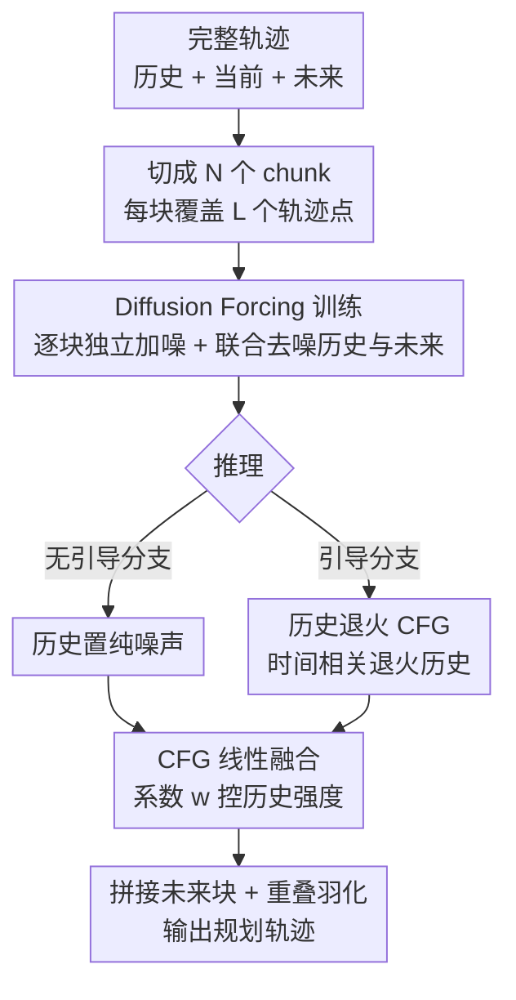

# Diffusion Forcing Planner: History-Annealed Planning with Time-Dependent Guidance for Autonomous Driving

**会议**: CVPR 2026  
**论文**: [CVF Open Access](https://openaccess.thecvf.com/content/CVPR2026/html/Zhang_Diffusion_Forcing_Planner_History-Annealed_Planning_with_Time-Dependent_Guidance_for_Autonomous_CVPR_2026_paper.html)  
**代码**: 待确认  
**领域**: 自动驾驶 / 扩散模型  
**关键词**: 运动规划, 扩散模型, Diffusion Forcing, 分类器无关引导, 时序一致性  

## 一句话总结
针对学习型规划器"逐帧抖动"和"照抄历史轨迹"两难，DFP 把整条轨迹切成历史/当前/未来若干 chunk、给每块独立加噪联合去噪，再在推理时用「历史退火 CFG」可控地调节历史影响强度，在 nuPlan 闭环上既稳又能随场景自适应，达到学习型基线里的 SOTA。

## 研究背景与动机

**领域现状**：扩散模型天然能表达多模态分布、生成长时序输出，近来被大量塞进端到端（E2E）和 VLA 自动驾驶 pipeline 里做轨迹规划，Diffuser、Diffusion Policy、Diffusion Planner 都是这一路的代表。

**现有痛点**：模仿学习训练出来的扩散策略对 demonstration 和场景噪声非常敏感——哪怕环境只有细微扰动，输出轨迹也会显著漂移，造成**逐帧之间的不稳定**，闭环里直接体现为乘坐不适和安全隐患。规划本质上是**非马尔可夫**的：合理的动作不仅取决于当前观测，也取决于过去的观测与动作，所以"把历史利用起来"是稳定输出的自然思路。

**核心矛盾**：但历史是把双刃剑。如果像很多方法那样把历史当成一个**静态条件**、和环境上下文平起平坐地喂进去，模型就会偷懒去**复刻历史运动模式**（causal confusion），而不是根据环境变化调整未来决策——在分布漂移下闭环性能反而更差。于是一派方法（PlanTF 等）小心设计架构 + dropout 来用历史，另一派（多数扩散规划器）干脆**完全丢掉自车历史**来避免偏置，却牺牲了时序连贯性。两条路都没解决"既要稳、又要响应实时环境"的根本张力。

**本文目标**：让历史**既不被忽略、也不被当成无条件的硬约束**，而是以一种**可控**的方式参与生成——并且这个"可控强度"最好能在**推理时**调节。

**切入角度**：作者借鉴视频扩散里的 Diffusion Forcing Transformer（DFoT），它用「加噪即遮蔽」（noising-as-masking）机制选择性地暴露/退火历史片段，在生成质量与稳定性之间取得平衡。作者的关键洞察是：运动规划与视频生成**共享同一种因果结构**，但有个本质差异——视频里的历史帧是真实内容，而驾驶历史里**过时的运动模式会主动误导当前决策**，因此历史必须在强场景上下文下被**可控调制**。

**核心 idea**：把整条轨迹切成历史/当前/未来 chunk，给每块采样**独立的扩散时间步**实现 noising-as-masking，训练时联合预测历史与未来；推理时用**历史退火的分类器无关引导（CFG）**，让一个可调系数在线权衡"时序稳定"与"实时响应"。

## 方法详解

### 整体框架

DFP（Diffusion Forcing Planner）建立在 Diffusion Planner 之上，是一个 **chunk 级别的扩散 Transformer**。给定场景上下文 $C$（周围 agent、静态物体、车道、导航）和历史信息 $H$，目标是把源分布 $p_0(x_0)$ 沿概率路径变换到目标分布 $q(x_1|C,H,w)$，其中 $x_1$ 是生成的未来轨迹，$w$ 是调节历史影响强度的引导因子。学习目标是捕捉历史、未来、环境三者之间**良好校准的依赖关系**，同时避免把历史 $H$ 退化式地照抄进 $x$。

整条流水线分两大块：**训练**用 Diffusion Forcing（逐块独立加噪 + 联合预测历史/未来），**推理**用历史退火 CFG（双分支并行 + 线性融合）。承载这两块的是一个 chunk-wise DiT：把每个 chunk 当作一个 token，配 token 级位置嵌入和 per-token 时间嵌入，DiT block 内用 adaLN（FiLM 式）注入条件、自注意力沿 token 轴打通历史—当前—未来的长程依赖、交叉注意力把感知上下文 $C$ 注入每个 token。

### 关键设计

**1. Diffusion Forcing 训练：切块 + 逐块独立加噪，强迫模型学因果一致的条件生成**

痛点直指"历史被当静态条件就会被照抄"。DFP 把完整轨迹 $x_0=[x_0^{-H},\dots,x_0^0,\dots,x_0^F]\in\mathbb{R}^{S\times4}$（$S=H+1+F$，每个状态是坐标 + 朝向的 4 元组）均匀切成 $N$ 个长度 $L$ 的连续 chunk，按时间跨度分为 $N_H$ 个历史块、1 个当前块、$N_F$ 个未来块，且**任何 chunk 都不混合历史点与未来点**。当前状态只有单个时刻，复制 $L$ 份凑成一个 chunk 以便统一处理。关键在于：每个 block $b$ 采样一个**独立的噪声水平** $t_b\sim U(0,1)$，按 SDE marginal 加噪 $x_{t_b}^{(b)}=\alpha(t_b)x_0^{(b)}+\sigma(t_b)\varepsilon^{(b)}$。模型输入是各块加噪结果的拼接 $X_t$、per-chunk 时间 $t=[t_1;\dots;t_N]$ 以及全局条件 $(C,H)$，用 $x_0$-prediction 参数化训练一个扩散 Transformer $f_\theta$。

为什么这样有效：随机化 $t_b$ 正是「加噪即遮蔽」——大 $t_b$ 把某块淹没在强噪声里（相当于遮蔽），小 $t_b$ 把它干净地暴露出来。训练时把当前块噪声水平固定 $t_{\text{cur}}=0$，形成一个锚定 plan 的**硬边界**。损失同时对历史块和未来块做去噪回归并加权：

$$\mathcal{L}_{\text{denoise}}=\frac{\lambda_{\text{hist}}}{N_H}\sum_{b=1}^{N_H}\mathbb{E}\big[\|\hat{x}^{(b)}-x_0^{(b)}\|_2^2\big]+\frac{\lambda_{\text{futr}}}{N_F}\sum_{b=N_H+2}^{N}\mathbb{E}\big[\|\hat{x}^{(b)}-x_0^{(b)}\|_2^2\big]$$

让模型在"历史有时可见、有时被遮蔽，未来不同部分有时可见有时遮挡"的各种混合配置下学到稳定、因果一致的条件生成——而不是简单复刻历史。⚠️ 上式损失下标以原文 Eq.4 为准（原文公式排版有少量错位）。

**2. History-annealed CFG 推理：双分支线性融合，把"历史影响强度"做成一个可调旋钮**

光会训练还不够——推理时怎么**可控**地用历史？DFP 用分类器无关引导（CFG），推理时跑两个共享采样器、只在历史块构造方式上不同的分支。所有未来块都从噪声初始化、拼上干净的当前块以施加硬边界。在去噪步 $s$（全局时间 $t_s\in[0,1]$）：

- **无引导分支**：把历史块每一步都替换成纯噪声 $\varepsilon\sim N(0,1)$，彻底切断历史信号泄漏；其关联时间重置为 1，未来块时间随扩散过程下降，时间向量取 $t=\{1,\dots,1,t_0,t_s,\dots,t_s\}$，与训练时逐块独立时间步设置一致。得到 $\hat{X}_{0,\text{unguided}}=f_\theta([\varepsilon,X_{t_s}],t,C)$。
- **引导分支**：把干净历史 $X_{\text{history}}$（经退火，见设计 3）与 $X_{t_s}$ 拼接，得到 $\hat{X}_{0,\text{guided}}=f_\theta(X_{\text{guidance}};X_{t_s},t|C)$。

两分支线性融合：

$$\hat{X}_0=\hat{X}_{0,\text{unguided}}+w\big(\hat{X}_{0,\text{guided}}-\hat{X}_{0,\text{unguided}}\big)$$

其中 $w\in[0,1]$ 直接控制历史引导对最终预测的影响。这就是 DFP 最实用的地方：稳定 vs 灵活的权衡变成了一个**推理期可调系数**，不用重训。最后把预测的各未来块拼回单条序列，相邻块重叠处做**线性羽化**（feathering）保证平滑过渡。

**3. 时间相关历史退火：让历史从噪声快速回到真值，防止未来被历史过度拉扯**

设计 2 的引导分支若一直喂"干净历史"，会出现新问题——消融里 A6 显示：历史持续保持 clean 时，在某些场景会变得**过度主导**，策略黏在历史运动模式上、反应迟钝。解法是给 ground-truth 历史加一条**时间相关退火**调度：历史块起始接近噪声、随后**快速**回到干净值：

$$X_{\text{guidance}}=\alpha(t)X_{\text{history}}+\sigma(t)\varepsilon,\quad t=(t_s)^\beta$$

这里 $(t_s)^\beta$（$\beta\ge1$）让**早期步**更接近噪声、**最终步**更接近真值。直觉上，扩散早期未来还很不确定，此时弱化历史避免它把未来"锁死"成历史的延续；扩散后期再把干净历史拉回来做精修。未来块的扩散时间步**逐块独立退火**，与训练时 chunkwise-independent time 设计一致；每个 chunk 有自己的 SDE marginal 和噪声水平，从而既区分历史与未来，又增强跨块的灵活性与连续性。

### 损失函数 / 训练策略

训练在 1M nuPlan clips 上进行，每个 clip 含 2s 历史 + 8s 未来、10 Hz 采样，每点编码为 $(x,y,\cos\theta,\sin\theta)$，统一到自车当前位姿为原点、朝向对齐 x 轴的 ego 坐标系，做逐通道 z-score 归一化。历史段噪声水平 $t$ 从 **Beta 分布**采样，使样本集中在 $t\approx0$（干净）和 $t\approx1$（纯噪声）两个极端，对齐推理时的配置。切块 $N=6$、每块 $L=20$ 点（当前块由单个当前状态复制 20 份得到），全部用 $x_0$-prediction，推理用 DPM-Solver 加速采样。全局 batch 2048、训 500 epoch（5 epoch warmup），AdamW，学习率 $2\times10^{-4}$。

## 实验关键数据

### 主实验

nuPlan 闭环评测，分非反应式（NR，其他 agent 用 log-replay）和反应式（R，其他 agent 用 IDM 策略），三个标准切分。**所有方法都直接用原始模型输出、不加任何后处理**，保证公平对比。

| 数据集 | 设置 | Diffusion Planner | DFP（ours） | DFP-FM（ours） |
|--------|------|-------------------|-------------|----------------|
| Val14 | NR | 89.87 / 87.87\* | 90.33 | **92.68** |
| Val14 | R | 82.80 / 77.48\* | 79.97 | 81.30 |
| Test14 | NR | 89.19 / 90.01\* | 90.69 | 90.62 |
| Test14 | R | 82.93 / 79.61\* | 81.96 | **83.59** |
| Test14-hard | NR | 75.99 / 74.26\* | 76.91 | **79.43** |
| Test14-hard | R | 69.22 / 61.25\* | 63.56 | 67.94 |

\*为作者复现版（与原报告略有出入）；DFP-FM 是 DFP 接 Flow Matching 采样器。相对作者复现的 Diffusion Planner\* 基线，DFP 在 Val14 NR/R 分别 +2.46 / +2.49，Test14-hard NR +2.65 且略超 CoPlanner（76.82）。

### 场景级 Case Study（Val14, 非反应式）

| 场景类型 | 方法 | Score | Comfort | Collision |
|----------|------|-------|---------|-----------|
| All(1118) | DP | 87.80 | 91.86 | 95.53 |
| All(1118) | **DFP** | **90.33** | **96.69** | **96.60** |
| High speed(99) | DP | 84.50 | 60.61 | 95.96 |
| High speed(99) | **DFP** | **94.95** | **96.97** | **98.99** |
| Low speed(100) | DP | 86.51 | 94.00 | 97.00 |
| Low speed(100) | **DFP** | **91.08** | 96.00 | 98.00 |

最戏剧性的是高速场景：DFP 的 Comfort 从 DP 的 60.61 飙到 96.97（+30 多分），对应"近乎直线匀速行驶时 DP 帧间抖动、DFP 因历史引导 CFG 保持稳定航向与速度"的定性观察。状态保持型场景（低/高速）总分分别 +4.57 / +10.45，转向场景（左/右转）也一致超过 DP，说明可控历史引导既稳又能随环境演化保持响应。

### 消融实验（Val14）

| ID | Diffusion Forcing | Chunk(L>1) | History Guidance | Annealed History | NR | R |
|----|:--:|:--:|:--:|:--:|------|------|
| A1 | ✗ | ✗ | ✗ | ✗ | 87.87 | 77.48 |
| A2 | ✓ | ✗ | ✗ | ✗ | 85.18 | 75.27 |
| A3 | ✗ | ✓ | ✗ | ✗ | 87.58 | 77.10 |
| A4 | ✓ | ✓ | ✗ | ✗ | 88.79 | 77.49 |
| A5 | ✓ | ✗ | ✓ | ✗ | 86.56 | 75.93 |
| A6 | ✓ | ✓ | ✓ | ✗ | 89.24 | 79.16 |
| A7 | ✓ | ✓ | ✓ | ✓ | **90.33** | **79.97** |

### 关键发现

- **逐点加噪（L=1）会掉点**：A2 把每个轨迹点都当独立 chunk 加噪（L=1），NR 反而从 87.87 跌到 85.18——单点 token 几乎没有轨迹语义，模型得靠长程依赖把一堆噪声微步拼成连贯 plan，credit assignment 变难。A3/A4 证明 **L>1 把连续步分组成 chunk** 才能恢复并提升性能。
- **历史引导必须配 chunk 才奏效**：A5（有历史引导但无 chunk）相对基线提升微弱，说明把历史硬塞进非分块解码器不足以利用历史；A6（chunk + 干净历史引导）才拿到明显增益。
- **退火是临门一脚**：A6→A7 加上 Annealed History，NR 再 +1.09（89.24→90.33），印证"持续干净历史会过度主导、退火能平衡历史影响并让模型在场景变化时调整未来 plan"。
- **超参敏感性**：历史引导强度 $w$ 和退火速度 $\beta$ 太弱太强都伤性能，**最佳权衡在 $w=0.2$、$\beta=2.0$**。

## 亮点与洞察

- **把"用不用历史"从二选一变成连续旋钮**：以往要么丢历史（保稳但失连贯）、要么强加历史（连贯但照抄），DFP 用一个推理期可调系数 $w$ 让历史影响**在线连续可调**，这是它最有迁移价值的设计——同一个模型可按场景需要调稳定/灵活。
- **跨域迁移的精准改造**：直接搬视频扩散的 noising-as-masking 不行，因为驾驶历史的"过时模式"是会害人的内容而非真实内容。作者识别出这个差异，针对性加了"历史退火 + 双分支 CFG"，是"借鉴 + 抓本质差异改造"的范例。
- **chunk 粒度是隐藏关键**：消融里最反直觉的是逐点加噪反而更差，提醒大家 Diffusion Forcing 在轨迹域要配合合适的 chunk 长度才有语义，否则 credit assignment 崩掉。
- **公平评测立场**：全程"原始输出、零后处理"对比，挤掉了后处理带来的虚高，结论更可信。

## 局限与展望

- **历史超参需要调**：$w$ 与 $\beta$ 在 Val14 上选出 0.2 / 2.0，但不同数据分布/车型/场景下最优值是否稳定、能否自适应在线选取，论文未深入。
- **反应式（R）增益不如非反应式**：从表 1 看，DFP 在 R 设置（尤其 Test14-hard R 仅 63.56，低于 Diffusion Planner 原报告 69.22）并非全面领先，说明在真正交互密集、对手会反应的场景里，纯历史引导对"博弈式响应"的帮助有限。⚠️ 注意 DP 原报告与作者复现差距较大，横向比较需谨慎。
- **只在 nuPlan 验证**：benchmark 单一，且评的是规划层（已给感知/上下文 $C$），端到端从原始传感器输入起的鲁棒性未测。
- **改进方向**：把 $w/\beta$ 做成随场景上下文（如速度、交互密度）动态预测的函数，或把历史退火与博弈式交互建模（如 CoPlanner 的 contingency）结合，弥补反应式场景短板。

## 相关工作与启发

- **vs PlanTF / 显式丢历史的方法（如 Diffusion Planner、StateTransformer 等）**：PlanTF 靠架构设计 + dropout 谨慎用历史，另一派干脆丢掉自车历史避免 causal confusion。DFP 主张历史**不该被丢、而该被动态调制**，用扩散引导把"时序一致性"与"实时响应"解耦——既保留历史的连贯性收益，又靠退火避免照抄。
- **vs Streaming Flow Policy / Bidirectional Decoding / Past Token Prediction**：这些把时序一致性当作**生成后的修正层**（用历史做 ODE 初始化、或在采样轨迹里按固定准则挑一条），不能在生成过程中按环境上下文动态调历史影响。DFP 把历史**集成进扩散过程本身**（逐块独立噪声调度 + CFG），实现在线调制。
- **vs History-Guided Video Diffusion（DFoT）**：同源的 noising-as-masking 因果结构，但 DFP 指出驾驶历史会主动误导决策、需在强场景上下文下做**可控强度**引导，于是新增双分支 CFG 与时间相关退火——这是从视频生成到运动规划的关键适配。

## 评分
- 新颖性: ⭐⭐⭐⭐ 把视频扩散的 Diffusion Forcing 迁到规划，并原创"历史退火 CFG"做推理期可控历史强度，思路清晰
- 实验充分度: ⭐⭐⭐⭐ nuPlan 三切分闭环 + 场景级 case study + 完整逐项消融 + 超参扫描，但 benchmark 单一、反应式增益偏弱
- 写作质量: ⭐⭐⭐⭐ 动机—方法—消融逻辑顺畅，公式排版有少量错位
- 价值: ⭐⭐⭐⭐ "历史影响可在线调节"对落地规划很实用，零后处理对比立场扎实

<!-- RELATED:START -->

## 相关论文

- [\[CVPR 2026\] CogDriver: Integrating Cognitive Inertia for Temporally Coherent Planning in Autonomous Driving](cogdriver_integrating_cognitive_inertia_for_temporally_coherent_planning_in_auto.md)
- [\[AAAI 2026\] DiffRefiner: Coarse to Fine Trajectory Planning via Diffusion Refinement with Semantic Interaction for End to End Autonomous Driving](../../AAAI2026/autonomous_driving/diffrefiner_coarse_to_fine_trajectory_planning_via_diffusion_refinement_with_sem.md)
- [\[CVPR 2026\] ActiveAD: Planning-Oriented Active Learning for End-to-End Autonomous Driving](activead_planning-oriented_active_learning_for_end-to-end_autonomous_driving.md)
- [\[CVPR 2026\] Open-Ended Instruction Realization with LLM-Enabled Multi-Planner Scheduling in Autonomous Vehicles](open-ended_instruction_realization_with_llm-enabled_multi-planner_scheduling_in_.md)
- [\[CVPR 2026\] GuideFlow: Constraint-Guided Flow Matching for Planning in End-to-End Autonomous Driving](guideflow_constraint-guided_flow_matching_for_planning_in_end-to-end_autonomous_.md)

<!-- RELATED:END -->
