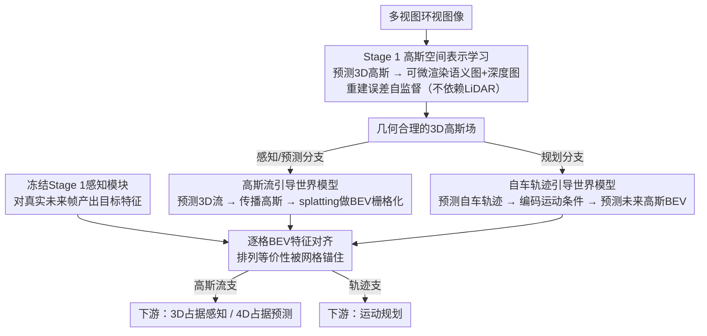

# DLWM: Dual Latent World Models enable Holistic Gaussian-centric Pre-training in Autonomous Driving

**会议**: CVPR 2026  
**arXiv**: [2604.00969](https://arxiv.org/abs/2604.00969)  
**代码**: 有  
**领域**: 自动驾驶 / 3D场景理解  
**关键词**: 世界模型, 3D高斯, 自监督预训练, 占据预测, 运动规划

## 一句话总结
提出DLWM，面向自动驾驶的双潜在世界模型全局高斯中心预训练范式——Stage1自监督学习3D高斯场景表示（渲染多视图语义+深度图），Stage2训练双潜在世界模型：高斯流引导的模型用于下游占据感知/预测(+1.02/+2.68 mIoU)，自车轨迹引导的模型用于运动规划(-16% L2误差)，解决了高斯查询跨帧无法直接监督的排列等价性挑战。

## 研究背景与动机

1. **领域现状**：视觉自动驾驶中，3D高斯表示在感知/预测/规划多任务上较BEV/稀疏查询更达表达-效率平衡。但依赖大量标注限制了扩展部署。
2. **现有痛点**：(1) MAE类预训练不显式学3D几何；(2) 渲染式预训练(UniPAD/ViDAR)需LiDAR深度；(3) 潜在世界模型用于规划有效但**用于感知/预测尚未探索**；(4) 高斯查询的排列等价性——不同帧独立初始化的高斯无一一对应→直接特征监督不可行。
3. **关键突破点**：将高斯query通过BEV栅格化转化为密集网格表示→保留高度信息且有清晰帧间区域对应→可作为潜在空间用于世界模型时间监督。
4. **核心idea**：两阶段——Stage1学高斯空间表示(渲染重建) → Stage2对偶世界模型：(a) 高斯流引导→感知/预测 + (b) 自车轨迹引导→规划。

## 方法详解

### 整体框架
DLWM 想解决的是一个很实际的矛盾：3D 高斯表示在自动驾驶的感知/预测/规划上比 BEV、稀疏查询更兼顾表达力和效率，但要训得好就得堆大量标注，难以扩展。论文的思路是用两阶段自监督预训练把标注依赖拿掉。第一阶段（Stage 1）只学"空间"——从多视图图像预测一组 3D 高斯，再可微渲染回语义图和深度图，用重建误差自监督，让模型先学会把场景表达成几何合理的高斯场。第二阶段（Stage 2）在此基础上学"时间"，但它没有训一个统一的世界模型，而是拆成对偶的两支：一支由高斯流驱动，服务感知/预测；一支由自车轨迹驱动，服务规划。两支都用冻结的 Stage 1 模块产出的未来帧特征当监督目标，预训练完成后把权重迁移到各下游任务。

### 关键设计

**1. Stage 1 高斯空间表示学习：不要 LiDAR 也能学到 3D 几何**

以往的视觉预训练要么像 MAE 那样不显式建模 3D 几何，要么像 UniPAD/ViDAR 那样依赖 LiDAR 深度才能做渲染监督，部署门槛高。DLWM 第一阶段让 2D backbone 预测每个 3D 高斯的位置、尺度、旋转、颜色和语义属性，再把这组高斯可微渲染成多视图语义图和深度图，直接拿渲染结果和图像端的伪标签做自监督重建——关键是深度图本身也是渲染出来的，整条链路不碰 LiDAR。这样学到的高斯 query 自带精细的场景上下文，等于给 Stage 2 的时间建模铺好了一个几何合理的初始化。

**2. Stage 2a 高斯流引导世界模型：用 BEV 栅格化绕开高斯的排列等价性**

把潜在世界模型用于规划已被验证有效，但用于感知/预测一直没人探索，拦路虎正是高斯 query 的排列等价性——不同帧各自独立初始化的高斯之间没有一一对应，没法像普通特征那样跨帧直接做监督。DLWM 的解法是先让模型预测每个高斯的 3D 流（位移向量），把当前帧的高斯按流场传播到未来帧位置，再通过 splatting 投影做 BEV 栅格化，得到一张密集的潜在特征图。监督信号则来自冻结的 Stage 1 感知模块对真实未来帧图像处理得到的"目标"特征。之所以有效，是因为 BEV 栅格化把排列等变的稀疏高斯转成了固定的网格——同一块网格在前后帧天然对应，时间监督因此变得可行。

**3. Stage 2b 自车轨迹引导世界模型：规划要的是"自车动了会看到什么"**

规划和感知需要的时间预测信息其实不一样：感知/预测关心场景里他车、行人这类外部运动，规划关心的是自车自己的决策会怎样改变观测。所以这一支不预测高斯流，而是先预测自车轨迹、把它编码成运动条件，再用这个条件叠加当前高斯潜在去预测未来场景的高斯 BEV 特征，同样和冻结的感知特征对齐。换句话说，它建模的是"我打算这么开，下一刻视野里会是什么样"，这正是规划决策需要的因果信号。

**4. 为什么是双世界模型而非单一模型**

两支看似冗余，但优化目标本质不同：感知/预测以场景级运动为信号，高斯流是它自然的监督来源；规划以自车决策的后果为信号，轨迹条件化才是它自然的监督来源。如果硬塞进一个统一模型，两种异质的时间信号会互相干扰、谁都学不好。拆开训练让每支只专注自己那类时间预测，下游迁移时各取所需——消融里也正是这种"各管一摊"的分工得到了验证（去掉轨迹支只伤规划、去掉高斯流支只伤感知/预测）。

### 一个完整示例：高斯流支怎么完成一次时间监督

以 Stage 2a 处理某个 0.5 秒间隔的帧对为例，把抽象的"排列等价性→BEV 栅格化"走一遍：

1. **当前帧**：Stage 1 从 6 路环视图像预测出一批 3D 高斯，每个带位置/语义属性；此刻它们是一堆无序的、可任意排列的点。
2. **预测流**：世界模型为每个高斯估一个 3D 位移向量（如某个属于前车的高斯沿行驶方向移动若干米），把整组高斯传播到未来帧的预测位置。
3. **栅格化**：传播后的高斯经 splatting 投影到固定的 BEV 网格——原本"第 7 个高斯"和"第 200 个高斯"的编号不再重要，落到同一格 $(i,j)$ 的特征被聚合成该格的潜在表示。
4. **取监督目标**：把真实未来帧图像喂给冻结的 Stage 1 感知模块，得到同一套 BEV 网格上的"目标"特征。
5. **对齐**：因为两者都在同一固定网格坐标系下，格 $(i,j)$ 对格 $(i,j)$ 逐格做特征对齐即可——排列等价性在第 3 步被网格"锚住"后就不再是障碍。

### 损失函数 / 训练策略
Stage 1 用渲染语义图与深度图的自监督重建损失；Stage 2 两支均以"传播/预测得到的 BEV 潜在特征"与"冻结 Stage 1 模块产出的未来帧目标特征"之间的对齐损失为目标，世界模型分支分开训练。具体损失形式与权重 ⚠️ 以原文为准。

## 实验关键数据

### 主实验(SurroundOcc + nuScenes)

| 下游任务 | 无预训练 | +DLWM预训练 | 提升 |
|----------|:---:|:---:|:---:|
| 3D占据感知(mIoU) | 基准 | +1.02 | 显著 |
| 4D占据预测(mIoU) | 基准 | +2.68 | 更显著 |
| 运动规划(L2 error) | 基准 | -16% | 大幅 |

### 消融实验

| 配置 | 感知 | 预测 | 规划 |
|------|:---:|:---:|:---:|
| 无Stage 1 | 下降 | 下降 | 下降 |
| 无Stage 2a(高斯流WM) | 下降 | 大幅下降 | 不变 |
| 无Stage 2b(轨迹WM) | 不变 | 不变 | 下降 |
| **完整DLWM** | **最优** | **最优** | **最优** |

→ 证实双世界模型各自服务不同下游任务。

### 关键发现
- 4D占据预测获益最大(+2.68 mIoU)→时间预测任务最受益于世界模型预训练
- 高斯流引导WM对感知也有帮助(+1.02)→学到了更好的场景动态表示
- 轨迹引导WM仅对规划有帮助→验证了分开训练的合理性
- BEV栅格化成功解决了高斯排列等价性问题→潜在空间的时间监督可行

## 亮点与洞察
- **排列等价性→BEV栅格化的巧妙解决**：高斯query跨帧无对应→但splatting到BEV后成为固定网格→这一转换是整个框架的关键使能
- **双世界模型的任务分工明确**：感知/预测→场景流驱动；规划→轨迹驱动。不同任务需要不同的时间预测信号→分工优于统一
- **全生命周期预训练**：从空间(Stage1 渲染重建)到时间(Stage2 世界模型)→覆盖感知/预测/规划全链路→一次预训练多任务受益

## 局限与展望
- Stage2的两个世界模型分别训练→联合训练可能发现共享的时间特征
- BEV栅格化丢失了高度维度的精细信息→3D体素栅格化可能更好但计算量更大
- 两阶段训练pipeline较复杂→能否简化为单阶段端到端？
- 当前世界模型仅预测一步未来→多步预测对长视界规划可能更好

## 评分
- 新颖性: ⭐⭐⭐⭐ 双世界模型+高斯流引导的时间预训练
- 实验充分度: ⭐⭐⭐⭐ SurroundOcc+nuScenes三任务验证+消融
- 写作质量: ⭐⭐⭐⭐ pipeline图清晰，排列等价性问题的解释充分
- 价值: ⭐⭐⭐⭐⭐ 对高斯中心自动驾驶方法的预训练有重要推动

<!-- RELATED:START -->

## 相关论文

- [\[CVPR 2025\] VisionPAD: A Vision-Centric Pre-training Paradigm for Autonomous Driving](../../CVPR2025/autonomous_driving/visionpad_a_vision-centric_pre-training_paradigm_for_autonomous_driving.md)
- [\[CVPR 2026\] Learning Vision-Language-Action World Models for Autonomous Driving](vla_world_learning_vision_language_action_world_models_for_autonomous_driving.md)
- [\[CVPR 2026\] An Instance-Centric Panoptic Occupancy Prediction Benchmark for Autonomous Driving](an_instance-centric_panoptic_occupancy_prediction_benchmark_for_autonomous_drivi.md)
- [\[CVPR 2026\] WorldLens: Full-Spectrum Evaluations of Driving World Models in Real World](worldlens_full-spectrum_evaluations_of_driving_world_models_in_real_world.md)
- [\[CVPR 2026\] MAD: Motion Appearance Decoupling for Efficient Driving World Models](mad_motion_appearance_decoupling_for_efficient_driving_world_models.md)

<!-- RELATED:END -->
