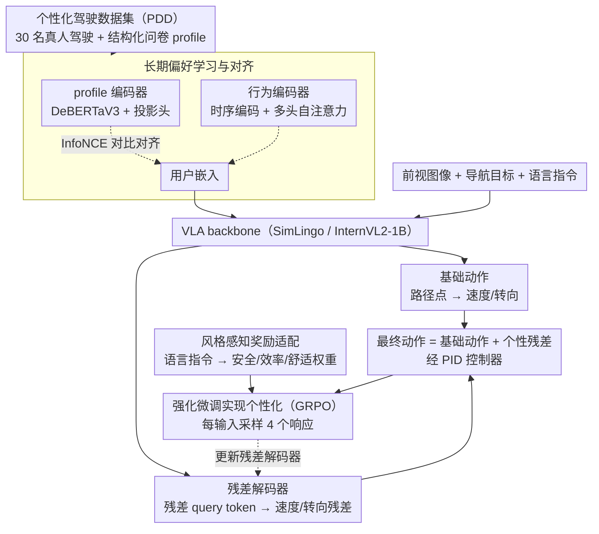

# Drive My Way: Preference Alignment of Vision-Language-Action Model for Personalized Driving

**会议**: CVPR 2026  
**arXiv**: [2603.25740](https://arxiv.org/abs/2603.25740)  
**代码**: [https://dmw-cvpr.github.io/](https://dmw-cvpr.github.io/)  
**领域**: Autonomous Driving  
**关键词**: 个性化驾驶, VLA模型, 偏好对齐, 强化微调, 用户嵌入

## 一句话总结

提出 DMW（Drive My Way），一个个性化 VLA 驾驶框架，通过用户嵌入学习长期驾驶习惯并结合自然语言指令进行短期偏好适配，使用 GRPO 强化微调和风格感知奖励实现个性化驾驶行为生成。

## 研究背景与动机

驾驶行为本质上是高度个人化的——不同司机在加速、刹车、变道、超车等方面表现出截然不同的偏好。然而现有端到端自动驾驶系统存在以下不足：

**通用化优化**：现有系统通常优化安全和效率等通用目标，忽视个体差异

**固定预设模式**：仅提供"运动/舒适/经济"等几种模式，无法捕捉细微且持续演化的用户偏好

**无法理解自然语言**：用户无法通过"我累了"或"我上班要迟到了"等直觉性语言来调整驾驶风格

现有个性化方法的两大局限：
- **数据驱动方法**（行为克隆/IRL）：需要大规模数据，扩展性差，无法处理实时语言交互
- **语言驱动方法**（如 Talk2Drive）：仅在简单场景验证，未考虑长期驾驶习惯

DMW 的核心思想是同时解决**长期偏好alignment**和**短期指令adaptation**。

## 方法详解

### 整体框架

DMW 以 SimLingo（基于 InternVL2-1B）为 VLA backbone，输入包括前视相机图像、导航目标、用户 profile 和语言指令，输出个性化驾驶动作（油门/刹车/转向）。整条 pipeline 分两步：先用「个性化驾驶数据集（PDD）」里的真人数据，通过对比学习把 profile 和行为对齐成「用户嵌入」注入策略，建模长期习惯；再让 VLA backbone 预测安全的基础动作、由残差解码器叠加「个性残差」，最后用「风格感知奖励」驱动 GRPO 强化微调，把短期语言指令体现在残差上。

### 关键设计

**1. 个性化驾驶数据集（PDD）：先有真人偏好数据，个性化才有抓手**

个性化驾驶最缺的是「真人在多样场景下的真实偏好」数据。作者招募 30 名不同背景的驾驶员，每人用 Logitech 方向盘和踏板在 CARLA 中跑完 20 个标准化场景（超车、汇入、路口、行人横穿等），同步记录自车运动状态、周围感知（车辆/行人/骑车人/路侧危险）和交通上下文（信号灯/限速/路线）。每人还填一份结构化问卷（人口统计、驾驶历史、出行目的）作为 profile，并以 PDM-Lite 的专家目标速度为基准、把人类速度偏差当作风格描述符。这套数据让「长期习惯」可被建模，而不是只能套几个预设模式。

**2. 长期偏好学习与对齐：用对比学习把「问卷」和「开法」对到同一空间**

要捕捉持续演化的个人习惯，关键是让静态 profile 和动态行为对得上。作者用对比学习在 profile 嵌入和行为嵌入间建共享潜空间：profile 编码器 $f_p(\cdot)$（DeBERTaV3 + 投影头）产出用户嵌入 $z_p^m$，行为编码器 $f_b(\cdot)$（时序编码器 + 多头自注意力，处理过去 $k$ 步轨迹窗口）产出行为嵌入 $z_{b,t}^m$，再用 InfoNCE 对比损失拉近同一司机的 profile 与行为、推远不同司机。学好的用户嵌入 $z_p^m$ 被注入 VLA 策略、由后续强化微调进一步适配。为缓解长尾，还做数据增强：挑与目标司机嵌入最不相似的司机 $u$，按动作统计比率缩放出增强动作 $\tilde{a}_t^m = \frac{\bar{a}^m}{\bar{a}^u} \cdot a_t^m$。

**3. 通过强化微调实现个性化（GRPO）：在安全基础动作上叠加「个性残差」**

完全端到端地学个性化风险大——可能为了像某人而牺牲安全。作者改用 Group Relative Policy Optimization（GRPO）做强化微调，并设计残差解码器：可学习的残差查询 token 注入语言模型，输出离散的残差调整（速度变化 + 转向变化），最终动作 $a_t = a_t^{base} + a_t^\Delta$。这样基础动作保证安全规划，个性化只体现在残差上，把「安全」和「风格」解耦开。

**4. 风格感知奖励适配：把一句话指令翻译成安全/效率/舒适的权重**

用户想用「我累了」「要迟到了」这种自然语言临时调风格，就得把语言映射到可优化的奖励上。奖励是加权和 $\mathcal{R}(s_t, a_t) = w_s \cdot R_{safety} + w_e \cdot R_{efficiency} + w_c \cdot R_{comfort}$：安全项基于碰撞时间 TTC，$R_{safety} = \mathbb{I}(TTC_t \geq \beta_{safety})$；效率项 $R_{efficiency} = \exp(-\alpha \cdot |v_t - v_{pref}|)$ 鼓励贴近偏好速度；舒适项要求转向和加速度不超阈值。权重、阈值、偏好速度都随语言指令和场景动态调整，初值由 GPT-5 推理给出、再经专家审核精修，让短期指令能在长期偏好之上叠加生效。

### 损失函数 / 训练策略

- 用户嵌入训练：AdamW，weight decay 1e-3，lr 1e-4
- 偏好编码器收敛后冻结，微调运动预测器 + 残差解码器
- 使用 LoRA 适配 Qwen2-0.5B
- 8 张 A6000 GPU，per-GPU batch size 8
- GRPO 每输入采样 4 个响应

## 实验关键数据

### 主实验

**Bench2Drive 闭环驾驶指标**：

| 方法 | 风格 | DS | SR | Efficiency | Comfort | Speed | TT |
|------|------|-----|-----|-----------|---------|-------|-----|
| SimLingo | Aggressive | 78.56 | 65.83 | 247.60 | 18.61 | 7.66 | 25.35 |
| SimLingo | Conservative | 78.18 | 65.56 | 238.77 | 26.99 | 7.21 | 33.02 |
| DMW | Aggressive | 79.50 | 67.36 | **281.56** | 21.62 | 7.72 | 26.93 |
| DMW | Conservative | **82.72** | **71.56** | 237.06 | **34.62** | 6.18 | **47.38** |

DMW 在 Aggressive 下效率提升 18.77%（SimLingo 仅 3.70%），同时 DS 仅降 3.89%。

**长期偏好对齐（用户研究）**：

| 方法 | AS (ID) D1/D2 | AS (OOD) D3/D4 | Ratings (ID) | Ratings (OOD) |
|------|-------------|---------------|-------------|--------------|
| MORL-PD | 0.42/0.58 | 0.25/0.33 | 5.1/6.2 | 3.9/3.5 |
| **DMW** | **0.92/0.92** | **0.83/0.83** | **8.7/8.3** | **7.8/8.0** |

### 消融实验

**自适应平均池化（AAP）消融**：

| Driver | w/ AAP | w/o AAP | 说明 |
|--------|--------|---------|------|
| D1 AS | 0.92 | 0.67 | 有 AAP 对齐分数更高 |
| D2 AS | 0.92 | 0.58 | |
| D3 AS | 0.83 | 0.25 | OOD 差异更大 |

| 配置 | 关键指标 | 说明 |
|------|---------|------|
| w/o AAP | AS 平均 0.50, Ratings 平均 5.5 | 全局均值池化降低嵌入表达力 |
| w/ AAP | AS 平均 0.88, Ratings 平均 8.2 | 保留语义重要嵌入 |

### 关键发现

1. **DM W 在保持安全性的同时实现有效的风格区分**：Conservative 模式下 DS/SR 最高，Aggressive 下效率显著提升
2. **长期偏好对齐对 OOD 司机也有效**：Alignment Score 对未见过的 D3/D4 仍达 0.83
3. **不同司机条件下策略行为差异显著**：激进型司机（D1/D4）展现更高速度和加速度，保守型司机（D2/D3）展现更大跟车距离
4. **短期指令可在长期偏好基础上叠加调整**：两种个性化维度正交互补

## 亮点与洞察

1. **长短期偏好解耦**：将驾驶个性化分解为长期习惯（用户嵌入）和短期意图（语言指令）两个维度，设计简洁有效
2. **残差动作设计**：$a_t = a_t^{base} + a_t^\Delta$ 在安全基础上叠加个性化，规避了完全端到端的风险
3. **真实驾驶员数据**：30 名真人在 CARLA 中驾驶采集的 PDD 数据集，比合成数据更有行为多样性
4. **风格感知奖励的可解释性**：将语言指令映射到安全/效率/舒适权重的思路清晰可追溯
5. **GRPO 强化微调**：相比纯 BC 能更好特化到个体风格

## 局限与展望

1. **仅在 CARLA 仿真中验证**：真实道路上的效果未知，sim-to-real gap 可能很大
2. **Profile 问卷的局限**：驾驶风格可能随情绪、路况动态变化，静态 profile 难以完整捕捉
3. **30 名司机的多样性**：样本量有限，能否覆盖全球驾驶文化差异存疑
4. **安全边界的风险**：Aggressive 模式下 TTC 阈值降低，可能带来安全隐患
5. **计算开销**：VLA + GRPO + 用户嵌入推理的实时性未充分讨论

## 相关工作与启发

- **SimLingo**：作为 VLA backbone，提供基础的语言-视觉-动作能力
- **Talk2Drive**：语言驱动个性化的先驱，但仅在简单场景验证
- **MAVERIC**：学习多样化社会感知驾驶行为的潜在空间
- **StyleDrive**：固定风格条件注入策略的对比方法
- 启发：偏好对齐 + 强化微调的范式可能适用于机器人操控等其他需要个性化的 embodied AI 任务

## 评分

- 新颖性: ⭐⭐⭐⭐ — 长短期偏好解耦和 GRPO+残差的设计有新意，但整体思路不算突破性
- 实验充分度: ⭐⭐⭐⭐ — 闭环评估+用户研究，但仅限 CARLA 仿真
- 写作质量: ⭐⭐⭐⭐ — 结构清晰，实验设计合理，但符号较多
- 价值: ⭐⭐⭐⭐ — 个性化驾驶是实际需求，PDD 数据集有潜在复用价值

<!-- RELATED:START -->

## 相关论文

- [\[CVPR 2026\] Learning Vision-Language-Action World Models for Autonomous Driving](vla_world_learning_vision_language_action_world_models_for_autonomous_driving.md)
- [\[CVPR 2026\] NoRD: A Data-Efficient Vision-Language-Action Model that Drives without Reasoning](nord_a_data-efficient_vision-language-action_model_that_drives_without_reasoning.md)
- [\[CVPR 2026\] VGGDrive: Empowering Vision-Language Models with Cross-View Geometric Grounding for Autonomous Driving](vggdrive_empowering_vision-language_models_with_cross-view_geometric_grounding_f.md)
- [\[CVPR 2026\] Traffic Scene Generation from Natural Language Description for Autonomous Vehicles with Large Language Model](traffic_scene_generation_from_natural_language_description_for_autonomous_vehicl.md)
- [\[ICLR 2026\] Steerable Adversarial Scenario Generation through Test-Time Preference Alignment (SAGE)](../../ICLR2026/autonomous_driving/steerable_adversarial_scenario_generation_through_test-time_preference_alignment.md)

<!-- RELATED:END -->
