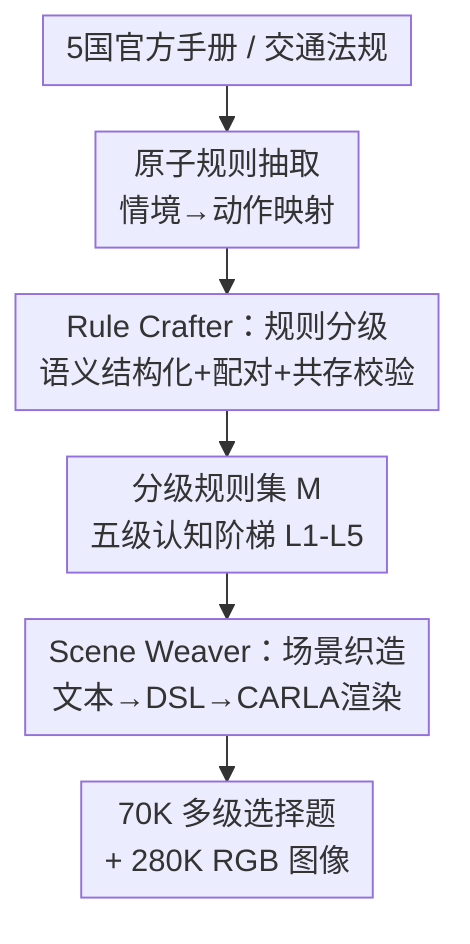

# DriveCombo: Benchmarking Compositional Traffic Rule Reasoning in Autonomous Driving

**会议**: CVPR 2026  
**论文**: [CVF Open Access](https://openaccess.thecvf.com/content/CVPR2026/html/Ma_DriveCombo_Benchmarking_Compositional_Traffic_Rule_Reasoning_in_Autonomous_Driving_CVPR_2026_paper.html)  
**代码**: 无  
**领域**: 自动驾驶 / 多模态VLM Benchmark  
**关键词**: 交通规则推理, 自动驾驶基准, 多模态大模型, 规则组合, CARLA仿真  

## 一句话总结
DriveCombo 是首个面向"组合式交通规则推理"的多模态基准：用一个从单规则理解到规则冲突仲裁的五级认知阶梯组织 7 万道选择题，并用 Rule2Scene Agent 把文本法规自动转成 CARLA 中可执行的 3D 驾驶场景；评测 14 个主流 MLLM 发现它们在最高级冲突仲裁任务上准确率骤降到 41%–44%，远低于人类的 >98%。

## 研究背景与动机
**领域现状**：多模态大模型（MLLM）正在成为端到端自动驾驶系统的"大脑"，把视觉感知、语言推理和世界知识融合到一起，显著提升了场景理解与轨迹规划能力。

**现有痛点**：但安全驾驶不只看轨迹安全，更要看是否合规——能不能在复杂情境下做出合法、契合上下文的决策。传统端到端基准只测轨迹偏移、碰撞率这类物理指标，完全忽略模型对交通规则的理解；而少数关注规则的基准（DriveQA、IDKB）又只覆盖"单条原子规则"，且依赖 2D 静态图像（如识别交通标志），无法刻画真实道路上多规则并存、相互冲突的复杂性。

**核心矛盾**：现实驾驶里多条法规经常同时生效甚至彼此冲突（如"前方事故要减速"和"实线不可越"同时出现），而现有基准的简化设定制造了"性能幻觉"——模型在单规则上得分很高，一遇到多规则组合就失效，评测范式和真实安全合规驾驶的认知需求之间存在巨大鸿沟。

**本文目标**：构建一个能系统评测 MLLM 在复杂场景下"组合式交通规则推理"能力的基准，需要解决两个子问题：(1) 如何把推理复杂度按认知层级清晰拆解、量化；(2) 如何把抽象的文本法规批量转成带视觉的可评测场景。

**切入角度**：作者借鉴人类驾驶员的认知发展规律——从理解单条规则，到协调多条约束，最终学会处理规则冲突——把这个发展过程映射成可量化的评测阶梯。

**核心 idea**：用一个"五级认知阶梯"组织从单规则到冲突仲裁的题目，再用一个"Rule2Scene Agent"在语言侧生成结构化规则、在仿真侧重建其物理语义，形成"规则推理↔场景执行"的闭环，从而把法规文本自动变成 scene-level 的视觉推理题。

## 方法详解
DriveCombo 本质是一条"法规文本 → 分级规则集 → 3D 场景 → 多级选择题"的数据生产流水线。输入是 5 个国家的官方驾驶手册与交通法规，输出是约 70K 道选择题（MCQ）+ 280K 张图像，按五个认知层级组织。整条流水线由两部分支撑：一个定义评测难度的**五级认知阶梯**，和一个把规则落地成场景的**Rule2Scene Agent**（含 Rule Crafter 与 Scene Weaver 两个模块）。

### 整体框架
流程分三步走：先从法规手册解析出**原子规则**（一条规则 = 一个"情境→动作"映射）；然后 **Rule Crafter** 给每条原子规则做语义结构化、两两配对、校验时空共存性，并依据配对的感知/规范属性自动给每对规则**赋一个认知层级 $l_i$**，构成覆盖 L1–L5 的分级规则集 $M$；最后 **Scene Weaver** 把分级规则翻译成文本场景描述、转成结构化 DSL、映射进 CARLA 仿真器渲染出 RGB 图像序列，配上题干和四个选项组装成 MCQ。

### 关键设计

**1. 五级认知阶梯：把"规则推理复杂度"显式拆成可量化的难度梯度**

针对"现有基准难度扁平、只测单规则"的痛点，作者把评测难度对齐到人类驾驶员的认知发展轨迹，设计了一个递进的五级阶梯：L1 理解单条原子规则；L2 整合多条**不冲突的静态**规则（如限速 + 路牌）；L3 在动态交通参与者交互下推理（如路口让行）；L4 协调静态与动态混合的规则；L5 在规则**冲突**时判断优先级、做出合法决策。这五级并非主观分档，而是由规则配对的属性自动决定（见设计 2），从而把"模型从基础识别到冲突仲裁"的能力演化拆解开来，做到逐级精确分析。它的价值在实验里被验证：所有模型 L1 都很高，但 L2→L5 单调下滑，L5 骤降到 41%–44%，恰好暴露了"看似会、实则不会组合"的认知瓶颈，证明这把阶梯确实区分出了推理深度。

**2. Rule Crafter：用规范属性自动给规则对定级，把人工设难度变成可批量生成**

L1–L5 的难度若靠人工标注会既慢又不一致。Rule Crafter 的做法是先把每条原子规则语义结构化为四元组 $r_i = (c_i, b_i, a_i, n_i)$——内容 $c_i$、感知类型 $b_i \in \{\text{static}, \text{dynamic}\}$、动作类型 $a_i$、规范类型 $n_i \in \{\text{permissive}, \text{obligatory}, \text{forbidden}\}$。然后把**动作类型一致**的规则两两配对 $p_i = \{r_j, r_k\}$，并据此派生出组合的感知类型 $b_i'$（Double Static / Double Dynamic / Hybrid）和规范关系 $n_i'$（当 $\{n_j, n_k\} = \{\text{obligatory}, \text{forbidden}\}$ 时为 Norm Conflict，否则 Norm Harmony）。最关键的是层级由这两个属性**确定性地**给出：

$$l_i = \begin{cases} 2, & b_i'=\text{Double Static},\ n_i'=\text{Norm Harmony}\\ 3, & b_i'=\text{Double Dynamic},\ n_i'=\text{Norm Harmony}\\ 4, & b_i'=\text{Hybrid},\ n_i'=\text{Norm Harmony}\\ 5, & n_i'=\text{Norm Conflict} \end{cases}$$

所有原子规则 $r_i$ 标为 $l_i=1$。这样一来"难度"就从主观判断变成了由规则属性推出的标签——只要 LLM 把规则结构化对了，层级自然落定。配对完还要过一道**时空共存校验** $v_i = f_{\text{LLM}}(r_j, r_k) \in \{0,1\}$：LLM 抽取两条规则的道路类型、agent 状态、环境属性，判断它们能否在同一物理与时间上下文里共存，过滤掉语义或物理上不兼容的组合。只保留 $v_i=1$ 的有效对 $\hat{P}$，最终规则集 $M = R \cup \hat{P}$ 覆盖 L1–L5。这一步保证了生成的多规则场景是物理上真实可能发生的，而不是硬凑两条无关规则。

**3. Scene Weaver：把抽象规则逐级落地成 CARLA 可执行的高保真 3D 场景**

光有分级规则还不是视觉题，得有图。Scene Weaver 走一条 "Generate → SelfCheck → Align" 的多阶段管线：先用 LLM 把每个规则 $m_i \in M$ 转写成自然语言**文本场景描述** $s_i$（按规则数量和语义关系生成同时体现单/多规则约束的整合场景）；再翻译成**结构化语义表示** $d_i = \{E_i, L_i, W_i\}$——实体（车辆、行人、信号灯）、空间/交互关系（"前方"、"左侧")、环境条件（天气、时间、道路类型），这套表示遵循基于交通仿真 schema 的领域专用语言（DSL）；然后把结构化语义 $d_i^*$ 映射进 CARLA 的 3D 坐标系，生成包含实体位置、交通结构、天气和轨迹的 OpenSCENARIO 文件 $\omega_i$；最后导入 CARLA 渲染成 3D 场景，在 ego 车前方架相机捕获 $K$ 帧 RGB 图像序列（实现里 $K=4$）。每一阶段都有另一个 LLM 做质量打分，低于阈值则交人类专家修正，确保画面真实且严格符合规则语义。正是这条"语言侧生成结构化规则、仿真侧重建物理语义"的路径，保证了规则与生成场景之间的语义一致性，形成从规则到场景的闭环。

### 一个完整示例
以一道 L5 冲突题为例走一遍：三车道高速、浓雾、能见度约 50 m。两条规则相遇——"能见度低于 50 m 时限速 30 km/h"（obligatory/减速）与"三车道高速最左道最低限速 110 km/h"（与减速冲突）。Rule Crafter 把二者配对，因规范关系为 Norm Conflict，直接定级 $l_i=5$，并通过共存校验确认这种雾天+三车道场景物理可发生。Scene Weaver 把它转写成文本场景、结构化为"三车道公路 + 浓雾 + ego 车"的 DSL，映射进 CARLA 渲染出雾天驾驶视角的 4 帧图像。最终组装成题干"正确限速是多少？"、选项 A.110 B.70 C.50 D.30，正确答案由优先级原则（安全义务高于通行效率）裁定为减速。模型若只识别到"最低限速 110"就会答错——这正是 L5 想考的冲突仲裁能力。

## 实验关键数据

### 主实验
评测 14 个主流 MLLM（GPT-5 nano/mini/pro、Gemini-2.5-Flash/Pro、Claude-Sonnet-4.5 等闭源，Gemma-3、Llama-3.2、Qwen3-VL、GLM-4.5V 等开源），全部 zero-shot、每模型独立跑 3 次取稳。下表为视觉版（DriveCombo）准确率（%），可见所有模型随认知层级单调下滑，L5 集体崩到 41%–44%：

| 模型 | 规模 | L1 | L2 | L3 | L4 | L5 |
|------|------|------|------|------|------|------|
| Gemma 3 | 27B | 73.94 | 67.39 | 65.55 | 63.10 | 37.42 |
| Qwen3-VL | 32B | 78.54 | 76.09 | 68.84 | 65.42 | 39.86 |
| GLM-4.5V | 106B | 80.44 | 78.49 | 69.54 | 68.22 | 41.86 |
| Gemini 2.5 Pro | - | 85.71 | 77.19 | 70.32 | 68.03 | 43.06 |
| Claude Sonnet 4.5 | - | 83.80 | 82.16 | 70.96 | 69.62 | 43.99 |
| GPT-5 pro | - | 86.91 | 83.66 | 72.06 | 69.82 | **44.19** |

最强的 GPT-5 pro 在 L5 也仅 44.19%，而 30 位人类驾驶员在各级随机抽取的 100 题上准确率 >98%，凸显模型与人类在冲突仲裁上的巨大差距。纯文本变体 DriveCombo-Text 上所有模型小幅提升（GPT-5 pro L5 升至 47.42%），说明视觉理解阶段仍有语义损失与错位，但即便去掉视觉压力，L5 仍卡在 47% 出头。

### 消融与增强实验
作者把 DriveCombo 当作"知识注入器"，对比训练无关方法（CoT、RAG）与训练相关方法（SFT）。SFT 全面碾压前两者，把多规则组合推理拉升明显（平均增益 %）：

| 模型 | 基线 Avg | +CoT | +CoT+RAG | +CoT+RAG+SFT | L5(SFT后) |
|------|------|------|------|------|------|
| Gemma 3 (4B) | 44.8 | +2.70 | +7.31 | **+29.37** | 51.3 |
| Qwen3-VL (8B) | 58.7 | +1.52 | +4.13 | **+21.89** | 60.2 |
| Llama 3.2 (11B) | 43.0 | +2.62 | +5.42 | **+29.70** | 50.1 |

下游端到端规划（nuScenes 验证集，L2 轨迹误差 ↓）也证明数据有效迁移到真实任务：

| 模型 | SFT 数据 | 1s | 2s | 3s | Avg |
|------|---------|------|------|------|------|
| LLaVA-1.6-Mistral-7B | - | 1.66 | 3.54 | 4.54 | 3.24 |
| LLaVA-1.6-Mistral-7B | DriveQA | 1.30 | 3.46 | 3.98 | 2.91 |
| LLaVA-1.6-Mistral-7B | DriveCombo | 1.27 | 3.29 | 3.92 | **2.68** |
| InternVL-2.5-8B | DriveCombo | 1.26 | 3.03 | 3.58 | **2.53** |

### 关键发现
- **认知阶梯确实区分推理深度**：L1 普遍高分但 L2→L5 单调下滑，L5 冲突仲裁是公认瓶颈——基准成功暴露了"会识别单规则、不会组合"的真实缺陷。
- **规则数越多崩得越狠**：复杂度分析显示，即便 GPT-5 pro、Qwen3-VL 32B 在两规则下表现强，规则增到 4–5 条时准确率掉超过 20 个百分点，说明高维交通语义下模型难以维持一致推理。
- **SFT 远胜免训练增强但仍不够**：Llama-3.2 经 SFT 在 DriveCombo 上准确率提升 29.7%，但最好的微调模型 Qwen3-VL-8B 在 L5 也只有 60.2%，常规优化无法根治复杂规则推理。
- **DriveCombo 比 DriveQA 更能迁移**：DriveCombo 微调的端到端规划 L2 误差全面低于 DriveQA，论文称下游 L2 损失降低 17.3%。

## 亮点与洞察
- **把"难度"从人工标注变成属性推导**：层级 $l_i$ 完全由规则对的感知类型和规范关系（是否 Norm Conflict）确定性地给出，使五级题目可大规模自动生成且标准一致，这套"用规范属性定难度"的思路可迁移到任何需要分级评测的合规/推理任务。
- **语言侧↔仿真侧闭环造数据**：先在语言侧结构化规则、再在 CARLA 侧重建物理语义，并用 LLM 打分 + 人工兜底保证一致性——这种"文本规则 → 可执行 3D 场景"的合成范式让稀缺的合规驾驶视觉数据可批量产出。
- **冲突仲裁是真盲点**：所有模型 L5 集体跌到 40% 出头、规则增到 4–5 条再掉 20 个点，清晰证明当前 MLLM 缺的不是单规则知识，而是多规则优先级推理能力，给后续工作指明方向。

## 局限与展望
- **作者承认的局限**：场景生成依赖 CARLA 仿真器，受其 3D 资产库限制，场景多样性有上限；计划接入生成式模型扩充资产类别。
- **仿真到真实的差距**：虽然下游 nuScenes 规划有提升，但训练数据全部来自 CARLA 渲染，仿真图像与真实路况的域差可能让 L5 等高阶能力的迁移打折扣。⚠️ 论文未给仿真-真实域差的定量分析。
- **优先级判定的可靠性**：L5 正确答案由"优先级原则"裁定，但不同国家/情境下的优先级本身可能存在歧义，标注一致性与争议样本比例值得进一步公开。
- **改进思路**：可引入真实路测视频补充 CARLA 资产、扩展超过 5 国的规则覆盖、并把评测从单选 MCQ 扩展到开放式合规决策生成，以更贴近真实驾驶的连续决策。

## 相关工作与启发
- **vs DriveQA / IDKB**：它们也用 CARLA 造规则 QA，但只覆盖单条原子规则（#Rules=1）、且依赖 2D 静态图像；DriveCombo 主打多规则组合（#Rules≥1）、带 3D 场景序列，并用五级阶梯系统刻画从理解到冲突仲裁的全谱，实验也证明它比 DriveQA 更能迁移到下游规划。
- **vs nuScenes-QA / DriveLM / DriveBench 等视觉语言驾驶基准**：这些主要测感知与语义理解（关系推理、多阶段问答），缺乏对交通规则与决策逻辑的系统评估；DriveCombo 把焦点从"看懂场景"移到"合规决策"，补上了规则推理这块评测空白。
- **vs 传统端到端基准（KITTI / Waymo / nuScenes 规划）**：它们测轨迹偏移、碰撞率等物理指标，无法判断系统是否真正理解并遵守交规；DriveCombo 用准确率直接量化规则合规推理，且证明在其上微调能反向降低真实规划 L2 误差。

## 评分
- 新颖性: ⭐⭐⭐⭐⭐ 首个组合式交通规则推理基准，五级认知阶梯 + 规则属性自动定级的设计新颖且抓住了真实痛点。
- 实验充分度: ⭐⭐⭐⭐⭐ 14 个 MLLM、文本/视觉双变体、CoT/RAG/SFT 增强、下游 E2E 规划迁移、人类对照与多规则复杂度分析齐全。
- 写作质量: ⭐⭐⭐⭐ 动机清晰、流水线与公式表述完整，但个别公式排版混乱、部分细节推到附录。
- 价值: ⭐⭐⭐⭐⭐ 暴露 MLLM 在规则冲突仲裁上的真实瓶颈，且数据可直接提升下游规划，对合规自动驾驶有实用推动力。

<!-- RELATED:START -->

## 相关论文

- [\[CVPR 2026\] MindDriver: Introducing Progressive Multimodal Reasoning for Autonomous Driving](minddriver_introducing_progressive_multimodal_reasoning_for_autonomous_driving.md)
- [\[CVPR 2026\] Beyond Rule-Based Agents: Active Markov Games for Realistic Multi-Agent Interaction in Autonomous Driving](beyond_rule-based_agents_active_markov_games_for_realistic_multi-agent_interacti.md)
- [\[CVPR 2026\] Perceiving the Near, Reasoning the Distant: Coherent Long-Horizon Trajectory Prediction for Autonomous Driving](perceiving_the_near_reasoning_the_distant_coherent_long-horizon_trajectory_predi.md)
- [\[CVPR 2026\] ColaVLA: Leveraging Cognitive Latent Reasoning for Hierarchical Parallel Trajectory Planning in Autonomous Driving](colavla_leveraging_cognitive_latent_reasoning_for_hierarchical_parallel_trajecto.md)
- [\[CVPR 2026\] HybridDriveVLA: Vision-Language-Action Model with Visual CoT reasoning and ToT Evaluation for Autonomous Driving](hybriddrivevla_vision-language-action_model_with_visual_cot_reasoning.md)

<!-- RELATED:END -->
