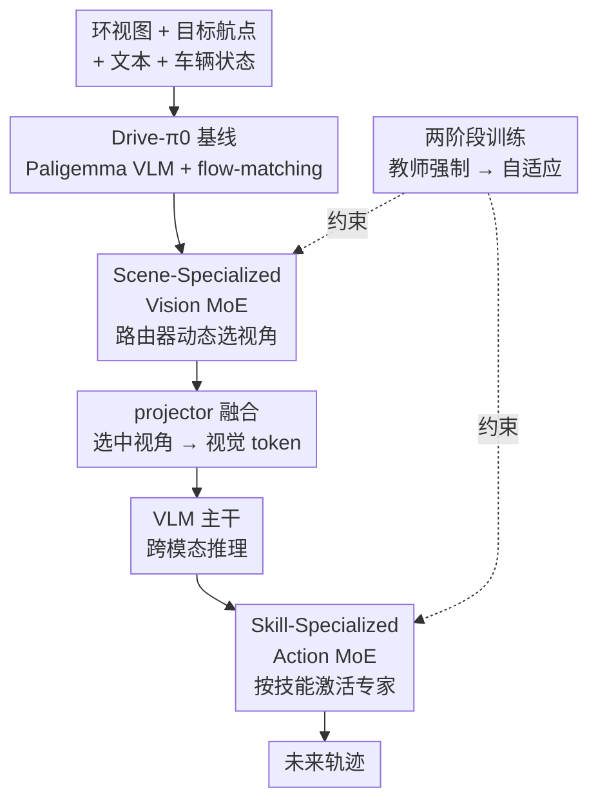

# DriveMoE: Mixture-of-Experts for Vision-Language-Action Model in End-to-End Autonomous Driving

**会议**: CVPR 2026  
**arXiv**: [2505.16278](https://arxiv.org/abs/2505.16278)  
**代码**: https://thinklab-sjtu.github.io/DriveMoE/ (项目主页)  
**领域**: 自动驾驶 / 端到端规划 / VLA / 混合专家  
**关键词**: 端到端自动驾驶, Mixture-of-Experts, Vision-Language-Action, 多视角感知, 闭环评测

## 一句话总结
DriveMoE 把混合专家（MoE）同时塞进 VLA 自动驾驶模型的感知端和决策端——感知端用 Vision MoE 动态挑选关键摄像头视角省 token，决策端用 Action MoE 为不同驾驶技能分配专属专家，在 Bench2Drive 闭环上把驾驶分从 55.85 拉到 74.22、成功率从 30% 拉到 48.64%。

## 研究背景与动机
**领域现状**：端到端自动驾驶（E2E-AD）直接把多视角传感器输入映射成规划轨迹，省去了模块化级联的工程复杂度与误差传播。近期 VLM/VLA 因其强泛化和跨域迁移能力被引入驾驶，希望解决闭环里频繁出现的分布外（OOD）场景。

**现有痛点**：作者指出 VLA 落到驾驶上有两个具体毛病。其一是**视觉冗余**——主流做法要么把六路环视图全部喂进 vision tower（vanilla 处理，token 爆炸、算力暴涨），要么用 Q-Former 这类 query 压缩（丢掉精确几何/位置信息，还要额外大量预训练）。其二是**行为平均化**——现有 VLA 用单一统一策略头处理所有驾驶行为，训练会偏向高频场景，对急刹、激进转弯这类罕见但安全攸关的长尾机动表现很差。

**核心矛盾**：视觉端在「保留空间结构」和「压缩 token 量」之间存在 trade-off；动作端用一个 dense 策略网络去拟合多模态轨迹分布，必然把不同技能的行为模式平均掉（mode-averaging），罕见技能被淹没。

**本文目标**：(i) 在不丢空间结构的前提下削减每帧视觉 token；(ii) 给罕见驾驶技能显式分配专属建模能力。

**切入角度**：作者借鉴人类驾驶认知——司机不会同时盯所有视野，而是按当前情境把注意力导向关键视觉线索；也会按情境流畅切换「巡航/汇入/超车/急刹」等技能。MoE 在 LLM 里已证明「专家专精 + 稀疏激活」能扩容量而不等比涨算力，正好对得上这两个观察。

**核心 idea**：把 MoE 同时引入感知和决策——用一个路由器动态选摄像头视角（Vision MoE），用另一个路由器按驾驶意图激活技能专家（Action MoE），让感知更省、决策更专。

## 方法详解

### 整体框架
DriveMoE 建立在作者自己搭的 VLA 基线 **Drive-$\pi_0$** 之上（由具身智能模型 $\pi_0$ 迁移到驾驶，backbone 是预训练的 Paligemma VLM，动作端是 flow-matching 轨迹生成器）。整条管线是：环视图先进 **Vision MoE 路由器**，它只看前视图嵌入和未来目标航点就算出各视角的选择概率，在昂贵的主干计算之前就把不相关视角整个跳过；选中的视角（通常是前视 + 一两路侧/后视）经 projector 融合成统一视觉表示，连同文本提示和车辆状态送入 VLM；VLM 输出的隐状态进入装了 **Action MoE** 的 flow-matching 解码器，路由器按驾驶技能激活对应专家生成未来轨迹。整个模型用「教师强制 → 自适应」两阶段训练。

### 关键设计

**1. Drive-$\pi_0$：把具身 VLA 基座搬进驾驶场景**

直接拿现成驾驶模型很难承载「视觉感知 + 语言理解 + 动作规划」一体化，作者先把具身智能里的 $\pi_0$ VLA 框架迁移成驾驶基线 Drive-$\pi_0$，作为整个 MoE 框架的地基。它的输入是两帧连续前视图（用来估计周围 agent 速度）、一段固定文本提示（如 "Please predict future trajectory"）和当前车辆状态（速度、偏航率、历史轨迹），网络沿用 $\pi_0$ 的结构——Paligemma VLM 当骨干 + flow-matching 动作模块出轨迹。这个基线本身在 Bench2Drive 闭环上 DS 已达 55.85，但作者也明确点出它的两个软肋（环视 token 瓶颈、行为平均化），正是后面两个 MoE 要补的洞

**2. Scene-Specialized Vision MoE：路由器在主干计算前就挑视角**

针对视觉冗余痛点，作者把「选哪些摄像头」做成一个 MoE 路由问题。轻量路由器 $\boldsymbol{R}_\text{vision}$ 以前视图嵌入 $\boldsymbol{e}^\text{front}_t$ 和未来目标航点 $\boldsymbol{g}_t$ 为输入，对 $N$ 路视角算出选择概率分布 $\boldsymbol{p}_t = \text{Softmax}(\boldsymbol{R}_\text{vision}(\boldsymbol{e}^\text{front}_t, \boldsymbol{g}_t)) \in \mathbb{R}^N$。关键巧思是**路由发生在昂贵的 backbone 之前**，没被选中的视角整张图直接跳过、不参与编码，因此真正省下的是算力而不只是 token。和 Q-Former 不同，它在视角粒度而非 token 粒度做选择，保留了每路图的完整空间结构；同时给每个视角加可学习位置编码（PE）以保住跨视角的空间/位置关系。视角选择标签由「未来轨迹 + 检测框 + 地图」人工设计的过滤器自动标注（视角级标注比 token 级标注便宜得多），路由器用交叉熵监督 $\mathcal{L}_\text{Vision-Router} = -\lambda_0 \sum_{v=1}^N \boldsymbol{y}_t^v \log(\boldsymbol{p}_t^v)$。这样既削掉每帧 token 量，又让模型主动把注意力放到与决策相关的视角上

**3. Skill-Specialized Action MoE：把 dense FFN 换成技能专家，破解行为平均化**

针对单一策略头被高频行为带偏的痛点，作者把解码器里每个 dense FFN 换成一层 MoE，含 $K$ 个共享专家和 $M$ 个非共享专家，每个非共享专家专精一类驾驶技能（汇入、超车、急刹、让行、识别交通标志等）。路由器对输入算 logits 后做 softmax $\boldsymbol{r}_k = \text{Softmax}(\boldsymbol{R}_\text{action}(\mathbf{h}^{(\ell-1)}))$，更新特征 $\boldsymbol{h}^{(\ell)} = \sum_{k=1}^K \boldsymbol{r}_k \boldsymbol{y}_k + \sum_{m=1}^M \boldsymbol{y}_m$，并用稀疏激活只跑 Top-1/Top-2 专家，既省算力又防止专家间互相干扰、强化专精度。作者探索了两种路由风格：**Token-level**（每个 token/时间步独立选专家，擅长建模加速、刹车、转向这类短时依赖，类似 DeepSeek-MoE）与 **Trajectory-level**（先把整条轨迹的 token 序列平均再路由，沿 batch/轨迹维度选专家，把每条轨迹当成一个完整场景/技能实体）。轨迹级路由用驾驶技能标签做交叉熵监督 $\mathcal{L}_\text{Action-Router} = -\boldsymbol{y}_k \log(\boldsymbol{r}_k)$，整个动作模块的损失为 $\mathcal{L}_\text{Action} = \lambda_1 \mathcal{L}_\text{FM} + \lambda_2 \mathcal{L}_\text{Action-Router}$（$\mathcal{L}_\text{FM}$ 是 flow-matching 轨迹损失）；还往动作路由器里注入噪声增加随机性、鼓励探索，缓解专家坍缩。实验显示轨迹级显著优于 token 级，被定为默认配置——因为驾驶技能更像是「整段轨迹级别的意图」而非逐 token 的局部行为

**4. 两阶段训练：从教师强制到自适应路由**

MoE 路由器一上来就自己选专家容易训不稳，作者用两阶段缓解。第一阶段，Vision/Action MoE 都只选 **ground-truth 专家**（用标注好的视角/技能标签），路由器与专家联合训练，这样专家能在干净的分工下先学好、训练显著更稳。第二阶段切换成**按路由器实际输出选专家**，去掉对 GT 标注的依赖，让模型对路由器可能犯的错误产生鲁棒性，从而在真实推理（路由器自己决策、会出错）条件下泛化更好。这套 teacher-forcing → adaptive 的过渡，本质是先把专家「教会」再让它「独立上岗」

### 损失函数 / 训练策略
- Vision 路由器：交叉熵 $\mathcal{L}_\text{Vision-Router}$（权重 $\lambda_0$）。
- Action 模块：flow-matching 轨迹损失 + 动作路由交叉熵，$\mathcal{L}_\text{Action} = \lambda_1 \mathcal{L}_\text{FM} + \lambda_2 \mathcal{L}_\text{Action-Router}$。
- 动作路由器注入噪声以鼓励探索、防专家坍缩。
- 加载 Paligemma 预训练权重后在驾驶场景微调，采用两阶段（教师强制 → 自适应）训练。

## 实验关键数据

数据集/基准：CARLA 0.9.15.1 + Bench2Drive（220 条路线、每条一个 corner case；官方 base 集 1000 clips，950 训练 / 50 验证），结果三次运行平均。指标含闭环 DS（驾驶分 = 路线完成度 × 违规分）、SR（成功率）、Efficiency、Comfort，以及开环 L2。

### 主实验

Bench2Drive 闭环 + 开环对比（节选）：

| 方法 | 来源 | DS ↑ | SR(%) ↑ | Avg. L2 ↓ |
|------|------|------|---------|-----------|
| UniAD-Base | CVPR 2023 | 45.81 | 16.36 | 0.73 |
| DriveTrans | ICLR 2025 | 63.46 | 35.01 | 0.62 |
| DiffAD | Arxiv 2025 | 67.92 | 38.64 | 1.55 |
| Raw2Drive | NeurIPS 2025 | 71.36 | 50.24 | - |
| Drive-$\pi_0$ (基线) | Ours | 55.85 | 30.00 | 1.13 |
| DriveMoE (Token-Level) | Ours | 66.94 | 35.45 | 0.96 |
| **DriveMoE (Traj-Level)** | Ours | **74.22** | **48.64** | 1.01 |

多能力评测（Table 1，Ability %）：

| 方法 | 汇入 | 超车 | 急刹 | 让行 | 交通标志 | 均值 |
|------|------|------|------|------|----------|------|
| Drive-$\pi_0$ | 26.25 | 26.67 | 45.00 | 30.00 | 38.95 | 33.37 |
| DriveMoE (Token) | 28.75 | 31.11 | 51.67 | 40.00 | 52.63 | 40.83 |
| **DriveMoE (Traj)** | **34.67** | **40.00** | **65.45** | 40.00 | **59.44** | **47.91** |

相比基线 Drive-$\pi_0$，DriveMoE（轨迹级）驾驶分从 55.85 → 74.22、成功率从 30.00% → 48.64%（相对提升约 62.1%），开环 L2 也是同类最低之一；五项能力全面领先，急刹一项从 45.00 直接跳到 65.45。

### 消融实验

Vision MoE（Table 3，固定视角 vs 动态视角）：

| 配置 | DS ↑ | SR(%) ↑ | 延迟 ↓ | 显存(MB) |
|------|------|---------|--------|----------|
| Exp1 仅前视（基线） | 55.85 | 30.00 | 100ms | 4100 |
| Exp5 前+前左+前右 固定 | 64.92 | 33.64 | 400ms | 7400 |
| Exp7 全六路固定 | 62.27 | 31.36 | 700ms | 11800 |
| Exp8 动态选视角(无监督) | 69.71 | 44.09 | 260ms | 5100 |
| **Exp9 动态+监督 (DriveMoE)** | **74.22** | **48.64** | 260ms | 5100 |

模块消融（Table 7）与专家数消融（Table 6）：

| 配置 | DS ↑ | SR(%) ↑ | 说明 |
|------|------|---------|------|
| Drive-$\pi_0$ | 55.85 | 30.00 | 基线 |
| w/o Vision MoE | 68.68 | 42.45 | 去掉视角选择 |
| w/o Action MoE | 67.31 | 40.56 | 去掉技能专家 |
| **DriveMoE (full)** | **74.22** | **48.64** | 完整模型 |
| 6 非共享专家 (默认) | 74.22 | 48.64 | Table 6 Exp2 最优 |
| 13 非共享专家 | 70.88 | 44.50 | 专家过多→负载失衡 |
| 44 专家(每场景一个) | 68.22 | 43.18 | 过度细分反而掉点 |

### 关键发现
- **固定加视角会饱和甚至反噬**：固定堆到 3 路（Exp5）DS 涨到 64.92，但堆满六路（Exp7）反而掉到 62.27，且延迟 100ms→700ms、显存 4100→11800MB——token 爆炸带来收敛困难。动态选视角（Exp8/9）只用 260ms/5100MB 就把 DS 推到 74.22，说明「选对视角」比「看全视角」更重要。
- **监督信号是 Vision MoE 的临门一脚**：无监督动态选视角 DS 69.71，加上人工标注的视角监督后涨到 74.22（+4.5），SR 44.09→48.64。
- **两个 MoE 互补**：去掉任一模块 DS 都掉到 67~69 区间，合在一起才到 74.22。
- **轨迹级 >> token 级**（Table 5）：同样 3 共享/6 非共享，轨迹级 DS 73.88 / SR 48.64，token 级仅 65.62 / 32.27——驾驶技能更适合按整段轨迹建模。
- **专家不是越多越好**：6 个非共享专家最优（74.22），加到 13、44 个因负载失衡反而退化（70.88、68.22）。路由器准确率：Vision 88.85%、Action 65.40%（Table 4）。

## 亮点与洞察
- **「选视角」而非「选 token」**：把 MoE 路由放在 backbone 之前、在摄像头视角粒度做选择，既省真实算力（跳过整张图编码）又保住空间结构，绕开了 Q-Former 丢几何信息的老问题——这个「在贵计算之前路由」的思路可迁移到任何多传感器/多视角输入的系统。
- **用 MoE 显式对抗 mode-averaging**：把罕见技能从「被单一策略平均掉」变成「有专属专家承接」，直接体现在急刹能力 45→65.45 这种长尾指标上，是对「单策略头建模多模态轨迹」缺陷的针对性回应。
- **轨迹级 vs token 级的清晰对照实验**很有参考价值：它给出了「行为级语义该在什么粒度路由」的经验答案——驾驶意图是轨迹级的，逐 token 路由会把整段意图打碎。
- **两阶段 teacher-forcing → adaptive** 是让带显式标签的 MoE 路由器训稳的实用 trick，可复用到其他「有专家标注、但推理时要自路由」的场景。

## 局限与展望
- **依赖人工标注**：视角选择标签和技能标签都靠「未来轨迹+检测框+地图」的人工过滤器生成，换数据集/换传感器配置需重做标注流程，扩展性受限。
- **Action 路由器准确率偏低**：仅 65.40%（vs Vision 88.85%），技能边界本身模糊，路由错误可能限制了上限；论文也承认专家数过多会负载失衡。
- **Comfort 指标波动大**：Token-Level 的 Comfort 仅 6.86、Traj-Level 15.31，明显低于 VAD（46.01）等方法，说明轨迹平滑性可能被牺牲（⚠️ 不同方法 Comfort 口径差异需注意，不宜直接比大小）。
- **仅闭环仿真验证**：只在 CARLA/Bench2Drive 上评测，未涉及真车或更大规模真实数据；开环 L2 作者也强调只是收敛指标、参考意义有限。
- 改进方向：让路由标签自监督/弱监督化、引入负载均衡损失稳住更多专家、把 Comfort 纳入显式优化目标。

## 相关工作与启发
- **vs vanilla 视觉处理器**：它们把全部环视图无差别喂进 vision tower，token 冗余、算力暴涨（本文 Exp7 验证：六路固定 700ms/11800MB）；DriveMoE 动态选视角把开销压到 260ms/5100MB 且性能更高。
- **vs Q-Former 类 query 压缩**：query 压缩虽减少 token，但丢精确几何/位置信息、需额外预训练；DriveMoE 在视角级选择、保留空间结构 + 加位置编码，不牺牲几何。
- **vs 单策略头 VLA（统一 policy）**：它们用一个 dense 头建模所有行为，对急刹/激进转弯等长尾失效；DriveMoE 用技能专家显式专精，长尾能力大幅提升。
- **vs LLM 里的 MoE（DeepSeek-MoE 等）**：本文把 MoE 从纯语言扩展到视觉感知 + 动作决策两端，是 MoE 在自动驾驶里「双端专精」的首次系统探索。

## 评分
- 新颖性: ⭐⭐⭐⭐ 首次把 MoE 同时用于驾驶 VLA 的感知端（选视角）和决策端（选技能），双端专精的组合很有想法。
- 实验充分度: ⭐⭐⭐⭐ Bench2Drive 闭环 + 多能力 + 7 张消融表（视角/监督/粒度/专家数/模块），覆盖到位；但只有仿真、缺真车。
- 写作质量: ⭐⭐⭐⭐ 动机—方法—实验逻辑清晰，token vs trajectory 的对照讲得透；部分公式排版有小瑕疵。
- 价值: ⭐⭐⭐⭐ 「贵计算前路由选视角」和「用专家承接长尾技能」两个思路对 E2E-AD 与多传感器系统都有直接借鉴价值。

<!-- RELATED:START -->

## 相关论文

- [\[CVPR 2026\] Learning Vision-Language-Action World Models for Autonomous Driving](vla_world_learning_vision_language_action_world_models_for_autonomous_driving.md)
- [\[CVPR 2026\] ActiveAD: Planning-Oriented Active Learning for End-to-End Autonomous Driving](activead_planning-oriented_active_learning_for_end-to-end_autonomous_driving.md)
- [\[CVPR 2026\] Scaling-Aware Data Selection for End-to-End Autonomous Driving Systems](scaling-aware_data_selection_for_end-to-end_autonomous_driving_systems.md)
- [\[CVPR 2026\] ResAD: Normalized Residual Trajectory Modeling for End-to-End Autonomous Driving](resad_normalized_residual_trajectory_modeling_for_end-to-end_autonomous_driving.md)
- [\[CVPR 2026\] HybridDriveVLA: Vision-Language-Action Model with Visual CoT reasoning and ToT Evaluation for Autonomous Driving](hybriddrivevla_vision-language-action_model_with_visual_cot_reasoning.md)

<!-- RELATED:END -->
