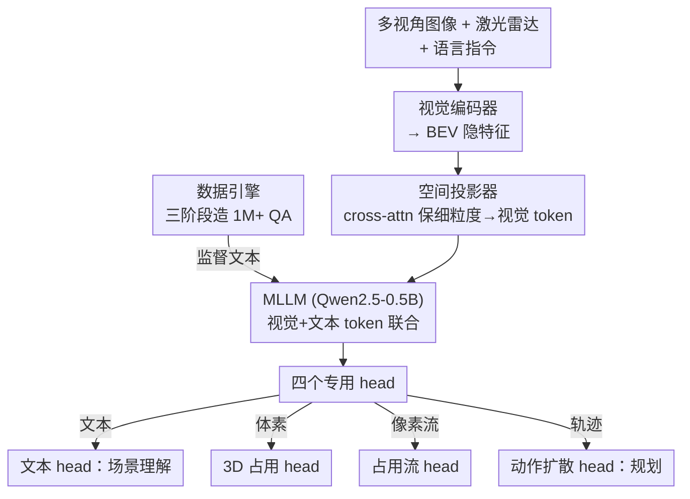

# DrivePI: Spatial-aware 4D MLLM for Unified Autonomous Driving Understanding, Perception, Prediction and Planning

**会议**: CVPR 2026  
**论文**: [CVF Open Access](https://openaccess.thecvf.com/content/CVPR2026/html/Liu_DrivePI_Spatial-aware_4D_MLLM_for_Unified_Autonomous_Driving_Understanding_Perception_CVPR_2026_paper.html)  
**代码**: https://github.com/happinesslz/DrivePI （待开源）  
**领域**: 自动驾驶 / 多模态VLM  
**关键词**: 4D MLLM, 端到端驾驶, 3D占用, 占用流, VLA  

## 一句话总结
DrivePI 用一个仅 0.5B 的 Qwen2.5 作 backbone，把激光雷达点云、多视角图像和语言指令塞进同一个 MLLM，靠四个专用 head 同时输出场景描述、3D 占用、占用流和规划轨迹，让 VLA 模型既有语言交互能力又恢复了 VA 模型那种细粒度空间感知，端到端联合训练即超越 7B 量级的 VLA 和专用 VA 方法。

## 研究背景与动机

**领域现状**：端到端自动驾驶目前有两条主线。一条是 VA（Vision-Action）模型，如 UniAD、VAD，以激光雷达和图像为输入，按「3D 感知 → 预测 → 规划」的模块化流水线产出动作信号，空间感知精确、可解释。另一条是 VLA（Vision-Language-Action）模型，如 OpenDriveVLA、ORION，借助 MLLM 的推理能力，把多视角图像加语言指令喂进大模型直接生成动作，交互友好、像人一样决策。

**现有痛点**：两条路各有硬伤。VA 模型缺乏自然语言交互，用户没法用语言和系统对话，不友好；VLA 模型则因为只吃相机图像、且**缺少细粒度的中间 3D 感知和预测输出**，无法保证输出可靠，可解释性和安全性都打折扣——模型直接「拍脑袋」出动作，中间没有 occupancy 这类可核查的几何中间量。

**核心矛盾**：VA 的「精确空间感知」和 VLA 的「自然语言交互」长期被当成两套互斥范式。VLA 模型的 next-token 预测范式天然难以直接吐出 3D occupancy、occupancy flow 这类稠密、像素级的几何结果，而这恰恰是 VA 模型的强项。

**本文目标**：造一个统一框架，把 VA 的精确空间感知和 VLA 的语言交互**同时**装进一个模型里，让中间产物（3D 占用、占用流）可见、可核查，从而兼顾交互性、可解释性与安全性。

**切入角度**：作者的关键观察是——MLLM 的输出特征里其实蕴含了空间信息，只要补上激光雷达提供精确几何、再挂上专用解码 head 把特征还原成稠密预测，就能让一个语言模型「兼职」做稠密感知。

**核心 idea**：把驾驶任务统一成「粗粒度语言理解 + 细粒度空间学习」，用一个 4D MLLM（之所以叫 4D，是因为它同时输出 3D occupancy 和随时间变化的 flow）通过四个 head 并行产出文本、占用、流和轨迹，端到端联合优化。

## 方法详解

### 整体框架
DrivePI 的输入是多视角图像、激光雷达点云和语言指令，输出是场景描述文本 + 3D 占用 + 占用流 + 规划轨迹。整条流水线是「编码 → 投影成视觉 token → 与文本 token 一起进 MLLM → 四个 head 各取所需」的单塔结构，所有任务共享同一份 MLLM 参数并联合优化。

具体地，先用一个多模态视觉编码器把图像和点云压成紧凑的 BEV 隐特征 $F_{bev}$；再用**空间投影器**把 BEV 特征映射进语言空间得到视觉 token $F_v$；视觉 token 和文本 token 拼接后送入可训练的 MLLM（Qwen2.5-0.5B），MLLM 产出的输出 token 分流给四个专用 head：文本 head 自回归生成场景理解回答、3D 占用 head 做体素级感知、占用流 head 做像素级运动预测、动作扩散 head 做轨迹规划。训练数据则由一个三阶段数据引擎自动生成。

### 关键设计

**1. 激光雷达 + 图像双模态输入：给 MLLM 喂精确几何**

主流 VLA 只吃相机图像，深度/几何全靠模型自己猜，空间推理先天不足。DrivePI 把激光雷达点云作为补充传感模态引入——点云提供相机给不了的精确 3D 几何信息，更能「激发」MLLM 的空间理解能力。作者还特别指出，在 nuScenes 上激光雷达点云本身就含时序信息，相当于顺手把时间维度也带进来了。视觉编码器把图像和点云一起编成统一的 BEV 隐特征，让后续所有任务都站在同一份带几何的表征上。

**2. 空间投影器：cross-attention 压 token 又不丢细节**

BEV 特征图分辨率通常超过 $100\times100$，若按像素级直接喂进 MLLM，计算开销会爆炸。最直接的省钱办法是池化：把 BEV 特征切成 $N$ 个 $K\times K$ 的 patch，得到 $F_{patch}\in\mathbb{R}^{N\times K^2\times C}$，再池化成 $F_{pool}\in\mathbb{R}^{N\times1\times C}$。但池化会把 $K\times K$ 区域里的细粒度空间信息抹平。DrivePI 的做法是用一个 cross-attention 来「补偿」：以池化后的 $F_{pool}$ 作 query、$F_{patch}$ 同时作 key 和 value，

$$F = \mathrm{CrossAttn}(Q{=}F_{pool},\ K{=}F_{patch},\ V{=}F_{patch})$$

这样既把每个 patch 压成一个 token（控制序列长度），又让这个 token 通过注意力从原始 patch 里捞回细节，最后过一个线性层把通道对齐到 MLLM 的隐藏维度 $C_l$，得到视觉 token $F_v\in\mathbb{R}^{N\times C_l}$。相比纯池化，它在「省 token」和「保空间细节」之间找到了折中。

**3. 细粒度视觉 head：让语言模型吐出稠密几何预测**

语言描述擅长高层语义和全局空间关系，但天然缺乏精确的几何定位能力，而驾驶恰恰需要稠密的 3D 占用与运动。DrivePI 在 MLLM 之上挂三个细粒度视觉 head（3D 占用 head、占用流 head、动作扩散 head），把 MLLM 输出的语言空间表征「翻译」回稠密空间预测。机制上：先从多模态表征里取出对应的视觉 token $F'_v\in\mathbb{R}^{N\times C_l}$，用一个线性投影把它升维成 $F^{out}_v\in\mathbb{R}^{N\times K^2C}$，再 reshape 回空间特征图 $F_{out}\in\mathbb{R}^{H\times W\times C}$——这正好是第 2 步 patchify 的逆操作，把「一个 token」重新摊回它代表的 $K\times K$ 空间网格。拿到这张规整的空间特征图后，就能像普通 VA 模型那样无缝接上三个预测 head 出 occupancy / flow / 轨迹。这一步是把 VLA 范式和 VA 范式真正缝合的关键：MLLM 负责理解，视觉 head 负责把理解落到几何。

**4. 三阶段数据引擎：把 occupancy/flow 真值变成语言 QA**

要让 MLLM 学会「用文字推理空间动态」，得有大量把几何真值语言化的训练数据。DrivePI 设计了三阶段数据流水线自造 100 万+ QA：① **场景描述**——用 InternVL3-78B 分别对前视和后视图像生成 caption（分开做是为了避免 MLLM 混淆视角），再合并润色成整场景描述；② **4D 空间理解**——基于 occupancy 和 flow 真值，用多轮对话造 text-occupancy / text-flow QA，问题形如「(70,120,15) 这个位置被什么占据？」「它的速度是多少？」，让模型以文本形式探究细粒度占用与流；③ **规划推理**——基于自车未来轨迹标注造 text-planning QA，让模型给出高层驾驶指令和建议轨迹。最终训练集含 84K 场景描述、560K 4D 空间推理 QA、24K 规划 QA，加上 nuScenes-QA 的 377K，总计超 1.0M。这套数据引擎是「coarse-grained 语言理解」能力的供给侧。

### 损失函数 / 训练策略
总损失是四个 head 的加权和：

$$L_{total} = \lambda_1 L_{llm} + \lambda_2 L_{occ} + \lambda_3 L_{flow} + \lambda_4 L_{action}$$

其中 $L_{llm}$ 是文本 head 损失、$L_{occ}$ 占用、$L_{flow}$ 占用流、$L_{action}$ 动作扩散，实现中四个权重全取 1。训练分两阶段：第一阶段冻结视觉编码器和 MLLM，只用数据引擎的 caption 训空间投影器 1 个 epoch 做表征对齐；第二阶段冻结视觉编码器，联合优化投影器、MLLM 和全部 task head 1 个 epoch。全部实验在 8×NVIDIA L40S 上完成。

## 实验关键数据

### 主实验

3D 占用与占用流（OpenOcc 验证集，仅 0.5B backbone）：

| 方法 | OccScore↑ | RayIoU↑ | mAVE↓ |
|------|-----------|---------|-------|
| FB-Occ | 39.2 | 39.0 | 0.591 |
| ALOcc-Flow-3D（前 SOTA） | 43.0 | 41.9 | 0.556 |
| **DrivePI** | **49.3** | **49.3** | **0.509** |

DrivePI 比 FB-Occ 高 10.3 RayIoU，比前 SOTA ALOcc-Flow-3D 高 6.3 OccScore / 7.4 RayIoU，且把 flow mAVE 从 0.556 压到 0.509——一个 0.5B 语言模型反超了专门做占用的 VA 模型。

规划（nuScenes 验证集，含/不含 ego status）：

| 方法 | VLM | L2 avg(m)↓ | Col. avg(%)↓ |
|------|-----|-----------|--------------|
| VAD（无 ego） | ✗ | 0.72 | 0.22 |
| ORION | ✓ | 0.34 | 0.37 |
| OpenDriveVLA-7B | ✓ | 0.66 | 0.25 |
| **DrivePI（含 ego）** | ✓ | 0.40 | **0.11** |
| **DrivePI（无 ego）** | ✓ | **0.49** | 0.38 |

含 ego status 时碰撞率 0.11%，比 ORION 的 0.37% 降低约 70%；不含 ego status 时 L2 误差 0.49m，比 VAD 的 0.72m 低约 32%。文本理解上（nuScenes-QA）DrivePI 以 0.5B 拿到 60.7% 准确率，比 OpenDriveVLA-7B 的 58.2% 高 2.5%。

### 消融实验

文本 head vs 视觉 head（表 5）：

| 配置 | RayIoU↑ | mAVE↓ | L2↓ | Col.↓ | QA Acc↑ |
|------|---------|-------|-----|-------|---------|
| I 仅文本 head | – | – | – | – | 61.2 |
| II 仅视觉 head | 47.5 | 0.69 | 1.02 | 0.39 | – |
| III 文本+视觉（完整） | 49.3 | 0.51 | 0.49 | 0.38 | 60.7 |

数据缩放（表 6，Qwen2.5-3B 仅文本 head）：occupancy QA 从 28K 扩到 560K，占用状态预测准确率涨约 14%、占用类别准确率从 14.3% 涨到约 44.9%。

### 关键发现
- **统一训练互利而非互斥**：完整模型（III）相比纯视觉（II）把 RayIoU 提了 1.8、mAVE 降了 0.18、L2 降了 0.52，而文本准确率只从 61.2 微降到 60.7。作者归因为「文本理解帮助更好地对齐到视觉任务所需的特征空间」——语言监督反过来给稠密感知提供了更好的表征。
- **数据规模是空间理解的瓶颈**：occupancy QA 从 28K 到 560K 带来占用类别准确率约 30 个点的跃升，说明 4D 空间理解高度依赖数据引擎的量级供给。
- **小模型反超大模型**：0.5B 的 DrivePI 在占用/流上压过专用 VA、在文本上压过 7B 的 OpenDriveVLA，凸显「补几何输入 + 挂解码 head + 喂语言化几何数据」这套组合的有效性，而非单纯堆参数。
- **长尾泛化**：仅用 20% 数据在 WOD-E2E 上 DrivePI-vision 拿到 7.52 RFS，验证了在挑战性长尾场景的适应性。

## 亮点与洞察
- **「4D MLLM」这个定位很巧**：它点破了 VLA 模型的死穴不是推理能力，而是没有可核查的中间几何量；通过强行让语言模型输出 occupancy/flow，把可解释性和安全性以「中间产物」的形式补回来——这是范式融合而非简单拼接。
- **空间投影器的 cross-attention 是可复用 trick**：用池化结果当 query、原 patch 当 KV 去「捞细节」，是任何「需要压 token 又不想丢空间信息」的高分辨率多模态场景都能借鉴的设计。
- **patchify ↔ 升维 reshape 的对称结构**：编码端把 $K\times K$ 网格压成一个 token，解码端再把 token 升维 reshape 回 $K\times K$ 网格，这种「压-还原」的对称让语言空间和稠密预测空间能严丝合缝地来回切换。
- **数据引擎把几何真值「语言化」**：用现成的 occupancy/flow GT + 大模型自动造 100 万 QA，是低成本撬动 MLLM 空间能力的关键供给侧工程。

## 局限与展望
- 代码标注「Code will be available」，截至笔记成文尚未开源，复现性待验证。⚠️ 以原文为准。
- 规划评测是 nuScenes 开环（open-loop）指标，开环 L2/碰撞率与闭环真实安全性存在已知 gap，跨方法比大小需谨慎。
- 含/不含 ego status 两个设置差异明显（含 ego 碰撞率 0.11% 但无 ego 时 0.38%），说明 ego 信息对规划指标影响很大，作者默认不用 ego 以避免捷径学习，但这也意味着「最好看的碰撞率」依赖额外输入。
- 占用流细节、三个视觉 head 的具体结构都「详见补充材料」，正文给的机制偏框架级，部分实现细节本笔记无法核实。⚠️ 以原文为准。
- 数据缩放消融用的是 3B 仅文本 head，与最终 0.5B 联合训练设置不完全一致，结论迁移性需打个折扣。

## 相关工作与启发
- **vs UniAD / VAD（VA 模型）**：它们模块化串行做感知→预测→规划，空间精确但不能语言交互；DrivePI 保留了它们的稠密几何输出（甚至在 OpenOcc 上反超 FB-Occ），同时补上 MLLM 的语言交互，相当于「给 VA 装了张嘴」。
- **vs OpenDriveVLA / ORION（VLA 模型）**：它们用 MLLM 直接出动作、交互友好但缺中间几何、安全性存疑；DrivePI 用同一个 MLLM + 专用 head 把 occupancy/flow 这些可核查中间量补回来，碰撞率比 ORION 降 70%，且只用 0.5B 就超过 7B 的 OpenDriveVLA。
- **vs Gemini Robotics-ER / Seed1.5-VL（MLLM 空间智能）**：那些工作多停在「物体级 3D 框 / 粗粒度关系描述」的 coarse-grained 空间感知，DrivePI 把粒度推到体素级 occupancy 和像素级 flow，是更细的空间落地。

## 评分
- 新颖性: ⭐⭐⭐⭐⭐ 首个把 VA 的稠密几何与 VLA 的语言交互真正缝进单个 4D MLLM 的统一框架，范式融合思路清晰
- 实验充分度: ⭐⭐⭐⭐ 占用/流/规划/文本四任务全覆盖且消融到位，但规划仅开环、部分细节藏在补充材料
- 写作质量: ⭐⭐⭐⭐ 动机推导和 VA/VLA 对比讲得很顺，公式与流水线清楚，个别符号略简
- 价值: ⭐⭐⭐⭐⭐ 0.5B 反超 7B 与专用 VA，对「统一驾驶大模型 + 可核查中间量」方向有很强示范意义

<!-- RELATED:START -->

## 相关论文

- [\[CVPR 2026\] Unifying Language-Action Understanding and Generation for Autonomous Driving](unifying_language-action_understanding_and_generation_for_autonomous_driving.md)
- [\[CVPR 2026\] SpaceDrive: Infusing Spatial Awareness into VLM-based Autonomous Driving](spacedrive_infusing_spatial_awareness_into_vlm-based_autonomous_driving.md)
- [\[CVPR 2026\] GaussianDWM: 3D Gaussian Driving World Model for Unified Scene Understanding and Multi-Modal Generation](gaussiandwm_3d_gaussian_driving_world_model_for_unified_scene_understanding_and_.md)
- [\[AAAI 2026\] RadarMP: Motion Perception for 4D mmWave Radar in Autonomous Driving](../../AAAI2026/autonomous_driving/radarmp_motion_perception_for_4d_mmwave_radar_in_autonomous_driving.md)
- [\[CVPR 2026\] CogDriver: Integrating Cognitive Inertia for Temporally Coherent Planning in Autonomous Driving](cogdriver_integrating_cognitive_inertia_for_temporally_coherent_planning_in_auto.md)

<!-- RELATED:END -->
