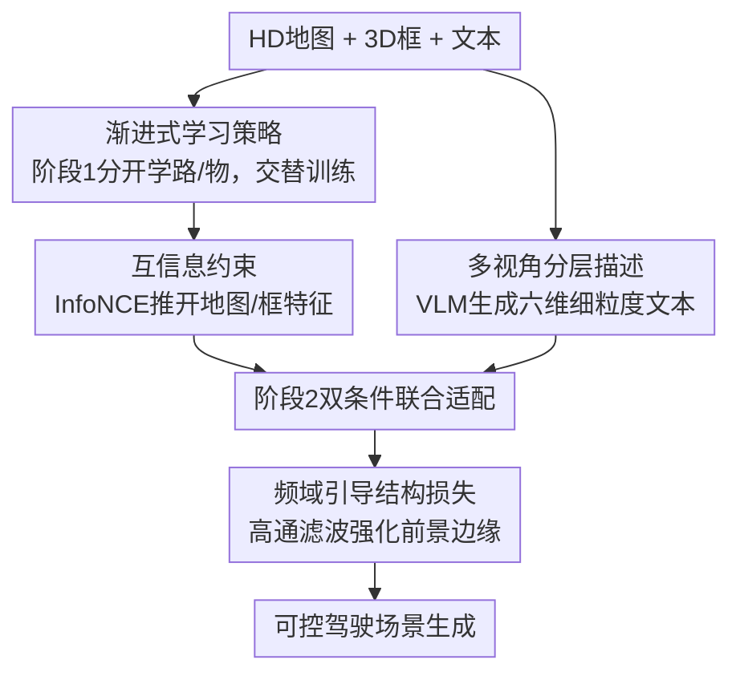

# DrivePTS: A Progressive Learning Framework with Textual and Structural Enhancement for Driving Scene Generation

**会议**: CVPR 2026  
**论文**: [CVF Open Access](https://openaccess.thecvf.com/content/CVPR2026/html/Wang_DrivePTS_A_Progressive_Learning_Framework_with_Textual_and_Structural_Enhancement_CVPR_2026_paper.html)  
**代码**: 无  
**领域**: 自动驾驶 / 扩散模型  
**关键词**: 驾驶场景生成, 渐进式学习, 几何条件解耦, 多视角细粒度描述, 频域结构损失  

## 一句话总结
DrivePTS 针对自动驾驶可控场景生成中"地图与 3D 框相互绑死、文本描述太粗、前景结构模糊"三大痛点，提出先学路再学物的渐进式训练（配互信息约束解耦）、VLM 生成六维多视角描述、以及频域引导的结构损失，在 nuScenes 上 FID 降到 11.45、道路 mIoU 提到 63.95，并能生成此前方法失败的稀有路况。

## 研究背景与动机
**领域现状**：用扩散模型合成多样化的驾驶场景，是验证自动驾驶系统鲁棒性、做数据增强的重要手段。主流做法（BEVControl、MagicDrive、PerLDiff 等）把 HD 地图 + 3D 边界框作为几何条件，再加上一段文本描述，一起喂进扩散模型做条件生成。

**现有痛点**：作者指出三个具体问题。其一，地图和 3D 框被**联合学习**，模型会过拟合到二者的共现模式——比如"一排停着的车"总伴随"直路"、"路障"总伴随"无路"，于是当你只改地图布局时，生成器固执地不跟着变（图 1 里 MagicDrive 改了地图却生成不出对应场景）。其二，nuScenes 自带的文本描述**简短且视角无关**，只有基础信息，无法刻画每个视角特有的细粒度环境，导致背景建模弱、FID 偏高。其三，标准去噪损失对图像**所有区域均匀加权**，忽视前景细节，使生成的车辆、道路边缘扭曲发虚。

**核心矛盾**：根子在于"把多个条件糅在一起、用一个均匀目标去优化"。几何条件之间的隐式依赖来自联合学习；语义贫瘠来自粗粒度 caption；结构模糊来自空间均匀的损失。三者都是"该分开对待的东西被混在一起处理了"。

**本文目标**：分别解决条件解耦、文本增强、结构增强这三个子问题，并用一个统一的训练目标把它们串起来。

**切入角度**：作者的关键观察是——人在理解一个驾驶场景时是有先后的：先有路，再有路上的物。如果让模型也"先学路、后学物"，并显式地把两种条件的特征推开，就能打断它们的共现耦合。

**核心 idea**：用"渐进式分阶段学习 + 互信息约束"替代"几何条件联合学习"来解耦，用"VLM 六维多视角描述"替代"粗粒度 caption"补语义，用"频域结构损失"替代"均匀去噪损失"补前景结构。

## 方法详解

### 整体框架
DrivePTS 建立在 Stable Diffusion 2.1 之上，几何条件不走 ControlNet 那套重型分支，而用轻量的 **T2I-Adapter**：把 HD 地图、3D 框分别当作图像输入送进各自的 adapter，抽多尺度特征 $F_c = T(C)$，再逐尺度加到 UNet 编码器上 $\hat F^i_{enc} = F^i_{enc} + F^i_c$（$i\in\{1,2,3,4\}$）。这种"按条件分支、加法注入"的结构天然契合作者想要的"两种几何条件分开处理"的需求。

整条流程分三块：(1) **渐进式学习策略**把地图条件和框条件拆进两个训练阶段，先单独学、再联合适配，并在联合阶段加互信息约束进一步解耦；(2) **VLM 多视角分层描述**离线为每个视角生成六个语义维度的细粒度文本，替换原始粗 caption 当文本条件；(3) **频域引导结构损失**在去噪损失上叠加一项，专门盯住道路/物体的高频边缘。

### 关键设计

**1. 渐进式学习策略：先学路、再学物，打断几何条件的共现耦合**

针对"地图和框被联合学习导致过拟合共现模式"的痛点，作者把两种几何条件拆进不同训练阶段。**阶段 1（分开学）**：先做**道路生成**，只用 HD 地图 + 文本当条件，并把交通物体占据的区域显式排除在损失之外，让模型专注学路面与背景；再做**物体生成**，换成 3D 框 + 文本当条件，把非物体区域排除，专注学物体的摆放与渲染。为了防止学物体时把刚学会的路又忘了（灾难性遗忘），两个子任务**交替训练**而非顺序训练。**阶段 2（联合适配）**：把地图和框同时喂入，冻结 cross-view 模块、只微调两个 adapter，让模型适应并发输入。这样每种条件先在隔离环境里被充分、独立地学会，再在受控的方式下合并，地图和框之间就不再绑死——改地图时场景能真正跟着变。

**2. 互信息约束：用 InfoNCE 在特征层显式把地图和框推开**

光靠分阶段训练还是隐式的，阶段 2 联合时仍可能在 cross-view 交互里重新耦合。作者在阶段 2 加一个改造版 InfoNCE 互信息损失，把地图特征 $f_m$ 与其对应的框特征 $f_b^+$ 当作要**降低相似度**的一对：

$$L_{MI} = \mathbb{E}_{(f_m, f_b^+)}\left[\log \frac{\exp(\text{sim}(f_m, f_b^+))}{\sum_{j=1}^{N}\exp(\text{sim}(f_m, f_{b,j}))}\right]$$

注意这里是**最小化**该式，即压低 $f_m$ 与对应框特征的相似度——和常规对比学习"拉近正对"的方向相反，目的是逼每个条件分支各自聚焦自己的语义内容，从而在特征层面把两种几何条件解耦。⚠️ 原文公式如上，符号方向以原文为准。

**3. 多视角分层场景描述：用 VLM 把粗 caption 升级成六维细粒度文本**

针对"原始 caption 简短、视角无关、背景建模弱"的痛点，作者用一个开源多模态 VLM（Qwen2.5-VL-72B）离线为 nuScenes 重新打标。为压幻觉、强化驾驶场景理解，先用 LoRA 在驾驶域数据（DriveLM、nuScenes-OmniDrive）上微调，再用 DPO 做强化对齐，让输出更贴合真实场景属性。生成时 VLM **同时看六个视角**保证跨视角一致，并为每个视角输出六个语义维度的结构化描述：**时间**（白天/夜/黄昏，影响光照）、**天气**（晴/阴/雾/雨/雪，影响能见度）、**道路类型**（直路/左转道/T 字口/环岛）、**周边环境**（商业区/乡村/居民街/施工区）、**物体**（车/行人/标志/锥桶等静动态物）、**空间关系**（物体间几何关系）。这样每个视角都有专属的、细到能复原复杂环境的文本条件，直接体现在 FID 大降上。

**4. 频域引导结构损失：用高通滤波专盯前景高频边缘**

针对"均匀去噪损失忽视前景结构、导致边缘模糊扭曲"的痛点，作者认为好的场景生成不止要把区域填上合理内容，还要准确还原边缘与纹理——而这些对应**高频分量**。于是用傅里叶变换提取高频：

$$H(x) = \mathcal{F}^{-1}(M(\omega)\cdot \mathcal{F}(x)), \quad M(\omega) = \begin{cases} 0, & \|\omega\| \le \tau \\ 1, & \|\omega\| > \tau \end{cases}$$

其中 $M(\omega)$ 是高通滤波器，只保留频率幅值高于阈值 $\tau$（经验值 0.5）的分量。结构损失即在高频域对预测和目标做 L2：$L_{freq} = \|H(x_{pred}) - H(x_{target})\|_2^2$。它和去噪损失叠加、并用区域掩码限定在路/物前景上，从而专门加强这些区域的边缘清晰度。

### 损失函数 / 训练策略
渐进式训练对应分阶段的损失组合。**阶段 1** 道路生成用地图掩码 $M_{map}$ 和背景掩码 $M_{bg}$ 限定去噪损失，并在路面区域加频域损失：$L_{road} = L_{diff}\odot(M_{map}+M_{bg}) + \lambda_{freq}\cdot L_{freq}\odot M_{map}$；物体生成则限定在框掩码 $M_{box}$：$L_{object} = L_{diff}\odot M_{box} + \lambda_{freq}\cdot L_{freq}\odot M_{box}$（$\odot$ 为逐元素相乘做区域加权）。**阶段 2** 不再分区域、对整图建模并加入互信息约束：$L_{stage2} = L_{diff} + \lambda_{freq}\cdot L_{freq}\odot(M_{map}+M_{box}) + \lambda_{MI}\cdot L_{MI}$。超参 $\lambda_{freq}=0.5$、$\lambda_{MI}=0.05$；阶段 1 分开学 60k 步、阶段 2 双条件适配 10k 步；AdamW，学习率 $6\times10^{-5}$；推理用 DDIM 25 步、CFG=3，分辨率 $224\times480$。

## 实验关键数据

### 主实验
在 nuScenes（700 场景训练 / 150 场景验证）上对比生成保真度（FID）与可控性（用预训练感知模型 CVT、BEVFusion 测 NDS/mAP/mIoU）。

| 方法 | FID↓ | mAP↑ | NDS↑ | 道路 mIoU↑ | 车辆 mIoU↑ |
|------|------|------|------|-----------|-----------|
| MagicDrive | 16.20 | 12.30 | 23.32 | 61.05 | 27.01 |
| Panacea* | 16.96 | 11.65 | 22.40 | 57.11 | 22.77 |
| PerLDiff | 13.36 | 15.24 | 24.05 | 61.26 | 27.13 |
| **DrivePTS（本文）** | **11.45** | **15.37** | **25.49** | **63.95** | **27.82** |

FID 比此前 SOTA PerLDiff 的 13.36 再降约 16.7%；道路 mIoU 超第二名 2.69 分，作者归因于"先学路后学物"的渐进策略；mAP/NDS 同样领先，说明几何对齐更好。

数据增强价值（用合成验证集扩充 CVT 的 BEV 道路分割训练，nuScenes test 集）：

| 训练配置 | 道路 mIoU↑ |
|----------|-----------|
| train | 65.83 |
| train + 真实 val（上限） | 67.53 |
| train + 合成 val (MagicDrive) | 66.12 (-1.41) |
| train + 合成 val (Panacea) | 66.60 (-0.93) |
| train + 合成 val (PerLDiff) | 65.74 (-1.79) |
| train + 合成 val (本文) | **67.49 (-0.04)** |

DrivePTS 合成数据带来的增益几乎逼平真实验证集（仅差 0.04），远好于其他生成方法。

### 消融实验
三大组件逐一加上：多视角分层描述（MHD）、频域结构损失（FGSL）、互信息约束（MIC）。

| MHD | FGSL | MIC | FID↓ | 道路 mIoU↑ | 车辆 mIoU↑ |
|-----|------|-----|------|-----------|-----------|
| – | – | – | 15.10 | 59.77 | 25.80 |
| ✓ | – | – | 12.03 | 61.22 | 26.49 |
| – | ✓ | – | 14.47 | 62.92 | 26.95 |
| ✓ | ✓ | – | 11.68 | 63.60 | 27.16 |
| ✓ | ✓ | ✓ | **11.45** | **63.95** | **27.82** |

### 关键发现
- **MHD 对真实感（FID）贡献最大**：单加 MHD 就把 FID 从 15.10 砍到 12.03，说明细粒度文本是提升重建质量的主力；而 FGSL 单加对 FID 帮助有限（14.47），但对可控性（道路 mIoU 62.92）提升明显——印证它管的是结构边缘而非整体真实感。
- **MIC 是"联合适配的润滑剂"**：在 MHD+FGSL 基础上再加 MIC，FID 11.68→11.45、道路 mIoU 63.60→63.95，增益不大但稳定，说明它的作用是让模型更好地适应地图+框的并发条件。
- **超参敏感性**：$\lambda_{freq}$ 在 0.5 时道路/车辆 mIoU 最佳（63.60/27.16），过大（1.0）反而掉到 61.95；$\lambda_{MI}$ 在 0.05 时最优（63.95/27.82），继续加大持续掉点——两个正则项都需适度。
- **阶段 1 交替步长**：步长太短会在没学透当前条件时就过早切换、步长太长又导致灾难性遗忘；且阶段 1 结束时"最后学的那个条件"保留得更牢，会显著影响最终质量。
- **泛化亮点**：DrivePTS 能生成此前方法失败的稀有路况（改地图布局后场景真正随之改变），直接验证了渐进式解耦的有效性。

## 亮点与洞察
- **"先路后物"是把领域先验编码进训练课程**：用阶段化训练 + 区域掩码强制模型按"路→物"的顺序学，比起在网络结构上做文章更简单，却直接打断了共现耦合——这种"用训练顺序解耦条件"的思路可迁移到任何多条件可控生成。
- **互信息用反方向**：常规对比学习拉近正对，这里却**最小化** InfoNCE 来把对应的地图/框特征推开，是个反直觉但贴合"解耦"目标的巧用。
- **把"细粒度 caption"工程化成六维结构**：与其让 VLM 自由发挥，不如固定时间/天气/路型/环境/物体/空间关系六个槽位，既保证覆盖又便于跨视角对齐；而且用 LoRA+DPO 压幻觉，是很实在的数据工程。
- **频域损失只盯前景**：用高通滤波 + 区域掩码把监督集中在道路边缘和物体轮廓这些"高频且重要"的地方，是低成本提升结构清晰度的可复用 trick。

## 局限与展望
- 方法**绑定 nuScenes 的六相机布局与三类地图/十类物体**，换到不同传感器配置或更复杂拓扑时的泛化未验证。
- 依赖一个 72B 的 VLM（Qwen2.5-VL-72B）离线打标，外加 LoRA+DPO 微调，**数据准备成本高**，复现门槛不低。
- 互信息约束在阶段 2 的增益较小（FID 仅 0.23、mIoU 0.35），⚠️ 其相对其他两个组件的性价比一般，是否在所有数据规模下都必要存疑。
- 仍是两阶段、多损失、多超参（$\lambda_{freq}$、$\lambda_{MI}$、交替步长）的组合，调参负担较重；端到端单阶段实现同等解耦是值得探索的方向。

## 相关工作与启发
- **vs MagicDrive / BEVControl**: 它们把地图和 3D 框作为几何条件**联合**喂入扩散模型，导致条件共现耦合、改地图不跟变；本文用渐进式分阶段 + 互信息显式解耦，FID（11.45 vs 16.20）和可控性全面领先，且能生成稀有路况。
- **vs PerLDiff（此前 SOTA）**: PerLDiff 在保真度上已较强（FID 13.36），但本文靠 MHD 的细粒度文本把 FID 再降约 16.7%，并在道路 mIoU 上多 2.69 分，说明语义文本与结构损失带来的收益与几何条件建模是正交可叠加的。
- **vs ControlNet 路线**: 作者刻意避开 ControlNet 的重型并行分支（双条件会显著增加算力），改用轻量 T2I-Adapter 做加法式条件注入，更契合"两条件分开处理"的解耦设计。
- **vs SubjectDrive / DriveEditor / SceneCrafter / MVPbev**: 这些做物体替换/插入/删除、属性或视角编辑，但**忽视地图编辑**，限制了路网拓扑多样性；本文正是补上"改地图布局也能正确生成"这一空白。

## 评分
- 新颖性: ⭐⭐⭐⭐ 渐进式解耦 + 反向互信息 + 六维 VLM 描述 + 频域结构损失的组合切中真痛点，但单个组件多为已有思路的巧妙拼装。
- 实验充分度: ⭐⭐⭐⭐ 主结果、数据增强、三组件消融、双超参与步长敏感性都齐，唯独只在 nuScenes 单数据集验证。
- 写作质量: ⭐⭐⭐⭐ 痛点—方法—实验对应清晰，三大创新与三大问题一一对照，公式与掩码定义完整。
- 价值: ⭐⭐⭐⭐ 可控驾驶场景生成 + 数据增强逼近真实验证集，对自动驾驶仿真与感知训练有直接实用价值。

<!-- RELATED:START -->

## 相关论文

- [\[CVPR 2026\] MindDriver: Introducing Progressive Multimodal Reasoning for Autonomous Driving](minddriver_introducing_progressive_multimodal_reasoning_for_autonomous_driving.md)
- [\[CVPR 2026\] RAG-TP: A General Framework for Vehicle Trajectory Prediction via Retrieval-Augmented Generation](rag-tp_a_general_framework_for_vehicle_trajectory_prediction_via_retrieval-augme.md)
- [\[CVPR 2026\] GaussianDWM: 3D Gaussian Driving World Model for Unified Scene Understanding and Multi-Modal Generation](gaussiandwm_3d_gaussian_driving_world_model_for_unified_scene_understanding_and_.md)
- [\[NeurIPS 2025\] SPIRAL: Semantic-Aware Progressive LiDAR Scene Generation and Understanding](../../NeurIPS2025/autonomous_driving/spiral_semantic-aware_progressive_lidar_scene_generation_and_understanding.md)
- [\[CVPR 2026\] DynamicVGGT: Learning Dynamic Point Maps for 4D Scene Reconstruction in Autonomous Driving](dynamicvggt_learning_dynamic_point_maps_for_4d_scene_reconstruction_in_autonomou.md)

<!-- RELATED:END -->
