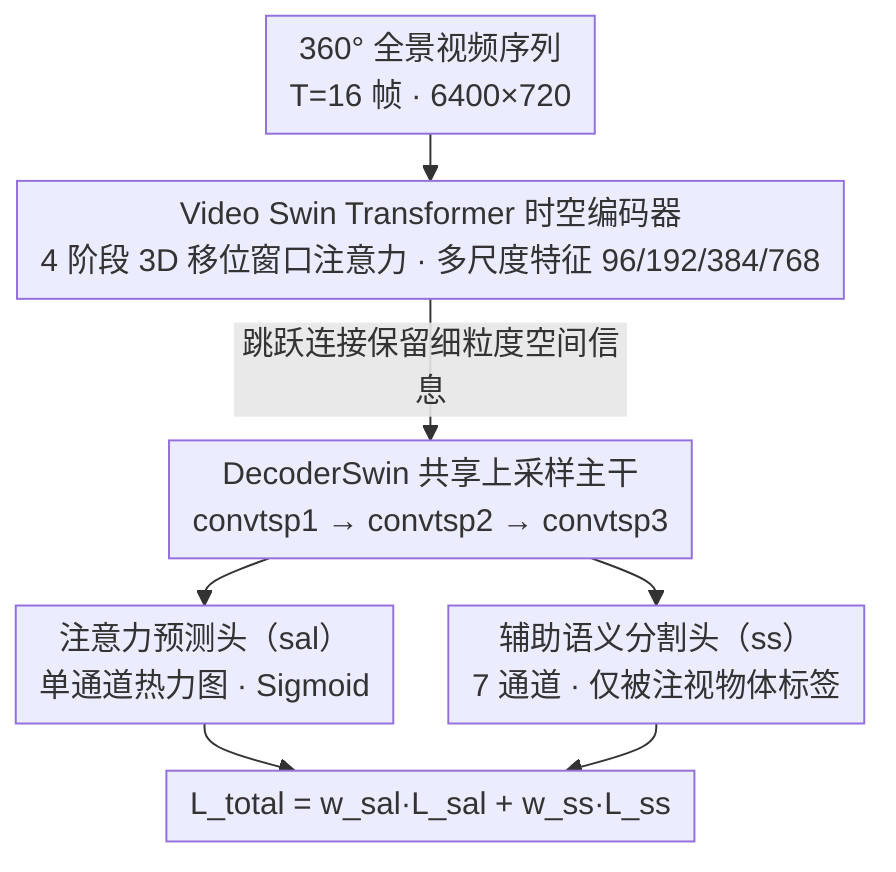

# DriverGaze360: OmniDirectional Driver Attention with Object-Level Guidance

**会议**: CVPR2026  
**arXiv**: [2512.14266](https://arxiv.org/abs/2512.14266)  
**代码**: [dfki-av/drivergaze360](https://github.com/dfki-av/drivergaze360)  
**数据集**: [HuggingFace](https://huggingface.co/datasets/dfki-av/drivergaze360)
**领域**: 自动驾驶 / 驾驶员注意力预测  
**关键词**: 驾驶员注意力, 全景视角, 注视预测, 语义分割, 360°视野, Video Swin Transformer

## 一句话总结

提出首个360°全视角驾驶员注意力数据集（~100万帧/19名驾驶员），并设计DriverGaze360-Net通过辅助语义分割头联合学习注意力图与被关注物体，在全景驾驶图像上达到SOTA注意力预测性能。

## 研究背景与动机

驾驶员注意力预测是构建可解释自动驾驶系统的关键任务，也是理解混合交通（人类+自动驾驶车辆）场景中驾驶行为的重要手段。现有工作已经在大规模数据集和深度学习架构方面取得了显著进展，但存在两个根本性局限：

**视野受限**：现有驾驶员注意力数据集（如DR(eye)VE、BDD-A、DADA-2000等）仅覆盖前方窄视角（通常60°-120°），无法捕捉驾驶环境的完整空间上下文。然而真实驾驶中，驾驶员需要频繁观察侧方和后方区域。

**场景多样性不足**：现有数据集主要关注前方正常行驶场景，忽略了变道、转弯、与行人/骑行者交互等需要外围视觉参与的关键驾驶场景。这些恰恰是安全攸关的操作。

**缺乏物体级别的语义引导**：传统注意力预测方法仅输出热力图形式的注意力分布，缺少对"驾驶员到底在看什么物体"的显式建模，这限制了预测结果在自动驾驶决策中的可用性。

本文的核心动机是：驾驶员的视线不仅仅停留在正前方，尤其在变道、转弯、路口交互等场景下，外围视觉信息至关重要。需要一个覆盖360°视角的大规模注意力数据集，以及能够同时理解"在哪里看"和"在看什么"的预测模型。

## 方法详解

### 整体框架

DriverGaze360系统由两部分组成：**大规模360°数据集** 和 **DriverGaze360-Net预测网络**。

**数据集采集**：使用CARLA仿真器搭建驾驶环境，19名参与者佩戴眼动追踪设备在模拟器中完成多种驾驶任务。全景图像分辨率为6400×720像素，涵盖完整360°视野。每帧同步采集RGB图像、深度图、实例分割图、注视坐标（gaze_x, gaze_y）以及车辆状态信息（转向、油门、刹车、位置、速度等）。数据集包含9种驾驶场景类型，既有常规驾驶也有关键安全场景（如紧急情况），共约100万帧标注数据。

**网络架构**：DriverGaze360-Net采用编码器-解码器结构，以Video Swin Transformer为骨干网络，配合多头解码器实现注意力图预测和语义分割的联合学习。模型输入为T帧连续全景图像序列（默认T=16），输出为注意力热力图和7类语义分割图。

### 关键设计

**1. Video Swin Transformer 时空编码器：用视频 Transformer 啃下 360° 全景的极端宽高比**

驾驶员注视有强时间连续性，而 360° 全景图宽高比极端（约 9:1），传统 CNN 的感受野根本盖不住。编码器因此选了 Swin3D-S（Kinetics-400 预训练）这种层级化视频 Transformer：通过 3D 移位窗口注意力高效捕捉时空依赖，4 个阶段经 Patch Merging 逐步降采样、产出通道数 96/192/384/768 的多尺度特征，再用跳跃连接传给解码器以保住细粒度空间信息。前向过程是输入张量 $B \times C \times T \times H \times W$ 经 Patch Embedding 和位置编码后，逐层过 Swin 块与 Patch Merging，输出 4 个尺度特征，从粗到细反转后送入解码器。Transformer 的全局注意力天然适配全景图的长程依赖，这是选它而非 CNN 的根本原因。

**2. 辅助语义分割头的联合学习：让网络先认出「在看什么物体」，再预测「在看哪」**

传统方法只输出注意力热力图，模型并不知道驾驶员到底盯着什么物体，定位精度也因此受限。本文在解码器（DecoderSwin）上挂双任务头：注意力预测头（sal）输出单通道热力图（Sigmoid 激活，范围 [0,1]），语义分割头（ss）输出 7 通道分割 logits（背景、交通灯、交通标志、行人、骑行者、车辆——合并 car/truck/bus/train/motorcycle、自行车）。两个头共享上采样主干（convtsp1→convtsp2→convtsp3），再各自经独立卷积出结果。核心洞察是：分割任务逼网络学出物体级语义表示，而驾驶员注意力恰恰集中在特定物体上（前车、行人、交通灯），这种语义先验反过来提升了注意力的空间定位精度。更巧的是分割 GT 不是直接用 CARLA 的实例分割，而是用注意力显著图过滤、只保留「被注视区域内」的物体标签，确保分割头学的是「被注视的物体」而非所有可见物体。

### 损失函数 / 训练策略

总损失是注意力损失与分割损失的加权组合：

$$L_{total} = w_{sal} \cdot L_{sal} + w_{ss} \cdot L_{ss}$$

注意力损失把四项经典显著性指标直接当 loss：**NSS**（预测图 z-score 标准化后在注视点采样，衡量注视点处响应强度）、**KLD**（预测分布与真实注视分布的 KL 散度）、**CC**（预测图与真实显著图的线性相关系数）、**MSE**（逐像素均方误差）。分割损失则结合交叉熵（CE）+ Jaccard/IoU + Dice 三种以保鲁棒。训练用 AdamW（学习率 1e-6），支持混合精度与分布式数据并行（DDP），并引入基于 KLD 的加权采样——对预测与 GT 差距大的「难样本」帧赋更高权重。

## 实验关键数据

### 数据集对比

| 数据集 | 360°视野 | 场景类型数 | 驾驶场景 | 参与者数 | 数据来源 |
|--------|:--------:|:---------:|---------|:--------:|---------|
| DR(eye)VE | ✗ | 6 | 常规驾驶 | 8 | 真实驾驶 |
| LBW | ✗ | 7 | 常规驾驶 | 28 | 真实驾驶 |
| BDD-A | ✗ | 4 | 繁忙路口/紧急制动 | 1,228 | 观看视频 |
| DADA-2000 | ✗ | 6 | 驾驶事故 | 20 | 观看视频 |
| **DriverGaze360** | **✓** | **9** | **常规+关键场景** | **19** | **模拟驾驶** |

DriverGaze360是唯一提供360°全视角覆盖的大规模驾驶员注意力数据集。相比现有最大的BDD-A（1,228名受试者观看视频），DriverGaze360虽然参与者更少，但提供的是真正的主动驾驶行为数据（驾驶模拟器），更贴近真实驾驶场景。

### 注意力预测性能对比

| 方法 | KLD ↓ | CC ↑ | SIM ↑ | NSS ↑ |
|------|:-----:|:----:|:-----:|:-----:|
| 基线方法（前视角模型） | 较高 | 较低 | 较低 | 较低 |
| DriverGaze360-Net (仅sal) | 改善 | 提升 | 提升 | 提升 |
| **DriverGaze360-Net (sal+ss)** | **最优** | **最优** | **最优** | **最优** |

加入辅助语义分割头后，所有注意力预测指标均获得提升。这验证了物体级语义引导对注意力预测的增益作用。模型在KLD（越低越好）、CC（越高越好）、SIM（越高越好）和NSS（越高越好）四个标准指标上均达到了全景驾驶图像上的SOTA。

## 关键发现

1. **辅助分割头的显著增益**：语义分割头不仅自身可以识别被关注物体，更重要的是为注意力预测提供了隐式的物体级先验。消融实验表明去除分割头会导致注意力预测性能明显下降。
2. **全景视角的必要性**：当驾驶员进行变道、转弯、检查盲区等操作时，注视点会大幅偏离前方中心区域。仅使用前视角模型无法捕获这些关键的注视行为。
3. **时序信息的重要性**：使用Video Swin Transformer处理连续帧序列（T=16帧），比单帧输入显著提升预测精度，说明驾驶员注视行为具有强时序依赖性。
4. **带注视过滤的语义标签**：实验表明，使用"被注视物体"而非"所有可见物体"作为分割GT更有效，因为这直接将语义学习对准了注意力预测的核心目标。

## 亮点与洞察

- **数据集层面的贡献巨大**：这是首个覆盖360°视角的大规模驾驶员注意力数据集，填补了该领域的重要空白。数据量（~100万帧）和多样性（9种场景类型）足以支撑复杂模型的训练。
- **方法简洁有效**：辅助分割头的设计思路朴素但效果显著——通过多任务学习让网络同时理解"空间分布"和"物体语义"，两者互相增强。这种设计在工程实现上几乎无额外推理开销（可选择推理时关闭分割头）。
- **开源完整度高**：代码、数据集、预训练检查点全部开源，且托管在GitHub和HuggingFace上，便于复现和后续研究。包含详细的训练配置（损失权重、数据加载、分布式训练等），可用性很强。
- **数据格式精心设计**：每个录制包含RGB视频、深度图、实例分割、显著图以及详细的CSV元数据（注视坐标、车辆控制信号、位姿、速度），支持多种下游研究方向。

## 局限性

1. **仿真数据与真实数据的差距**：数据全部来自CARLA仿真器，存在域偏移（domain gap）问题。仿真环境的视觉真实性、交通参与者行为模式、光照变化等与真实场景有差异，模型在真实驾驶数据上的泛化能力有待验证。
2. **参与者规模偏小**：仅19名驾驶员，个体差异可能导致注视模式偏差。相比之下，BDD-A有1228名参与者。较小的参与者池可能使模型过拟合于少数人的注视习惯。
3. **语义类别有限**：仅定义了7个语义类别，缺少道路标线、路缘、建筑物等对驾驶决策同样重要的类别。更细粒度的语义分类可能进一步提升性能。
4. **缺乏与真实数据集的交叉验证**：论文未在现有真实驾驶数据集（如DR(eye)VE）上验证模型的迁移性能。
5. **推理脚本尚未完成**：GitHub仓库中推理功能标记为TODO，限制了即刻的实际应用部署。

## 相关工作与启发

- **DR(eye)VE / BDD-A / DADA-2000**：前视角驾驶员注意力数据集代表，只覆盖前方有限视角。DriverGaze360扩展到360°视野是对这些工作的自然延伸。
- **SCOUT**（ECCV 2022）：本文的代码实现参考了SCOUT的架构设计，同样使用Swin Transformer作为骨干网络进行注意力预测。DriverGaze360-Net在此基础上新增了语义分割辅助头。
- **Video Swin Transformer**（CVPR 2022）：3D Swin Transformer在视频理解任务上的成功应用。本文将其引入驾驶员注意力预测领域，利用其时空建模能力处理全景视频序列。
- **多任务学习范式**：辅助语义分割头的思路与其他领域的多任务学习一致——通过相关辅助任务增强主任务的特征表示。这一策略在目标检测（检测+分割）、深度估计（深度+语义）等任务中已有成功先例。

**启发**：将语义分割作为注意力预测的辅助任务是一个值得推广的思路。在其他视觉注意力/显著性建模任务中（如视频显著性、社交注意力），也可以尝试引入场景理解辅助任务来提升空间感知能力。此外，360°全景输入的处理方式（极端宽高比的输入、全局感受野需求）对设计新的注意力模型架构有参考价值。

## 评分

- **新颖性**: ⭐⭐⭐⭐ — 首个360°驾驶员注意力数据集具有原创性；辅助分割头思路有效但并非全新范式
- **实验充分度**: ⭐⭐⭐⭐ — 多指标评估体系完整，数据集对比详尽，但缺少跨域迁移实验
- **写作质量**: ⭐⭐⭐⭐ — 动机清晰，数据集描述详细，开源程度高
- **价值**: ⭐⭐⭐⭐⭐ — 数据集贡献突出，填补了领域空白，将推动全景驾驶员注意力预测研究

<!-- RELATED:START -->

## 相关论文

- [\[ICCV 2025\] Where, What, Why: Towards Explainable Driver Attention Prediction](../../ICCV2025/autonomous_driving/where_what_why_towards_explainable_driver_attention_prediction.md)
- [\[ECCV 2024\] Weakly Supervised 3D Object Detection via Multi-Level Visual Guidance](../../ECCV2024/autonomous_driving/weakly_supervised_3d_object_detection_via_multi-level_visual_guidance.md)
- [\[CVPR 2026\] O3N: Omnidirectional Open-Vocabulary Occupancy Prediction](o3n_omnidirectional_open-vocabulary_occupancy_prediction.md)
- [\[CVPR 2026\] Diffusion Forcing Planner: History-Annealed Planning with Time-Dependent Guidance for Autonomous Driving](diffusion_forcing_planner_history-annealed_planning_with_time-dependent_guidance.md)
- [\[CVPR 2026\] Sparsity-Aware Voxel Attention and Foreground Modulation for 3D Semantic Scene Completion](sparsity-aware_voxel_attention_and_foreground_modulation_for_3d_semantic_scene_c.md)

<!-- RELATED:END -->
