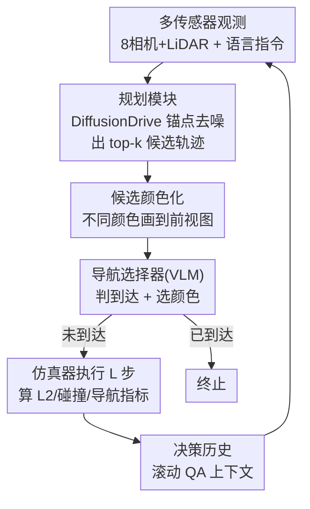

# DriveVLN: Towards Mapless Vision-and-Language Navigation in Autonomous Driving

**会议**: CVPR 2026  
**论文**: [CVF Open Access](https://openaccess.thecvf.com/content/CVPR2026/html/Guo_DriveVLN_Towards_Mapless_Vision-and-Language_Navigation_in_Autonomous_Driving_CVPR_2026_paper.html)  
**代码**: 无（论文未公开）  
**领域**: 自动驾驶 / 视觉语言导航(VLN)  
**关键词**: 无图驾驶, 视觉语言导航, 闭环仿真, 候选轨迹选择, GRPO强化学习  

## 一句话总结
DriveVLN 把"视觉语言导航"搬到自动驾驶里：在没有高精地图、只给一句"去出口/去充电桩"这类目的地级指令的情况下，让车靠视觉线索和历史决策自己找路；作者基于 CARLA 重建 200 个真实场景做闭环 benchmark，并用"规划模块出候选轨迹 + VLM 选轨迹 + 两阶段训练(SFT→GRPO 强化)"搭了个 baseline，Driving Score 0.67 超过 Seed-1.6 和 GPT-5。

## 研究背景与动机
**领域现状**：现在的自动驾驶在大多数有高精地图的路网里已经相当可靠，端到端规划、感知预测一体化都做得不错。语言引导驾驶（DriveLM、LMDrive、DriveVLM 等）也开始把语言接进驾驶策略里，但大多是开环 VQA 式解释，或者仍然预设了导航地图先验。

**现有痛点**：地图一旦缺失就抓瞎——典型场景就是室内停车场。没有精确的地理和路线信息，系统在每个路口都不知道该往哪拐。机器人领域的 VLN 看似能补这个洞，但它假设有人给出**逐步详尽**的指令（"走过大厅，稍微右转，进第二个卧室"）。可现实里司机的处境恰恰相反：**知道要去哪，但不知道怎么去**，没人能事先把停车场每个岔路口的转向描述清楚。

**核心矛盾**：传统 VLN 依赖"逐步指令 + 室内静态观测"，而无图驾驶里能拿到的只有"目的地级粗指令 + 沿途的隐式视觉线索（指示牌、地标、文字标识）"，还要真的去控车保证安全。指令粒度、环境形态、任务执行三处都对不上，VLN 没法直接拿来用。

**本文目标**：定义一个新任务——只凭一句目的地描述 + 车载视觉，在无图条件下安全开到目的地；并配套能闭环评测"导航准确度 + 驾驶安全"的 benchmark 和一个可跑通的 baseline。

**切入角度**：人类老司机能看懂停车场里"出口"指示牌、顺着箭头推断该走哪条道。作者假设模型也能学会这种"读视觉线索 + 结合历史推断岔路"的能力，于是把决策拆成"先判断到没到、再在路口选分支"两件事。

**核心 idea**：把"连续控车"解耦成"规划模块先枚举一堆可行候选轨迹 → VLM 选择器读语言指令和视觉，从候选里挑一条往目的地走的"，并用强化学习让选择器学会利用自己的决策历史来弥补当前帧缺失的导航先验。

## 方法详解

### 整体框架
DriveVLN 包含两层东西：一个**新任务/benchmark**（怎么把无图 VLN 形式化、怎么造数据、怎么评测）和一个 **baseline 模型**（规划模块 + 导航选择器 + 两阶段训练）。

任务被形式化为 option-based 的部分可观测马尔可夫决策过程（POMDP）。每个时刻 $t$ 的自车状态 $s_t=(x_t, c_t, g_t)$，其中 $x_t$ 是位姿、$c_t$ 是驾驶命令、$g_t\in\{0,1\}$ 是到达标志（也是终止条件）。智能体基于历史 $h_t=(T, o_{0:t}, a_{0:t-1})$ 做决策（$T$ 是文本指令、$o$ 是渲染观测、$a$ 是动作）。关键在于**动作空间不是连续控制量，而是规划器吐出的一组候选轨迹** $\mathcal{A}_t=\{\omega_t^k\}_{k=1}^K\sim\mathcal{P}(o_t)$，选择器用策略 $\pi_\theta(\omega\mid h_t,\mathcal{A}_t)$ 挑一条，仿真器执行 $L$ 步。当候选退化成单一外部精细路线时，这个公式就塌缩回传统 VLN，所以它是 VLN 的严格推广。

运行时的数据流是一条带历史回环的链：多传感器观测 → 规划模块出 top-k 候选轨迹 → 把候选用不同颜色画到前视图上 → 导航选择器(VLM)先判到没到、没到就答出该走的颜色 → 对应轨迹交给仿真器执行并算指标 → 决策结果进滚动历史，喂回下一轮。

### 关键设计

**1. 任务形式化：把无图 VLN 落成 option-based POMDP + 路网决策图**

针对"无图驾驶里连续控车 + 缺先验"这个痛点，作者没有让模型直接回归方向盘转角，而是把决策空间离散成"在规划器给的候选轨迹里二/多选一"。直道上的主要任务退化成"判断到没到"，路口才需要"按语言指令和视觉选正确分支"。为支持后者，他们把车道中心线和路口几何融成一张道路拓扑决策图 $G=(v,e)$：**决策节点**定义为进入路口前、朝向路口的自车位姿；每个决策节点连若干候选分支，分支由车道中心线段拼成的折线实例化、长度与真实路网米制一致。这样"选哪条岔路"就变成"在图上选哪条边"，既离散好学，又能用最短路给出 ground-truth 路线。

**2. Topo2Sim 数据流水线：从真实路扫拓扑自动造 200 个数字孪生场景**

无图 VLN 没有现成数据，作者基于 CARLA 造了一条三阶段、可复现的数据管线。① **生成场景资产**：从真车采集的拓扑信息（车道中心线、路口连通性、车位、立柱/墙等静态障碍、出口/充电桩等 POI，均存为 WGS84 大地坐标）出发，先做坐标归一化（转米制 → 统一变换到仿真器坐标系 → 去离群 + 等距重采样），再用 Frenet 框架沿中心线 $C_e:s\mapsto(x(s),y(s))$ 算左右车道边界 $B^{\pm}(s)=C_e(s)\pm\frac{1}{2}w(s)\mathbf{N}(s)$（$\mathbf{N}$ 是侧向单位法向、$w(s)$ 是车道宽），最后做路口连续性/连通性维护，把车道变成可路由的有向多重图。② **自动增强**：文本侧用 GPT-4 按用户意图关键词生成语义等价但措辞多样的指令释义；场景侧用基于规则的随机过程摆放车辆、障碍、车道标线和交通标志，让同一拓扑能生成多种实现。③ **自动采集标注**：对齐 NAVSIM 协议，挂 8 个 RGB 相机 + 1 个 LiDAR，随机选决策节点为起点、POI 为终点，用物理路长做边权在 $G$ 上求最短路当最优路线，直道按 2 Hz 记录、路口额外抓关键帧并把所有可行路径投影到前视图监督训练。

**3. 规划模块 + 导航选择器：先出"目的地无关"候选，再由 VLM 颜色化选择**

这是 baseline 的两个组件，负责把"控车"和"找路"解耦。**规划模块**用 DiffusionDrive 实例化：给定 egocentric RGB + LiDAR，以锚定高斯分布为先验采样带噪轨迹再去噪，取 top-k 作为当前可行候选，构成选择器的动作空间 $\mathcal{A}_t$。这些候选**只编码可通行性、与目的地无关**（每条 8 个 waypoint、覆盖 4 秒、对齐 NAVSIM），好处是规划和"懂语言"彻底分离，规划器不需要知道去哪。**导航选择器**是从 Qwen2.5-VL-3B 微调的指令跟随 VLM：把候选轨迹用不同颜色栅格化叠到前视图上，连同语言指令一起喂进去，模型先判是否到达、没到就**直接回答对应那条路的颜色**当作导航动作，对应轨迹交仿真器执行。选择器还维护一个滚动的视觉+历史决策 QA 上下文，让决策与已走路线保持一致——这正是它在缺当前帧先验时能"接着之前的判断走"的依据。

**4. 两阶段训练：Trajectory Foundry(SFT) + Policy Tempering(GRPO 强化)**

只做监督微调的选择器在单帧上能做合理决策，但无图场景里它欠利用历史、缺环境先验，且"通往目的地的路线本就可能不唯一"，导致它会返回多条候选、消歧不掉（仅 SFT 时 DS 0.49 / SR 0.21）。作者用两阶段解决：① **Trajectory Foundry**——先在增强场景里采随机起终点轨迹（无目的地先验）训规划器，对所有轨迹聚类得锚点，让规划器学会出"可行但目的地无关"的轨迹；同时用真实采集的单帧离散数据对选择器做 LoRA 指令微调，输出被约束成固定格式"(到达与否);(颜色 i)..."。② **Policy Tempering**——专门对选择器做强化学习，让它学会用自身决策历史补偿当前帧缺失的先验（比如到了没线索的路口，靠累积上下文选对分支）。

奖励分两块。**局部奖励**管单步舒适+安全：舒适度用所选轨迹与 GT 轨迹 $L$ 个 waypoint 的平均距离归一化，$S_t^{match}=\exp\!\big(-\frac{1}{L}\sum_{i=1}^{L}\min\|\hat{p}_{t,i}-p_{t,i}\|_2\big)$；安全用碰撞门控 $S_t^{safe}=1-Col_t$，一旦该步发生碰撞就把分清零，$r_t^{local}=S_t^{safe}\cdot S_t^{match}$，再对 $M$ 个决策求平均 $\mathcal{R}_{local}=\frac{1}{M}\sum_t r_t^{local}$。**全局奖励**在 $M$ 轮交互后才算，衡量整条路线和最短路的一致性：等长前缀上逐步比对是否走同一分支 $S_{prefix}=\frac{1}{T}\sum_{t=1}^{T}\mathbf{1}[\hat{v}_t=v_t]\,(T=\min(M,K))$，再算走过边集与最优边集的重叠率 $S_{overlap}=\frac{|\hat\varepsilon\cap\varepsilon|}{\max(1,|\varepsilon|)}$，合成

$$\mathcal{R}_{global}=\alpha_1 S_{prefix}+\alpha_2 S_{overlap}+\alpha_3\mathbf{1}[arrived]$$

总奖励 $\mathcal{R}_t=\lambda\mathcal{R}_{local}+(1-\lambda)\mathcal{R}_{global}$。目标是最大化带 KL 正则的折扣回报（KL 把策略拉住不偏离 SFT 策略 $\pi_0$）：

$$\max_\theta J(\theta)=\mathbb{E}\Big[\textstyle\sum_{t}\gamma^t R_t\Big]-\beta\,\mathbb{E}\big[\mathrm{KL}(\pi_\theta\,\|\,\pi_0)\big]$$

优势项用 GRPO 估计：采 $N$ 个 rollout、各 $M$ 轮交互，$\hat{A}_n=\dfrac{R_n-\frac{1}{N}\sum_j R_j}{\sqrt{\frac{1}{N}\sum_j(R_j-\bar R)^2+\beta}}$，再算 GRPO loss 更新参数。

### 损失函数 / 训练策略
规划器用 DiffusionDrive 官方设置，在 352,230 帧 DriveVLN 数据上训 50 epoch。选择器 SFT 用 Llamafactory 做 LoRA（rank 64、lr 1e-4、单卡 batch 4、40,780 帧 800×600 图、5 epoch）。Policy Tempering 设 $M=8,N=10$（每轮 rollout 8 次、每个 rollout 10 次交互），KL 权重 0.001、lr 余弦退火、5 epoch，8×A800 训练。

## 实验关键数据

### 主实验
评测把经典 VLN 指标（成功率 SR、导航误差 NE）和驾驶指标（碰撞率、L2）合成 Driving Score：$D=RC\cdot IP$，其中路线完成度 $RC=SR+(1-SR)(1-NE)$，违章惩罚 $IP=P_{col}\cdot P_{dev}$（碰撞项 $P_{col}=\exp(-N_{col})$、偏离项由逐步偏差阈值 $\Delta_t=\max(0,1-S_t^{match}-\beta)$ 经 $P_{dev}=\exp(-\frac{1}{M}\sum_t\Delta_t)$ 得到，容差 $\beta=0.2$）。在 benchmark 上以不同 VLM 当选择器对比，规划器取 top-4 候选投到前视图：

| 模型(选择器) | Driving Score ↑ | SR ↑ | NE ↓ | L2 平均(m) ↓ | 碰撞率平均(%) ↓ |
|--------|------|------|------|------|------|
| Seed-1.6 | 0.60 | 0.38 | 0.56 | 0.316 | 0.101 |
| GPT-5 | 0.48 | 0.23 | 0.56 | 1.550 | 0.170 |
| Qwen2.5-VL-72B | 0.45 | 0.21 | 0.59 | 1.868 | 0.240 |
| **DriveVLN(Ours, Qwen2.5-VL-3B)** | **0.67** | **0.44** | **0.49** | **0.283** | **0.096** |

仅 3B 的微调模型反超 GPT-5、Seed-1.6 和 72B 开源模型，DS 0.67 居首。但所有方法到达率都 <0.5，作者明确指出任务仍有很大改进空间。

真实世界数据上的单轮 QA 评测（取停车位、充电桩、出入口三个最常见目的地，arr.=到达检测准确率、nav.=轨迹选择准确率）：

| 模型 | 总体 arr. | 总体 nav. | 备注 |
|------|------|------|------|
| Seed-1.6 | 56.15 | 49.68 | — |
| GPT-5 | 81.89 | 58.43 | 长尾停车场泛化强 |
| Qwen2.5-VL-72B | 30.51 | 48.98 | 停车位到达检测仅 1.34% |
| **DriveVLN(Ours)** | **91.40** | **63.75** | 几乎全项 SOTA |

### 消融实验
| 训练阶段 | 规划器 | DS ↑ | SR ↑ | NE ↓ | L2 ↓ | 碰撞 ↓ |
|------|------|------|------|------|------|------|
| SFT | DiffusionDrive | 0.49 | 0.21 | 0.53 | 0.457 | 0.107 |
| **SFT+RL** | DiffusionDrive | **0.67** | **0.44** | **0.49** | **0.283** | **0.096** |
| SFT | Expert(专家轨迹) | — | 0.23 | 0.48 | — | — |
| SFT+RL | Expert(专家轨迹) | — | **0.51** | **0.42** | — | — |

（专家轨迹无碰撞/L2，故置空。）

### 关键发现
- **Policy Tempering(RL) 是涨点主力**：在 DiffusionDrive 规划器下，加 RL 后 DS 0.49→0.67、SR 0.21→0.44，L2 与碰撞率都同步下降——说明全局路线一致性奖励确实让模型学会了用历史补先验、滤掉明显错误候选。
- **换成专家轨迹只小幅提升**：专家轨迹在前视图里更规整、更贴近 SFT 训练分布，SR 在 SFT+RL 下从 0.44→0.51，说明候选质量有影响但不是瓶颈，瓶颈在选择器的决策能力。
- **小模型 + 任务专用训练 > 大通用模型**：3B 微调版全面压过 GPT-5/72B，印证无图 VLN 是个需要专门训练的"领域技能"，靠通用 VLM 的零样本推理远远不够。
- **停车场长尾很难**：Qwen2.5-VL-72B 在停车位到达检测上只有 1.34%，说明"判断到没到"这种看似简单的二分类在停车场场景里极不稳定。

## 亮点与洞察
- **把控车难题转成"颜色选择题"**：用规划器先生成可行候选、再让 VLM 答"走哪个颜色"，既绕开了让 VLM 直接回归连续控制量的不稳定，又把语言-视觉推理和运动可行性彻底解耦，是很干净的工程化拆解。
- **option-based POMDP 让 VLN 与传统 VLN 数学上统一**：候选退化成单一精细路线时公式塌缩回经典 VLN，这个"严格推广"的形式化很有说服力，也方便后续接别的规划器/选择器。
- **奖励同时编码局部安全和全局路线一致**：局部奖励用碰撞门控直接清零、全局奖励用前缀匹配+边重叠对最短路，这套"舒适×安全 + 路线一致"的组合可以迁移到其他闭环导航/驾驶 RL 任务。
- **Topo2Sim 把真实路扫拓扑自动数字孪生成训练场**：从 WGS84 拓扑到可路由有向多重图再到 CARLA 场景的全自动管线，是无图 VLN 缺数据这个硬约束下很实在的解法。

## 局限与展望
- **到达率整体偏低(<0.5)**：作者自己承认任务难、headroom 大，目前还远谈不上可部署。
- **数据主要来自停车场类室内无图场景**：200 个场景虽由真实路扫重建，但泛化到开放道路、复杂城市路网是否成立未验证。
- ⚠️ **奖励权重 $\alpha_1,\alpha_2,\alpha_3,\lambda,\omega$ 等超参的取值与敏感性论文未给完整说明**，复现时需以原文/代码为准（且代码未公开）。
- **选择器只在"路口选分支"上发力**：直道退化为到达检测，遇到没有任何视觉线索、纯靠记忆也猜不出的岔路时，方法的上限取决于历史信息量，论文未深入分析这类失败模式。
- 展望：作者计划扩到更大更多样的真实数据、引入更大规模 LLM 提升推理与泛化。

## 相关工作与启发
- **vs 传统室内 VLN(R2R / REVERIE / SOON)**：它们假设逐步精细指令 + 静态图像观测、且只看导航指标；DriveVLN 改成目的地级粗指令 + 真实控车，并把驾驶安全指标(L2/碰撞)和导航指标合进一个 Driving Score 做闭环评测，填了"driving-oriented VLN"的空白。
- **vs 语言引导驾驶(DriveLM / LMDrive / DriveVLM)**：这些大多是开环 VQA 解释、或预设导航地图先验；DriveVLN 主打**无图 + 目的地级 grounding + 全闭环 rollout**，把语言驾驶从"解释"推向"在缺地图时真的把车开到"。
- **vs 闭环驾驶 benchmark(Bench2Drive / Waymo Sim Agents)**：它们做端到端闭环但不评 VLN、也不针对无图；DriveVLN 在 CARLA 上重建 200 个真实场景专门评语言驱动的无图导航，并同时报驾驶与 VLN 指标。

## 评分
- 新颖性: ⭐⭐⭐⭐⭐ 首次把无图、目的地级 VLN 引入自动驾驶并配套闭环 benchmark，问题定义本身就是贡献
- 实验充分度: ⭐⭐⭐⭐ 主表+真实数据+消融齐全，且对比了 GPT-5/Seed-1.6/72B，但到达率低、超参敏感性分析欠缺
- 写作质量: ⭐⭐⭐⭐ 任务动机讲得很清楚，POMDP 形式化和奖励设计严谨；部分公式排版较密
- 价值: ⭐⭐⭐⭐⭐ 给"停车场等无图场景的语言驱动导航"立了任务、数据和 baseline 三件套，后续可直接接力

<!-- RELATED:START -->

## 相关论文

- [\[CVPR 2026\] Learning Vision-Language-Action World Models for Autonomous Driving](vla_world_learning_vision_language_action_world_models_for_autonomous_driving.md)
- [\[CVPR 2026\] VGGDrive: Empowering Vision-Language Models with Cross-View Geometric Grounding for Autonomous Driving](vggdrive_empowering_vision-language_models_with_cross-view_geometric_grounding_f.md)
- [\[CVPR 2026\] DriveMoE: Mixture-of-Experts for Vision-Language-Action Model in End-to-End Autonomous Driving](drivemoe_mixture-of-experts_for_vision-language-action_model_in_end-to-end_auton.md)
- [\[CVPR 2026\] EventDrive: Event Cameras for Vision-Language Driving Intelligence](eventdrive_event_cameras_for_vision-language_driving_intelligence.md)
- [\[CVPR 2026\] WalkGPT: Grounded Vision-Language Conversation with Depth-Aware Segmentation for Pedestrian Navigation](walkgpt_grounded_vision-language_conversation_with_depth-aware_segmentation_for_.md)

<!-- RELATED:END -->
