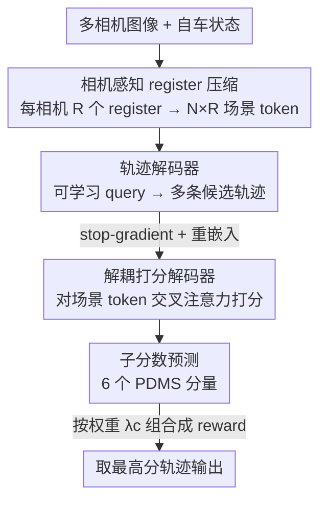

# Driving on Registers (DrivoR)

**会议**: CVPR 2026  
**论文**: [CVF Open Access](https://openaccess.thecvf.com/content/CVPR2026/html/Kirby_Driving_on_Registers_CVPR_2026_paper.html)  
**代码**: 有（项目页发布 code 与 checkpoints）  
**领域**: 自动驾驶  
**关键词**: 端到端驾驶, 寄存器 token 压缩, 轨迹打分, ViT 主干, 行为可调  

## 一句话总结
DrivoR 用一个纯 transformer 的端到端驾驶架构，给每个相机加一组可学习的 register token 把上千个 ViT 视觉 token 压成几十个「场景 token」，再用两个解耦的解码器分别生成和打分候选轨迹，参数仅约 40M 却在 NAVSIM-v1/v2 和闭环 HUGSIM 上达到或超过更重的 baseline。

## 研究背景与动机
**领域现状**：端到端（E2E）驾驶把传感器和自车状态直接映射成驾驶决策，省掉了 3D 框、地图等中间标注。其中「轨迹提案 + 打分」一类方法表现最强——网络先吐出多条候选轨迹，再由一个打分器挑出最好的那条，天然把驾驶的多模态/不确定性显式建模。

**现有痛点**：这类方法的算力几乎全压在感知主干上。无论是 VoV-Net 这类 CNN，还是 EVA、DINO 这类大 ViT，每帧都会输出**上千个 token**，而打分阶段又要把这上千个 token 跟**几百条**候选轨迹反复做注意力，token 数随分辨率和相机数线性膨胀，构成端到端流水线的主要计算瓶颈。

**核心矛盾**：业界减负的常规做法是对特征图做空间池化（pooling），但池化有两个硬伤——它对输入分辨率有刚性要求，且**把所有 token 一视同仁**，对前视和后视相机做同样的平均操作，抹掉了「前方信息远比侧后方重要」这一驾驶先验。于是「少 token 省算力」和「保住规划相关信息」成了一对 trade-off。

**本文目标**：在不引入 BEV、不依赖大轨迹词典、不要 3D 监督的前提下，回答「表示一个驾驶场景到底需要多少个 token」，并把感知主干压到能实时跑。

**切入角度**：ViT 里早有 register token（最初是为修注意力 sink 引入的额外 token），TiTok 等工作已经证明它能当紧凑的场景描述子。作者把这个结构「挪用」到驾驶——既然 register 能学到压缩表示，那就直接让它充当场景的压缩接口。

**核心 idea**：用**每相机一组可学习 register token** 替代均匀池化，把视觉特征压成少量「相机感知」的场景 token，再配一个**与生成解耦的打分器**，让同一个模型在推理时按不同行为偏好挑轨迹。

## 方法详解

### 整体框架
DrivoR 是一个经典的 transformer 编码器-解码器结构，由三个模块串成：一个**感知编码器**把多相机图像压成场景 token，一个**轨迹解码器**从可学习 query 生成多条候选轨迹，一个**打分解码器**给每条候选打分、推理时取最高分那条作为最终输出。整条流水线没有任何 BEV 投影、可变形注意力或 LiDAR 监督。

关键的一步发生在编码器：每个相机的 ViT 在 patch token、cls token、原有 register 之外，额外拼上 $R$ 个**本相机专属**的 register，过完 ViT 后只取出这 $R$ 个 register token。$N$ 个相机各取 $R$ 个，拼成 $N\times R$ 个**场景 token**——这是后续两个解码器唯一能看到的视觉信息。因为 register 是按相机初始化的，场景 token 天生带「来自哪个相机」的身份，模型能区分前/左/右/后。

两个解码器结构相同（标准 transformer decoder：自注意力 → 对场景 token 的交叉注意力 → FFN），但被刻意解耦：轨迹解码器先生成候选，候选被**重新嵌入并从计算图上 detach**后才送进打分解码器，使「生成用什么信息」和「打分用什么信息」彻底分开。

### 关键设计

**1. 相机感知 register 压缩：用少量 register token 当场景描述子，替代均匀池化**

这是全文的核心，针对的就是「上千 token × 几百轨迹」的算力瓶颈和池化抹平相机差异的痛点。做法是对每个相机的 ViT 输入端额外拼上 $R$ 个随机初始化的 register（默认 $R=16$），与 patch/cls/原 register 一起过 ViT，在最后一层只把这 $R$ 个 register 取出来；$N$ 个相机汇总成 $N\times R$ 个场景 token（默认 4 相机 × 16 = 64 个）。和 Perceiver 用交叉注意力压缩不同，register 压缩不改 ViT 结构，可以**直接拿预训练 ViT 当初始化**，只对主干做 LoRA 微调（rank 32）来学「视觉→register」的压缩映射，新增参数仅约 0.6M。效果上，64 个 token 的版本几乎追平用 16k 全特征图（250× 的 token 量）的模型，并明显优于同参数量的池化和「用 decoder query 压缩」两种方案。更妙的是「相机感知」带来可解释性：前视 register 彼此去相关、各自专注红绿灯/前车/路沿等不同区域，而侧后视 register 大量坍缩成同一表示——这正符合「驾驶时绝大部分注意力在前方、偶尔瞟一眼后方」的直觉，是均匀池化根本观察不到的现象。

**2. 解耦打分解码器：靠 stop-gradient + 重嵌入把「生成」与「打分」彻底分开**

轨迹打分的难点在于：如果生成和打分共用一套特征，打分器会顺带看到轨迹 token 里残留的生成细节，二者互相干扰。作者把每条解码出的轨迹用一个 MLP 重新嵌入成 $D_\text{score}$ 维的打分 query，**而不是复用轨迹解码器的输出 token**——这样打分器只看得到「轨迹本身」，看不到生成时的潜在细节。同时在梯度上做双向控制：打分解码器对场景 token 的交叉注意力**允许**梯度回流到感知编码器（让场景 token 同时对生成和打分都有用），但**阻断**打分梯度回流到轨迹解码器（避免轨迹生成被当前打分器的好坏带偏）。消融显示这种「分离」是单调有益的：是否阻断梯度从 86.8 提到 90.0 PDMS。可视化也佐证了为何要分——生成头始终盯着前视相机，而打分头会随轨迹是急转还是有碰撞风险而切到侧/后相机，两个任务关注的视角根本不同。

**3. 子分数预测与行为可调推理：把打分器当 reward function，单模型按偏好换驾驶风格**

打分头不直接回归一个总分，而是分别预测 PDMS 的 6 个子分量（如安全、舒适、效率、进度等），各用一个独立 MLP，训练时对每个子分量 $c$ 用二元交叉熵去拟合数据集自带的 oracle 打分器 $\mathcal{G}_c$：

$$\mathcal{L}_\text{score} = \sum_{c} \lambda_c \sum_i \operatorname{BCE}\!\left(\mathcal{G}_{\theta_c}(\tau_i),\, \mathcal{G}_c(\tau_i)\right)$$

推理时把整个流水线重新解释成一个「条件于行为画像的驾驶策略」：借鉴离线 RL（如 CtRL-Sim），通过改变各子分数的权重 $\lambda_c$ 把打分输出当 reward，选出最大化该 reward 的轨迹——想更激进就加大 progress 权重，想更保守就加大 safety/comfort 权重，**无需重训**即可切换风格。消融还发现，预测多个子分量本身就比直接学最终总分更准（90.0 vs 88.2 PDMS），因为拟合 Eq.3 的最终聚合输出比拟合它的各个分量更难。

### 损失函数 / 训练策略
轨迹用 Winner-Takes-All（等价 min-over-n）回归，只监督最接近人类参考轨迹 $\hat\tau$ 的那条候选，从而鼓励候选多样性：$\mathcal{L}_\text{traj} = \min_i \lVert \tau_i - \hat\tau \rVert_1$。可选地再加一条「更激进」的目标 $\hat\tau'$（把时长 $T'>T$ 的参考用三次样条重采样到 $T$），变成 $\mathcal{L}_\text{traj} = \min_i (\lVert \tau_i - \hat\tau \rVert_1 + \lVert \tau_i - \hat\tau' \rVert_1)$。总损失 $\mathcal{L} = \mathcal{L}_\text{traj} + \lambda_s \mathcal{L}_\text{score}$，实现上所有权重（含每个 $\lambda_c$ 与 $\lambda_s$）都简单设为 1。主干用 DINOv2 ViT-S + LoRA，解码器 4 层、内维 256，默认 64 条轨迹 query。

## 实验关键数据

### 主实验
NAVSIM-v1（navtest，仅相机输入），DrivoR 以约 40M 参数刷新榜首并逼近人类水平：

| 方法 | NC | DAC | TTC | EP | PDMS |
|------|------|------|------|------|------|
| Human driver | 100 | 100 | 100 | 87.5 | 94.8 |
| Hydra-MDP++ | 98.6 | 98.6 | 95.1 | 85.7 | 91.0 |
| iPad | 98.6 | 98.3 | 94.9 | 88.0 | 91.7 |
| DriveSuprim | 98.6 | 98.6 | 95.5 | 91.3 | 93.5 |
| **DrivoR** | 99.0 | 98.9 | 96.7 | 90.0 | **93.7** |

NAVSIM-v2（navhard-two-stage，官方修 bug 后）与闭环 HUGSIM（零样本迁移，未微调）同样领先：

| 基准 | 指标 | 代表 baseline | DrivoR |
|------|------|------|------|
| NAVSIM-v2 | EPDMS | ZTRS 48.1 / GTRS-A 45.4 | **48.3** |
| HUGSIM | RC（平均） | UniAD 45.9 | **49.8** |
| HUGSIM | HD-Score（平均） | UniAD 32.7 | **35.7** |

效率上，相比 ViT-L 的 GTRS，单样本前向从 400ms 降到 110ms（>3× 吞吐），GFLOPS 和峰值显存也约 3× 下降。把 GTRS 主干直接换成「ViT-S + register 压缩」（保留其词典与打分器）也比同尺寸 V2-99 主干更好且 >3× 吞吐，说明压缩本身就有增益。

### 消融实验
| 配置 | PDMS | 说明 |
|------|------|------|
| Random init 主干 | 70.1 | 预训练至关重要 |
| ImageNet-21k 预训练 | 87.5 | 好初始化 +15 以上 |
| DINOv2 预训练 | 90.0 | 进一步优于 ImageNet |
| Pooling 压缩 (LoRA) | 89.7 | 均匀池化基线 |
| Decoder query 压缩 | 89.3 | 同参数量但更差 |
| **Register 压缩 (LoRA)** | 90.0 | 64 token 追平 16k 全特征 |
| 无 register 全特征 16k | 90.2 | 250× token，仅领先 0.2 |
| 单分支生成+打分 | 84.7 | 不解耦 |
| 双分支无 disentangle | 86.8 | 有分支但梯度未阻断 |
| 双分支 + disentangle + 6 子分数 | 90.0 | 完整模型 |
| 双分支 + disentangle + 1 总分 | 88.2 | 不预测子分量，无法行为可调 |

### 关键发现
- **压缩几乎免费**：register 把场景 token 从 16k 压到 64（250×）仅掉 0.2 PDMS，且优于池化和 decoder-query 两种同量级方案；这是全文最强的卖点。
- **解耦是单调收益**：从单分支 84.7 → 双分支 86.8 → 加 stop-gradient/重嵌入 90.0，证明「打分器别看到生成残留、也别把梯度灌回生成器」每一步都有用。
- **register 数有平台**：16~32 个/相机后饱和，故选 16；且用 DINOv2 自带 register 反而不如随机初始化（已特化的 register 对驾驶是坏起点）。
- **双目标 trade-off**：加「更激进」的第二回归目标在重 progress 的 NAVSIM-v1 上 +0.6（90.0→90.6），但在需谨慎避撞的 NAVSIM-v2 扰动场景上反而掉点（39.4→37.8）——⚠️ 横向不可直接比，两个基准奖励的驾驶风格相反。
- **行为可调有效**：在 NAVSIM-v2 上调高 safety/comfort 权重得到的「安全导向 agent」确实在安全/舒适指标上更好、progress 下降，呈现更被动保守的驾驶。

## 亮点与洞察
- **把 ViT register「挪用」到驾驶**：register 原本是修注意力 sink 的副产品，这里被当成压缩接口，且不改 ViT 结构、直接吃预训练权重 + LoRA，工程上极轻——这种「借现成结构解新问题」的思路可迁移到任何需要把大 backbone 输出压短的下游任务。
- **相机感知 + 自发坍缩**：per-camera register 让模型自己学出「前视专精、后视坍缩」的稀疏注意力，既省算力又自带可解释性，是均匀池化做不到的；这暗示「让模型自己决定每个视角配几个 token」比人工等分更合理。
- **解耦打分的可视化证据扎实**：用交叉注意力的主导相机直接画出「生成盯前方、打分看侧后」的差异，把「为什么要分两条分支」从消融数字变成看得见的现象。
- **打分器即 reward**：把监督学到的子分数在推理时重解释成可调权重的 reward，相当于免费拿到一个行为可控的策略族，单模型多风格，这点对部署很有吸引力。

## 局限与展望
- **LoRA vs 全量微调仍有 gap**：作者承认 LoRA（90.0）略低于全量微调（理论上应可追平），归因于缺乏针对主干的精细学习率调度——即默认配置下没把全量微调调到最优。
- **HUGSIM 评测代码有 bug**：作者自己发现官方 comfort 指标的加速度界限不一致、规划轨迹的航向计算有误，修正后才报告——说明该闭环基准的横向可比性本身存疑（⚠️ 以原文 GitHub issue 为准）。
- **依赖 oracle 打分器**：打分头是去拟合数据集自带的 PDMS oracle，性能上限受 oracle 质量约束；脱离有 oracle 标注的基准时如何获得监督信号未讨论。
- **侧后视坍缩的代价未量化**：把侧/后相机 token 坍缩在前向直行场景合理，但在变道、倒车、被后车逼近等强依赖后方信息的场景是否会丢关键信息，文中只给直觉假设，未做针对性压力测试。

## 相关工作与启发
- **vs GTRS**：GTRS 用 ViT 大主干 + 大轨迹词典 + 池化把场景压成特征，强在打分器；DrivoR 去掉池化换成 learned register 压缩，并把打分从生成里解耦出来。把 DrivoR 的 register 压缩直接装到 GTRS 上即超过其 V2-99 主干且 >3× 吞吐，说明压缩与解耦是正交可叠加的增益。
- **vs Hydra-MDP/DiffusionDrive 等提案打分法**：同属「生成多候选再打分」范式，但它们把算力留在重主干和池化上、且生成与打分耦合；DrivoR 用极简纯 transformer + token 压缩 + 显式解耦，在更小参数量下做到更高 PDMS。
- **vs UniAD 等模块化 E2E**：UniAD 仍带检测/跟踪/建图等子模块、难部署；DrivoR 无 BEV、无中间表示，是更彻底的端到端，并把感知主干压到接近实时。

## 评分
- 新颖性: ⭐⭐⭐⭐ 首次把 ViT register 专门用于 E2E 规划的视觉 token 压缩，配解耦打分，组合新颖但每块都基于现成结构
- 实验充分度: ⭐⭐⭐⭐⭐ NAVSIM-v1/v2 + 闭环 HUGSIM 三基准 + 压缩/微调/解耦/子分数等多组细致消融 + 效率对比
- 写作质量: ⭐⭐⭐⭐ 结构清晰、图文对应好，公式排版偶有 OCR 噪声但不影响理解
- 价值: ⭐⭐⭐⭐⭐ 40M 参数、3× 提速却近 SOTA，对端到端驾驶的实时落地很有参考价值

<!-- RELATED:START -->

## 相关论文

- [\[CVPR 2026\] SGDrive: Scene-to-Goal Hierarchical World Cognition for Autonomous Driving](sgdrive_scene-to-goal_hierarchical_world_cognition_for_autonomous_driving.md)
- [\[CVPR 2026\] DVGT: Driving Visual Geometry Transformer](dvgt_driving_visual_geometry_transformer.md)
- [\[CVPR 2026\] Efficient Equivariant Transformer for Self-Driving Agent Modeling](efficient_equivariant_transformer_for_self-driving_agent_modeling.md)
- [\[CVPR 2026\] Reliable Policy Transfer for Safety-Aware End-to-End Driving with Deep Reinforcement Learning](reliable_policy_transfer_for_safety-aware_end-to-end_driving_with_deep_reinforce.md)
- [\[CVPR 2026\] MindDriver: Introducing Progressive Multimodal Reasoning for Autonomous Driving](minddriver_introducing_progressive_multimodal_reasoning_for_autonomous_driving.md)

<!-- RELATED:END -->
