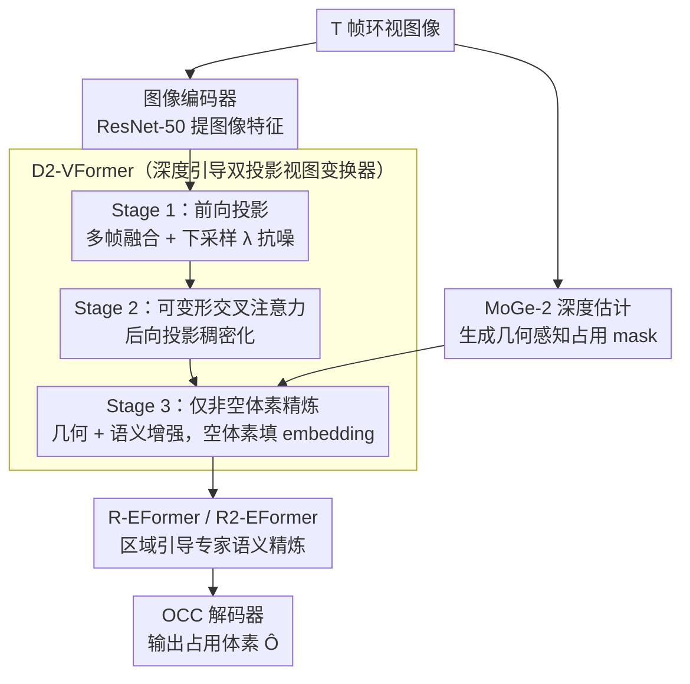

# Dr.Occ: Depth- and Region-Guided 3D Occupancy from Surround-View Cameras for Autonomous Driving

**会议**: CVPR 2026  
**arXiv**: [2603.01007](https://arxiv.org/abs/2603.01007)  
**代码**: 无  
**领域**: 自动驾驶 / 3D 占用预测  
**关键词**: occupancy prediction, depth guidance, MoGe-2, Mixture-of-Experts, region-guided, view transformation

## 一句话总结

提出 Dr.Occ，一个统一的纯视觉 3D 占用预测框架，通过深度引导的双投影视图变换器（D2-VFormer）利用 MoGe-2 高质量深度先验实现精确几何对齐，以及区域引导的 MoE/MoR 专家 Transformer（R-EFormer / R2-EFormer）自适应分配区域专家解决空间语义不平衡，在 Occ3D-nuScenes 上将 BEVDet4D 基线提升 7.43% mIoU。

## 研究背景与动机

**领域现状**：3D 语义占用预测是自动驾驶的核心感知任务，旨在生成场景的密集体素级表示，为运动规划和避障提供几何与语义信息。纯视觉方案是主流方向（LSS、BEVFormer、COTR 等），通过 2D-to-3D 视图变换实现。

**现有痛点**：
1. **几何对齐不准**：现有前向投影方法（LSS、BEVDepth）依赖低分辨率、噪声较大的深度估计进行 2D→3D 特征变换，投影精度有限
2. **空间语义不平衡**：不同语义类别在 3D 空间中表现出强烈的空间偏好，如行人集中在道路边缘、车辆在道路中央、建筑物在高处，但现有方法对所有区域统一建模
3. 约 90% 的体素是空的，直接拟合所有体素效率低下
4. 简单地将 MoGe 深度图与图像拼接或转为伪点云进行前向投影反而降低性能

**核心矛盾**：如何利用先进深度估计模型提供的高质量几何先验来改善占用预测，同时解决语义类别在空间分布上的严重不平衡。

**本文目标**：同时解决纯视觉占用预测中的几何重建不准和语义学习不平衡两大挑战。

**切入角度**：深度引导确保几何对齐 + 区域专家增强语义学习，二者互补。

**核心 idea**：用 MoGe-2 深度生成占用 mask 引导非空体素精炼，用 MoE 思想按空间区域分配专家处理语义异质性。

## 方法详解

### 整体框架

Dr.Occ 在现有占用预测流程基础上做两处改进：
1. 用 **D2-VFormer** 替换原有视图变换器，利用 MoGe-2 深度先验实现深度引导的双投影特征构建
2. 在 3D 特征精炼阶段插入 **区域引导专家 Transformer（R-EFormer / 递归变体 R2-EFormer）**，按物理空间分配专家进行语义增强

输入为 $T$ 帧环视图像 → 图像编码器 → D2-VFormer 构建 3D 体素特征 → R-EFormer / R2-EFormer 语义精炼 → OCC 解码器输出 $\hat{\mathbf{O}} \in \mathbb{R}^{X \times Y \times Z \times C}$。

### 关键设计

**1. 深度引导的双投影视图变换器（D2-VFormer）：不拿深度硬投影，而是用它当「注意力地图」**

现有前向投影（LSS、BEVDepth）依赖低分辨率、带噪的深度做 2D→3D 变换，几何对齐不准；但作者发现把 MoGe 深度直接拼图像或转伪点云做前向投影反而更差——因为图像特征失去了隐式深度约束。D2-VFormer 的办法是用深度生成一张几何感知占用 mask 来引导注意力：先用 MoGe-2 深度图 $\mathbf{D}_i$ 生成伪点云 $\mathcal{P}$，经相机投影 $\mathbf{x}_{\text{cam}}^T = d \cdot \mathbf{K}_i^{-1}[u, v, 1]^T$、$\mathbf{p}_i = \mathbf{R}_i^\top(\mathbf{x}_{\text{cam}} - \mathbf{t}_i)$ 和体素化得到二值 mask $M(\mathbf{v}) = \mathbf{1}[\mathbf{v} \in \text{Voxelize}(\mathcal{P}, r)]$，标出非空体素。随后三阶段渐进精炼：Stage 1 前向投影融合多帧特征并下采样 $\lambda$ 倍以提效抗噪；Stage 2 用可变形交叉注意力做后向投影稠密化 $\mathbf{F}_{\text{dense}} = \text{DCA}(\mathbf{F}_{\text{down}}, \mathbf{F}^{(I)})$；Stage 3 只对 mask 标记的非空体素做几何精炼（融合深度特征 $\mathbf{F}^{(D)}$）+ 语义增强（融合图像特征 $\mathbf{F}^{(I)}$），空体素用可学习 embedding $\mathbf{e}_{\text{empty}}$ 填充。约 90% 体素本就是空的，让注意力只盯有意义的 ~10%，既提效又提精度。

**2. 区域引导的专家 Transformer（R-EFormer）：按物理空间分专家，对症处理语义不平衡**

不同语义类别在 3D 空间里强烈各向异性——路面在低处近距、植被/建筑在高处中距、动态目标挤在窄空间带，而现有方法对所有区域一视同仁。R-EFormer 把 MoE 从 token 空间搬到物理空间：按距离（近 0-10m / 中 10-30m / 远 30m+）和高度（低 -1.0-0.2m / 中 0.2-2.2m / 高 2.2-5.4m）切成 $3 \times 3 = 9$ 个区域，路由网络算各区域重要性 $s_m = \text{Router}(\mathbf{F}_{\text{out}})$、选 top-$K$ 个最相关区域激活专家。每个专家 $E_m$ 用 DCA 但只在自己区域 mask $\mathcal{M}_m$ 内操作 $E_m(\mathbf{F}_{\text{out}}, \mathbf{F}^{(I)}; \mathcal{M}_m) = \text{DCA}(\mathbf{F}_{\text{out}}, \mathbf{F}^{(I)}; \mathcal{M}_m)$，最终加权融合 $\mathbf{F}_{\text{final}} = \sum_{m \in \mathcal{S}} w_m \cdot E_m(\mathbf{F}_{\text{out}}, \mathbf{F}^{(I)}; \mathcal{M}_m)$。让专家与空间语义分布对齐，是它能涨点的关键。

**3. 递归变体 R2-EFormer：用一个共享专家迭代收缩，省参数又自动聚焦难点**

R-EFormer 的 9 宫格是手动设的，换场景未必合适、专家也多。受 Mixture-of-Recursions（MoR）启发，R2-EFormer 改用单个共享专家迭代精炼 $n$ 次，每次由 router 生成逐步收缩的空间 mask，满足 $\mathcal{M}^{(t)} \subset \mathcal{M}^{(t-1)}$、覆盖率从 100% → 75% → 50% 递减，每轮 $\mathbf{F}^{(t)} = \text{DCA}(\mathbf{F}^{(t-1)}, \mathbf{F}^{(I)}; \mathcal{M}^{(t)})$。好处是参数更少（共享专家）、不用手动划区域、还能渐进聚焦到难分体素上——消融里它 IoU 略降但 mIoU 最高（43.43%），正因递归精炼更利于稀有难分类别。

### 损失函数 / 训练策略

- 使用 AdamW 优化器，学习率 $1 \times 10^{-4}$，权重衰减 $1 \times 10^{-2}$
- 训练 24 个 epoch，batch size = 2/GPU × 8 GPU (NVIDIA L20)
- 图像编码器为 ResNet-50，深度估计使用 moge-2-vits-normal
- 前向投影体素维度 $C=32$，分辨率 $200 \times 200 \times 16$，覆盖 $80 \times 80 \times 6.4$ m
- 多头注意力 8 heads，$N_{\text{ref}} = 4$ 个参考点

## 实验关键数据

### 主实验

Occ3D-nuScenes benchmark（mIoU / IoU %）：

| 方法 | Backbone | mIoU | IoU |
|------|----------|---:|---:|
| BEVFormer | R101 | 26.9 | — |
| TPVFormer | R101 | 27.8 | — |
| SparseOcc | R50 | 30.9 | — |
| BEVDet4D | R50 | 36.0 | — |
| FlashOcc | R50 | 37.8 | — |
| FB-Occ | R50 | 39.1 | — |
| ViewFormer | R50 | 41.9 | — |
| COTR | R50 | 43.1 | — |
| **BEVDet4D + Dr.Occ** | R50 | **43.4** (+7.43) | (+3.09) |
| **COTR + Dr.Occ** | R50 | **44.1** (+1.0) | — |

Dr.Occ 在 BEVDet4D 基础上前景类 IoU 显著提升（如 bicycle +20.4, pedestrian +13.4, motorcycle +6.9），同时背景类也有稳定增长。

### 消融实验

各模块贡献：

| D2-VFormer | R-EFormer | R2-EFormer | IoU (%) | mIoU (%) |
|:---:|:---:|:---:|---:|---:|
| | | | 70.36 | 36.01 |
| ✔ | | | 71.29 (+0.93) | 41.45 (+5.44) |
| ✔ | ✔ | | **73.45** (+2.16) | 43.03 (+1.58) |
| ✔ | | ✔ | 72.87 | **43.43** (+1.98) |

关键观察：
- D2-VFormer 单独贡献 +5.44% mIoU，验证深度引导对几何完整性和语义的重要性
- R-EFormer 在 D2-VFormer 基础上进一步 +1.58% mIoU，IoU 最高
- R2-EFormer 替代 R-EFormer 后 IoU 略降但 mIoU 最高（43.43%），因为递归精炼更有利于稀有难分类别

### 关键发现

1. 直接将 MoGe 深度用于前向投影反而降低性能——因为图像特征失去了隐式深度约束；用深度生成 mask 是更优策略
2. 约 90% 体素为空，几何感知 mask 使模型聚焦于有意义的 ~10% 体素，大幅提升效率和精度
3. 语义类别的空间各向异性是客观存在的（路面在底部、建筑在高处），MoE 式区域专家能有效利用这一先验
4. R2-EFormer 的递归 mask 收缩策略（100% → 75% → 50%）自动聚焦于难分体素，无需手动定义区域边界
5. Dr.Occ 作为即插即用模块，在 COTR（当前 SOTA）上也能进一步提升 1.0% mIoU，证明通用性

## 亮点与洞察

1. **深度先验的巧妙利用**：不是直接用深度做投影（容易引入域偏差），而是用深度生成占用 mask 做注意力引导，思路新颖
2. **MoE 本地化到 3D 空间**：将 MoE 的 expert routing 概念从 token 空间迁移到物理空间的区域划分，与自动驾驶场景的空间语义分布高度匹配
3. **MoR 递归变体**减少参数同时自适应发现重要区域，避免了手动调区域边界的敏感性
4. 几何模块和语义模块解耦设计，可独立插入不同 baseline

## 局限与展望

1. 依赖外部深度估计模型（MoGe-2），增加推理延迟和部署复杂度
2. R-EFormer 的区域划分（3×3 grid）是手动设定的超参数，不同场景可能需要不同划分
3. 仅在 Occ3D-nuScenes 上评估，未测试其他数据集（如 OpenOccupancy、SurroundOcc）
4. 使用 ResNet-50 backbone，未探索更强的 backbone（如 InternImage、ViT）
5. 未讨论时序融合的深入优化（仅用 BEVDet4D 的基础多帧融合）

## 相关工作与启发

- **LSS / BEVDepth / BEVStereo**：经典前向投影方法，Dr.Occ 的 D2-VFormer 在此基础上引入外部深度引导
- **BEVFormer**：经典后向投影，通过 transformer query 从图像采样特征
- **COTR**：双投影设计，Dr.Occ 的 D2-VFormer 进一步引入深度 mask 引导
- **MoGe-2**：高质量单目深度估计模型，为 Dr.Occ 提供几何先验
- **Mixture-of-Recursions (MoR)**：用单个递归专家替代多个专家的高效设计
- **启发**：随着基础模型（如 MoGe、Depth Anything）的进步，如何巧妙地利用这些现成工具为下游任务提供强先验，是一个值得深入探索的方向

## 评分

| 维度 | 评分 |
|------|------|
| 创新性 | ⭐⭐⭐⭐ |
| 实用性 | ⭐⭐⭐⭐ |
| 实验充分度 | ⭐⭐⭐⭐ |
| 写作质量 | ⭐⭐⭐⭐ |
| 综合 | ⭐⭐⭐⭐ |

<!-- RELATED:START -->

## 相关论文

- [\[CVPR 2026\] ParkGaussian: Surround-view 3D Gaussian Splatting for Autonomous Parking](parkgaussian_surround-view_3d_gaussian_splatting_for_autonomous_parking.md)
- [\[CVPR 2026\] M²-Occ: Resilient 3D Semantic Occupancy Prediction for Autonomous Driving with Incomplete Camera Inputs](m2-occ_resilient_3d_semantic_occupancy_prediction_for_autonomous_driving_with_in.md)
- [\[CVPR 2026\] TT-Occ: Test-Time 3D Occupancy Prediction](test-time_3d_occupancy_prediction.md)
- [\[CVPR 2026\] ProOOD: Prototype-Guided Out-of-Distribution 3D Occupancy Prediction](proood_prototype-guided_out-of-distribution_3d_occupancy_prediction.md)
- [\[CVPR 2026\] KnowVal: A Knowledge-Augmented and Value-Guided Autonomous Driving System](knowval_a_knowledge-augmented_and_value-guided_autonomous_driving_system.md)

<!-- RELATED:END -->
