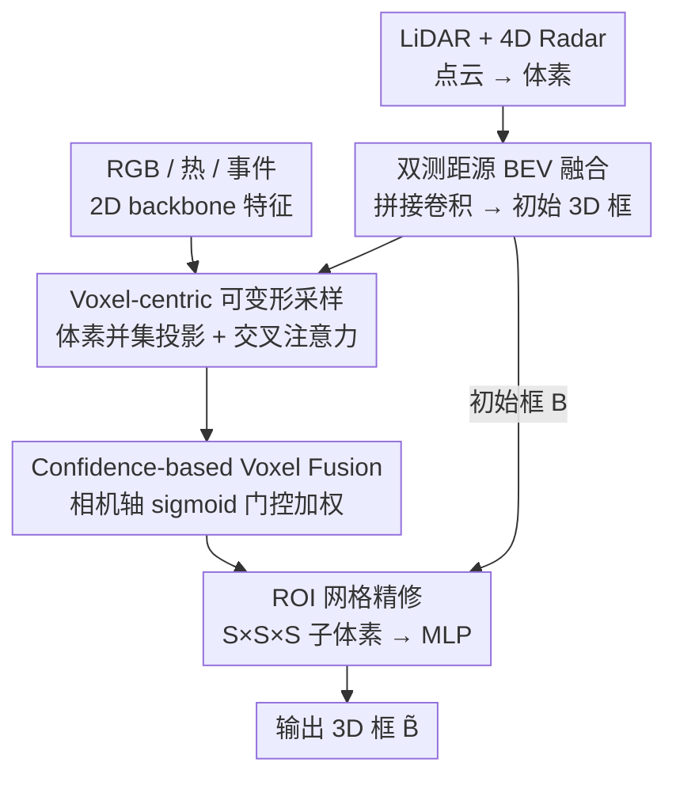

# DSERT-RoLL: Robust Multi-Modal Perception for Diverse Driving Conditions with Stereo Event-RGB-Thermal Cameras, 4D Radar, and Dual-LiDAR

**会议**: CVPR 2026  
**论文**: [CVF Open Access](https://openaccess.thecvf.com/content/CVPR2026/html/Cho_DSERT-RoLL_Robust_Multi-Modal_Perception_for_Diverse_Driving_Conditions_with_Stereo_CVPR_2026_paper.html)  
**代码**: 项目页 https://jeongyh98.github.io/dsert-roll （暂未见公开代码仓库）  
**领域**: 自动驾驶感知 / 3D目标检测  
**关键词**: 多模态融合, 3D目标检测, 4D雷达, 事件相机, 鲁棒感知

## 一句话总结
本文发布了同时采集双目事件-RGB-热成像相机、4D 雷达与双 LiDAR、覆盖雨雪雾/夜间/HDR 等极端工况的驾驶数据集 DSERT-RoLL，并配套提出一个「先用测距传感器出初始框、再用三路相机特征以体素为中心做可变形采样补充语义、最后按相机置信度门控融合」的多模态 3D 检测框架，在全部天气/光照条件下取得最高 AP。

## 研究背景与动机

**领域现状**：自动驾驶 3D 感知早已从单模态走向多模态，「RGB 相机 + LiDAR」是事实标准——相机给语义、LiDAR 给几何，互补提鲁棒。

**现有痛点**：RGB 对光照敏感，低光/HDR 下退化；LiDAR 不受光照影响但在雨雪雾里测距缩短、点云变噪。为补这两个短板，近年涌现了一批新兴传感器：热成像（夜间红外）、事件相机（高动态范围+高速运动+低延迟）、4D 雷达（恶劣天气下靠多普勒稳定测距）。但**现有 benchmark 几乎都是「单一新传感器 + 传统 RGB/LiDAR」的对照**，缺少把这些新老传感器放在同一场景同一时刻统一标注、能直接横向比较、也能系统研究其融合的数据集。

**核心矛盾**：没有公平的同环境多传感器数据，就无法回答「在某种工况下到底哪个传感器/哪种融合组合最该信」，新传感器的融合研究因此长期停留在零散对照。

**本文目标**：① 造一个同时含 stereo Event-RGB-Thermal + 4D Radar + dual LiDAR、跨多种极端天气/光照、带 2D/3D 框 + track ID + 自车里程的统一数据集；② 给出一个能自适应融合这一堆异构传感器、在恶劣工况下也稳的 3D 检测 baseline。

**核心 idea**：以**测距传感器（LiDAR+4D Radar）先出初始框**作为几何骨架，再把 RGB/热/事件三路相机语义**以体素为中心**回灌进来精修，并用**逐相机的置信度门控**决定每路相机该信多少——让框架在不同天气/光照下自动偏向当下最可靠的模态。

## 方法详解

### 整体框架

输入是两类传感器：3D 测距传感器（LiDAR $P^L$、4D Radar $P^{4R}$，每个点带强度或多普勒速度等特征 $f\in\mathbb{R}^{C_p}$）和三路单视角相机图像（RGB $I^R$、热成像 $I^T$、事件体素 $I^E$）。点云走 3D voxel backbone 得体素特征 $F_V\in\mathbb{R}^{X\times Y\times Z\times C_V}$，图像走 2D backbone 得 $F_I\in\mathbb{R}^{H/4\times W/4\times C_I}$。

整条流水线是「几何先行、语义后补、置信度裁决」：先把 LiDAR 与 4D Radar 的体素压成 BEV、拼接卷积融合后**生成初始 3D 框**；再以非空体素为中心，把三路相机特征投影回各自像平面做**可变形交叉注意力采样**，给每个体素补上图像语义；接着按**相机轴门控**对三路相机分支加权融合，得到最终融合体素特征；最后用这套特征对初始框做 ROI 网格精修，输出 3D 框。

### 关键设计

**1. 双 3D 测距源的 BEV 融合与初始框生成：先给检测一个不挑光照的几何骨架**

痛点是相机在极端光照下不可靠，所以框架不让相机主导初始定位，而是把**对光照天然鲁棒**的两个测距源当作几何基座。具体把 LiDAR 与 4D Radar 的体素特征 $F^L_V, F^{4R}_V$ 沿竖直轴塌缩、用 2D 卷积投到地平面得到 BEV 特征 $F^L_{BEV}, F^{4R}_{BEV}\in\mathbb{R}^{\frac{X}{s}\times\frac{Y}{s}\times C_B}$，再沿通道拼接、过一层卷积融合，得到跨模态增强的 BEV 表示，并由检测头产出固定数量 $n$ 的初始框集合 $B=\{b_1,\dots,b_n\}$。这一步刻意做得「简单但有效」——LiDAR 给长距精确几何、4D Radar 在雪雾里靠多普勒补稳，两者拼接卷积既保留各自几何线索又省算力，为后续语义精修提供可靠候选。

**2. Voxel-centric 可变形采样：以体素为查询把三路相机语义灌进 3D 空间**

要把图像语义融进 3D，常规做法是按视锥把像素抬到 3D，容易在深度上糊开。本文反过来——**以非空体素为中心**主动去图像里采样。先取 LiDAR 与 4D Radar 的非空体素索引求并集 $\Omega=\Omega^L\cup\Omega^{4R}$，对每个体素 $V_j$ 按式 (2) 定义融合特征：只有一个模态命中就原样保留该特征，两个模态都命中就把 $[f^L_{V_j}\,|\,f^{4R}_{V_j}]$ 通道拼接后用逐尺度线性投影 $P$ 压回 $C_V$ 维，既保维度又实现跨模态融合。随后把体素 $V_j$ 用各模态投影矩阵 $M^R,M^T,M^E$（内外参之积）投到 RGB/热/事件像平面得 $u^m_j=M^m\cdot V_j$，并在投影点邻域做**带可学习偏移的可变形采样**：

$$\hat f^m_j=\sum_{q=1}^{Q} w_q\cdot F^m_I(u^m_j+\Delta u^{m,q}_j)$$

其中偏移 $\Delta u^{m,q}_j$ 与权重 $w_q$ 都由体素特征 $f_{V_j}$ 预测。最后把体素特征当 query、聚合到的图像特征当 key/value，做可变形交叉注意力 $\hat f^m_{V_j}=\mathrm{Attn}(Q=f_{V_j},K=\hat f^m_j,V=\hat f^m_j)$。这样每个 3D 体素都按自己的几何位置「按需取景」三路相机的语义，而不是被动接受像素抬升带来的深度歧义。

**3. Confidence-based Voxel Fusion：按相机轴门控决定每路相机该信多少**

三路相机各有失效场景（RGB 怕暗、热成像怕白天纹理弱、事件怕静止），简单等权拼接会被失效模态拖累。本文把三路 image-enhanced 体素特征拼成 $\hat F^{cam}_V=[\hat F^R_V\,|\,\hat F^T_V\,|\,\hat F^E_V]\in\mathbb{R}^{N_V\times(KC_V)}$（$K=3$），视作 $\mathbb{R}^{N_V\times K\times C_V}$ 张量，用全局摘要算出**逐相机的标量门控**：

$$w=\sigma\!\left(\frac{1}{N_VC_V}\sum_{i=1}^{N_V}\sum_{c=1}^{C_V}\hat F^{cam}_V(i,:,c)\right)\in[0,1]^{1\times K\times 1}$$

再对每路相机分支按门控加权 $\bar F^{cam}_V=w\odot\hat F^{cam}_V$，最后把加权后的图像增强体素特征与原始体素特征拼接、过 FFN 降维得到最终融合特征 $\tilde F_V\in\mathbb{R}^{N_V\times C_V}$。门控用整路相机特征的全局均值经 sigmoid 得到，相当于让网络对每个 batch/场景**自适应调高当前可靠相机、调低失效相机**的贡献——这正是后面消融里「全模态在各种极端工况都最稳」的来源。

> 框架里的 **ROI 网格精修** 属于通用后处理（沿用 [27,44]）：把每个初始框 $b_i$ 切成 $S\times S\times S$ 子体素，对融合特征 $\tilde F_V$ 与原始体素特征做 ROI pooling 得 $\tilde F^i_V\in\mathbb{R}^{S^3\times C_V}$，再过 MLP 回归出精修框 $\tilde B$（实现里 $S=6$）。它不是本文的核心创新，故不单列设计点。

### 损失函数 / 训练策略
端到端训练，总损失为 RPN 损失、置信度预测损失、框回归损失三项之和：$L=L_{RPN}+\lambda_1 L_{conf}+\lambda_2 L_{reg}$，其中 $\lambda_1=\lambda_2=1$。相机-3D 融合模块采样点 $K=4$，精修网格 $S=6$；评测沿前向相机视场把点云限制在 X 轴 $[0,70]$ m，用 Waymo 官方指标报 IoU 阈值 0.5 的 AP，主表聚焦车辆类。4×NVIDIA Quadro RTX 8000 训练。

## 实验关键数据

> 数据集用 Waymo 风格的 **AP@IoU0.5（车辆类）**，按 10 种天气/光照工况分别报告，没有 nuScenes 的 NDS 指标。下表只摘取代表性工况。

### 主实验：3D 检测跨方法对比（Table 4，AP@0.5，节选工况）

| 方法（模态） | Clear | Fog | Heavy Rain | Heavy Snow | Low Light | HDR |
|---|---|---|---|---|---|---|
| DSGN（Stereo R） | 31.08 | 43.66 | 25.94 | 0.01 | 25.68 | 40.69 |
| VoxelNeXt（L） | 86.06 | 59.51 | 82.86 | 54.75 | 88.76 | 80.93 |
| VoxelNeXt（4R） | 25.03 | 44.03 | 37.42 | 32.79 | 24.02 | 35.03 |
| LoGoNet（R+L） | 87.18 | 64.96 | 79.74 | 66.20 | 90.56 | 82.78 |
| InterFusion（4R+L） | 84.52 | 66.94 | 74.13 | 64.82 | 87.49 | 79.95 |
| SAMFusion（R+T+4R+L） | 87.03 | 65.13 | 79.81 | 70.59 | 89.93 | 82.50 |
| **本文 Ours（R+E+T+4R+L）** | **90.30** | **71.42** | **85.59** | **72.94** | **92.65** | **86.33** |

本文在所有列出的工况上都拿到最高 AP：纯 stereo（无显式深度）和纯 4D Radar 信息太少普遍偏弱；LiDAR 凭几何精度整体强但在雾/雪里掉点；多模态方法靠相机补语义、4D Radar 补天气鲁棒性来弥补，而本文自适应融合全部传感器，跨天气/光照都稳。

### 消融实验：逐模态增量（Table 3，AP@0.5，节选工况）

| 模态组合 | Clear | Fog | Heavy Snow | Low Light | HDR |
|---|---|---|---|---|---|
| L | 82.90 | 65.67 | 54.14 | 86.10 | 74.51 |
| R+L | 84.67 | 66.14 | 59.43 | 87.41 | 79.31 |
| 4R+L | 88.26 | 67.41 | 69.96 | 88.73 | 82.98 |
| R+4R+L | 88.35 | 67.38 | 70.26 | 91.04 | 83.93 |
| R+E+4R+L | 88.70 | 71.45 | 71.64 | 91.43 | 86.55 |
| R+T+4R+L | 89.48 | 71.00 | 71.32 | 92.20 | 85.66 |
| **R+E+T+4R+L（全模态）** | **90.30** | 71.42 | **72.94** | **92.65** | 86.33 |

### 关键发现
- **4D Radar 是恶劣天气的关键拼图**：在 LiDAR 基础上加 4D Radar（L→4R+L），Heavy Snow 从 54.14 跳到 69.96（+15.8），印证多普勒测距在雪里比 LiDAR 更稳。
- **RGB 在极端工况收益有限**：R+L 相对 L 在 Heavy Snow 只从 54.14 到 59.43，作者也明说 RGB 提升主要在中等条件、极端光照下贡献小。
- **事件/热成像负责补极端光照与高动态**：加入 E、T 后 Fog（67→71+）、Low Light、HDR 普遍再提一档；全模态在 Clear / Heavy Snow / Low Light 上拿到最高，验证置信度门控能让框架自适应偏向当下可靠模态。
- ⚠️ 个别列（如 Fog 71.45 vs 全模态 71.42、HDR 86.55 vs 86.33）子集略高于全模态，说明门控并非在每个单一工况都严格最优，但全模态的整体均衡性最好。

## 亮点与洞察
- **「几何先行、语义后补」的分工很干净**：用不挑光照的测距源出初始框，再让相机以体素为中心按需取景，规避了像素抬升的深度歧义——这种 voxel-as-query 的可变形采样思路可迁移到任何「稀疏 3D + 多路图像」的融合任务。
- **逐相机置信度门控用一个全局均值 + sigmoid 就实现了模态自适应**，几乎零额外开销却直接撑起恶劣工况的鲁棒性，是很轻量的可复用 trick。
- **数据集本身是最大贡献**：第一次把 event/thermal/RGB stereo + 4D Radar + dual LiDAR 在同场景同时刻统一标注，让「同环境下哪个传感器更该信」第一次能被公平量化。

## 局限与展望
- 评测把点云限制在前向 $[0,70]$ m、相机只用 stereo 的左目，**未利用双目深度**，stereo 的几何潜力没吃满。
- 主表只报车辆类 AP，其它类别留在补充材料，跨类别鲁棒性结论有限。
- ⚠️ 置信度门控用的是整路相机特征的**全局标量**，空间上不区分——在「画面一半过曝一半正常」的局部失效场景，逐体素/逐区域门控可能比单一标量更合适，这是值得延伸的方向。
- 融合方法被作者定位为「modality-adaptive fusion baseline」，更多是为数据集配套的强基线，而非把每个模块都打磨到极致的方法论贡献。

## 相关工作与启发
- **vs BEVFusion / DeepFusion（R+L 主流融合）**：它们把相机抬到 BEV 与 LiDAR 统一融合；本文反向以体素为 query 去图像采样，并额外纳入 4D Radar/事件/热成像，在 Heavy Snow（57.61/57.26 → 72.94）等恶劣工况优势明显。
- **vs SAMFusion（R+T+4R+L，最接近的多传感器融合）**：同样用多传感器，但本文多了事件相机且引入逐相机置信度门控，在全部列出工况上一致超过 SAMFusion（如 Fog 65.13→71.42、Clear 87.03→90.30）。
- **vs InterFusion / HGSFusion（含 4D Radar 的融合）**：它们聚焦 Radar+LiDAR 或 Radar+RGB 的成对融合；本文把测距与三路相机统一进同一稀疏体素空间，覆盖的模态种类更全。

## 评分
- 新颖性: ⭐⭐⭐⭐⭐ 首个同场景统一标注 Event-RGB-Thermal+4D Radar+dual LiDAR 的数据集，配 voxel-centric 采样 + 置信度门控融合
- 实验充分度: ⭐⭐⭐⭐⭐ 跨 10 种天气/光照、三大类方法、逐模态消融，对比充分
- 写作质量: ⭐⭐⭐⭐ 方法与公式清晰，但门控的空间无关性等设计取舍讨论略少
- 价值: ⭐⭐⭐⭐⭐ 为新兴传感器融合研究提供稀缺的公平 benchmark 与强基线

<!-- RELATED:START -->

## 相关论文

- [\[CVPR 2026\] Hybrid Robust Collaborative Perception with LiDAR-4D Radar Fusion under Adverse Weather Conditions](hybrid_robust_collaborative_perception_with_lidar-4d_radar_fusion_under_adverse_.md)
- [\[CVPR 2026\] RPGFusion: 4D Radar Prior-Guided Multi-Modal Fusion for 3D Detection](rpgfusion_4d_radar_prior-guided_multi-modal_fusion_for_3d_detection.md)
- [\[CVPR 2026\] EventDrive: Event Cameras for Vision-Language Driving Intelligence](eventdrive_event_cameras_for_vision-language_driving_intelligence.md)
- [\[CVPR 2026\] LiREC-Net: A Target-Free and Learning-Based Network for LiDAR, RGB, and Event Calibration](lirec-net_a_target-free_and_learning-based_network_for_lidar_rgb_and_event_calib.md)
- [\[ICCV 2025\] Unleashing the Temporal Potential of Stereo Event Cameras for Continuous-Time 3D Perception](../../ICCV2025/autonomous_driving/unleashing_the_temporal_potential_of_stereo_event_cameras_for_continuous-time_3d.md)

<!-- RELATED:END -->
