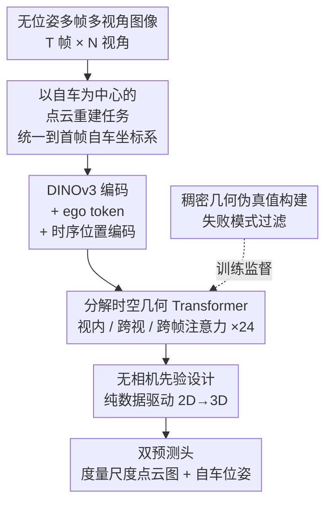

# DVGT: Driving Visual Geometry Transformer

**会议**: CVPR 2026  
**论文**: [CVF Open Access](https://openaccess.thecvf.com/content/CVPR2026/html/Zuo_DVGT_Driving_Visual_Geometry_Transformer_CVPR_2026_paper.html)  
**代码**: https://github.com/wzzheng/DVGT  
**领域**: 3D视觉 / 自动驾驶  
**关键词**: 视觉几何, 稠密点云重建, 自驾感知, 时空注意力, 自车位姿  

## 一句话总结
DVGT 是一个面向自动驾驶的视觉几何 Transformer，输入一段无位姿的多帧多视角图像，端到端直接预测以首帧自车坐标系为基准的**度量尺度**全局稠密 3D 点云图与每帧自车位姿，无需相机内外参、无需事后用 LiDAR 对齐尺度，在五个驾驶数据集上同时超越通用几何模型（VGGT、CUT3R、MapAnything）和驾驶专用模型（Driv3R）。

## 研究背景与动机
**领域现状**：视觉中心的自动驾驶要从相机图像里恢复 3D 场景几何。主流做法要么做单帧深度估计（输出 2.5D，拼不成完整场景），要么做 3D occupancy 预测（把空间体素化）。后者依赖精确的相机内外参做显式的 2D→3D 投影，再用真值位姿做时序融合，才能得到全局几何。

**现有痛点**：这条技术路线有两个硬伤。其一，体素化引入量化误差（典型 0.5m 量级），表达不了精细几何。其二，显式投影把模型结构和具体的传感器配置（相机数量、焦距、外参）死死绑在一起——换一辆车、换一套相机布局就要重训，没法在不同车型/场景间扩展。而近期的通用视觉几何模型（DUSt3R、VGGT 等）虽然重建能力强，但它们预测的是**相对尺度**点云，必须事后用 LiDAR 点云对齐才能拿到度量尺度，且对多帧多视角"一视同仁"地逐图估几何，没利用驾驶场景特有的时空结构。

**核心矛盾**：既要"摆脱相机先验、能跨配置泛化"，又要"直接输出度量尺度、不靠外部传感器对齐"——而显式几何投影的范式天生做不到前者，通用几何模型天生做不到后者。

**本文目标**：造一个驾驶专用的稠密视觉几何模型，要同时满足：(1) 不吃任何相机参数 / 几何投影先验，能适配任意相机配置；(2) 直接吐出度量尺度的全局稠密点云图 + 自车位姿，端到端、单次前向、零后处理。

**切入角度**：作者注意到驾驶相机是**固定环视**安装的，所以不必像通用方法那样为每张图估一个相机位姿——可以把整个场景几何统一表达在"首帧自车坐标系"里，再为每帧只估一个自车位姿。这一步把几何表示和相机参数解耦，自然获得跨配置的灵活性。

**核心 idea**：用"以自车为中心的点云重建"重新定义任务，配一个分解时空注意力的几何 Transformer，纯数据驱动地从 2D 特征直接学出度量尺度 3D 几何，彻底丢掉相机先验和事后对齐。

## 方法详解

### 整体框架
DVGT 接收 $T$ 帧、每帧 $N$ 个视角的图像序列 $I=\{I_{t,n}\}$，端到端输出两样东西：以首帧自车坐标系表达的全局稠密点云图 $P=\{\hat P_{t,n}\}$（每个像素一个度量尺度的 $(x,y,z)$）和每帧到首帧的自车位姿序列 $T_{ego}=\{\hat T_t\}$。整体映射写作 $(P, T_{ego}) = M(I)$。

管线分三段：图像编码器 $E$ 用预训练视觉基座（DINOv3）把每张图编码成 token，并为每张图拼一个可学习的 **ego token** 用于位姿预测，再叠加帧级时序位置编码；几何 Transformer $F$ 由 24 个级联块组成，每块顺序跑"视内局部注意力 → 跨视空间注意力 → 跨帧时序注意力"三种分解注意力来推断跨图几何关系；最后预测头 $H$ 把精炼后的图像 token 解码成点云图、把聚合后的 ego token 解码成自车位姿。整个过程没有任何空间归纳偏置（无 2D→3D 投影模块），所以能灵活适配不同相机布局。

### 关键设计

**1. 以自车为中心的度量点云重建：把几何表示从相机参数里解耦出来**

通用几何模型把点云重建在某个参考相机坐标系里，输出就和该相机的内外参绑死，换传感器就失效。DVGT 改成把所有点统一表达在**参考帧（首帧）的自车坐标系**里：$\hat P_{t,n}\in\mathbb{R}^{H\times W\times3}$ 的每个点都在同一个自车坐标系下，且为每帧只预测一个自车运动 $\hat T_t\in SE(3)$（而非为每张图预测相机位姿）。由于环视相机在车上是固定的，这个表示对相机焦距、相机位姿、视角数量都不变。这样得到的几何既是稠密连续的（消除体素量化误差，高保真）、又是像素对齐的（覆盖前景物体和背景环境，完整），还天然支持任意相机配置——这是后面所有泛化能力的根基。

**2. 分解时空几何 Transformer：把全局注意力拆成视内/跨视/跨帧三步以适配实时**

现有几何模型靠全局注意力让所有图像 token 两两交互，计算量巨大，128 张图（16 帧 × 8 视角）下 VGGT 要 ~13.7s，对实时驾驶不可行。DVGT 利用驾驶输入强烈的时空结构，把昂贵的全局注意力**因子化**成三种有针对性的注意力，在每个 Transformer 块里顺序执行：**视内局部注意力**只在单图 token 内部做、精炼局部特征；**跨视空间注意力**让同一帧不同视角的 token 互相 attend、聚合空间信息；**跨帧时序注意力**让同一视角跨帧的 token 互相 attend、捕捉静态一致性和时序动态。这种分解把"每个 query 对全部 token"压成"只对结构相关的子集"，128 图推理降到 ~4.0s，同时保住时空信息融合。代价是相比全局注意力略有精度损失，作者用时序位置编码（见下）来补。

**3. 双预测头 + 无相机先验设计：度量点云与自车位姿联合端到端输出**

几何 Transformer 输出精炼后的图像 token $F'_{t,n}$ 和 ego token $E'_{t,n}$。点云头 $H_{point}$ 把图像 token 解码成度量点云 $\hat P_{t,n}=H_{point}(F'_{t,n})$；位姿则先把同一帧内所有视角的 ego token 求和聚合成全局表示 $\bar E_t=\sum_{n=1}^{N}E'_{t,n}$，再喂给位姿头 $H_{pose}$ 回归 $\hat T_t=H_{pose}(\bar E_t)$。整套结构在原理上独立于相机参数和 2D→3D 几何投影，几何完全从 2D 图像特征里**数据驱动地学出来**，这正是它对不同相机配置和驾驶场景鲁棒的来源；同时点云直接出度量尺度，下游可直接用，不需要事后和 LiDAR 对齐。

**4. 稠密几何伪真值构建：用失败模式分析 + 阈值过滤造出可训练的稠密标签**

驾驶场景没有稠密几何真值，把单目深度（MoGe-2）和投影的稀疏 LiDAR 深度（用 ROE 算法）对齐能造伪标签，但常常不可靠：通用深度模型在复杂驾驶场景泛化差，且稀疏 LiDAR 点空间分布极不均匀、容易让对齐优化病态。作者先做了严谨的失败模式分析，归纳出五类典型失败：(a) 语义误判（大块低纹理面如卡车厢被当成天空）、(b) 光度不稳定（曝光问题导致深度随机）、(c) 结构歧义（广告牌等平面被误判有深度起伏）、(d) 运动伪影（高速运动/抖动致模糊）、(e) 对齐病态（LiDAR 点太稀/太集中使尺度漂移参数估计失准）。然后用三组指标做阈值过滤：**有效点重叠率**（LiDAR 有效点中被深度模型也判为有效的比例，剔 a/b）、**标准深度指标**（用 Abs Rel 和 $\delta<1.25$ 剔 c/d）、**对齐质量指标**（剔投影点不足/空间方差过低的图，并约束输出尺度与平移参数，治 e）。这条过滤流水线作用在 Waymo / nuScenes / OpenScene / DDAD / KITTI 五个公开数据集上，聚合出一个大规模混合域、带高保真稠密点云的训练集。

### 损失函数 / 训练策略
端到端多任务损失 $L = \lambda L_{epose} + L_{pmap}$。点云数值范围远大于位姿，故给位姿损失加权 $\lambda=5.0$ 来平衡。位姿损失对 7 维位姿表示（3 维平移 + 4 维旋转四元数）用标准 L1：$L_{epose}=\frac{1}{T}\sum_{t=1}^{T}\lVert\hat T_t - T_t\rVert_1$。点云损失沿用 VGGT 的形式：

$$L_{pmap}=\sum_{t,n}\Big(\lVert\Sigma^P_{t,n}\odot(\hat P_{t,n}-P_{t,n})\rVert_2 + \lVert\nabla\hat P_{t,n}-\nabla P_{t,n}\rVert_2 - \alpha\log\Sigma^P_{t,n}\Big)$$

其中 $\Sigma^P_{t,n}$ 是模型额外预测的逐像素不确定度图、$\odot$ 为通道广播逐元素乘、$\nabla$ 为 2D 空间梯度算子，末项 $-\alpha\log\Sigma^P_{t,n}$ 是鼓励模型自信（低不确定度）的正则，取 $\alpha=2.0$。

## 实验关键数据

### 主实验
五个驾驶数据集上的 3D 点云重建（Acc/Comp 越低越好，单位米；推理时间在 128 图上测）。带 * 的方法需用 Umeyama 算法对齐 LiDAR 才能恢复度量尺度：

| 数据集 | 指标 | DVGT | VGGT* | Driv3R* | MapAnything |
|--------|------|------|-------|---------|-------------|
| nuScenes | Acc↓ / Comp↓ | **0.457 / 0.494** | 1.300 / 1.498 | 0.742 / 1.345 | 4.499 / 4.886 |
| OpenScene | Acc↓ / Comp↓ | **0.402 / 0.481** | 1.422 / 1.496 | 0.884 / 1.693 | 3.353 / 4.303 |
| DDAD | Acc↓ / Comp↓ | **0.751 / 1.009** | 1.741 / 2.473 | 0.950 / 1.259 | 8.015 / 8.493 |
| KITTI | Acc↓ | **0.846** | 1.154 | 0.864 | 1.880 |
| 推理时间 | 128 图 | **~4.0s** | ~13.7s | ~9.0s | ~5.8s |

光线深度（ray depth，点到自车中心距离）结果，DVGT 优势更明显：

| 数据集 | 指标 | DVGT | VGGT | Driv3R |
|--------|------|------|------|--------|
| nuScenes | Abs Rel↓ / δ<1.25↑ | **0.069 / 0.953** | 0.243 / 0.729 | 0.189 / 0.721 |
| OpenScene | Abs Rel↓ / δ<1.25↑ | **0.049 / 0.971** | 0.241 / 0.719 | 0.188 / 0.740 |
| Waymo | Abs Rel↓ / δ<1.25↑ | **0.106 / 0.921** | 0.176 / 0.811 | 0.168 / 0.770 |

与驾驶深度模型在 nuScenes 上对比（转成深度图后与 LiDAR GT 比），DVGT 不需要任何尺度后处理或真值位姿：

| 方法 | 尺度恢复方式 | Abs Rel↓ | δ<1.25↑ |
|------|------------|----------|---------|
| SelfOcc | Pose GT | 0.23 | 0.75 |
| OmniNWM | Pose GT | 0.23 | 0.81 |
| R3D3 | Extrinsic | 0.25 | 0.73 |
| **DVGT** | **None** | **0.13** | **0.86** |

### 消融实验

注意力机制消融（nuScenes，G=全局/L=视内局部/S=跨视空间/T=跨帧时序/TE=时序位置编码）：

| 配置 | Acc↓ | Abs Rel↓ | δ<1.25↑ | AUC@30↑ | 时间 |
|------|------|----------|---------|---------|------|
| L+G（含全局注意力） | 1.131 | 0.178 | 0.789 | 74.6 | ~8.2s |
| L+S+T（纯分解，无 TE） | 1.584 | 0.261 | 0.676 | 68.4 | ~4.0s |
| L+S+T+TE（完整） | 1.458 | 0.227 | 0.725 | 77.6 | ~4.0s |

坐标归一化尺度消融（nuScenes，对目标坐标线性除以 1/10/100 或用 arcsinh 非线性压缩）：

| 缩放 | Acc↓ | Abs Rel↓ | δ<1.25↑ | AUC@30↑ |
|------|------|----------|---------|---------|
| 1（base） | 1.584 | 0.261 | 0.676 | 68.4 |
| **10×（采用）** | **1.349** | **0.195** | **0.756** | 79.8 |
| 100× | 1.646 | 0.257 | 0.694 | 80.7 |
| arcsinh | 1.411 | 0.222 | 0.719 | 80.8 |

### 关键发现
- **分解注意力是"效率换精度"的核心权衡**：纯分解（L+S+T）比含全局注意力（L+G）快一倍（4.0s vs 8.2s）但掉点明显（δ 从 0.789→0.676）；加上时序位置编码后（L+S+T+TE）在不增加耗时的前提下把 δ 拉回 0.725、AUC@30 反超到 77.6，说明 TE 提供的显式时序顺序信息是补回分解损失的关键，最终在精度和速度间取得了好的平衡。
- **尺度归一化对数值稳定性很敏感**：驾驶场景动态范围极大（常超 100m），直接回归大数值坐标会让参数被推到大量级、训练不稳定。线性除 10× 最好；除 100× 把近场几何压得太小、精度退化；arcsinh 虽自适应（近场少压缩）但非线性会扭曲固有几何结构，反而次优。
- **数据采样权重决定数据集间表现差异**：DVGT 在 Waymo 上相对不强，作者归因于采样失衡——Waymo 体量是别的数据集 5× 却被赋了相同权重，且分布不像 nuScenes 那样贴近占主导的 OpenScene；优化采样权重有望补上这个差距。

## 亮点与洞察
- **"固定环视 → 自车坐标系统一表示"** 是把相机先验从模型里抽走的关键观察：正因为驾驶相机布局固定，才敢只估自车位姿、不估每图相机位姿，从而让同一套权重吃任意相机配置（5×50° / 6×70° / 8×120° 等都能跑），这个"利用部署约束反过来简化建模"的思路很值得迁移。
- **直接出度量尺度、零后处理** 是和通用几何模型最本质的区别：VGGT/CUT3R 必须事后用 LiDAR 对齐尺度，DVGT 单次前向就给度量结果（OpenScene 上 Comp 0.481 vs MapAnything 4.303），下游可即插即用。
- **失败模式驱动的伪标签过滤** 把"造训练数据"做成了系统工程：先穷举五类失败原因，再针对性设计三组过滤指标，而不是拍脑袋设阈值——这套方法论对任何需要从弱标注造稠密监督的任务都通用。

## 局限与展望
- 作者承认 Waymo 表现受限于数据采样权重未调优，是个待优化点而非方法缺陷。
- KITTI 上自车位姿预测略低，作者归因于 KITTI 是高重叠双目设置，相比环视少了对完整 3D 和自车运动的约束——也就是说方法在**非环视、少视角**配置下优势会缩水。
- ⚠️ 训练伪真值依赖单目深度模型（MoGe-2）和 LiDAR 对齐的质量，过滤流水线虽能剔掉大部分坏样本，但伪标签本身的系统偏差（如远场深度）仍可能上限模型精度，论文未量化这一影响。
- 分解注意力相比全局注意力存在精度上界（L+G 的 Acc 1.131 仍优于完整模型的 1.458），TE 只是缩小而非消除差距；如何在保持 4.0s 速度下进一步逼近全局注意力精度是开放问题。

## 相关工作与启发
- **vs VGGT / CUT3R（通用视觉几何模型）**：它们用全局注意力逐图估几何、输出相对尺度需 LiDAR 后对齐；DVGT 用分解时空注意力、以自车为中心直接出度量尺度，更快（4.0s vs 13.7s）也更准，且专门利用了驾驶的时空结构。
- **vs Driv3R（驾驶专用几何模型）**：同为驾驶定制，DVGT 在多数数据集 Acc/深度指标上领先（如 nuScenes Abs Rel 0.069 vs 0.189）且推理更快（4.0s vs 9.0s）。
- **vs TPVFormer / occupancy 类方法**：它们靠显式 2D→3D 投影 + 体素化，受量化误差（~0.5m）和相机先验束缚；DVGT 预测连续稠密点云、无投影模块，几何更精细且能跨配置泛化。
- **vs SelfOcc / OmniNWM 等驾驶深度模型**：这些方法依赖真值位姿或中值缩放恢复尺度，DVGT 完全无需位姿和后对齐，在 nuScenes 上仍取得最好的 Abs Rel 0.13 / δ<1.25 0.86。

## 评分
- 新颖性: ⭐⭐⭐⭐⭐ 以自车为中心 + 无相机先验 + 直接度量尺度的组合，把驾驶几何感知范式做了实质性重构。
- 实验充分度: ⭐⭐⭐⭐⭐ 五数据集、三任务（点云/深度/位姿）全面对比，注意力与尺度归一化消融到位。
- 写作质量: ⭐⭐⭐⭐ 方法叙述清晰、图示直观；失败模式分析尤其扎实，个别符号细节需对照公式。
- 价值: ⭐⭐⭐⭐⭐ 直接出度量尺度、跨相机配置泛化、实时可行，对自驾感知落地价值高，且已开源。

<!-- RELATED:START -->

## 相关论文

- [\[CVPR 2026\] Generalizing Visual Geometry Priors to Sparse Gaussian Occupancy Prediction](generalizing_visual_geometry_priors_to_sparse_gaussian_occupancy_prediction.md)
- [\[CVPR 2026\] Efficient Equivariant Transformer for Self-Driving Agent Modeling](efficient_equivariant_transformer_for_self-driving_agent_modeling.md)
- [\[CVPR 2026\] HybridDriveVLA: Vision-Language-Action Model with Visual CoT reasoning and ToT Evaluation for Autonomous Driving](hybriddrivevla_vision-language-action_model_with_visual_cot_reasoning.md)
- [\[CVPR 2026\] GSV2X: Geometry-Aware Uncertainty Modeling and Orthogonal Fusion for Robust Roadside Perception](gsv2x_geometry-aware_uncertainty_modeling_and_orthogonal_fusion_for_robust_roads.md)
- [\[CVPR 2026\] StreamVLO: Streaming Visual-LiDAR Odometry with Cumulative Drift Compensation](streamvlo_streaming_visual-lidar_odometry_with_cumulative_drift_compensation.md)

<!-- RELATED:END -->
