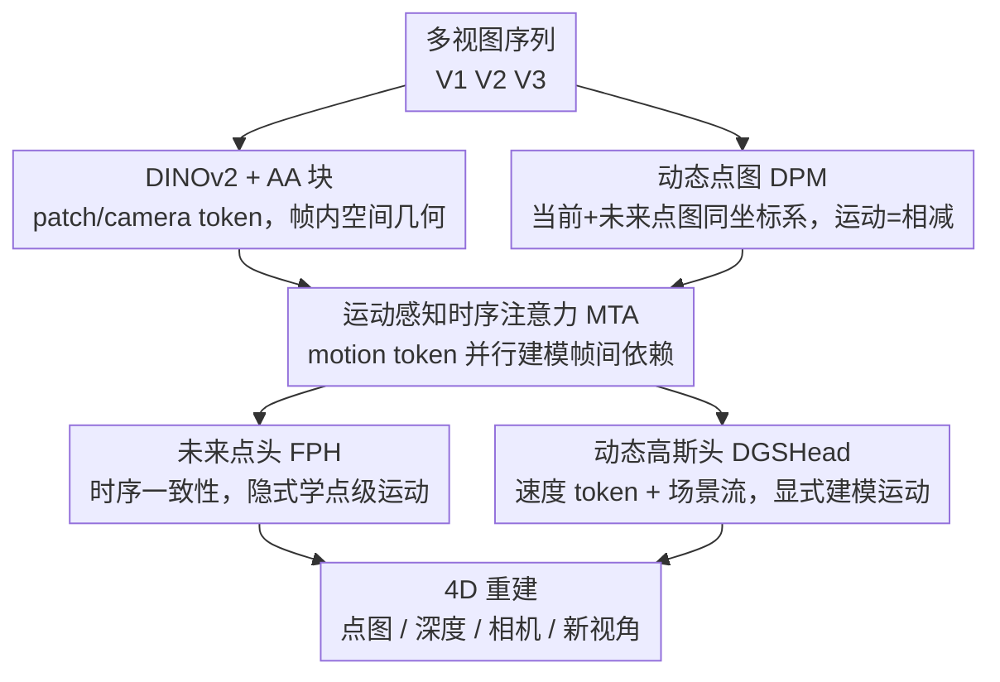

# DynamicVGGT: Learning Dynamic Point Maps for 4D Scene Reconstruction in Autonomous Driving

**会议**: CVPR 2026  
**论文**: [CVF Open Access](https://openaccess.thecvf.com/content/CVPR2026/html/He_DynamicVGGT_Learning_Dynamic_Point_Maps_for_4D_Scene_Reconstruction_in_CVPR_2026_paper.html)  
**代码**: 无  
**领域**: 3D视觉 / 自动驾驶  
**关键词**: 4D场景重建, 动态点图, 前馈3D基础模型, 时序注意力, 动态高斯泼溅  

## 一句话总结
DynamicVGGT 把静态前馈 3D 模型 VGGT 扩展到动态 4D 重建：用「动态点图」把当前帧和未来帧点云预测在同一个学习坐标系里，配上一个并行的运动感知时序注意力分支和一个带速度监督的动态 3D 高斯头，在无相机参数、无稠密标注的纯图像输入下，于 Waymo / KITTI 上重建出时序一致的动态驾驶场景。

## 研究背景与动机
**领域现状**：DUSt3R、VGGT 这类前馈 3D 重建模型可以直接从多视图图像端到端回归出深度、相机位姿、稠密点图，不再依赖传统多视图几何那套优化匹配，给下游任务提供了强 3D 先验。VGGT 进一步用空间-时序交替注意力（Alternating Attention, AA）在一个共享模型里联合预测多种几何量，是当前静态重建的代表。

**现有痛点**：这些模型都建立在「时间不变」假设上，本质是静态重建。一旦搬到自动驾驶场景就崩——驾驶环境天然动态，有大量运动车辆、长程时序依赖、光照变化；而且驾驶数据大尺度、高噪声、深度稀疏（LiDAR 点云稀疏），直接拿来训练会把模型原本的稠密预测能力打坏。少数开始做动态建模的工作（MoVieS、StreamVGGT）输出仍是静态点图为主，缺一个能直接支撑下游驾驶任务的统一动态表示，且主要面向室内。

**核心矛盾**：前馈模型在静态数据上几何精度高，但扩到动态条件下时几何精度和时序一致性两头都难保。StreamVGGT 用串行堆叠 AA 块加时序注意力，会破坏 VGGT 原有的空间注意力先验，早期训练不稳、性能退化。

**本文目标**：要一个统一的前馈框架，能在不依赖相机外参对齐、不依赖稠密标注的前提下，同时建模几何与运动，输出时序一致的动态 4D 重建。

**切入角度**：与其像以前的动态点图那样把所有帧显式对齐到一个参考帧（需要外部给定帧到参考的变换），不如让模型在 VGGT 学到的「规范坐标系」里**同时预测当前帧和未来帧的点图**，让运动通过两张点图相减隐式涌现出来。

**核心 idea**：把「动态点图（Dynamic Point Map, DPM）」当作时序建模的统一几何表示，再围绕它设计两个互补任务——隐式学运动的未来点预测、显式监督运动的动态高斯头。

## 方法详解

### 整体框架
DynamicVGGT 建立在 VGGT 之上。输入是多视图图像序列 $\{V_1, V_2, V_3\}$，先用冻结的 DINOv2 抽取每个视图的 patch token 和 camera token，同时初始化一组可学习的 motion token 编码时序先验。Patch/camera token 走 VGGT 原有的 AA 块建模**帧内空间几何**；与之**并行**的运动感知时序注意力（MTA）块用 motion token 建模**帧间时序依赖**。MTA 输出的时序增强特征 $TA_{v,t}$ 同时喂给三类头：保留下来的相机/深度/点图头、负责隐式运动的未来点头（FPH）、负责显式运动的动态 3D 高斯头（DGSHead）。整套流程一次前向完成，不需要逐场景优化。

关键在于「DPM 任务建模」：给一段多视图 clip，模型直接预测 $\hat{P}_{v,t}, \hat{P}_{v,t+\delta} = f_\theta(\{I_{v,t}\})$，于是运动可以隐式表示为 $\Delta\hat{P}_{v,t} = \hat{P}_{v,t+\delta} - \hat{P}_{v,t}$。这避免了以前 DPM 公式 $P^{(\mathrm{ref})}_{v,t} = \mathcal{T}_{(v,t)\to\mathrm{ref}}(\cdot)$ 那种依赖外部指定参考帧变换的做法，又保住了 VGGT 主干的几何先验。

### 关键设计

**1. 动态点图（DPM）：把运动建在统一坐标系里，靠相减而非外部对齐**

针对「以前动态点图要把每帧显式对齐到参考帧、依赖外部给定变换」这个痛点，本文换了个表述：不显式对齐，而是让模型在 VGGT 的学习规范坐标系里**联合预测**同一相机流的当前帧 $\hat{P}_{v,t}$ 和未来帧 $\hat{P}_{v,t+\delta}$（公式 4），运动直接由 $\Delta\hat{P}_{v,t} = \hat{P}_{v,t+\delta} - \hat{P}_{v,t}$ 得到。时序建模定义在同相机流的帧对 $(v,t)$ 与 $(v,t+\delta)$ 上，$\delta$ 在训练时从 1~3 随机采样。这样做的好处是：既不用提供帧到参考的外参变换（驾驶场景里这恰恰是难拿到的），又把「几何先验」和「运动」统一在一张点图表示上，成为后面两个动态任务（FPH / DGSHead）共同的基底。

**2. 运动感知时序注意力（MTA）：并行旁路 + motion token，不动 VGGT 空间注意力**

针对 StreamVGGT「串行堆叠 AA 块导致早期训练不稳、破坏空间先验」的问题，MTA 不去改 AA 主干，而是开一条**并行**分支专门做时序。它引入可学习的 motion token，和 AA 分支来的空间 patch token 拼接成 MTA 输入：第一层是 $\mathrm{Concat}(M^{(l)}_{v,t}, F^{p(l)}_{v,t})$，后续层叠加上一层特征 $\mathrm{Concat}(M^{(l)}_{v,t}, F^{p(l)}_{v,t}+F^{p(l-1)}_{v,t})$（公式 5），让低层运动线索能往上传。时序注意力对每个 patch 位置、每个视图**独立**沿时间维 $\tau$ 计算：

$$A^{(l)}_{t,t'} = \mathrm{Softmax}\!\left(\frac{Q^{(l)}_t (K^{(l)}_{t'})^\top}{\sqrt{d}} + B^{\mathrm{time}}_{t,t'}\right), \quad \tilde{F}^{(l)}_{m,v,t} = \sum_{t'=1}^{\tau} A^{(l)}_{t,t'} V^{(l)}_{t'}$$

其中 $B^{\mathrm{time}}_{t,t'}$ 是用旋转位置编码实现的时序位置偏置。再经 LayerNorm + MLP + 残差，最后一层输出记为 $TA_{v,t}=F^{(L)}_{m,v,t}$（用了 $L=12$ 层）。因为是并行旁路而不是替换 AA，motion token 引导注意力聚焦运动一致区域的同时，VGGT 的几何先验和训练稳定性都被保住——这是它相对串行堆叠的核心区别。

**3. 未来点头（FPH）：用帧间点一致性做隐式运动监督**

光靠点级位移还不够准，FPH 用一个 DPT 头从当前时刻的时序增强特征预测未来帧点图 $\hat{P}^{\mathrm{fut}}_{v,t+\delta}=\mathrm{DPT}_p(TA_{v,t})$（公式 10），以自监督方式学短时运动连续性。监督信号是时序一致性正则：

$$\mathcal{L}_{\mathrm{temp}} = \frac{1}{|\mathcal{N}|}\sum_{i\in\mathcal{N}} \left\| (\mathbf{p}^{(i)}_{v,t+\delta}-\mathbf{p}^{(i)}_{v,t}) - (\hat{\mathbf{p}}^{(i)}_{v,t+\delta}-\hat{\mathbf{p}}^{(i)}_{v,t}) \right\|_1$$

它约束的是预测位移场 $\Delta\hat{p}$ 与真值位移场 $\Delta p$ 的一致，本质上在 DPM 坐标空间里**隐式**地教网络学帧间点位移，作为一种粗粒度运动表示。这一层监督和后面高斯头的显式监督是互补的——一个管点图级的粗位移，一个管高斯空间里的精细运动。

**4. 动态 3D 高斯头（DGSHead）：速度 token + 场景流，显式建模运动**

为在基元（primitive）层面建模动态，DGSHead 把 $TA_{v,t}$ 的几何特征和图像 RGB 外观线索融合后转成随时间变化的高斯基元。作者发现冻结 AA 块会让 VGGT 主干过度偏向几何推理、弱化外观线索，损害渲染质量，于是显式融合卷积抽的外观特征：$G_{v,t}=F^{\mathrm{app}}_{v,t}+F_{g,v,t}$（公式 12-14），其中 $F^{\mathrm{app}}_{v,t}=\mathrm{Conv}(I_{v,t})$。预测的高斯深度 $D_{g,v,t}$ 配合保留的相机分支重建点图、初始化高斯中心 $\mu_i$；每个高斯被参数化为 $\{\mu_i,\sigma_i,r_i,c_i,\nu_i\}$，多了一个速度向量 $\nu_i$。关键在于：复用 MTA 里的 motion token 解码出一组速度基 $\nu_b\in\mathbb{R}^3$ 作为共享动态表示，并假设短 clip 内匀速运动 $\mu_{i,t+\delta}=\mu_{i,t}+\delta\cdot\nu_{i,t}$（公式 15），用**场景流监督** $\mathcal{L}_{\mathrm{flow}}=\mathrm{MSE}(s_{v,t},\hat{s}_{v,t})$ 让每个高斯带上物理上有意义的速度。相比 $\mathcal{L}_{\mathrm{temp}}$ 约束点图级粗位移，$\mathcal{L}_{\mathrm{flow}}$ 显式约束高斯表示里的运动，二者层级不同、互补不冗余。

### 损失函数 / 训练策略
采用两阶段「合成→真实」的课程式训练，缓解直接在真实驾驶数据上训练导致的退化。

- **Stage 1（合成数据，学几何先验 + 时序一致）**：在 Virtual KITTI、MVS-Synth 上训 10 epoch，目标 $\mathcal{L}_{\mathrm{stage1}} = \mathcal{L}_{\mathrm{cam}} + \mathcal{L}_{\mathrm{depth}} + \mathcal{L}^{(t)}_{\mathrm{point}} + \mathcal{L}^{(t+\delta)}_{\mathrm{point}} + \lambda_{\mathrm{temp}}\mathcal{L}_{\mathrm{temp}}$。相机损失用 Huber，深度/点图损失沿用 VGGT。
- **Stage 2（真实数据，开启高斯头）**：在 Waymo、Virtual KITTI 上微调 50 epoch，$\mathcal{L}_{\mathrm{stage2}} = \mathcal{L}_{\mathrm{stage1}} + \mathcal{L}_{\mathrm{3DGS}}$，其中 $\mathcal{L}_{\mathrm{3DGS}} = \mathcal{L}_{\mathrm{rgb}} + \lambda_{\mathrm{gs}}\mathcal{L}_{\mathrm{gsdepth}} + \lambda_{\mathrm{dist}}\mathcal{L}_{\mathrm{distill}} + \lambda_{\mathrm{flow}}\mathcal{L}_{\mathrm{flow}}$。
- **深度蒸馏**：真实数据上 LiDAR 点云稀疏、分布不均，直接当监督会严重掉点。于是用 Stage-1 点图分支预测的深度作教师、高斯深度分支作学生：$\mathcal{L}_{\mathrm{distill}}=\|D_{g,v,t}-\mathrm{sg}(D^{\mathrm{pm}}_{v,t})\|_1$（stop-gradient），稳住高斯优化、压住稀疏点云带来的噪声。
- 超参：$\lambda_{\mathrm{temp}}=0.01$，$\lambda_{\mathrm{gs}}=\lambda_{\mathrm{dist}}=0.1$，$\lambda_{\mathrm{flow}}=0.01$；约 1.4B 参数，其中约 800M 可训练，输入长边不超 518 像素，每 batch 18 张图。

## 实验关键数据

### 主实验：点图重建（KITTI / Waymo val）
KITTI 单目、每序列 3 连续帧；Waymo 三相机、帧步长 4，每组 9 张图。指标 Acc.↓ / Comp.↓ / NC↑。

| 数据集 | 指标 | VGGT | StreamVGGT | DynamicVGGT |
|--------|------|------|-----------|-------------|
| KITTI(Mono) | Acc.↓ | 1.489 | 1.078 | **0.901** |
| KITTI(Mono) | Comp.↓ | 0.690 | 0.495 | 0.584 |
| KITTI(Mono) | NC↑ | 0.918 | 0.899 | **0.939** |
| Waymo(3cam) | Acc.↓ | 4.635 | 4.598 | **4.021** |
| Waymo(3cam) | Comp.↓ | 2.667 | 2.626 | **2.390** |
| Waymo(3cam) | NC↑ | 0.561 | 0.564 | **0.603** |

KITTI 上 Acc. 从 VGGT 的 1.489 降到 0.901，NC 升到 0.939，全面超过 VGGT 和 StreamVGGT；Waymo 上 Acc. 4.021、NC 0.603 也是最好，验证了动态建模对大尺度驾驶场景的跨视图一致性和完整度提升。⚠️ Comp. 这一列 StreamVGGT(0.495) 略优于本文(0.584)，论文未单独解释。

### 4D 场景重建（Waymo val，PSNR↑ / SSIM↑）
| 方法 | 监督 | Dynamic PSNR | Dynamic SSIM | Full PSNR | Full SSIM |
|------|------|-------------|--------------|-----------|-----------|
| 3DGS（逐场景） | Full 标注 | 17.13 | 0.267 | 25.13 | 0.741 |
| STORM（前馈） | Camera 参数 | **21.26** | **0.535** | 25.03 | 0.750 |
| DynamicVGGT | **仅图像** | 18.07 | 0.376 | 24.07 | 0.676 |

STORM 用多相机 + 几何先验 + 相机参数拿到更高分，但 DynamicVGGT 仅靠单目图像、无相机参数、无逐场景优化，结果仍有竞争力——这是「输入约束更弱」前提下的成绩，不能直接和需要相机参数/稠密标注的方法比大小。

### 深度估计（KITTI / NYU-v2，Abs Rel↓）
| 方法 | KITTI-Mono | NYU-v2-Mono | KITTI-MVS |
|------|-----------|-------------|-----------|
| VGGT | 0.082 | **0.059** | 0.062 |
| StreamVGGT | 0.082 | 0.057 | 0.173 |
| DynamicVGGT | **0.070** | 0.064 | **0.051** |

单目 KITTI Abs Rel 0.070 最优，MVS 设定下 0.051 / 97.6% 大幅领先；NYU-v2 室内也有 94.3% 的 δ<1.25，说明从室外泛化到室内仍稳。

### 消融实验（点图估计）
| 配置 | KITTI Acc.↓ | KITTI Comp.↓ | KITTI NC↑ | Waymo Acc.↓ | Waymo NC↑ |
|------|-------------|--------------|-----------|-------------|-----------|
| Baseline (VGGT) | 1.489 | 0.690 | 0.918 | 4.635 | 0.561 |
| + MTA & FPH (stage1) | 0.927 | 0.600 | 0.915 | 4.330 | 0.561 |
| + DGSHead (stage2) | **0.901** | **0.584** | **0.939** | **4.021** | **0.603** |

### 关键发现
- **时序建模贡献最大**：仅加 MTA + FPH 就把 KITTI Acc. 从 1.489 干到 0.927（降幅最大的一步），说明动态几何主要靠并行时序注意力 + 未来点一致性撑起来。
- **DGSHead 主管「平滑/法向一致」**：再加高斯头后 Acc. 进一步到 0.901、NC 从 0.915 升到 0.939，重建更平滑完整，但相对前一步增益变小——它更多是精修而非主干。
- **深度蒸馏是真实数据上的关键护栏**：直接用稀疏 LiDAR 监督会严重掉点，用 Stage-1 深度当教师蒸馏才稳住了高斯优化（Fig.4 定性证据）。

## 亮点与洞察
- **并行旁路而非串行堆叠**：MTA 用独立分支 + motion token 做时序，绕开了 StreamVGGT 串行堆 AA 块破坏空间先验的坑——「想加新能力又不想动预训练主干」时，并行旁路是个可复用的结构 trick。
- **隐式 + 显式双层运动监督**：$\mathcal{L}_{\mathrm{temp}}$ 在点图空间约束粗位移、$\mathcal{L}_{\mathrm{flow}}$ 在高斯空间约束精细速度，两者层级互补。这种「同一物理量在不同表示层各监督一次」的思路可迁移到其他多表示重建任务。
- **motion token 一物两用**：同一组 motion token 既驱动 MTA 的时序注意力，又解码出高斯速度基 $\nu_b$，让时序特征和高斯运动共享一个动态表示，省参数也更一致。
- **弱输入也能打**：在无相机参数、无稠密标注、仅单目图像下做到与需要相机参数的 STORM 同量级，对落地（不依赖标定/外参）很有吸引力。

## 局限与展望
- **匀速假设**：高斯运动用 $\mu_{i,t+\delta}=\mu_{i,t}+\delta\cdot\nu_{i,t}$ 的短 clip 匀速近似，遇到急加减速/急转弯等非匀速运动可能不准（作者未展开讨论）。
- **4D 渲染分数仍落后**：Dynamic-only PSNR/SSIM 明显低于用相机参数的 STORM，纯图像自监督在动态区域的渲染保真度还有差距。
- **Waymo 视图重叠有限**：定性结果只能可视化前相机，多相机协同的潜力没充分体现。⚠️ Waymo 的 Acc. 绝对值（~4）与 KITTI（~0.9）量纲差异很大，论文未明确归一化口径，跨数据集别直接比绝对数。
- **重训成本**：1.4B 参数、两阶段共 60 epoch，复现门槛不低；代码未见公开。

## 相关工作与启发
- **vs VGGT**：VGGT 是静态前馈基座、时间不变假设；本文在其上加 DPM + MTA + FPH + DGSHead，把它扩到动态 4D，同时保留相机/深度/点图等副产物。点图重建全面超 VGGT。
- **vs StreamVGGT**：同样想给 VGGT 加时序，但 StreamVGGT 串行堆 AA 块、面向室内、训练不稳；本文用并行 MTA 旁路 + motion token，面向大尺度室外驾驶，KITTI/Waymo 上更优（但 KITTI Comp. 略逊）。
- **vs STORM / DrivingForward**：都是驾驶场景前馈 4D 重建，但 STORM 依赖标定多视图、DrivingForward 联合训 pose/depth/Gaussian；本文不要相机参数、不要稠密标注，靠纯图像自监督，输入约束更弱。

## 评分
- 新颖性: ⭐⭐⭐⭐ 把 DPM「同坐标系预测当前+未来点图」与并行 MTA、双层运动监督组合得自洽，但各部件多为已有思想的迁移整合。
- 实验充分度: ⭐⭐⭐⭐ 覆盖点图重建/4D 重建/深度估计/消融多任务多数据集，消融清晰；4D 渲染落后于带相机参数方法的原因分析略浅。
- 写作质量: ⭐⭐⭐⭐ 公式与图（Fig.2/3）把双任务讲清；个别指标量纲跨数据集差异未交代。
- 价值: ⭐⭐⭐⭐ 无标定、无稠密标注的前馈 4D 驾驶重建对落地很有意义，是 VGGT 系扩展到动态的有用一步。

<!-- RELATED:START -->

## 相关论文

- [\[AAAI 2026\] Understanding Dynamic Scenes in Egocentric 4D Point Clouds](../../AAAI2026/autonomous_driving/understanding_dynamic_scenes_in_ego_centric_4d_point_clouds.md)
- [\[CVPR 2026\] SGDrive: Scene-to-Goal Hierarchical World Cognition for Autonomous Driving](sgdrive_scene-to-goal_hierarchical_world_cognition_for_autonomous_driving.md)
- [\[CVPR 2026\] Unleashing VLA Potentials in Autonomous Driving via Explicit Learning from Failures](unleashing_vla_potentials_in_autonomous_driving_via_explicit_learning_from_failu.md)
- [\[CVPR 2026\] Learning Vision-Language-Action World Models for Autonomous Driving](vla_world_learning_vision_language_action_world_models_for_autonomous_driving.md)
- [\[CVPR 2026\] DrivePTS: A Progressive Learning Framework with Textual and Structural Enhancement for Driving Scene Generation](drivepts_a_progressive_learning_framework_with_textual_and_structural_enhancemen.md)

<!-- RELATED:END -->
