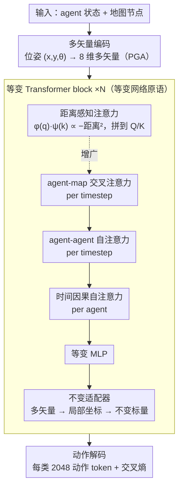

# Efficient Equivariant Transformer for Self-Driving Agent Modeling

**会议**: CVPR 2026  
**arXiv**: [2604.01466](https://arxiv.org/abs/2604.01466)  
**代码**: 无  
**领域**: Autonomous Driving  
**关键词**: SE(2)-等变性, 几何代数, Transformer, 交通模拟, 自动驾驶

## 一句话总结

提出 DriveGATr，一种基于 2D 射影几何代数（Projective Geometric Algebra）的等变 Transformer 架构，无需显式成对相对位置编码即可实现 SE(2)-等变性，在交通模拟任务中达到 SOTA 性能的同时显著降低计算成本。

## 研究背景与动机

交通场景中的 agent 行为建模是自动驾驶的重要任务。该任务具有天然的 SE(2) 对称性：对整个场景做任意 2D 旋转平移变换后，各 agent 的输出也应相应变换。

当前实现 SE(2) 等变性的主流方法是**显式成对相对位置编码 (RPE)**：为每对 agent/地图元素计算相对位姿，并嵌入到注意力机制中。这带来 $O(N^2)$ 的额外计算开销，限制了模型扩展到更大场景和 batch size，且无法使用 FlashAttention 等高效注意力核。

另一种方法是 DRoPE（2D Rotary PE），虽避免了扩展性问题，但缺乏表达力（不编码几何信息），且只有平移等变而非旋转等变。

## 方法详解

### 整体框架

交通场景里，对整个场景做任意 2D 旋转平移后，各 agent 的输出也应当跟着同步变换——DriveGATr 想让这种 SE(2) 对称性成为架构"天生"满足的性质，而不是靠数据学出来的近似。它的做法是把场景里每个元素（agent 和地图节点）都编码成 2D 射影几何代数 $\mathbb{R}^*_{2,0,1}$ 里的 8 维**多矢量 (multivector)**，再用 N 个等变 Transformer block 逐层处理。关键在于：多矢量之间的不变内积本身就能当注意力分数用，于是无需显式成对相对位置编码（RPE），可以直接套标准 dot-product attention（乃至 FlashAttention）。每个 block 内部按 agent-map 交叉注意力、agent-agent 自注意力、时间因果自注意力依次更新（前两者 per timestep、后者 per agent），再接等变 MLP 和不变适配器。

### 关键设计

**1. 多矢量编码：把位姿塞进几何代数，让 SE(2) 对称性变成构造性保证**

旧方法要靠手工设计的相对位置特征来表达对称性，既费内存又只是近似。这里换一条路：把 2D 位姿 $(x, y, \theta)$ 整体编码成 $\mathbb{R}^*_{2,0,1}$ 中的单个多矢量——用双矢量分量编码点 $(x,y)$，用矢量分量编码经过该点的方向线，速度和包围盒这类不变特征则放进辅助标量。这样一来，旋转、平移等 SE(2) 变换都可以通过几何积的"三明治积"统一实现，对称性是由数学结构构造性保证的，而不是训练出来的。

**2. 等变网络原语：每个算子都保持等变，整条前向才不会破坏对称性**

光有等变的编码还不够，网络里每一层都得是等变的，否则对称性会在中途被打破。论文为此把标准 Transformer 的每个组件都换成多矢量版本：

- **线性层**：在各 k-blade 投影分量间学习权重，保证等变性
- **几何双线性层**：利用几何积和 Join 算子增强表达力
- **激活函数**：GatedRELU，用标量分量门控整个多矢量
- **归一化**：基于不变内积的 LayerNorm
- **缩放点积注意力**：用多矢量的不变内积加上距离感知扩展特征，拼接后即可走标准 dot-product 注意力

**3. 距离感知注意力：让纯方向的不变内积也能"感知远近"**

只用多矢量的不变内积，注意力其实只看了方向相似度，对空间距离不敏感。为此对查询/键多矢量额外算一组不变特征 $\phi(q), \psi(k)$，当双矢量分量表示点时，$\phi(q) \cdot \psi(k)$ 恰好正比于两点间负距离的平方。把这组特征拼到标准 Q/K 后面，注意力就在保持等变的同时获得了距离敏感性。

**4. 不变适配器：在等变特征和不变动作之间架一座桥**

agent 最终要输出的动作是不变量，但中间的多矢量特征又携带着不可丢弃的几何信息，二者需要衔接。适配器先把全局多矢量特征变换到每个 agent 的局部坐标系（这是个不变操作），再用 MLP 映射进辅助标量，于是等变的几何信息被干净地转成不变表示，供下游动作解码使用。

### 损失函数 / 训练策略

- 使用聚类离散化动作空间（每个 agent 类别 2048 个动作 token）
- 交叉熵损失预测下一步动作
- 3M 模型使用 128 维辅助特征，30M 模型使用 512 维
- 训练 250K 步，学习率 $10^{-3}$，余弦退火

## 实验关键数据

### 主实验

| 方法 | 参数量 | RMM ↑ | Kinematic ↑ | Interactive ↑ | Map-based ↑ | minADE ↓ |
|------|--------|-------|-------------|---------------|-------------|----------|
| DriveGATr-30M | 30M | **0.7636** | 0.4890 | 0.7272 | 0.8120 | 1.3682 |
| SMART-7M | 7M | 0.7678 | 0.4894 | 0.7306 | 0.8163 | 1.3532 |
| BehaviorGPT | 3M | 0.7438 | 0.4254 | 0.7233 | 0.7976 | 1.3804 |
| Transformer+RPE | 3M | 0.7251 | 0.4708 | 0.6953 | 0.7808 | 1.7486 |
| DriveGATr-3M | 3M | 0.7620 | 0.4859 | 0.7264 | 0.8103 | 1.4192 |

### 消融实验

| 配置 | RMM ↑ | minADE ↓ | 说明 |
|------|-------|----------|------|
| IA + DA | 0.7478 | 1.5798 | 基本配置 |
| Map Attn k=4 | 0.7478 | 1.5798 | 仅注意最近 4 个地图 token |
| Map Attn k=8 | 0.7528 | 1.5293 | 注意最近 8 个 |
| Map Attn All | **0.7617** | **1.4174** | 注意全部地图 token（最佳） |

### 关键发现

1. **DriveGATr-3M 在同参数量模型中最优**：RMM 比同量级的 BehaviorGPT 高 2%，比所有非等变基线显著领先。30M 版本可匹配 SMART-7M 的真实感指标。

2. **全地图注意力至关重要**：将 agent 的地图上下文从 k=4 扩展到全部地图 token，RMM 提升 1.4 个百分点、minADE 降低 1.6。这正是 DriveGATr 相比 RPE 方法的核心优势——RPE 因内存限制只能注意少量邻域。

3. **计算效率优势显著**：随 agent 数量增长，DriveGATr 的 FLOP 增长远慢于 Transformer+RPE，因后者的 RPE 计算引入 $O(N^2)$ 额外开销。

4. **样本效率**：得益于 SE(2) 等变性作为归纳偏置，DriveGATr 在不同训练集大小（1%/10%/50%/100%）下均优于非等变方法。

5. **真正的旋转平移不变性**：在场景旋转 90° 并平移 100m 的实验中，DriveGATr 产生一致的轨迹预测，而非等变 Transformer 和仅平移等变的 DRoPE 的预测发生显著变化。

## 亮点与洞察

- 核心贡献是将 GATr（E(3)-等变）适配为 SE(2)-等变的 2D 驾驶场景版本，从 16 维降到 8 维，计算更高效。
- 设计哲学：通过数学结构（几何代数）自然地编码对称性，而非手工设计相对位置特征。这使得等变性是构造性保证的，而非近似的。
- 不变适配器是一个巧妙的设计：等变特征到不变输出的桥梁，通过变换到局部坐标系实现。
- 可以直接使用 FlashAttention 等高效注意力核，这是实际部署的重要优势。

## 局限与展望

- 仅在 2D 平面上实现 SE(2) 等变性，真实驾驶是 3D 问题（可通过辅助标量编码高度维度扩展到 2.5D）
- 仅在交通模拟任务评估，未验证运动预测和规划等相关任务
- 未探索闭环微调、top-k 采样等可能进一步提升性能的技术
- 动作空间的离散化可能限制轨迹精度

## 相关工作与启发

- GATr (NeurIPS'23) 提出了 E(3) 等变几何代数 Transformer，本文将其高效适配到 2D
- SMART 使用 RPE 实现等变性，是 WOSAC 排行榜冠军，但计算开销大
- DRoPE 将 RoPE 扩展到 2D，但只有平移等变而无旋转等变
- VN-Transformer 使用 Vector Neurons 实现 SO(3) 等变，但需牺牲真正的等变性以保证数值稳定

## 评分

- 新颖性: ⭐⭐⭐⭐⭐ （2D 几何代数编码 + 等变 Transformer 的创新组合）
- 实验充分度: ⭐⭐⭐⭐ （WOSAC 基准评估、扩展性分析、消融实验充分）
- 写作质量: ⭐⭐⭐⭐⭐ （数学推导清晰，架构描述详尽）
- 价值: ⭐⭐⭐⭐⭐ （解决了等变 agent 建模的效率瓶颈，有很强的应用前景）

<!-- RELATED:START -->

## 相关论文

- [\[CVPR 2026\] DVGT: Driving Visual Geometry Transformer](dvgt_driving_visual_geometry_transformer.md)
- [\[CVPR 2026\] F3DGS: Federated 3D Gaussian Splatting for Decentralized Multi-Agent World Modeling](f3dgs_federated_3d_gaussian_splatting_for_decentralized_multi-agent_world_modeli.md)
- [\[CVPR 2026\] Unsupervised Multi-agent and Single-agent Perception from Cooperative Views](unsupervised_multi-agent_and_single-agent_perception_from_cooperative_views.md)
- [\[ECCV 2024\] Equivariant Spatio-Temporal Self-Supervision for LiDAR Object Detection](../../ECCV2024/autonomous_driving/equivariant_spatio-temporal_self-supervision_for_lidar_object_detection.md)
- [\[CVPR 2026\] ResAD: Normalized Residual Trajectory Modeling for End-to-End Autonomous Driving](resad_normalized_residual_trajectory_modeling_for_end-to-end_autonomous_driving.md)

<!-- RELATED:END -->
