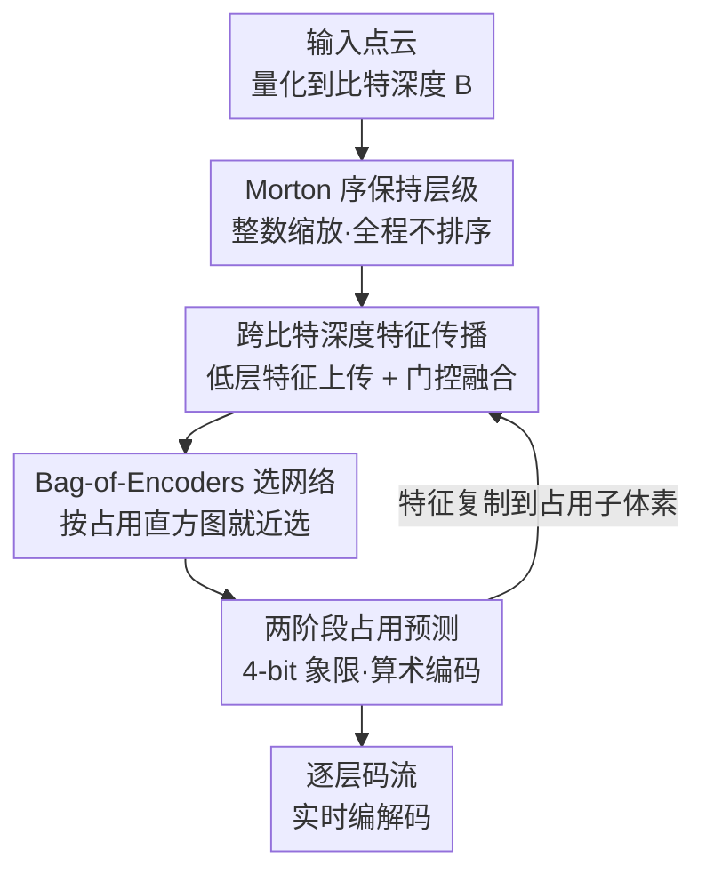

# ELiC: Efficient LiDAR Geometry Compression via Cross-Bit-depth Feature Propagation and Bag-of-Encoders

**会议**: CVPR 2026  
**arXiv**: [2511.14070](https://arxiv.org/abs/2511.14070)  
**代码**: https://github.com/moolgom/ELiCv1 (有)  
**领域**: 自动驾驶 / 点云压缩  
**关键词**: LiDAR 几何压缩, 八叉树, 稀疏卷积, 跨比特深度特征传播, 实时编解码

## 一句话总结
ELiC 在轻量级实时 LiDAR 几何压缩器 RENO 的基础上，引入「跨比特深度特征传播 + 编码器袋(Bag-of-Encoders)选择 + Morton 序保持层级」三件套，让稀疏的高比特层复用稠密低比特层的上下文特征，在 Ford / SemanticKITTI 上以 10 FPS 实时吞吐取得超越同类的压缩率。

## 研究背景与动机
**领域现状**：当前主流的稀疏张量类点云几何压缩(SparsePCGC、Unicorn、UniPCGC、RENO 等)采用「比特深度逐层独立」的设计：把点云从原始比特深度逐层粗化成八叉树结构，每一层拿当前比特深度的体素坐标作为输入，独立预测下一层 8 个子体素的占用(occupancy)概率，再用算术编码把 8-bit 占用符号编进码流。

**现有痛点**：这种「逐层独立」是核心弱点——每一层都只能依赖当前比特深度的坐标，把上一层(更稠密)早已具备的空间上下文重新从坐标里再推导一遍。对 LiDAR 尤其致命：论文 Fig.2 统计 Ford-01 序列，在 13–15 比特的高层，$2{\times}2{\times}2$ 或 $3{\times}3{\times}3$ 立方邻域内平均邻居数最多只有 1 个。而稀疏卷积的核就是 $2{\times}2{\times}2$ / $3{\times}3{\times}3$，邻域几乎是空的，感受野里没东西，模型只能从极少证据里"硬猜"空间上下文。

**核心矛盾**：LiDAR 点密度随比特深度剧烈变化——低层稠密、高层极稀疏。密度漂移改变了邻居统计、激活率和有效感受野，因此用**同一个共享网络**去吃所有层，很难在每一层都拿到最优压缩率。

**本文目标**：在不牺牲 RENO 实时性(轻量稀疏网络、可变输入比特深度)的前提下，解决两件事：(1) 高层稀疏处上下文不足；(2) 单一模型无法适配跨层密度分布差异。

**切入角度**：作者观察到稠密的低比特层里其实**藏着可复用的几何上下文**——只要把低层抽到的特征沿层级往上传播、累积，高层就算邻居稀少也能借到上下文。

**核心 idea**：用"跨层特征传播 + 按层选网络"替代"逐层独立 + 单一共享网络"，并配一套 Morton 序保持的层级消除每层排序开销，从而同时拿下压缩率和实时性。

## 方法详解

### 整体框架
ELiC 沿用 RENO 的渐进式八叉树编码骨架：给定量化到比特深度 $B$ 的点云，从 $b{=}2$ 逐层编码到 $b{=}B{-}1$。每一层对每个占用父体素，预测其 8 个子体素的占用模式(octant label $\mathbf{O}^{(b)}\in\{0,\dots,255\}$)并算术编码。沿用 RENO 的两阶段策略：把 8-bit 符号拆成下/上两个 4-bit 象限标签 $\mathbf{Q}_s^{(b)}\in\{0,\dots,15\}$($s{=}1$ 取 $\mathbf{O}\bmod 16$，$s{=}2$ 取 $\lfloor\mathbf{O}/16\rfloor$)，把符号空间从 $2^8$ 降到 $2^4$，简化概率建模。

ELiC 在这条骨架上加了三个贡献组件：先用 **Morton 序保持层级**保证全程不排序；再让 **跨比特深度特征传播**把低层特征送到高层、与当前层特征门控融合，喂给两阶段占用预测；最后由 **Bag-of-Encoders** 根据当前层占用分布从网络池里选一个最合适的编码网络来编这一层。整体输入是坐标矩阵 $\mathbf{C}^{(b)}$ 和上一层传来的特征 $\mathbf{F}_{\text{prop}}^{(b)}$，输出是各层各阶段的码流。

### 关键设计

**1. Morton 序保持层级：一次排序，全程不再排序**

逐层独立方法为保证编解码端坐标顺序一致，每次层级遍历都要反复排序坐标、重排特征，带来可观的排序开销。ELiC 改用 3D Morton(Z-order)码让坐标-特征顺序在层级间天然不变：先对最高层坐标 $\mathbf{C}^{(B)}$ 按 Morton 码排一次序，之后下采样用整数除法 $\mathbf{C}^{(b-1)}=\lfloor\mathbf{C}^{(b)}/2\rfloor$，这一步会保持所有更粗层的 Morton 序。如此一来，同一父体素下的点在序列里总是连续区间，父节点的顺序直接包含其子节点的顺序。上采样时父坐标乘 2，再用预排好 Morton 八象限序的偏移集 $\{\boldsymbol{\delta}_u\}_{u=0}^{7}$ 展开出候选子坐标 $\widetilde{\mathbf{C}}^{(b+1)}$(Eq.3)，并用占用掩码 $\mathbf{M}^{(b)}(n,u)=\lfloor\mathbf{O}^{(b)}(n)/2^u\rfloor\bmod 2$ 取出真正占用的子坐标。因为父枚举和象限枚举都守 Morton 规则，得到的 $\mathbf{C}^{(b+1)}$ 自动保持全局 Morton 序、无需任何再排序——单次初始排序消除了所有后续排序，实验显示换回逐层显式排序会让编/解码延迟分别涨 14.8% / 13.3%

**2. 跨比特深度特征传播：把稠密低层的上下文借给稀疏高层**

这是直击「高层邻域几乎为空、上下文不足」痛点的核心设计。RENO 只从比当前低 1 比特的层抽上下文，ELiC 则把多个更低比特层的特征沿层级累积往上传。具体地，每层先用 Octant Positional Embedding 给每个体素一个确定性的 $2{\times}2{\times}2$ 子体素奇偶位置先验 $\mathbf{f}_{\text{oct}}$，作为当前层初始特征；再与上一层传来的 $\mathbf{F}_{\text{prop}}^{(b)}$ 做**通道级门控融合**：$[\mathbf{w}_c,\mathbf{w}_p]=\text{softmax}(\mathbf{W})$，$\mathbf{F}_{\text{fuse}}^{(b)}=\mathbf{w}_c\odot\mathbf{F}_{\text{oct}}^{(b)}+\mathbf{w}_p\odot\mathbf{F}_{\text{prop}}^{(b)}$，其中 $\mathbf{W}\in\mathbb{R}^{2\times D}$ 是可学习的逐通道混合比($b{=}2$ 时无上层特征，跳过融合直接用 octant 特征)。每层经过 3 次残差精炼(两阶段预测前各一次、传播前一次)、并在两阶段占用编码后把象限上下文 $E_s[\mathbf{Q}_s^{(b)}]$ 加回特征；最后通过 Direct Feature Replication 把精炼后的 $\mathbf{F}^{(b)}$ 按占用掩码复制到占用子体素，得到下一层的 $\mathbf{F}_{\text{prop}}^{(b+1)}$(Eq.7)。这样稠密低层积累的几何上下文被持续搬运到极稀疏的高层，使得即便没有近邻也能稳定预测占用——Fig.5 显示在 15 比特层，ELiC 即使在稀疏的外围区域也能压低每点比特，而 RENO 只在传感器中心稠密区有效

**3. Bag-of-Encoders(BoE)：按占用分布给每层挑一个最合适的网络**

针对「单一共享网络吃不下跨层密度差异、但给每层配专网又太大」的矛盾，ELiC 用一个共享架构、参数各异的紧凑网络池来折中。每层把两阶段象限标签 $\mathbf{Q}_s^{(b)}$ 各统计成 16-bin 直方图、拼接归一化成一个 32 维描述子 $\mathbf{h}$(Eq.8)；训练前对 $b{=}7$~$15$ 的描述子做 $K$-means 得到 $K$ 个 BoE 中心 $\{\boldsymbol{\mu}_k\}$，网络池共 $K{+}1$ 个模型(含 1 个供 $b{=}2$~$6$ 用的基础网络)。选择策略按比特深度走：浅层($b\le6$)直接用基础网络，深层($b>6$)按 $k^{(b)}=\arg\min_k\|\mathbf{h}^{(b)}-\boldsymbol{\mu}_k\|_2$ 就近选中心(Eq.9)，选中索引写进码流让编解码端用同一模型。每个池成员还各带自己的门控参数 $\mathbf{W}_k$，让融合比也随占用分布自适应。如此不必给每层训练专网，就能逼近"逐层专网"的适配能力——$K{=}5$ 时离 14 个专网的上界仅差 0.66% BD-Rate，却只用 6/14 的模型容量

### 损失函数 / 训练策略
训练从 $b{=}2$ 渐进到 $b{=}15$，每层由 BoE 选一个网络输出两阶段占用概率，损失直接最小化全部层、全部阶段的估计码率(交叉熵/比特数)：

$$\mathcal{L}=\sum_{b=2}^{15}\sum_{s=1}^{2}\sum_{n=1}^{N_b}-\log_2 \mathbf{P}_{s,k}^{(b)}\big(n,\mathbf{Q}_s^{(b)}(n)\big)$$

反传时梯度只流经每层被选中的网络，但通过跨层特征传播会**间接**把梯度路由回更低层，从而鼓励网络池间一致的特征接口、稳定联合训练。实现用 PyTorch + torchac(算术编码) + TorchSparse(稀疏卷积)，训 300K 次迭代、batch=1、Adam、学习率 $5{\times}10^{-4}$ 在 150K/250K 衰减 0.1。两个变体只差通道维 $D$：ELiC($D{=}32$)与 ELiC-Large($D{=}64$)，默认 $K{=}5$(共 6 个编码网络)，所有稀疏卷积用 $3{\times}3{\times}3$ 核。

## 实验关键数据

数据集为 Ford(MPEG CTC，序列 01 训练、02/03 测试)与 SemanticKITTI(序列 00–10 训练、11–21 测试)，均量化到 18-bit，评测输入比特深度取 {16,15,14,13,12}。失真用 D1(点到点)/D2(点到面)，码率用 BPP；所有方法对输入坐标都做无损编码，因此同一输入比特深度下各方法 D1/D2 相同，比拼的是无损编码效率(BD-Rate)。运行时在 RTX 3090 + i9-9900K(WSL2)测量。

### 主实验

压缩效率(BD-Rate 相对 G-PCCv30，越低越好)：

| 数据集 | 指标 | ELiC | ELiC-Large | RENO | RENO-Large | Unicorn | TopNet |
|--------|------|------|------------|------|-----------|---------|--------|
| Ford | D1 (%) | -22.97 | **-26.54** | -14.02 | -14.70 | -25.41 | -26.26 |
| KITTI | D1 (%) | -29.23 | -33.26 | -20.90 | -31.52 | -29.28 | **-34.10** |

ELiC-Large 在 Ford 上拿到全场最佳压缩(-26.54)，在 KITTI 上仅次于 TopNet(-33.26 vs -34.10)。相对运行时相当的 RENO，ELiC 在 Ford 上多省 ~8.9%、KITTI 多省 ~8.3%。

运行时(Ford+KITTI 每帧平均，单位秒，相对 ELiC 倍率)：

| 方法 | enc (s) | dec (s) | vs. ELiC(enc/dec) |
|------|---------|---------|-------------------|
| ELiC | **0.121** | **0.111** | 1.00× / 1.00× |
| ELiC-Large | 0.138 | 0.121 | 1.14× / 1.10× |
| RENO | 0.124 | 0.120 | 1.02× / 1.08× |
| RENO-Large | 0.459 | 0.459 | 3.78× / 4.15× |
| Unicorn | 3.298 | 2.970 | 27.16× / 26.86× |
| TopNet | 1.060 | 1306.4 | 8.73× / **11,811×** |
| G-PCCv30 | 0.515 | 0.576 | 4.24× / 5.20× |

ELiC 是全场最快。12-bit 输入下只有 RENO、ELiC、ELiC-Large 能达到 10 FPS 实时(匹配 LiDAR 采集速率)。TopNet 编码快但解码需逐节点串行、动辄超 5 分钟，解码比 ELiC 慢近 1.2 万倍。

### 消融实验

| 配置 | 关键指标 | 说明 |
|------|---------|------|
| ELiC w/o BoE vs RENO | Ford -8.60% / KITTI -6.61% D1 | 仅跨层传播；编码快 ~10%、解码快 ~15%(0.90×/0.85×) |
| BoE $K{=}3$ | Ford -1.31% / KITTI -2.89% | 相对 w/o BoE，小池就有效 |
| BoE $K{=}5$(默认) | Ford -1.98% / KITTI -3.54% | 峰值，再增 $K$ 略降 |
| BoE 逐层 14 专网(上界) | Ford -2.52% / KITTI -4.32% | $K{=}5$ 仅差 0.66%，却只用 6/14 容量 |
| 去 Morton 序(改逐层排序) | enc +14.8% / dec +13.3% 延迟 | 验证免排序的收益 |

### 关键发现
- **跨层特征传播是压缩增益主力**：仅靠它(w/o BoE)就比 RENO 省 6.6–8.6%，且因网络更精简反而**比 RENO 还快**(编 0.90×、解 0.85×)，说明增益来自信息流改造而非堆参数。
- **BoE 池大小存在甜点**：$K$ 增到 5 时收益最大，再增反降；$K{=}5$ 用 6/14 容量逼近逐层专网上界(差 0.66%)，体现"按需选网络"对"逐层专网"的高性价比逼近。
- **模型大小不是决定因素**：ELiC-Large(30.7 MB)比 RENO-Large(78.4 MB)更小，却同时拥有更高压缩率和更快速度，在 size-speed-performance 三角里全面占优。

## 亮点与洞察
- **"借上下文"而非"堆感受野"**：面对高层稀疏，常规思路是放大卷积核(如 RENO-Large 用 $5{\times}5{\times}5$)，但那会爆内存访问、拖慢速度且收益甚微(RENO→RENO-Large 仅 +0.7%)。ELiC 改从稠密低层把特征传上来，用 $3{\times}3{\times}3$ 小核就拿到 +3.5% 增益且更快——信息流设计比模型容量更值钱。
- **算法适配 vs 工程开销解耦**：Morton 序保持把"编解码一致性"从"反复排序"变成"一次排序 + 整数缩放天然有序"，是个纯工程但实打实省 13–15% 延迟的巧设计，可迁移到任何八叉树/体素层级遍历框架。
- **BoE 的轻量条件路由**：用 32 维占用直方图 + $K$-means 中心做最近邻选网络，索引写进码流保证编解码一致、解码端零额外开销——这种"按数据分布软路由到专家"的思路本质是稀疏 MoE，可迁移到其他需要按输入统计自适应容量的压缩/预测任务。

## 局限与展望
- **BoE 选择基于占用直方图的硬最近邻**，属确定性离散路由，可能在分布边界处次优；更细粒度的软混合或可学习路由或许还能再压一点。
- **泛化只在 Ford / SemanticKITTI 两个 64 线 LiDAR 数据集验证**，对不同线数/不同传感器(固态 LiDAR、不同 FOV)的密度分布是否仍最优、BoE 中心是否需重训，论文未充分探讨。
- **增益对 RENO 这条特定骨架的依赖**：方法是"扩展 RENO"，跨层传播与门控融合是否能无缝迁移到 SparsePCGC/Unicorn 等其他骨架并保持收益，尚待验证。
- 运行时在 WSL2 下测量，作者也承认可能引入额外开销，绝对数值需谨慎横比。

## 相关工作与启发
- **vs RENO**：同为两阶段轻量稀疏编码、实时吞吐，但 RENO 逐层独立、只看低 1 比特的坐标；ELiC 把多低层特征累积上传 + 按层选网络，运行时相当却多省 ~8% 码率。
- **vs RENO-Large**：RENO-Large 靠 $5{\times}5{\times}5$ 大核 + $D{=}128$ 提升仅 ~0.7%，速度反慢 3 倍；ELiC-Large 仅 $D{=}64$、$3{\times}3{\times}3$ 核就更优更快更小，证明"扩感受野"路线性价比低。
- **vs Unicorn**：Unicorn 用多达 6 个 Inception ResNet + $5{\times}5{\times}5$ 卷积/kNN 注意力，压缩强但 >1s/帧；ELiC 以 20× 以上更低复杂度拿到相当(KITTI)甚至更好(Ford)的压缩。
- **vs TopNet(树类)**：TopNet 用分层 Transformer 预测节点占用，BD-Rate 在 KITTI 最佳，但解码逐节点串行慢到 5 分钟/帧，无法实时；ELiC-Large 以接近的压缩率换来近万倍的解码加速。

## 评分
- 新颖性: ⭐⭐⭐⭐ 三件套都是对现有实时压缩器的精准"信息流改造"，跨层传播 + BoE 软路由组合有新意，但单看每个组件偏增量。
- 实验充分度: ⭐⭐⭐⭐ 两数据集 × 五比特深度，压缩/运行时/消融(BoE 池大小、Morton、传播)齐全，含 size-speed-performance 三角分析与可视化。
- 写作质量: ⭐⭐⭐⭐ 动机由 Fig.2 邻居统计驱动、逻辑清晰，公式与流程交代完整。
- 价值: ⭐⭐⭐⭐ 实时 LiDAR 压缩对自动驾驶/边缘卸载有直接落地价值，开源 + 实时 SOTA trade-off 实用性高。

<!-- RELATED:START -->

## 相关论文

- [\[CVPR 2026\] CoLC: Communication-Efficient Collaborative Perception with LiDAR Completion](colc_communication-efficient_collaborative_perception_with_lidar_completion.md)
- [\[CVPR 2026\] DVGT: Driving Visual Geometry Transformer](dvgt_driving_visual_geometry_transformer.md)
- [\[CVPR 2026\] PTC-Depth: Pose-Refined Monocular Depth Estimation with Temporal Consistency](ptc-depth_pose-refined_monocular_depth_estimation_with_temporal_consistency.md)
- [\[ICLR 2026\] MARC: Memory-Augmented RL Token Compression for Efficient Video Understanding](../../ICLR2026/autonomous_driving/marc_memory-augmented_rl_token_compression_for_efficient_video_un.md)
- [\[CVPR 2026\] LiDAR-to-4DRadar Diffusion Bridge via Cross-Modal Alignment and Translation in Latent Space](lidar-to-4dradar_diffusion_bridge_via_cross-modal_alignment_and_translation_in_l.md)

<!-- RELATED:END -->
