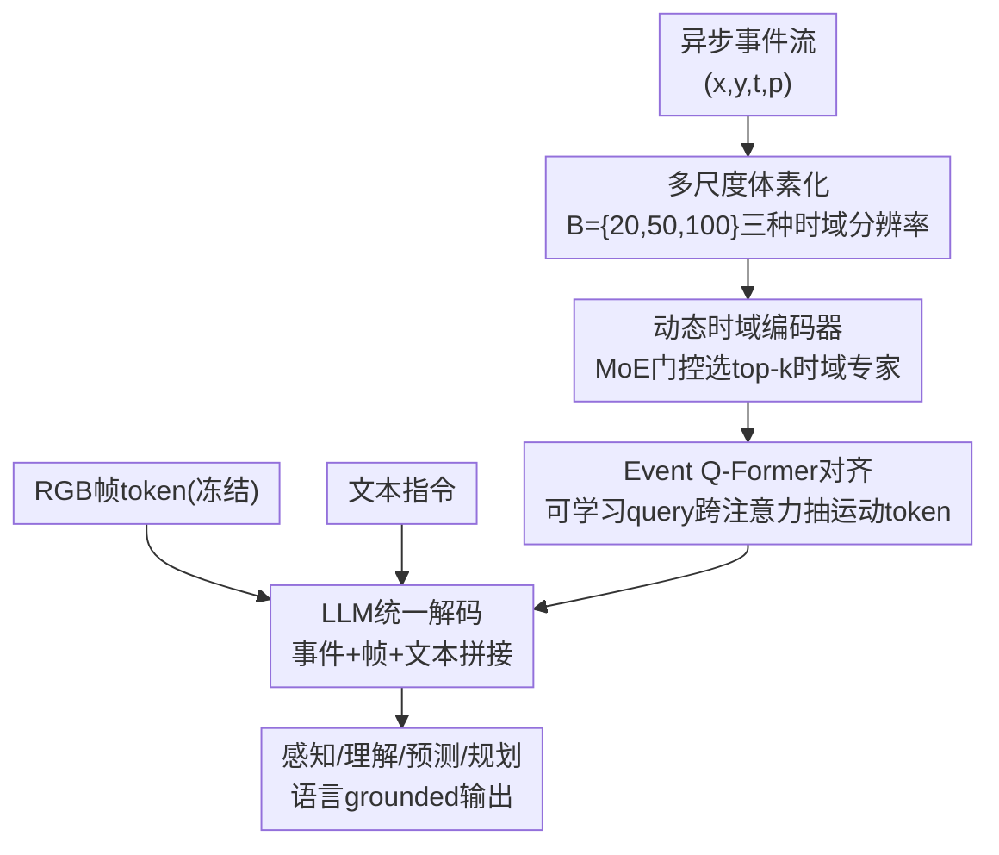

# EventDrive: Event Cameras for Vision-Language Driving Intelligence

**会议**: CVPR 2026  
**论文**: [CVF Open Access](https://openaccess.thecvf.com/content/CVPR2026/html/Lu_EventDrive_Event_Cameras_for_Vision-Language_Driving_Intelligence_CVPR_2026_paper.html)  
**代码**: 待确认  
**领域**: 自动驾驶  
**关键词**: 事件相机、视觉-语言驾驶、多模态benchmark、多尺度时域编码、Q-Former对齐

## 一句话总结
EventDrive 构建了第一个把事件流 + RGB 帧 + 语言监督打通整条驾驶链（感知→理解→预测→规划，4 级 17 子任务，47 万样本）的 benchmark，并配套提出 EventDrive-VLM——用「多尺度体素化 + MoE 门控的动态时域编码器」和「Event Q-Former」把异步事件对齐进 LLM 语义空间，事件-帧融合后在所有任务族上全面超过纯帧 / 纯事件模型，规划 L2 误差从 4.54m 降到 3.66m。

## 研究背景与动机

**领域现状**：事件相机以微秒级延迟、高动态范围、对运动模糊天然鲁棒的特性记录像素级亮度变化，在快速自车运动、强弱光突变、运动模糊这些「帧相机翻车」的安全攸关驾驶场景里特别有价值。但目前事件相机在驾驶里的研究大多停在上游有监督任务——检测、分割、光流估计；而 RGB 社区已经走到了把感知、推理、控制塞进一个网络的统一视觉-语言-动作框架。

**现有痛点**：少数把事件接入视觉-语言系统的尝试（grounding、caption-based event LM 如 EventGPT / EventVL / LLaFEA）只能做通用场景的描述或短 QA，**没有揭示事件感知到底如何贡献于贯穿整条驾驶环路的推理与决策**。换句话说，事件被当成一个孤立的时间线索，而不是端到端驾驶智能的一部分。

**核心矛盾**：缺一个能在「整条 autonomy stack」上系统评测事件价值的统一接口——既要覆盖从环境感知到自车规划的全链路，又要把异步事件嵌进语言推理空间。现有事件-语言数据集要么是仿真数据，要么真实世界覆盖不足 10 万样本，任务也零散。

**本文目标**：(1) 造一个把事件、帧、语言在「感知-理解-预测-规划」四个维度上统一起来的大规模 benchmark；(2) 造一个能解释、对齐、推理异步事件表征的通用 VLM 训练框架。

**核心 idea**：把驾驶环路拆成 4 个顺序推理阶段，每个阶段都表达成「语言 grounded」的任务，从而用统一协议量化事件的时序线索如何增强各级推理；模型侧用「多时域尺度自适应编码 + 跨注意力 query 对齐」把异步稀疏事件干净地接进 LLM。

## 方法详解

本文是一个 **benchmark + 配套模型** 的工作，方法部分分两块：先讲 EventDrive 数据集怎么构造、任务怎么定义、怎么评测，再讲 EventDrive-VLM 模型怎么把事件接进 LLM。

### 整体框架
EventDrive 把整条驾驶环路组织成 4 个顺序阶段：**Perception（环境感知）→ Understanding（物体级理解）→ Prediction（短时预测）→ Planning（自车规划）**，共 17 个子任务，每个任务都写成语言 grounded 的结构化 query（caption / QA / grounding / 轨迹预测等），让事件-帧模型可以在统一协议下被评测。数据用半自动流水线在 DSEC、M3ED、PKU-DAVIS-SOD 三个真实事件数据集上构造，靠 Qwen3-VL 生成语言监督，最终 471,543 个「事件-帧-语言」样本，并额外切出一个只含低光 + 运动模糊序列的 **hard split** 专门考事件的优势。

模型侧 EventDrive-VLM 是一条清晰的串行 pipeline：异步事件先被转成**多尺度体素张量**捕捉不同时间尺度的运动；**动态时域编码器**用 MoE 门控自适应聚合这些多尺度特征；**Event Q-Former** 做跨注意力，从事件特征里抽出语言对齐、运动相关的 token；这些事件 token 与冻结的帧 token、文本 embedding 拼接后送进 LLM 做统一驾驶推理；最后用两阶段课程训练把三条通路（事件 / 视觉 / 语言）逐步对齐。

### 关键设计

**1. 分层语言 grounded 任务体系：把整条驾驶环路拆成可量化的事件推理阶梯**

这是 benchmark 的骨架，针对的痛点是「事件研究停在孤立感知、没法系统评测它对全链路推理的贡献」。作者把驾驶拆成 4 级、17 子任务：**Perception**（6 子任务：场景类型、能见度、车流、天气、信号灯、路况）考全局场景理解，事件在恶劣光照/模糊下提供稳定边缘和时域梯度；**Understanding**（6 子任务：物体存在、外观、运动状态、自车关系、环境关系、grounding）考物体语义和空间关系，异步事件帮助消解交互歧义；**Prediction**（2 子任务：速度变化、方向变化）考短时行为预测，事件的高时间密度直接暴露速度和加速度；**Planning**（3 子任务：速度意图、方向意图、未来 waypoint）考自车决策，事件的连续时域结构让动态/低能见度下的决策更稳。每个子任务都被写成统一的语言 query，使得经典视觉模型和现代 VLM 都能在同一套协议下被评。

**2. 半自动语言监督流水线 + hard split：用 VLM 把多源标注转成可扩展的语言监督**

针对「真实事件-语言数据稀缺、且要覆盖 4 类异质任务」，作者用 Qwen3-VL 在同步的 RGB 帧、事件流、bbox、LiDAR、ego-pose 上生成结构化语言监督：场景级感知由全局 caption 拆成均衡的 QA 对；物体级理解基于 DSEC 的 GT bbox 生成五种属性描述再转 VQA 和 grounding；预测用 ego-pose 把 3D box 投到自车坐标系、抽轨迹、转成速度/方向意图的自然语言；规划用 M3ED 轨迹监督导出速度意图、路径意图和未来 waypoint。最终 47 万样本，远超现有 <10 万的事件-语言数据集。关键的评测设计是额外切一个**只含低光 + 运动模糊序列的 hard split**，专门隔离出「帧相机退化、事件该发力」的场景，让事件优势可被定向度量，而不是被正常光照下的高分稀释。

**3. 动态时域事件编码器：用多尺度体素 + MoE 门控自适应挑选时间分辨率**

针对的痛点很具体——事件流的时间密度跨数据集和任务差异巨大（不同采样率、感知需要长时域上下文而预测/规划需要细粒度运动），而传统体素化用**固定** bin 数 $B$，长曝光窗会被压缩、快速运动会被模糊，丢掉运动推理最需要的高频细节。给定事件流 $E=\{e_k\}_{k=1}^K$、$e_k=(x_k,y_k,t_k,p_k)$，标准体素化把事件映射成 4D 张量：

$$E(p,\tau,x,y)=\sum_{e_k\in E}\delta(p-p_k)\,\delta(x-x_k,y-y_k)\,\delta(\tau-\tau_k),\quad \tau_k=\left\lfloor\frac{t_k-t_a}{t_b-t_a}B\right\rfloor.$$

本文不用单一 $B$，而是用一组时域分辨率 $\mathcal{B}=\{b_n\}_{n=1}^N$ 构造多个体素张量 $E_n$，分别捕捉短/中/长时域运动；每个专家网络 $\sigma(\cdot)$ 处理对应 bin 的张量得 $F_n=\sigma(E_n)$。再用一个 **MoE 门控**自适应加权：把各专家特征 concat 后全局平均池化得描述子 $f_c$，门控 logits 为

$$z=W_g f_c+\text{Softplus}\big(\epsilon\odot(W_{noise}f_c)\big),\quad \epsilon\sim\mathcal{N}(0,1),$$

其中加噪项鼓励专家多样性；只保留 top-$k$ logits、softmax 归一化得权重 $\alpha_n$，聚合表征 $F_e=\sum_{n=1}^N\alpha_n F_n$。这样运动快时强调高分辨率时域特征、运动缓时用粗但稳的聚合——比固定 bin 在全速度谱上都保住时序保真度。消融里 top-k 单专家选择反而比加权求和更好，说明「抑制无关分辨率」比「混合所有分辨率」更有效。

**4. Event Q-Former 对齐：用可学习 query 跨注意力把事件压成语言对齐的运动 token**

针对「事件特征必须对齐进 LLM 语义空间」，最朴素的做法是把事件 token 和帧 token 直接 concat，但这忽略了模态不对称、还带来很高的序列长度和计算开销。作者改用 Q-Former 式跨注意力：引入一组可学习事件 query $q_e\in\mathbb{R}^{N_q\times d}$，去 attend 展平后的事件特征图 $f_e\in\mathbb{R}^{(HW)\times d}$：

$$z_e=\text{softmax}\!\left(\frac{(q_e W_Q)(f_e W_K)^\top}{\sqrt{d}}\right)(f_e W_V).$$

每个 query 选择性地关注事件流里时域信息量大的区域，产出紧凑的运动感知 embedding；再经一个轻量投影层映到 LLM embedding 空间得事件 token $h_e$，与帧 token $h_f$、文本 embedding $h_t$ 拼接送进 LLM 解码。相比 concat，query-centric 对齐既只抽最显著的运动模式（更便宜），又保住事件的时序独特性（更强的运动抽象）——消融显示它在 grounding 和 planning 上都优于纯 concat 和纯 cross-attention。

### 损失函数 / 训练策略
两阶段课程训练，从「事件-语言 grounding」过渡到「多模态指令跟随」：

- **阶段一·事件-语言预适配**：冻结 LLM 和帧视觉编码器，只训事件编码器、Q-Former、投影层，用 caption 数据的语言建模目标。梯度只流过事件通路，在不动预训练帧语义的前提下，让事件编码器把时序/运动结构组织成与 LLM 兼容的 embedding，提供稳定的跨模态对齐。
- **阶段二·指令微调**：解冻 LLM 的 transformer 块，连同整条事件通路一起在全部 caption + QA 数据上微调，帧视觉编码器仍冻结。这一步把时域与语义信号更紧地绑在一起，形成统一的「感知到动作」事件驱动模型。

实现上微调 Qwen2.5-VL-7B-Instruct，事件编码器用预训练 RVT backbone，动态时域 bin $B=20,50,100$（即 $N=3$），16 张 H20、AdamW + cosine、bf16、序列长 4096、FlashAttention 2，两阶段各 2 epoch、batch 128。

## 实验关键数据

### 主实验
EventDrive benchmark 上跨四任务族对比（百分比 %，L2 越低越好；加粗为最佳）。事件+帧融合的 EventDrive-VLM 在几乎所有指标上领先：

| 模型 | 感知 Acc@P | 理解 Acc | 理解 Acc@60 | 预测 Speed | 规划 Path | 规划 L2↓ |
|------|-----------|---------|-------------|-----------|----------|---------|
| EventGPT-7B（纯事件） | 52.25 | 38.78 | 5.49 | 27.84 | 76.08 | 11.42 |
| Qwen2.5-VL-7B（纯帧·微调*） | 75.88 | 58.44 | 69.94 | 36.84 | 89.44 | 4.54 |
| InternVL3-8B（纯帧） | 74.37 | 60.60 | 0.24 | 4.41 | 84.34 | 9.84 |
| **EventDrive-VLM（事件+帧）** | **78.89** | **65.46** | **72.86** | **42.44** | **92.35** | **3.66** |

跨数据集泛化：在 Event-Chat benchmark（Tab. 3）上 EventDrive-VLM 零样本迁移，Complex Reasoning 4.15 超过纯事件 EventGPT-7B（4.09），说明 EventDrive 学到的是可泛化的事件-语言对齐而非过拟合某种标注风格。

### 消融实验
拆解三个核心模块（数值为各任务平均，L2 单位 m）：

| 配置 | 感知 Acc | 理解 mIoU | 规划 L2↓ | 说明 |
|------|---------|----------|---------|------|
| 体素化 $N=1$ | 82.40 | 69.52 | 4.11 | 单一时域分辨率 |
| 体素化 $N=5$ | 83.95 | 72.25 | 3.88 | 增到 5 个 horizon，收益饱和 |
| 聚合 Add（朴素求和） | 76.76 | 67.64 | 4.57 | 抹平时域差异，最弱 |
| 聚合 Wt.sum（加权和） | 83.84 | 70.56 | 3.75 | 优于求和但不如选单专家 |
| 对齐 Concat | 79.35 | 71.93 | 4.01 | 模态失衡 + 序列变长 |
| 对齐 Attention | 81.25 | 70.23 | 3.69 | token 级交互改善 grounding/planning |
| **Ours（$N=3$ + MoE top-k + Q-Former）** | **83.66** | **72.56** | **3.66** | 全模块 |

### 关键发现
- **预测任务模态差距最大**：从静态帧推速度/方向是病态的（纯帧 InternVL3 Speed 仅 4.41），事件直接编码运动，事件增强模型在 Speed/Path 上稳定领先——这是事件价值最直观的证据。
- **多尺度 horizon 在 3 个时饱和**：$N=1→5$ 各任务都涨，但超过 3 个收益饱和而计算量线性增长，故选 $N=3$ 取精度-效率平衡。
- **「选 top-k 单专家」优于「混合所有分辨率」**：MoE 门控比加权求和好，说明抑制无关时域分辨率比无差别融合更有效。
- **纯帧模型在 hard split / Acc@60 上崩**：多个纯帧 VLM 在低光、运动模糊下 grounding（Acc@60）几乎归零（InternVL3 仅 0.24），印证「运动线索无法从 RGB 推断、必须靠事件」。

## 亮点与洞察
- **把事件价值「拆到任务粒度」量化**：不是笼统说事件好，而是用 4 级 17 子任务 + hard split 精确指出事件在哪类任务（预测/运动 grounding）、哪类条件（低光/模糊）下不可替代——这种「分维度归因」的评测设计值得迁移到任何「新模态 vs 旧模态」的对照研究。
- **MoE 门控做时域分辨率选择，而非容量扩展**：MoE 在这里不是用来扩参数，而是当作「自适应挑时间尺度」的开关，且 top-k 单专家最优——这是把 MoE 用于「表征选择」而非「容量堆叠」的一个干净例子。
- **Q-Former 在事件模态上同样吃香**：异步稀疏事件直接 concat 进 LLM 既贵又乱，用可学习 query 抽运动 token 既降算力又保时序独特性，这套「稀疏高时序信号 → 少量语义 token」的压缩思路可迁到雷达、音频等其他异步模态。

## 局限与展望
- **依赖 Qwen3-VL 生成监督**：47 万样本的语言标注由 VLM 半自动生成，可能继承生成器的偏置或在细粒度属性上出错；论文未report人工校验比例。⚠️ 标注质量的可靠性需结合 supplementary 判断。
- **三个源数据集的覆盖边界**：DSEC/M3ED/PKU 主要是特定地区/传感器配置，跨地域、跨事件相机型号的泛化未充分验证。
- **纯事件 baseline 偏弱**：EventGPT 以零样本评测（训练码不可得），与本文充分微调的模型对比不完全公平；事件-only 的上限可能被低估。
- **改进方向**：可探索把规划阶段接成真正的闭环控制（而非 waypoint 回归），以及在线异步推理下事件的延迟优势能否端到端体现。

## 相关工作与启发
- **vs EventGPT / EventVL / LLaFEA**：它们把事件编码器 + 时域聚合器接 LLM，但停在 captioning / 短 QA 的通用场景；本文把事件-VLM 推向覆盖整条驾驶链的综合推理，并显式量化事件在感知-理解-预测-规划各级的贡献。
- **vs 固定窗口的事件-帧融合**：早期 late fusion、后来的共享 backbone + 注意力门控大多用固定时域窗，抓不住跨尺度展开的运动；本文用多 horizon 体素 + MoE 门控做频率自适应融合，兼顾时域精度与语义连贯。
- **vs 纯帧驾驶 VLM**：纯帧模型正常光照下感知很强，但在 Acc@P、Acc@60、速度类预测上因无法编码运动而急剧退化；本文证明事件的时域梯度是 RGB 推不出来的互补信息。

## 评分
- 新颖性: ⭐⭐⭐⭐ 第一个打通事件全驾驶链的语言 benchmark，模型侧组件（多 horizon + MoE + Q-Former）多为成熟模块的巧妙组合。
- 实验充分度: ⭐⭐⭐⭐ 跨四任务族 + 跨数据集泛化 + 三模块消融，纯事件 baseline 略弱是小遗憾。
- 写作质量: ⭐⭐⭐⭐ 任务层级和动机讲得清晰，公式完整，图文对照好。
- 价值: ⭐⭐⭐⭐⭐ 提供大规模真实事件-语言驾驶 benchmark + 训练框架，对事件驱动驾驶智能是可复用的基础设施。

<!-- RELATED:START -->

## 相关论文

- [\[CVPR 2026\] DriveVLN: Towards Mapless Vision-and-Language Navigation in Autonomous Driving](drivevln_towards_mapless_vision-and-language_navigation_in_autonomous_driving.md)
- [\[CVPR 2026\] Learning Vision-Language-Action World Models for Autonomous Driving](vla_world_learning_vision_language_action_world_models_for_autonomous_driving.md)
- [\[CVPR 2026\] FlashCap: Millisecond-Accurate Human Motion Capture via Flashing LEDs and Event-Based Vision](flashcap_millisecond-accurate_human_motion_capture_via_flashing_leds_and_event-b.md)
- [\[CVPR 2026\] DSERT-RoLL: Robust Multi-Modal Perception for Diverse Driving Conditions with Stereo Event-RGB-Thermal Cameras, 4D Radar, and Dual-LiDAR](dsert-roll_robust_multi-modal_perception_for_diverse_driving_conditions_with_ste.md)
- [\[CVPR 2026\] VGGDrive: Empowering Vision-Language Models with Cross-View Geometric Grounding for Autonomous Driving](vggdrive_empowering_vision-language_models_with_cross-view_geometric_grounding_f.md)

<!-- RELATED:END -->
