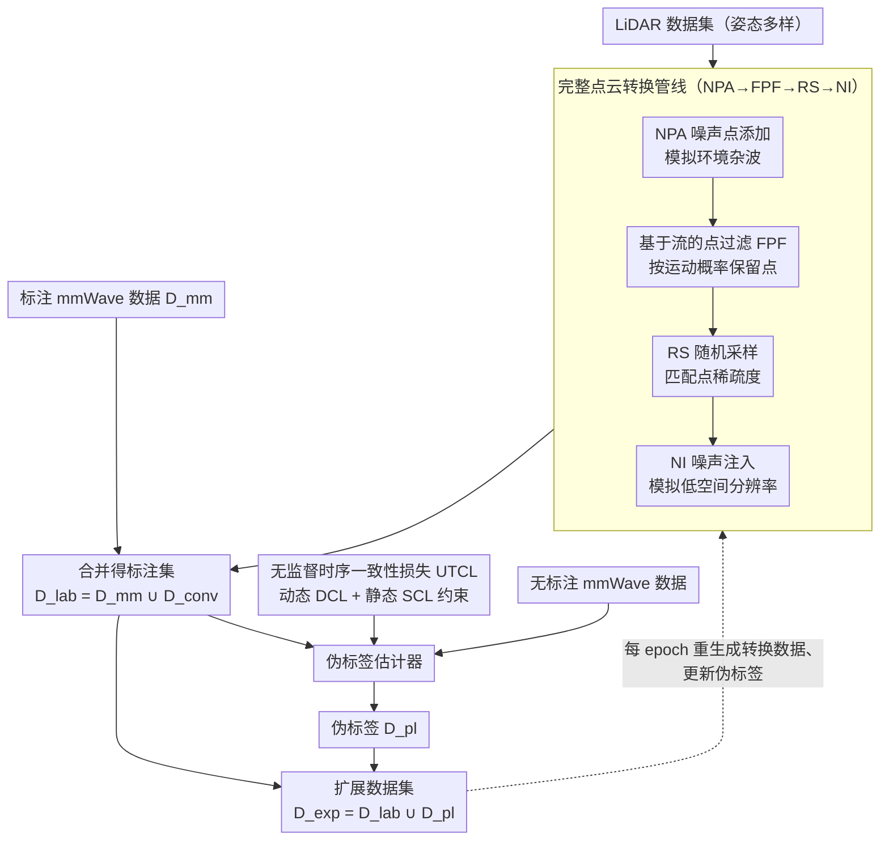

# EMDUL: Expanding mmWave Datasets for Human Pose Estimation with Unlabeled Data and LiDAR Datasets

**会议**: CVPR 2026  
**arXiv**: [2603.14507](https://arxiv.org/abs/2603.14507)  
**代码**: [GitHub](https://github.com/Shimmer93/EMDUL)  
**领域**: 自动驾驶  
**关键词**: 毫米波雷达, 人体姿态估计, 数据扩展, LiDAR点云转换, 半监督学习

## 一句话总结

提出 EMDUL 管线，通过伪标签标注无标注毫米波数据（含新设计的无监督时序一致性损失 UTCL）和闭式 LiDAR→mmWave 点云转换器（含基于流的点过滤 FPF），大幅扩展毫米波 HPE 数据集的规模与多样性，域内误差降低 15.1%、跨域误差降低 18.9%。

## 研究背景与动机

毫米波（mmWave）雷达因其 3D 感知、隐私保护和光照鲁棒性优势，在人体姿态估计（HPE）领域受到持续关注。主流方法使用处理后的 3D 点云作为输入，但当前毫米波 HPE 数据集存在两大瓶颈：

**数据稀缺**：有标注的 mmWave HPE 数据集极少，采集和标注成本高

**多样性不足**：
   - **点云属性单一**：设备型号和环境种类有限，检测噪声、点密度、运动灵敏度分布狭窄
   - **姿态单调**：受试者多为面向雷达的站立姿势，缺乏蹲、游泳等复杂动作

与此同时，**无标注 mmWave 数据**易于采集，**LiDAR HPE 数据集**（如 LiDARHuman26M、HmPEAR）丰富且姿态多样。然而 LiDAR 与 mmWave 的点云属性因物理传感原理不同而存在根本差异（LiDAR 可感知静态物体，mmWave 依赖多普勒效应更擅长检测运动目标），直接混用效果不佳。此前的扩展方法要么仅扩展骨架而不改善点云属性分布，要么需要 mmWave-LiDAR 配对数据（采集困难）。

## 方法详解

### 整体框架

EMDUL 由两个独立模块组成：

1. **伪标签估计器**：利用已标注 mmWave 数据和 UTCL 损失训练，为无标注 mmWave 数据生成伪标签 $D^{\text{pl}}$
2. **闭式点云转换器**：将 LiDAR 数据集转换为 mmWave 点云 $D^{\text{conv}}$

工作流程为：先将 LiDAR 数据通过转换器生成 $D^{\text{conv}}$，与原始 $D^{\text{mm}}$ 合并为 $D^{\text{lab}}$；再用 $D^{\text{lab}}$ 训练伪标签估计器，标注无标注数据得到 $D^{\text{pl}}$；最终扩展数据集 $D^{\text{exp}} = D^{\text{lab}} \cup D^{\text{pl}}$。训练时每个 epoch 重新生成 $D^{\text{conv}}$（新随机种子）和更新 $D^{\text{pl}}$，实现迭代精炼。

### 关键设计

**1. 完整点云转换管线（NPA→FPF→RS→NI）：把 LiDAR 点云逐项改造成 mmWave 的样子**

LiDAR 与 mmWave 在杂波、密度、空间分辨率、运动敏感性上都有差距，单一操作补不齐，所以转换器把四步串成一条流水线，每步对应一类属性差异：NPA（噪声点添加）先补进固定数量的噪声点，模拟 mmWave 的环境杂波；FPF（基于流的点过滤，是其中贡献最大的一步，下文详述）按运动检测机制筛点；RS（随机采样）降采样以匹配 mmWave 的点稀疏性；NI（噪声注入）最后在坐标上叠随机噪声，模拟其较低的空间分辨率。四步按 NPA→FPF→RS→NI 顺序走完，一帧 LiDAR 点云在杂波、稀疏度、噪声、运动敏感性上都被拉到 mmWave 的分布里，无需任何配对的跨模态数据。

**2. 基于流的点过滤（FPF）：在点云层面复刻 mmWave 的"只见动者"**

LiDAR 点云之所以不能直接当 mmWave 用，根子在于 LiDAR 连静态物体一并扫进来，而 mmWave 靠多普勒效应主要捕捉运动目标，两者的点分布天差地别。FPF 直接在点云层面模拟这个机制：先基于骨架光流，用反距离加权插值给每个点算出一个 3D 流向量，再按流量大小做概率性保留——流量越小（越静态）的点被丢弃的概率越高：

$$\mathcal{P}(P_t[i] \in P_t^{\text{conv}}) = \min\left(\frac{\|F_t^P[i]\|_2}{\upsilon_t}, 1\right)$$

这样转换出来的点云在"运动处密、静止处疏"的分布上贴近真实 mmWave。消融里它是转换管线贡献最大的单模块：加上 FPF 后，二分类器把 60.46% 的转换点云误判成真 mmWave（不加 FPF 只有 43.06%），说明这一步真正缩小了模态差。

**3. 无监督时序一致性损失（UTCL）：给无标注数据找一个无需人工标签的监督信号**

转换管线解决了 LiDAR 侧的数据，无标注 mmWave 数据则量大却没有真值姿态可以约束，伪标签很容易越训越偏。UTCL 的思路是把 mmWave 雷达的一条物理先验——多普勒效应让运动部位更容易被检测——翻译成时序约束：靠近检测点云的关节大概率正在运动，远离点云的关节大概率静止。据此它拆出两个互补分量。动态一致性损失（DCL）鼓励靠近点云的关节具有非零光流，对光流模长小于阈值 $\eta$ 的部分施加 hinge 惩罚：

$$L^{\text{dyn}} = \frac{1}{|F_t^{\text{dyn}}|} \sum_{k} \max(0, \eta - \|F_t^{\text{dyn}}[k]\|_2)$$

静态一致性损失（SCL）则反过来，压低远离点云那批关节的光流模长，让它们趋近静止：

$$L^{\text{sta}} = \frac{1}{|F_t^{\text{sta}}|} \sum_{k} \|F_t^{\text{sta}}[k]\|_2$$

只用 DCL 会把预测推向"哪儿都在动"，只用 SCL 又会让人僵在原地，两者必须组合（消融里二者单独都不改善跨域、合起来才显著），并和标注数据上的监督损失 $L^{\text{lab}}$ 一起用，才能把无标注数据真正变成有效监督。

### 损失函数 / 训练策略

伪标签估计器的总损失：

$$L = L^{\text{lab}} + \lambda^{\text{con}} L^{\text{con}}$$

- $L^{\text{lab}}$：标注数据上的 MSE 损失
- $L^{\text{con}} = L^{\text{dyn}} + L^{\text{sta}}$：UTCL
- $\lambda^{\text{con}} = 0.01$

训练 100 epoch，使用 AdamW 优化器，学习率 $10^{-4}$，带余弦退火和线性 warmup。推理模型 $\theta^{\text{infer}}$ 与估计器共同训练，每个 epoch 先更新 $\theta^{\text{pl}}$，再更新 $\theta^{\text{infer}}$。

## 实验关键数据

### 主实验

使用 10% 有标注 MM-Fi（F）或 mmBody（B）数据，在 full setting（+无标注+HmPEAR）下的 MPJPE（cm）：

| 设置 | 方法 | 骨干 | MPJPE | PA-MPJPE |
|------|------|------|-------|----------|
| F→F（域内） | P4T baseline | P4T | 12.23 | 7.95 |
| F→F | EMDUL | P4T | **10.06** | 7.01 |
| F→F | EMDUL | SPiKE | 10.40 | 7.23 |
| B→F（跨域） | P4T baseline | P4T | 33.62 | 15.85 |
| B→F | EMDUL | SPiKE | **22.80** | 14.09 |
| B→F | Mean Teacher | SPiKE | 32.71 | 15.74 |

- 域内（F→F）MPJPE 降低 **15.1%**（12.23→10.06，使用 SPiKE 可达 17.5% 优于 Mean Teacher）
- 跨域（B→F）MPJPE 降低 **18.9%**，使用 SPiKE 优于 Mean Teacher **30.3%**

### 消融实验

| 配置 | F→B MPJPE | PA-MPJPE | 说明 |
|------|-----------|----------|------|
| 无伪标签（仅 PCC） | 15.22 | 11.51 | 转换 LiDAR 已有显著提升 |
| +$L^{\text{lab}}$ 仅 | 15.12 | 11.44 | 受标注数据监督 |
| +$L^{\text{lab}}$+DCL+SCL（完整 UTCL） | **14.89** | **11.11** | 二者互补 |
| PCC w/o FPF | 15.85 | 12.23 | FPF 贡献最大 |
| PCC 完整 | 14.89 | 11.11 | 各组件互补 |

**LiDAR 点云转换真实性验证**：训练二分类器区分 mmWave 和 LiDAR 点云，使用 FPF 后 60.46% 的转换点云被判为 mmWave（不用 FPF 仅 43.06%）。

### 关键发现

- FPF 是点云转换管线中贡献最大的单一模块，直接模拟了 mmWave 的运动检测物理机制
- UTCL 的 DCL 和 SCL 单独使用不改善跨域性能，但组合后效果显著——单独时会导致预测偏向过动/过静
- 1% 有标注数据时 EMDUL 的优势最为显著（MPJPE 从 18.40 降至 14.77）
- 跨域性能的提升幅度大于域内，说明 EMDUL 真正改善了数据多样性而非过拟合

## 亮点与洞察

- **巧妙的物理先验利用**：UTCL 将 mmWave 的多普勒运动检测机制转化为无监督损失约束，是物理知识驱动的半监督设计典范
- **闭式转换无需配对数据**：LiDAR→mmWave 转换不依赖任何配对的跨模态数据，只需独立的 LiDAR 数据集即可
- **每 epoch 重新随机生成转换数据**：有效增加训练数据的多样性，类似在线数据增强

## 局限与展望

- 点云转换管线依赖经验参数（阈值 $\gamma$、$\delta$ 等），对不同场景可能非最优——未来可探索自适应或可学习转换
- UTCL 对复杂运动模式的建模还不够充分,可引入更精细的时序模型
- 目前仅支持单人 HPE，扩展到多人场景（遮挡、交互）是重要方向

## 相关工作与启发

- 与 Video2mmPoint 等视频转点云方法不同，EMDUL 直接在 3D 点云域操作且改善了点云属性分布
- FPF 的运动检测模拟思路可推广到其他基于多普勒效应的传感器（如 FMCW 雷达）
- UTCL 的时序一致性思想可启发其他自监督 3D 估计任务

## 评分

- 新颖性: ⭐⭐⭐⭐ 首次系统研究从 LiDAR 到 mmWave 的跨模态点云转换用于 HPE 数据扩展
- 实验充分度: ⭐⭐⭐⭐⭐ 涵盖两个 mmWave 和两个 LiDAR 数据集，消融全面，多种骨干验证
- 写作质量: ⭐⭐⭐⭐ 结构清晰，物理直觉表达到位
- 价值: ⭐⭐⭐⭐ 解决了 mmWave HPE 领域的数据瓶颈问题，方法通用性强

<!-- RELATED:START -->

## 相关论文

- [\[CVPR 2026\] Towards Balanced Multi-Modal Learning in 3D Human Pose Estimation](towards_balanced_multi-modal_learning_in_3d_human_pose_estimation.md)
- [\[CVPR 2026\] LA-Pose: Latent Action Pretraining Meets Pose Estimation](la-pose_latent_action_pretraining_meets_pose_estimation.md)
- [\[CVPR 2026\] PTC-Depth: Pose-Refined Monocular Depth Estimation with Temporal Consistency](ptc-depth_pose-refined_monocular_depth_estimation_with_temporal_consistency.md)
- [\[CVPR 2026\] ShelfOcc: Native 3D Supervision beyond LiDAR for Vision-Based Occupancy Estimation](shelfocc_native_3d_supervision_beyond_lidar_for_vision-based_occupancy_estimatio.md)
- [\[CVPR 2026\] SG-NLF: Spectral-Geometric Neural Fields for Pose-Free LiDAR View Synthesis](sgnlf_spectralgeometric_neural_fields_for_posefre.md)

<!-- RELATED:END -->
