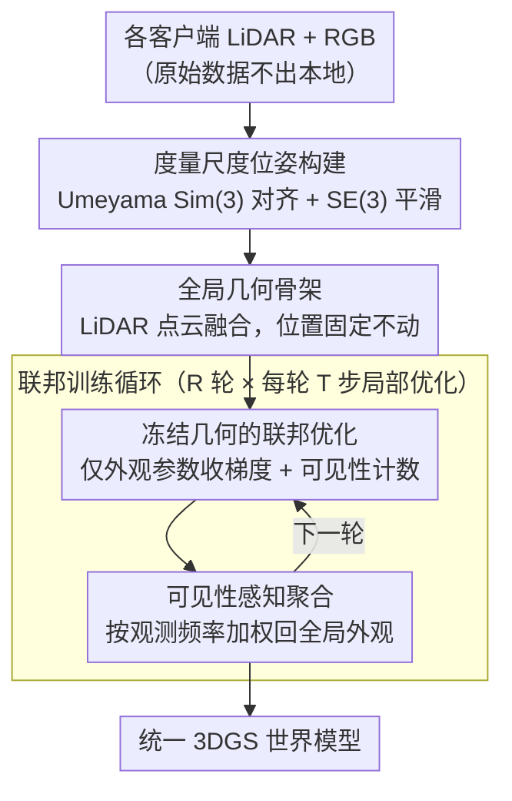

# F3DGS: Federated 3D Gaussian Splatting for Decentralized Multi-Agent World Modeling

**会议**: CVPR 2026  
**arXiv**: [2604.01605](https://arxiv.org/abs/2604.01605)  
**代码**: 即将公开（含数据集和开发工具包）  
**领域**: Autonomous Driving / 多智能体3D重建  
**关键词**: 联邦学习, 3D Gaussian Splatting, 多智能体, 分布式重建, 可见性加权聚合

## 一句话总结

提出F3DGS，首个将联邦学习框架应用于3DGS的方法，通过冻结几何+可见性感知聚合实现多智能体分布式3D重建，无需原始数据共享。

## 研究背景与动机

**领域现状**: 3DGS在新视角合成方面取得SOTA，广泛应用于机器人、自动驾驶和具身AI

**现有痛点**: 所有现有3DGS方法都假设集中式数据访问——所有观测必须在单一机器上联合优化。这在多智能体分布式场景下面临三个约束：
   - **通信开销**: 聚合高分辨率图像的带宽和存储随智能体数量线性增长
   - **数据隐私**: 多运营商/多组织设置下，原始传感器数据是私有的，不能直接共享
   - **可扩展性**: 联合优化的计算需求与总推理size绑定，形成集中式瓶颈

**核心矛盾**: 联邦学习可通过仅共享模型更新解决上述问题，但将FedAvg直接应用于3DGS会导致两个领域特有难题——**几何漂移**（位置参数独立优化导致不一致）和**部分可观测性**（每个客户端只观察部分高斯）

**本文目标**: 在联邦约束（零原始图像交换）下实现多智能体协同的统一3DGS重建

**切入角度**: 利用3DGS参数的显式可分离性（位置、协方差、颜色是独立张量），将几何和外观解耦

**核心idea**: 冻结共享的几何骨架（位置固定），仅联邦优化外观属性，通过可见性加权聚合解决部分可观测性

## 方法详解

### 整体框架

F3DGS 要解决的是：多个智能体各自只看到场景的一部分、又不能交换原始图像，如何协同重建出一个统一的 3DGS 世界模型。它的破局点是利用 3DGS 参数天然可分离（位置、协方差、颜色是独立张量）这一点，把"几何"和"外观"拆开——先把各客户端轨迹对齐到统一坐标系、用所有客户端的 LiDAR 点云融合出一套**共享的全局几何骨架**并固定下来，然后让各客户端在冻结位置的前提下只联邦优化外观属性，最后按"谁看得多谁权重大"的可见性频率把各客户端的更新加权聚合回全局模型。整个联邦训练迭代多轮，全程零原始图像交换、只传模型参数。

### 关键设计

**1. 度量尺度位姿构建：先把各客户端轨迹对齐到统一的全局锚点**

多智能体系统里各个体的位姿估计可能用了不同方法，尺度和坐标系彼此不一致，直接拼会错位。这里以全局 LiDAR 锚点为统一参考，用 Umeyama $\mathcal{S}im(3)$ 估计求出每个客户端的尺度 $s_k$、旋转 $R_k$ 和平移 $\mathbf{t}_k$：

$$s_k, R_k, \mathbf{t}_k = \arg\min_{s,R,\mathbf{t}} \sum_j \|\mathbf{p}_j^{\text{anchor}} - (sR\mathbf{p}_j^{\text{client}} + \mathbf{t})\|^2$$

为避免对齐边界处的跳变，再叠一层指数衰减的 SE(3) 平滑校正 $T_t^{\text{smooth}} = \text{Exp}(\beta(t) \cdot \text{Log}(\Delta T)) \cdot T_t^{\text{aligned}}$，让拼接处过渡连续。

**2. 冻结几何的联邦优化：位置固定，只让外观参数参与联邦更新**

直接把 FedAvg 套到 3DGS 上会踩坑：高斯位置编码的是显式 3D 坐标、处在平滑参数空间里，各客户端独立优化再平均会产生**几何漂移**，重建变得不连贯。F3DGS 的对策很直接——把位置彻底冻住，$\mu_i^{(k)} = \mu_i \;\; \forall k, \forall \text{steps}$，只让外观参数 $\theta_{\text{app}} = \{s_i, q_i, \alpha_i, \mathbf{c_i}\}$（尺度、旋转、不透明度、球谐系数）接收梯度。同时维护一个可见性计数器 $v_{k,i}$，记录高斯 $i$ 在客户端 $k$ 训练时被光栅化了多少次，为后面的聚合权重做准备。冻结位置等于从根上消除了漂移来源。

**3. 可见性感知聚合：按观测频率加权，不让没看见的客户端稀释信息**

每个客户端只观测到部分高斯，如果聚合时一律均匀平均，就会把观测充分的外观估计和那些根本没被观测、还停在随机初值的参数混在一起，质量被稀释。F3DGS 让聚合权重正比于可见性：

$$\alpha_{k,i} = \frac{v_{k,i}}{\sum_{j=1}^K v_{j,i} + \epsilon}, \qquad a_i = \sum_{k=1}^K \alpha_{k,i} a_{k,i}$$

四元数参数单独处理（符号对齐后再平均并归一化），总可见性为零的高斯则保留上一轮的全局值。这样"谁看得多谁说了算"，避免无效估计污染全局外观。

### 损失函数 / 训练策略

联邦训练每轮包含 $T=1000$ 步局部优化，共 $R=7$ 轮。渲染损失组合L1和SSIM：

$$\mathcal{L}_k = \sum_{t \in \mathcal{I}_k} [(1-\lambda)\|I_t - \hat{I}_t\|_1 + \lambda(1 - \text{SSIM}(I_t, \hat{I}_t))]$$

其中 $\lambda = 0.2$。禁用自适应密度控制和任何形式的聚合后对齐。

## 实验关键数据

### 主实验（MeanGreen室内数据集）

| 序列 | 帧数 | 客户端 | Local PSNR↑ | Global PSNR↑ | Local SSIM↑ | Global SSIM↑ |
|------|------|--------|-------------|--------------|-------------|--------------|
| 05 | 543 | 2 | 23.71 | 22.65 | 0.818 | 0.808 |
| 06 | 1042 | 3 | 25.66 | 22.66 | 0.831 | 0.803 |
| 08 | 718 | 2 | 24.52 | 23.94 | 0.853 | 0.832 |
| 11 | 552 | 2 | 24.01 | 22.77 | 0.827 | 0.808 |

### 消融实验（通信轮数 vs 质量权衡）

| 序列 | 轮数R | 局部步数T | Local PSNR | Global PSNR | 趋势 |
|------|-------|-----------|------------|-------------|------|
| 07 | 1 | 7000 | 23.90 | 21.95 | 局部最高但全局最低 |
| 07 | 7 | 1000 | 23.64 | 22.74 | 平衡点 |
| 07 | 14 | 500 | 23.57 | **22.84** | 全局最高 |
| 08 | 7 | 1000 | 24.52 | 23.94 | 良好平衡 |

### 关键发现

- 全局模型与局部模型的PSNR差距在多数序列保持在2dB以内
- 增加通信轮数会略降低局部性能但改善全局一致性
- 序列03的全局性能下降最大（18.82 dB），表明聚合对时序分割引入的不一致性敏感
- 更多轮次的联邦聚合有助于改善跨客户端一致性

## 亮点与洞察

- **问题定义清晰**: 首次明确定义联邦约束下的3DGS训练问题，填补了重要空白
- **几何-外观解耦的巧妙利用**: 3DGS的显式表征（位置、颜色等可分离）使得"冻结几何、联邦外观"的策略成为可能，这在隐式NeRF中不可行
- **实际应用导向**: 零原始数据交换满足隐私需求，通信仅涉及模型参数更新
- **自建数据集**: MeanGreen多模态数据集（RGB+LiDAR+IMU）作为评估平台

## 局限与展望

- 全局模型在复杂序列（如03）性能下降显著，聚合策略对数据分布敏感
- 当前假设固定数量的高斯原语（6×10⁵），未支持自适应密度控制
- 仅在室内走廊环境验证，缺少户外/大规模场景测试
- 位姿构建依赖LiDAR，限制了适用场景（非所有智能体都配备LiDAR）
- PSNR整体较低（18-25dB），可能与前向相机有限视角多样性有关

## 相关工作与启发

- **FedNeRF**: 将联邦学习应用于NeRF，但NeRF隐式表征中几何和外观纠缠在共享MLP参数中，无法选择性冻结
- **Fed3DGS**: 使用蒸馏方式更新服务器模型，但不能防止跨客户端几何漂移
- **CoSurfGS**: 设备-边缘-云层次结构的分布式高斯重建，但假设合作模型共享
- **启发**: 3DGS显式表征的"可分离性"是其在分布式场景中的独特优势

## 评分

- 新颖性: ⭐⭐⭐⭐ 联邦3DGS是新方向，几何冻结策略简洁有效
- 实验充分度: ⭐⭐⭐ 仅在自建数据集上验证，缺少与集中式训练的对比baseline
- 写作质量: ⭐⭐⭐⭐ 问题定义和方法描述清晰
- 价值: ⭐⭐⭐⭐ 面向多智能体协作的实际需求，具有广泛应用前景

<!-- RELATED:START -->

## 相关论文

- [\[CVPR 2026\] GaussianDWM: 3D Gaussian Driving World Model for Unified Scene Understanding and Multi-Modal Generation](gaussiandwm_3d_gaussian_driving_world_model_for_unified_scene_understanding_and_.md)
- [\[CVPR 2026\] Efficient Equivariant Transformer for Self-Driving Agent Modeling](efficient_equivariant_transformer_for_self-driving_agent_modeling.md)
- [\[CVPR 2026\] ParkGaussian: Surround-view 3D Gaussian Splatting for Autonomous Parking](parkgaussian_surround-view_3d_gaussian_splatting_for_autonomous_parking.md)
- [\[CVPR 2026\] Unsupervised Multi-agent and Single-agent Perception from Cooperative Views](unsupervised_multi-agent_and_single-agent_perception_from_cooperative_views.md)
- [\[CVPR 2026\] RaGS: Unleashing 3D Gaussian Splatting from 4D Radar and Monocular Cue for 3D Object Detection](rags_unleashing_3d_gaussian_splatting_from_4d_radar_and_monocular_cue_for_3d_obj.md)

<!-- RELATED:END -->
