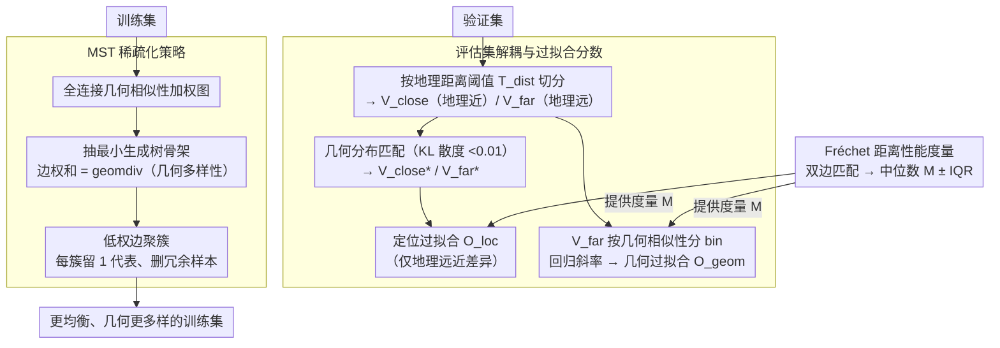

# Failure Modes for Deep Learning-Based Online Mapping: How to Measure and Address Them

**会议**: CVPR 2026  
**arXiv**: [2603.19852](https://arxiv.org/abs/2603.19852)  
**代码**: 有（GitHub Page）  
**领域**: 自动驾驶  
**关键词**: 在线建图, 过拟合分析, 泛化评估, 数据集偏差, 地图几何多样性

## 一句话总结

本文系统性地定义和量化了深度学习在线建图模型的两种失败模式——定位过拟合和地图几何过拟合，提出基于 Fréchet 距离的性能度量和基于最小生成树（MST）的训练集稀疏化策略，在 nuScenes 和 Argoverse 2 上验证了几何多样且均衡的训练集能改善模型泛化能力。

## 研究背景与动机

1. **领域现状**：深度学习在线建图（如 MapTR、MapTRv2）已成为自动驾驶的核心感知任务，模型从传感器数据（相机、激光雷达）直接生成矢量化 HD 地图元素。
2. **现有痛点**：
    - 在地理重叠的训练/验证集上性能膨胀，切换到地理不相交的划分后性能急剧下降（如 nuScenes 上 mAP 从 60.95 降到约 25-29）；
    - 模型记忆了位置特定的输入特征而非学到可泛化的表示；
    - 数据集存在几何偏差（重复的地图几何结构）但未被充分研究。
3. **核心矛盾**：现有评估不区分"模型记忆了位置特征"和"模型过拟合了地图几何结构"这两种失败模式，导致无法针对性地改进。
4. **本文目标**：(1) 如何解耦和量化两种过拟合模式？(2) 如何评估数据集的几何多样性？(3) 如何设计更好的训练集提升泛化？
5. **切入角度**：引入地理距离和几何相似性两个正交维度，将验证集分层评估；用 Fréchet 距离替代 Chamfer 距离作为更鲁棒的性能度量。
6. **核心 idea**：通过控制地理距离和几何相似性来解耦两种过拟合，并用 MST 稀疏化消除训练集中的冗余几何结构来改善泛化。

## 方法详解

### 整体框架

这篇论文要回答的问题很具体：当在线建图模型在地理不相交的划分上掉点时，它到底是"记住了某条街的样子"，还是"只会画训练集里见过的那几种路口形状"？这是两种不同的病，但过去的评估把它们混在一起看。本文的整体思路是把"地理距离"和"几何相似性"当成两个正交的旋钮分别拧——先用前者隔离定位过拟合，再用后者隔离几何过拟合，各自给出一个可量化的分数；诊断清楚之后，再回到训练集这一侧，用最小生成树（MST）把几何上冗余的样本删掉，验证"更均衡、更多样的训练集能不能改善泛化"。所以全文是一条"先测量、后干预"的链路：评估集分层 → 两个过拟合分数 + 一个更鲁棒的距离度量 → MST 稀疏化训练集。

### 关键设计

**1. 评估集解耦与过拟合分数：把"记住位置"和"过拟合几何"拆成两个独立可测的量**

直接按地理距离切验证集会有个陷阱——地理上离训练区越远的样本，往往几何结构也越不一样，于是地理距离和几何相似性强相关（Pearson r=0.724）。如果只看地理远近，掉的点里有多少是"没见过这个位置"、有多少是"没见过这种形状"，根本分不开。本文的做法是先按地理距离阈值 $T_{\text{dist}}$ 把验证集切成地理相近的 $V_{\text{close}}$ 和地理远离的 $V_{\text{far}}$，然后对这两批做**几何相似性分布匹配采样**：双边匹配后按 KL 散度 <0.01 筛掉分布不一致的样本，得到几何分布对齐的 $V_{\text{close*}}$ 和 $V_{\text{far*}}$。两者的唯一差别就只剩"地理远近"了，于是定位过拟合分数

$$\mathcal{O}_{\text{loc}} = \frac{M_{\text{far*}} - M_{\text{close*}}}{M_{\text{close*}}}$$

衡量的就是纯粹由"位置陌生"带来的性能下滑（$M$ 是后面定义的性能度量）。几何过拟合则反过来：在 $V_{\text{far}}$ 上按几何相似性分 bin，看性能随相似性变化的趋势，拟合线性回归的斜率得到 $\mathcal{O}_{\text{geom}}$——斜率越陡，说明模型越依赖"见过相似形状"才能画对。这样两个分数各自只对一个维度敏感，过拟合的两种成因第一次被分开测了出来。

**2. 基于 Fréchet 距离的性能度量：用保留点序的距离取代排列不变的 Chamfer**

上面分数里的 $M$ 需要一个可靠的"地图画得有多准"的度量，而常用的 Chamfer 距离在这里有硬伤：它是排列不变的，只看点到点的最近匹配，因此即使预测把折线画成了交叉、扭曲的形状（如原文 Fig.3(b)），Chamfer 也可能给出很低的误差，而且在小样本集上波动大。本文改用**离散 Fréchet 距离**，它在比较两条折线时要求按点的先后顺序对齐，因而对点序错误敏感、能抓住形状保真度；对多边形还会枚举所有循环排列和正反方向取最优。对每对预测/真值元素做双边匹配后收集匹配代价分布 $D$，取中位数 $M$ 和四分位距 $IQR$ 作为这一帧的性能度量——中位数比均值更抗离群点，IQR 则给出稳定性的刻画。

**3. MST 稀疏化策略：删掉几何冗余的训练样本，让训练集更均衡**

诊断发现性能和几何相似性的相关性（r=0.568）比和地理距离的（r=0.379）更强，意味着几何过拟合可能是更主要的病根——而病根在数据：训练集里大量样本几何结构高度雷同，模型被这些重复形状"喂偏"了。本文把整个训练集建成一张全连接加权图，边权是样本间的几何相似性 $\text{sim}(s_i, s_j)$，然后抽取**最小生成树**作为骨架。设一个相似性阈值，把 MST 上边权低于阈值的节点聚成簇（即彼此非常像的一群样本），每个簇只保留平均邻居权重最低的那个代表样本，其余删去。整个训练集的几何多样性用 MST 边权之和定义：

$$\text{geomdiv}(D) = \sum_{(i,j) \in \mathcal{E}(\mathcal{T}_{\text{sim}})} \text{sim}(s_i, s_j)$$

关键的实验现象是：阈值取 0.1–1 时删掉了相当一部分样本，但 $\text{geomdiv}$ 几乎不变、性能反而上升——这恰好证明被删的都是冗余样本，它们除了加剧训练不均衡之外没贡献新信息。与随机删除样本的对照实验也显示，按 MST 有目的地稀疏化明显优于随机采样。

### 损失函数 / 训练策略

本文不涉及新的训练损失。分析使用 MapTR、MapTRv2、MapQR、MGMap 四种模型的公开代码和配置进行训练。

## 实验关键数据

### 主实验（MapTRv2 不同划分对比）

| 数据集/划分 | geomdiv(T) | geomsim(T,V) | 地理重叠<5m | mAP↑ | M±IQR↓ | $\mathcal{O}_{\text{loc}}$↓ | $\mathcal{O}_{\text{geom}}$↓ |
|------------|------------|--------------|------------|------|--------|------|------|
| nuScenes original | 96.8km | 8.32m | 79.47% | 60.95 | 1.94±3.05 | 24.73 | 21.22 |
| nuScenes geo.[24] | 80.6km | 14.66m | 0.95% | 24.96 | 4.07±6.14 | n.a. | 9.75 |
| nuScenes geo.[42] | 90.2km | 13.85m | 0% | 28.53 | 3.24±5.50 | n.a. | 13.84 |
| nuScenes geometric | 91.3km | 21.08m | 8.53% | 28.37 | 4.17±6.08 | 4.40 | 10.49 |
| Argoverse2 original | 91.0km | 8.98m | 44.89% | 63.97 | 1.77±2.99 | 7.29 | 11.17 |

### 多模型过拟合对比（nuScenes original）

| 模型 | $\mathcal{O}_{\text{loc}}$↓ | $\mathcal{O}_{\text{geom}}$ (original)↓ |
|------|------|------|
| MapTR | 24.42 | 18.66 |
| MapTRv2 | 24.73 | 21.22 |
| MapQR | 57.07 | 21.03 |
| MGMap | 33.19 | 24.12 |

### 关键发现

- 所有模型在所有划分上都表现出正的过拟合分数，说明过拟合是系统性问题
- MapQR 的定位过拟合最严重（57.07），可能与 query 设计有关
- 性能与几何相似性 $s(v)$ 的相关性（Pearson r=0.568）强于与地理距离 $d(v)$ 的相关性（r=0.379），说明几何过拟合可能比定位过拟合更重要
- MST 稀疏化在阈值 0.1-1 时：样本减少但性能反而提升，优于随机采样
- geo.[42] 比 geo.[24] 性能更好，原因是训练集几何多样性更高（90.2km vs 80.6km）

## 亮点与洞察

- **过拟合的精细解耦**：首次将在线建图的泛化失败分解为"记忆输入特征"和"过拟合地图几何"两个正交维度。这个框架不仅适用于在线建图，可推广到任何空间感知任务的泛化性分析
- **MST 几何多样性度量**：用最小生成树的边权之和量化数据集的几何多样性，既直观又可操作。"删少量冗余样本反而提升性能"这一发现对数据集策划有直接指导意义
- **Fréchet 距离替代 Chamfer 距离**：保留点序信息使得地图元素形状保真度评估更准确，尤其对交叉/扭曲的预测更敏感

## 局限与展望

- 几何相似性计算（成对 Fréchet 距离+匹配）计算开销大，难以直接扩展到更大数据集
- 当前只分析了 BEV 视角下的地图几何，未考虑 3D 几何结构（如高度信息）
- MST 稀疏化是后处理策略，未探索在训练过程中动态调整采样权重
- 只在 nuScenes 和 Argoverse 2 上验证，需要更多数据集（如 Waymo）的支持
- 未提出直接减轻过拟合的训练方法（如几何感知数据增强或损失函数）

## 相关工作与启发

- **vs Lilja et al.**: 他们首先揭示了地理记忆化效应，本文在此基础上进一步将其解耦为两种独立的过拟合模式
- **vs 地理不相交划分 [24,42]**: 这些工作只解决了地理重叠问题，本文进一步分析了几何偏差并提出几何划分
- **vs MapTR/MapTRv2**: 作为被分析的对象，本文发现它们都存在严重过拟合，为未来模型设计提供了诊断工具

## 评分

- 新颖性: ⭐⭐⭐⭐ 过拟合解耦框架和 MST 稀疏化策略是有启发性的贡献
- 实验充分度: ⭐⭐⭐⭐⭐ 四种模型×多种划分的全面分析，消融充分
- 写作质量: ⭐⭐⭐⭐⭐ 问题定义清晰，数学形式化严谨，可视化直观
- 价值: ⭐⭐⭐⭐ 为在线建图社区提供了重要的诊断工具和数据集设计指南

<!-- RELATED:START -->

## 相关论文

- [\[AAAI 2026\] PriorDrive: Enhancing Online HD Mapping with Unified Vector Priors](../../AAAI2026/autonomous_driving/priordrive_enhancing_online_hd_mapping_with_unified_vector_p.md)
- [\[CVPR 2026\] Reliable Policy Transfer for Safety-Aware End-to-End Driving with Deep Reinforcement Learning](reliable_policy_transfer_for_safety-aware_end-to-end_driving_with_deep_reinforce.md)
- [\[CVPR 2026\] MapGCLR: Geospatial Contrastive Learning of Representations for Online Vectorized HD Map Construction](mapgclr_geospatial_contrastive_learning_of_represe.md)
- [\[ECCV 2024\] Accelerating Online Mapping and Behavior Prediction via Direct BEV Feature Attention](../../ECCV2024/autonomous_driving/accelerating_online_mapping_and_behavior_prediction_via_dire.md)
- [\[CVPR 2026\] AMap: Distilling Future Priors for Ahead-Aware Online HD Map Construction](amap_distilling_future_priors_for_ahead-aware_online_hd_map_construction.md)

<!-- RELATED:END -->
