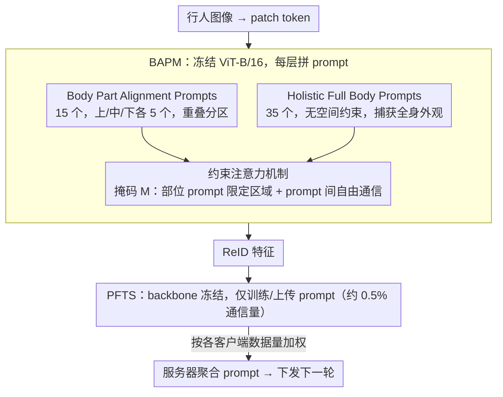

# FedBPrompt: Federated Domain Generalization Person Re-Identification via Body Distribution Aware Visual Prompts

**会议**: CVPR 2026  
**arXiv**: [2603.12912](https://arxiv.org/abs/2603.12912)  
**代码**: [leavlong/FedBPrompt](https://github.com/leavlong/FedBPrompt)  
**领域**: 自动驾驶  
**关键词**: FedDG-ReID, 视觉提示, 身体部位对齐, 参数高效微调, ViT, 联邦聚合

## 一句话总结

提出FedBPrompt框架，通过身体分布感知视觉提示机制(BAPM)将prompt分为Body Part Alignment Prompts和Holistic Full Body Prompts两组，配合Prompt-based Fine-Tuning Strategy(PFTS)冻结ViT backbone仅训练轻量prompt（通信量降至~1%），在FedDG-ReID任务上平均mAP提升3.3%、Rank-1提升4.9%。

## 研究背景与动机

联邦域泛化行人重识别(FedDG-ReID)要求在隐私保护的联邦学习框架下，从多个去中心化摄像头域学习域不变表征，使模型能泛化到未见目标域。ViT凭借强表征能力成为主流backbone，但其**全局注意力机制**在FedDG-ReID中暴露两个核心缺陷：

**背景干扰失焦**：ViT的全局自注意力无差别地处理所有patch token，包括行人区域和背景区域。当不同客户端的背景分布差异大时（室内/室外、商场/街道），模型容易将注意力分散到高相似度的背景上，造成不同身份的行人因背景相似被错误匹配

**视角变化导致身体部位错位**：不同客户端的摄像头角度差异（俯视/平视、正面/侧面）使同一行人的身体部位在图像中的空间位置大幅变化。ViT的全局注意力无法感知这种空间结构差异，导致同一行人的跨视角特征相似度急剧下降

这两个问题在联邦场景下被**客户端间数据分布异质性**进一步放大——每个客户端只能看到自己场景的数据，无法通过集中训练来学习跨域不变性。

现有FedDG-ReID方法（如DACS的数据增强、FedReID的特征对齐）主要在数据层面增加多样性，但未直接从模型注意力机制层面解决背景失焦和部位错位问题。

## 方法详解

### 整体框架

FedBPrompt要解决的是：在联邦学习里，ViT的全局注意力既容易被背景带偏、又无法对齐跨视角的身体部位，而集中训练又被隐私约束堵死。它的思路是把"修注意力"和"省通信"两件事一起办——在冻结的ViT-B/16上插入一组结构化的视觉prompt，用注意力掩码强行规定每个prompt该看哪块区域，从而把行人身体的空间先验注入进去；同时整个训练只动这些轻量prompt，backbone不参与通信。

具体地，一张行人图像先切成patch token送进ViT，每一层都额外拼上一组可学习的prompt token。这组prompt被拆成"管部位对齐"和"管整体外观"两类，配合一张注意力掩码控制它们与patch的可见关系。前向走完，prompt和patch一起更新表征、输出ReID特征；反向只对prompt求梯度。客户端训完把prompt（而非整个模型）上传服务器做加权聚合，这就是Body Distribution Aware Visual Prompts Mechanism（BAPM）与Prompt-based Fine-Tuning Strategy（PFTS）两个组件的分工。

### 关键设计

**1. Body Part Alignment Prompts：让prompt各管一块身体区域，对齐跨视角部位**

视角变化让同一个人的头、躯干、腿在图像里漂到不同位置，全局注意力对这种空间错位毫无感知。BAPM的对策是在50个prompt里拿出15个，按身体三段各分5个：$\mathbf{P}^{\text{upper}}$ 只看图像上半部分（头/肩）、$\mathbf{P}^{\text{mid}}$ 只看中间（躯干）、$\mathbf{P}^{\text{lower}}$ 只看下半部分（腿/脚）。这样每个部位prompt被绑定到固定的身体语义上，无论行人在画面里如何偏移，对应的prompt都只去那一段找证据，跨视角的特征因此能稳定对齐。

区域划分刻意用**重叠分区**而不是硬三等分。设图像共 $n$ 个patch，三段定义为

$$I_{\text{upper}} = \{j \mid 1 \leq j \leq n/2\}, \quad I_{\text{mid}} = \{j \mid n/4+1 \leq j \leq 3n/4\}, \quad I_{\text{lower}} = \{j \mid n/2+1 \leq j \leq n\}$$

相邻段之间留约25%重叠，刚好覆盖头肩交界、腰胯交界这些容易被刚性切割切断的过渡带，避免边界信息丢失。

**2. Holistic Full Body Prompts：用无约束prompt兜住全身外观、压制背景噪声**

光有部位prompt还不够——背景失焦的根子在于注意力被高相似度背景分散，而部位prompt各自只盯一块，谁也没在看"这个人整体长什么样"。所以剩下的35个prompt组成 $\mathbf{P}^{\text{Full}}$，不加任何空间约束，可以和全部patch自由交互，专门捕获行人的整体外观。它们承担"看什么"的判断，把注意力从杂乱背景拉回到人身上，与部位prompt"在哪看"的职责形成互补。

**3. 约束注意力机制：用一张掩码同时实现"部位约束"和"prompt间自由通信"**

前两组prompt的"该看哪、不该看哪"靠一张结构化注意力掩码 $M$ 落地，直接加在softmax之前的注意力logits上：

$$\text{Attention}(Q, K, V) = \text{Softmax}\left(\frac{QK^T}{\sqrt{d_k}} + M\right)V$$

$$M_{ij} = \begin{cases} -\infty & \text{if } (q_i, k_j) \in \mathcal{C}_{\text{mismatch}} \\ 0 & \text{otherwise} \end{cases}$$

其中 $\mathcal{C}_{\text{mismatch}}$ 指"某个部位prompt配上它不该看的区域patch"这类不匹配对，被置为 $-\infty$ 后在softmax里归零，部位约束就这么硬性生效。关键的是另一半规则：所有prompt token彼此之间掩码恒为0（$M_{ij}=0,\ \forall q_i,k_j\in\mathbf{P}$），也就是部位prompt和全局prompt之间完全放开通信。部位prompt提供结构化的局部线索，全局prompt再把这些碎片整合成连贯的全身表征——既拿到了PCB式分块的部位对齐，又不像刚性分块那样割裂全局一致性。这组prompt在每一层都有独立参数 $\mathbf{P}_{i-1}$，逐层更新：

$$[\mathbf{x}_i, \_, \mathbf{E}_i] = L_i([\mathbf{x}_{i-1}, \mathbf{P}_{i-1}, \mathbf{E}_{i-1}])$$

**4. PFTS：只训练、只上传prompt，把联邦通信量压到约0.5%**

ViT-B/16全模型约86M参数，每轮都同步整个backbone在联邦里代价过高，资源受限的边缘端根本扛不住。PFTS的做法是把backbone彻底冻住、只让prompt承载所有可学习信息：服务器先在集中数据上预训练一个标准ReID模型（不含prompt），分发给各客户端后冻结其backbone参数 $\Theta_b$；每个客户端再植入随机初始化的BAPM prompt $\Theta_p$（约0.46M），只对它优化

$$\mathcal{L}_k(\Theta_p) = \sum_{(x,y) \in D_k} \mathcal{L}_{\text{ReID}}(g(x; \Theta_b, \Theta_p), y)$$

训完只上传prompt参数，服务器按各客户端数据量加权聚合：

$$\Theta_p^{t+1} = \sum_{k=1}^{K} \frac{|D_k|}{\sum_{j=1}^{K}|D_j|} \Theta_{p,k}^{t+1}$$

于是每轮通信从86M降到0.46M、约 **0.5%**，且因为backbone保留了集中预训练得到的通用表征，prompt只需补上跨域不变的那部分，几轮聚合就能拿到明显增益。

### 损失函数 / 训练策略

训练用标准ReID目标（交叉熵 + triplet loss）。框架支持两种模式：Full-Parameter（整模型 + BAPM一起训）和PFTS（仅训prompt）。BAPM本身是即插即用模块，可以挂到任意ViT-based的FedDG-ReID框架上。

## 实验关键数据

### 数据集与协议

- **数据集**：CUHK02 (C2)、CUHK03 (C3)、Market1501 (M)、MSMT17 (MS)
- **Protocol-1**：Leave-One-Out，3个域训练、1个域测试
- **Protocol-2**：源域性能评估

### Protocol-1 主实验（Table 1）

以最强基线SSCU（MM 2025）为例：

| 设置 | →M mAP | →M Rank-1 | →C3 mAP | →C3 Rank-1 | →MS mAP | →MS Rank-1 | Avg mAP | Avg Rank-1 |
|------|--------|-----------|---------|------------|---------|------------|---------|------------|
| SSCU原始 | 46.3 | 69.6 | 33.7 | 33.4 | 20.0 | 43.7 | 33.3 | 48.9 |
| +PFTS | 48.9(+2.6) | 72.4(+2.8) | 35.5(+1.8) | 35.8(+2.4) | 21.3(+1.3) | 46.0(+2.3) | 35.2(+1.9) | 51.4(+2.5) |
| +BAPM | **49.1**(+2.8) | **73.4**(+3.8) | **37.4**(+3.7) | **38.4**(+5.0) | **23.4**(+3.4) | **49.5**(+5.8) | **36.6**(+3.3) | **53.8**(+4.9) |

对弱基线提升更加显著——在FedProx上，BAPM带来平均mAP +10.0%、Rank-1 +13.5%的提升。

### 消融实验（Table 3）

以SSCU为基线，在"C2+C3+M→MS"设置下：

| 配置 | Holistic | Part Align | mAP | Rank-1 |
|------|----------|------------|-----|--------|
| Baseline | — | — | 20.0 | 43.7 |
| +Holistic Only | ✓ | — | 22.9 | 48.2 |
| +Part Align Only | — | ✓ | 22.7 | 48.5 |
| +BAPM (Full) | ✓ | ✓ | **23.4** | **49.5** |

两组prompt各自有效，组合后进一步提升。Part Alignment Prompts在视角变化大的场景（→MS）上贡献更突出。

### 注意力质量量化（Table 4）

| 方法 | Class Token Ins. AUC | RISE Ins. AUC |
|------|---------------------|---------------|
| SSCU | 0.6160 | 0.6516 |
| +VPs（普通prompt） | 0.7103 | 0.7494 |
| +BAPM | **0.7559** | **0.7737** |

Insertion AUC衡量注意力图的忠实度——BAPM显著优于普通（无结构化）visual prompt，证明其注意力确实更精准地聚焦在行人区域。

### Protocol-2 源域性能

BAPM在提升跨域泛化的同时，不损害源域性能，甚至在源域测试中也有明显提升（FedPav +BAPM在C2上mAP从66.5→74.3）。

## 亮点与洞察

- **结构化prompt的精妙设计**：不同于VPT等方法将所有prompt同质化处理，BAPM为每组prompt赋予明确的空间语义——部位prompt负责"在哪看"，全局prompt负责"看什么"。功能分工+自由通信的设计比刚性分块更灵活
- **重叠分区避免信息断裂**：upper/mid/lower区域有25%重叠，解决了硬性三等分中边界区域信息丢失的问题
- **PFTS的实用价值极高**：0.5%的通信量、几轮即收敛——这对实际联邦部署的可行性至关重要。且PFTS本身就能带来一致的正向增益
- **即插即用的通用性**：在6种不同基线方法上全部有效，平均提升稳定，说明BAPM捕捉到的是方法间共通的瓶颈
- **注意力可视化直观有力**：Figure 3中部位prompt精准锁定对应身体区域，全局prompt覆盖全身，Baseline则注意力散漫——视觉证据令人信服

## 局限与展望

1. **空间分区假设依赖行人直立**：upper/mid/lower的固定比例划分假设行人大致直立且居中。对弯腰、坐姿、严重遮挡等非标准姿态，固定分区可能失效。可考虑自适应分区或基于pose估计的动态分区
2. **仅验证了四个ReID数据集**：CUHK02/03、Market1501、MSMT17都是经典但相对"干净"的数据集。在更复杂的实际场景（低光照、极端天气、超高密度人群）中的表现需要进一步验证
3. **prompt数量的敏感性**：论文使用50个prompt（15+35分配），虽然附录有敏感性分析，但最优比例可能与数据集/域数量相关，缺乏自适应调整机制
4. **预训练模型的质量依赖**：PFTS模式依赖一个高质量的预训练模型作为起点。如果初始模型质量差，仅通过prompt微调能否弥补尚不明确
5. **跨模态/跨更多域的扩展**：仅在RGB可见光图像上验证，跨模态ReID（红外-可见光）中身体分布特征是否同样有效值得探索

## 相关工作与启发

- **VPT (Visual Prompt Tuning)**：开创性的视觉prompt方法 → FedBPrompt的关键创新在于给prompt赋予空间结构语义
- **PromptFL**：联邦学习中的prompt通信思路 → FedBPrompt将其从NLP迁移到视觉ReID并设计了任务定制的prompt结构
- **PCB/MGN等部件模型**：传统的行人部件对齐方法 → BAPM通过prompt+注意力掩码实现软性分区，比物理切割更灵活
- **SSCU (MM 2025)**：当前FedDG-ReID SOTA → BAPM在其基础上仍有3-5%的显著提升
- **DACS (AAAI 2024)**：数据增强路线 → BAPM从模型注意力机制层面互补
- **启发**：结构化prompt的思路可推广到其他需要空间对齐的视觉任务（如细粒度识别、医学图像分析）。PFTS的极低通信开销对边缘设备联邦学习场景有广泛适用性

## 评分

| 维度 | 分数 (1-5) | 说明 |
|------|-----------|------|
| 创新性 | 3.5 | 将visual prompt与身体部位空间语义结合是有新意的设计，但整体框架基于VPT的自然延伸 |
| 实用性 | 4.5 | PFTS通信量降99%+即插即用特性，实际部署价值极高 |
| 实验充分度 | 4.0 | 6种基线、2种协议、消融完整、注意力可视化+量化，缺少计算开销详细对比 |
| 写作质量 | 4.0 | 问题定义清晰、方法叙述结构化、公式完整，结论部分略简短 |

<!-- RELATED:START -->

## 相关论文

- [\[AAAI 2026\] When Person Re-Identification Meets Event Camera: A Benchmark Dataset and An Attribute-guided Re-Identification Framework](../../AAAI2026/autonomous_driving/when_person_re-identification_meets_event_camera_a_benchmark_dataset_and_an_attr.md)
- [\[AAAI 2026\] Hierarchical Prompt Learning for Image- and Text-Based Person Re-Identification](../../AAAI2026/autonomous_driving/hierarchical_prompt_learning_for_image-_and_text-based_person_re-identification.md)
- [\[CVPR 2026\] Open-Vocabulary Domain Generalization in Urban-Scene Segmentation](open-vocabulary_domain_generalization_in_urban-scene_segmentation.md)
- [\[AAAI 2026\] Debiased Dual-Invariant Defense for Adversarially Robust Person Re-Identification](../../AAAI2026/autonomous_driving/debiased_dual-invariant_defense_for_adversarially_robust_person_re-identificatio.md)
- [\[NeurIPS 2025\] GSAlign: Geometric and Semantic Alignment Network for Aerial-Ground Person Re-Identification](../../NeurIPS2025/autonomous_driving/gsalign_geometric_and_semantic_alignment_network_for_aerial-ground_person_re-ide.md)

<!-- RELATED:END -->
