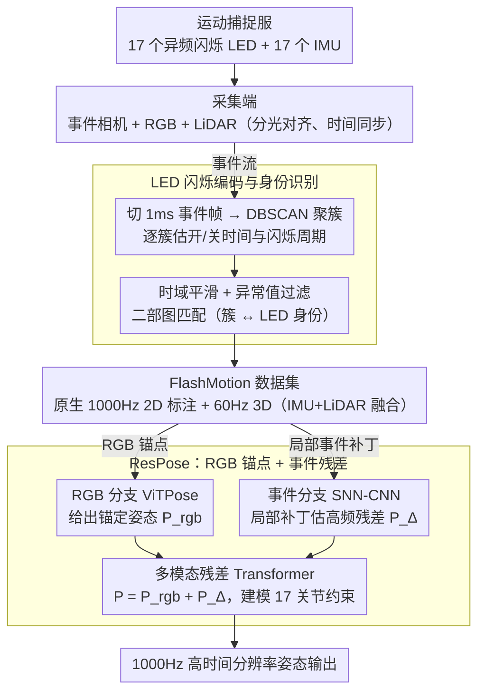

# FlashCap: Millisecond-Accurate Human Motion Capture via Flashing LEDs and Event-Based Vision

**会议**: CVPR 2026  
**arXiv**: [2603.19770](https://arxiv.org/abs/2603.19770)  
**代码**: 即将公开  
**领域**: 自动驾驶 / 人体姿态估计  
**关键词**: 事件相机, 人体运动捕捉, LED标记, 高时间分辨率, 脉冲神经网络

## 一句话总结

提出 FlashCap，首个基于闪烁 LED + 事件相机的运动捕捉系统，通过为每个 LED 配置不同的闪烁频率实现身份识别，构建了首个 1000Hz 标注精度的人体运动数据集 FlashMotion（715 万帧），并提出 ResPose 基线方法，将运动定时误差从 ~50ms 降至 ~5ms，姿态估计 MPJPE 降低约 40%。

## 研究背景与动机

1. **领域现状**：精确运动定时（PMT）在竞技体育等场景至关重要——雪橇比赛中 2ms 差距可能决定奖牌归属。当前人体姿态估计（HPE）主要关注空间准确性，对时间精度关注不足。现有运动捕捉系统如 Vicon（光学标记，~330Hz）、Xsens（IMU，60-240Hz）、标准 RGB 相机（30-60Hz）的时间分辨率均无法满足毫秒级需求。
2. **现有痛点**：(a) 高速 RGB 相机（≥1000Hz）虽可实现高帧率但成本极高（NAC HX-7s 超过 45,000 美元，是事件相机的 9 倍）、需要极强照明、带宽和存储需求比事件相机高两个数量级；(b) 公开的人体运动数据集最高标注帧率仅 120Hz（BEAHM），距离毫秒级精度差一个量级；(c) 现有时间标注方法受辅助模态采样上限或插值误差限制，无法突破 120Hz。
3. **核心矛盾**：如何以低成本、低带宽实现 1000Hz 的高时间分辨率人体运动捕捉和标注？
4. **本文目标** (a) 构建一种新型低成本运动捕捉系统，绕过高速相机的瓶颈；(b) 收集首个 1000Hz 标注精度的多模态人体运动数据集；(c) 提出并评估高时间分辨率的 HPE 基线方法。
5. **切入角度**：事件相机拥有微秒级时间分辨率和极低带宽，但如何从事件流中获取高频地面真值标注是关键挑战。作者创造性地使用不同闪烁频率的 LED 作为身体标记——事件相机能精确捕获 LED 的闪烁模式，通过频率分析自动匹配 LED 身份和位置，直接从事件流生成 1000Hz 的 2D 关节位置标注。
6. **核心 idea**：用不同闪烁频率的 LED 编码关节身份，事件相机天然高时间分辨率地捕获闪烁模式，频率匹配算法自动生成 1000Hz 的姿态标注——低成本、低带宽、无需高速相机。

## 方法详解

### 整体框架

FlashCap 想解决的是一个看似硬件问题、实则被标注卡住的难题：要训练能输出 1000Hz 姿态的模型，先得有 1000Hz 的地面真值，而传统光学 MoCap 最高只能标到 120Hz。它的整体思路是把"高频标注"这件事甩给硬件本身——让穿戴服装上每个关节 LED 以**各不相同的频率闪烁**，再用天生微秒级时间分辨率的事件相机去捕获这些闪烁，频率本身就成了关节的"身份证"。系统因此分三层：穿戴端是带 17 个 LED 和 17 个 IMU 的运动捕捉服；采集端用分光镜把事件相机（Prophesee 1280×720）和 RGB 相机（Hikrobot 1920×1200, 20fps）做到像素对齐与时间同步，外加 LiDAR（Ouster OS-1 128 线, 20fps）；软件端是一条标注流水线，从事件流里识别每个 LED 的闪烁模式、匹配身份，自动吐出 1000Hz 的 2D 关节位置。有了这套系统，作者收集了 FlashMotion 数据集，并在其上提出 ResPose 作为高时间分辨率 HPE 的基线。

### 关键设计

**1. LED 闪烁编码与身份识别：让"频率"成为关节的身份证**

传统光学标记要靠相机高帧率才能逐帧追踪、RFID 又精度不够，痛点在于"识别"和"高频"很难同时拿到。FlashCap 的做法是给每个 LED $i$ 配一个可配置的闪烁频率（约 4000Hz），不同 LED 有不同的开时间 $t_i^p$ 和关时间 $t_i^n$（落在 100–300μs 区间），于是每个关节天然带上一个独特的"闪烁签名"。事件相机只要某像素亮度变化越过阈值就异步触发一个事件 $e=(h,w,t,p)$，LED 所在位置因此持续喷出高密度事件，标注流水线就围绕这些事件展开：先把事件流切成 1ms 的事件帧、用 DBSCAN 把高密度区域聚成簇；再对每簇的正/负极性事件序列做统计，估出平均开/关时间 $\bar{t_j^p}$、$\bar{t_j^n}$ 与闪烁周期 $\bar{T_j}$；经时域平滑和异常值过滤压掉噪声后，用

$$d_{ji} = \alpha \cdot d_{ji}^t + \beta \cdot d_{ji}^p$$

把每个簇 $j$ 和每个 LED $i$ 的开关时间距离 $d_{ji}^t$ 与周期距离 $d_{ji}^p$ 加权成总距离，再用二部图匹配求全局最优对应。这套设计之所以成立，正是因为它把识别问题翻译成了事件相机最擅长表达的东西——闪烁频率，时间戳精度本身就到微秒级，标注自然不再受相机帧率掣肘。

**2. FlashMotion 数据集：把标注帧率从 120Hz 一口气拉到 1000Hz**

现有 HPE 数据集卡在 120Hz（BEAHM），离毫秒级精度差一个量级，根因就是它们的标注都依赖传统光学系统的采样上限。FlashMotion 直接用上面的 LED 流水线从事件流里生成原生 1000Hz 标注，绕开了这个瓶颈：20 名志愿者（10 男 10 女）、4 个室内外场景、11 大类 19 小类动作、240 个序列，含 144,350 帧 RGB、144,350 帧 LiDAR 点云、共 2 小时的事件与 IMU 数据。其中 2D 标注做到 1000Hz（流水线自动生成再人工修正），3D 标注 60Hz（IMU + LiDAR 融合解出 SMPL 参数）。总标注帧数达 715 万帧，相对现有数据集是数量级的跃升，也正是后续训练 1000Hz 模型的前提。

**3. ResPose：用 RGB 当结构锚点、事件只管补残差**

直接拿纯事件流去回归完整姿态并不灵——高频事件携带的是细碎的运动变化，而非完整的空间结构。ResPose 的关键洞察是把姿态拆成

$$P_i = P_{rgb} + P_i^{\Delta}$$

低帧率 RGB 分支（如 ViTPose）给出稳定的锚定姿态 $P_{rgb}$，事件分支只负责估计高频的残差 $P_i^{\Delta}$。事件分支用一个 SNN-CNN 混合编码器：以 RGB 锚点为中心动态裁出 $32 \times 32$ 的局部事件补丁，交给 Leaky Integrate-and-Fire（LIF）脉冲神经元做时序积分，再用 $1 \times 1$ 卷积压掉背景噪声——脉冲神经元天生按时间步累积输入，正好贴合异步事件数据。随后一个多模态残差 Transformer 把 RGB 锚点特征与事件特征拼接、用全局自注意力建模 17 个关节之间的运动学约束，端到端用 L2 损失训练。这种"锚点 + 残差"的分解之所以高效，是因为它让每个模态只做自己擅长的事：RGB 管低频结构、事件管高频增量，而不是逼某一个模态同时扛下两件难事。

### 一个完整示例：一帧事件如何变成关节标注

以左手腕这一个关节为例走一遍标注流水线。事件相机在某 1ms 窗口内吐出一团事件，DBSCAN 把它们聚成簇 $j$；统计这簇的正负极性序列，算出平均开时间约 180μs、闪烁周期约 250μs。系统手上有 17 个 LED 的预设签名，逐一比对：左手腕 LED 的设定恰好是开时间 ~180μs、周期 ~250μs，于是 $d_{ji}^t$ 和 $d_{ji}^p$ 都很小、总距离 $d_{ji}$ 最低；而其它 LED（频率不同）距离都大。二部图匹配把簇 $j$ 唯一指派给左手腕 LED，这个簇的质心坐标就成为左手腕在这 1ms 的 2D 标注。17 个关节并行走完这套流程，一帧 1000Hz 的全身 2D 姿态就生成了——整段过程不依赖任何外部 MoCap，时间分辨率只由事件相机决定。这也解释了消融里的现象：去掉开关时间距离 $d_{ji}^t$ 后，仅凭周期容易把频率相近的 LED 认错，精度从 99.99% 暴跌到 43.34%。

### 损失函数 / 训练策略

ResPose 使用端到端的 L2 距离损失，最小化预测姿态与 1000Hz 地面真值之间的误差。RGB 分支使用预训练的 ViTPose，事件分支从零训练。

## 实验关键数据

### 主实验

精确运动定时（PMT）——估计关节穿越线的时间误差（ms）：

| 方法 | Kicking | Punching | Jumping |
|------|---------|----------|---------|
| ViTPose (RGB) | 48.5 | 62.3 | 31.4 |
| Hybrid ANN-SNN (Event) | 85.2 | 54.1 | 66.7 |
| LEIR (RGB+Event) | 112.4 | 135.8 | 78.2 |
| **ResPose (Ours)** | **7.2** | **4.8** | **6.5** |

高时间分辨率 HPE（1000Hz）：

| 方法 | MPJPE↓ | PCK0.3↑ | PCK0.5↑ |
|------|--------|---------|---------|
| ViTPose (linear interp.) | 10.06 | 0.96 | 0.98 |
| Hybrid ANN-SNN | 22.48 | 0.82 | 0.91 |
| EventPointPose | 51.61 | 0.48 | 0.74 |
| EvSharp2Blur | 8.78 | 0.95 | 0.96 |
| ResPose (ANN Variant) | 8.12 | 0.95 | 0.96 |
| **ResPose (Ours, SNN)** | **5.66** | **0.97** | **0.99** |

### 消融实验

标注流水线消融（精度 / 召回率）：

| 配置 | Kicking Precision | Kicking Recall | 说明 |
|------|-------------------|----------------|------|
| w/o $d_{ji}^t$ | 43.34% | 97.80% | 去掉开关时间距离→大量误匹配 |
| w/o $d_{ji}^p$ | 69.70% | 97.56% | 去掉周期距离→匹配质量下降 |
| w/o 异常值过滤 | 96.52% | 95.69% | 噪声干扰导致漏检 |
| w/o 跟踪 | 98.38% | 98.16% | 遮挡时无法恢复 |
| **完整流水线** | **99.99%** | **98.99%** | 几乎完美的精度 |

### 关键发现

- **ResPose 在 PMT 任务上实现了量级提升**：时间误差从纯 RGB 的 ~50ms、纯事件的 ~55-86ms 降至 ~5-7ms。这证明了结合 RGB 结构锚点和事件残差修正的有效性。
- **现有纯事件方法在 PMT 上反而失败**（LEIR 误差 78-136ms），说明高时间分辨率输入不等于高时间分辨率输出——需要配合 1000Hz 地面真值训练才行。
- **SNN 编码器优于 ANN 变体**：MPJPE 从 8.12 降至 5.66，证明脉冲神经网络处理异步事件数据的天然优势。
- 标注流水线精度达 99.99%、召回率 98.82%，与人工标注高度一致，验证了 LED 频率编码方案的鲁棒性。
- 即使 100Hz 高速相机的样条插值在快速动作中仍有显著误差（跳跃 28.5px），验证了 1000Hz 原生标注的必要性。

## 亮点与洞察

- **LED 频率编码 + 事件相机**的组合极其巧妙：用硬件设计绕过了软件算法的局限。不同于给每个 LED 贴不同颜色（RGB 相机方案），用不同闪烁频率编码身份天然适配事件相机的工作原理，成本极低。这种"hardware-in-the-loop"标注思路可以迁移到任意需要高频标注的场景。
- **残差分解（RGB 锚点 + 事件残差）**是处理跨时间分辨率融合的优雅框架：RGB 提供低频结构先验，事件提供高频运动增量。这个分解方式不仅适用于 HPE，也可推广到高速物体追踪、高频表面形变估计等任务。
- 系统设计的完整性令人印象深刻——从硬件（LED服装+多模态设备）到软件（标注流水线+基线方法）到数据集，形成了完整的闭环。

## 局限与展望

- LED 标记仍需穿戴特制服装，限制了自然场景下的使用。未来可探索无标记方案（结合事件相机的高动态范围直接估计高频姿态）。
- 17 个 LED 对应粗粒度关节，无法捕获手指等精细运动。增加 LED 数量可能导致频率冲突——闪烁模式的唯一性空间有限。
- 当前 3D 标注仅 60Hz（受 IMU+LiDAR 限制），1000Hz 标注仅限 2D。未来可结合多视角事件相机实现 1000Hz 3D 标注。
- FlashMotion 数据集规模和场景多样性仍有限（20 人、4 场景），扩展到更多受试者和运动类型（如体操、格斗）是必要的。
- SNN-CNN 混合编码器较简单，更复杂的事件表示学习方法（如精细时间分辨率的 Transformer）可能进一步提升性能。

## 相关工作与启发

- **vs BEAHM**: BEAHM 是此前最高帧率的事件 HPE 数据集（120Hz，基于 4 台标定 RGB 相机多视角重建）。FlashMotion 将标注帧率提升 8 倍至 1000Hz，且标注方式更原生（直接从事件流生成，非依赖 RGB 帧率瓶颈）。
- **vs DHP19**: DHP19 使用 100Hz Vicon 做地面真值，受限于 Vicon 的采样率。FlashCap 的 LED 方案不依赖外部 MoCap 系统，时间分辨率提升 10 倍。
- **vs EventCap**: EventCap 用事件相机做 HPE 但地面真值来自 100Hz 无标记 MoCap。FlashCap 的创新在于标注本身就是事件原生的，时间分辨率不受其他系统限制。
- 高速 RGB 相机（如 Basler，用于验证）成本高、带宽大，FlashCap 用约 1/9 的成本实现了接近甚至超越的时间精度。

## 评分

- 新颖性: ⭐⭐⭐⭐⭐ LED 频率编码 + 事件相机的创造性组合是极具开创性的高频运动捕捉范式
- 实验充分度: ⭐⭐⭐⭐⭐ 系统验证、数据集质量验证、两个新任务、完整消融，极其充分
- 写作质量: ⭐⭐⭐⭐ 从系统到数据集到方法层层推进，逻辑清晰
- 价值: ⭐⭐⭐⭐⭐ 开创了毫秒级运动捕捉的新方向，数据集和系统对整个 HPE 社区都有重大价值

<!-- RELATED:START -->

## 相关论文

- [\[CVPR 2026\] EventDrive: Event Cameras for Vision-Language Driving Intelligence](eventdrive_event_cameras_for_vision-language_driving_intelligence.md)
- [\[CVPR 2026\] SHARP: Short-Window Streaming for Accurate and Robust Prediction in Motion Forecasting](sharp_short-window_streaming_for_accurate_and_robust_prediction_in_motion_foreca.md)
- [\[AAAI 2026\] MambaSeg: Harnessing Mamba for Accurate and Efficient Image-Event Semantic Segmentation](../../AAAI2026/autonomous_driving/mambaseg_harnessing_mamba_for_accurate_and_efficient_image-e.md)
- [\[CVPR 2026\] LiREC-Net: A Target-Free and Learning-Based Network for LiDAR, RGB, and Event Calibration](lirec-net_a_target-free_and_learning-based_network_for_lidar_rgb_and_event_calib.md)
- [\[ECCV 2024\] LiveHPS++: Robust and Coherent Motion Capture in Dynamic Free Environment](../../ECCV2024/autonomous_driving/livehps_robust_and_coherent_motion_capture_in_dynamic_free_environment.md)

<!-- RELATED:END -->
