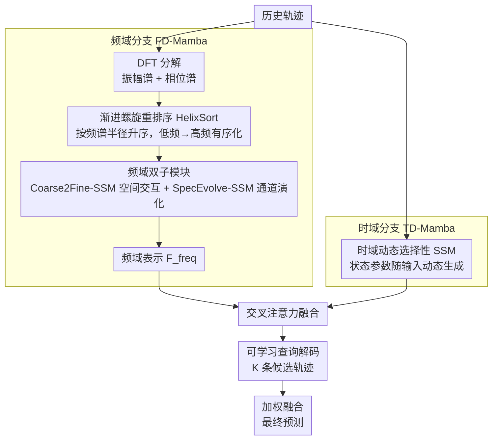

# FoSS: Modeling Long-Range Dependencies and Multimodal Uncertainty in Trajectory Prediction via Fourier–State Space Integration

**会议**: CVPR 2026  
**arXiv**: [2603.01284](https://arxiv.org/abs/2603.01284)  
**代码**: 无  
**领域**: 自动驾驶  
**关键词**: 轨迹预测, 傅里叶变换, 状态空间模型, 双分支架构, 多模态预测

## 一句话总结
FoSS 提出一种频域-时域双分支框架，通过渐进螺旋重排序（HelixSort）将傅里叶频谱有序化后输入选择性状态空间模型（SSM），结合时域动态 SSM 和交叉注意力融合，在 Argoverse 1/2 上取得 SOTA 轨迹预测精度，同时参数量减少 40%+、推理延迟降低 22%。

## 研究背景与动机
自动驾驶中精确的轨迹预测对安全至关重要，尤其在密集多智能体环境中。现有方法面临三重需求的固有权衡：建模跨智能体的长程依赖、表示多模态未来以捕获不确定性、以及满足严格的实时约束。

Transformer 架构通过自注意力实现高精度，但计算复杂度为 $\mathcal{O}(N^2)$，限制了在资源受限系统上的部署。循环模型虽然效率高，但难以捕获长程依赖和细粒度局部动态。仅在时域建模的方法往往混淆全局运动模式与局部动态，而标准傅里叶表示缺乏有序的频率语义，使序列模型难以有效处理频谱信息。

核心观察：轨迹信号在频谱域和时域呈现互补结构——**振幅谱编码全局运动趋势，相位谱捕获细粒度时间变化**。但 DFT 输出不保持从低频到高频的连续排列（因 $\omega$ 和 $T-\omega$ 对应同一物理频率），直接给 SSM 处理会导致模型在全局和局部推理之间不断切换，破坏状态演化。

本文的核心 idea：设计渐进螺旋重排序模块（HelixSort）将 DFT 系数按频谱半径排序，使 SSM 能以粗到细方式处理频谱信息，结合时域 SSM 的长程依赖建模，实现线性复杂度下的高精度多模态轨迹预测。

## 方法详解

### 整体框架
FoSS 采用双分支架构：(1) **频域分支（FD-Mamba）**——对历史轨迹进行 DFT 分解为振幅和相位，经 HelixSort 重排后输入两个并行的 SSM 子模块（Coarse2Fine-SSM 处理空间交互，SpecEvolve-SSM 处理通道演化）；(2) **时域分支（TD-Mamba）**——通过输入依赖的动态 SSM 直接在时序序列上建模长程依赖。两分支通过交叉注意力层融合，再由可学习查询向量解码出 $K$ 条候选轨迹，经加权融合输出最终预测。

### 关键设计

**1. 渐进螺旋重排序（HelixSort）：给频谱排个序，让 SSM 能从粗到细地读**

频域分支的麻烦事在于，DFT 直接吐出来的系数是「无序」的——因为 $\omega$ 和 $T-\omega$ 对应同一物理频率，低频和高频系数在序列里交错排列。把这样的序列喂给 SSM，模型就被迫在「全局趋势」和「局部细节」两种推理模式间反复横跳，状态演化被打断，学不出连贯的频谱语义。HelixSort 的做法是把 1D DFT 系数 $F^{(k)} \in \mathbb{C}^T$ 先 reshape 成 2D 网格 $\mathcal{F}^{(k)} \in \mathbb{C}^{\sqrt{T} \times \sqrt{T}}$，再从频谱中心 $(u_0, v_0)$ 出发沿螺旋方向往外走，按频谱半径 $r = \sqrt{(u-u_0)^2 + (v-v_0)^2}$ 升序排列，生成重排索引 $\pi^{(k)}$，最终得到满足 $\forall i < j,\, r_i \leq r_j$ 的单调有序序列 $\widehat{F}^{(k)}$。

排好序之后，低频集中在序列开头、高频堆到末尾，SSM 就能先积累全局运动趋势、再逐步精调局部细节，天然契合粗到细的推理节奏——这正是它的灵感来源 JPEG zigzag 编码想做的事。代价几乎可以忽略：仅增加 0.08% FLOPs、<0.25MB 内存。

**2. 频域双子模块（Coarse2Fine-SSM + SpecEvolve-SSM）：空间和通道两个维度分头建模频谱**

光有有序频谱还不够，论文进一步让两个子模块从不同维度去吃这份频谱信息。Coarse2Fine-SSM 负责空间维度的交互：对输入特征做 FFT、用 HelixSort 重排振幅与相位、过深度可分离卷积加 SiLU 加选择性 SSM 加 LayerNorm，再 iFFT 回时域，最后与原始特征逐元素相乘做门控，即 $F_f = \text{iFFT}(A'(F_l), P'(F_l)) \odot \text{SiLU}(F_l)$——粗到细地捕获运动轨迹的空间交互。SpecEvolve-SSM 则换到通道维度：先全局平均池化得到通道描述子 $F_g \in \mathbb{R}^{1 \times 1 \times C}$，沿通道维做 FFT 并按幅度升序排列，iFFT 后门控融合 $F_a = \text{iFFT}(A(F_g)', P(F_g)') \odot \text{SiLU}(F_g)$，再回乘原特征得到增强表示 $F_{\text{enhance}} = F_a \odot F_{in}$，刻画不同特征通道之间的频谱相关性。

$$F_{\text{freq}} = \text{Linear}\big(\text{Concat}(F_f,\, F_{\text{enhance}})\big)$$

两路输出沿通道拼接后线性投影，得到最终频域表示。一个管空间交互、一个管通道演化，二者互补，才把频谱里全局模式与局部变化的分离表征都吃下来。

**3. 时域动态选择性 SSM（TD-Mamba）：用输入依赖的状态机在时域逼近注意力**

频域分支抓全局频率结构，但原始时序上下文也不能丢，TD-Mamba 这一支直接在时间序列上以线性复杂度建模长程依赖。关键在于状态转移参数不是固定的，而是随输入动态生成：每个时刻的 $A_t, B_t, C_t, D_t$ 都由当前输入 $X(t)$ 及其局部卷积特征 $\tilde{X}(t) = \text{Conv1D}(X(t))$ 通过轻量 MLP 算出（$A_t = f_A(X(t), \tilde{X}(t))$，其余同理），状态按 $h(t+1) = A_t h(t) + B_t X(t)$ 更新，输出 $Y_{\text{time}}(t) = C_t h(t) + D_t X(t)$，隐状态再经 SiLU 与 LayerNorm 保证数值稳定。

之所以把参数做成输入依赖，是为了让状态机能因时制宜——在关键运动时刻放大有用模式、在平稳段抑制噪声，而 Conv1D 预处理则提升了对局部动态突变的敏感度。这样它就以远低于自注意力 $\mathcal{O}(N^2)$ 的代价，逼近了注意力对长程依赖的捕获能力。两支特征最后经交叉注意力融合，再由可学习查询解码出 $K$ 条候选轨迹。

### 损失函数 / 训练策略
- 联合约束时域和频域：$\mathcal{L}_{\text{total}} = \mathcal{L}_{\text{time}} + \lambda \mathcal{L}_{\text{freq}}$
- 时域损失：$\mathcal{L}_{\text{time}} = \|\hat{Y}_{\text{final}} - Y\|_1$（L1 距离）
- 频域损失：$\mathcal{L}_{\text{freq}} = \|F(\hat{Y}_{\text{final}}) - F(Y)\|_1$（傅里叶变换后的 L1 距离）
- 候选轨迹通过可学习查询 $Q \in \mathbb{R}^{K \times d}$ 与融合特征 $Z$ 的交叉注意力生成，每条候选经 MLP 映射
- 训练：Adam 优化器，学习率 0.001，batch 128，50 epochs，验证集无改善 5 轮则学习率降至 10%

## 实验关键数据

### 主实验

| 数据集 | 指标 | FoSS | 之前SOTA | 提升 |
|--------|------|------|----------|------|
| Argoverse 2 | b-minFDE6↓ | **1.69** | 1.74 (Wayformer) | 2.9% |
| Argoverse 2 | minADE6↓ | **0.61** | 0.63 (DeMo) | 3.2% |
| Argoverse 2 | minFDE6↓ | **1.07** | 1.17 (HiVT/DeMo) | 8.5% |
| Argoverse 2 | MR6↓ | **0.11** | 0.12 (Wayformer) | 8.3% |
| Argoverse 2 | 参数量 | **4.18M** | 5.92M (DeMo) | -29.4% |
| Argoverse 1 | minADE1↓ | **1.67** | 1.65 (DeMo) | 约持平 |
| Argoverse 1 | minFDE1↓ | 2.05 | **2.02** (Wayformer) | 约持平 |
| Argoverse 1 | MR1↓ | **0.11** | 0.11 (多个) | 持平 |

### 消融实验（Argoverse 2）

| 配置 | minADE6↓ | minFDE6↓ | MR6↓ | 说明 |
|------|---------|---------|------|------|
| w/o 频域分支 | 0.71 | 1.36 | 0.17 | 频域线索对全局趋势建模至关重要 |
| w/o HelixSort | 0.69 | 1.32 | 0.16 | 有序频谱遍历提升结构连贯性 |
| w/o Fourier SSM | 0.70 | 1.35 | 0.17 | 选择性 SSM 对频谱时序融合不可或缺 |
| Concat+MLP 替换交叉注意力 | 0.69 | 1.33 | 0.16 | token 级交叉交互优于简单拼接 |
| **Full model** | **0.65** | **1.29** | **0.15** | 所有组件互补最优 |

### 关键发现
- 频域分支可即插即用到其他时序骨干：FD-Mamba+Transformer（b-minFDE 1.77）、FD-Mamba+LSTM（1.91），验证通用性
- 推理延迟仅 64ms（比 QCNet 71ms 快 10%，比 HiVT 82ms 快 22%），FLOPs 22.1G（比 QCNet 51%）
- 参数量 4.18M 为所有对比方法中最小，充分证明效率优势
- 在频繁换道等高频运动场景下仍有轻微抖动，因低频分解可能低估快速横向机动

## 亮点与洞察
- HelixSort 是一个简洁而有效的模块设计：将 JPEG zigzag 编码的思想迁移到频谱重排序，使 SSM 获得有序的频率输入，几乎零开销（0.08% FLOPs）
- 将 DFT 系数的频谱半径解释为"人工时间轴"输入 SSM，巧妙地将频域分析转化为序列建模问题
- 双分支架构的互补性设计合理：频域分支捕获全局模式和局部变化的分离表征，时域分支保留原始时序上下文
- 频域损失的引入保证了预测轨迹不仅在位置上精确，在频率结构上也与真实轨迹一致

## 局限与展望
- 在频繁换道等涉及突发高频运动的场景表现略有下降，因频域分解天然偏向低频成分
- Argoverse 1 上相比 DeMo/Wayformer 的优势不如 Argoverse 2 显著（短程预测的频域优势有限）
- 未考虑地图编码（仅用轨迹数据），与使用高清地图的方法对比有失公平
- HelixSort 需要将序列长度 padding 到完美平方数，对非标准长度输入的处理是否最优未充分讨论

## 相关工作与启发
- 与 Spectral TGN（ICRA 2021）等频域轨迹预测方法比较，FoSS 的创新在于 HelixSort + SSM 的结合，解决了频谱无序性问题
- Mamba/S4 等选择性 SSM 在视频、语音中的成功实践为将其引入轨迹预测提供了基础
- 交叉注意力融合通过归一化和残差连接解决了时域/频域特征尺度不匹配问题，是多域融合的通用策略
- 频域分支的即插即用特性提示可推广到其他时序预测任务（如行为预测、交通流预测）

## 评分
- 新颖性: ⭐⭐⭐⭐ HelixSort + SSM 的频域建模组合有原创性，但双分支融合的整体框架相对常规
- 实验充分度: ⭐⭐⭐⭐ 在 Argoverse 1/2 上全面对比+消融+效率分析+即插即用验证，但缺少 nuScenes 等其他数据集
- 写作质量: ⭐⭐⭐⭐ 公式推导完整，HelixSort 的直觉解释清晰，Figure 1 的频率分解可视化有助理解
- 价值: ⭐⭐⭐⭐ 参数量和延迟的大幅降低对实际部署有直接价值，频域+SSM 的范式对轨迹预测社区有参考意义

<!-- RELATED:START -->

## 相关论文

- [\[CVPR 2026\] U4D: Uncertainty-Aware 4D World Modeling from LiDAR Sequences](u4d_uncertainty-aware_4d_world_modeling_from_lidar_sequences.md)
- [\[CVPR 2025\] OccMamba: Semantic Occupancy Prediction with State Space Models](../../CVPR2025/autonomous_driving/occmamba_semantic_occupancy_prediction_with_state_space_models.md)
- [\[AAAI 2026\] Walking Further: Semantic-aware Multimodal Gait Recognition Under Long-Range Conditions](../../AAAI2026/autonomous_driving/walking_further_semantic-aware_multimodal_gait_recognition_under_long-range_cond.md)
- [\[CVPR 2026\] Den-TP: A Density-Balanced Data Curation and Evaluation Framework for Trajectory Prediction](den_tp_a_density_balanced_data_curation_and_evaluation_framework_for_trajectory.md)
- [\[CVPR 2026\] MetaDAT: Generalizable Trajectory Prediction via Meta Pre-training and Data-Adaptive Test-Time Updating](metadat_generalizable_trajectory_prediction_via_meta_pre-training_and_data-adapt.md)

<!-- RELATED:END -->
