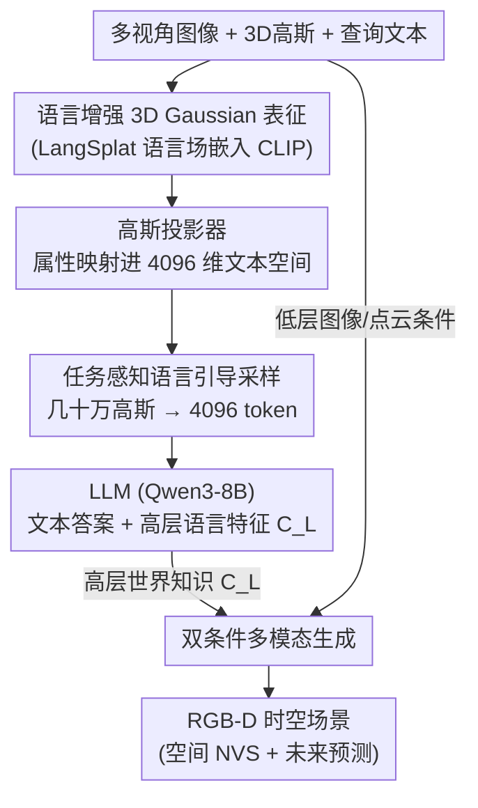

# GaussianDWM: 3D Gaussian Driving World Model for Unified Scene Understanding and Multi-Modal Generation

**会议**: CVPR 2026  
**arXiv**: [2512.23180](https://arxiv.org/abs/2512.23180)  
**代码**: https://github.com/dtc111111/GaussianDWM (有)  
**领域**: 自动驾驶 / 世界模型 / 3D视觉  
**关键词**: 驾驶世界模型, 3D Gaussian, 场景理解, 多模态生成, 视觉问答  

## 一句话总结
GaussianDWM 用「语言增强的 3D Gaussian」作为统一场景表征，把每个高斯椭球嵌入 CLIP 语言特征实现文本与 3D 几何的显式对齐，再经任务感知采样把紧凑 3D token 喂给 LLM，既能做场景理解（描述/2D-3D grounding/规划），又用双条件扩散做 RGB-D 时空生成，在 NuInteract 理解任务上把平均分从 52.12 提到 59.23、在 nuScenes 空间生成上把 ±2m 偏移 FID 压到 11.27。

## 研究背景与动机

**领域现状**：驾驶世界模型（DWM）借生成模型的东风快速发展，主流做法是预测未来的图像 / 点云 / BEV，用来做风险预测、路线优化、corner case 仿真。

**现有痛点**：这些 DWM 只会「按输入条件生成内容」，无法解释、描述或回答关于驾驶环境的问题——你没法对它做视觉问答、要它描述场景或推理空间关系。换句话说它有「生成」能力，但没有「理解」能力。最近 HERMES、UniFuture 先把理解和生成统一起来，但它们用 BEV / 深度特征表示空间信息，文本只能和空间做**特征级（feature-level）对齐**，并不精确——BEV 把 3D 场景拍扁成俯视图，语言对应的是一团模糊的栅格特征，而不是某个具体的 3D 物体。

**核心矛盾**：理解任务需要文本和 3D 场景**精确对齐**，但生成式 DWM 的空间表征（点云 / BEV）天然丢掉了精细的几何与纹理对应关系；同时 3D Gaussian 虽然几何精细，单场景却有几十万个椭球、token 数远超 LLM 上下文上限，没法直接喂进去。

**本文目标**：(1) 找一种能让语言和 3D 几何显式对齐的场景表征；(2) 把它压成 LLM 能吃的紧凑 token；(3) 让理解出来的「世界知识」反过来指导生成。

**切入角度**：3D Gaussian Splatting 同时携带几何（位置/尺度/旋转）、纹理（透明度/外观）和可挂载的语义。如果把语言特征直接嵌进**每一个**高斯椭球，文本就能对应到具体的 3D 基元，而不是一团 BEV 特征——这是 BEV 做不到的早期、显式的模态对齐。

**核心 idea**：用「语言增强的 3D Gaussian」做统一表征，靠任务感知采样解决 token 爆炸，再用「高层语言 + 低层图像」双条件把理解到的世界知识注入生成。

## 方法详解

### 整体框架
GaussianDWM 输入是多视角图像 $\{I_i\}$、预重建好的 3D 高斯椭球 $\{G_i\}$ 和查询文本 $\{t_i\}$，输出既有文本答案（理解），也有 RGB-D 时空场景（生成）。整条管线分三大模块：**World Tokenizer** 把场景编码成语言增强的紧凑 3D token；**Scene Understanding** 用 LLM 解析 token 与指令、产出文本答案和一份高层语言特征 $C_L$；**Multi-modal Generation** 用 $C_L$（高层世界知识）加图像/点云条件（低层几何）双重引导扩散网络生成 RGB 与深度。三者串成「编码 → 理解 → 生成」的闭环，理解出来的世界知识被显式回灌进生成端。

### 关键设计

**1. 语言增强的 3D Gaussian 表征：把语言塞进每个高斯椭球，实现文本与 3D 几何的早期显式对齐**

针对 BEV/点云只能做特征级对齐、文本对不上具体 3D 物体的痛点，本文基于 LangSplat 构建 3DGS 语言场：每个高斯 $G_i$ 额外挂一个语言嵌入 $f_i$，它来自 CLIP 特征、并继承 SAM 提取的层级语义。语言特征像颜色一样按标准 3DGS 渲染公式做 alpha 合成：

$$\boldsymbol{F}(v)=\sum_{i\in\mathcal{N}}f_{i}\alpha_{i}\prod_{j=1}^{i-1}\left(1-\alpha_{j}\right)$$

其中 $\alpha_i = o_i G_i^{2D}(v)$，$o_i$ 是第 $i$ 个高斯的透明度、$G_i^{2D}$ 是它投影到 2D 的函数。由于原始 CLIP 特征是 512 维、几十万个高斯一起存会爆显存，作者额外训练一个 scene-wise 语言自编码器 $E$，把 $\boldsymbol{F}(v)\in\mathbb{R}^{512}$ 压到 $\boldsymbol{H}(v)=E(\boldsymbol{F}(v))\in\mathbb{R}^{3}$（$d=3,\,D=512$），再用解码器 $\Psi$ 还原 CLIP 特征。这样既保住语义保真度又大幅省内存。它有效的关键在于：语言此刻是绑在**具体 3D 基元**上的，文本查询天然能定位到对应的几何，而不是像 BEV 那样对着一团拍扁的栅格猜

**2. 高斯投影器：把异构的高斯属性逐项映射进 LLM 的文本空间**

每个高斯的属性是异构的——位置 $x_i\in\mathbb{R}^3$、透明度 $o_i$、尺度 $s_i$、旋转 $r_i$、CLIP 特征 $f_i$，量纲和分布都不同，直接拼起来送进 LLM 学不动。投影器对每类属性单独处理：位置先过可学习傅里叶嵌入 $\gamma(x_i)=[\sin(2^k\pi x_i),\cos(2^k\pi x_i)]_{k=0}^{L-1}$（$L=10$）保留高频空间信息，透明度过 sigmoid 约束到 $[0,1]$，CLIP 特征用预训练解码器 $\Psi$ 还原成 512 维。然后每类属性各过一个 MLP $\phi_\cdot$ 映射到共享的 4096 维空间，最后用 softmax 归一化的可学习标量 $\alpha_p$ 加权融合成最终的高斯 scene token：

$$\mathcal{G}_i=\sum_{p\in\{x,o,s,r,f\}}\alpha_p\cdot h_i^p$$

逐属性投影 + 可学习权重融合，让模型自己决定「位置 / 语义 / 形状」各占多少分量，比把原始属性硬拼成一个向量更利于 LLM 对齐

**3. 任务感知语言引导混合采样：按任务从几十万高斯里挑出最相关的 4096 个 token**

即便压成 token，单场景几十万个高斯也远超 LLM 上下文上限，而且高度冗余会让 LLM 难以跨视角推理空间关系。本文按任务类型用不同采样：对**场景描述 / 规划**这类需要全局信息的任务，用 uniform + top-k 全局采样选出 $N=4096$ 个有代表性的高斯，保住整体场景信息；对 **2D / 3D visual grounding** 这类需要聚焦的任务，再叠加**语言引导采样**——计算文本查询与各高斯特征的相似度，只保留与查询最相关的那批高斯，把稠密表征重新 token 化成稀疏紧凑的形式。这样做有效是因为 grounding 本质上只关心查询指向的少数物体，相似度过滤直接把「最该看的 3D 空间信息」选择性注入语言推理，消融里它正是 2D/3D VG 涨点的来源（见 Table 2）

**4. 双条件多模态生成：用高层世界知识 + 低层图像条件共同引导扩散**

理解模块产出的不只是文本答案，还有一份高层语言特征 $C_L$，编码了世界知识与空间信息。生成端是一个去噪 UNet + 冻结 VAE：RGB 图像 $I_i$ 和深度图 $D_i$（深度通过通道复制伪装成 RGB）都编码进同一隐空间，$z_I=\mathcal{E}(I_i),\,z_D=\mathcal{E}(D_i)$，深度解码时把三通道取平均还原成单通道。每个时间步把各模态的带噪隐变量与两路条件拼接送入网络：低层条件 $\{C_I,C_D\}$ 来自把周围点云从 $t$ 时刻投影到 $t+n$ 时刻得到的稀疏条件图，约束纹理与几何；高层条件 $C_L$ 来自 LLM 提供世界知识。网络用 v-prediction 目标 $\mathbf{v}_t=\alpha_t\boldsymbol{\epsilon}_t-\sigma_t d_t$ 训练。双条件让生成既贴合像素级几何（低层）又符合语义/时序逻辑（高层）——消融显示只给低层条件 ±1m FID 是 10.12，加上高层世界知识降到 8.36；且对未来预测和大视角偏移这类「靠几何猜不出来」的场景，高层世界知识贡献尤其明显。空间生成做 ±1m/±2m 偏移的新视角合成，时序生成用 LLM 预测的轨迹投影点云做 1s/2s 未来预测

### 损失函数 / 训练策略
理解端用两阶段：先冻结整个 VLM、只训 aligner 做 5k warm-up 步对齐视觉与文本空间，再用 LoRA 微调 LLM 30k 步，两阶段共享 prefix language modeling 目标 $\mathcal{L}(\theta,\mathcal{B})=-\sum\sum_i\log p_\theta(t_{gt}^{(i)}\mid t_{gt}^{(<i)},t_{prefix})$。生成端用 v-prediction 损失 $\mathcal{L}=\mathbb{E}\|\mathcal{F}_\theta(d_t,d_{ref},C_I,C_D,C_L,s)-\mathbf{v}_t\|_2^2$。整体训练分三阶段：先单独训 tokenizer/projector/采样并与 LLM 联合微调（16×A100）；再从低分辨率 RGB→低分辨率 RGB-D→高分辨率 RGB-D 逐步训生成模块；最后端到端联合优化保证理解与生成一致。

## 实验关键数据

### 主实验（NuInteract 场景理解，Table 1）
四个子任务联合评测：区域描述与感知（RDP）、2D 视觉 grounding、3D 视觉 grounding、规划，取平均分。

| 模型 | LLM | 2D VG mAP | 3D VG mAP | Plan Acc | 平均分 Avg ↑ |
|------|-----|-----------|-----------|----------|--------------|
| InternVL2-8B | InternLM2.5-7B | 20.61 | 31.47 | 46.93 | 45.42 |
| DriveMonkey | InternLM2.5-7B | 19.47 | 51.90 | 82.64 | 52.12 |
| **GaussianDWM** | Qwen3-8B | **34.95** | **52.78** | 80.95 | **59.23** |

相对此前 SOTA 提升约 13.6%（平均分）。2D VG 的 mAP 从 DriveMonkey 的 19.47 提到 34.95（接近翻倍），3D VG mAP 52.78 也优于专门的 3D 检测器（如 CAPE 的 32.94），印证显式 3D 几何对齐对 grounding 的价值；规划准确率 80.95 与 DriveMonkey 的 82.64 相当。

### 场景生成（nuScenes 空间 NVS，Table 3）

| 方法 | ±1m FID↓ | ±1m FVD↓ | ±2m FID↓ | ±2m FVD↓ | ±4m FID↓ |
|------|----------|----------|----------|----------|----------|
| StreetGaussian | 32.12 | 153.45 | 43.24 | 256.91 | 67.44 |
| DiST-S | 10.12 | 45.14 | 12.97 | 68.80 | 17.57 |
| **Ours** | **8.36** | **44.50** | **11.27** | **68.17** | 18.81 |

在 ±1m / ±2m 偏移上全面领先，重建式方法（StreetGaussian）在大视角偏移下伪影严重；仅在极端 ±4m FID 上略逊 DiST-S（18.81 vs 17.57），作者归因于扩散生成在极端外推下的固有难度。

### 消融实验（Table 2 理解 + Table 4 生成）

| 配置 | 平均分 Avg | 说明 |
|------|-----------|------|
| zero-shot（无微调、无高斯） | 15.39 | 完全不行 |
| finetuned，w/o Gaussian | 53.32 | 去掉 3D 高斯表征 |
| finetuned，w/ Gaussian + Random 采样 | 55.21 | 随机采样 |
| + Top-k + Uniform | 58.93 | 全局混合采样 |
| + similarity（完整模型） | **59.23** | 叠加语言引导相似度采样 |

| 双条件配置 | ±1m FID↓ | ±2m FID↓ |
|------------|----------|----------|
| 仅高层（无低层） | 失败（–） | 失败（–） |
| 仅低层 | 10.12 | 45.14* |
| 高层 + 低层（完整） | **8.36** | **44.5** |

> ⚠️ Table 4 中「仅低层」的 ±2m 列原文标注为 45.14，与 ±1m FVD 数值相同，疑为排版串列，以原文为准。

### 关键发现
- **3D 高斯表征是地基**：去掉后平均分从 59.23 掉到 53.32（−5.9），是单项贡献最大的组件——证明显式 3D 几何对齐确实让 LLM 更懂空间。
- **相似度采样专治 grounding**：从 Top-k+Uniform（58.93）到加 similarity（59.23）整体只涨 0.3，但 2D VG mAP 从 33.89 涨到 34.95——因为相似度采样只作用于需要聚焦的 grounding 任务，对全局任务无副作用。
- **双条件缺一不可**：仅靠高层语言条件无法生成（几何无依据而失败），低层条件提供几何骨架，高层世界知识则在大偏移/未来预测下把 FID 进一步压低。

## 亮点与洞察
- **「把语言绑在 3D 基元上」是核心 aha**：BEV 让文本对齐一团拍扁的栅格，而把 CLIP 特征嵌进每个高斯椭球，文本查询能直接定位到具体 3D 物体——这是 grounding mAP 接近翻倍的根因，也是「显式对齐 > 特征级对齐」的最佳论证。
- **任务感知采样把「token 爆炸」变成「按需取用」很巧妙**：全局任务用均匀+top-k 保全景、grounding 用文本相似度做稀疏聚焦，一套表征两种采样策略，避免了「一刀切下采样丢关键物体」。这个「按任务/查询动态选 token」的思路可迁移到任何 3D-LLM 场景（如室内 3D 问答、机器人操作）。
- **理解反哺生成的闭环**：把 LLM 抽出的世界知识当高层条件回灌扩散，让生成不只贴像素、还符合语义与时序逻辑，是「统一理解+生成」真正落地而非两个模块拼接的体现。

## 局限与展望
- **依赖预重建的 3D 高斯**：方法假设输入已有重建好的高斯椭球，重建质量和耗时直接决定上限；端到端从图像即时重建高斯仍是缺口。
- **极端外推下生成退化**：±4m 偏移 FID 反而落后 DiST-S，说明大视角/长时序外推时扩散生成的几何一致性仍不稳。
- **采样阈值与 4096 token 预算**：token 数和 top-k 比例是固定超参，复杂场景（密集车流）下 4096 个高斯是否够、稀疏场景是否浪费，论文未充分分析。
- **评测局限于 nuScenes/NuInteract**：跨数据集、跨城市/天气的泛化未验证，世界知识是否会过拟合到特定 benchmark 分布存疑。

## 相关工作与启发
- **vs HERMES / UniFuture**：同样统一理解与生成，但它们用 BEV/深度做特征级对齐；本文用语言增强 3D Gaussian 做显式空间对齐，grounding 精度更高，是本文最直接对标的工作。
- **vs DriveMonkey（NuInteract SOTA）**：DriveMonkey 用可学习 query + 空间处理器接 LVLM；本文用 3D 高斯 token + 任务感知采样，2D/3D VG 显著领先，规划相当，证明几何精细的 3D 表征对空间理解的增益。
- **vs DiST-4D / MagicDrive 等生成式 DWM**：它们专注高质量生成但无理解能力；本文把理解出的世界知识当高层条件，使生成在大偏移/未来预测下更一致。
- **vs GaussianVLM**：同样用 3D 高斯做 VQA（SceneSplat 风格 VAE 编码），但本文进一步加了任务感知采样解决 token 爆炸，并把表征延伸到生成端。

## 评分
- 新颖性: ⭐⭐⭐⭐⭐ 首个基于 3D Gaussian 的统一驾驶世界模型，「语言嵌进高斯做显式对齐 + 任务感知采样 + 双条件生成」组合有清晰创新。
- 实验充分度: ⭐⭐⭐⭐ NuInteract 理解 + nuScenes 生成双线对比充分，消融到位；但跨数据集泛化、采样超参敏感性分析不足。
- 写作质量: ⭐⭐⭐⭐ 三模块结构清晰、公式完整；个别表格（Table 4）排版有串列嫌疑。
- 价值: ⭐⭐⭐⭐⭐ 把「理解」能力真正塞进驾驶世界模型并反哺生成，为统一 DWM 指出可落地的 3DGS 路线，代码开源。

<!-- RELATED:START -->

## 相关论文

- [\[ICCV 2025\] Hermes: A Unified Self-Driving World Model for Simultaneous 3D Scene Understanding and Generation](../../ICCV2025/autonomous_driving/hermes_a_unified_self-driving_world_model_for_simultaneous_3d_scene_understandin.md)
- [\[CVPR 2026\] Unifying Language-Action Understanding and Generation for Autonomous Driving](unifying_language-action_understanding_and_generation_for_autonomous_driving.md)
- [\[CVPR 2026\] F3DGS: Federated 3D Gaussian Splatting for Decentralized Multi-Agent World Modeling](f3dgs_federated_3d_gaussian_splatting_for_decentralized_multi-agent_world_modeli.md)
- [\[CVPR 2026\] WorldLens: Full-Spectrum Evaluations of Driving World Models in Real World](worldlens_full-spectrum_evaluations_of_driving_world_models_in_real_world.md)
- [\[CVPR 2026\] MeanFuser: Fast One-Step Multi-Modal Trajectory Generation and Adaptive Reconstruction via MeanFlow for End-to-End Autonomous Driving](meanfuser_fast_one-step_multi-modal_trajectory_generation_and_adaptive_reconstru.md)

<!-- RELATED:END -->
