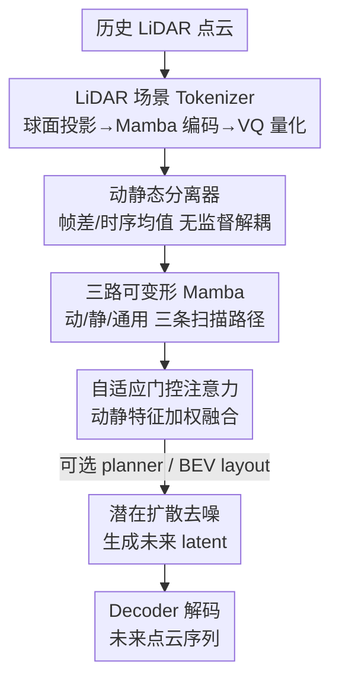

# GEM: Generating LiDAR World Model via Deformable Mamba

**会议**: CVPR 2026  
**论文**: [CVF Open Access](https://openaccess.thecvf.com/content/CVPR2026/html/Wu_GEM_Generating_LiDAR_World_Model_via_Deformable_Mamba_CVPR_2026_paper.html)  
**代码**: https://github.com/wuyang98/GEM  
**领域**: 自动驾驶 / LiDAR 世界模型 / 扩散模型  
**关键词**: LiDAR 世界模型, Deformable Mamba, 动静态解耦, 潜在扩散, 自动驾驶  

## 一句话总结
GEM 把 LiDAR 扫描序列和 Mamba 的逐步扫描机制对齐，用一个 Mamba 场景 tokenizer 把无序点云压成有序 latent，再无监督地把动态物体和静态环境解耦、用三路可变形 Mamba 分别建模，最终在 nuScenes/KITTI 上的 1s/3s 未来预测全面刷新 SOTA（1s 上 Chamfer Distance 比次优方法降 81%），并额外支持自动 rollout 和 BEV 可控 "what-if" 生成。

## 研究背景与动机
**领域现状**：自动驾驶世界模型（给定历史观测预测未来传感器数据）已经在相机视频和 occupancy 两条路线上发展得比较成熟，但 LiDAR 这条路线明显落后——尽管 LiDAR 能提供最精确的几何信息、可扩展性也更好。

**现有痛点**：现有 LiDAR 世界模型有两类做法，都没把 LiDAR 的特性吃透。一类（4D-Occ、Copilot4D）把点云投成稠密 voxel 或 BEV 特征，量化和投影会丢掉细粒度几何细节，预测保真度下降；另一类把点云转成 range image 后用 CNN/Transformer 提特征，但 CNN/Transformer 的处理机制和激光逐线扫描的"序列"本质并不匹配。更要命的是，这些方法把动态物体和静态背景的特征**纠缠**在一起建模，导致几何精度差、时序不一致；而且它们都依赖真值未来 ego status 做输入，无法自主 rollout，也不支持可控生成。

**核心矛盾**：点云的两大固有难点——**无序性**（无法直接套用结构化数据的成熟技术）和**语义弱**（没有相机的纹理、没有 occupancy 的语义标签，难以区分"会动的"和"不动的"）——恰恰是现有结构化中间表示和纠缠式建模回避而非解决的。

**切入角度**：作者观察到，激光雷达"一条线一条线顺序扫描"的物理过程，和 Mamba"沿序列逐步聚合特征"的状态空间机制天然同构。既然如此，与其把点云硬塞进为图像设计的架构，不如顺着 LiDAR 自己的扫描结构来建模。

**核心 idea**：用 Mamba 替代 CNN/Transformer 来匹配 LiDAR 的序列扫描，并显式地把动态/静态特征**解耦**后分路建模——即"用对齐扫描结构的可变形 Mamba + 无监督动静解耦"来同时解决无序性和语义弱两个问题。

## 方法详解
### 整体框架
GEM 建立在**潜在扩散（latent diffusion）**范式上，整条流水线分三段：① 一个 LiDAR 场景 tokenizer 把无序点云压成有序 latent 序列；② 在 latent 上做无监督动静解耦 + 三路可变形 Mamba 提特征；③ 用扩散过程从噪声中去噪生成未来帧的 latent，再解码回点云。形式上，时刻 $u$ 给定 $\tau_p$ 帧历史点云 $P_p$ 及其 ego status，目标是预测 $\tau_f$ 帧未来点云 $P_f$。tokenizer 的 encoder $E$ 把历史点云编成 $Z_p\in\mathbb{R}^{\tau_p\times h\times w\times C}$，控制信号（历史/未来 ego status、可选 BEV layout）编成条件特征，Mamba 世界模型输出 $\hat Z_f\in\mathbb{R}^{\tau_f\times h\times w\times C}$，最后由 decoder $D$ 解码成预测点云。可选地，挂一个 planner 自主预测未来 ego status（实现自动 rollout），或喂 BEV layout 实现可控生成。

### 关键设计

**1. LiDAR 场景 Tokenizer：用 Mamba 把无序点云压成结构忠实的 latent**

这一步针对"点云无序、无法直接建模"的痛点。作者先用球面投影把点云 $P$ 转成 range map $R\in\mathbb{R}^{H\times W}$，其中 $H$ 是垂直激光线数、$W$ 是每扫描的水平分辨率，每个像素存某条激光在某方位角上的距离——这正好把"逐线扫描"组织成一张规整的 2.5D 图。关键在于编码器：它先做一次 **Mamba scan**（让扫描顺序贴合激光物理扫描），再接 6 个常规层块下采样得到 latent $z\in\mathbb{R}^{h\times w\times C}$；重建时 $z$ 经码本量化成 $\hat z$ 再由 decoder 还原 range map。训练用向量量化重建损失

$$L_{VQ}=\mathbb{E}_R\lVert R-\hat R\rVert+\beta\cdot\lVert \mathrm{sg}(z)-\hat z\rVert+\lVert z-\mathrm{sg}(\hat z)\rVert$$

其中 $\mathrm{sg}(\cdot)$ 是 stop-gradient。但纯 MSE 会让相邻像素过度平滑，而 range map 的高频信息（物体边缘、场景结构）恰恰最关键，于是额外引入判别器 $S$ 做对抗训练 $L_{ADV}=\mathbb{E}_R[\log S(R)+\log(1-S(\hat R))]$，总损失 $L_{LST}=L_{VQ}+L_{ADV}$。消融（表 6）显示，仅 Mamba 的 tokenizer 就已超过带判别器的 CNN/Transformer 版本，再加判别器还能进一步提升——印证了 range map 结构与 Mamba 扫描的天然对齐。

**2. 无监督动静态分离器：不用语义标注就把"会动的"和"不动的"拆开**

这一步针对"LiDAR 语义弱、动静纠缠"的痛点。作者不愿付出昂贵的语义标注，于是利用一个朴素但有效的观察：**动态物体在帧间会变，静态环境基本不变**。据此从 latent $Z\in\mathbb{R}^{\tau\times h\times w\times C}$ 抽两路互补线索。动态线索用帧间差分：$Z_d[i]=Z[:,i]-Z[:,i-1]$（首帧置 0）；静态线索用大小为 $n$ 的滑窗时序平均 $Z_s[i]=\frac{1}{\text{end}-\text{start}}\sum Z[i]$。随后三个结构相同的 3D 卷积 extractor 把 $Z,Z_d,Z_s$ 转成 $F,F_d,F_s$，再用自适应门控注意力做数据相关融合：

$$F'=(1-G(C[F_d,F_s]))\cdot F_d+G(C[F_d,F_s])\cdot F_s,\quad F_g=(1-G(F'))\cdot F+G(F')\cdot F'$$

其中 $G(\cdot)$ 是卷积+激活构成的门控函数、$C[\cdot,\cdot]$ 是通道拼接。最终得到动态 $F_d$、静态 $F_s$ 和融合后的通用特征 $F_g$。这套"帧差 + 时序均值"的设计巧在完全无需标注就提供了区分动静的判别性线索，可扩展性强。

**3. 三路可变形 Mamba：让扫描路径主动"偏向"动态或静态区域**

光把动静特征拆出来还不够，得让模型真正用它们去引导建模——这是本设计的着力点。作者给通用、动态、静态三条支路各配一条扫描路径 $p_\gamma\in\mathbb{R}^{(\tau\times h\times w)\times 3}$（$\gamma\in\{g,d,s\}$）。通用支路用标准网格路径 $p_g=\mathrm{Flatten}(\mathrm{Meshgrid}(\mathrm{Linspace}(C)))$；动态/静态支路则在通用路径基础上学一个偏移：

$$p_d=p_g+\mathrm{Tanh}(\mathrm{Linear}(\mathrm{ReLu}(\mathrm{Linear}(F_d)))),\quad p_s=p_g+\mathrm{Tanh}(\mathrm{Linear}(\mathrm{ReLu}(\mathrm{Linear}(F_s))))$$

也就是用前面算好的 $F_d,F_s$ 当"动态/静态元素在哪"的指示器，把扫描点主动挪向对应区域（论文图 4 可视化了这种位移：动态/静态路径点确实漂向不同区域）。每条支路先沿自己的路径做双线性插值采样 $\bar F_\gamma=\mathrm{BI}(F_g,p_\gamma)$，再做 Mamba 操作 $F'_\gamma=\mathrm{DM}(\bar F_\gamma)$，得到 $\{F'_g,F'_d,F'_s\}$，最后又用一次自适应门控注意力融成更新后的 $F_g$，完成一个 block。实现中堆 4 个这样的 block 迭代 refine。它的妙处在于：动态支路抓局部物体演化、静态支路抓全局场景、通用支路保持全局连贯，三者并行但通过可学习偏移各司其职，既分离又不丢全局一致性。

**4. 潜在扩散 + 可选 planner/可控生成：把世界模型变成能自主推演、能 "what-if" 的生成器**

GEM 用扩散范式做生成：训练时未来 latent $Z_f$ 加噪成 $Z_f^t=\sqrt{\alpha_t}Z_f+\sqrt{1-\alpha_t}\epsilon_t$，世界模型在每个去噪步预测噪声 $\hat\epsilon_t$，目标 $L_{LD}=\mathbb{E}[\lVert\epsilon_t-\mathrm{WM}(Z_f^t,Z_p^t,t,c;\theta)\rVert^2]$，推理时从纯噪声迭代去噪生成未来帧。针对"未来 ego status 实际未知、却被前人当真值喂入"这一被忽视的问题，作者挂一个与世界模型联合训练的 planner（借鉴 BEV-Planner）来预测 ego status，$L_{Planner}=\lVert a_f-\mathrm{Planner}(a_p;\eta\mid\theta_{WM})\rVert^2$，从而实现真正的自主 rollout。控制信号 $c$（ego status、时间戳、可选 BEV layout）通过自适应 group normalization 注入，统一架构兼容多种控制源，支持物体增删等可控 "what-if" 生成。总目标 $L=L_{LD}+L_{Planner}$。

### 损失函数 / 训练策略
两阶段训练：① 先训 LiDAR 场景 tokenizer 80 epoch（Adam，lr 4e-4），损失 $L_{LST}=L_{VQ}+L_{ADV}$；② 再训世界模型 1.2M 步（AdamW，lr 2e-4），损失 $L=L_{LD}+L_{Planner}$。默认 8×H20 GPU。nuScenes 上 1s/3s 分别用 2/6 帧历史，KITTI Odometry 用 5 帧预测 5 帧。

## 实验关键数据

### 主实验
nuScenes 世界建模精度（1s 预测，越低越好）：

| 方法 | CDinner ↓ | L1 ↓ | AbsRel ↓ | CD ↓ |
|------|-----------|------|----------|------|
| 4D-Occ | 1.41 | 1.40 | 10.37 | 2.81 |
| Copilot4D（次优） | 0.36 | 1.30 | 8.58 | 2.01 |
| **GEM（本文）** | **0.30** | **0.98** | **6.67** | **0.38** |

1s 上全指标最优，CD 相比次优 Copilot4D 从 2.01 降到 0.38（**降 81.1%**）。3s 上除 AbsRel 略逊 Copilot4D 外其余全胜。KITTI Odometry 上 1s/3s 全面领先（如 1s CD 0.17 vs Copilot4D 0.21）。两个稳定性指标 $L1_{sr}$、$AbsRel_{sr}$（定义为 1 与"误差分布中位数/均值之比"的绝对差，越接近 0 越稳）也最低，说明解耦建模带来更稳的时序预测。速度上 4090 GPU 实测 nuScenes 9.23 FPS、KITTI 4.67 FPS，均快于 4D-Occ（7.41/3.21 FPS）。

生成分布真实度（KITTI-360，对比单帧生成方法）：GEM 在 5 个指标中 4 个最优（FSVD 23.3、FPVD 18.7、JSD 0.125 等），说明生成的 LiDAR 序列不仅准还更逼真。

### 消融实验
架构替换（nuScenes 3s，表 4）：

| 配置 | CD ↓ | L1 ↓ | 说明 |
|------|------|------|------|
| UNet | 1.07 | 1.85 | 普通卷积去噪骨干 |
| DiT | 0.90 | 1.69 | Transformer 去噪 |
| Vision Mamba | 0.89 | 1.64 | 普通 Mamba |
| Triple Mamba | 0.72 | 1.49 | 三路但用标准 Mamba（非可变形） |
| **GEM（本文）** | **0.67** | **1.43** | 三路可变形 Mamba |

与 Triple Mamba 的对比尤其关键：参数量相近，但显式动静建模 + 可变形扫描把 CD 从 0.72 压到 0.67，证明增益来自"解耦设计"而非"堆参数"。

各组件贡献（nuScenes 3s，表 5，相对完整模型 CD 0.67、L1 1.43 的下降幅度）：

| 去掉的组件 | L1 退化 | CD 退化 | 说明 |
|------------|---------|---------|------|
| 去动态 extractor + 动态可变形 Mamba (DE+DDM) | ↓9.1% | ↓50.7% | 时序一致性显著变差 |
| 不用动静特征引导可变形 Mamba | ↓17.5% | ↓74.6% | 退化最严重，证明必须显式建模才能用好判别性特征 |
| 去自适应门控注意力 (AGA) | AbsRel ↓4.4% | ↓23.9% | 跨支路融合很重要 |

### 关键发现
- **贡献最大的是"用动静特征去引导可变形 Mamba 扫描"**：一旦不用动静线索引导路径，CD 暴跌 74.6%——说明把动静特征单纯拆出来不够，必须靠可变形扫描把它们真正用进建模里。
- **解耦带来的不只是精度，还有稳定性**：$L1_{sr}/AbsRel_{sr}$ 更低，预测随时间外推不易崩，这是纠缠式方法的通病被解掉了。
- **自动 rollout 代价很小**：用 planner 自预测未来 ego status 时性能仅轻微下降，却仍超过那些依赖真值未来 ego 的方法（图 6），说明 GEM 真能"自己往前推演世界"。

## 亮点与洞察
- **架构-物理同构是全文支点**：把"激光逐线扫描"和"Mamba 序列状态更新"对齐，这一观察既给了 range map+Mamba tokenizer 的合理性，也顺势把"无序点云"问题转成"有序序列建模"，比硬投 voxel/BEV 更省细节。
- **无监督动静解耦的 trick 很轻量也很可迁移**："帧差抓动、时序均值抓静"不需要任何标注，几乎可以无痛搬到其他时序点云/视频的前背景分离任务上。
- **可变形扫描路径 = 给 Mamba 装上"注意力"**：通过 $p_d=p_g+\mathrm{Tanh}(\cdot)$ 让一维扫描主动偏向感兴趣区域，相当于在保持 Mamba 线性复杂度的同时获得了类似可变形注意力的空间选择性，这个思路在密集预测里很有想象空间。
- **把"未来 ego status 未知"当成一等问题**：前人默认喂真值未来位姿，GEM 用联合 planner 补上这块，让世界模型从"预测器"变成可"自主 rollout + 反事实推演"的闭环模拟器。

## 局限与展望
- **可控生成与 planner 是"optional"**：论文把它们定位为可选模块，对其稳定性、长时程 rollout 的累积误差着墨不多，长时间自主推演是否会漂移仍待验证。⚠️ 表 5 的 checkmark 网格在缓存文本里难以逐行精确对齐，正文给出的各组件下降百分比是更可靠的依据。
- **依赖 range map 投影**：球面投影本身对超远/超稀疏点、多回波等场景可能损失信息，range map 的固定分辨率也限制了对极稀疏远处目标的刻画。
- **3s 长时预测仍有短板**：3s 设置下 AbsRel 略逊 Copilot4D，说明更长时程的相对深度精度还有提升空间；可探索更强的时序先验或分层去噪。
- **评测仍偏几何指标**：CD/L1/AbsRel 衡量几何保真，但对"语义级动态行为是否合理"（如车辆轨迹是否符合交规）缺乏直接评估。

## 相关工作与启发
- **vs 4D-Occ / Ray Tracing（voxel/occupancy 路线）**：它们把点云投成体素再建模，丢几何细节且动静纠缠；GEM 直接在 range map 序列上用 Mamba 建模并显式解耦动静，nuScenes 1s CD 从 2.81 降到 0.38，且推理更快。
- **vs Copilot4D（压缩 BEV 特征交互）**：Copilot4D 靠压缩 BEV 特征做强，但同样未对 LiDAR 扫描结构和动静分离下功夫；GEM 在多数指标超过它，仅 3s AbsRel 略逊。
- **vs LiDM / Text2LiDAR / WeatherGen（单帧 LiDAR 生成）**：这些方法能生成高保真单帧但缺时序一致性；GEM 生成的是时序连贯的 LiDAR 序列，KITTI-360 上 5 指标 4 项最优。
- **vs Vision Mamba / Triple Mamba（普通 Mamba 变体）**：相同范式下，GEM 的可变形 + 动静解耦设计在参数相近时仍更优，证明增益来自结构设计而非容量。

## 评分
- 新颖性: ⭐⭐⭐⭐⭐ 首个把可变形 Mamba 扫描 + 无监督动静解耦引入 LiDAR 世界模型，并补上自主 rollout/可控生成能力。
- 实验充分度: ⭐⭐⭐⭐⭐ 双数据集双时长、精度+真实度+速度多维度对比，消融拆到每个组件且给出明确下降幅度。
- 写作质量: ⭐⭐⭐⭐ 动机-方法-实验逻辑清晰，公式完整；个别图表（动静分离/三路结构）信息密度高，纯文字略难还原。
- 价值: ⭐⭐⭐⭐⭐ 大幅刷新 LiDAR 世界建模 SOTA，且为低成本大规模 LiDAR 数据合成与闭环仿真打开了实用路径。

<!-- RELATED:START -->

## 相关论文

- [\[CVPR 2026\] SparseWorld-TC: Trajectory-Conditioned Sparse Occupancy World Model](sparseworld_tc_trajectory_conditioned_sparse_occupancy_world_model.md)
- [\[CVPR 2026\] Deformable Gaussian Occupancy: Decoupling Rigid and Nonrigid Motion with Factorized Distillation](deformable_gaussian_occupancy_decoupling_rigid_and_nonrigid_motion_with_factoriz.md)
- [\[CVPR 2025\] Trajectory Mamba: Efficient Attention-Mamba Forecasting Model Based on Selective SSM](../../CVPR2025/autonomous_driving/trajectory_mamba_efficient_attention-mamba_forecasting_model_based_on_selective_.md)
- [\[CVPR 2026\] U4D: Uncertainty-Aware 4D World Modeling from LiDAR Sequences](u4d_uncertainty-aware_4d_world_modeling_from_lidar_sequences.md)
- [\[CVPR 2026\] GaussianDWM: 3D Gaussian Driving World Model for Unified Scene Understanding and Multi-Modal Generation](gaussiandwm_3d_gaussian_driving_world_model_for_unified_scene_understanding_and_.md)

<!-- RELATED:END -->
