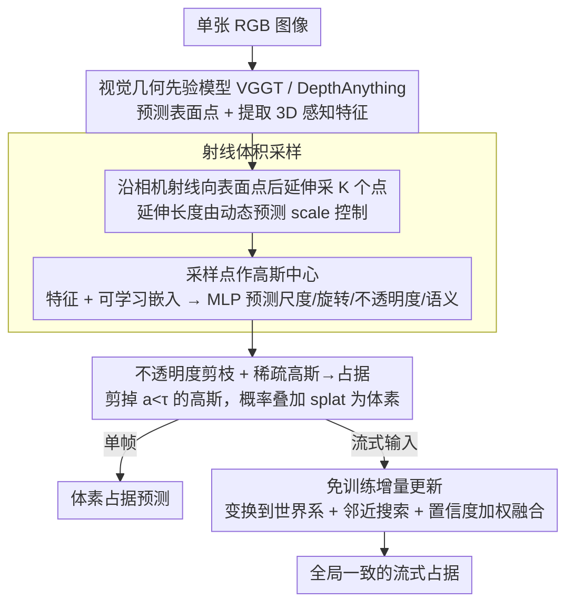

# Generalizing Visual Geometry Priors to Sparse Gaussian Occupancy Prediction

**会议**: CVPR 2026  
**arXiv**: [2602.21552](https://arxiv.org/abs/2602.21552)  
**代码**: [https://github.com/JuIvyy/GPOcc](https://github.com/JuIvyy/GPOcc)  
**领域**: 自动驾驶  
**关键词**: 占据预测, 视觉几何先验, 高斯表示, 射线采样, 流式更新

## 一句话总结
GPOcc 提出利用可泛化的视觉几何先验（如 VGGT、DepthAnything）进行单目 3D 占据预测，通过沿相机射线向内延伸表面点生成体积采样，以稀疏高斯基元进行概率占据推断，并设计免训练增量更新策略处理流式输入，在 Occ-ScanNet 上单目 mIoU 提升 +9.99、流式提升 +11.79 超越前 SOTA，同时在相同深度先验下速度快 2.65 倍。

## 研究背景与动机
3D 场景理解是具身智能的核心能力，占据预测通过提供前景物体和背景结构的统一体素化表示，成为导航、操作、自动驾驶等下游任务的关键基础模块。

室内场景的细粒度占据预测比户外自动驾驶更具挑战：空间布局杂乱、物体类别多样。现有方法如 ISO 利用深度分布将 2D 特征提升到稠密 3D 体积再用 3D U-Net 处理，但密集表示导致大量计算浪费在空区域。EmbodiedOcc 随机初始化高斯基元并通过迭代交叉注意力精化，但许多高斯落在空区域，表示效率低下。

与此同时，视觉几何基础模型（如 DepthAnything 系列、VGGT 等视觉几何模型 VGM）正快速发展，能提供丰富的深度、点图和相机参数等 3D 先验。**但这些模型的输出本质上是面向表面的**——深度图和点图限于可见表面，每个像素仅对应一个 3D 表面点，体积内部无法表示。如何将"表面先验"转化为"体积先验"是核心未解决问题。

GPOcc 的核心 idea：沿相机射线将预测的表面点向内延伸，生成体积采样点作为高斯基元中心，用稀疏高斯概率公式推断占据，并通过不透明度剪枝保持高效。

## 方法详解

### 整体框架
给定单张 RGB 图像，视觉几何先验模型（VGGT 或 DepthAnything）预测表面点并提取 3D 感知特征。射线体积采样模块将表面点沿相机射线向内延伸，生成的采样点作为高斯中心。提取的特征与可学习嵌入结合，经 MLP 预测高斯属性（尺度、旋转、不透明度、语义特征）。经不透明度剪枝后，稀疏高斯通过概率公式 splat 为体素占据。流式场景下，免训练增量更新策略将单帧高斯融入全局记忆库。

### 关键设计

**1. 射线体积采样：把"只有表面"的几何先验撑成"有内部"的体积先验**

VGGT、DepthAnything 这类视觉几何模型再强，吐出来的也只是一层可见表面——每个像素一个 3D 点，物体背后的厚度和内部一片空白。GPOcc 的做法是顺着相机射线往表面点后面再补一段：对像素 $(u,v)$，已知深度 $\mathbf{d}_{(u,v)}$ 和归一化射线方向 $\mathbf{r}_{(u,v)} = \frac{[x, y, 1]^\top}{\sqrt{x^2+y^2+1}}$，就在表面点之后沿射线采 $K$ 个点 $\mathbf{x}_{(u,v,k)} = (\mathbf{d}_{(u,v)} + \delta_k)\,\mathbf{r}_{(u,v)}$。这里 $\{\delta_k\}_{k=1}^K = \text{linspace}(0,1,K)\cdot\text{scale}(\cdot)$，延伸的"深度"由网络动态预测的 scale 控制，让大物体延伸得长、小物体延伸得短，从而贴合不同尺寸的真实厚度。这些采样点直接当作高斯基元的中心。每个点的属性怎么来？引入一个可学习嵌入 $\mathbf{E} \in \mathbb{R}^{K \times C}$，把它广播加到 1/4 降采样的特征图上 $\hat{\mathbf{F}}^{1/4} = \mathbf{F}^{1/4} \oplus \mathbf{E}$，再过一个 MLP 一次性预测出尺度、旋转、不透明度、语义特征 $\{s_i, r_i, a_i, c_i\} = \text{MLP}(\hat{\mathbf{F}}^{1/4})$。相比稠密 3D 锚点或把整张图提升成全 3D 体积，沿射线向内延伸是从 2D 到 3D 最省力的一步——只在确实有物体的地方铺点，空区域根本不碰。

**2. 不透明度剪枝 + 稀疏高斯到占据：让空区域"自然为空"，而不是逐体素去判空**

有了散落在物体表面和内部的稀疏高斯，体素占据靠概率叠加直接读出来（沿用 GaussianFormer2 的公式）：

$$\hat{o}(p; \mathbf{G}) = \sum_{i \in \mathcal{N}(p)} g_i(p; \mu_i, s_i, r_i, a_i, c_i), \quad o(p; \mathcal{G}_i) = \exp\!\Big(-\tfrac{1}{2}(p-\mu_i)^\top \Sigma_i^{-1}(p-\mu_i)\Big)$$

某个体素 $p$ 的占据值，就是它邻域内各高斯贡献之和；离所有高斯都远的体素，叠加值趋近于零，天然被判为空。这正是和 EmbodiedOcc 拉开差距的地方：后者预先撒一片稠密 3D 高斯锚点再逐个分类，大量算力浪费在空气上；GPOcc 的高斯本就集中在物体上，没有高斯覆盖的空间不需要额外判断就是空的。在此基础上再把不透明度低于阈值 $\tau = 0.01$ 的高斯剪掉，进一步压缩冗余、控制总数。

**3. 免训练增量更新策略：单帧预测顺手攒成全局一致的流式场景**

单帧模型怎么扩展到视频流，又不想重新训练一套时序模块？GPOcc 维护一个全局高斯记忆库 $\mathcal{M}$：每帧预测的高斯先用相机位姿变换到世界坐标系，再在记忆库里做半径 $\epsilon$ 的空间邻近搜索。找到邻居的就加权平均融进去，

$$\theta_i \leftarrow \frac{\gamma p_i \theta_i + (1-\gamma) \sum_j p_j \theta_j}{\gamma p_i + (1-\gamma) \sum_j p_j}, \quad \theta \in \{\mu, \Sigma, a, c\}$$

没有邻居的新高斯则直接插入记忆库。权重里藏了两个巧思：取 $\gamma < 0.5$ 让新到的这一帧权重更高，倾向于相信最新观测；而 top-1 类别置信度 $p$ 当作权重，相当于把语义一致性和不确定性也一并融进去——越自信的预测越主导融合结果。整套流程没有一个需要训练的参数，纯靠空间邻近 + 置信度加权就把逐帧观测攒成时序平滑的全局表示。

### 损失函数 / 训练策略
- 复合损失函数：$\mathcal{L} = L_{\text{focal}} + L_{\text{lov}} + L_{\text{scal}}^{\text{geo}} + L_{\text{scal}}^{\text{sem}} + L_{\text{depth}}$
    - $L_{\text{focal}}$：focal loss 处理类别不平衡
    - $L_{\text{lov}}$：Lovász-Softmax loss 优化 IoU
    - $L_{\text{scal}}^{\text{geo/sem}}$：场景类别亲和力损失（几何+语义）
    - $L_{\text{depth}}$：Huber 深度损失，端到端优化几何一致性（不同于 EmbodiedOcc 依赖外部预训练深度估计器）
- 训练：AdamW（weight decay 0.01），10 epochs，batch 8，4×A800 GPU，学习率 cosine 衰减至 $2 \times 10^{-4}$
- 输入图像长边缩放至 518px，梯度裁剪 1.0

## 实验关键数据

### 主实验

| 数据集 | 指标 | GPOcc-VGGT | GPOcc-DPT | EmbodiedOcc++ | 提升(VGGT) |
|--------|------|-----------|-----------|---------------|------------|
| Occ-ScanNet（单目） | IoU↑ | **63.14** | 56.96 | 54.90 | +8.24 |
| Occ-ScanNet（单目） | mIoU↑ | **56.19** | 51.88 | 46.20 | +9.99 |
| EmbodiedOcc-ScanNet（流式） | IoU↑ | **61.41** | 56.39 | 52.20 | +9.21 |
| EmbodiedOcc-ScanNet（流式） | mIoU↑ | **55.39** | 51.22 | 43.60 | +11.79 |

### 效率对比（Occ-ScanNet）

| 模型 | IoU | mIoU | FPS | 参数量 |
|------|-----|------|-----|--------|
| ISO | 42.16 | 28.71 | 3.63 | 303.05M |
| EmbodiedOcc | 53.55 | 45.15 | 10.66 | 231.45M |
| **Ours-DPT** | **56.96** | **51.88** | **28.22** | **97.95M** |
| Ours-VGGT | 63.14 | 56.19 | 5.26 | 942.31M |

### 消融实验

| 配置 | mIoU | IoU | #Gaussians | 说明 |
|------|------|-----|------------|------|
| K=1（仅表面点） | 47.88 | 53.10 | 3079 | 无内部采样性能最差 |
| K=4 | 55.28 | 60.35 | 2731 | 内部采样大幅提升 |
| K=16（默认） | **56.19** | **63.14** | 5876 | 精度饱和，最佳效率点 |
| K=32 | 56.72 | 63.84 | 20206 | 边际收益递减 |
| τ=0.01（默认） | **56.19** | **63.14** | 5876 | 最佳阈值 |
| τ=0.05 | 54.16 | 60.84 | 1612 | 剪枝过多 |
| τ=0.10 | 52.65 | 58.31 | 930 | 严重损失精度 |

### 关键发现
- 相同深度先验（DepthAnything）下，GPOcc-DPT 比 EmbodiedOcc 快 2.65 倍（28.22 vs 10.66 FPS），mIoU 高 +6.73，参数量不到一半（97.95M vs 231.45M）——充分证明射线采样+稀疏高斯的架构效率优势
- 从 K=1（仅表面点）到 K=16，mIoU 提升 +8.31，IoU 提升 +10.04，证明体积内部采样的必要性
- 更强的几何先验（VGGT vs DPT）带来一致额外增益（+4.31 mIoU），说明框架能充分受益于更强的基础模型
- 不透明度剪枝在 τ=0.01 几乎不损失精度但有效控制高斯数量

## 亮点与洞察
- "沿射线向内延伸"是将表面先验转化为体积先验的最自然思路，简洁而有效
- 稀疏高斯天然聚焦在物体区域，没有高斯覆盖的空间自动为空体素，避免了稠密方案的大量浪费
- 免训练增量更新策略的设计巧妙：利用空间邻近融合+置信度加权+新帧高权重，无需额外训练即可扩展到流式场景
- 框架对不同几何先验模型的兼容性好，可以随着基础模型进步而"免费"获得性能提升

## 局限与展望
- VGGT 版本参数量巨大（942.31M）且 FPS 仅 5.26，距离实时部署有差距
- 射线采样假设物体在表面背后有一定深度（由 scale 预测），对薄结构（如窗帘、墙壁）可能不理想
- 增量更新策略中的空间半径 $\epsilon$ 和时序权重 $\gamma$ 为手动设定的超参数
- 仅在室内 ScanNet 数据集上验证，向户外/大规模场景的泛化性未知

## 相关工作与启发
- 与 EmbodiedOcc 的核心对比：预定义稠密锚点 vs 射线引导的稀疏高斯，后者在效率和精度上全面胜出
- VGGT、DUSt3R、MASt3R 等视觉几何基础模型的快速发展为本文提供了强大几何先验，GPOcc 展示了如何有效利用这些先验
- GaussianFormer2 的概率占据公式被直接采用，证明了高斯表示在占据预测中的普适性
- 思路可推广：任何提供 3D 表面信息的基础模型都可作为 GPOcc 的前端

## 评分
- 新颖性: ⭐⭐⭐⭐ 射线体积采样+稀疏高斯占据的组合有原创性，但各组件（射线采样、高斯 splatting、增量融合）单独看都不算全新
- 实验充分度: ⭐⭐⭐⭐⭐ 两个数据集×两种先验+细致的消融（K、τ、效率对比），实验设计严谨全面
- 写作质量: ⭐⭐⭐⭐ 方法动机清晰，Figure 1 的三种方法对比一目了然，公式推导完整
- 价值: ⭐⭐⭐⭐⭐ DPT 版本 28 FPS+97.95M 参数的效率使其有实际部署价值，框架兼容不同先验的特性使其具有长期生命力

<!-- RELATED:START -->

## 相关论文

- [\[CVPR 2026\] DVGT: Driving Visual Geometry Transformer](dvgt_driving_visual_geometry_transformer.md)
- [\[CVPR 2026\] SparseWorld-TC: Trajectory-Conditioned Sparse Occupancy World Model](sparseworld_tc_trajectory_conditioned_sparse_occupancy_world_model.md)
- [\[ECCV 2024\] Fully Sparse 3D Occupancy Prediction](../../ECCV2024/autonomous_driving/fully_sparse_3d_occupancy_prediction.md)
- [\[CVPR 2026\] O3N: Omnidirectional Open-Vocabulary Occupancy Prediction](o3n_omnidirectional_open-vocabulary_occupancy_prediction.md)
- [\[CVPR 2026\] Deformable Gaussian Occupancy: Decoupling Rigid and Nonrigid Motion with Factorized Distillation](deformable_gaussian_occupancy_decoupling_rigid_and_nonrigid_motion_with_factoriz.md)

<!-- RELATED:END -->
