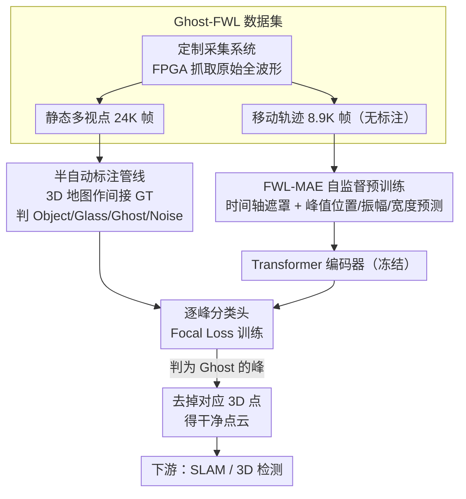

# Ghost-FWL: A Large-Scale Full-Waveform LiDAR Dataset for Ghost Detection and Removal

**会议**: CVPR 2026  
**arXiv**: [2603.28224](https://arxiv.org/abs/2603.28224)  
**代码**: [https://keio-csg.github.io/Ghost-FWL/](https://keio-csg.github.io/Ghost-FWL/)  
**领域**: 自动驾驶 / 3D视觉  
**关键词**: 全波形LiDAR、鬼影检测、数据集、自监督学习、Masked Autoencoder

## 一句话总结
Ghost-FWL 提出首个大规模移动端全波形 LiDAR 数据集（24K帧、75亿峰值级标注），并设计 FWL-MAE 自监督预训练框架实现鬼影检测与去除，将 SLAM 轨迹误差降低 66% 以上、3D 检测假阳性率减少 50 倍。

## 研究背景与动机

**领域现状**：LiDAR 是自动驾驶、机器人和大规模地形测绘的核心传感器。它通过测量激光脉冲的飞行时间来重建 3D 几何。传统 LiDAR 只输出处理后的点云（距离+强度），丢弃了原始波形中的丰富物理信息。

**现有痛点**：LiDAR 系统广泛存在"鬼影点"（Ghost）问题——激光脉冲在玻璃、反射表面上发生多路径反射，产生不存在的虚假 3D 点。随着传感器灵敏度提升，鬼影问题愈发严重。这些伪点会导致：(1) 3D 目标检测中的假阳性（如在玻璃后检测到"幻影行人"）；(2) SLAM 中的定位漂移和地图错误。

**核心矛盾**：现有鬼影去除方法依赖点云的几何一致性（空间对称性等），但这要求密集、静态的扫描环境。在移动 LiDAR 场景（自动驾驶、机器人）中，点云稀疏且动态，几何线索不足以区分鬼影和真实反射。另一方面，全波形 LiDAR（FWL）能记录每个脉冲的完整时间-强度轮廓，包含区分鬼影的时间和强度线索，但目前没有 FWL 鬼影检测数据集。

**本文目标** (1) 构建首个面向移动场景的 FWL 鬼影检测数据集；(2) 提出基于 FWL 数据的鬼影检测与去除基线框架；(3) 设计适合 FWL 数据的自监督预训练方法解决标注成本问题。

**切入角度**：FWL 数据天然包含多路径反射信息——鬼影反射的峰值与真实物体反射在时间位置、振幅、宽度上有可区分的模式。通过学习这些物理特征来检测鬼影。

**核心 idea**：利用全波形 LiDAR 的时间-强度信息（而非仅点云几何）来检测和去除鬼影反射。

## 方法详解

### 整体框架
这篇论文要回答的问题是：移动 LiDAR 在玻璃、反射面前产生的"鬼影点"很难靠点云几何剔除，因为单帧点云太稀疏，那么能不能改用全波形（每个脉冲完整的时间-强度轮廓）里的物理线索来识别鬼影？为此作者把工作拆成数据、表征、检测三层串起来：先用定制采集系统在 10 个室内外场景拿到 24K 帧原始全波形，再用一条以高精度 3D 地图为参照的半自动管线把每个反射峰标成 Object / Glass / Ghost / Noise；然后在大量无标注的移动轨迹数据上做 FWL-MAE 自监督预训练，让 Transformer 编码器学会全波形的物理特征；最后冻结编码器、接一个轻量分类头逐峰预测类别，把判为 Ghost 的峰对应的 3D 点直接去掉。下游 SLAM 和 3D 检测都建立在这个去鬼影后的干净点云上。

### 关键设计

**1. Ghost-FWL 数据集：把被丢弃的原始波形重新捡回来**

传统 LiDAR 在硬件里就把全波形压成了"距离+强度"的峰值点云，恰好把区分鬼影最有用的时间-强度证据扔掉了；而已有的全波形数据集要么来自静态高精度扫描仪不适合移动场景，要么没有峰值级标注（PixSet），要么干脆没公开（Scheuble 等）。作者的做法是直接访问 LiDAR 硬件的 FPGA 模块抓原始波形：传感器输出 512×400 像素的直方图，每个方向记录最多 700 个时间 bin（约 1ns 分辨率、最大测距 105m）。采集覆盖 4 个室内（办公室、休息室、体育馆）和 6 个室外（建筑入口、玻璃幕墙、行人区）场景，跨上午/下午/傍晚不同时段，并分两种策略：多视点静态采集（每场景 37-55 个视点，共 24412 帧有标注）供监督训练，移动轨迹采集（8933 帧无标注）供自监督预训练。最终标注规模比此前最大的标注 FWL 数据集大约 100 倍，让"用波形学鬼影"第一次有了足够数据支撑。

**2. 半自动标注管线：用高精度地图当间接 ground truth**

鬼影本质是虚拟反射，物理上根本不存在对应物体，没有任何直接 GT 可标。作者绕过这点的办法是引入一个外部参照：先用商用 360° LiDAR（Livox Mid-360）配 fastlio2 SLAM 给每个场景重建高精度 3D 地图 $\mathcal{M}$，手动标出地图里的玻璃区域 $\mathcal{G}$ 和反射区域 $\mathcal{R}$；再把多帧全波形累积成高信噪比波形、提取峰值转成点云并对齐到该地图。有了这个参照系，每个点的归属就能按它到地图的最近邻距离 $d(\mathbf{x}) = \min_{\mathbf{y} \in \mathcal{M}} \|\mathbf{x} - \mathbf{y}\|$ 加区域规则自动判定：贴近地图表面的是 Object，落在玻璃区域内的是 Glass，穿过或反射自玻璃却不对应地图任何表面的是 Ghost，其余为 Noise，最后再由领域专家审核。核心思路就是"鬼影本身没有 GT，但它和真实几何的空间偏差有 GT"，靠对比偏差把虚假反射间接标出来。

**3. FWL-MAE：让自监督也去学峰值的物理属性，而不只是重建体素**

峰值级逐个标注成本极高，监督数据再大也覆盖不了所有移动场景，所以需要从大量无标注轨迹里预训练通用表征。FWL-MAE 把输入看作一个全波形数据体 $\mathbf{V} \in \mathbb{R}^{H \times W \times T}$，在 $(x,y)$ 空间随机采样 patch 并沿时间轴 $T$ 整列遮罩，用一个 6 层 6 头的 Transformer 编码器输出潜在表征。关键区别在重建目标：MARMOT 这类已有方法只做体素级重建，而 FWL-MAE 额外挂一个线性头去估计每个直方图峰值的位置 $p$、振幅 $a$、宽度 $w$——正是这三个量在物理上把鬼影反射和真实反射区分开。训练目标因此是体素重建的 MSE 加上三个峰值属性的 L1：

$$\mathcal{L}_{\text{FWL-MAE}} = \mathcal{L}_{\text{MSE}} + \lambda_p \mathcal{L}_1^{\text{peak-}p} + \lambda_a \mathcal{L}_1^{\text{peak-}a} + \lambda_w \mathcal{L}_1^{\text{peak-}w}$$

这样预训练学到的表征不只是"能复原波形形状"，而是"懂峰值的物理意义"，迁移到鬼影检测时自然更有用——实验里它也确实比通用的 MARMOT 预训练更强。

### 损失函数 / 训练策略
鬼影检测使用 Focal Loss 处理严重的类别不平衡（Noise 占绝大多数）。FWL-MAE 预训练的编码器权重冻结，只训练分类头（2 层线性层）。原始 FWL 数据预处理为 (128, 128, 256)，去除天花板/地板反射的前后 bin 和传感器内部反射噪声。训练集 13853、验证集 2994、测试集 1427 帧。

## 实验关键数据

### 主实验 — 鬼影检测

| 方法 | Recall↑ | Ghost Removal Rate↑ |
|------|---------|---------------------|
| MARMOT | 0.746 | 0.910 |
| Ours w/o FWL-MAE | 0.704 | 0.900 |
| **Ours (with FWL-MAE)** | **0.751** | **0.918** |

### 下游任务 — SLAM

| 方法 | ATE (m)↓ | RTE (m)↓ |
|------|----------|----------|
| Dual-Peak | 0.715±0.433 | 0.741±0.406 |
| Multi-Peak | 1.547±1.394 | 1.602±1.381 |
| **Ours** | **0.245±0.138** | **0.245±0.131** |

鬼影去除后 ATE 降低 66-84%，RTE 降低 67-85%。

### 下游任务 — 3D 目标检测

| 方法 | Ghost FP Rate↓ |
|------|----------------|
| Dual-Peak | 75.8% |
| Multi-Peak | 67.9% |
| **Ours** | **1.34%** |

鬼影引起的假阳性率从 67.9% 降至 1.34%，减少约 50 倍。

### 关键发现
- FWL-MAE 预训练对鬼影检测有明显帮助（Recall 从 0.704 提升到 0.751），验证了自监督预训练对学习 FWL 物理特征的有效性
- FWL-MAE 优于通用的 MARMOT 预训练，说明显式建模峰值属性（而非仅做体素重建）很重要
- 鬼影去除对下游任务的影响是戏剧性的：SLAM 中 Multi-Peak 方法因鬼影导致严重轨迹漂移（ATE 1.547m），而去除后仅 0.245m；3D 检测中假阳性率从 67.9% 降至 1.34%
- 在玻璃表面附近的改善最为显著，这正是鬼影问题最严重的区域

## 亮点与洞察
- 问题定位非常精准：指出了 FWL 数据这个被忽视的"金矿"。传统做法把全波形裁剪为峰值点云，恰好丢失了区分鬼影的关键证据。保留完整波形并学习物理特征，是一个思路清晰的突破
- 数据集规模和标注质量令人印象深刻：24K帧、75亿峰值标注，利用高精度 3D 地图作为间接 ground truth 的标注策略非常巧妙
- FWL-MAE 中峰值属性（位置/振幅/宽度）预测头的加入虽然简单，但抓住了 FWL 数据与普通图像/直方图的本质区别
- 下游任务的巨大改善（50倍假阳性降低）直接说明了研究的实用价值

## 局限与展望
- 当前标注仅覆盖静态多视点采集，连续移动序列因标注成本未做标注。扩展到移动序列标注可支持时序模型
- 数据集只关注玻璃引起的鬼影，其他反射材质（水面、抛光金属）和恶劣天气（雨、雾）未覆盖
- FWL-MAE 的 Transformer 编码器只有 6 层，对于复杂的多路径反射模式可能不够深
- 鬼影检测的 Recall 为 0.751，仍有约 25% 的鬼影未被检测到。在安全关键的自动驾驶场景中可能不够
- 当前方法是逐帧独立检测，未利用时序信息。连续帧的一致性可以为鬼影检测提供额外线索

## 相关工作与启发
- **vs UNIST/Lee等静态方法**: 这些方法依赖静态高精度扫描仪的几何一致性，不适用于移动场景。Ghost-FWL 利用 FWL 的时间-强度信息，能在稀疏单帧中工作
- **vs Scheuble等 FWL 方法**: 他们的 FWL 端到端方法专注于测距精度提升，不针对鬼影检测。且数据集仅 240 帧未公开，Ghost-FWL 大 100 倍并公开
- **vs PixSet**: 唯一公开的 FWL 数据集，但缺少峰值级标注，无法支持鬼影检测训练
- **vs MARMOT**: 通用瞬态图像 MAE，只做体素重建。FWL-MAE 的峰值属性预测头更适合 LiDAR 数据

## 评分
- 新颖性: ⭐⭐⭐⭐⭐ 首次提出 FWL 鬼影检测这个任务，数据集填补了关键空白
- 实验充分度: ⭐⭐⭐⭐⭐ 从鬼影检测到 SLAM、3D 检测的完整评估链，说服力很强
- 写作质量: ⭐⭐⭐⭐ 问题动机清晰，数据集构建过程详尽
- 价值: ⭐⭐⭐⭐⭐ 数据集、代码公开，对自动驾驶安全有直接实用价值

<!-- RELATED:START -->

## 相关论文

- [\[CVPR 2026\] SearchAD: Large-Scale Rare Image Retrieval Dataset for Autonomous Driving](searchad_large-scale_rare_image_retrieval_dataset_for_autonomous_driving.md)
- [\[ECCV 2024\] H-V2X: A Large Scale Highway Dataset for BEV Perception](../../ECCV2024/autonomous_driving/h-v2x_a_large_scale_highway_dataset_for_bev_perception.md)
- [\[CVPR 2026\] Learning to Drive is a Free Gift: Large-Scale Label-Free Autonomy Pretraining from Unposed In-The-Wild Videos](learning_to_drive_is_a_free_gift_large-scale_label-free_autonomy_pretraining_fro.md)
- [\[ICLR 2026\] EgoDex: Learning Dexterous Manipulation from Large-Scale Egocentric Video](../../ICLR2026/autonomous_driving/egodex_learning_dexterous_manipulation_from_large-scale_egocentric_video.md)
- [\[CVPR 2026\] BEV-SLD: Self-Supervised Scene Landmark Detection for Global Localization with LiDAR Bird's-Eye View Images](bev-sld_self-supervised_scene_landmark_detection_for_global_localization_with_li.md)

<!-- RELATED:END -->
