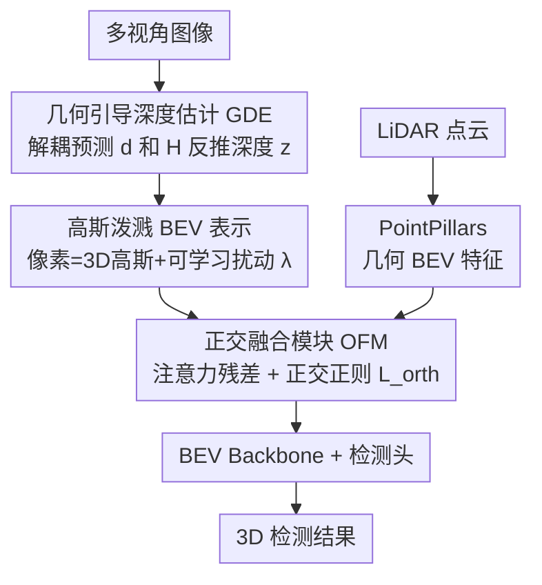

# GSV2X: Geometry-Aware Uncertainty Modeling and Orthogonal Fusion for Robust Roadside Perception

**会议**: CVPR 2026  
**论文**: [CVF Open Access](https://openaccess.thecvf.com/content/CVPR2026/html/Xu_GSV2X_Geometry-Aware_Uncertainty_Modeling_and_Orthogonal_Fusion_for_Robust_Roadside_CVPR_2026_paper.html)  
**代码**: 未公开  
**领域**: 3D视觉 / 自动驾驶 / 多模态融合  
**关键词**: 路侧感知, 相机-LiDAR融合, 3D高斯, 不确定性建模, 正交融合  

## 一句话总结
针对路侧多视角相机-LiDAR 融合中"标定误差导致特征错位"和"相机过强压制 LiDAR"两大顽疾，GSV2X 用 3D 高斯分布替代确定性投影把像素特征"软"地抬升到 BEV、并用正交约束强制两个模态学互补特征，在 RCooper 上把 AP@0.5 从 BEVFusion 的 43.7% 拉到 63.4%，且在标定扰动下几乎不掉点。

## 研究背景与动机
**领域现状**：路侧感知系统（Roadside Perception System, RPS）部署在路口、匝道等固定位置，视野全局、能缓解车载传感器的遮挡盲区，已成为智能交通基础设施的重要一环。主流范式是多视角、多模态融合——把相机的丰富语义和 LiDAR 的精确几何对齐到统一的鸟瞰图（BEV）空间，代表做法是 LSS（Lift-Splat-Shoot）系把多视角 2D 特征按预测的逐像素深度分布抬升到 3D 再拍到 BEV。

**现有痛点**：作者指出两个互相纠缠的脆弱点。其一是**对空间不确定性极度敏感**：LSS 这类方法依赖一个确定性的"点对点"投影，把每个像素硬映射到 3D 中一个固定点，因此严重依赖完美标定，而现实中标定误差几乎不可避免——哪怕微小的外参误差也会造成 BEV 特征错位，产生幽灵目标、轨迹抖动和漏检，直接威胁行车安全。其二是**模态失衡**：朴素地把相机和 LiDAR 特征拼接/相加，稠密的相机特征会"盖过"稀疏但几何精确的 LiDAR 特征，让网络过拟合到单一模态，在天气/光照变化时泛化崩坏。

**核心矛盾**：这两个问题的根都在"确定性"假设——既假设投影几何是确定的（忽略深度模糊与标定噪声），又让融合无约束地任由强模态主导。作者图 1 的对比很说明问题：从走廊场景切到路口场景，BEVFusion 的 AP@0.3 暴跌 14.5%，而 GSV2X 只掉 2.9%；在路口场景里加入标定扰动，BEVFusion 掉 9.5%，GSV2X 只掉 0.6%。

**核心 idea**：用"概率化"替换"确定性"——把每个像素特征表示成一个 **3D 高斯分布**（而非一个点）来吸收深度与标定的不确定性；再用 **正交约束** 把相机和 LiDAR 特征推到特征空间里不相关的方向上，强迫两者贡献互补信息而非冗余信息。

## 方法详解

### 整体框架
GSV2X 是一个双流（相机流 + LiDAR 流）后期融合框架。**相机流**：多视角图像经 ResNet-50 + FPN 提特征，先用 Geometry-guided Depth Estimation（GDE）估出可靠的逐像素深度，再用基于 3D 高斯泼溅（Gaussian Splatting）的视角变换器把 2D 特征"软"地抬升成概率化的 BEV 特征 $F^{BEV}_{img}$。**LiDAR 流**：点云经 PointPillars 编码成几何稳健的 BEV 特征 $F^{BEV}_{LiDAR}$。两路在 **Orthogonal Fusion Module（OFM）** 汇合——以 LiDAR 为几何主干、相机为残差增强分支，并施加正交正则化损失逼两者互补。融合后的 BEV 特征送入 BEV backbone 和检测头出 3D 框。训练时所有视角联合优化；推理时各视角独立处理、最后做后处理融合。

### 关键设计

**1. 高斯泼溅 BEV 表示：把"硬投影"换成"软抬升"以吸收空间不确定性**

LSS 的命脉弱点是确定性的逐像素投影——深度或标定一旦有误，BEV 上就特征错位。GSV2X 受 GaussianLSS 启发，把每个像素 $m$ 的特征 $f_m$ 在 3D 中表示为一个高斯分布 $G(\mathbf{x}) \sim \mathcal{N}(\mu, \Sigma)$，而不是一个固定点，从而天然容纳小幅几何偏移。其关键在于把不确定性**解耦成两个来源**并分别建模。第一来源是深度预测的模糊性：从预测的深度分布 $p(d_i|m)$（$D$ 个深度 bin）算出初始均值和深度诱导的协方差

$$\mu_{m,3D} = \sum_{i=1}^{D} p(d_i|m)\cdot x_i, \quad \Sigma_{m,depth} = \sum_{i=1}^{D} p(d_i|m)\cdot (x_i - \mu_{m,3D})(x_i - \mu_{m,3D})^\top$$

其中 $x_i$ 是第 $i$ 个深度 bin 对应的 3D 坐标。$\Sigma_{m,depth}$ 只刻画了沿相机射线方向的不确定性，无法解释标定误差，于是第二来源用一个**可学习的、视角相关的扰动标量 $\lambda \ge 0$** 来补——它由一个轻量 MLP 从相机外参预测，自适应地放缩协方差：$\Sigma_{m,3D} = \lambda \cdot \Sigma_{m,depth}$。最终 BEV 特征通过可微高斯泼溅累加所有像素贡献渲染得到：

$$F^{BEV}_{img}(p) = \sum_{m=1}^{N} f_m \cdot \alpha_m \cdot \exp\!\Big(-\tfrac{1}{2}(p-\mu_{m,BEV})^\top \Sigma_{m,BEV}^{-1}(p-\mu_{m,BEV})\Big)$$

其中 $\alpha_m$ 是预测的不透明度，$\mu_{m,BEV}/\Sigma_{m,BEV}$ 是 3D 高斯投到 BEV 平面后的均值与协方差。作者还特意用 alpha-blending 渲染而非 BEV-pooling，既提升推理效率也增强可部署性。消融（表 6）显示学到的 $\lambda$ 与各视角真实标定误差强正相关——需要更大外参修正的相机（Cam #0、#3）学到更大的 $\lambda$，说明模型确实把"不确定性"学成了物理可解释的量。

**2. 几何引导深度估计（GDE）：用更稳定的可观测量反推深度，而非直接回归深度**

高斯表示的质量取决于深度估计的准确度，而路侧场景里相机高度和俯仰角变化大、无约束，直接回归场景深度 $z$ 极难且泛化差。GDE 的思路是把深度估计**解耦成一个更受约束、更稳定的学习问题**：网络不直接预测 $z$，而是预测两个物理上更稳健、更易从图像语义推断的中间量——地平面上的可见水平距离 $d$ 和目标相对地面的高度 $H$；再结合已知相机参数（俯仰角 $\theta$、焦距 $f$ 等）用几何关系**确定性地**还原真实深度：

$$z = d\cdot(\tan(\theta+\sigma)\cdot\sin\theta + \cos\theta) - H\cdot\sin\theta$$

其中 $\sigma = \arctan((v_p - c_y)/f)$ 是像素由其 $y$ 坐标导出的垂直视角偏移。监督信号 $d$ 和 $H$ 由 LiDAR 投影得到的真值提供。由于 $d$、$H$ 比 $z$ 对相机姿态变化鲁棒得多，GDE 在不同相机安装位姿下泛化更好，给概率化抬升提供了可靠的深度基础。

**3. 正交融合模块（OFM）：用正交正则强迫相机与 LiDAR 学互补而非冗余**

朴素的拼接/相加（如 BEVFusion）会让稠密相机特征产生更强梯度、压制稀疏但几何精确的 LiDAR——网络靠重度依赖相机就能把训练损失降下去，从而浪费了 LiDAR 线索。OFM 不做对齐式融合（对齐隐式最大化跨模态相似度，反而加剧模态主导），而是把 $F^{BEV}_{LiDAR}$ 当几何主干、$F^{BEV}_{img}$ 当增强残差分支。它先用注意力生成空间权重图 $A$ 自适应调制图像特征，融合写成

$$F^{BEV}_{fused} = F^{BEV}_{LiDAR} + A \odot F^{BEV}_{img}$$

其中 $\odot$ 为 Hadamard 积——LiDAR 路径始终给出完整 BEV 表示，图像分支只贡献一个受 $A$ 控制的残差项。促互补的核心是**正交正则化损失** $\mathcal{L}_{orth}$，它惩罚两模态特征在每个 BEV 位置的相关性（平方点积），把它们推到特征空间里不相关的方向：

$$\mathcal{L}_{orth} = \mathbb{E}_{p\in BEV}\Big[\big(F^{BEV}_{LiDAR}(p)^\top F^{BEV}_{img}(p)\big)^2\Big]$$

这个正则只作温和的辅助损失（权重很小），整体目标仍由检测损失主导。由于融合输出被 LiDAR 锚定，当相机信号不可靠时网络可调小 $A$ 退回 LiDAR 主导；在 LiDAR 稀疏区 $A$ 又能自由上调相机分支。作者在图 5 验证：OFM 主要在 LiDAR 稠密区把过高的余弦相似度拉开（推开冗余），而在 LiDAR 稀疏区分布几乎不变——印证 OFM 是个"保 LiDAR"的温和正则，而非到处强制 LiDAR 主导。

### 损失函数 / 训练策略
检测损失（在 $F^{BEV}_{fused}$ 上）为主 + 小权重的正交正则 $\mathcal{L}_{orth}$；对可学习扰动 $\lambda$ 额外施加轻量 L2 正则（weight decay $1\times10^{-4}$）稳定训练。优化器 AdamW、cosine annealing。RCooper：训 50 epoch，batch 4，初始学习率 $2\times10^{-3}$；DAIR-V2X-I：训 100 epoch，初始学习率 $2\times10^{-4}$。BEV 网格 RCooper 为 $200\times200$（100m×100m），DAIR-V2X-I 为 $128\times128$。单张 RTX 3090 训练。

## 实验关键数据

### 主实验
在 RCooper 验证集上，GSV2X 在路口（Intersection）和走廊（Corridor）两种场景全面领先。仅用高斯泼溅的变体 GSV2XGS 就已超过现有方法，完整模型再叠加 GDE 和 OFM 后达到 SOTA。

| 数据集 / 场景 | 指标 | BEVFusion | GSV2XGS | GSV2X(Full) |
|--------|------|------|----------|------|
| RCooper 路口 | AP@0.3 | 58.6 | 70.5 | **74.7** |
| RCooper 路口 | AP@0.5 | 43.7 | 58.6 | **63.4** |
| RCooper 路口 | AP@0.7 | 24.1 | 39.5 | **40.3** |
| RCooper 走廊 | AP@0.3 | 73.1 | 74.7 | **77.6** |
| RCooper 走廊 | AP@0.5 | 60.8 | 62.9 | **65.3** |

相比官方 benchmark，AP@0.3/0.5/0.7 分别提升 9.6%/15.8%/15.9%。在标定质量较高的 DAIR-V2X-I（隔离掉标定噪声、单看融合策略收益）上，GSV2X 同样全面领先：

| 数据集 | 类别(难度) | BEVFusion | GSV2X | 提升 |
|--------|------|------|----------|------|
| DAIR-V2X-I | Vehicle(Easy) | 82.1 | 83.8 | +1.7 |
| DAIR-V2X-I | Pedestrian(Middle) | 49.1 | 56.2 | +7.1 |
| DAIR-V2X-I | Cyclist(Easy) | 61.2 | 65.5 | +4.3 |

即便在"干净"数据集上仍有清晰优势，说明几何感知抬升 + 互补驱动融合是通用性收益，而非只对标定噪声场景管用。

### 消融实验
组件级消融（表 3，RCooper 路口）显示最大单项收益来自高斯表示，其次是 OFM：

| 配置 | AP@0.3 | AP@0.5 | AP@0.7 | 说明 |
|------|---------|---------|---------|------|
| GSV2XBase | 58.4 | 43.6 | 24.1 | ≈ 标准 BEVFusion |
| GSV2XGS | 70.5 | 58.6 | 39.5 | +高斯表示，AP@0.5 +15.0 |
| +GDE(only) | 71.4 | 59.9 | 39.5 | 在 GS 上加 GDE |
| +OFM(only) | 73.2 | 62.7 | 42.4 | 在 GS 上加 OFM，AP@0.5 +4.1 |
| GSV2X(Full) | 74.7 | 63.4 | 40.3 | 全组件协同 |

标定鲁棒性的隔离实验（表 4，路口场景，AC=准确标定 / PC=扰动标定）最能说明问题：确定性的 BEVFusion 在扰动下 AP@0.5 暴跌 16.4，而仅含高斯表示的 GSV2XGS 只掉 3.2。

| 方法 | 标定 | AP@0.3 | AP@0.5 | AP@0.7 |
|------|------|---------|---------|---------|
| BEVFusion | AC→PC | 69.4→59.9 | 59.6→43.2 | 41.4→25.2 |
| BEVFusion | Drop Δ | -9.5 | **-16.4** | -16.2 |
| GSV2XGS | AC→PC | 71.2→70.6 | 61.8→58.6 | 40.9→39.4 |
| GSV2XGS | Drop Δ | **-0.6** | **-3.2** | **-1.5** |

### 关键发现
- **高斯表示是首要功臣**：把确定性投影换成概率化高斯，单这一步在路口场景就带来 +15.0 AP@0.5，且把标定扰动下的掉点从 16.4 压到 3.2，直接证明"对不确定性建模"是路侧鲁棒感知的关键。
- **可学习 $\lambda$ 优于任何固定值且物理可解释**（表 5、表 6）：学习版 AP@0.5 63.4，优于固定 0.50/0.75/1.00 的 63.0/62.8/62.7；更妙的是学到的 $\lambda$ 与各视角真实外参误差正相关（Cam #3 误差大 λ=1.10，Cam #2 标定好 λ=0.45）。
- **OFM 是"保 LiDAR"的温和正则**：图 5 显示它只在 LiDAR 稠密区降低与相机的过高相关性，稀疏区几乎不动——它不是到处压制相机，而是让相机在 LiDAR 已充分处别抢戏、转去补外观和远处上下文。
- **优雅降级**（表 7）：路口场景推理时随机丢相机，从 4 路降到 2 路仍保持 70.2/58.6 AP@0.3/0.5，半数相机失效也不崩，利于真实部署。

## 亮点与洞察
- **把"标定误差"建成可学习的协方差缩放**：用一个从外参预测的标量 $\lambda$ 去放缩深度协方差，等于让网络自己"承认"哪个相机更不可信、并放大其特征弥散——既简洁又物理可解释，比硬校正外参优雅得多。
- **用正交而非对齐来融合**，这是反直觉但很巧的一笔：大多数融合方法追求跨模态相似度最大化（对齐），本文反其道用 $\mathcal{L}_{orth}$ 推开两模态方向，从根上治"强模态主导"，思路可迁移到任何存在模态失衡的多模态任务。
- **GDE 把难回归的深度拆成易观测的 $d$ 和 $H$**：在路侧这种相机姿态多变的设定下，回归稳定的中间量再用几何公式反推，是降低学习难度、提升跨安装泛化的可复用 trick。

## 局限与展望
- **未公开代码**，且 GDE 的若干几何细节放在补充材料，复现门槛偏高（⚠️ 正文公式 $z = d(\tan(\theta+\sigma)\sin\theta+\cos\theta)-H\sin\theta$ 的推导以原文/补充为准）。
- **后期融合（推理时各视角独立处理）**可能损失跨视角早期交互的信息，作者未深入讨论这一选择对多视角重叠区一致性的影响。
- $\mathcal{L}_{orth}$ 的权重、$\lambda$ 的 L2 正则强度等超参对结果的敏感性只给了部分分析，缺更系统的扫描。
- 评测只在两类路侧数据集（RCooper、DAIR-V2X-I）上，且把所有类别当单类处理（RCooper），对小目标/多类别细粒度检测的鲁棒性还需验证。

## 相关工作与启发
- **vs BEVFusion**：BEVFusion 用确定性投影 + 简单拼接/相加，在标定扰动下 AP@0.5 掉 16.4；GSV2X 用概率化高斯抬升 + 正交融合，同条件只掉 3.2，核心区别是"承认并建模不确定性"与"强制模态互补"。
- **vs BEVHeight / BEVHeight++**：它们改"回归高度而非深度"来降低俯仰敏感性，仍是确定性投影的改良；GSV2X 直接放松确定性假设本身（每个特征是高斯而非点），并叠加 GDE 进一步稳住深度。
- **vs GaussianLSS**：GSV2X 在其高斯抬升思想上扩展出两点——用 $\lambda$ 显式建模标定噪声（而非只建深度模糊）、并加正交融合解决多模态失衡，把单模态的概率抬升推广成稳健的相机-LiDAR 融合框架。

## 评分
- 新颖性: ⭐⭐⭐⭐ 用 3D 高斯 + 可学习 λ 建标定不确定性、用正交正则治模态失衡，两点都对路侧感知痛点切得准
- 实验充分度: ⭐⭐⭐⭐ 两数据集 + 标定扰动隔离实验 + 优雅降级 + λ 物理可解释性分析，证据链完整；但缺代码与更系统的超参扫描
- 写作质量: ⭐⭐⭐⭐ 动机—方法—实验逻辑清晰，图 1/图 5 的对比很有说服力
- 价值: ⭐⭐⭐⭐ 路侧/车路协同感知对鲁棒性要求高，"软投影 + 互补融合"的思路实用且可迁移

<!-- RELATED:START -->

## 相关论文

- [\[CVPR 2026\] U4D: Uncertainty-Aware 4D World Modeling from LiDAR Sequences](u4d_uncertainty-aware_4d_world_modeling_from_lidar_sequences.md)
- [\[CVPR 2026\] Hybrid Robust Collaborative Perception with LiDAR-4D Radar Fusion under Adverse Weather Conditions](hybrid_robust_collaborative_perception_with_lidar-4d_radar_fusion_under_adverse_.md)
- [\[CVPR 2026\] Query2Uncertainty: Robust Uncertainty Quantification and Calibration for 3D Object Detection under Distribution Shift](query2uncertainty_robust_uncertainty_quantification_and_calibration_for_3d_objec.md)
- [\[CVPR 2026\] FoSS: Modeling Long-Range Dependencies and Multimodal Uncertainty in Trajectory Prediction via Fourier–State Space Integration](foss_modeling_long_range_dependencies_and_multimodal_uncertainty_in_trajectory_p.md)
- [\[CVPR 2026\] DVGT: Driving Visual Geometry Transformer](dvgt_driving_visual_geometry_transformer.md)

<!-- RELATED:END -->
