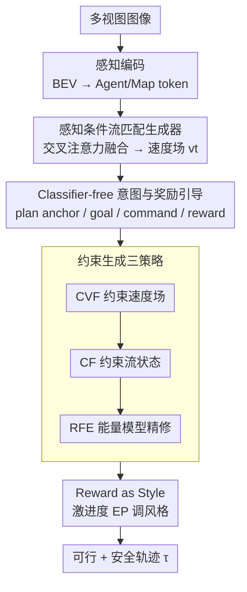

# GuideFlow: Constraint-Guided Flow Matching for Planning in End-to-End Autonomous Driving

**会议**: CVPR 2026  
**论文**: [CVF Open Access](https://openaccess.thecvf.com/content/CVPR2026/html/Liu_GuideFlow_Constraint-Guided_Flow_Matching_for_Planning_in_End-to-End_Autonomous_Driving_CVPR_2026_paper.html)  
**代码**: https://github.com/adept-thu/GuideFlow （待开源）  
**领域**: 端到端自动驾驶 / 轨迹规划  
**关键词**: 端到端驾驶规划, 流匹配, 约束生成, 能量模型, 模式崩塌  

## 一句话总结
GuideFlow 用「流匹配 + 能量模型」做端到端驾驶规划，把安全/物理硬约束直接嵌进生成过程（约束速度场 CVF、约束流状态 CF、能量精修 RFE 三招），既缓解模仿学习的多模态模式崩塌，又免去生成式方法事后再优化的环节，在 NavSim Navhard 上拿到 43.0 EPDMS 的 SOTA。

## 研究背景与动机

**领域现状**：端到端自动驾驶（E2E-AD）把感知、预测、规划塞进一个可微系统联合训练，规划模块负责预测可行轨迹。为反映真实驾驶的多意图不确定性，规划已从单模态走向多模态轨迹生成，主流分两派——模仿式（Imitative）和生成式（Generative）。

**现有痛点**：两派各有硬伤。**模仿式规划器**（UniAD、VAD、SparseDrive 等）用 L2/Huber 损失直接回归专家轨迹，但每个场景只有一条 GT 轨迹做监督，名义上输出多条候选，实际全塌向同一个主导模式——这就是 **模式崩塌（mode collapse）**，多样性是假的。**生成式规划器**（DiffusionDrive、DiffusionPlanner 等）从学到的分布里采样，能表达多模态，但采样过程的随机性和高方差使它**无法保证生成的轨迹满足碰撞、车道、运动学等硬约束**，往往要再挂一个事后优化阶段去"修"轨迹，部署不可靠。

**核心矛盾**：生成式方法的"多样性"和"约束满足"之间存在张力——隐式地把约束编码进潜空间既不可解释、又难在采样时强制施加；而显式硬性掰轨迹（每步手动投影）会严重破坏采样的概率路径，把生成质量也带崩。

**本文目标**：在一个生成框架内同时拿到（1）多模态多样性、（2）显式硬约束满足、（3）可控的驾驶风格，且不需要独立的事后优化阶段。

**切入角度**：作者选用 **矫正流（Rectified Flow）** 做生成主干——它在先验与目标分布间学一条近乎直线的传输路径，采样快且稳定；并观察到每一步轨迹更新 $x^{(k+1)}$ 同时依赖速度场 $v_\theta$、前一流状态 $x^{(k)}$ 以及精修阶段的能量项 $E_\theta$，于是可以**分别在这三个着力点上注入约束**。

**核心 idea**：与其让模型隐式学约束，不如把约束**显式地刻进流匹配的生成过程**——校正速度场方向、在采样中途把流状态替换成满足约束的锚点、再用能量模型把"违约=高能量"写进数据流形，三管齐下让采样天然落到可行区。

## 方法详解

### 整体框架

GuideFlow 是一个基于流匹配的轨迹生成器：输入多视图图像，经感知模块得到 BEV 表征并解析出 Agent token（动态体交互）和 Map token（道路/车道拓扑）；把一条轨迹表示为流状态 $x_t\in\mathbb{R}^{T\times2}$（$T$ 为预测时域），通过交叉注意力与场景 token 融合，再叠加 classifier-free 的意图/奖励条件，解码出速度场 $v_\theta(x_t,t)$；最后在采样阶段用三招约束策略（CVF、CF、RFE）矫正速度场与流路径，积分得到最终轨迹。整条管线的关键不在感知（沿用现成主干），而在"生成 + 约束"那一段。

### 关键设计

**1. 感知条件流匹配生成器：用矫正流替代模仿回归，从源头缓解模式崩塌**

模仿式规划器每场景只有一条 GT、靠 L2 监督，必然塌成一个主导模式。GuideFlow 改用矫正流：在高斯先验 $\pi_0$ 与目标轨迹分布 $\pi_1$ 之间构造线性概率路径 $x_t=(1-t)x_0+tx_1$，学一个速度场把先验"运"到数据流形，训练目标为 $L_{RF}=\mathbb{E}_{t,x_0,x_1}\lVert v_\theta(x_t,t)-(x_1-x_0)\rVert^2$，推理时数值积分采样 $x^{(k+1)}=x^{(k)}+v_\theta(x^{(k)},t_k)\Delta t$。因为采样从随机噪声起步、再被多样条件引导，天然能给出不同的轨迹假设而非单一确定路径。

但纯矫正流的直线传输本身是"寻模"的，仍会偏向主导模式。为此作者借鉴 Energy Matching，把流模型在 $t>1$ 阶段当作能量模型，引入能量权重调度 $\varepsilon(t)$（在 $t<\tau^*$ 为 0、之后线性升到 $\varepsilon_{max}$），使终端分布服从玻尔兹曼形式 $\pi_1(x)\propto\exp(-\beta E_\theta(x))$，把流形塑造成多个低能量盆地（如让行、并线各对应一个可行模式），采样更新变为 $x^{(k+1)}=x^{(k)}+v_\theta\Delta t-\eta(t_k)\nabla_x E_\theta(x^{(k)})$——这为后面把约束写进能量项铺好了路。

具体网络上，流状态先映射到隐表征 $h_t=\mathrm{MLP}_\theta(x_t)+\ell_\theta(t)$（$\ell_\theta(t)$ 是正弦时间步嵌入），再依次对 Agent token、Map token 做交叉注意力，最后 $v_\theta(x_t,t)=\mathrm{MLP}_\theta(h_t)$ 解码速度场。

**2. Classifier-free 意图与奖励引导：把"去哪/怎么开"注入采样，给约束策略提供高质量起点**

光有生成多样性还不够，轨迹得符合当前场景意图。GuideFlow 用四类动态条件信号引导生成：plan anchor $C_p$、goal point $C_g$、driving command $C_d$（三者语义重叠，不同时使用）以及 reward $C_r$（风格，见设计 4）。plan anchor 来自一个用最远点采样在训练集上构造的 $N=256$ 条轨迹词表 $V_a$：训练时取离 GT 最近的锚点作 $C_p$，采样时对词表里每个锚点各生成一条，得到 $N$ 条多样候选。

引导用 classifier-free guidance：训练以概率 $p=0.2$ 随机 mask 掉条件，融合得 $h_t^c\leftarrow F_\theta(h_t, M(C_p\oplus C_g\oplus C_d), M(C_r))$；采样时用引导尺度 $\gamma$ 调条件强度 $v_\theta^{guide}=(1-\gamma)v_\theta(x_t,t)+\gamma\,v_\theta(x_t,t,c)$。消融显示 plan anchor 信息最丰富（同时刻画"去哪"和"怎么开"），效果优于单用 command 或 goal point。

**3. 约束生成三策略 CVF/CF/RFE：把安全/物理硬约束显式嵌进生成过程，免去事后优化**

这是 GuideFlow 的核心。回看采样更新依赖速度场、流状态、能量项三者，作者就在这三个着力点上各下一招、互补协同：

- **CVF（Constraining the Velocity Field，约束速度场）**：先从锚点集挑一条满足约束的可行轨迹 $x_1^c$（或用预训练打分器如 GTRS 选约束满足概率最高者），其对应理想速度场 $v_t^c=\frac{x_1^c-x_0}{1-0}$。再把预测速度场朝它校正：

$$v_t^* = v_t - 2\lambda\,\frac{v_t\cdot v_t^c}{\lVert v_t^c\rVert^2}\,v_t^c,\qquad \lambda=0.1$$

这一步只调方向、尽量不改幅值，使生成方向偏向约束满足的终点。缺点是每一步都校正，可能扰动概率路径的平滑性。

- **CF（Constraining the Flow States，约束流状态）**：与其每步硬掰，不如只在采样中途干预一次。把连续流离散成序列 $\phi_t'=\{x^{(0)},\dots,x^{(K)}\}$（$K=100$），在接近目标的 $k_c$ 步直接把 $x^{(k_c)}$ 替换成满足约束的锚点 $x_1^c$，再从它继续采样 $x^{(k+1)}=x^{(k)}+v_\theta\Delta t$（$k=k_c,\dots,K$，实测 $k_c=50$）。与 DiffusionDrive 在训练阶段用截断不同，GuideFlow **只在推理时**激活这一截断式校正——训练时让模型学平滑的条件流、保留测试期适应性，这步晚期校正保证轨迹落在可行区却不破坏已学到的传输动力学。消融里 CF 比 CVF 更好（"一次性"干预对概率路径的干扰远小于"每步"干预）。

- **RFE（Refining the Flow by EBM，能量模型精修）**：把约束写进能量地形。定义能量代理 $E_\theta(x_t)=\lVert \jmath(f_{t>1}(x_t))-\jmath(x_t)\rVert^2$，其中 $f_{t>1}$ 是采样算子、$\jmath(\cdot)$ 评估约束满足度（如道路合规、碰撞惩罚），可行轨迹得低能量、违约得高能量。训练目标 $L_{RFE}=E_\theta(x^{(1)})-E_\theta(x_1)$（$x^{(1)}$ 是生成终点、$x_1$ 是 GT），即抬高违约样本能量、压低满足样本能量，让速度场在训练中隐式学到约束感知。因为约束规则本质可泛化，RFE 在域外（OOD）场景上的增益最大。

三者关系是互补而非对立：CVF/CF 在生成时强制约束，RFE 进一步把输出优化到符合约束规则；消融中 CF+RFE 组合拿到最佳 27.1 EPDMS。

**4. Reward as Style：用激进度分数把驾驶风格变成可调旋钮**

为在推理时动态调节轨迹激进程度，作者定义一个基于 NavSim 的激进度分数 EP（沿车道中心线单位时间行进距离，范围 $[0,1]$），为每条 GT 轨迹在线计算并作为条件输入。推理时调高 EP（趋近 1）模型就生成更激进的驾驶行为。这把"风格"从隐含偏好提升为显式可控信号——不过消融也诚实地指出，一味鼓励激进会牺牲安全约束（EP 从 79.6 升到 82.3，但 EPDMS 反降 0.8 分）。

### 损失函数 / 训练策略
总损失由流匹配项 $L_{RF}$（学传输方向）与能量精修项 $L_{RFE}$（学约束感知）组成。多基准统一对齐：NavSim 以 TransFuser 为 baseline、NavTrain 训 100 epoch（LR $2\times10^{-4}$），多模态轨迹用 GTRS-Dense（V2-99 主干）打分选取；NuScenes 基于 SparseDrive 两阶段、用一阶段感知模型初始化后微调 8 epoch；Bench2Drive 以 Hydra-Next 为 baseline、替换其轨迹生成模块后训 20 epoch。ADV-NuScenes 仅作域外评测、不参与训练。

## 实验关键数据

### 主实验

NavSim Navhard（闭环，EPDMS 越高越好）：

| 配置 | Backbone | Scorer | EPDMS | 说明 |
|------|----------|--------|-------|------|
| LTF | ResNet34 | 无 | 23.1 | 模仿 baseline |
| DiffusionDrive | ResNet34 | 无 | 24.2 | 扩散生成 |
| GTRS-DP | ResNet34 | 无 | 23.8 | — |
| **GuideFlow** | ResNet34 | 无 | **27.1** | 无打分器即超过同类 |
| GTRS-Dense | V2-99 | 有 | 41.7 | — |
| DriveSuprim | V2-99 | 有 | 42.1 | 前 SOTA |
| **GuideFlow + Scorer** | ResNet34 | 有 | **43.0** | **SOTA，+1.3** |

Bench2Drive（闭环，CARLA Leaderboard 2.0）与 NuScenes/ADV-NuScenes（开环，碰撞率）：

| 数据集 | 指标 | 本文 | 之前最佳 | 提升 |
|--------|------|------|----------|------|
| Bench2Drive | Driving Score ↑ | 75.21 | 73.86 (Hydra-Next) | +1.35 |
| Bench2Drive | Success Rate ↑ | 51.36% | 50.00% | +1.36% |
| NuScenes | Avg. 碰撞率 ↓ | 0.07% | 0.08% (SparseDrive) | -0.08%* |
| ADV-NuScenes | Avg. 碰撞率 ↓ | 0.73% | 1.02% (SparseDrive) | -1.02%* |

（*原文以相对 SparseDrive 的差值表述；ADV-NuScenes 为纯域外评测，体现对抗场景下的鲁棒性。GuideFlow 在 1s 几乎零碰撞、2s 仅 0.02%。）

### 消融实验

约束生成三模块（NavSim Navhard，No Scorer，EPDMS）：

| 配置 | EPDMS | 说明 |
|------|-------|------|
| baseline | 23.1 | 无约束 |
| + CVF | 24.5 | 约束速度场（每步校正） |
| + CF | 25.1 | 约束流状态（单次截断，优于 CVF） |
| + RFE | 25.5 | 能量精修（OOD 增益最大） |
| **+ CF + RFE** | **27.1** | 最佳组合 |
| + CVF+CF+RFE+RAS | 26.3 | 加风格后 EPDMS 略降 |

动态条件信号消融（NavSim Stage2 EPDMS / Bench2Drive DS）：

| 条件 | EPDMS | Driving Score | 说明 |
|------|-------|---------------|------|
| baseline | 23.1 | 73.86 | 无条件 |
| Plan Anchor | **29.0** | **75.21** | 信息最丰富，最优 |
| Goal Point | 28.6 | 74.54 | — |
| Driving Command | 27.1 | 74.86 | — |

### 关键发现
- **CF > CVF 的原因**：CVF 每步校正会打断概率路径平滑性、拉低生成质量；CF 只在 $k_c$ 步干预一次，对路径扰动最小，还给模型留足后续步数去适配场景。
- **RFE 主打域外泛化**：约束规则本身可泛化，RFE 能"感知"规则并纠正结果，因此在 OOD（ADV-NuScenes、Navhard Stage2）增益最显著。
- **风格与安全的 trade-off**：RAS 把 EP 从 79.6 推到 82.3，但 EPDMS 降 0.8——盲目鼓励激进会侵蚀安全约束，验证风格可调但需谨慎。
- **超参敏感性**：$\lambda$ 从 0.1 增到 0.5，EPDMS 单调下降（过度干预速度场伤平滑性）；$k_c$ 从 10 增到 40/50 时 EPDMS 先升后稳（约束启动太晚则步数不够纠偏）；采样步数 $K=100$ 最优（理论上矫正流允许大步长，实践中步数太少累积偏差大）。

## 亮点与洞察
- **把"在哪注入约束"想清楚了**：从采样更新 $x^{(k+1)}$ 依赖速度场/流状态/能量项三要素出发，对应设计 CVF/CF/RFE 三招，逻辑干净、各管一段，是很好的"按机制拆解问题"范式。
- **CF 的"只校正一次"很巧**：相比每步硬投影或训练期截断，推理期单次截断把约束满足和路径平滑的矛盾解得很漂亮，可迁移到任何扩散/流采样需要软性约束的场景。
- **EBM 与流匹配统一**：把流模型在 $t>1$ 当能量模型、用 $\jmath(\cdot)$ 把约束写进能量，使"违约=高能量"成为可训练信号，比推理期才加能量偏置（如 DiffusionPlanner）更彻底，也带来 OOD 泛化。
- **风格变成显式旋钮**：用 EP 激进度分数做条件，让"保守↔激进"可在推理时连续调，对实际部署的个性化/场景自适应有用。

## 局限与展望
- 作者自承风格调节是双刃剑：盲目调高激进度会牺牲安全（RAS 的 EPDMS 倒退），如何在风格与约束间自适应平衡尚未解决。
- CVF/CF 依赖一个"满足约束的参考轨迹 $x_1^c$"——它来自锚点集或预训练打分器（GTRS），约束满足的上限因此受锚点词表覆盖度和打分器质量制约；⚠️ 若参考本身次优，校正方向也只是"次优可行"。
- 推理速度偏慢：NuScenes 上 3.6 FPS（RTX4090），低于 SparseDrive 的 9.0 FPS，多步采样 + 约束校正是代价，离实时还有距离。
- 约束类型目前聚焦碰撞/道路/运动学等可写成 $\jmath(\cdot)$ 的几何约束，更复杂的交规/社会性约束如何纳入能量代理还需探索。

## 相关工作与启发
- **vs 模仿式规划器（UniAD / VAD / SparseDrive）**：它们回归单条专家轨迹、用 L2 监督，必然模式崩塌；GuideFlow 用流匹配从随机噪声起步 + 多条件引导，生成多样轨迹（Div 指标领先），从根上避开崩塌。
- **vs DiffusionDrive**：同为生成式，但 DiffusionDrive 只监督最终精修阶段、采样易塌回单模，且截断用在训练期；GuideFlow 显式监督生成过程、截断只在推理期，并叠加 EBM 与硬约束。
- **vs DiffusionPlanner / Diff-VLA / HE-Drive**：这些方法虽显式监督去噪、能生成多样轨迹，但潜采样不可解释、难在生成中施加碰撞/车道/运动学约束（DiffusionPlanner 仅在推理期加能量偏置，Diff-VLA 靠语言条件意图）；GuideFlow 的差异是把硬约束**直接注入生成过程**，无需独立事后优化阶段。

## 评分
- 新颖性: ⭐⭐⭐⭐⭐ 把硬约束显式拆成速度场/流状态/能量三个着力点注入流匹配，且统一 EBM，思路新且自洽
- 实验充分度: ⭐⭐⭐⭐⭐ 四个基准（开/闭环 + 域外对抗）+ 三类消融 + 超参敏感性，覆盖全面
- 写作质量: ⭐⭐⭐⭐ 机制和公式讲得清楚，三招对比有说服力；个别表格数值（如 Bench2Drive 正文 75.04 vs 表 75.21）小有出入
- 价值: ⭐⭐⭐⭐⭐ 给"生成式规划如何保证硬约束"提供了可落地范式，NavSim Navhard SOTA

<!-- RELATED:START -->

## 相关论文

- [\[CVPR 2026\] ActiveAD: Planning-Oriented Active Learning for End-to-End Autonomous Driving](activead_planning-oriented_active_learning_for_end-to-end_autonomous_driving.md)
- [\[CVPR 2026\] WAM-Flow: Parallel Coarse-to-Fine Motion Planning via Discrete Flow Matching for Autonomous Driving](wam-flow_parallel_coarse-to-fine_motion_planning_via_discrete_flow_matching_for_.md)
- [\[CVPR 2026\] ResAD: Normalized Residual Trajectory Modeling for End-to-End Autonomous Driving](resad_normalized_residual_trajectory_modeling_for_end-to-end_autonomous_driving.md)
- [\[CVPR 2026\] Scaling-Aware Data Selection for End-to-End Autonomous Driving Systems](scaling-aware_data_selection_for_end-to-end_autonomous_driving_systems.md)
- [\[CVPR 2026\] DriveMoE: Mixture-of-Experts for Vision-Language-Action Model in End-to-End Autonomous Driving](drivemoe_mixture-of-experts_for_vision-language-action_model_in_end-to-end_auton.md)

<!-- RELATED:END -->
