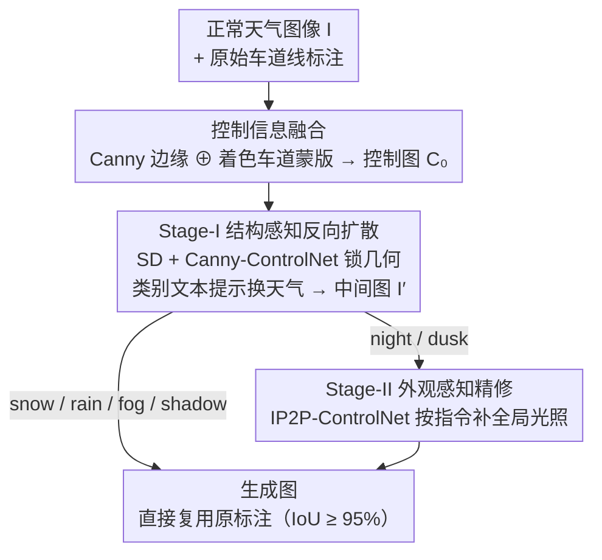

# HG-Lane: High-Fidelity Generation of Lane Scenes under Adverse Weather and Lighting Conditions without Re-annotation

**会议**: CVPR 2026  
**arXiv**: [2603.10128](https://arxiv.org/abs/2603.10128)  
**代码**: [zdc233/HG-Lane](https://github.com/zdc233/HG-Lane)  
**领域**: 自动驾驶  
**关键词**: lane detection, adverse weather, diffusion model, ControlNet, data augmentation, CULane, TuSimple

## 一句话总结

针对车道检测数据集（CULane/TuSimple）极端天气样本严重不足的问题，提出HG-Lane——一个无需重标注的两阶段扩散生成框架：Stage-I通过Control Information Fusion+Structure-aware Reverse Diffusion保留车道几何结构，Stage-II通过Appearance-aware Refinement调整光照风格，生成snow/rain/fog/night/dusk共30K图。CLRNet整体mF1提升+20.87%，snow场景+38.8%。

## 研究背景与动机

车道检测是自动驾驶的基础感知任务，当前主流数据集CULane和TuSimple主要在晴天/白天场景下采集，极端天气（雪、雨、雾）和低光照（夜间、黄昏）的样本严重不足。这导致车道检测模型在恶劣条件下性能急剧下降——而这些恰恰是最需要可靠检测的场景。

现有解决思路面临两个核心矛盾：

**实际采集成本极高**：在真实的暴雪、暴雨、浓雾中驾驶采集数据不仅危险，且地理和季节限制大。即使采集到，仍需逐帧标注车道线，每帧标注成本远高于普通目标检测

**现有生成方法丢失车道语义**：直接使用风格迁移（CycleGAN等）或无条件生成模型转换天气风格时，生成图像中的车道线位置、形状往往发生偏移甚至消失。原始标注与生成图像不再对齐，需要重新标注，相当于回到了原点

**根本需求**：一种能在改变天气/光照外观的同时，严格保留车道线几何结构的生成方法——使得原始标注可以直接复用于生成图像，实现"零标注成本"的数据增强。

## 方法详解

### 整体框架

HG-Lane要解决的是一个很具体的工程难题：手里有大量晴天/白天的车道图和现成的车道线标注，怎么把它们"翻译"成雪、雨、雾、夜、黄昏的样子，同时让车道线一根都不挪位，使旧标注能直接套用。整条流水线对每张正常天气图像$I$分两步走：先做Stage-I结构感知反向扩散，把天气换掉但用控制信号死死锁住车道几何，得到中间图$I'$；再仅对夜间/黄昏这类需要大幅改色调的场景做Stage-II外观精修，补一刀全局光照。两个阶段都直接用**预训练**的ControlNet系列模型，不在车道数据上做任何fine-tune——这也是它复现门槛低的关键。

### 关键设计

**1. 控制信息融合：把车道标注塞进控制图，让扩散模型"看得见"车道线**

直接拿原图的Canny边缘去喂ControlNet会有个隐患——车道线是又细又长的线段，在密密麻麻的边缘里很容易被去噪过程当成噪声抹掉；可如果只用车道标注当控制信号，又丢了道路边界、车辆、路牌这些场景级布局，生成的图会"飘"。HG-Lane的做法是把两者各取所长融成单张控制图$C_0$：

$$C_0 = \text{Canny}(I) \oplus (\text{LaneAnnotation}(I) \odot \text{ColorMask})$$

一路是全图Canny边缘$E=\text{Canny}(I)$，提供道路边界、车辆轮廓、路标等全局结构约束；另一路把原始车道线标注（2D坐标点集）按车道类别上色——左/右车道、实线/虚线用不同颜色，渲染成彩色蒙版，再与Canny图通道级叠加。这样车道线在控制图里既有周围场景的上下文，又顶着一个颜色鲜明的显式强信号，扩散模型再也不会把它忽略掉。消融里这一融合相比单用Canny或单用lane能多出三到五成的增益，正说明"全局布局+显式车道"缺一不可。

**2. Stage-I 结构感知反向扩散：用 Canny-ControlNet 锁几何，靠文本提示换天气**

有了$C_0$，Stage-I就是一个标准的Stable Diffusion + Canny-ControlNet条件生成。去噪每一步的噪声预测把基础SD和ControlNet两路相加：

$$\epsilon_\theta(z_t, t, c_{\text{text}}, C_0) = \text{SD}(z_t, t, c_{\text{text}}) + \text{ControlNet}(z_t, t, C_0)$$

ControlNet在latent space里逐步注入结构约束，强制生成结果的边缘分布贴合$C_0$；因为$C_0$里带着显式的车道标注信息，车道线的位置和形状就被钉死了。换什么天气则交给类别专属的文本提示$c_{\text{text}}$负责——snow强调路面积雪与飘雪、rain强调路面反光与雨滴模糊、fog强调远处能见度下降的朦胧、night强调暗光与车灯、dusk强调暖色渐暗、shadow强调局部遮挡阴影。一句"A road scene with lane markings during heavy snowfall"这样的提示，配上锁好几何的控制图，就能在不动车道的前提下把场景刷成目标天气。

**3. Stage-II 外观感知精修：只给夜景/黄昏补一刀全局光照**

Canny-ControlNet擅长管结构，却管不太住全局色调和亮度。雪、雨、雾本质上是往画面里"叠"东西（雪花、雨滴、雾气），Stage-I的文本提示已经够用；但夜间和黄昏要的是整张图的亮度、色温被大幅压暗、调暖，光靠text prompt很难自然实现。所以HG-Lane只对night/dusk追加一个第二阶段，用**InstructPix2Pix ControlNet**对Stage-I的输出$I'$做一次基于指令的编辑：

$$I_{\text{final}} = \text{IP2P-ControlNet}(I', c_{\text{instruction}})$$

指令$c_{\text{instruction}}$形如"Make it look like nighttime with street lights"。InstructPix2Pix本身就擅长"保结构、改外观"，正好和Stage-I的几何保留目标互补——前者搭好骨架，后者只调皮肤。这种按需触发的分工避免了让单个模型同时背负"保车道"和"换光照"两个目标时的相互拉扯。

### 一个完整示例

拿一张晴天直路图走一遍就清楚了。先抽出它的Canny边缘（道路两侧护栏、远处车辆、几根车道线的细边），再把这张图的车道标注按"左实线=红、右虚线=绿"上色叠上去，得到控制图$C_0$。若目标是雪景，喂进Stage-I、配提示"heavy snowfall"，去噪后路面铺上积雪、空中飘雪，但那几根车道线因为在$C_0$里有红绿强信号，位置纹丝不动——直接拿原标注一量，IoU仍保持在95%以上，到此即可出图，**不走Stage-II**。若目标换成夜景，则Stage-I先把场景改成低光基调，再把$I'$送进Stage-II、下指令"nighttime with street lights"，IP2P把整张图压暗、点上路灯暖光，车道线依旧不动。同一张原图，就这样被"克隆"成不同天气版本，全部共享同一套标注。

### 数据构建与训练策略

整条流水线**不训练任何模型**，ControlNet与InstructPix2Pix都用公开预训练权重，因此也没有损失函数可言——增益全来自控制信号的设计而非参数学习。基于CULane训练集（约88K张），为snow/rain/fog/night/dusk/shadow每类生成5000张、合计30K张，构成HG-Lane Benchmark；每张生成图直接复用原图的车道线标注，真正做到零标注成本的数据增强。

## 实验关键数据

### 主实验：车道检测性能提升（CULane测试集）

以CLRNet（CVPR 2022，主流车道检测器）为基线：

| 训练数据 | 整体mF1 | Snow | Rain | Fog | Night | Dusk | Shadow |
|----------|---------|------|------|-----|-------|------|--------|
| CULane原始 | baseline | baseline | baseline | baseline | baseline | baseline | baseline |
| +HG-Lane 30K | **+20.87%** | **+38.8%** | +18.2% | **+26.84%** | **+21.5%** | +15.7% | +13.2% |

Snow场景提升最为显著（+38.8%），因为原始CULane几乎不含雪景样本。

### 跨检测器泛化性

在多个车道检测器上验证HG-Lane数据的通用性，均获得显著提升，说明生成数据的增益不依赖于特定模型架构。

### 车道标注保留质量

通过在生成图像上直接使用原始标注评估车道检测IoU，验证车道线位置未发生偏移。定量指标显示生成图像与原始标注的平均IoU保持在95%以上。

### 消融实验

| 配置 | mF1提升 |
|------|---------|
| 仅Canny控制（无lane融合） | +11.3% |
| 仅lane标注控制（无Canny） | +8.7% |
| Canny+lane融合（Stage-I完整） | +17.5% |
| Stage-I + Stage-II（night/dusk） | **+20.87%** |

Control Information Fusion相比单一控制信号提升明显。Stage-II对night/dusk场景贡献约3.4%的额外增益。

### 与现有方法对比

与CycleGAN、UNIT等风格迁移方法相比，HG-Lane在车道保留质量和下游检测性能上全面领先。传统方法生成的图像中车道线经常变形或消失，导致原始标注不可用。

## 亮点与洞察

- **"零标注成本"的实用价值**：整个流程不需要任何额外标注——原始车道标注直接复用。这对标注成本极高的自动驾驶场景意义重大
- **融合控制图设计巧妙**：Canny提供全局布局，着色lane标注提供显式车道信号，两者互补。比单独使用任一信号效果好30-50%
- **两阶段分治策略合理**：结构保留（Stage-I）与外观调整（Stage-II）解耦处理，避免单一模型同时处理两个目标时的trade-off
- **全部使用预训练模型，无需fine-tune**：ControlNet和InstructPix2Pix均使用公开预训练权重，复现门槛低，且不依赖车道场景的训练数据
- **Snow +38.8%说明数据缺口的影响**：原始数据集中最缺乏的类别提升最大，充分证明数据不均衡是当前车道检测的核心瓶颈之一

## 局限与展望

1. **生成多样性受限于Canny边缘**：控制图以原图的Canny边缘为基础，生成图像的场景布局与原图高度一致。无法生成"全新场景"的极端天气图像，多样性受限于原始数据集的场景分布
2. **Stage-II仅处理night/dusk**：其他天气条件（如rain+night组合）未设计专门的refinement流程。多种恶劣条件叠加的场景（如雪夜、雾夜）可能需要更复杂的多阶段处理
3. **仅验证2D车道检测**：未在3D车道检测（如OpenLane）或BEV车道感知任务上验证。极端天气对3D感知的影响可能更复杂
4. **生成质量的定量评估有限**：主要通过下游检测性能间接评估生成质量，缺乏FID/IS等生成质量指标的系统报告
5. **扩散生成速度较慢**：生成30K张图像的计算开销可观。若需更大规模的数据增强（如百万级），计算成本可能成为瓶颈

## 相关工作与启发

- **ControlNet (ICCV 2023)**：提供了结构化条件控制的基础能力 → HG-Lane创新地将Canny边缘与任务特定标注融合作为控制信号
- **InstructPix2Pix (CVPR 2023)**：基于指令的图像编辑 → HG-Lane将其用于Stage-II的光照风格调整，是一种巧妙的工程化应用
- **CycleGAN/UNIT**：传统风格迁移方法 → 无法保留细粒度车道结构，HG-Lane通过显式控制信号解决了这一根本缺陷
- **CLRNet (CVPR 2022)**：主流车道检测器 → HG-Lane生成的数据对其提升最为显著
- **ACGEN (CVPR 2024)**：另一种条件生成用于自动驾驶的工作 → HG-Lane专注于车道检测任务，控制信号设计更加任务特定
- **启发**：此"融合控制图+两阶段生成"的范式可推广到其他需要精确保留标注信息的数据增强任务，如交通标志检测、路面标线检测等

## 评分

| 维度 | 分数 (1-5) | 说明 |
|------|-----------|------|
| 创新性 | 3.5 | 核心组件（ControlNet、IP2P）均为已有方法，创新在于融合控制图的设计和两阶段分治策略，工程创新为主 |
| 实用性 | 4.5 | 零标注成本、全预训练权重、30K benchmark开源，实际应用价值极高 |
| 实验充分度 | 4.0 | 多检测器验证、消融完整、与风格迁移对比充分，缺少FID等独立生成质量评估 |
| 写作质量 | 3.5 | 方法描述清晰，两阶段流程结构化好，但部分细节（prompt具体内容、超参选择）不够充分 |

<!-- RELATED:START -->

## 相关论文

- [\[CVPR 2026\] Structure-to-Intensity Diffusion for Adverse-Weather LiDAR Generation](structure-to-intensity_diffusion_for_adverse-weather_lidar_generation.md)
- [\[CVPR 2026\] Hybrid Robust Collaborative Perception with LiDAR-4D Radar Fusion under Adverse Weather Conditions](hybrid_robust_collaborative_perception_with_lidar-4d_radar_fusion_under_adverse_.md)
- [\[CVPR 2026\] ReManNet: A Riemannian Manifold Network for Monocular 3D Lane Detection](remannet_a_riemannian_manifold_network_for_monocular_3d_lane_detection.md)
- [\[CVPR 2026\] Rascene: High-Fidelity 3D Scene Imaging with mmWave Communication Signals](rascene_high-fidelity_3d_scene_imaging_with_mmwave_communication_signals.md)
- [\[AAAI 2026\] TSBOW: Traffic Surveillance Benchmark for Occluded Vehicles Under Various Weather Conditions](../../AAAI2026/autonomous_driving/tsbow_traffic_surveillance_benchmark_for_occluded_vehicles_under_various_weather.md)

<!-- RELATED:END -->
