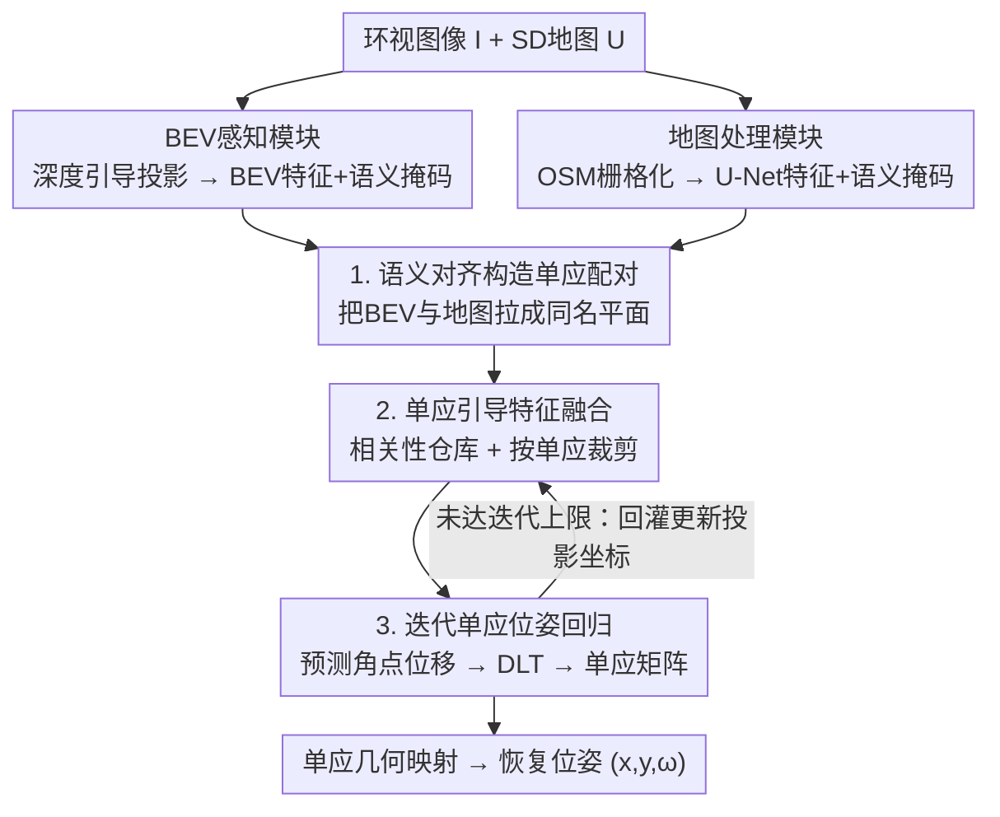

# HOLO: Homography-Guided Pose Estimator Network for Fine-Grained Visual Localization on SD Maps

**会议**: CVPR 2026  
**论文**: [CVF Open Access](https://openaccess.thecvf.com/content/CVPR2026/html/Zhong_HOLO_Homography-Guided_Pose_Estimator_Network_for_Fine-Grained_Visual_Localization_on_CVPR_2026_paper.html)  
**代码**: 待确认（论文称将公开）  
**领域**: 自动驾驶 / 视觉定位 / BEV感知  
**关键词**: 视觉定位, SD地图, 单应估计, BEV, 3-DoF位姿

## 一句话总结
HOLO 把"环视图像在标清（SD）地图上的细粒度定位"重构成 **BEV 特征与地图块之间的单应估计**问题：先用语义对齐把两模态拉成满足单应约束的特征对，再用单应关系引导特征融合、并把位姿输出约束在可行解空间内，从而比"注意力融合 + 直接回归 3-DoF 位姿"的旧方法收敛更快、定位更准，在 nuScenes 上 Recall@1m/2m 提升约 16%。

## 研究背景与动机

**领域现状**：自动驾驶需要可靠的自车定位，但 GPS 在城市峡谷、隧道、遮挡区会严重漂移。视觉定位是 GPS 失效场景的有力补充。地图侧从昂贵难维护的高清（HD）地图，正转向轻量、易获取的**标清地图（SD map）**，如 OpenStreetMap。技术上分两条路线：**匹配类**（如 OrienterNet 穷举位姿候选做 BEV-to-map 匹配，精度受采样分辨率限制、候选越多越慢）和**回归类**（如 MapLocNet 直接回归目标位姿，绕开匹配但要拟合连续位姿值、训练更难收敛更慢）。

**现有痛点**：作者指出回归类方法有两个根本缺陷。① **特征融合阶段缺几何引导**：大多数方法只靠注意力机制隐式学跨模态相关性，效率低；② **直接回归 3-DoF 位姿缺几何约束**：梯度不稳、优化困难、易过拟合。

**核心矛盾**：回归类要拟合连续位姿，本质比匹配类"在有限候选里挑相似度"更难；而现有回归方法又没把 BEV 与地图之间**本就存在的几何先验**用起来，导致"难上加难"。

**本文目标**：① 给特征融合注入显式几何引导；② 给位姿输出加几何约束、压缩解空间。

**切入角度**：作者观察到一个被忽视的几何事实——**局部 BEV 表征与对应的地图块本质上是同一个地平面的两个投影视图，二者之间存在单应（homography）关系**。既然如此，定位就可以重写成"估计 BEV 与地图之间的单应矩阵"，再从单应矩阵几何地恢复车辆位姿，而不是端到端硬回归 $(x,y,\omega)$。

**核心 idea**：用 BEV 与 SD 地图之间的单应几何先验，**既引导特征融合、又约束位姿解码**，把图像到地图的定位统一成"语义对齐 + 弱监督单应估计"的端到端联合优化。

## 方法详解

### 整体框架

输入是六路环视图像 $I=\{I_i\}_{i=1}^N$ 和由含噪 GPS 圈定的参考地图 $U$，输出是车辆在地图上的 3-DoF 位姿 $p=(x,y,\omega)$。网络分三块：**BEV 感知模块**把环视图升到 BEV 空间并出语义掩码；**地图处理模块**把 OSM 矢量地图栅格化、编码并出语义掩码；二者通过**语义对齐**形成满足单应约束的特征对，给下游提供显式几何先验；最后**单应引导位姿估计模块**用单应关系引导 BEV 与地图特征的相关性计算，迭代地预测角点位移→解出单应矩阵→几何恢复位姿。整网用语义损失 + 位姿损失端到端联合训练，两个任务相互增益。

### 关键设计

**1. 把定位重构成单应估计 + 语义对齐构造特征对**

旧方法把图像-地图定位当作纯回归或纯匹配，没利用两模态的平面几何关系。HOLO 的第一步是**让 BEV 和地图变成一对满足单应约束的特征**，否则后面"用单应引导"无从谈起。BEV 感知模块沿用 LSS/OrienterNet 的深度引导投影：EfficientNet-B0 抽多尺度特征，联合预测离散深度分布与语义嵌入，经可微体素池化升成 BEV 张量 $\mathcal{F}_{bev}\in\mathbb{R}^{C\times H_{bev}\times W_{bev}}$，并由分割头出 BEV 语义掩码 $M^{sem}_{bev}$。地图处理模块把 OSM 矢量栅格化（只保留**道路、建筑**两类关键元素以抗 OSM 的低精度/不一致），给每类赋可学习嵌入，用基于 VGG16 的 U-Net 编码出与 BEV 同尺寸的地图特征 $\mathcal{F}_{map}$ 及地图语义掩码 $M^{sem}_{map}$。两路语义掩码都用 SD 地图真值监督，**迫使 BEV 与地图在语义空间对齐**——对齐后它们才构成可估单应的同名平面对。这一步同时缩小了图像与地图的模态鸿沟，是单应学习能直接从语义特征上进行的前提。

**2. 单应引导特征融合：相关性仓库 + 按单应裁剪，替代注意力**

旧方法靠注意力隐式学跨模态对应，既低效又无几何先验。HOLO 借鉴相关性式单应估计（IHN/HCNet/SSHNet），用**显式相关性**代替注意力。先用 Siamese ResNet 把 $\mathcal{F}_{BEV}, \mathcal{F}_{Map}$ 下采样 4 倍、$1\times1$ 卷积投影成单应特征 $F_{BEV}, F_{Map}\in\mathbb{R}^{D\times H'\times W'}$，再做全位置点积构造稠密相关体 $C_{ijkl}=\text{ReLU}(F_{BEV}(i,j)^\top F_{Map}(k,l))$，并平均池化出半分辨率版 $C_{1/2}$。$C$ 与 $C_{1/2}$ 一次算好、当作"相关性仓库"（feature warehouse）。每次迭代**不重算相关性**，而是按上一轮估计的单应 $H_{k-1}$ 把 $F_{BEV}$ 的投影坐标 $X$ 映射到 $F_{Map}$，在每个坐标周围以固定半径 $r$ 裁出局部相关块 $S_k=\{C(u,v)\mid(u,v)\in N(X_k,r)\}$（同理从 $C_{1/2}$ 取 $S_k^{1/2}$）当作本轮融合特征。这样做的关键收益是**每加一轮迭代只多跑一次位姿解码器、几乎零额外开销**（Table 4：每迭代 GFLOPs 仅 +0.98、FPS 仅 −5.62%），而注意力式融合每轮都要重算、代价高得多。

**3. 迭代单应位姿回归：角点位移 → DLT → 单应矩阵，约束可行解空间**

直接回归 3-DoF 位姿梯度不稳、易过拟合。HOLO 让位姿解码器**不直接预测 $(x,y,\omega)$，而是输出角点位移 $\Delta D_k$**，再经直接线性变换（DLT）把位移转成单应矩阵 $H_k$，用 $H_k$ 更新投影坐标 $X$ 供下一轮裁剪，迭代 $N=6$ 轮。最终位姿从单应矩阵**几何地**恢复：把 BEV 网格中心 $(u_c,v_c)$ 经 $s[u'_c,v'_c,1]^\top=H[u_c,v_c,1]^\top$ 投到地图得位置 $(x,y)$；再投一个辅助点 $(u_c,v_c+\Delta v)$ 得 $(u'_a,v'_a)$，由连线方向算航向 $\omega=\arctan2(v'_a-v'_c,u'_a-u'_c)-\arctan2(\Delta v,0)$。因为位姿被强制落在"合法单应能产生"的解空间内，优化更稳、收敛更快——消融（Table 2）显示无论用哪种融合，把回归头换成单应头都全指标大涨（如 HOLO 单迭代 Recall@1m 从 9.88→26.57）。

### 损失函数 / 训练策略

端到端联合优化，混合损失含两部分。**语义损失**用 SD 地图作监督，BEV 与地图两路预测掩码都对二值真值做 BCE：$L_{sem}=\sum_{i\in\{bev,map\}}\text{BCE}(M^{sem}_i,M^{GT}_i)$。**位姿损失**对平移用 L2、对航向用 L1（更稳健）：$L_{pose}=\lambda_{trans}\|\hat{t}-t\|_2^2+\lambda_{ori}\|\hat{\omega}-\omega\|_1$。总目标 $L=\lambda_{sem}L_{sem}+L_{pose}$，权重 $\lambda_{sem}=1000,\lambda_{trans}=1,\lambda_{ori}=10$。单 A6000、AdamW、max lr $3.5\times10^{-4}$、batch 16、训练 18 万步、OneCycle 调度；BEV 覆盖 64m×64m@0.25m/px，地图 128m×128m@0.5m/px，训练时随机加 ±30°/±30m 模拟 GPS 噪声。语义对齐与单应估计**互相增益**：联合训练下分割 IoU 也涨（道路 +3.37%、建筑 +1.02%）。

## 实验关键数据

### 主实验

nuScenes 数据集（700 训练 / 150 验证），SD 地图从 OSM 检索并对齐到 nuScenes 坐标系。下表为定位召回（越高越好）与绝对误差（越低越好）：

| 方法 | 输入 | Recall@1m | Recall@2m | Recall@1° | APE(m)↓ | AOE(°)↓ |
|------|------|------|------|------|------|------|
| OrienterNet | 相机 | 15.74 | 33.27 | 31.69 | 15.47 | 26.43 |
| MapLocNet | 相机 | 20.10 | 45.54 | 58.61 | — | — |
| SegLocNet-drivable | 相机+激光 | 59.08 | 76.04 | 63.19 | 5.30 | 10.11 |
| HOLO-CA（注意力融合对照） | 相机 | 21.47 | 46.70 | 39.52 | 4.31 | 1.78 |
| **HOLO-road（仅道路监督）** | 相机 | 30.40 | 54.36 | 69.76 | 3.76 | 1.06 |
| **HOLO-drivable** | 相机 | **36.41** | **61.21** | **73.74** | **3.37** | **1.02** |

> 关键对比：相比 MapLocNet，用道路层监督就提升 Recall@1m/2m +10.30%/+8.82%、Recall@1°/2° +11.15%/+4.23%；用可行驶区监督则达 +16.31%/+15.67% 与 +15.13%/+7.41%。航向误差 AOE 从旧方法的两位数降到 ~1°，是质的飞跃。即便只用 SD 地图道路层（不靠 HD 地图的可行驶区层），精度仍逼近用 HD 层的方法。

### 消融实验

| 配置 | Recall@1m | Recall@1° | 说明 |
|------|------|------|------|
| HOLO-CA + 3-DoF回归头 | 10.06 | 18.04 | 注意力融合 + 直接回归 |
| HOLO-CA + 单应头 | 21.47 | 39.52 | 换单应头即大涨 |
| HOLO(单迭代) + 3-DoF回归头 | 9.88 | 10.08 | 本文融合 + 直接回归 |
| **HOLO(单迭代) + 单应头** | **26.57** | **45.62** | 两项设计齐备 |

| 迭代次数 | Recall@1m | Recall@1° | 备注 |
|----------|------|------|------|
| 1 | 26.57 | 45.62 | — |
| 2 | 31.64 | 67.37 | 25.6 FPS |
| 6 | **36.41** | **73.74** | 19.9 FPS |

### 关键发现
- **单应头是最大功臣**：无论融合方式如何，把"直接回归 3-DoF"换成"角点位移→单应"都让 Recall@1m 翻倍以上（9.88→26.57 / 10.06→21.47），印证"约束可行解空间"带来的训练效率与精度。
- **迭代几乎零成本**：本文每迭代仅 +0.98 GFLOPs / −5.62% FPS，而 MapLocNet/HOLO-CA 每迭代 FPS 掉约 25%（Table 4），因为本文只更新预算好的相关性采样位置、不重算注意力融合。
- **跨分辨率鲁棒**：固定地图 0.5mpp、改变 BEV 分辨率（0.25 vs 0.5mpp）性能基本不变，得益于显式单应建模天然支持跨分辨率输入。
- **抗噪**：噪声从 30m 加到 40m（地图块可能与 BEV 不完全重叠）仍可比 MapLocNet 在 30m 下的表现。
- **联合训练增益分割**：单应学习让 BEV 分割 IoU 涨（道路 +3.37%、建筑 +1.02%），两任务互惠。

## 亮点与洞察
- **"BEV-地图本是单应对"的几何洞察很关键**：一句被忽视的平面几何事实，直接把难训的连续位姿回归改写成有几何约束的单应估计，这是全文精度飞跃的根。可迁移到任何"地平面对地平面"的对齐任务（卫星图定位、跨视角检索）。
- **相关性仓库 + 按单应裁剪**：把"一次算好稠密相关体、迭代只裁剪不重算"做成几乎免费的迭代精化，是把相关性式单应估计高效化的工程巧思，对实时性（20 FPS）至关重要。
- **角点位移→DLT→单应→几何恢复位姿**：用"预测位移再几何解算"替代"端到端硬回归"，把网络任务变简单、把几何留给确定性运算，是个稳训练的通用 trick。
- **语义对齐与单应估计互惠**：联合优化让定位和分割彼此涨点，体现"几何约束反过来正则化感知特征"。

## 局限与展望
- **单帧、无时序**：当前是单时刻定位，作者将"引入时序感知"列为未来工作；高动态/长隧道下单帧可能不稳。
- **依赖语义对齐质量**：只保留道路+建筑两类，城市中这两类稀疏（郊区/空旷路段）时单应配对可能退化，论文未深入讨论。⚠️ 对建筑稀疏区的鲁棒性存疑。
- **仅 nuScenes 验证**：未跨数据集/跨城市域外验证，OSM 对齐还做了"小常数漂移校正"，迁移到其他地区需重新对齐。
- **与多模态方法的差距**：在 Recall@1m/2m 上略低于带激光的 SegLocNet（LiDAR 缩小了域差、提升感知），纯相机方案在最严指标上仍有差距。
- 改进方向：融合时序滤波、引入更多地图语义类、做跨城市域适应。

## 相关工作与启发
- **vs OrienterNet（匹配类）**：穷举位姿候选做 BEV-to-map 匹配，精度受采样分辨率限制、候选多则慢；HOLO 回归连续位姿、无需离散采样，且用单应几何稳住训练。
- **vs MapLocNet（回归类）**：直接回归 3-DoF 位姿、靠注意力隐式融合，无几何先验；HOLO 用单应同时引导融合与解码，Recall@1m/2m 提升约 16%，AOE 从两位数降到 ~1°。
- **vs SegLocNet（多模态匹配）**：用二值语义掩码 + 激光提升匹配精度；HOLO 纯相机在多数指标反超，仅 Recall@1m/2m 略低（激光缩小域差所致）。
- **vs SSHNet 等跨模态单应估计**：它们因缺几何监督需分阶段训练；HOLO 有 GT 车辆位姿，可端到端联合优化语义对齐与单应回归，收敛更快。

## 评分
- 新颖性: ⭐⭐⭐⭐⭐ 首个把 BEV 语义推理与单应学习统一用于图像-地图定位的工作，几何洞察清晰且有效。
- 实验充分度: ⭐⭐⭐⭐ 主对比 + 单应/迭代/分辨率/噪声/分割多重消融扎实；扣分在仅 nuScenes 单数据集、无跨域验证。
- 写作质量: ⭐⭐⭐⭐ 动机（为何用单应）推导透彻、消融对照干净；公式在原文 OCR 中略乱。
- 价值: ⭐⭐⭐⭐⭐ SD 地图低成本可扩展、20 FPS 实时、精度 SOTA，对自动驾驶量产定位有直接落地价值，并扩展开源了 nuScenes 的 SD 地图。

<!-- RELATED:START -->

## 相关论文

- [\[AAAI 2026\] Fine-Grained Representation for Lane Topology Reasoning](../../AAAI2026/autonomous_driving/fine-grained_representation_for_lane_topology_reasoning.md)
- [\[CVPR 2026\] Plant Taxonomy Meets Plant Counting: A Fine-Grained, Taxonomic Dataset for Counting Hundreds of Plant Species](plant_taxonomy_meets_plant_counting_a_fine-grained_taxonomic_dataset_for_countin.md)
- [\[CVPR 2026\] LA-Pose: Latent Action Pretraining Meets Pose Estimation](la-pose_latent_action_pretraining_meets_pose_estimation.md)
- [\[CVPR 2026\] BEV-SLD: Self-Supervised Scene Landmark Detection for Global Localization with LiDAR Bird's-Eye View Images](bev-sld_self-supervised_scene_landmark_detection_for_global_localization_with_li.md)
- [\[CVPR 2025\] Distilling Monocular Foundation Model for Fine-grained Depth Completion](../../CVPR2025/autonomous_driving/distilling_monocular_foundation_model_for_fine-grained_depth_completion.md)

<!-- RELATED:END -->
