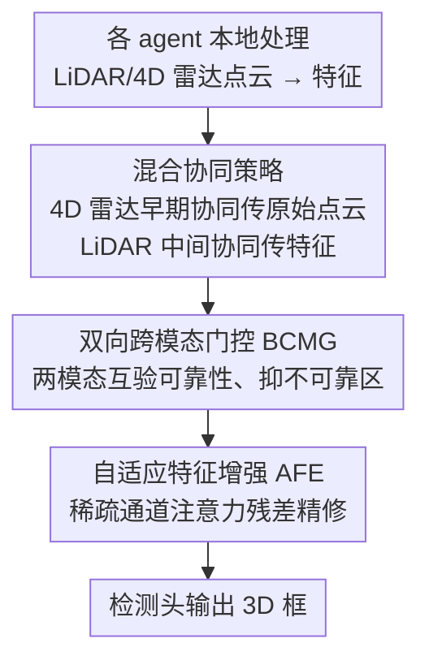

# Hybrid Robust Collaborative Perception with LiDAR-4D Radar Fusion under Adverse Weather Conditions

**会议**: CVPR 2026  
**论文**: [CVF Open Access](https://openaccess.thecvf.com/content/CVPR2026/html/Yang_Hybrid_Robust_Collaborative_Perception_with_LiDAR-4D_Radar_Fusion_under_Adverse_CVPR_2026_paper.html)  
**代码**: 无  
**领域**: 自动驾驶 / 协同感知 / 3D目标检测  
**关键词**: 协同感知, LiDAR-4D雷达融合, 恶劣天气, 跨模态门控, V2X

## 一句话总结
HRCP 针对"恶劣天气下多智能体协同感知"，提出按传感器物理特性区别传输的混合协同策略（稀疏 4D 雷达走早期协同传原始点云、稠密 LiDAR 走中间协同传特征），并把 LiDAR-4D 雷达融合重新建模为"联合重建一个稠密可靠表征"，用双向跨模态门控（BCMG）互验可靠性 + 自适应特征增强（AFE）补回信息损失，在 V2X-R 仿真与 V2X-Radar-C 真实数据集上全面超过 SOTA。

## 研究背景与动机
**领域现状**：协同感知靠 V2X 通信让多个智能体共享感知信息，按传输阶段分早期/中间/后期融合；当前主流（多基于 LiDAR 或 LiDAR-相机）几乎都用**中间融合**——共享编码后的特征，以在检测精度和通信带宽间取折中。

**现有痛点**：LiDAR 和相机都对天气敏感，雾/雪下会产生缺失或虚假特征，且二者**共享对环境的脆弱性**，可能在关键场景同时失效。4D 雷达天然抗天气、可补这个短板，但把稀疏的 4D 雷达和退化的 LiDAR 融合仍有两个老问题：① **跨模态污染**——朴素融合会让退化 LiDAR 和稀疏雷达互相污染；② **信息损失**——天气退化已经损了信息，去噪类方法在抑噪时又会把残存的有用特征一并丢掉。

**核心矛盾**：更糟的是，协同场景下 LiDAR 退化会**在传输中累积**，多智能体聚合后退化分布更密更重；而现有唯一的协同 LiDAR-4D 雷达方法（V2X-R/MDD）把稀疏雷达**当稠密 LiDAR 一样**走中间协同，既让通信开销翻倍，又因雷达本就稀疏、编码（体素化离散）会进一步丢细节而限制了性能。

**本文目标**：① 设计一套契合两种传感器各自物理特性的协同传输策略，别让稀疏雷达白白翻倍带宽；② 把 LiDAR-4D 雷达融合从"简单特征聚合"升级为"联合重建稠密可靠表征"，同时解决跨模态污染与信息损失。

**切入角度**：LiDAR 数据量大、早期传原始点云带宽爆炸，所以走中间协同传特征；4D 雷达数据量极小，早期传原始点云几乎不增成本，还能保留体素化会丢的完整结构、支持点级对齐。两类传感器该用不同协同策略。

**核心 idea**：用"按模态分治的混合协同 + 把融合当联合重建（先互验、再精修）"替代"两模态同质化中间协同 + 简单拼接融合"。

## 方法详解

### 整体框架
设 $N$ 个智能体各装 LiDAR 与 4D 雷达。HRCP 整条流水线分四阶段：**1) 本地处理** 每个 agent 用共享编码器 $\phi_{Enc}$ 提 LiDAR 特征 $F_i^l=\phi_{Enc}(X_i^l)$；**2) 多智能体协同**（混合策略）——4D 雷达走**早期协同**，先把各 agent 的原始雷达点云空间对齐合并 $f_{merge}$ 再编码得 $F_A^r=\phi_{Enc}(f_{merge}(X_i^r,\{X_{j\to i}^r\}))$，LiDAR 走**中间协同**，用 agent 融合网络 $\phi_A$ 聚合各 agent 的 LiDAR 特征得 $F_A^l$；**3) 模态融合** 用融合网络 $\phi_M$ 把 $F_A^l,F_A^r$ 融成多智能体多模态表征 $F_A^M$；**4) 框预测** 检测头从 $F_A^M$ 出 3D 框 $B$。

第 3 步是核心创新所在：作者把融合建模为**联合重建**——假设存在一个理想条件下的潜在特征 $\mathcal{F}$，观测到的两路 BEV 特征是它的两种退化视图 $F_A^l=\mathcal{D}_n(\mathcal{F})$（天气退化）、$F_A^r=\mathcal{D}_s(\mathcal{F})$（雷达稀疏），融合目标是重建出逼近 $\mathcal{F}$ 的 $F_A^M$。由于"抑稠密噪声"和"提取有用线索"对单网络是冲突目标，作者把它拆成**先验证可靠性（BCMG）、再综合精修（AFE）**的串行过程。

### 关键设计

**1. 混合协同策略：按传感器物理特性区别传输，别让稀疏雷达白翻带宽**

针对"现有方法把稀疏雷达当稠密 LiDAR 同质化中间协同、带宽翻倍还掉性能"的痛点，HRCP 给两种传感器分配不同协同模式。LiDAR 点云稠密、原始数据量巨大，早期传原始点云带宽爆炸，故走**中间协同**传编码特征取精度/带宽折中；4D 雷达点云极稀疏、数据量极小，早期传原始点云几乎不增成本（图 3：传中间特征比传原始雷达点云贵约 21.4 倍，但比传原始 LiDAR 点云省约 24.5 倍），且原始点云保留了体素化会丢的完整物体结构、支持跨 agent 点级对齐与互补增强，故走**早期协同**。这一分治既保留原始信息又避免传稠密雷达特征，反而比同质化中间协同更省带宽、更准。

**2. 双向跨模态门控 BCMG：让两模态互为校验者，抑制各自不可靠区域**

把融合当联合重建后，第一步要"验证可靠性、保跨模态一致"。BCMG 利用 4D 雷达抗天气的特性去识别 LiDAR 特征图中仍可靠 vs 被严重退化的区域，反过来用 LiDAR 的稠密结构细节把雷达里"真实物体回波"和"非结构杂波"区分开。具体对每个模态生成一个**以对方模态为条件**的软注意力门：
$$\mathcal{G}_l=\sigma(W_{r\to l}\ast F_A^r),\quad \mathcal{G}_r=\sigma(W_{l\to r}\ast F_A^l)$$
再逐元素相乘 $\tilde{F}_A^l=\mathcal{G}_l\odot F_A^l$、$\tilde{F}_A^r=\mathcal{G}_r\odot F_A^r$，得到"雷达校验过的 LiDAR 特征"（天气退化区被抑制）和"LiDAR 引导的雷达特征"（非结构杂波被抑制）。这一步本质是**减法/抑制**操作，互验后跨模态表征更一致。

**3. 自适应特征增强 AFE：补回 BCMG 抑制掉的信号、对抗信息损失**

BCMG 是减法操作，但天气退化不只是引入虚假噪声，还有**信号衰减**（图 5：雾/雪不仅加噪还削弱真实回波），只靠抑制会次优。AFE 用带稀疏通道注意力的残差网络精修退化与被抑制区域。它把雷达校验 LiDAR 特征 $\tilde{F}_A^l$、LiDAR 引导雷达特征 $\tilde{F}_A^r$、原始雷达特征 $F_A^r$ 拼接（保留一致上下文 + 原始线索）投到共享隐空间 $F_{emb}=f_{emb}(\text{Cat}[\tilde{F}_A^l,\tilde{F}_A^r,F_A^r])$，再用稀疏通道注意力 $s=\sigma(\text{Conv1D}(\text{GMP}(F_{emb})))$ 自适应标定通道、定位需精修的空间区域，经跳连得 $F_{att}=F_{emb}+(F_{emb}\odot s)$，最后用输出投影产残差修正项叠回 LiDAR 特征：$F_A^M=\tilde{F}_A^l+f_{out}(F_{att})$。残差设计既能在恶劣天气下补退化/被抑制区，也能在晴天学到两模态潜在交互、增强表达。

### 损失函数 / 训练策略
理想特征 $\mathcal{F}$ 即便晴天也拿不到，故采用端到端学习、不在潜在特征上加监督。检测头含分类头 + 回归头（各一个卷积块），分类用 focal loss $\mathcal{L}_{cls}$、框回归用 smooth L1 $\mathcal{L}_{reg}$，总损失 $\mathcal{L}_{total}=\beta_{cls}\mathcal{L}_{cls}+\beta_{reg}\mathcal{L}_{reg}$，取 $\beta_{cls}=1,\beta_{reg}=2$。骨干统一用 PointPillar（体素分辨率 0.4m），8×RTX 3090，Adam，lr=1e-3。

## 实验关键数据

### 主实验
评测于 V2X-R（CARLA+OpenCDA 仿真，含模拟雾/雪）与 V2X-Radar-C（真实世界 4D 雷达协同数据集），指标为 mAP@IoU{0.3,0.5,0.7}。对比方法把单模态协同方法（AttFuse/V2X-ViT/CoBEVT/CoAlign）按"雷达当 LiDAR 拼接特征"扩成多模态，把多模态方法（InterFusion/L4DR）加自注意力 agent 融合扩成多智能体，保证公平。

V2X-R 不同天气下 mAP@0.7：

| 方法 | Clear | Fog | Snow |
|--------|------|------|----------|
| CoAlign | 79.37 | 61.62 | 67.54 |
| L4DR | 80.15 | 60.94 | 67.93 |
| MDD | 79.21 | 59.52 | 63.31 |
| **HRCP (本文)** | **84.07** | **66.04** | **76.63** |

相比次优，HRCP 在雾/雪下 mAP@0.7 分别比 CoAlign 提升 4.42% / 9.09%、比 L4DR 提升 5.10% / 8.70%，晴天也最优（说明融合建模促进了更有效的跨模态潜在交互、逼近理想情况）。

真实世界 V2X-Radar-C：

| 方法 | mAP@0.3 | mAP@0.5 | mAP@0.7 |
|------|------|------|------|
| CoAlign | 52.55 | 43.91 | 29.66 |
| L4DR | 48.06 | 42.33 | 30.71 |
| **HRCP** | **54.08** | **49.72** | **33.19** |

较次优分别 +1.53% / +3.68% / +2.48%，验证真实场景有效性。位姿鲁棒性实验（表 2）显示，随定位/朝向误差增大，HRCP 在所有误差档下都最优且**掉点最慢**。

### 消融实验
V2X-R 上对模态与组件消融（mAP@0.3/0.5/0.7）：

| 配置 | Fog | Snow | 说明 |
|------|---------|------|------|
| (a) 仅雷达 | 82.04/74.25/42.53 | 82.04/74.25/42.53 | 抗天气但太稀疏，高精度差 |
| (b) 仅 LiDAR | 67.26/65.86/50.28 | 82.23/78.24/51.75 | 恶劣天气下退化严重 |
| (c) LiDAR-雷达融合 | 85.48/80.60/56.76 | 87.87/84.41/63.54 | 双模态基线 |
| (d) 去掉 AFE | 87.21/82.30/59.91 | 91.42/88.62/64.61 | 缺信息补全 |
| (e) 去掉 BCMG | 84.15/78.70/60.05 | 91.41/88.78/70.87 | 缺互验一致性 |
| (f) 完整 HRCP | — | — | 见主表最优 |

### 关键发现
- **单模态都不够，融合是刚需**：仅雷达虽抗天气但稀疏导致 mAP@0.7 仅 42.53；仅 LiDAR 恶劣天气下大幅退化；融合后显著跃升，印证多模态协同是恶劣天气下的可行解。
- **BCMG 与 AFE 互补缺一不可**：去掉 AFE（仅互验不补全）在雪天 mAP@0.7 从完整模型明显回落到 64.61，去掉 BCMG（仅精修不互验）则雾天 mAP@0.3 掉到 84.15——前者印证"光抑制会丢信号衰减部分"，后者印证"先互验才能保跨模态一致"。
- **增益在恶劣天气与高 IoU 下最突出**：雪天 mAP@0.7 提升达 9.09%、且 mAP@0.7（高精度档）增益普遍大于 mAP@0.3，说明方法在"高精度协同感知"任务上优势尤其明显。

## 亮点与洞察
- **"按物理特性分配协同模式"是很务实的洞察**：把"稀疏雷达走早期、稠密 LiDAR 走中间"讲清了带宽账（雷达原始点云比中间特征还省），既省带宽又保留点级结构，这个分治思路可推广到任意稠密+稀疏传感器协同。
- **把融合重述为"联合重建退化视图"**很优雅：用 $F_A^l=\mathcal{D}_n(\mathcal{F})$、$F_A^r=\mathcal{D}_s(\mathcal{F})$ 这套潜在理想特征视角，自然导出"先互验、再精修"的串行分解，比"简单拼接"有更强的可解释性。
- **BCMG 的双向条件门控**让两模态互为校验者，而非单向增强，能同时压住"LiDAR 的天气退化区"和"雷达的非结构杂波"，是一个可复用的跨模态可靠性筛选 trick。

## 局限与展望
- **作者承认**：理想特征 $\mathcal{F}$ 不可得，只能端到端无潜在监督地学，重建质量缺乏直接约束；方法主要面向 LiDAR+4D 雷达双模态，未涉及相机等更多模态。
- **自己发现**：早期协同传原始雷达点云虽省带宽，但依赖较好的跨 agent 空间对齐 $f_{merge}$，在位姿误差更大或通信受限场景下原始点云对齐误差可能放大（⚠️ 原文位姿鲁棒性实验主要在雷达稀疏前提下，对早期协同对齐误差的单独分析有限，以原文为准）；另外仿真 V2X-R 的雾/雪退化与真实退化分布是否一致也影响泛化。
- **改进思路**：可探索给联合重建加自监督/对比约束逼近 $\mathcal{F}$，或把混合协同策略推广到 LiDAR+雷达+相机三模态、按各自带宽-鲁棒性画像自动选协同模式。

## 相关工作与启发
- **vs V2X-R / MDD**：它们是首个协同 LiDAR-4D 雷达融合工作，但把稀疏雷达当稠密 LiDAR 同质化中间协同、带宽翻倍；HRCP 用混合协同（雷达早期、LiDAR 中间）既省带宽又保结构，雾/雪 mAP@0.7 大幅领先。
- **vs L4DR / InterFusion（单智能体雷达增强）**：它们用门控/自注意力做单 agent 跨模态融合，但面对协同场景下累积放大的退化分布、扩到多 agent 时易遇跨模态污染与信息损失；HRCP 把融合升级为联合重建 + 双向门控 + 自适应增强，在多智能体协同下更稳。
- **vs CoAlign（位姿鲁棒协同）**：CoAlign 靠 agent-object 位姿图建模抗位姿误差，可视作另一种退化的处理；HRCP 在位姿误差实验里仍全面领先且掉点最慢，说明其对"天气退化 + 位姿退化"的复合鲁棒性更强。

## 评分
- 新颖性: ⭐⭐⭐⭐ "按物理特性分混合协同 + 融合即联合重建"组合新颖且切中协同雷达-LiDAR 的真实痛点，但单个组件（门控、通道注意力残差）较常规。
- 实验充分度: ⭐⭐⭐⭐ 仿真+真实双数据集、多天气、多 IoU、位姿鲁棒性、模态/组件消融较完整；略憾缺与相机模态的对比及更细的带宽-性能权衡曲线。
- 写作质量: ⭐⭐⭐⭐ 动机（跨模态污染/信息损失）与方法（互验→精修）映射清晰，图 1/3 把动机讲得直观。
- 价值: ⭐⭐⭐⭐ 对恶劣天气协同感知有实际意义，混合协同的带宽洞察与联合重建视角均可迁移。

<!-- RELATED:START -->

## 相关论文

- [\[CVPR 2026\] Structure-to-Intensity Diffusion for Adverse-Weather LiDAR Generation](structure-to-intensity_diffusion_for_adverse-weather_lidar_generation.md)
- [\[CVPR 2026\] DSERT-RoLL: Robust Multi-Modal Perception for Diverse Driving Conditions with Stereo Event-RGB-Thermal Cameras, 4D Radar, and Dual-LiDAR](dsert-roll_robust_multi-modal_perception_for_diverse_driving_conditions_with_ste.md)
- [\[CVPR 2026\] CATNet: Collaborative Alignment and Transformation Network for Cooperative Perception](catnet_collaborative_alignment_and_transformation_network_for_cooperative_percep.md)
- [\[CVPR 2026\] HG-Lane: High-Fidelity Generation of Lane Scenes under Adverse Weather and Lighting Conditions without Re-annotation](hg-lane_high-fidelity_generation_of_lane_scenes_under_adverse_weather_and_lighti.md)
- [\[CVPR 2026\] CoLC: Communication-Efficient Collaborative Perception with LiDAR Completion](colc_communication-efficient_collaborative_perception_with_lidar_completion.md)

<!-- RELATED:END -->
