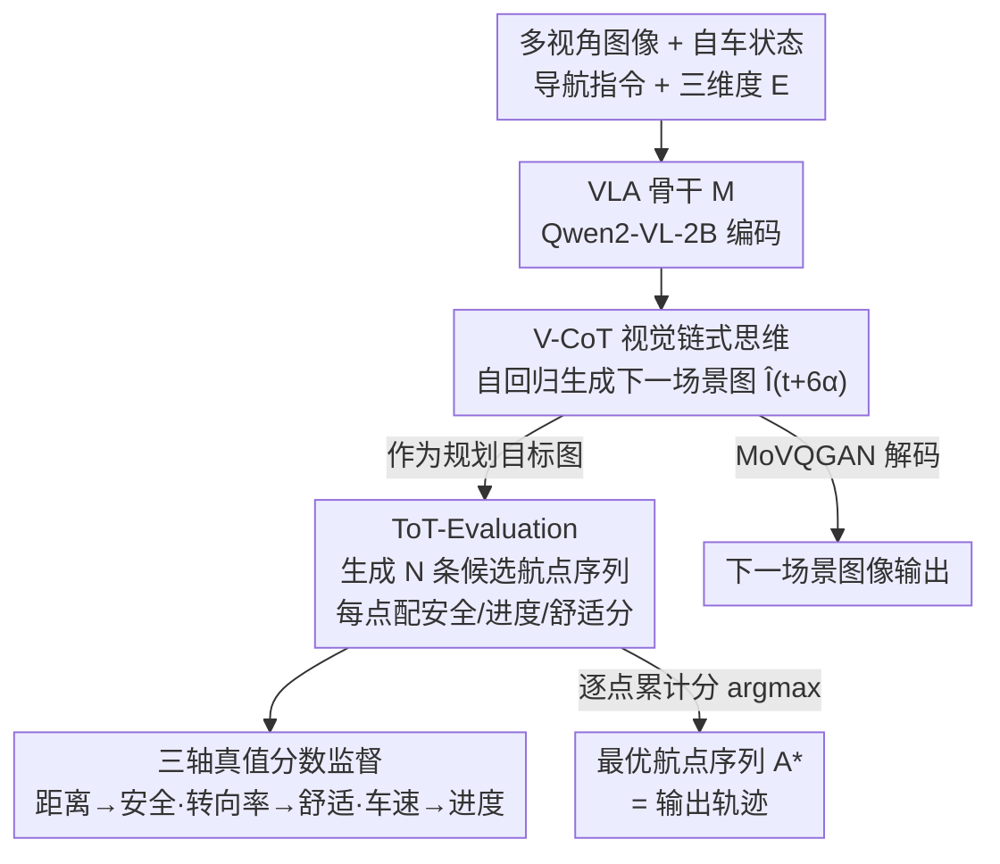

# HybridDriveVLA: Vision-Language-Action Model with Visual CoT reasoning and ToT Evaluation for Autonomous Driving

**会议**: CVPR 2026  
**论文**: [CVF OpenAccess](https://openaccess.thecvf.com/content/CVPR2026/html/Bassole_HybridDriveVLA_Vision-Language-Action_Model_with_Visual_CoT_reasoning_and_ToT_Evaluation_CVPR_2026_paper.html)  
**代码**: 无  
**领域**: 自动驾驶 / VLA / 多模态VLM  
**关键词**: 视觉链式思维, 树式思维评估, 端到端驾驶, 轨迹规划, nuScenes

## 一句话总结
HybridDriveVLA 把传统驾驶 VLA 里"图像转文本再做 CoT 推理"换成在视觉域里直接预测未来场景（V-CoT），并用一套树式思维的多轨迹评估（ToT-Evaluation）按安全/进度/舒适三个维度逐点打分、选最优航点序列，在 nuScenes 上把自回归 VLA 的平均碰撞率压到 0.17%。

## 研究背景与动机

**领域现状**：端到端自动驾驶正快速收敛到由视觉-语言-动作（VLA）模型驱动的范式。这类模型把原始传感器数据和导航指令直接映射成车辆控制动作，借助基础模型的知识和推理能力来理解复杂交通场景。为了提升可解释性，主流做法（DriveVLM、DriveLM、LingoQA、GPT-Driver 等）会先把视觉场景"翻译"成文本，再用 Chain-of-Thought（CoT）在文本空间里逐步推理，最后输出一条轨迹。

**现有痛点**：这条"image-to-text + 文本 CoT"的路线有两个根本毛病。其一，把连续、高维的视觉场景离散化成文本 token 会引入**模态鸿沟**——空间信息（车道几何、物体精确位置、场景连续演化）在语言抽象的过程中被不可逆地丢掉，而这些恰恰是精确规划最需要的。其二，现有 VLA 通常只预测**单一**一条航点序列，并且是"同时考虑安全/进度/舒适所有方面"挤出来的一条统计上最可能的轨迹，缺乏对每个维度的单独审议。在多智能体、不确定的路口场景里，这种"一锤定音"的轨迹很容易在某个维度上翻车（不安全、不舒适或不前进）。

**核心矛盾**：可解释性是靠"转成文本"换来的，但转成文本就丢了空间精度；而单序列规划又把"多维权衡"压成了一个无法拆解的黑箱决策。作者想同时要可解释性、空间精度和多维审议。

**本文目标**：(1) 让推理过程保持在视觉域内，不丢空间信息；(2) 把"单条多维轨迹"拆成"多条候选 + 逐维度打分 + 显式择优"，让每个驾驶维度的重要性可被看见和评估。

**切入角度**：模仿人类司机的认知回路——先在脑子里"想象"下一刻场景会是什么样（anticipation），再围绕这个想象出来的目标"掂量"几条走法的安全、进度、舒适，最后挑一条（deliberation）。前者天然对应视觉预测，后者天然对应树式搜索/自评估。

**核心 idea**：用**视觉 CoT 预测未来场景图**当作规划目标（保住空间信息），再用**树式思维评估**生成多条航点序列并按三轴打分取最优，把 CoT 与 ToT 首次统一进同一个 VLA 模型。

## 方法详解

### 整体框架

HybridDriveVLA 建立在一个预训练 VLA 骨干 $M$（Qwen2-VL-2B：含视觉编码器+投影、文本 tokenizer、文本 detokenizer）之上。当前时刻 $t$ 的输入是一组同步多视角图像 $I_t=\{i^1_t,\dots,i^h_t\}$、自车状态 $l_t$、导航指令 $c_t$（LEFT/RIGHT/FORWARD）、自然语言指令 $o_t$，以及评估维度集合 $E=\{e_{safety}, e_{progress}, e_{comfort}\}$。

整条推理分两步走、串成一条自回归序列：先由 **V-CoT** 在视觉域自回归生成 $t+6\alpha$ 时刻的"下一场景图" $\hat I_{t+6\alpha}$（经 MoVQGAN 编码成离散视觉 token、解码还原成图像），把它当作规划要奔赴的**目标状态**；再由 **ToT-Evaluation** 以这张目标图为条件，生成 $N$ 条候选航点序列，并给每条序列里每个航点配上安全/进度/舒适三个分数，最后按累计分数 argmax 选出最优序列 $A^*$。整套机制只在一个生成式推理流里完成，输出同时包含"想象的未来场景图"和"选定的航点动作"。

### 关键设计

**1. V-CoT 视觉链式思维：把"想未来"留在视觉域里，不丢空间信息**

针对痛点之一——文本 CoT 把视觉离散成语言 token、丢掉空间精度。V-CoT 的做法是让模型**直接在视觉空间里预测未来**：从输入特征出发，自回归地生成 $t+6\alpha$（约 3 秒后）的下一场景图当作目标，

$$\hat I_{t+6\alpha} = M(I_t, E, l_t, c_t, o_t)$$

每张未来场景图被 MoVQGAN 编码成 $\sigma=512$ 个离散视觉 token $\{q_1,\dots,q_\sigma\}$，训练目标是用骨干 $M$ 自回归地把这串视觉 token 重建出来，最小化负对数似然：

$$\mathcal{L}_{\text{V-CoT}} = -\sum_{d=1}^{\sigma}\log P_\theta(q_d \mid q_{<\sigma}, I_t, E, l_t, c_t, o_t)$$

其中 $q_d$ 是位置 $d$ 的真值视觉 token，$\theta$ 是模型参数。这一步等于让模型像司机一样"在脑子里把下一个机动动作模拟出来"，而且模拟结果是一张保留了车道布局、物体位置、时序连续性的图，而不是一段把这些信息抹平的文字。它生成的目标图随后直接喂给规划模块，从源头上保住了规划所需的空间连续性——这是和 DriveVLM 这类纯文本 CoT 最本质的区别。

**2. ToT-Evaluation 树式思维评估：用"多候选 + 逐维度打分 + 显式择优"代替单条多维轨迹**

针对痛点之二——单序列规划把多维权衡压成黑箱。ToT-Evaluation 不再只产出一条路径，而是以 V-CoT 给的目标图 $\hat I_{t+6\alpha}$ 为条件，生成 $N$ 条候选航点序列。第 $n$ 条序列记为 $A_n=\{a^n_{t+\alpha},\dots,a^n_{t+6\alpha}\}$，序列里每个航点 $a^n_{t+k\alpha}$ 都附带一组三轴分数 $\mathcal{S}^n_{t+k\alpha}=\{s^{n,safety}, s^{n,progress}, s^{n,comfort}\}$，全部由骨干一次性条件生成：

$$\{(a^n_{t+k\alpha}, \mathcal{S}^n_{t+k\alpha})\}_{n=1}^N = M(I_t, \hat I_{t+6\alpha}, E, l_t, c_t, o_t)$$

推理时，先把每个航点的三轴分数求和得到该点总分 $T^n_{t+k\alpha}=\sum_j s^{n,j}_{t+k\alpha}$（$j\in\{safety,progress,comfort\}$），再对每个时刻逐点取累计总分最高的候选：

$$n^* = \arg\max_{n\in\{1,\dots,N\}} T^n_{t+k\alpha}$$

作者把这个过程类比成一种"以航点为节点的、基于推理的 beam search"：每个节点是一个候选航点，模型一边展开多条分支一边自评估，最终拼出最优序列 $A^*$。这样做的好处是多维权衡被**显式拆开又可解释**——你能看到某条候选为什么在安全维度被打了低分而被淘汰，而不是只拿到一条无法追问的轨迹。其训练目标是自回归地最大化生成真值航点序列及其分数的对数似然：

$$\mathcal{L}_{\text{ToT-Eval}} = -\sum_{n=1}^{N}\sum_{k=1}^{6}\sum_j \log P_\theta\big(a^n_{t+k\alpha}, s^{n,j}_{t+k\alpha} \mid a^n_{<t+k\alpha}, s^{n,j}_{<t+k\alpha}, I_t, \hat I_{t+6\alpha}, E, l_t, c_t, o_t\big)$$

**3. 三轴可解释真值分数构造：让"安全/进度/舒适"有量化标尺去监督**

ToT-Evaluation 要学会打分，前提是有真值分数可学。作者从 nuScenes 的统计量里给三个维度各设计了一把可解释的标尺（$\sigma(\cdot)$ 为归一化/sigmoid 映射），把物理量线性归一化后压到分数：

- **安全分**：取自车到任意其他物体的最小欧氏距离 $d_{t+k\alpha}$，用数据集上的 $d^{min}$、$d^{avg}$ 做线性归一，距离越大越安全：
$$s^{safety}_{t+k\alpha} = \sigma\!\left(\frac{d_{t+k\alpha}-d^{min}}{d^{avg}-d^{min}}\right)$$
- **舒适分**：取自车转向率 $c_{t+k\alpha}$，转向越平缓越舒适：
$$s^{comfort}_{t+k\alpha} = \sigma\!\left(1-\frac{c_{t+k\alpha}-c^{min}}{c^{avg}-c^{min}}\right)$$
- **进度分**：取自车车速 $v_{t+k\alpha}$，速度越高进度越大：
$$s^{progress}_{t+k\alpha} = \sigma\!\left(\frac{v_{t+k\alpha}-v^{min}}{v^{avg}-v^{min}}\right)$$

这三组分数就是 ToT-Evaluation 学习预测的真值目标。它的意义在于把"什么叫安全/舒适/前进"从模糊的直觉变成了有数据支撑、可被监督也可被解释的标量，让模型在推理时给出的每个分数都能对应回一个物理含义（离障碍物多近、方向盘打得多急、走得多快）。

### 损失函数 / 训练策略

总损失把两个推理目标直接相加，联合优化"想象未来"和"评估规划"，保证目标图和航点序列彼此一致：

$$\mathcal{L}_{\text{HybridDriveVLA}} = \mathcal{L}_{\text{V-CoT}} + \mathcal{L}_{\text{ToT-Eval}}$$

训练分两阶段：

- **监督微调（SFT）**：从大规模 VLA 初始化，在"多视角输入—场景标注—下一场景图"配对样本上联合优化下一场景预测和多航点序列。这一步打牢视觉因果理解与时序连贯性，让视觉 token 空间和语言 token 空间对齐，使模型能用文本生成那套自回归逻辑去做空间推理。作者强调：先用 SFT 让模型"看懂"视觉场景是后续能有效审议的前提（消融里去掉这一阶段碰撞率明显变差）。
- **指令微调（IT）**：在由 nuScenes 元数据模板化出的视觉-指令语料上，用 LoRA 训练，**冻结视觉塔**、只更新语言模型和 LoRA 适配器，以保留已学到的视觉特征。这一步专门打磨 ToT-Evaluation 的逐维度审议，让模型学会按安全/进度/舒适的优先级生成并评估多条路径，把"视觉驱动的预测"升级成"可审议的规划"。关键超参：航点预测间隔 $\alpha=0.5\text{s}$、cosine 学习率、SFT 20 epoch（lr $1.0\times10^{-4}$，batch 8/卡，梯度累积 16）。

### 数据集构建

两套都从 nuScenes（1000 段约 20 秒驾驶序列，28,130 训练 / 6,019 验证）派生，各服务一个阶段：

- **SFT 视觉生成集**：对每个时间对 $(t, t+6\alpha)$ 取多视角帧 $I_t$ 和未来帧 $I_{t+6\alpha}$，未来帧用 MoVQGAN 编码成离散视觉 token；样本是 prompt-response 对（输入含当前图和"生成 3 秒后场景"的指令，输出是未来帧的视觉 token 序列）。
- **IT 推理集**：把当前视角 $I_t$ + 自车轨迹历史 + 导航指令 + 维度 $E$ + 预测的未来场景 $\hat I_{t+6\alpha}$ 组成结构化 prompt，response 是 $N$ 条带三轴真值分数的航点序列，分数按上面三把标尺从 nuScenes 统计量算出，提供可解释监督。

## 实验关键数据

### 主实验

nuScenes 验证集轨迹规划，同时用 UniAD（逐时刻）和 ST-P3（平均）两套协议。下表摘自论文叙述（HybridDriveVLA 为 Qwen2-VL-2B 骨干，自回归方法类）：

| 方法 | 类型 | ST-P3 L2 Avg (m) ↓ | ST-P3 碰撞率 Avg (%) ↓ | UniAD L2 Avg (m) ↓ | UniAD 碰撞率 Avg (%) ↓ |
|------|------|------|------|------|------|
| GPT-Driver | 自回归(GPT-3.5) | 0.44 | 0.17 | 0.84 | 0.44 |
| DriveVLM | 自回归(Qwen-VL-7B) | 0.40 | 0.27 | – | – |
| RDA-Driver | 自回归(LLaVA-7B) | 0.40 | 0.10 | 0.80 | 0.32 |
| OpenDriveVLA | 自回归(Qwen2.5-3B) | 0.33 | 0.10 | 0.67 | 0.30 |
| **HybridDriveVLA (Full)** | 自回归(Qwen2-VL-2B) | **0.26** | **0.17** | **0.31** | **0.19** |

正文明确：完整模型（V-CoT + ToT）平均碰撞率 **0.17%（ST-P3）/ 0.19%（UniAD）**，在仅 2B 骨干下，碰撞率显著优于 7B/3B 的自回归同行，UniAD 协议下 L2 平均误差（0.31m）也大幅领先，甚至能和非自回归方法掰手腕。⚠️ 原文表格 OCR 数值有错位/噪声，碰撞率以正文叙述的 0.17%/0.19% 为准。

NAVSIM 基准上展示了"按优先维度切换驾驶风格"的能力（越高越好）：

| 变体 | PDMS ↑ | TTC ↑ | Comfort ↑ | Progress ↑ |
|------|------|------|------|------|
| HybridDriveVLA (Safety) | 94.89 | **98.73** | 97.91 | 92.74 |
| HybridDriveVLA (Comfort) | 91.73 | 97.31 | **97.72** | 96.41 |
| HybridDriveVLA (Progress) | 93.12 | 97.18 | 92.53 | 96.82 |
| HybridDriveVLA (Optimal) | **94.62** | 99.42 | 96.85 | 96.56 |

当被引导优先"安全"时拿到最高 TTC（98.73），优先"舒适"时拿到最高 Comfort（97.72），而平衡三者的 Optimal 取得最强综合 PDMS（94.62），印证 ToT-Evaluation 确实在以可解释的方式评估航点。

### 消融实验

| 配置 | ST-P3 碰撞率 Avg (%) | 说明 |
|------|------|------|
| HybridDriveVLA (Full, V-CoT + ToT) | 0.17 | 完整模型 |
| w/o V-CoT（仅 ToT-Evaluation） | 0.23 | 去掉视觉预测目标，碰撞率上升，相对恶化约 26% |
| w/o V-CoT 的 SFT 阶段 | 0.23 | 未先 SFT 学懂视觉就直接 IT，碰撞率明显变差 |

### 关键发现
- **V-CoT 和 ToT-Evaluation 是互补的**：单靠 ToT 审议（无视觉锚定目标）碰撞率 0.23%，接上 V-CoT 的未来场景目标后降到 0.17%，相对改善约 26%——说明"审议"必须被锚定在一个被想象出来的具体未来视觉场景上才真正有效。
- **SFT 是审议能力的前提**：跳过 V-CoT 的 SFT 阶段会让碰撞率退回 0.23%，说明模型得先"看懂"视觉场景，才能在指令微调里有效地推理和择优。
- **小骨干也能打**：仅 2B 参数（Qwen2-VL-2B）就在自回归 VLA 里拿下 SOTA 级碰撞率，定性分析显示在与他车有潜在冲突的路口，无审议的基线会径直冲向危险轨迹，而 ToT-Evaluation 会给不安全/不舒适/不前进的航点打低分并避开。

## 亮点与洞察
- **把 CoT 留在像素域**是最核心的"啊哈"：别人把视觉翻成文本再推理，本文反过来让"推理的中间产物"本身就是一张未来场景图，从根上避免了空间信息在语言化时被抹平——这个"用生成式视觉预测当推理步骤"的思路可迁移到任何需要空间精度的具身规划任务。
- **首次把 CoT 与 ToT 统一进一个 VLA**：V-CoT 负责"想象目标"、ToT-Evaluation 负责"围绕目标审议多条路"，两者串成单一自回归流，形成"感知—预测—评估"的类人闭环。
- **三轴打分把黑箱权衡变成可读账本**：安全/进度/舒适各有物理标尺（距离/转向率/车速），逐航点出分再 argmax，使"为什么选这条轨迹"可被逐点追问，还能通过指定优先维度直接切换驾驶风格——这对需要可解释性和可调性的量产驾驶系统很有吸引力。
- **以航点为节点的 beam search 视角**很优雅：把树式搜索的"展开+自评估"落到航点粒度，复用了语言模型自回归的现成机制，不需要外挂搜索器。

## 局限与展望
- **只在 nuScenes（及 NAVSIM）上验证**：未来场景目标固定在 $t+6\alpha\approx3\text{s}$、$\alpha=0.5\text{s}$，长时域、复杂城市拓扑和真实闭环部署下的鲁棒性还未知。
- **依赖 V-CoT 想象的未来图质量**：ToT 审议被锚定在生成的目标场景上，若 MoVQGAN 重建/预测出现幻觉或漂移，错误会传导到规划；论文未给出对生成场景质量的量化评估或失败分析。
- **三轴分数权重是简单等权相加**：总分 $T=\sum_j s^j$ 默认三维度等权，未讨论不同场景下权重该如何自适应；指标定义里部分归一化映射（如 sigmoid 的具体参数）依赖数据集统计量，跨数据集迁移性存疑（⚠️ 部分分数公式细节以原文为准）。
- **无开源代码**：复现成本较高，候选数 $N$、采样策略等关键实现细节披露有限。

## 相关工作与启发
- **vs DriveVLM / DriveLM / GPT-Driver（文本 CoT 类）**：它们把视觉转成文本再做链式推理以获得可解释性，本文指出这会丢空间信息，改用视觉域内的场景预测当推理步骤，在更小骨干（2B）下取得更低碰撞率。
- **vs UniAD / VAD / TransFuser（端到端规划）**：这些方法统一感知与规划但缺显式推理可解释性；本文用 V-CoT 把"下一帧预测"嵌进推理本身、用 ToT-Evaluation 把视觉预测落到逐维度航点择优，补上了可解释审议。
- **vs GAIA-1 / DriveDreamer（未来场景生成）**：它们能生成逼真未来帧但与下游控制脱节；本文把生成的未来场景直接当作规划目标，闭合了"生成—规划"的回路。
- **vs OpenDriveVLA / AutoVLA（自回归 VLA）**：同为自回归 VLA，本文额外引入"多候选 + 三轴打分 + argmax"的树式审议，把单条多维轨迹拆成可评估的多条，安全性更优。

## 评分
- 新颖性: ⭐⭐⭐⭐ 首次把视觉 CoT 与树式思维评估统一进 VLA，"用生成式未来场景当规划目标"的视角有想象力。
- 实验充分度: ⭐⭐⭐ nuScenes + NAVSIM 双基准、消融拆出 V-CoT/SFT 贡献，但缺生成质量分析、未讨论 $N$/权重敏感性，表格 OCR 噪声较大。
- 写作质量: ⭐⭐⭐ 动机和公式清晰，但符号偶有不一致、表格排版混乱，部分分数定义需对照原文。
- 价值: ⭐⭐⭐⭐ 可解释的逐维度审议 + 可切换驾驶风格，对量产驾驶系统的安全性与可调性有现实意义。

<!-- RELATED:START -->

## 相关论文

- [\[CVPR 2026\] NoRD: A Data-Efficient Vision-Language-Action Model that Drives without Reasoning](nord_a_data-efficient_vision-language-action_model_that_drives_without_reasoning.md)
- [\[CVPR 2026\] DriveMoE: Mixture-of-Experts for Vision-Language-Action Model in End-to-End Autonomous Driving](drivemoe_mixture-of-experts_for_vision-language-action_model_in_end-to-end_auton.md)
- [\[CVPR 2026\] Learning Vision-Language-Action World Models for Autonomous Driving](vla_world_learning_vision_language_action_world_models_for_autonomous_driving.md)
- [\[CVPR 2026\] Drive My Way: Preference Alignment of Vision-Language-Action Model for Personalized Driving](drive_my_way_preference_alignment_of_vision-language-action_model_for_personaliz.md)
- [\[CVPR 2026\] Unifying Language-Action Understanding and Generation for Autonomous Driving](unifying_language-action_understanding_and_generation_for_autonomous_driving.md)

<!-- RELATED:END -->
