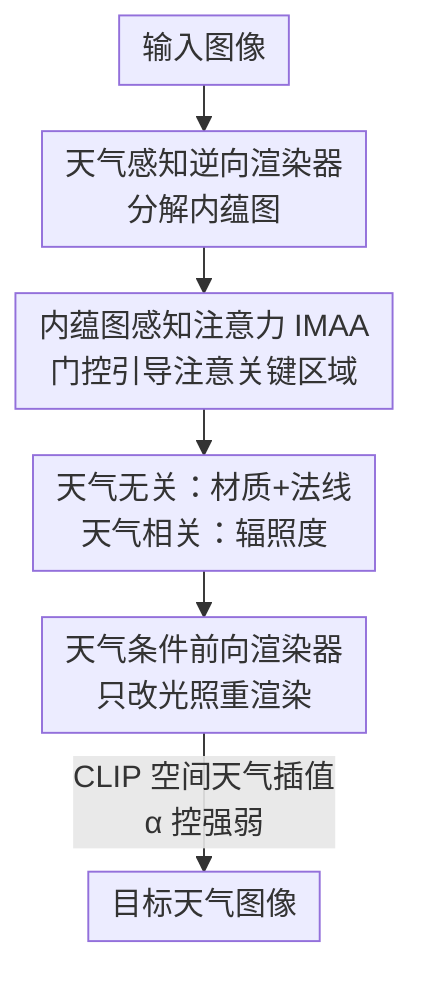

# IntrinsicWeather: Controllable Weather Editing in Intrinsic Space

**会议**: CVPR 2026  
**arXiv**: [2508.06982](https://arxiv.org/abs/2508.06982)  
**代码**: https://yixinzhu042.github.io/IntrinsicWeather/ (项目主页)  
**领域**: 自动驾驶 / 扩散模型 / 逆向渲染  
**关键词**: 天气编辑, 内蕴空间分解, 逆向渲染, 扩散先验, 自动驾驶感知

## 一句话总结
用扩散模型把图像分解成"天气无关的材质/几何 + 天气相关的光照"内蕴图（intrinsic maps），再用文本提示在内蕴空间里重新渲染目标天气，从而做到既能精细可控地改天气、又能保住场景的材质与几何，逆向渲染 PSNR 比 SOTA 高 10+ dB，并显著提升下游检测/分割在恶劣天气下的鲁棒性。

## 研究背景与动机
**领域现状**：当前主流的天气编辑（weather editing）方法基本都在像素空间里做——拿一个统一的扩散/生成模型，直接把"晴天"的图翻译成"雨天/雪天"。代表如 WeatherWeaver 把任务拆成"天气去除 + 天气合成"两阶段，FluxKontext、Qwen-Image-Edit 等通用图像编辑模型也常被直接拿来用。

**现有痛点**：像素空间编辑把天气效果和场景外观纠缠在一起，改天气时往往连带改坏了底层的材质、几何和光照——比如去雪时把车的颜色改了、把行人的姿态/数量改了，或者加雨时残留了晴天的阴影显得违和。本质上它们缺乏物理可解释性，无法保证材质/几何/光照的一致性。

**核心矛盾**：天气现象（雨雪雾、积雪积水）主要绑定在场景的**光照**上，而不是材质本身的属性；但像素空间方法没有把这两者拆开，于是"改天气"和"保结构"之间存在固有冲突。

**本文目标**：① 把图像可靠地分解到内蕴空间（材质、几何、光照），且要能在大尺度户外/驾驶场景下工作；② 在内蕴空间里用文本精细可控地合成目标天气；③ 用编辑后的"干净图"提升下游感知。

**切入角度**：作者受 RGB↔X、DiffusionRenderer 这类基于扩散先验的内蕴分解/重组工作启发——但这些方法只在室内、物体级别有效，不针对天气、也不能泛化到大尺度自动驾驶场景。作者认为只要把分解质量在户外场景下做上去，就能把"改天气"变成"只改光照那一张图"。

**核心 idea**：把天气编辑从像素空间搬到内蕴空间——逆向渲染拆出天气无关的材质/几何 + 天气相关的光照图，前向渲染只动光照、用 CLIP 空间插值控制天气强度，材质几何天然保住。

## 方法详解

### 整体框架
IntrinsicWeather 由两个互补的扩散模块组成，都基于 Stable Diffusion 3.5 改造而来。**天气感知逆向渲染器**（weather-aware inverse renderer）把输入图分解成一组内蕴图：天气无关的材质图（albedo 反照率、roughness 粗糙度、metallicity 金属度）、法线图 normal，以及一张捕获了光照和天气效果的辐照度图 irradiance。**天气条件前向渲染器**（weather-conditioned forward renderer）再把这些几何/材质图和一段描述目标天气的文本提示组合起来，重新渲染出新图。整条管线"输入图 → 内蕴图 → 重渲染图"，关键在于天气只活在 irradiance 这一支里，材质几何那几张图在改天气时保持不变，因此能做到几何/材质保真的可控编辑。

为了让逆向分解在户外大场景下也准，作者给逆向渲染器加了**内蕴图感知注意力（IMAA）**；为了让天气可以连续调强弱，前向渲染器用了 **CLIP 空间天气插值**；为了补真实世界泛化，作者还自建了合成 + 真实两套带内蕴图标注的数据集。

### 关键设计

**1. 内蕴空间分解：把天气从材质几何里剥出来**

像素空间编辑最大的毛病是天气和外观纠缠，作者直接把战场换到内蕴空间。逆向渲染器把一张图拆成天气无关的材质三件套（albedo / roughness / metallicity）+ 法线 normal，以及一张专门承载光照与天气的 irradiance 辐照度图。因为雨雪雾这些现象在物理上主要由光照决定，把它们隔离到 irradiance 这一支后，"改天气"就退化成"只重渲染光照那一支、材质几何原样保留"，从根上解决了"改天气会改坏结构"的冲突。前向渲染时只要给定这些图加上目标天气文本，就能合成几何一致、光照自然的新图——这也是它能彻底清掉空中颗粒（雪花）和地表堆积（积雪）、同时不动车的颜色和行人姿态的原因

**2. 内蕴图感知注意力 IMAA：让分解在户外小物体上也站得住**

户外/驾驶场景物体尺度差异极大，原始 Stable Diffusion 缺乏显式注意力引导，在远处小物体和几何复杂区域分解得很差；而且作者观察到不同内蕴图天然该关注图像的不同区域（法线该盯几何剧变处，metallicity 该盯车辆、杆、栏杆这些金属物）。IMAA 用 DINOv2 抽 patch token $p$，给每张内蕴图配一个可学习嵌入 $d \in \mathbb{R}^{D_{model}}$，再用门控算出一张图感知 mask：$m = \text{gating}(p, d) = \text{MLP}([f_p(p), f_d(d)])$，其中 $f_p, f_d$ 是线性投影。这个 mask 被拼成联合注意力偏置 $M$，只在图像 token（$K_I$ 集合）上加偏置、文本 token 不动，然后注入 DiT 的注意力：$\text{Attn}(Q,K,V) = \text{Softmax}(\frac{QK^T}{\sqrt{d_k}} + M)V$。它同时作用在文本–图像和图像–图像两块注意力上，前者把文本引导压到重要区域、后者强化图像内部的特征聚合。这样模型就被"逼"着去看与当前要估的那张图最相关的区域，远处小物体和金属件的分解质量明显变好——消融里去掉 IMAA，albedo PSNR 从 27.99 掉到 26.78、irradiance 从 29.66 掉到 26.99

**3. CLIP 空间天气插值：让天气强度可以连续调**

要做"小雨→大雨""薄雪→积雪盖路"这种细粒度过渡，离散的天气类别提示是不够的。作者在 CLIP 文本空间里先求一个天气过渡方向 $e = \text{Embed}(w_1) - \text{Embed}(w_2)$（$w_1$ 目标天气如 rainy，$w_2$ 原天气如 overcast），再从一个天气中性嵌入 $w_{base}$ 沿这个方向走 $\alpha$ 步：$E = \text{Embed}(w_{base}) + \alpha \cdot e$，用 $E$ 替换原始提示喂给模型。通过采样不同的 $\alpha$，前向渲染器就能渲出连续过渡的中间天气状态——这比 WeatherWeaver 那种"对原图叠不同强度滤镜"的伪过渡真实得多（路面随雨势逐渐变湿、雪先落在路边枝头再积满路面）。为了不破坏预训练模型的丰富先验，作者还把前向渲染器的部分中间特征向原始 Stable Diffusion 对齐做特征蒸馏（distillation）

### 损失函数 / 训练策略
两个渲染器都基于 SD 3.5 微调。IMAA 采用启发式引导的渐进训练策略（heuristic-guided progressive training）来稳定学习、保证 IMAA 在早期就能给出有意义的引导——例如对 irradiance 图，用梯度算子提取受光区域和阴影边界作为引导先验（细节在补充材料）。前向渲染器通过特征蒸馏对齐原始 SD 中间特征以保住生成先验。训练数据上，先用 38K 合成图（WeatherSynthetic）训出基础能力，再用 18K 真实图（WeatherReal，由自己的逆向渲染器+FluxKontext 生成伪标签）微调来补真实世界泛化；WeatherReal 仅用于微调、不用于评测。

## 实验关键数据

### 主实验

**与像素空间编辑 / 渲染类方法对比（Tab. 1）** ——CLIP-S 越高表示编辑越贴合文本且合理：

| 方法 | 类型 | CLIP-S(Rainy) ↑ | CLIP-S(Snowy) ↑ | DINO-S ↑ |
|------|------|------|------|------|
| **Ours** | 渲染类 | **20.76** | **22.32** | 73.63 |
| RGB↔X | 渲染类 | 20.29 | 19.92 | 55.87 |
| DiffusionRenderer | 渲染类 | – | – | 43.12 |
| Flux-Kontext | 像素 | 19.46 | 22.25 | 85.50 |
| Qwen-Image-Edit | 像素 | 21.56 | 22.43 | 53.70 |
| WeatherWeaver | 像素 | 20.25 | 21.41 | 67.01 |

本文 CLIP-S 最高（文本对齐+合理性最好）；DINO-S 仅次于 Flux-Kontext，但后者根本没有效去除/合成天气，且 Qwen 的略高 PickScore 是以引入不一致纹理几何为代价。用户研究中 61 名参与者对 8 个案例投票，本文平均偏好率 **81.67%**。

**逆向渲染分解质量（WeatherSynthetic 测试集，Tab. 3）**：

| 方法 | Albedo PSNR ↑ | Normal PSNR ↑ | Normal MAE ↓ | Irradiance PSNR ↑ |
|------|------|------|------|------|
| **Ours** | **27.99** | **25.06** | **4.24** | **29.66** |
| DiffusionRenderer | 11.91 | 16.43 | 28.68 | – |
| RGB↔X (w/ finetune) | 11.35 | 16.14 | 7.05 | 16.38 |
| IID (w/ finetune) | 11.55 | – | – | – |
| IDArb | 6.40 | 10.77 | 22.42 | – |

本文在所有指标上全面领先，Albedo PSNR 从次优的 ~11.9 跳到 27.99（>10 dB 提升），即使把 IID/RGB↔X 在本数据集上微调过也追不上。

**下游感知增益（ACDC 验证集，Tab. 2）** ——先用 IntrinsicWeather 把恶劣天气图编辑成晴天再跑检测/分割：

| 模型 | AP0.5 | AP0.75 | mAP[0.5:0.95] | mIOU |
|------|------|------|------|------|
| DETR | 56.56 | 13.15 | 47.00 | – |
| DETR + ours | **61.32** | **24.60** | **54.87** | – |
| Segformer | – | – | – | 24.13 |
| Segformer + ours | – | – | – | **30.05** |
| 绝对增益 | +4.76 | +11.45 | +7.87 | +5.92 |

AP75 从 13.15% 提到 24.60%（相对 +87.1%），mIOU 从 24.13% 提到 30.05%（相对 +24.5%）。

### 消融实验
| 配置 | Albedo PSNR | Irradiance PSNR | 说明 |
|------|------|------|------|
| Full (w/ IMAA) | 27.99 | 29.66 | 完整模型 |
| w/o IMAA | 26.78 | 26.99 | 去掉注意力引导，远处小物体/金属件分解变差 |
| w/o WeatherReal | — | — | 仅合成数据训练，真实世界光照/物体/天气合成不够真实（定性 Fig. 11） |

### 关键发现
- **IMAA 对 irradiance 帮助最大**：去掉后 irradiance PSNR 掉了 2.67 dB（29.66→26.99），远大于 albedo 的 1.21 dB——说明光照那一支最依赖空间注意力引导，因为受光/阴影区域恰是天气编辑的关键。
- **内蕴空间 vs 像素空间的本质优势**：本文能彻底清掉空中颗粒 + 地表堆积（雪花+积雪），而天气恢复方法（AWRaCLe、Histoformer）只能去掉空中颗粒、改不了地表材质和整体光照。
- **真实数据微调不可省**：只用合成数据训练时，逆向/前向渲染器在真实样本上泛化不足，WeatherReal 微调后光照与物体更真实。

## 亮点与洞察
- **把"改天气"重新定义成"只改光照一张图"**：通过把天气物理性地隔离到 irradiance 分支，材质几何在编辑中天然不被触碰——这是它结构一致性碾压像素空间方法的根因，也是最让人"啊哈"的地方。
- **IMAA 的门控思路可迁移**："不同输出图该看输入图的不同区域"这一观察 + 用可学习嵌入做门控生成注意力偏置，可推广到任何"一图多解码头"的稠密预测任务（如多任务分割、多属性估计），让每个头各看各的区域。
- **CLIP 空间方向插值做连续控制**：把"天气强度"建模成 CLIP 文本嵌入上的一条方向向量、用 $\alpha$ 标量连续采样，是一种很轻量的细粒度条件控制范式，可迁移到任何"沿语义轴连续过渡"的编辑（光照、季节、时间）。
- **编辑当成数据增强/预处理**：把生成式编辑放在感知模型输入端、主动矫正环境畸变，是一条提升恶劣天气鲁棒性的实用路线。

## 局限与展望
- **强依赖自建数据集**：合成数据用 UE5 渲染、真实数据用自家逆向渲染器+FluxKontext 生成伪标签，伪标签质量直接决定上限；真实标注的缺失意味着逆向渲染的"真值"本身就是估计出来的。
- **真实世界评测的循环依赖**：WeatherReal 的内蕴图就是用本文逆向渲染器生成的，再拿来微调本文模型，存在一定的自洽偏置；论文也声明 WeatherReal 不用于评测以回避这一点。
- **下游评测维度有限**：只在 ACDC 上用 DETR/Segformer 验证，且只测了"恶劣天气→晴天"这一方向的增益，没有覆盖更多检测器/分割器和更广的天气-任务组合。
- **计算成本**：两个独立的 SD 3.5 改造模型串联，逆向+前向都是扩散采样，推理开销对实时自动驾驶部署是个问号（论文未给推理时延）。⚠️ 部分训练/蒸馏细节在补充材料，正文未完整展开。

## 相关工作与启发
- **vs WeatherWeaver**: 它在像素空间把天气编辑拆成去除+合成两阶段、微调视频扩散模型；本文在内蕴空间只动光照分支，几何材质保真度和细粒度连续控制都更好（WeatherWeaver 的强度过渡更像叠滤镜）。
- **vs RGB↔X / DiffusionRenderer**: 都是基于扩散先验的内蕴分解/重组，但只针对室内、物体级或视频重光照，泛化不到大尺度户外驾驶场景；本文用 IMAA 专门补上户外分解保真度，逆向 PSNR 高 10+ dB。
- **vs IntrinsicEdit**: 同样在内蕴空间编辑，但聚焦物体级编辑；本文面向大尺度户外场景且专攻天气。
- **vs 天气恢复方法（AWRaCLe / Histoformer）**: 它们只是图像复原、去除空中颗粒；本文还能改地表材质和整体光照，并能反向合成任意目标天气。
- **vs 3D 空间天气编辑**: 需要精确几何，真实驾驶场景拿不到；本文从单图逆向渲染出几何，绕开了这一前提。

## 评分
- 新颖性: ⭐⭐⭐⭐⭐ 把天气编辑搬到内蕴空间 + IMAA + CLIP 方向插值，三点组合在户外驾驶场景下是清晰的范式创新。
- 实验充分度: ⭐⭐⭐⭐ 逆向/前向/下游三方面都有定量对比和消融，但下游只测了 ACDC + 两个 backbone，推理成本未报告。
- 写作质量: ⭐⭐⭐⭐ 动机清晰、图表充分；不少训练/蒸馏细节压在补充材料里。
- 价值: ⭐⭐⭐⭐⭐ 提供了内蕴空间天气编辑的完整方案 + 两套带内蕴标注的驾驶数据集，对自动驾驶恶劣天气鲁棒性有直接实用价值。

<!-- RELATED:START -->

## 相关论文

- [\[CVPR 2025\] SceneCrafter: Controllable Multi-View Driving Scene Editing](../../CVPR2025/autonomous_driving/scenecrafter_controllable_multi-view_driving_scene_editing.md)
- [\[CVPR 2026\] Structure-to-Intensity Diffusion for Adverse-Weather LiDAR Generation](structure-to-intensity_diffusion_for_adverse-weather_lidar_generation.md)
- [\[CVPR 2026\] LiDAR-to-4DRadar Diffusion Bridge via Cross-Modal Alignment and Translation in Latent Space](lidar-to-4dradar_diffusion_bridge_via_cross-modal_alignment_and_translation_in_l.md)
- [\[CVPR 2026\] x2-Fusion: Cross-Modality and Cross-Dimension Flow Estimation in Event Edge Space](x2-fusion_cross-modality_and_cross-dimension_flow_estimation_in_event_edge_space.md)
- [\[CVPR 2026\] HorizonForge: Driving Scene Editing with Any Trajectories and Any Vehicles](horizonforge_driving_scene_editing_with_any_trajectories_and_any_vehicles.md)

<!-- RELATED:END -->
