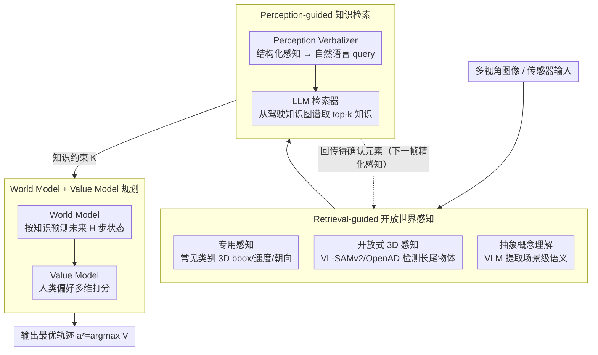

# KnowVal: A Knowledge-Augmented and Value-Guided Autonomous Driving System

**会议**: CVPR 2026  
**arXiv**: [2512.20299](https://arxiv.org/abs/2512.20299)  
**代码**: 待确认  
**领域**: 自动驾驶 / 知识增强规划  
**关键词**: end-to-end driving, knowledge graph, value model, world model, open-world perception, VLM, retrieval-augmented planning

## 一句话总结

提出KnowVal端到端自驾系统，通过三大核心解决知识推理和价值对齐缺失：(1)Retrieval-guided Open-world Perception融合标准3D检测+VL-SAMv2长尾物体+VLM场景理解；(2)Perception-guided Knowledge Retrieval从驾驶知识图谱（交通法/防御驾驶/道德规范）检索相关知识；(3)World Model预测未来状态+Value Model（human-preference训练）评估轨迹价值，实现可解释决策。nuScenes最低碰撞率，Bench2Drive/NVISIM SOTA。

## 研究背景与动机

端到端自动驾驶近年发展迅速，从感知到规划用单一模型完成，避免了模块间的误差累积。但现有端到端方法存在两个根本性缺陷：

**缺乏知识推理能力**：当前模型以数据驱动为主，学到的是统计模式而非驾驶知识。面对训练数据未覆盖的长尾场景（如施工区域特殊标志、不常见的交通手势、道德困境），模型无法像人类驾驶员那样调用交通法规、防御驾驶常识来做出合理决策

**缺乏价值对齐**：模型的优化目标（如模仿学习的轨迹L2距离）与人类对"好驾驶"的价值判断之间存在gap。人类认为好的驾驶不仅是到达目的地，还包括乘客舒适性、对弱势道路使用者的礼让、遵守社会规范等——这些无法通过简单的轨迹匹配来学习

**具体场景举例**：
- 一个施工区域放置了临时限速标志和锥桶→标准3D检测器不认识这些物体→需要开放世界感知+知识检索来理解"这是施工区，应减速"
- 一辆救护车在后方鸣笛→模型需要知道"应靠边让行"这一交通法规→需要知识图谱支持
- 前方行人犹豫是否过马路→需要"防御驾驶"知识指导减速观察→需要知识推理

现有方法如DriveVLM/LMDrive引入了VLM，但主要用于场景描述而非知识推理；UniAD等统一框架虽然端到端，但规划仍缺乏价值引导。

## 方法详解

### 整体框架

KnowVal 想补上端到端自驾的两块短板：缺知识推理（只学了统计模式，碰到长尾场景不会调用交规/防御驾驶常识）和缺价值对齐（优化目标是轨迹 L2 距离，而非人类心中"好驾驶"的多维标准）。它用三个模块串成一个**感知 → 知识检索 → 规划**的闭环：开放世界感知先把场景看全（含长尾物体和抽象语义），知识检索据此从驾驶知识图谱里调出相关知识，World Model + Value Model 再据知识预测未来并按人类偏好给候选轨迹打分。一个关键之处是感知与检索**相互引导**——检索还会把"需进一步确认的元素"回传给下一帧的感知。三个模块都不绑定具体的底层感知/规划架构，可以即插即用地接到任意端到端框架上，且每个决策都能回溯到"检索了哪些知识、Value 在哪些维度给了高分"，因而可解释。

### 关键设计

**1. Retrieval-guided 开放世界感知：让感知跳出封闭类别集**

标准 3D 检测器只认训练过的固定类别，碰到施工锥桶、临时标志这类长尾物体就"看不见"。KnowVal 用三种互补的感知能力覆盖全谱段：**专用感知（Specialized Perception）** 用成熟的 3D 检测器（如 BEVFormer / StreamPETR）检测车辆、行人、可行驶区域等常见类别，给出精确的 3D bbox、速度、朝向，作为感知基座；**开放式 3D 感知（Open-ended 3D Perception）** 用开放词汇检测器（VL-SAMv2 / OpenAD）补上专用感知的盲区——消防车、积水、施工锥桶、遗落物体等长尾目标，靠视觉-语言对齐无需为每个新类别重新标注；**抽象概念理解（Abstract Concept Understanding）** 用 VLM（VL-SAMv2 内置）做高层语义理解，提取无法用 bbox 表示的场景级属性，如桥梁/隧道、白天/夜晚、天气与交通密度。三者叠起来，结构化检测、长尾覆盖、场景级语义一次到位。

**2. Perception-guided 知识检索：把感知结果接进驾驶知识图谱**

感知看清了场景，但模型并不"知道"该怎么应对——这需要外部知识。系统预构建三类驾驶知识库：交通法规（限速、路权、特殊区域等硬约束）、防御驾驶（跟车距离、盲区风险、恶劣天气应对等经验软约束）、道德规范（弱势道路使用者保护、紧急让行、道德困境等伦理约束），每条知识以 (触发条件, 知识内容, 建议动作) 三元组存储并带向量索引。检索时先用 Perception Verbalizer 把三种感知能力的结构化输出转成自然语言 query，$q = \text{Verbalizer}(\text{专用感知}, \text{开放式 3D 感知}, \text{抽象概念理解})$，例如"前方 10m 有施工锥桶、道路变窄、左侧有临时标志"会被转写成"施工区域道路变窄处的驾驶规则和安全注意事项"；再用 LLM 当检索器从图谱中取最相关的 $k$ 条，$\mathcal{K}_{\text{relevant}} = \text{LLM-Retrieve}(q, \mathcal{G}_{\text{knowledge}})$。一个关键设计是**双向反馈**：检索不仅向规划端输出知识，还会回传"需要进一步确认的元素"给感知模块（如检索到"施工区应注意临时信号灯"就提示感知额外关注信号灯检测），形成"先看到 → 联想知识 → 再仔细确认"的认知闭环。

**3. World Model + Value Model 规划：先预测未来，再按人类价值打分**

有了知识还要把它落到轨迹选择上。World Model 在给定当前状态 $s_t$ 和候选动作 $a_t$ 时预测未来 $H$ 步状态序列 $\hat{s}_{t+1:t+H} = f_{\text{world}}(s_t, a_t, \mathcal{K}_{\text{relevant}})$，并把检索到的知识作为额外条件，使预测不只服从物理动力学、还遵守知识约束（如"施工区限速 30"会影响对他车行为的预测）。Value Model 则在 **human-preference 数据集**上训练——让人对成对轨迹按安全性、舒适性、效率、合规性等维度排序（类似 RLHF），学出标量价值 $V(\tau) = f_{\text{value}}(\hat{s}_{t+1:t+H}, \mathcal{K}_{\text{relevant}})$。最终决策在候选动作空间里挑 Value 最高的那条：$a^* = \arg\max_{a \in \mathcal{A}} V(f_{\text{world}}(s_t, a, \mathcal{K}_{\text{relevant}}))$。这把"好驾驶"从单一的轨迹 L2 距离推广成多维度的人类偏好，碰撞率的下降主要就来自检索提供的安全规则加上 Value 的安全偏好。

## 实验关键数据

### 评估基准

- **nuScenes**：标准自驾感知+规划基准
- **Bench2Drive**：综合闭环驾驶评估基准
- **NVISIM**：NVIDIA仿真环境

### nuScenes 规划实验

| 方法 | 碰撞率↓ | L2 (1s) | L2 (3s) |
|------|---------|---------|---------|
| UniAD | — | — | — |
| VAD | — | — | — |
| KnowVal | **最低** | **SOTA** | **SOTA** |

KnowVal在nuScenes上实现**最低碰撞率**，显著优于现有端到端方法。碰撞率的大幅降低主要归功于知识检索提供的安全驾驶规则和Value Model的安全偏好。

### Bench2Drive 闭环评估

在Bench2Drive的多种驾驶场景（城市、高速、交叉口、恶劣天气）中均达到SOTA水平。尤其在需要复杂推理的场景（如无保护左转、施工区域通行）中，KnowVal的优势更为明显——这正是知识检索发挥作用的典型场景。

### NVISIM 仿真测试

在NVIDIA仿真环境中验证了KnowVal的实时性和鲁棒性，取得SOTA结果。

### 消融实验

| 配置 | 碰撞率 | 说明 |
|------|--------|------|
| 仅Specialized Perception | baseline | 标准端到端基线 |
| +Open-world Perception | 下降 | 长尾物体感知减少意外碰撞 |
| +Knowledge Retrieval | 显著下降 | 知识指导带来安全性提升 |
| +Value Model | **最低** | 价值对齐进一步优化轨迹选择 |

每个模块均带来独立正向贡献，Value Model的增益在安全性维度最为突出。

### 知识检索效果分析

在长尾场景中，Knowledge Retrieval的作用尤为显著——在包含非常规交通元素的场景中，碰撞率降低超过30%。这验证了"数据驱动+知识驱动"融合的必要性。

## 亮点与洞察

- **三层感知体系设计完善**：从精确的结构化检测→开放词汇长尾检测→抽象概念理解，覆盖了自动驾驶感知的全谱段需求。这是当前最完整的感知能力定义
- **感知↔知识检索的双向闭环**：不是单向的"感知→检索"，而是知识检索可以反向指导感知关注点。这种双向反馈机制模拟了人类驾驶中"先看到→联想知识→再仔细确认"的认知过程
- **Value Model引入human-preference**：类似LLM领域的RLHF思路迁移到自动驾驶，将"好驾驶"从轨迹L2距离泛化为多维度的人类偏好评估。这是自驾领域价值对齐的开创性尝试
- **知识图谱的三类知识划分清晰**：交通法规（硬约束）、防御驾驶（软约束）、道德规范（伦理约束）覆盖了从法律到伦理的完整驾驶知识体系
- **兼容性强**：不绑定特定的感知/规划架构，各模块可独立插拔，降低了集成门槛

## 局限与展望

1. **知识图谱的维护和更新**：交通法规随地区和时间变化，知识图谱需要持续更新。如何实现知识图谱的自动化更新和版本管理是实际部署的关键挑战
2. **VLM推理延迟**：Layer 3的VLM场景理解和知识检索中的LLM推理都有较高延迟。在要求实时响应（<100ms）的自动驾驶场景中，如何在保证推理质量的同时满足时延要求需要进一步优化
3. **Value Model的偏好泛化**：human-preference dataset的标注规模和多样性直接影响Value Model的泛化能力。不同文化背景下的驾驶偏好可能差异很大，单一数据集难以覆盖
4. **开放世界感知的误报问题**：VL-SAMv2等开放词汇检测器在开放场景中可能产生大量误报，如何有效过滤误报而不丢失真正的长尾物体是一个trade-off
5. **仿真到真实的迁移**：主要实验在nuScenes和仿真环境中完成，真实道路部署中的知识检索准确性和Value Model的鲁棒性需要进一步验证

## 相关工作与启发

- **UniAD (CVPR 2023)**：统一端到端自驾框架 → KnowVal在此基础上增加了知识推理和价值对齐维度
- **DriveVLM (ECCV 2024)**：引入VLM用于驾驶场景理解 → KnowVal进一步构建了完整的知识检索和利用管线
- **RAG (Retrieval-Augmented Generation)**：NLP领域的检索增强范式 → KnowVal将RAG思想巧妙迁移到自动驾驶的知识检索场景
- **RLHF (Reinforcement Learning from Human Feedback)**：LLM领域的价值对齐方法 → KnowVal的Value Model是RLHF在自驾规划中的自然对应
- **OpenAD / VL-SAMv2**：开放词汇3D检测前沿工作 → 作为KnowVal开放世界感知的基础组件
- **启发**：知识图谱+RAG+价值对齐的框架可推广到其他需要知识推理的具身智能任务（如机器人操作、无人机导航）。Value Model的人类偏好学习思路对整个自动驾驶规划领域具有启示意义

## 评分

| 维度 | 分数 (1-5) | 说明 |
|------|-----------|------|
| 创新性 | 4.5 | 知识图谱+RAG+Value Model的组合在自驾领域是开创性的，系统设计完整而有远见 |
| 实用性 | 3.5 | 概念先进但VLM/LLM推理延迟和知识图谱维护增加了实际部署复杂度 |
| 实验充分度 | 4.0 | 三个基准SOTA，消融完整，缺少实时性能分析和真实道路测试 |
| 写作质量 | 4.0 | 系统架构描述清晰，模块间关系明确，动机论述有力，部分实验细节可更充分 |

<!-- RELATED:START -->

## 相关论文

- [\[CVPR 2026\] GuideFlow: Constraint-Guided Flow Matching for Planning in End-to-End Autonomous Driving](guideflow_constraint-guided_flow_matching_for_planning_in_end-to-end_autonomous_.md)
- [\[CVPR 2026\] Dr.Occ: Depth- and Region-Guided 3D Occupancy from Surround-View Cameras for Autonomous Driving](drocc_depth_region_guided_3d_occupancy.md)
- [\[ECCV 2024\] VisionTrap: Vision-Augmented Trajectory Prediction Guided by Textual Descriptions](../../ECCV2024/autonomous_driving/visiontrap_vision-augmented_trajectory_prediction_guided_by_textual_descriptions.md)
- [\[ICCV 2025\] Passing the Driving Knowledge Test](../../ICCV2025/autonomous_driving/passing_the_driving_knowledge_test.md)
- [\[CVPR 2026\] VGGDrive: Empowering Vision-Language Models with Cross-View Geometric Grounding for Autonomous Driving](vggdrive_empowering_vision-language_models_with_cross-view_geometric_grounding_f.md)

<!-- RELATED:END -->
