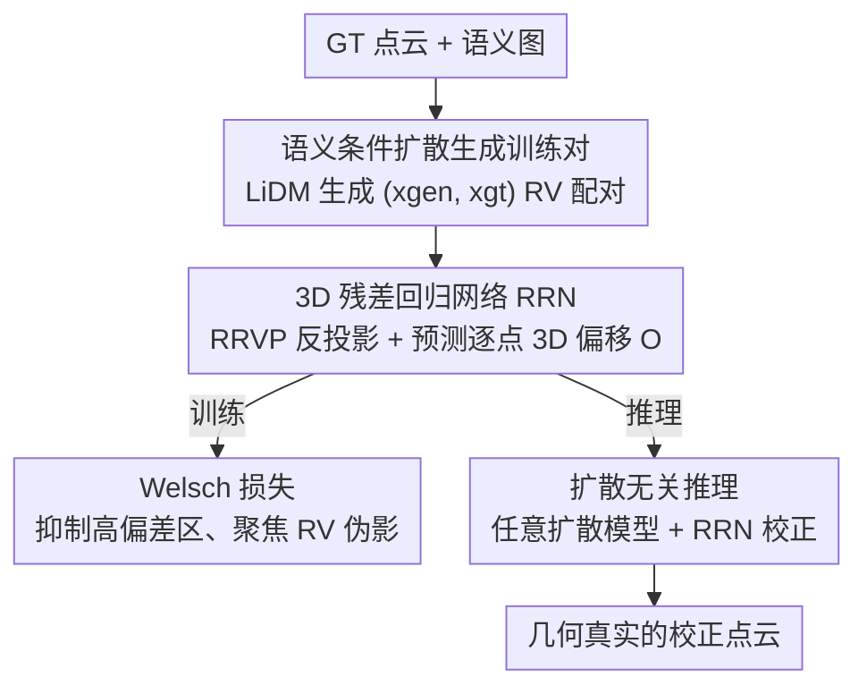

# L3DR: 3D-aware LiDAR Diffusion and Rectification

**会议**: CVPR 2026  
**论文**: [CVF Open Access](https://openaccess.thecvf.com/content/CVPR2026/html/Liu_L3DR_3D-aware_LiDAR_Diffusion_and_Rectification_CVPR_2026_paper.html)  
**代码**: https://github.com/liuQuan98/L3DR  
**领域**: 自动驾驶 / 扩散模型 / 3D视觉  
**关键词**: LiDAR 点云生成, 距离视图扩散, 残差回归, 几何真实感, Welsch 损失

## 一句话总结
L3DR 在距离视图（range-view, RV）LiDAR 扩散生成之后接一个 3D 残差回归网络，专门把反投影回 3D 的点云逐点偏移修正掉「深度溢出」「波浪面」等 RV 伪影，并用 Welsch 损失绕开训练对里的高偏差异常区，以极小的算力开销在 KITTI / KITTI360 / nuScenes / Waymo 上把生成几何真实感刷到 SOTA。

## 研究背景与动机

**领域现状**：自动驾驶感知离不开大规模 LiDAR 点云，但实采成本高，因此用生成模型合成点云成了刚需。主流路线是把 3D 点云投影成 RV 深度图（高=俯仰角、宽=方位角），再套用图像扩散模型（LiDARGen、R2DM、LiDM 等）在 2D RV 上去噪生成，再反投影回 3D。

**现有痛点**：RV 表示虽然让 2D 扩散得以复用，却丢掉了 3D 几何的稀疏性与自遮挡信息。结果生成的点云在 2D 上看着挺真实，反投影回 3D 却充满伪影——边缘处出现错误的深度连续性（depth bleeding，前景车和背景之间冒出假点）；本该平直的墙面被投影成正弦面，扩散又把它平滑成「波浪面」和「圆角」。这些伪影严重破坏 3D 几何真实感。

**核心矛盾**：2D 扩散模型受 Lipschitz 连续性约束，理论上无法产生任意陡峭的空间跳变（作者在 Pilot Study 里给出 Theorem 1：DDIM 输出对输入噪声局部 Lipschitz，空间梯度 $\|\nabla x_0\|\le L$ 有界），所以 2D 模型天生画不出锐利边界；而 3D 模型在 RV 图上的梯度上界 $\|\nabla x_{3d}\|\le L_{3D}\cdot\Delta d$ 随相邻像素深度差 $\Delta d$ 增大而**无界**，因此能造出任意锐利的边界。这就指明了方向：用 3D 网络去「事后纠正」2D 扩散的几何错误。

**本文目标**：在不重训扩散模型、不大幅增加算力的前提下，把已生成 RV 点云的 3D 几何伪影修干净。要解决两个子问题——（1）训练修正网络的数据从哪来？（2）训练数据里夹杂的非伪影错误怎么避免污染学习目标？

**切入角度**：把生成质量问题拆成「全局布局真实感」（2D RV 扩散已做得很好）+「局部几何真实感」（2D 做不好），后者交给一个 3D 残差回归网络专门补救。

**核心 idea**：用一个 3D 网络回归并抵消 RV 扩散点云的逐点 3D 偏移（residual），且只对低幅度的高方差 RV 伪影下手、忽略大幅度的高偏差幻觉区。

## 方法详解

### 整体框架
L3DR 是一个「2D 扩散负责布局 + 3D 网络负责几何」的两阶段训练 + 扩散无关推理框架。**第一阶段**用语义条件 LiDAR 扩散（重训 LiDM）在训练集语义图条件下生成点云，同时收集生成 RV $x_{gen}$ 与对应的真值 RV $x_{gt}$，凑成结构高度相似、却带有真实 RV 伪影的训练配对。**第二阶段**把生成点云反投影回 3D，喂进一个 3D 残差回归网络（Residual Regression Network, RRN）预测逐点 3D 偏移，在 Welsch 损失监督下把伪影回归掉。**推理时**前端扩散模型可以换成任意 LiDAR 扩散方法，RRN 作为通用后处理对其输出做几何校正。

### 关键设计

**1. 语义条件扩散生成训练对：用扩散自身造出「带伪影但对齐」的监督数据**

修正网络要学「把伪影点云改回干净点云」，但 RV 伪影出现得很不规则、没有显式分布，没法像普通扩散那样靠加噪声造数据。作者的办法是重训一个 SOTA 条件扩散模型 LiDM：先用 VQ-VAE 把 RV 图压到隐空间，再用扩散 UNet 预测隐空间噪声，并把下采样的语义颜色图拼进隐空间作为控制条件。收敛后，对每个训练样本采集真值 $x_{gt}$ 和生成结果 $x_{gen}$。之所以选 LiDM，是因为它生成的点云在大部分区域和 GT 贴得很近、只在小尺度上残留 RV 伪影——这恰好是「结构相似、仅差伪影」的理想配对。作者强调框架并不绑死 LiDM，任何能产出这种近似配对的扩散方法都行。

**2. 3D 残差回归网络 RRN：在 3D 空间逐点回归偏移、并约束到径向**

这是把 2D 几何错误搬到 3D 去修的核心。先用无损的反距离视图投影 RRVP 把生成 RV 反投影成点云 $P_{gen}=\mathrm{RRVP}(x_{gen})$（RRVP 无损、RVP 有损，因为多点可能投到同一像素）。再用一个 3D 主干 $F:\mathbb{R}^{N\times k}\to\mathbb{R}^{N\times 3}$ 预测 3D 偏移 $O=F(P_{gen})$（$k=3$ 仅坐标；$k=6$ 时额外吃语义颜色图）。关键一步是把偏移投影到每个点的径向方向，得到最终残差 $\hat{O}=P_{gen}\,\mathrm{diag}(P_{gen}O^\top)/\sqrt{\mathrm{diag}(P_{gen}P_{gen}^\top)}$，再 $P_{ref}=P_{gen}+\hat{O}$。用 3D 网络（稀疏卷积 / 局部注意力）而非 2D 的理由正来自 Pilot Study：3D 算子的有效感受野定义在 3D 空间，当相邻像素深度差够大时它俩落在感受野之外，于是能生成任意锐利的边界，从根上修复 2D 扩散造不出的陡峭几何。

**3. Welsch 损失：用偏差-方差分解绕开高偏差幻觉区**

训练对里其实混着两类误差：高方差误差就是我们要修的 RV 伪影（幅度小）；高偏差误差则是语义约束不足导致的「连贯但错误的幻觉」——比如一整面墙被理解成斜的、一棵树被放到远处，整块同语义区域一致地偏移（幅度大）。若直接用 L1/L2 回归残差，网络会被大幅度的高偏差区主导，反而忽略真正要修的局部几何。Welsch 损失利用「伪影幅度远小于偏差幅度」这一点做软分离：定义 Welsch 函数 $\psi_\nu(x)=1-\exp\!\big(-x^2/(2\nu^2)\big)$（一条倒置钟形曲线，$\nu$ 控制宽度），损失为 $\mathcal{L}_{RRN}=\mathrm{mean}\big(\psi_\nu(\mathrm{RVP}(P_{gen}+\hat{O})-x_{gt})\big)$。残差越大，$\psi_\nu$ 越饱和趋近 1、梯度趋近 0，于是大偏差区被自动「放过」，网络专注在小幅度伪影上回归。$\nu$ 一次选定后全数据集固定。

**4. 扩散无关推理：RRN 作为可插拔的通用几何后处理**

由于 RRN 学到的是「如何去掉 RV 伪影」这一与具体扩散模型无关的能力，推理阶段前端扩散可任意替换。流程是：用任意 LiDAR 扩散生成 $x'_{gen}$、RRVP 反投影成 $P'_{gen}$、按同样的径向投影算出残差 $\hat{O}'$、输出 $P'_{ref}=P'_{gen}+\hat{O}'$。实验证明，即便 RRN 只在 LiDM 的语义条件数据上训练，也能泛化到未见过的无条件扩散网络，把它当成「即插即用」的几何精修模块。

### 损失函数 / 训练策略
RRN 的唯一回归损失即上述 Welsch 损失 $\mathcal{L}_{RRN}$。主干默认用 SPUNet（也试了 PTV3），RV 图尺寸对 64 线 KITTI/Waymo 取 $(64,1024)$；32 线 nuScenes 直接用 $(32,1024)$ 会发散，作者「过度配置」成 $(64,1024)$ 来稳住训练动力学，并假设足够大的图像尺寸对训练稳定至关重要。全部网络在 4×RTX 4090 24G 上训到 150 epoch。

## 实验关键数据

评测指标：**FSVD / FPVD**（Fréchet Sparse/Point-Voxel Distance，感知质量，越低越好）、**JSD**（Jensen-Shannon 散度，分布差异）、**MMD**（Minimum Matching Distance，最小匹配距离），全部越低越好。

### 主实验

KITTI360 无条件 + nuScenes/Waymo 语义条件生成（节选，灰区为与基线直接对比）：

| 数据集 / 任务 | 方法 | FSVD↓ | FPVD↓ | JSD↓ | MMD×10⁻⁴↓ |
|--------|------|------|------|------|------|
| KITTI360 无条件 | R2DM | 36.8 | 30.9 | 0.168 | 2.92 |
| KITTI360 无条件 | **Ours-R2DM** | 35.9 | 28.2 | 0.165 | 2.90 |
| KITTI360 无条件 | LiDM | 38.8 | 29.0 | 0.211 | 3.84 |
| KITTI360 无条件 | **Ours-LiDM** | 35.8 | 26.1 | 0.182 | 3.27 |
| nuScenes 语义条件 | LiDM | 86.6 | 74.8 | 0.145 | 2.81 |
| nuScenes 语义条件 | **Ours-LiDM-Sem** | 81.3 | 67.0 | 0.133 | 2.72 |
| Waymo 语义条件 | LiDM | 21.4 | 21.9 | 0.104 | 1.30 |
| Waymo 语义条件 | **Ours-LiDM-Sem** | 18.3 | 20.3 | 0.086 | 1.25 |

在 LiDM 上 FPVD 提升约 10%、JSD 提升约 13.7%；接 R2DM 这种非隐空间扩散同样有效（JSD 提 1.8%），说明框架对不同扩散后端的普适性。nuScenes/Waymo 语义条件生成全指标平均改善 11.6% / 7.0%。SemanticKITTI 语义条件下，加语义图输入的 Ours-Sem 把 MMD 一口气拉高约 52.5%。

### 消融实验

SemanticKITTI 上对主干、损失、RRN 语义输入、2D vs 3D 的消融（JSD×10⁻²、MMD×10⁻⁵）：

| 主干 | 损失 | RRN 语义输入 | FSVD↓ | FPVD↓ | JSD↓ | MMD↓ |
|------|------|------|------|------|------|------|
| /（基线扩散） | / | - | 18.3 | 15.3 | 7.1 | 16.2 |
| SPUNet | Welsch | - | 16.4 | 12.1 | 6.7 | 16.7 |
| SPUNet | MSE | - | 26.3 | 25.1 | 7.0 | 12.6 |
| SPUNet | Welsch | ✓ | **12.5** | 10.7 | 6.7 | 15.0 |
| PTV3 | MSE | - | 42.4 | 42.6 | 7.4 | 18.8 |
| 2D UNet | Welsch | - | 19.2 | 16.4 | 7.1 | 16.3 |

### 关键发现
- **损失选择最致命**：把 Welsch 换成 MSE，FSVD/FPVD 从 16.4/12.1 直接翻倍到 26.3/25.1（PTV3 更崩到 42.4/42.6），说明绕开高偏差区是性能的关键来源，否则修正网络反而比不修还差。
- **必须是 3D 网络**：把 3D UNet 换成 2D 图像 UNet（19.2/16.4）甚至劣于基线（18.3/15.3），印证了 Pilot Study 的理论——只有 3D 算子才能造出锐利边界。
- **语义输入再加一档**：SPUNet+Welsch 加语义图把 FSVD 进一步压到 12.5，是全表最佳组合，故被定为默认配置。
- **算力近乎免费**：在 RTX 4090 上 RRN 只多 19.65 ms（扩散采样本身 >550 ms）、多 37.9 M 参数（LiDM 本体 257.77 M），后处理开销可忽略。

## 亮点与洞察
- **先证后做**：用 Lipschitz 连续性给「2D 扩散为什么画不出锐边、3D 网络为什么能」一个理论上界（Theorem 1 + Corollary 2），再用 RV 梯度分布的实测 JSD（0.222→0.176）做经验验证，方法动机不是拍脑袋而是有据可循。
- **Welsch 损失迁移性强**：把鲁棒统计里的「软离群抑制」搬来区分高偏差幻觉 vs 高方差伪影，本质是一个对幅度敏感的自适应加权，可直接用到任何「监督信号里夹着不可信大误差」的回归任务（如深度补全、法向回归）。
- **残差 + 径向投影**很巧妙：不直接回归坐标而回归偏移、再约束到径向，既保留了 RV 的物理含义又缩小了学习空间，是它能用极小网络拿下几何真实感的原因之一。
- **即插即用定位务实**：把自己定位成「任意 LiDAR 扩散的几何后处理」，无需重训前端，落地友好。

## 局限与展望
- **数据质量受限于前端扩散**：RRN 训练对完全由 LiDM 生成，若前端扩散在某些场景系统性失真，RRN 学到的「修正先验」可能跟着偏。
- **高偏差区只是被忽略、并未被修**：Welsch 损失绕开大偏差幻觉，意味着那些「整面墙画斜了」的语义级错误 L3DR 并不纠正，只保证局部几何更真——全局语义幻觉仍需前端扩散自己解决。
- **MMD 并非全面领先**：无条件生成上 MMD 未夺冠（仅平均 +7.3%，逊于 ProjectedGAN 的 2.88），说明在某些分布匹配指标上仍有空间。
- **nuScenes 训练不稳**：32 线必须「过配」成 64 线 RV 才能收敛，作者只给了假设性解释（图像尺寸影响训练动力学），稳定性机理⚠️ 以原文为准。

## 相关工作与启发
- **vs LiDM / R2DM / LiDARGen（RV 扩散）**：它们都在 2D RV 上直接生成，受 Lipschitz 约束画不出锐利 3D 几何；L3DR 不替代它们而是接在后面做 3D 残差精修，故能即插即用地普涨各家指标。
- **vs LidarDM / DynamicCity / UniScene（3D 表示重采样）**：这类先建 mesh/occupancy 表示再光线投射采样 LiDAR，视觉与时序一致性强但极其吃资源；L3DR 选择保留轻量 RV 扩散、只用一个小 3D 网络补几何，在质量与算力间取了更经济的折中。

## 评分
- 新颖性: ⭐⭐⭐⭐ 「2D 生成 + 3D 残差精修」的解耦视角配上 Lipschitz 理论分析很扎实，但残差回归与鲁棒损失各自都是成熟工具的组合。
- 实验充分度: ⭐⭐⭐⭐⭐ 覆盖 4 个数据集、无条件/条件两种任务、多扩散后端 + 完整消融 + 算力分析，证据链完整。
- 写作质量: ⭐⭐⭐⭐ Pilot Study 先理论后实证的结构清晰，但 nuScenes 过配等工程细节解释偏弱。
- 价值: ⭐⭐⭐⭐ 即插即用、近零开销，对 LiDAR 数据合成是实用的几何精修组件。

<!-- RELATED:START -->

## 相关论文

- [\[CVPR 2026\] Structure-to-Intensity Diffusion for Adverse-Weather LiDAR Generation](structure-to-intensity_diffusion_for_adverse-weather_lidar_generation.md)
- [\[CVPR 2026\] TACO: Task-Aware Contrastive Learning for Joint LiDAR Localization and 3D Object Detection](taco_task-aware_contrastive_learning_for_joint_lidar_localization_and_3d_object_.md)
- [\[CVPR 2026\] Points-to-3D: Structure-Aware 3D Generation with Point Cloud Priors](points-to-3d_structure-aware_3d_generation_with_point_cloud_priors.md)
- [\[CVPR 2026\] U4D: Uncertainty-Aware 4D World Modeling from LiDAR Sequences](u4d_uncertainty-aware_4d_world_modeling_from_lidar_sequences.md)
- [\[CVPR 2026\] LiDAR-to-4DRadar Diffusion Bridge via Cross-Modal Alignment and Translation in Latent Space](lidar-to-4dradar_diffusion_bridge_via_cross-modal_alignment_and_translation_in_l.md)

<!-- RELATED:END -->
