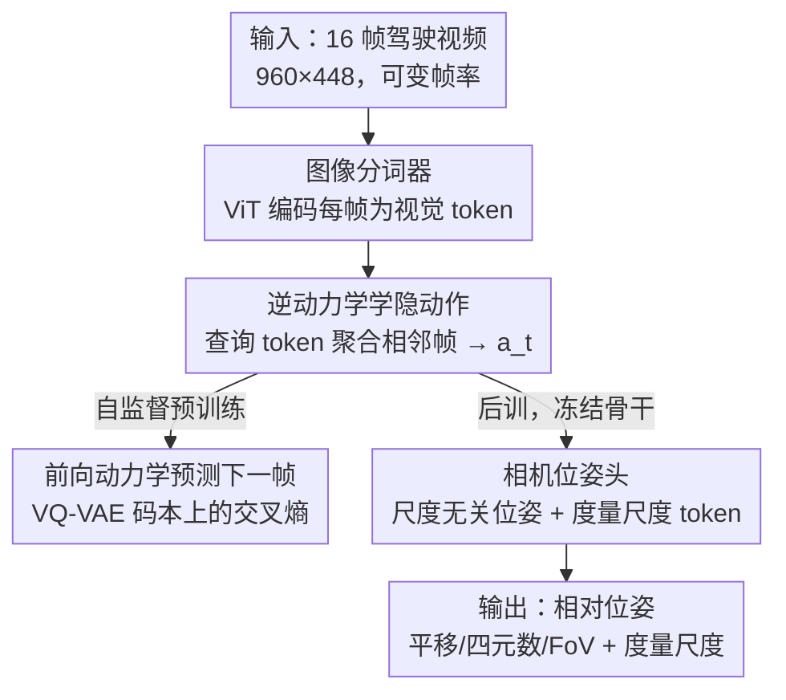

# LA-Pose: Latent Action Pretraining Meets Pose Estimation

**会议**: CVPR 2026  
**论文**: [CVF Open Access](https://openaccess.thecvf.com/content/CVPR2026/html/Wang_LA-Pose_Latent_Action_Pretraining_Meets_Pose_Estimation_CVPR_2026_paper.html)  
**代码**: 无  
**领域**: 自动驾驶 / 相机位姿估计  
**关键词**: 自监督预训练、隐动作、逆动力学、相机位姿、自车运动

## 一句话总结
LA-Pose 把 Genie 式"逆动力学隐动作"从驱动世界模型/机器人策略的本职工作里挪出来，改当相机位姿估计的输入特征——先在 1000 万条无标注驾驶视频上自监督学隐动作，再用极少量带 3D 标注的数据后训一个轻量位姿头，在 Waymo/PandaSet 上用少几个数量级的标注数据反而比 VGGT 等前馈 SOTA 高 10%+ 的位姿精度。

## 研究背景与动机

**领域现状**：前馈式 3D 重建（DUSt3R、VGGT、Rig3R、MapAnything）正快速进步，能一次前向直接预测结构和相机位姿，精度很高。但它们全都吃 3D 标注——来自 SfM、LiDAR 或仿真引擎的位姿真值，需要昂贵硬件和精细标定。

**现有痛点**：高质量 3D 标注只在少数精心整理的数据集里有，规模相比网络上海量的无标注驾驶视频小得可怜。监督数据已经成了瓶颈，但奇怪的是——在文本/图像/视频领域掀起革命的"自监督预训练"范式，几乎没人拿来做相机位姿这类几何感知任务。

**核心矛盾**：要么用大规模无标注视频但缺位姿监督信号，要么用带标注数据但规模上不去、还继承其分布偏差。VGGT 这类方法被训练分布死死框住（VGGT 要 64 块 A100 训 9 天），泛化到新场景就掉。

**本文目标**：在保持前馈测试时简洁性的前提下，高效利用大规模无标注驾驶视频来做相机位姿估计，把对昂贵 3D 标注的依赖降几个数量级。

**切入角度**：作者注意到——对车辆而言，运动就是动作的直接结果。Genie 用逆动力学从相邻帧间推断出的"隐动作（latent action）"本质上编码了帧间运动变化，也就是位姿的压缩表示。既然隐动作天然刻画自车运动，何不直接拿它当位姿估计的输入？

**核心 idea**：不把隐动作用于它的"本职"（世界模型的动作条件、机器人策略的动作代理），而是 repurpose 成位姿估计的运动中心特征——自监督预训练学隐动作 + 少量标注后训一个位姿头，用预训练替代昂贵 3D 监督。

## 方法详解

### 整体框架
LA-Pose 是个两阶段框架。**阶段一（隐动作预训练）**：基于 Genie 架构（但为位姿目标做了简化），用逆动力学模型从相邻视频帧学隐动作、用前向动力学模型借隐动作预测下一帧 token，整个过程完全自监督，在 1020 万条无标注驾驶视频片段上训练。**阶段二（相机位姿后训）**：丢掉前向动力学模型，把一个轻量位姿头接到预训练好的逆动力学编码器上，用极少量带高质量 3D 真值的标注数据后训，预测相对相机位姿（平移、四元数旋转、视场角）和度量尺度。关键点是后训时**冻结**逆动力学骨干（而非微调），以保住预训练学到的运动先验、获得更好泛化。

### 关键设计

**1. 隐动作瓶颈压缩：用小维度逼自监督特征"只编码运动、不编码外观"**

逆动力学模型在 Genie 的 ST-Transformer 因果编码器上加了一个关键改造：引入 1536 维可学查询 token，每帧重复一份，组成 $\{q_1,\dots,q_{T-1}\}$，输出即隐动作 $\{a_1,\dots,a_{T-1}\}$，每个查询 token 聚合相邻两帧信息当作隐动作代理（因果掩码让 $a_t$ 能看到 $t+1$ 帧）。更重要的是在瓶颈处加了一对三层 MLP，把隐动作维度从 1536 压到 **50** 再解压回 1536。这个压缩看似有损，却是位姿质量的命门：大维度隐空间（1536-D）预训练重建损失更低（因为它直接编码了稠密运动流和外观线索，让前向预测更容易），但这恰恰造成**信息泄漏**——隐动作里混进了外观，对自车运动的抽象变弱，反而损害下游位姿。小维度（50-D）预训练损失更高，却逼出紧凑的、运动中心的表示，迁移到位姿估计更有效。这是"自监督代理任务做得太好反而有害"的一个生动反例。

**2. 自监督逆-前向动力学预训练：从无标注驾驶视频学位姿先验，无需任何 3D 标签**

针对"3D 标注是瓶颈"的痛点，作者让前向动力学模型用 ST-Transformer 借隐动作预测未来帧，但做了两处简化：把最后的 MLP 头换成 4 个轻量 transformer block 作用于解码器状态；预测目标用**预训练好的 VQ-VAE 码本**——真值未来帧先被冻结的 VQ-VAE 编码器编成离散码，模型在同一码本上预测下一帧的 logit，预训练损失就是预测 logit 与真值码索引间的交叉熵。这样整个预训练只需原始视频、不碰任何位姿真值，能在 1020 万驾驶片段（覆盖多样环境、车流密度、天气）上做内容尺度的运动监督。

**3. 尺度解耦的位姿头：把度量尺度从尺度无关表示里单独拎出来预测**

隐动作编码的是相对运动，但相对位姿里"度量尺度"是个难学的因子。作者借鉴尺度解耦思路：先把真值度量运动转成相对运动 $\{t_1,\dots,t_T\}$，算平均平移幅值 $s=\mathrm{mean}_i(\|t_i\|_2)$ 当度量尺度，再归一化得尺度无关相对运动 $\tilde{t}_i=t_i/\max(s,\epsilon)$（$\epsilon=1$ 保数值稳定），且因为训练时帧率在变（1–4fps 抖动），归一化是按给定帧率分别做的。位姿头引入一个单独的可学度量尺度 token，与 15 个隐动作 token 一起过非因果自注意力 transformer，让尺度 token 跨序列聚合信息；解码输出经两个独立 MLP 头：一个出 7D 相对位姿（3D 平移 + 4D 四元数）加 1D 视场角，另一个出标量度量尺度（指数激活保正、稳训练）。后训损失是归一化平移、四元数、视场角、对数尺度上的 L1。

### 损失函数 / 训练策略
预训练损失为预测 logit 与 VQ-VAE 真值码索引间的交叉熵；后训损失为四项 L1（归一化平移、四元数旋转、视场角、对数空间度量尺度），逆动力学组件可冻结或微调（默认冻结）。预训练在 32 块 H100、global batch 64、cosine 调度跑 160k 步（约四天）；后训只用 Waymo/nuScenes/Argoverse 的少量高质量标注数据（分别 750/850/700 场景），在 8 块 H100 上 100k 步（约两天）。训练样本为单前向相机的 16 连续帧，帧率在 1–4fps 间随机抖动以学短/长时运动动态。作者强调其算力远低于竞品（VGGT 要 64 块 A100 训 9 天）。

## 实验关键数据

### 主实验
在 Waymo Open（域内）和 PandaSet（零样本未见）两个驾驶基准上评测。指标：**AUC@5**（所有帧对相对旋转+平移角误差累积曲线在 5° 阈下的面积，越高越好，反映整体位姿精度）；**ATE-S**（尺度无关对齐轨迹误差 RMSE，轨迹归一化到单位平均幅值并做 SE(3) 全局对齐后算，越低越好）；**ATE-M**（不归一化的度量尺度 ATE，仅当基线给度量预测时报，越低越好）。对比 Rig3R、VGGT、MapAnything——它们都用了比 LA-Pose 多得多的监督 3D 数据。

| 数据集 | 方法 | AUC@5↑ (%) | ATE-S↓ (×10⁻²) | ATE-M↓ (m) |
|--------|------|------------|-----------------|-------------|
| Waymo | Rig3R | 77.9 | 3.17 | - |
| Waymo | VGGT | 74.8 | 1.43 | - |
| Waymo | MapAnything | 65.0 | 3.00 | 4.74 |
| Waymo | **LA-Pose** | **91.4** | **1.20** | **0.88** |
| PandaSet（未见） | VGGT | 75.0 | **0.99** | - |
| PandaSet（未见） | MapAnything | 62.4 | 2.75 | 7.28 |
| PandaSet（未见） | **LA-Pose** | **86.3** | 1.13 | **0.86** |

Waymo 上 LA-Pose AUC@5 达 91.4%，大幅超过所有基线；零样本 PandaSet 上仍保持 86.3% 的强泛化（ATE-S 与 VGGT 的 0.99 接近，1.13）。两基准上都比近期前馈方法高 10%+ 位姿精度。AUC@5 的分布分析还显示 LA-Pose 不仅均值高、方差也显著更小，大多数样本贴近完美精度，而 VGGT 有一条低分长尾——说明 LA-Pose 在多样场景下更稳定可靠，而非只在简单序列上突出。即便在雨、夜、雾、急转弯等困难样本上，LA-Pose 仍产出稳定且几何连贯的轨迹。

### 消融实验
| 消融维度 | 配置 | 关键指标 | 结论 |
|----------|------|----------|------|
| 隐动作维度（Tab. 2，Waymo） | 50-D | 预训练损失@200k 1.67；AUC@5 85.4；ATE-M **1.62** | 压缩促运动中心表示 |
| 隐动作维度 | 1536-D | 预训练损失@200k **1.15**；AUC@5 86.5；ATE-M 1.94 | 重建更好但信息泄漏，ATE-M 反劣 |
| 冻结 vs 微调骨干（Fig. 5） | 冻结（默认） | Waymo 与微调相当；PandaSet 显著更好 | 冻结保住运动先验、泛化强 |
| 冻结 vs 微调 | 微调 | 零样本 PandaSet 明显退化 | 微调过拟合到后训分布 |
| 帧率鲁棒（Tab. 3，4.0fps） | LA-Pose / VGGT | AUC@5 **93.4** / 74.1；ATE-S **0.87** / 1.03 | 各帧率均稳超 VGGT |
| 帧率鲁棒（1.0fps） | LA-Pose / VGGT | AUC@5 **85.7** / 74.6；ATE-S **1.16** / 1.43 | 低帧率下精度仍稳 |

### 关键发现
- **压缩是关键、且和直觉相反**：50-D 隐动作预训练损失更高，却在冻结骨干后拿到几乎相同的 AUC@5、显著更好的 ATE-M——"重建做得好"不等于"运动表示好"，强压缩反而增强运动感知和度量尺度一致性。
- **冻结 > 微调（在泛化上）**：域内 Waymo 上两者相当，但零样本 PandaSet 上微调明显退化，说明预训练学到的运动先验很宝贵、不该被少量后训数据带偏。
- **鲁棒性来自预训练而非刻意采样**：后训数据以简单直行序列为主、没专门采样罕见情况，但模型在雨/夜/雾/急转弯下仍稳——这种鲁棒性自然从大规模自监督预训练涌现。

## 亮点与洞察
- **最"啊哈"的一点是 repurpose 视角**：隐动作本是给世界模型/机器人策略当动作条件的，作者反手把它当几何感知特征——因为"车辆运动 = 动作的直接结果"，隐动作天然就是自车位姿的压缩表示。这种把现成自监督表示挪到新任务的思路非常巧。
- **瓶颈维度当作正则旋钮**很值得借鉴：用一个 50-D MLP 瓶颈强行剥离外观、逼出运动中心表示，把"代理任务做太好反而有害"这件事变成可控设计参数。
- **冻结骨干换泛化**的发现对所有"大规模预训练 + 小数据后训"范式都有参考意义：少量标注后训容易把通用先验带偏，冻结是保住泛化的简单有效手段。
- 这套"无标注视频自监督预训练 → 少量监督后训位姿头"的配方，作者明确指出可推广到驾驶之外的具身视频（多智能体、多环境、多相机配置），有望学出跨域可迁移的通用几何先验。

## 局限与展望
- 作者承认：**罕见运动（如倒车）精度下降**——这类场景在监督后训数据里欠表示，导致位姿不稳（虽然预训练骨干仍能给出部分连贯轨迹）。
- ⚠️ 预训练用的是 1020 万条**内部/专有**驾驶视频，无法复现；且仅评测两个驾驶基准、单前向相机，多相机/非驾驶域的有效性未直接验证。
- 度量尺度依赖后训阶段的 LiDAR 标定真值，纯自监督仍拿不到绝对尺度；ATE-M 在零样本 PandaSet 上虽好但样本量有限（185 评测样本）。
- 改进方向：扩大预训练数据以覆盖倒车等罕见运动；把方法推到 in-the-wild 具身视频学通用几何先验；探索多相机/多模态的隐动作。

## 相关工作与启发
- **vs 前馈 3D 重建（DUSt3R / VGGT / Rig3R / MapAnything）**：它们靠大规模监督 3D 标注直接回归位姿/点云，被训练分布框住、算力昂贵；LA-Pose 同样前馈测试时简洁，但用大规模无标注视频自监督预训练替代昂贵监督，标注用量少几个数量级仍更准更稳。
- **vs Genie 及其机器人后续（latent action 用于策略/世界模型）**：Genie 把隐动作当可控视频生成的动作条件、机器人工作把它当动作代理；LA-Pose 既不做生成也不做强化学习，而是把隐动作当结构化自监督的自车运动表示用于位姿。
- **vs 自监督位姿/光度方法**：早期自监督位姿工作多为新视角合成设计、强调光度重建精度、且不做大规模预训练；LA-Pose 把预测式自监督引入相机位姿，学到几何感知表示并弥合"时序预测建模 ↔ 精确自车位姿"的鸿沟。

## 评分
- 新颖性: ⭐⭐⭐⭐⭐ 首次证明逆动力学自监督对位姿估计有效，repurpose 隐动作的视角很原创。
- 实验充分度: ⭐⭐⭐⭐ 两驾驶基准 + 维度/冻结/帧率三组扎实消融，但仅驾驶域、单相机、预训练数据不可复现。
- 写作质量: ⭐⭐⭐⭐ 动机链条清晰，"压缩反直觉提升位姿"的分析很有说服力。
- 价值: ⭐⭐⭐⭐ 把 3D 标注瓶颈换成无标注视频，对可扩展几何感知有明确启发，但绝对尺度仍依赖标定真值。

<!-- RELATED:START -->

## 相关论文

- [\[CVPR 2026\] PTC-Depth: Pose-Refined Monocular Depth Estimation with Temporal Consistency](ptc-depth_pose-refined_monocular_depth_estimation_with_temporal_consistency.md)
- [\[CVPR 2026\] EMDUL: Expanding mmWave Datasets for Human Pose Estimation with Unlabeled Data and LiDAR Datasets](expanding_mmwave_datasets_for_human_pose_estimation_with_unlabeled_data_and_lida.md)
- [\[CVPR 2026\] Towards Balanced Multi-Modal Learning in 3D Human Pose Estimation](towards_balanced_multi-modal_learning_in_3d_human_pose_estimation.md)
- [\[CVPR 2026\] VIRD: View-Invariant Representation through Dual-Axis Transformation for Cross-View Pose Estimation](vird_view-invariant_representation_through_dual-axis_transformation_for_cross-vi.md)
- [\[CVPR 2026\] SG-NLF: Spectral-Geometric Neural Fields for Pose-Free LiDAR View Synthesis](sgnlf_spectralgeometric_neural_fields_for_posefre.md)

<!-- RELATED:END -->
